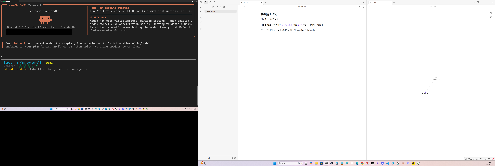
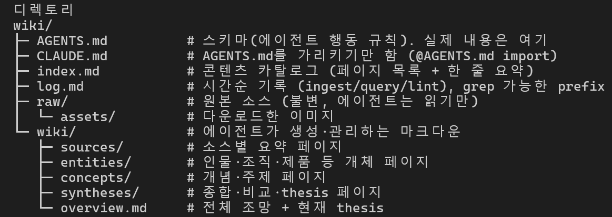
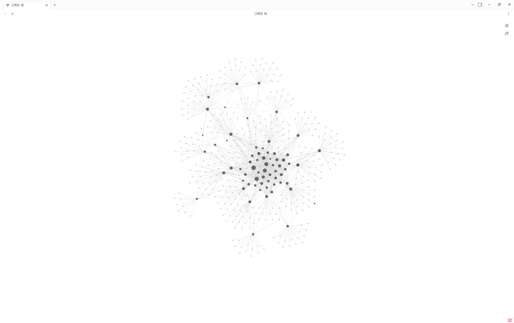
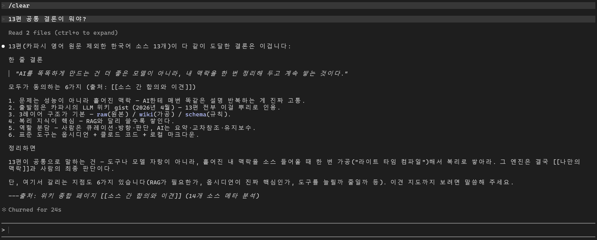

앞 글에서 LLM Wiki가 뭔지 간단하게 알아봤다. 카파시가 4월에 던진 패턴, raw에 원본을 쌓아두면 AI가 읽어 위키로 정리하고 교차참조까지 걸어주는 구조, 그리고 ingest · query · lint라는 세 동작. 개념은 거기서 충분히 풀었으니 이번 글은 직접 만들어 본다.

LLM Wiki는 거창하게 구현할 필요가 없다. 벡터DB를 깔거나 검색 엔진을 붙이는 게 아니라, 옵시디언과 에이전트 하나만 가지고 가볍게 위키 하나를 세워 보는 정도다. 문턱이 낮다는 걸 보여주는 게 이 글의 목적이라, 따라 하다가 "어 별거 아니네" 싶어지면 성공이다.

마침 손에 좋은 재료가 있다. LLM 위키를 공부하면서 유튜브 영상을 여러 편 찾아보고 그때그때 AI로 정리해 글로 남겨 뒀는데, LLM 위키 · 세컨드 브레인을 다룬 영상 13편 정리글이 한 폴더에 쌓여 있다. raw에 들어가는 건 영상도 날것 대본도 아니라 이렇게 AI로 한 번 정리해 둔 글이다. 이미 마크다운이라 따로 다듬을 것도 없이 바로 던질 수 있으니, 체험 삼아 이걸로 위키를 한번 세워 본다.

## 준비물

필요한 건 옵시디언과 에이전트 하나뿐이다. 파일을 직접 읽고 쓰는 에이전트면 되는데, 여기서는 클로드 코드를 쓴다. 코덱스(Codex)를 비롯한 다른 에이전트로 해도 똑같다. 설치법은 검색하면 바로 나오니 넘어간다.

왜 옵시디언을 사용할까? 위키는 결국 마크다운 파일 더미라 사실 아무 편집기로도 열린다. 옵시디언이 하는 일은 그 파일들을 사람이 보기 좋게 비춰 주는 쪽이다. 대괄호로 건 링크를 타고 페이지 사이를 넘나들게 하고, 페이지들이 어떻게 얽혔는지 그래프로 펼쳐 보여준다. 카파시의 비유를 빌리면 옵시디언이 IDE, 에이전트가 프로그래머, 위키가 코드베이스다. 읽고 쓰고 정리하는 실제 일은 에이전트가 하고, 옵시디언은 그 결과를 들여다보는 창인 셈이다.

세팅이라고 할 것도 별로 없다. 폴더 하나를 만들어 옵시디언에서는 볼트(vault)로 열고, 에이전트도 그 같은 폴더에서 띄우면 된다. 둘이 같은 폴더를 보고 있어야 에이전트가 만들거나 고친 파일이 옵시디언 화면에 그대로 비친다. 클로드 코드를 터미널에서 쓰든 VS Code에서 쓰든 상관없고, 옵시디언에 터미널 플러그인을 깔면 옵시디언 창 안에서 바로 열어 띄울 수도 있다.



## 만들어보기

직접 폴더를 손으로 파지 않는다. 카파시가 공개한 LLM 위키 gist를 클로드 코드에 그대로 던지고, 내 사정만 한 줄 보태면 된다. gist 링크를 걸어 "이 패턴으로 나만의 지식 위키를 만들어 줘"라고 하고, 그 아래에 도메인을 적었다. LLM 위키를 공부하며 유튜브 영상을 AI로 정리해 둔 글이 있고, 그 글들을 raw에 넣어 위키로 만들 거라고.

엔터를 누르면 클로드가 구조를 한 번에 깔아 준다. 실제로 던졌더니 아래 트리가 나왔다.



## 구조 뜯어보기

앞 글에서 본 3계층(raw · wiki · 규칙 파일)이 이 트리에 그대로 들어 있다.

- **raw/ (원본, 불변)**

  내가 모은 원본을 손 안 댄 그대로 두는 곳이다. 에이전트는 여기를 읽기만 하고 고치지 않는다. 원본이 바뀌면 위키 전체의 신뢰가 깨지기 때문이다.

- **wiki/ (에이전트가 채우는 페이지)**

  에이전트가 소스를 읽고 만들어 채우는 페이지들이다. 통째로 에이전트 소유라 사람은 읽고 에이전트가 쓴다. 안을 열어 보면 클로드가 자료 성격에 맞춰 갈래까지 나눠 뒀다. 소스별 요약(sources), 인물이나 제품 같은 개체(entities), 개념과 주제(concepts), 여러 글을 엮은 종합(syntheses), 전체 조망(overview)으로 갈린다. 이 다섯 갈래가 LLM 위키의 정해진 표준은 아니다. 다루는 주제나 위키 종류가 다르면 폴더 구성도 달라진다.

- **AGENTS.md · CLAUDE.md (규칙 파일)**

  맨 위 AGENTS.md가 규칙 파일이다. 위키를 어떤 형식으로 쓰고, 소스를 받을 때와 질문할 때와 점검할 때 어떤 순서로 일할지를 적어 둔다. 이 한 장이 있어서 에이전트가 잡담하는 챗봇이 아니라 위키 관리자로 움직인다. 그 옆 CLAUDE.md는 규칙을 또 적은 게 아니라 AGENTS.md를 가리키는 한 줄(@AGENTS.md)이 전부다.

- **index.md · log.md (길잡이)**

  클로드가 곁들여 깔아 준 두 파일이다. index.md는 모든 페이지를 한 줄 요약과 함께 적어 둔 목차, log.md는 언제 뭘 했는지 시간순으로 쌓는 기록이다. 둘 다 에이전트가 알아서 채우고 갱신한다.

트리가 제법 빽빽해 보여도 사람이 실제로 손대는 건 결국 AGENTS.md 한 장이다. raw에는 자료만 넣으면 되고, 나머지는 에이전트가 알아서 채운다.

## AGENTS.md에 뭘 적을까

앞 글에서 "규칙 파일이 위키의 핵심"이라고 했는데, 그렇다고 사람이 맨바닥부터 규칙을 작문하는 건 아니다. gist를 던질 때 에이전트가 AGENTS.md 초안까지 같이 깔아 준다. 손이 제일 많이 가는 파일이라고는 해도, 처음부터 짜내는 게 아니라 나온 초안을 다듬는 쪽이다. 이번에 깔린 AGENTS.md 전문이 이거다. 길어서 접어 뒀다.

<details>
<summary>AGENTS.md 전문 펼쳐 보기</summary>

````markdown
# 리서치 위키 — 운영 스키마

이 볼트는 **리서치/딥다이브용 LLM 위키**다. 네가(에이전트) 위키를 쓰고 유지한다. 사람은 소스를 고르고, 방향을 잡고, 질문한다. 아래 규칙을 지켜 일관성을 유지할 것.

## 3개 레이어

- **raw/** — 원본 소스(기사·논문·리포트·이미지). **불변. 읽기만 하고 절대 수정하지 않는다.** 진실의 출처.
- **wiki/** — 네가 생성·관리하는 마크다운 페이지. 요약·개체·개념·종합. 이 레이어는 전적으로 네 소유다.
- **스키마(이 파일)** — 구조·컨벤션·워크플로 정의. 사람과 함께 시간이 지나며 다듬는다.

## 디렉토리 구조

```
raw/            원본 소스 (불변)
  assets/       다운로드한 이미지
wiki/
  sources/      소스 1개 = 페이지 1개 (요약)
  entities/     인물·조직·제품·논문 등 개체
  concepts/     개념·주제·방법론
  syntheses/    비교·종합·현재 thesis
  overview.md   전체 조망 + 현재 thesis 요약
index.md        콘텐츠 카탈로그 (페이지 목록)
log.md          시간순 기록 (append-only)
```

## 페이지 컨벤션

**모든 위키 페이지는 YAML frontmatter로 시작한다:**

```yaml
---
title: 페이지 제목
type: source | entity | concept | synthesis
tags: [태그1, 태그2]
created: YYYY-MM-DD
updated: YYYY-MM-DD
sources: [관련 소스 페이지명] # source 타입은 대신 아래 필드 사용
---
```

source 타입 페이지는 frontmatter에 `author`, `date`, `url`(또는 `path`)를 추가한다.

**작성 언어 — 한국어.**

- 모든 위키 페이지는 한국어로 작성한다. 영어 소스도 한국어로 요약한다.
- 고유명사·기술용어·핵심 인용 원문은 원형을 병기한다. 예: "트랜스포머(Transformer)", "어텐션 메커니즘(attention mechanism)".
- 사람이 읽기 편한 게 1순위. 추상적 요약보다 구체적 사실(수치·날짜·주장)을 남긴다.

**위키링크 `[[ ]]`.**

- 다른 페이지를 언급하면 항상 `[[페이지명]]`으로 링크한다.
- 아직 없는 페이지를 가리키는 링크도 OK — 만들 가치가 있는 페이지를 표시하는 것.
- 모든 페이지는 최소 1개의 inbound 링크를 가져야 한다(고아 페이지 금지).

**인용.** 위키의 모든 주장은 출처를 명시한다. `[[소스페이지]]` 또는 원문 url로 추적 가능해야 한다.

## 워크플로

### Ingest (소스 추가)

사람이 `raw/`에 소스를 넣고 처리를 요청하면:

1. 소스를 읽는다. (이미지 포함 소스는 본문 텍스트를 먼저 읽고, 필요한 이미지를 따로 본다.)
2. 핵심 takeaway를 사람과 짧게 논의한다.
3. `wiki/sources/`에 요약 페이지를 작성한다.
4. 관련 **entity·concept 페이지를 갱신**한다. 없으면 새로 만든다. (소스 1개는 관련된 만큼 페이지를 건드린다 — 위키가 비었으면 2~3개, 성숙해지면 10개 이상으로 번진다. 정해진 개수는 없다.)
5. 새 데이터가 기존 주장과 **모순되면 플래그**한다 — 해당 페이지에 명시하고 어느 쪽이 더 최신/신뢰도 높은지 적는다.
6. `syntheses/`와 `overview.md`의 현재 thesis를 갱신한다.
7. `index.md`에 새/변경 페이지를 반영한다.
8. `log.md`에 한 줄 append한다.

소스는 한 번에 하나씩, 사람을 개입시키며 진행하는 게 기본. 사람이 일괄 처리를 명시하면 배치로.

### Query (질문)

1. `index.md`를 먼저 읽어 관련 페이지를 찾는다.
2. 해당 페이지들을 읽고 인용과 함께 답한다.
3. 답의 형태는 질문에 맞춘다 — 마크다운, 비교표, 차트 등.
4. **좋은 답은 위키에 새 페이지로 환원한다.** 비교·분석·발견한 연결은 채팅에서 사라지면 안 된다. `syntheses/`에 파일링하고 index·log를 갱신한다.

### Lint (건강검진)

사람이 점검을 요청하면 다음을 찾아 보고한다:

- 페이지 간 **모순**, 최신 소스에 의해 무효화된 **낡은 주장**.
- inbound 링크 없는 **고아 페이지**, 언급만 되고 페이지가 없는 **중요 개념**.
- 빠진 교차참조, 웹 검색으로 메울 수 있는 **데이터 공백**.
- 추가로 조사할 만한 질문·소스를 제안한다.

## index.md / log.md 규칙

- **index.md** — 콘텐츠 카탈로그. 카테고리별(소스/개체/개념/종합)로 각 페이지를 `[[링크]] — 한 줄 요약` 형식으로 나열. **매 ingest마다 갱신.**
- **log.md** — append-only. 각 항목은 일관된 prefix로 시작: `## [YYYY-MM-DD] ingest | 제목` (또는 `query`, `lint`). grep으로 파싱 가능해야 함.

## 일반 원칙

- 위키는 사람이 아니라 네가 쓴다. 사람은 큐레이션·방향·질문 담당.
- 지루한 부분(교차참조 갱신, 요약 최신화, 모순 플래그, 일관성 유지)이 네 핵심 가치다. 빠짐없이 한다.
- 한 번에 여러 페이지를 건드려도 좋다 — 일관성이 우선.
````

</details>

초안이 이미 쓸 만해서, 사람이 할 일은 작문이 아니라 써 보며 대화로 다듬는 것이다. 위키를 굴리다가 "답할 때 출처도 같이 달아 줘", "비슷한 내용은 새 페이지 만들지 말고 합쳐 줘" 하면 에이전트가 AGENTS.md에 그대로 반영한다.

왜 CLAUDE.md가 아니라 AGENTS.md에 적을까. CLAUDE.md는 클로드 코드만 읽지만, AGENTS.md는 코덱스를 비롯한 여러 에이전트가 공통으로 읽는 규약이다. 규칙을 AGENTS.md 한 장에 모아 두면 나중에 다른 에이전트로 같은 위키를 열어도 똑같이 움직인다. 트리에서 CLAUDE.md가 AGENTS.md를 가리키는 한 줄짜리였던 게 그래서다.

그래도 한 번쯤 직접 확인하면 좋은 게 셋 있다. **답하기 전에 위키부터 보고 출처를 다는지, 비슷한 내용은 합치는지, raw 원본은 절대 건드리지 않는지.** 특히 첫째가 핵심인데, 이 규칙이 없으면 위키를 만들어 둬도 에이전트가 안 보고 평소처럼 자기 지식으로 답해 버린다. 초안에 다 들어 있는지 보고 빠졌으면 채워 달라고 하면 된다.

이제 raw를 채운다. 내가 정리해 둔 13편 글을 raw 폴더에 넣으면 끝이다. 이미 마크다운으로 다듬어진 글이라 변환할 것도, 손볼 것도 없다. 클로드에게 파일을 넘기면서 "raw에 저장해 줘"라고 해도 되고, 파일을 직접 폴더에 옮겨 둬도 된다.

위키를 굴리는 세 동작 ingest · query · lint는 AGENTS.md에 워크플로로 적혀 있다. 그래서 따로 외울 명령어 없이 그냥 말로 시키면 그 순서대로 돈다. 자주 쓰게 되면 /ingest 같은 슬래시 명령(클로드 코드 스킬)으로 빼 단축어처럼 부를 수도 있다. 필수는 아니고 편의일 뿐이다.

## Ingest

raw에 13편을 다 넣었으면 클로드에게 위키로 반영해 달라고 한다. "raw에 글들이 있지? 이걸로 위키 페이지 만들어 줘. 영상별로, 주제별로 나눠서 서로 연결해 줘." 그러면 클로드가 글을 끝까지 읽고 영상별 요약 페이지를 만든 뒤, 거기서 다룬 개념을 주제별 페이지로 묶어 링크를 건다.

여기서 ingest가 RAG와 다른 맛이 한 번에 드러난다. **자료를 13개 넣었다고 위키가 13개 생기지 않는다.** 같은 주제를 다룬 글이 들어오면 새 페이지를 또 찍는 대신, 이미 있는 페이지 위에 내용을 얹는다. 13편이 카파시를 공통으로 말하니 "카파시 LLM 위키" 같은 개념 페이지 하나에 여러 글의 설명이 겹쳐 쌓인다. 독립적인 페이지를 끝없이 늘리는 게 아니라, 가진 페이지를 점점 두껍게 키워 가는 쪽이다.

교차참조도 시키지 않아도 알아서 걸린다. 한 페이지에 나온 키워드가 다른 페이지에 있으면 거기 링크를 단다. 이게 옛날 옵시디언 세컨드 브레인이 사람 손으로는 결국 못 해내던 부분이다. 페이지가 늘수록 링크를 일일이 거는 게 감당이 안 돼 손을 놓게 되고, 그러면 시스템이 죽는다. 그 잡일을 클로드가 통째로 맡는다. 다 만들어진 모양은 그래프 뷰로 보면 한눈에 들어온다. 점 하나가 페이지 하나, 선이 페이지 사이 연결이다.



## Query

이제 묻는다. 위키의 진짜 값어치는 여기서 나온다. 개별 글 하나에는 없지만 13편을 겹쳐 놓으면 드러나는 답을 끌어낼 때다.

이를테면 이렇게 던진다. "13편이 공통으로 말하는 결론이 뭐야?" 이렇게 물으면 클로드가 위키를 뒤져, 영상마다 도구도 용도도 제각각인데 그 밑에 깔린 공통 뼈대를 추려 줄 것이다. raw 원본은 불변으로 두고 AI가 위키로 정리한다는 구조, 거의 다 옵시디언과 클로드 코드를 쓴다는 점, 규칙 파일이 진짜 일이라는 반복되는 경고 같은 것들이다. "RAG랑 차이를 영상들은 뭐라고 설명했어?"처럼 좁혀 물으면 13편이 든 비유와 수치를 모아 답할 것이다.

AGENTS.md에 "위키 먼저 보고 출처 달아라"를 박아 뒀으니, 답에는 어느 글에서 나온 내용인지 출처가 같이 붙는다. 일반 챗봇에 같은 걸 물으면 그럴듯하게 지어내겠지만, 위키 기반 답은 내가 넣은 13편 안에서만 길어 올리고 근거를 댄다.

좋은 답이 나왔으면 그냥 흘려보내지 말고 위키에 새 페이지로 되돌려 저장(file back)할 수 있다. "방금 정리한 13편 공통 결론, 위키에 종합 페이지로 남겨 줘"라고 하면, 그 답이 채팅 기록 속으로 사라지지 않고 다음 질문 때 다시 꺼내 쓸 자산이 된다. 자료를 넣어 쌓는 것뿐 아니라, 한 번 끌어낸 답까지 위키로 도로 들어가 다음 답의 재료가 되는 셈이다.



## Lint

위키가 커지면 관리가 문제가 된다. 그 점검을 클로드에게 맡기는 게 lint다. 자료를 한참 넣다가 중간중간 "위키 건강검진 한번 해 줘" 하면 된다.

하는 일은 모순 · 중복 · 고아 페이지 점검이다. 페이지끼리 어긋나는 주장은 없는지, 같은 내용이 두 페이지에 겹쳐 있지는 않은지, 아무 데서도 링크가 안 걸린 외톨이 페이지는 없는지를 훑는다.

이 효과는 자료가 작을 땐 굳이 필요 없어 보이다가 쌓일수록 두드러진다. 사람 손으로는 수십 페이지의 모순과 중복을 일일이 맞춰 보기 어려운데, 그 지점을 lint가 메운다. 세컨드 브레인이 늘 약속만 하고 못 지키던 "유지보수"를, 이번엔 규칙으로 박아 클로드에게 떠넘긴 셈이다.

## 정리

이렇게 옵시디언과 에이전트를 같은 폴더에 묶고, 정리해 둔 13편 글을 raw에 넣어 ingest · query · lint를 한 바퀴 돌려 봤다. 한계는 앞 글에서 본 그대로다. 교차참조를 많이 걸수록 토큰이 들고, 마크다운이 수만 개로 불면 결국 벡터DB가 필요해지며, AI 업계 정보는 금방 낡아 꾸준한 lint가 필요하다.

앞 글이 "LLM 위키가 뭔가"를 다룬 개념이었다면, 이 글은 그걸 내 손으로 한 번 세워 본 기록이다. 막상 해 보면 뼈대는 단출하다. 구조는 클로드가 다 깔아 주고, 사람이 직접 챙기는 건 AGENTS.md 한 장이다. 그리고 한 번 세워 두면 자료를 넣을수록 위키가 두꺼워지고, 두꺼워진 위키에서 개별 글 하나엔 없던 답까지 길어 올린다. 대단한 데이터로 시작할 필요도 없다. 손에 있는 가벼운 자료 한 무더기로 일단 만들어 보면, 어느새 나만의 두 번째 뇌 하나가 생겨 있다.
