> 이 영상은 헤르메스 데스크탑 앱의 실제 화면과 설치, 세팅 과정을 시연으로 보여주는 비중이 크다. 글은 그 맥락과 핵심 판단 위주로 정리했지만, 화면을 직접 따라 하려면 글만으로는 한계가 있다. 실제 동작이 궁금하면 영상을 함께 보길 권한다.

헤르메스 에이전트를 다룬 콘텐츠는 많다. 설치하고, 스킬을 만들고, "에이전트를 키운다"는 식의 육아 비유로 가득한 영상들. 그런데 진행자 샘 호트만(AI 엔지니어의 시선 채널)이 영상 초반에 못 박는 지점이 정확히 거기다. 헤르메스를 처음부터 설치해서 어떻게 키우는지를 보여주는 자료는 넘치지만, 실제로 이걸 업(業)에 붙인 회사, 개발자들이 투입돼서 온보딩하고 작업하고 소통하는 데까지 쓰는 사례는 거의 없다는 것.

그래서 이 대담의 게스트가 서장원 대표다. 똑똑한개발자라는 IT 프로덕트 에이전시를 운영하고, AI 서대표 채널도 함께 굴리는 사람. 똑똑한개발자는 엔터프라이즈급 AI 프로덕트나 AX 자동화를 납품하는 회사이고, 주로 대기업 신사업이나 대기업 AX팀과 협업한다. 개발자가 많은 30명 규모의 조직이 헤르메스를 영업부터 프로젝트 온보딩까지 실제 업무에 어떻게 녹였는지, 그 한 회사의 사례를 처음부터 끝까지 따라가는 게 이 대담의 내용이다.

## 왜 코덱스인가, 그리고 왜 데스크탑 앱은 아직인가

서장원 대표는 헤르메스를 GPT 코덱스 기반으로 세팅한다. 순서는 단순하다. 코덱스를 먼저 설치하고, 그 위에 헤르메스를 세팅한다. 이때 굳이 코덱스를 고른 이유가 실전 팁이다. 클로드(앤트로픽)나 제미나이로 이런 식으로 돌리면 밴을 먹을 확률이 높다는 것. 실제로 똑똑한개발자도 클로드를 쓰다가 계정이 정지된 적이 있어서, 영업 에이전트 계정(김미정)을 통째로 코덱스로 갈아엎었다. 퀄리티는 비슷했다고 한다. 거기에 더해 오픈AI 모델 에이전트가 성능도 좋은 편이라, 그래서 코덱스로 진행하게 됐다는 것이다.

설치 자체는 헤르메스 데스크탑 앱으로 시연한다. 이 앱은 헤르메스가 대담 시점 기준 바로 어제 내놓은 것이다. 서장원 대표의 평가는 양면적이다. 버그가 많아서 이걸로 운영하며 쓰기는 어려울 것 같지만, 환경 설정 단계만 놓고 보면 비개발자가 쉽게 접근할 수 있다는 것. 에이전트 다운로드, 파이썬 설치, 디펜던시 잡기 같은 게 한 번에 다 정렬돼 있어서 초보자에겐 편하다. 샘 호트만도 설치해 보고 비슷한 인상을 받았다. 사용감에 불쾌한 부분이 있었고 "막 때려넣은 느낌"이라 아쉬웠지만, 처음 설치하는 사람에게 진입 장벽을 낮춰준다는 점은 인정한다.

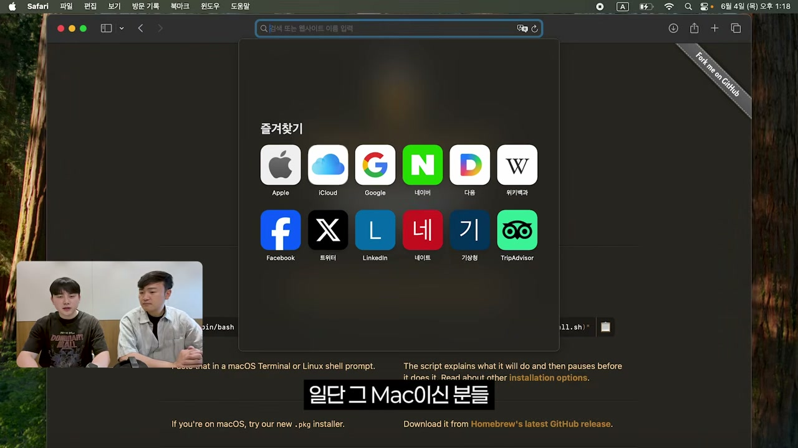

흥미로운 건 두 사람이 데스크탑 앱을 "정답"으로 밀지 않는다는 점이다. 지난번 영상에서 터미널 설치를 다룬 이유를 샘 호트만이 짚는다. 터미널로 설치하면 장기적으로 실력도 늘고, 미세한 튜닝이 가능해서 자유도 있게 쓸 수 있다. 데스크탑 앱은 그 자유도를 포장지로 덮어 가린 셈이다. 초보에겐 포장지가 고맙고, 오래 쓸 사람에겐 그 안이 보여야 한다.

## 5.5를 쓰라는 이유는 토큰에 있다

설치가 끝나면 프로바이더와 모델을 고르는 단계가 나온다. 여기서 모델 선택을 두고 두 사람이 같은 결론에 도달하는데, 그 근거가 구체적이라 곱씹을 만하다.

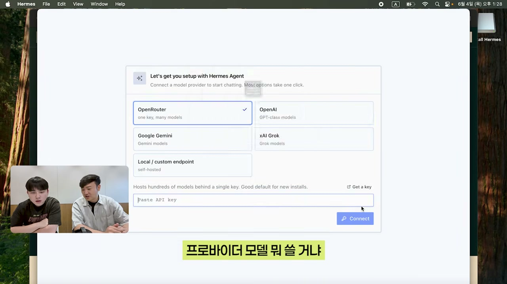

서장원 대표는 모델 테스트를 직접 해봤다. 5.5 말고 5.4 미니 같은 낮은 버전으로 에이전트를 돌려본 것이다. 결과는 "정말 이상하게, 멍청하게" 동작하더라는 것. 왜냐하면 에이전트는 기본적으로 유저 요청을 받으면 어떤 스킬로 그 업무를 실행할지를 스스로 골라낸다. 그런데 낮은 버전은 토큰의 한계 때문에 이 선택을 제대로 못 한다. **스킬을 6개 써야 하는데 3개만 쓰고 끝내버리는 식이다.** 그래서 그 뒤로 전부 5.5로 바꿨고, 최신 모델을 쓰는 게 가장 좋다는 게 결론이다.

샘 호트만의 경험도 정확히 포개진다. 그는 요약이나 번역처럼 반복적이고 단순한 작업은 5.4 미니로 돌려놨다고 한다. 다만 여러 스킬이 동시에 호출되는 순간부터는 5.4 미니가 제대로 워킹하지 않는다는 걸 인지하고 있다는 것. 두 사람의 합의는 이렇게 정리된다. 단순 반복은 미니로 충분하지만, 스킬을 골라 조합해야 하는 순간 최신 모델이 아니면 무너진다.

## 숨겨진 폴더, 그리고 전역과 프로필의 갈림

헤르메스를 제대로 다루려면 코드가 어디 있는지부터 알아야 한다. 맥에서는 사용자 홈 폴더로 간 다음 command + shift + 점을 눌러 숨김 폴더를 표시하면 `.hermes` 폴더가 드러난다. 서장원 대표가 폴더 안 파일들을 직접 보라고 권하는 이유는 단순하다. 그래야 헤르메스의 원리를 더 빨리 익힌다는 것.

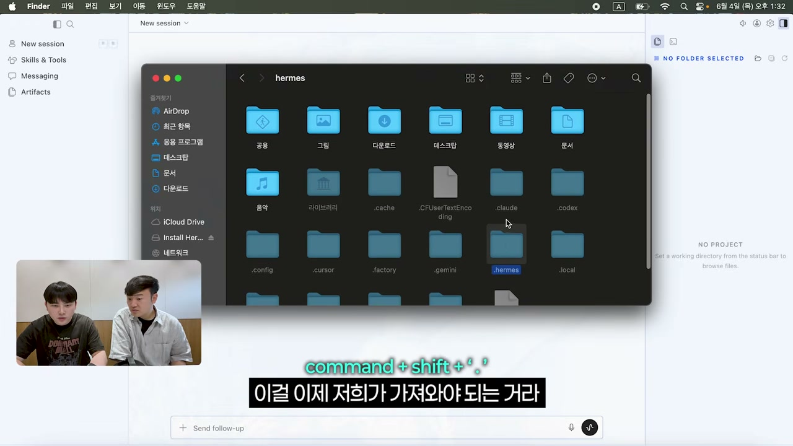

이 구조 이해가 왜 중요한지는 스킬이 어디에 생기느냐 문제에서 드러난다. 헤르메스는 멀티 프로필을 지원한다. 디폴트 말고도 디자이너 같은 프로필을 여러 개 만들 수 있다. 문제는 대화창에서 "스킬을 만들어줘"라고 자연어로 대충 요청했을 때다. 서장원 대표가 실제로 겪은 일인데, 같은 요청이 어떨 때는 글로벌 스킬로 생성되고 어떨 때는 특정 헤르메스 에이전트 안의 스킬로 생성된다.

그 결과가 비개발자를 가장 헷갈리게 만든다. "분명 저번에 카드 뉴스 만드는 거 시켜놨고 알려줬는데 왜 이번엔 못 하지?" 같은 상황. 답은 그 스킬이 전역에 세팅됐느냐, 프로필 단위에 세팅됐느냐의 차이에 있다. 프로필이 여러 개일 때 에이전트가 그 스킬을 어디에 넣을지 갈피를 못 잡는 것이다. CLI에서는 프로필을 먼저 선택하고 작업하면 이 문제를 피할 수 있지만, 초보자에겐 그게 잘 안 된다.

여기에 데스크탑 앱 버그가 겹친다. 프로필을 분명 생성했는데 UI에는 안 나타나고, 정작 폴더로 들어가 보면 파일은 멀쩡히 만들어져 있다. 다만 서장원 대표는 이런 데스크탑 버그를 크게 문제 삼지 않는다. 버전이 조금만 지나면 다 해결될 문제라는 것이다. 나온 지 얼마 안 된 앱이니까.

## 도구는 셋으로 나눠 쓴다: 슈퍼셋, 대시보드, 데스크탑

서장원 대표가 헤르메스를 쓰는 환경은 한 덩어리가 아니라 역할별로 갈라져 있다. 이 분업 구조가 실전 운영법의 핵심에 가깝다.

코드를 같이 봐야 하기 때문에 에디터로는 슈퍼셋을 쓴다. VS 코드 같은 에디터 툴인데, 다른 점은 여기서 클로드코드나 코덱스, 헤르메스, 오픈코드를 바로 세팅해 둘 수 있다는 것. 편집 도구는 취향을 많이 타는데, 팀원들이 여러 개 추천한 것 중에 미감이 좋아서 골랐다고 한다. 버그가 있긴 해도 쓰는 데 큰 무리는 없다는 게 서장원 대표의 판단이다.

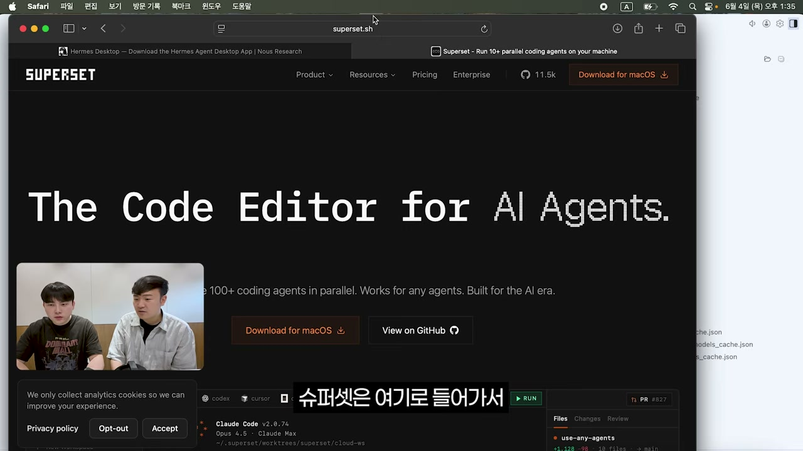

그렇다면 세 도구가 각각 무슨 일을 하는가. 샘 호트만이 정리한 분업이 명료하다. **대시보드 위에서는 일을 시키고 조회하고, 디버깅이 필요할 때는 슈퍼셋을 열어 클로드코드나 코덱스에게 "이거 잡아줘, 저거 수정해줘"라고 호출해 유지보수한다.** 서장원 대표 본인은 데스크탑 앱에서 뭔가를 직접 쓰는 건 좋지 않다고 본다. 대시보드가 UI 면에서 훨씬 잘 돼 있기 때문이다.

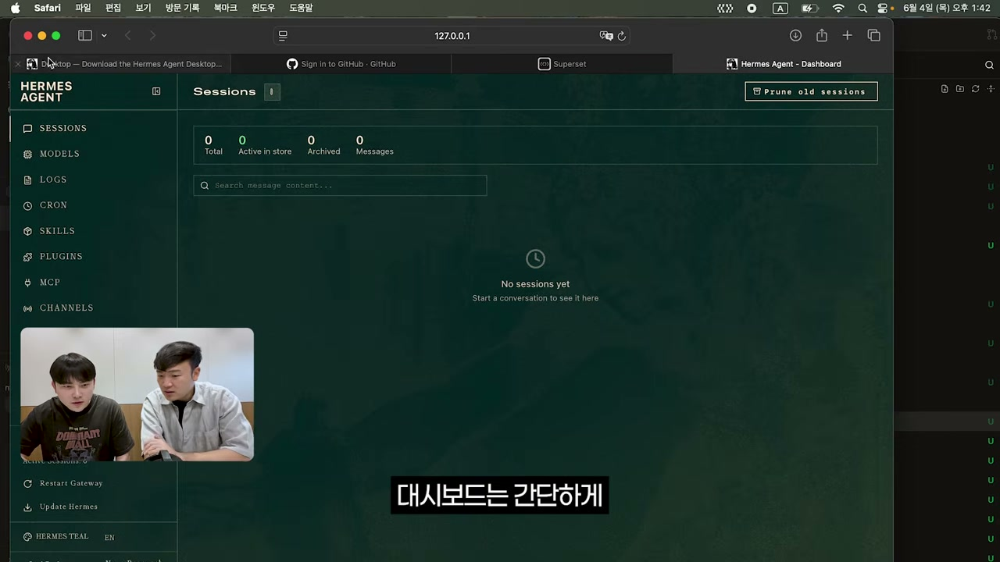

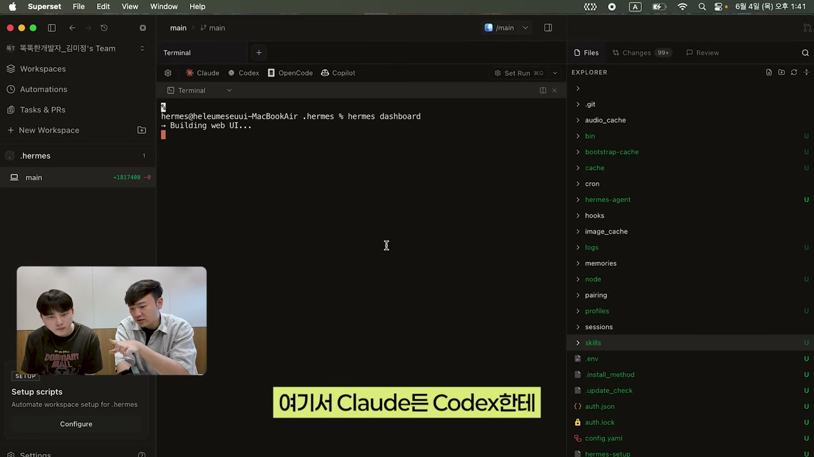

데스크탑 앱에서 그래도 확인할 만한 건 아티팩트 정도라고 한다. 비개발자가 에이전트한테 카드 뉴스 만들어 달라 해놓고 정작 그 결과물이 어디 있는지 못 찾는 경우가 많은데, 아티팩트는 그런 산출물을 한곳에 모아 보여주는 용도라 쓸모가 있다는 것. 다만 이 아티팩트가 대시보드에는 없다는 점은 서장원 대표도 아쉬워한다.

## 대시보드에서 진짜 중요한 건 스킬과 크롬, 그리고 보조 모델

대시보드 안에서 두 사람이 입을 모아 핵심이라 꼽는 건 스킬과 크롬이다. 나머지는 거의 곁가지라는 투다. 어떤 스킬을 어떤 예약된 시스템 안에서 자동으로 동작시킬 것이냐가 운영의 중심이라는 것.

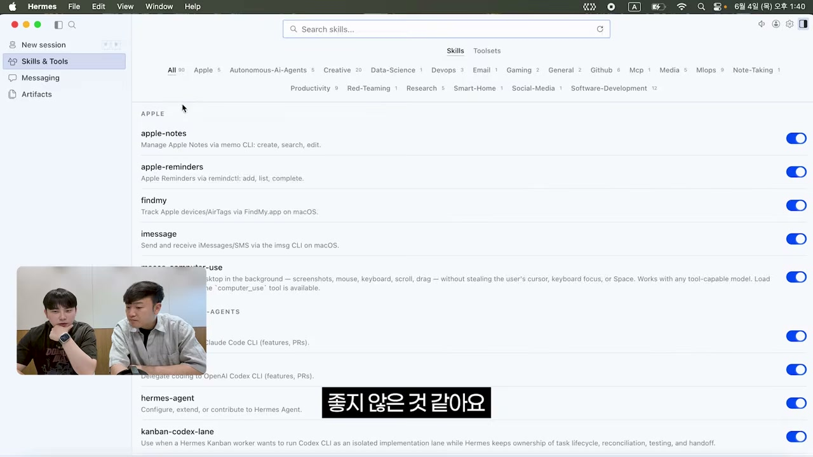

재밌게 본 건 칸반 플러그인이다. 에이전트가 해야 할 일이나 예약된 작업을 보드 형태로 관리하게 만들어 놨다. 다만 서장원 대표가 직접 써본 결과, 에이전트가 알아서 모든 업무를 여기에 채워 넣지는 않는다. 사람이 생성해주거나, MCP로 칸반 데이터를 가져와서 "지금 예약해줘"라고 해야 세팅된다. 자동화의 환상과 실제 동작 사이의 간극을 솔직하게 짚는 대목이다.

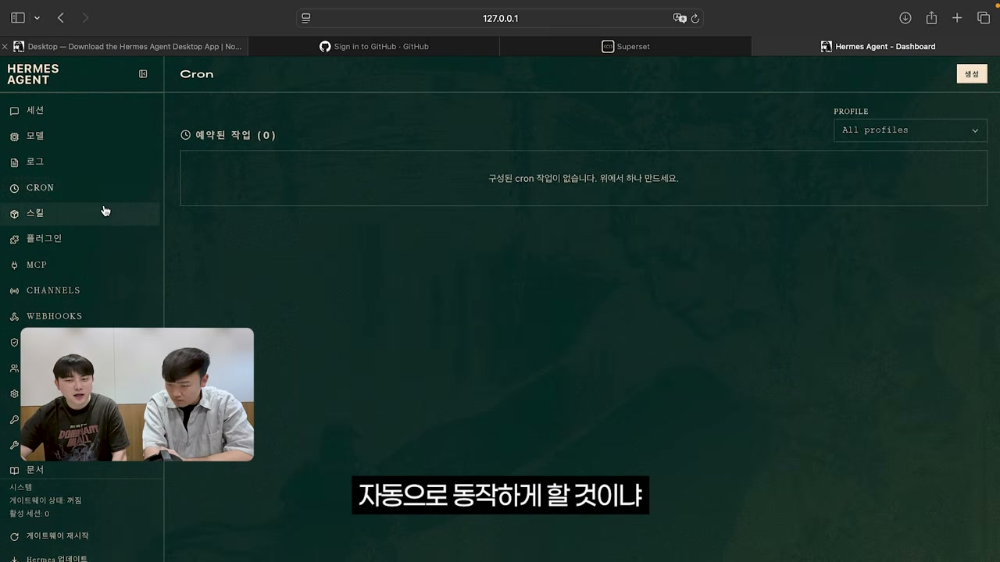

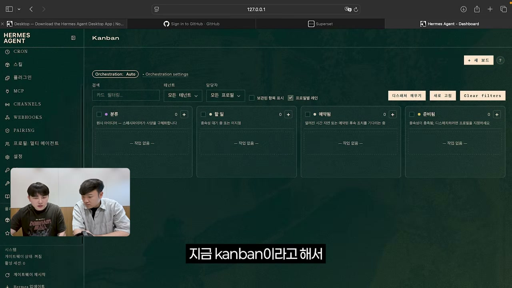

오케스트레이션 설정은 멀티 에이전트를 고민하는 사람에겐 특히 중요하다. 헤르메스는 메인 모델을 실행할 때 웹서치, 세션 검색, MCP 연결, 큐레이팅 같은 보조 작업에는 메인 모델 대신 다른 모델을 쓸 수 있게 해놨다. 앞서 5.5가 느릴 수 있어서 5.4를 썼다가 문제가 생긴 그 지점을, 작업 종류별로 모델을 갈아 끼워 최적화하는 길이 여기 있는 셈이다.

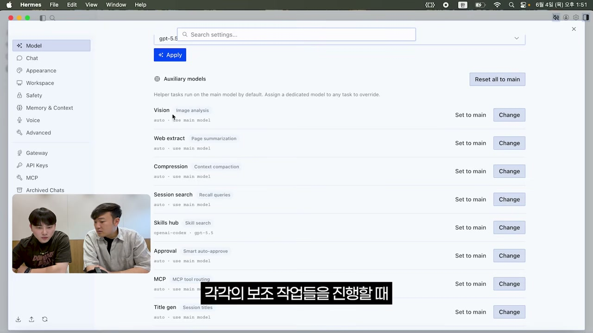

다만 한계도 분명하다. 서장원 대표가 멀티 에이전트 구조를 만들려다 부딪힌 벽인데, 클로드는 스킬 단위에서 모델을 설정할 수 있지만 헤르메스나 오픈클로는 스킬단에서 그게 안 된다. 그래서 메인은 5.5 오퍼스를 쓰면서 어떤 작업만 소넷으로 돌리는 에이전트를 만들고 싶다면, 스킬로 분리되는 게 아니라 에이전트 자체를 새로 만들어야 한다. 헤르메스가 한 작업을 실행하는 데 너무 오래 걸리는 구간이 생기는데, 이런 보조 모델 설정을 알고 있으면 그걸 최적화할 여지가 생긴다.

게이트웨이도 데스크탑의 재밌는 기능으로 꼽힌다. 로컬뿐 아니라 외부 서버에 올린 것을 URL로 끌어와 세션을 연결하고 바로 채팅할 수 있는 형태다. 똑똑한개발자는 슬랙이나 텔레그램 연동을 쓰고 있어서 당장 필수는 아니지만, 원래 외부에서 대시보드 접속이 안 되다 보니 ngrok이나 클라우드플레어를 따로 설치해 외부 도메인으로 열어두던 작업을, 이제 데스크탑이 기본 기능으로 제공한다.

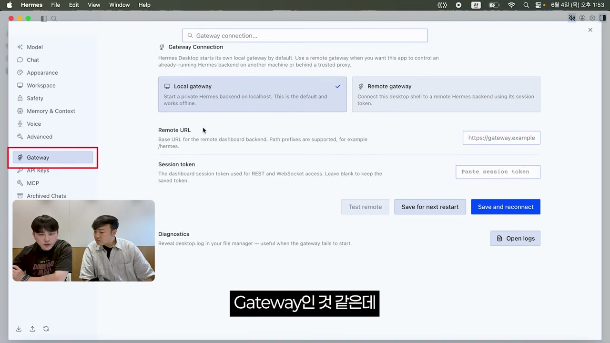

## 슬랙 연동, 매니페스트를 자연어로 만든다는 발상

채널 세팅은 이 영상에서 가장 실전적인 따라하기 구간이다. 두 사람은 슬랙을 기본으로 쓰고 있어서 슬랙 연동을 시연한다. 원래는 코드 기반으로 했어야 하는 걸, 데스크탑에서 토큰만 뽑아 넣으면 되게끔 편해졌다.

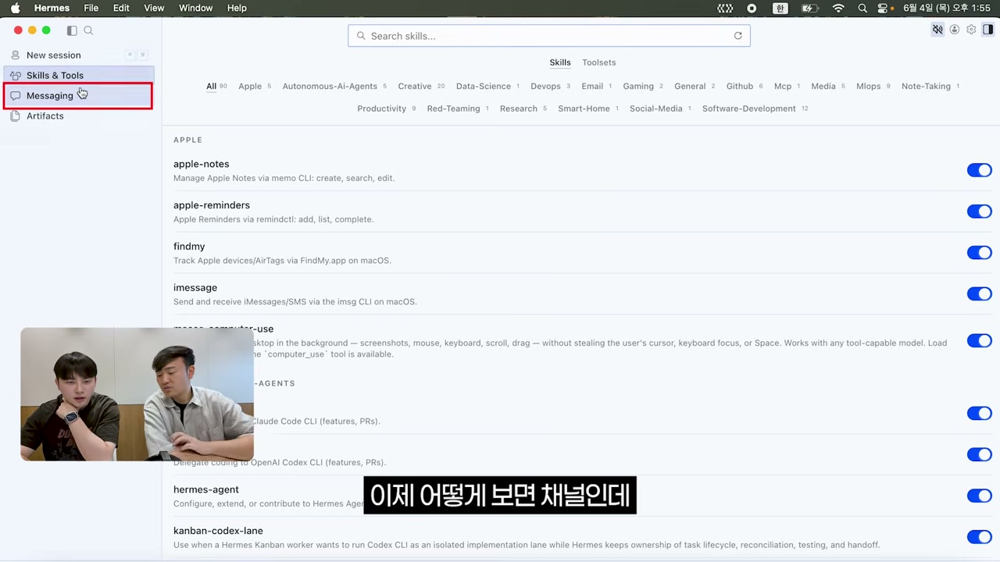

먼저 개념부터. 슬랙에는 워크스페이스가 있고 그 하위에 채널이 있다. 슬랙 안에서 세팅해야 하는 토큰이 둘인데, 앱 토큰과 봇 토큰이다. 그리고 채널에 대한 아이디는 C로 시작하고, 유저나 봇에 대한 아이디는 U로 시작한다. 이 값들이 헤르메스 안에 세팅돼야 슬랙과 헤르메스가 게이트웨이 상에서 통신할 수 있다. 여기서 서장원 대표가 흘리듯 던지는 한마디가 좋은 팁이다. **똑똑한개발자는 채널과 유저의 아이디를 바탕으로 권한을 부여하고 있다.** 누가 어느 채널에서 무엇을 시킬 수 있는지를 이 아이디로 가른다는 것이다.

매니페스트를 다루는 방식이 특히 인상적이다. 슬랙 앱을 만들 때 권한, 스콥, 봇 이름, 디스크립션 같은 메타 정보가 들어가는 JSON 설정이 매니페스트인데, 서장원 대표는 이걸 "봇에 대한 입사지원서"라고 풀어 설명한다. 이걸 수기로 다 채우려면 시간이 오래 걸린다. 그래서 그는 헤르메스한테 자연어로 매니페스트 템플릿을 만들어 달라고 요청한다. 초보자는 용어만 굵직하게 알아둔 다음 자연어로 요청하면 깔끔하게 만들어진다는 것.

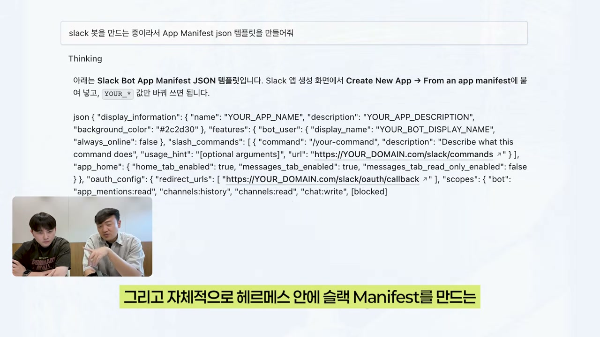

매니페스트에서 직접 손볼 건 디스플레이 네임, 네임, 디스크립션 정도다. 리다이렉트 URL을 두고 서장원 대표가 겪은 실패담이 구체적이라 새겨둘 만하다. 옛날에 이 URL 항목을 불필요해 보여서 지운 적이 있는데, 지우니까 동작이 아예 안 됐다는 것. 그래서 최대한 있는 그대로 쓰거나, 좀 더 디테일하게 요청해서 받은 매니페스트를 넣는 편이라고 한다. 에러가 안 나는 수준이면 일단 저장해서 쓴다.

설치 단계에서 절대 빠뜨리면 안 되는 게 소켓 모드다. 서장원 대표가 "이거 중요합니다"라고 강조하는 지점. 소켓은 채팅을 위한 통신 방식으로, 양방향 통신이 실시간으로 이뤄진다. 소켓 모드를 켜면 앱 토큰이 나오고, 그걸 카피해서 헤르메스 데스크탑에 넣는다. 그다음 앱을 슬랙 채널에 인스톨하면 봇 토큰이 나오고, 그것도 헤르메스에 붙인다.

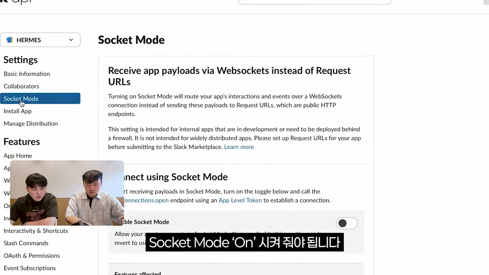

채널 아이디와 유저 아이디는 슬랙에서 채널이나 프로필을 우클릭해 "멤버 ID 복사"로 가져온다. 그런데 시연 중에 재밌는 장면이 나온다. 유저 아이디를 굳이 안 넣어도 헤르메스가 "알잘딱으로" 알아서 처리하더라는 것.

이 장면을 두고 두 사람이 같은 결론으로 모인다. 비개발자들은 AI가 중간에 생각하고 답변하는 과정을 잘 안 본다. 그런데 그걸 꼼꼼히 보는 게 매우 중요하다. 보면서 실력이 늘고, 놓친 것도 인지하게 되기 때문이다. 서장원 대표는 개발자 출신이라 도큐먼트를 잘 읽는 습관이 들어 있다고 말한다. 거기 정답이 다 있는데 안 읽어서 생기는 문제가 많고, 그래서 지름길을 놔두고 삽질하는 경험은 모든 개발자가 다 해봤을 거라는 것.

마지막으로 set home이 있다. 어떤 채널을 메인 채널로 할지 정하는 명령어인데, 세팅 안 하면 말할 때마다 안내가 계속 뜬다. 채널 내에서 명령어로 홈을 세팅하는 방법도 있고, 세션에 자연어로 "다시 안 뜨게 기본 채널을 여기로 설정해줘"라고 말하면 헤르메스가 알아서 설정한다. 서장원 대표는 비개발자가 코드를 직접 보고 수정하기 어려우니 그냥 채팅 UI에서 세팅하는 편이라고 한다.

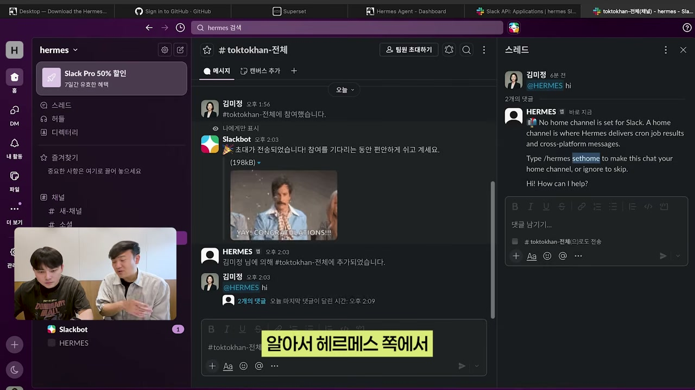

## 세션은 곧 온보딩이다

세팅이 끝나면 운영 방식이 드러난다. 똑똑한개발자에서 비개발자가 일할 때는 스킬 생성 같은 것도 다 슬랙에서 한다. "카드 뉴스 스킬 생성"이라고 하나 만들어 놓으면, 그게 하나의 세션으로, 쓰레드 단위로 생성된다. 그 안에서 모든 게 이뤄지도록 작업 방식을 잡았다.

샘 호트만이 이 방식을 온보딩 관점에서 높이 산다. 세션 이름을 챗GPT나 클로드가 알아서 요약해주면, 협업하는 사람 입장에서 "어떤 일을 하겠다"고 선언한 다음 헤르메스와 대화하는 흐름이 된다. 일이 곧 기록이 되고, 기록이 곧 온보딩 자료가 되는 구조다.

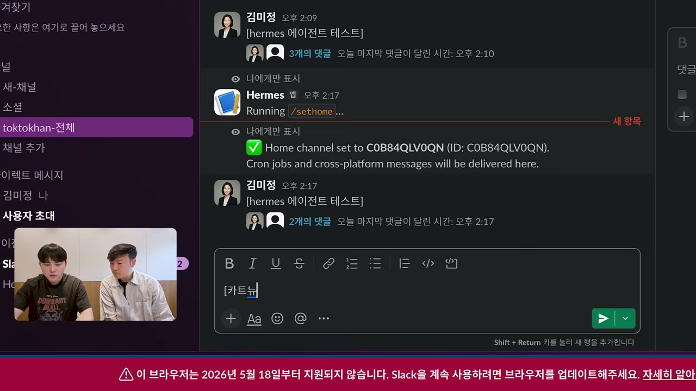

스킬 이름 짓는 방식에도 똑똑한개발자만의 규칙이 있다. 스킬명을 무조건 내부에서 정해놓고 쓴다. 예를 들어 "카드 뉴스 메이크 1" 식으로 넘버링하고, 1번은 모던한 디자인이라는 식으로 매핑한다. 카드 뉴스 하나만 해도 AI가 HTML · CSS로 만든 것, GPT 이미지로 만든 캐러셀 등 패턴이 다양한데, 이걸 버전 형태로 묶어 두고 "이 스킬 써서 카드 뉴스 만들어줘"라고 호출한다. 자연어의 모호함을 이름이라는 좌표로 못 박는 셈이다.

## 똑빌더, 헤르메스를 업무 시스템에 꽂다

여기까지가 설치와 운영의 기본기라면, 이제 진짜 사례가 나온다. 똑빌더다. 한마디로 **똑똑한개발자가 자기 직원들이 쓰려고 만든 사내 업무 관리 사이트**다. 외부 고객에게 파는 제품이 아니라, "지금 어떤 프로젝트가 들어왔고, 누구를 투입할 수 있고, 진행 중인 이슈는 뭔지"를 한 화면에서 보는 내부용 대시보드다. 여기에 헤르메스 에이전트를 연결해 둔 것이 똑빌더의 정체다.

만들게 된 배경에 통찰이 있다. 똑똑한개발자는 2025년부터 AI 네이티브로 전환을 시도했는데, 시스템을 개인이 뚝딱 만들기는 어렵다는 걸 먼저 깨달았다. 더 중요한 발견은 이거다. **사내 도구라도 결국 서비스더라는 것.** 대외 고객용이냐 내부 직원용이냐의 차이만 있을 뿐, 사용성이 좋아야 사람이 쓴다. 아무리 잘 만들어도 직원이 안 쓰면 끝이다. 그래서 기획을 책임지는 신사업 PO를 붙여 똑빌더를 제대로 만들고 있다.

연결 구조는 이렇다. 똑빌더가 들고 있는 데이터, 그러니까 실무자 현황, 프로젝트 현황, 투입 현황, 이슈 현황을 MCP로 헤르메스에 물린다. 헤르메스는 그 데이터를 스킬로 들고 있다가, 슬랙에서 물어보면 답한다. 그래서 같은 데이터를 두 창구로 쓰는 셈이다. **눈으로 볼 땐 똑빌더 대시보드, 말로 물을 땐 슬랙의 헤르메스.**

이제 실제 흐름을 따라가 보자. 출발점은 영업이다. 영업은 똑똑한개발자가 직접 만든 플러그라는 CRM이 맡는다. 플러그에서 어떤 계약이 '임박'으로 바뀌는 순간, 자동으로 똑빌더에 그 프로젝트 데이터가 생성된다. 그리고 데이터가 생기면 곧바로 슬랙으로 발송된다. 이 발송을 중간에서 처리하는 게 헤르메스다. "이 프로젝트에 투입할 담당자를 검토해 달라"는 메시지가 슬랙에 자동으로 올라온다.

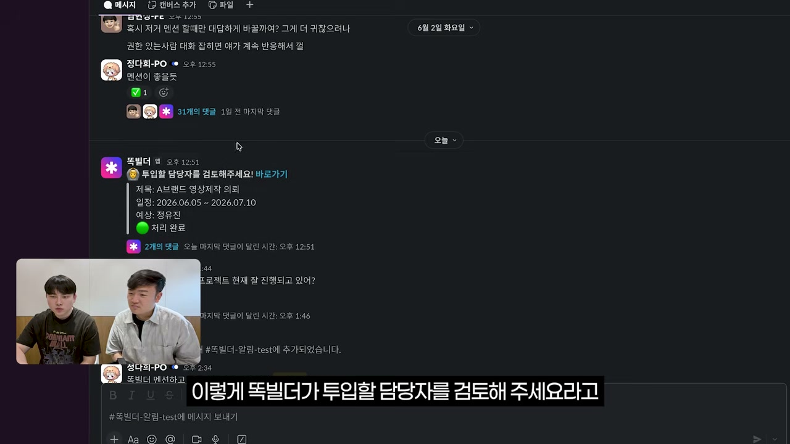

다음은 배정 검토다. 슬랙에서 "이 프로젝트 몇 명 필요해? 지금 리소스 남는 사람 누구야?"라고 물으면 헤르메스가 답한다. 핵심은 배정 가능한 사람과 불가능한 사람을 바로 본다는 데 있다. 샘 호트만이 자기 직장 경험과 대조한다. 예전엔 이렇게 대시보드로 체계적으로 관리하지 않았는데, 프로젝트를 발주받고 "누구를 넣을 것인가"라는 질문 앞에서 리소스가 한눈에 보이면 굉장히 효율적이겠다는 것. 데이터를 화면으로도 보지만, 정작 업무는 슬랙에서 하니까 슬랙에서 묻고 헤르메스가 바로 답하는 프로세스다.

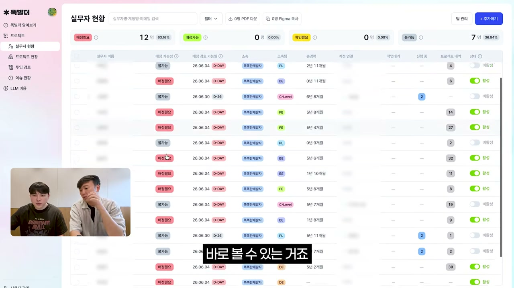

이 흐름에는 분명한 설계 철학이 깔려 있다. 데이터는 계약이 확정돼야만 쌓이기 시작한다. 그전 영업 단계는 플러그의 몫이고, 똑빌더는 확정 이후부터 움직인다. 그래서 영업 히스토리를 기반으로 투입 검토가 시작된다. 그리고 AI가 실무자를 추천하고 투입을 제안하긴 하지만, 최종 결정은 사람이 한다. 휴먼 인 더 루프를 적용해, 사람이 반드시 체크해야 하는 영역을 따로 떼어 둔 것이다. 배정 추천 자체는 별도로 만든 스킬을 헤르메스가 가져와 데이터와 엮어 실행한다. 실무자 현황을 열면 그 사람이 진행했던 프로젝트 리스트와 역할이 다 나오는데, 에이전시 특성상 "누가 투입되며 어떤 프로젝트를 해왔는가"라는 이력을 고객사에 전달해야 하기 때문에 이걸 관리하는 것이다.

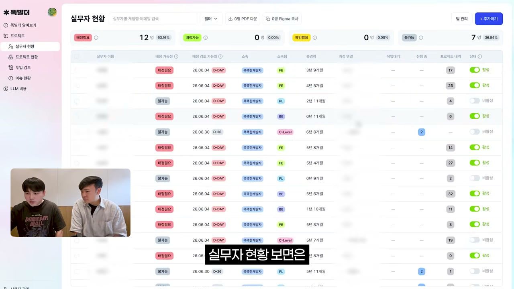

투입이 정해지고 프로젝트가 시작되면, 헤르메스가 슬랙에 내부방과 외부방을 권한을 갖고 자동으로 생성한다. 그리고 그 방들의 메시지를 실시간으로 수집해 메모리에 담고, 이슈가 생기거나 히스토리가 쌓이면 요약해 채팅으로 보내준다. 매니징 관점에서 헤르메스가 주기적으로 이슈를 트래킹해 알려주는 식이다. 여기에 똑똑한개발자는 HR 관점의 원칙까지 얹으려 한다. 클라이언트에게 신뢰를 주려면 내부방에서만 떠들 게 아니라 외부방에서도 적극 소통해야 한다는 자기들만의 일하는 방식을, 헤르메스가 업무 평가의 잣대로 삼게 하려는 시도다.

## 에이전트는 만능이 아니다, 그래서 커스텀을 만든다

여기서 대담은 한 단계 더 들어간다. 지금까지가 "누구를 어디에 배정하나"였다면, 회사가 실제로 돈을 버는 일은 그다음이다. 바로 **고객 프로젝트를 직접 만들어 내는 것**. 서장원 대표가 "핵심은 결국 프로젝트"라고 말하는 이유다. 그런데 이 프로젝트 제작은 헤르메스 기본 에이전트만으로는 한계가 명확하다. 그래서 똑똑한개발자는 이 일을 전담할 **커스텀 에이전트**를 따로 만들어 운영한다.

흐름은 이렇다. 클라이언트에게서 모은 정보와 영업 과정에서 넘어온 데이터를 바탕으로 자료를 모아 기획 문서를 만든다. 기획서는 화면 명세와 IA 구조까지, 디자인은 디자인 시스템까지 자동으로 나온다. 단순히 스킬 하나 깎아 만드는 수준이 아니다. 서브 에이전트와 스킬, 거기에 랭체인 · 랭그래프 같은 걸 더해, 에이전트를 감싸 굴리는 작업 골격(하네스)을 코드로 단단히 짜둔 것이다. 그래서 빌드를 돌리면 MVP 초기 프로젝트가 나오는 데까지 "딸각" 한 번으로 간다. 그렇게 나온 초기 서비스를 개발자가 내려받아, 거기서 태스크를 만들며 AI 네이티브하게 작업을 이어간다.

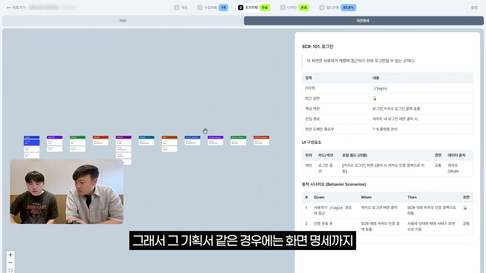

샘 호트만은 이 지점에서 솔직하다. 혼자 개발하는 입장에서는 여기까지는 안 한다는 것. 개발자가 많을수록 이런 식의 시스템이 영업 회전율을 높여 더 많이 수주하게 만들 거라고 본다. 그러면서 자신의 AX 컨설팅 경험을 꺼낸다. 10인 미만 조직에는 이런 거버넌스 시스템이 불필요하다는 것. 그 규모에서는 사용자가 곧 관리자라서, 바이브 코딩 수준으로 기능을 추가하고 서로 얘기해서 쓰면 충분하다.

분기점은 10명이다. 조직이 10명을 넘으면 관리자라는 역할이 따로 생기고, 실무자가 분리되는 순간 이걸 관리할 거버넌스 사이트 기반의 무언가가 필요해진다. 똑똑한개발자는 이 개념 자체를 외부에 납품하는데, 똑빌더를 그대로 주는 게 아니라 개념을 도입해 별도 프로젝트로 진행한다. 회사마다 시스템도 다르고 업무 맥락도 다르니, 템플릿을 바탕으로 클라이언트에 맞게 개인화 · 최적화하는 과정을 거친다.

두 사람이 닿는 결론은 위임의 경계에 대한 것이다. 에이전트한테 모든 작업을 맡기는 건 일관성이 없거나 리스크가 너무 크다. 그래서 모호함이 없는 영역, 일관성과 패턴이 있는 부분만 최대한 위임하고, 모호함이 있는 부분은 휴먼 터치로 남긴다. 확률적으로 동작해도 되는 일만 에이전트에게 준다는 원칙이다.

## 플러그, 만드는 것보다 구독이 싸다

영업 데이터는 똑빌더가 물지 않는다. 똑빌더는 영업 이후부터 데이터가 시작되기 때문이다. 고객 만남부터 수주 사이는 김미정이 담당하고, 영업 자체는 플러그라는 자체 CRM을 계속 고도화해 쓴다.

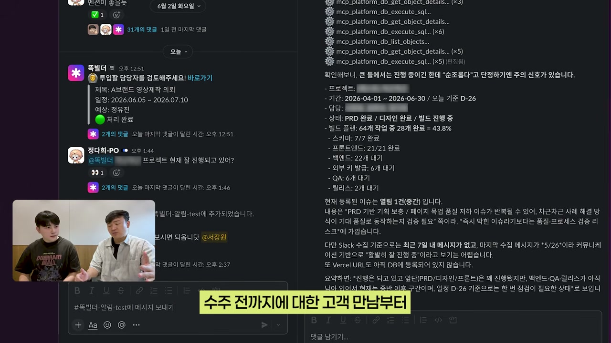

플러그는 똑똑한개발자가 직접 만든 서비스라 안에서 다 처리한다. 세금계산서 발행, 메일 발송과 히스토리, 견적서 생성, 계약서 작성까지 한 곳에서 한다. 통장 정보를 입력하면 지출 · 입출금 내역을 받아오고, 미납 · 연체 리마인드도 달아 둔다. 이번 달 수익, 앞으로 들어올 영업권, 지금 나가야 할 돈, 정산 현황, 미수금 현황이 다 나온다. CRM 겸 재무관리 목적으로 만든 것이고, 지금은 여기에 MCP를 만들고 있다. API는 이미 있어서 연결하면 이번 달 얼마 벌었고 목표치에 도달했는지, 도달하려면 영업을 얼마나 더 해야 하는지까지 디테일하게 본다.

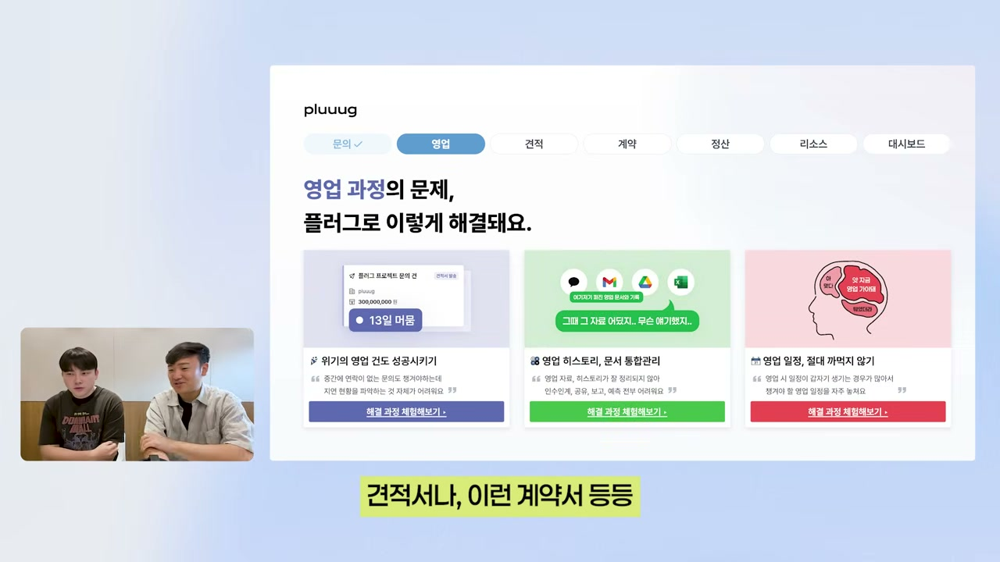

서장원 대표가 여기서 던지는 판단이 곱씹을 만하다. 바이브 코딩이 쉬워져 이런 대시보드를 개개인이 만들 수 있다고 생각하기 쉽지만, 세금계산서 발행은 API 연동에 건당 비용이 들고, 카드사 연동이나 통장 연동도 개인이 하기 어렵고 돈이 든다. 이런 걸 하나하나 따져보면 그냥 구독하는 게 더 쌀 수도 있다는 것. 잘 만들어진 프로젝트를 연결해서 쓰는 게 중요하다는, 슬랙을 구독해 쓰는 것과 똑같은 논리다. 직접 다 만드는 시대가 아니라 잘 만든 걸 꽂아 쓰는 시대라는 감각이다.

## 밑바닥에서 다시 시작한다면

대담 끝에 샘 호트만이 가장 실용적인 질문을 던진다. 100명, 1000명 조직은 헤르메스를 바로 못 쓴다. 그러면 인원을 쪼개 몇 명으로, 어떤 구성으로 시작해야 하는가. 밑바닥부터 AI 네이티브하게 도입한다면 어디서 출발할 것인가.

서장원 대표의 답은 시행착오에서 나온 것이라 무게가 있다. 똑똑한개발자는 내부에서도 하고 외주로도 같은 걸 하는데, 지금 프로젝트 3개 정도가 돌아가고 있다. 그가 꼽는 필수 조건은 셋이다.

첫째, 무조건 리더십이 끼어 있어야 한다. 의사결정할 수 있는 사람이 있어야 업무를 빠르게 AI에 적용하고 테스트할 수 있다. 둘째, 가능하면 작은 규모로 해야 한다. 똑똑한개발자가 지금 하는 것도 대기업이지만 10명 미만의 팀원을 모아 진행한다. 셋째, AI에 대한 거부감이 없어야 하고, 기본 세팅이 돼 있어야 한다. 클로드 코워크가 뭔지, 스킬이 뭔지 모르는 사람과 하면 설명할 게 너무 많아진다.

그리고 가장 강조하는 조건. **요거를 구성하려면 무조건 서비스 개발 경험이 있는 팀원이어야 한다.** 이건 실패에서 배운 것이다. 서비스 개발을 해본 적 없는 팀원들과 먼저 해봤더니, 나온 결과물이 그럴듯하지만 사용하기 어려운 프로젝트였다는 것. 디자이너도 아니고 개발을 메인으로 잡는 사람도 아닌, 기획자 포지션에서 만들다 보니 사용성이 너무 안 좋아서 팀원들에게 써보라고 해도 어떻게 써야 할지 몰랐다.

처음에는 30명 전원에게 "다들 AI 잘 쓰시니까 거버넌스 만들어야 하니 의견 주세요"라고 했더니, 거의 두 달 동안 아무것도 진행되지 않았다. 그래서 서장원 대표와 AX 컨설팅 리더가 직접 만들었는데, 앞서 말한 사용성 문제에 부딪혔다. 결국 PO와 실제 프로덕트를 빌딩해 본 사람들이 전담으로 들어오면서 퀄리티가 좋아졌다.

그래서 그가 권하는 출발점은 명확하다. 서비스를 개발해 본 경험 있는 인원들과 함께 워크플로우를 개선하는 것부터 시작하는 것. 샘 호트만이 이 답을 다시 정리한다. 공감 능력과 편의 감각, 경험이 있는 상태에 더해, 클로드로 치면 스킬 · 플러그인 같은 아주 기초적인 에센스 정도를 익힌 인원들이 4, 5명부터 출발하면 굉장히 빠른 속도로 만들 수 있다는 것.

마지막으로 단가. AX 쪽 프로젝트는 3억에서 5억 정도로 진행한다. 단가가 특별히 높은 편은 아니라는 게 서장원 대표의 설명이다.

샘 호트만이 대담을 닫으며 남긴 평가가 이 영상의 가치를 요약한다. 국내에서 이런 규모로 헤르메스를 영업부터 영업 사후 온보딩까지 엮어 잘 쓰고 있는 조직은 개인적으로 처음 봤다는 것. 헤르메스 콘텐츠가 차고 넘치는데도 "실제 업에 붙인 사례가 없다"던 첫 문장으로 정확히 되돌아오는 마무리다. 설치 가이드는 많지만, 30명이 매일 그 안에서 일하는 풍경은 드물다. 이 대담이 보여준 건 후자였다.
