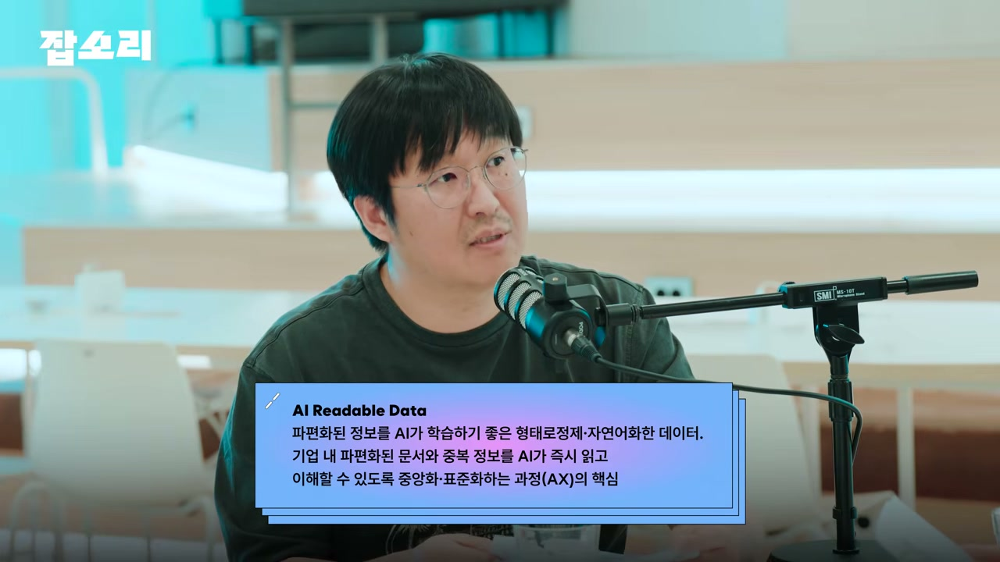
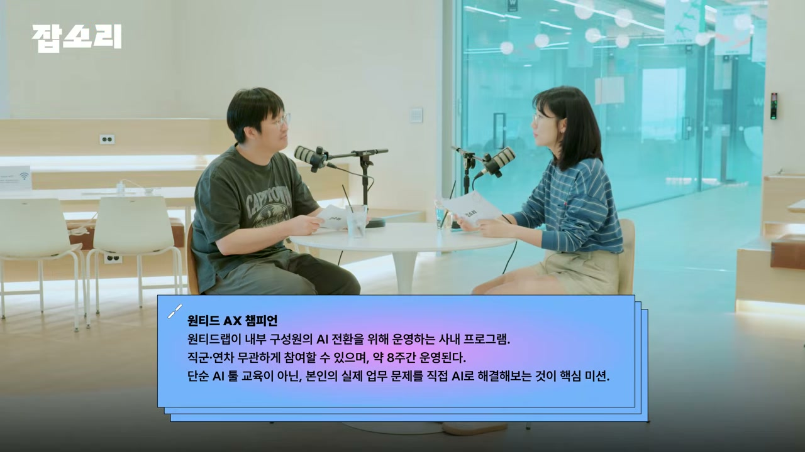
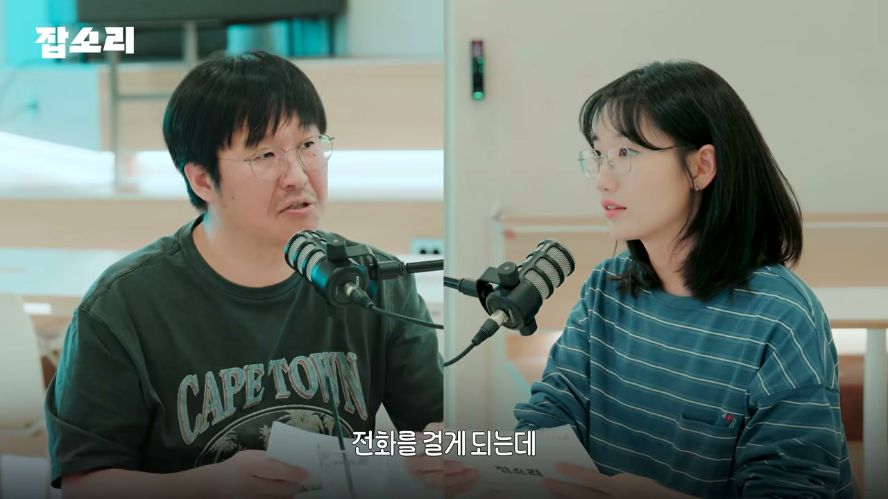
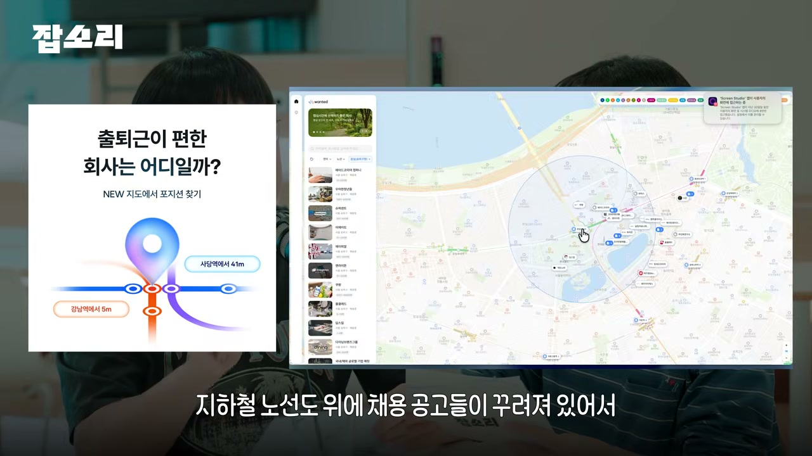
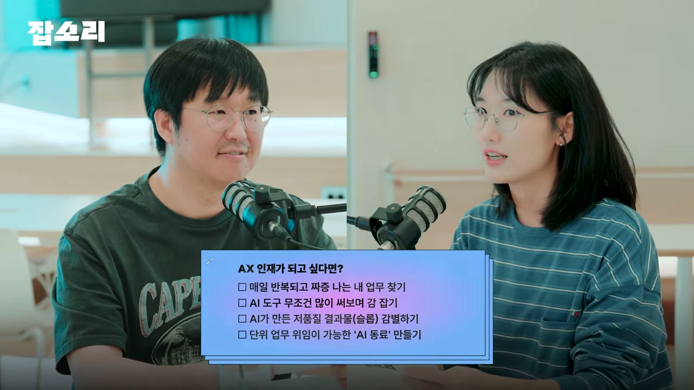
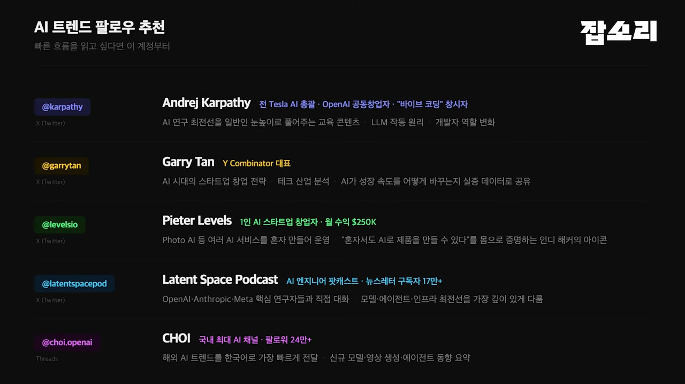
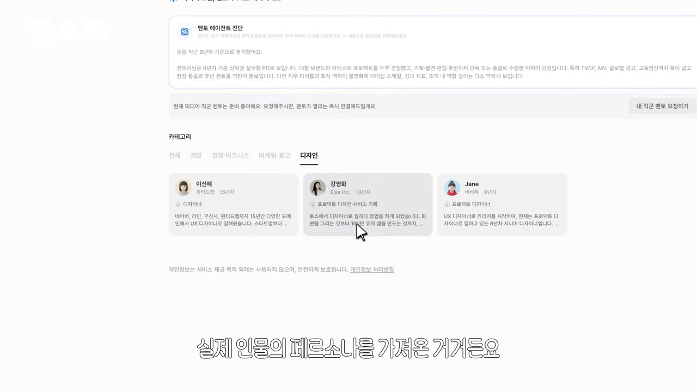
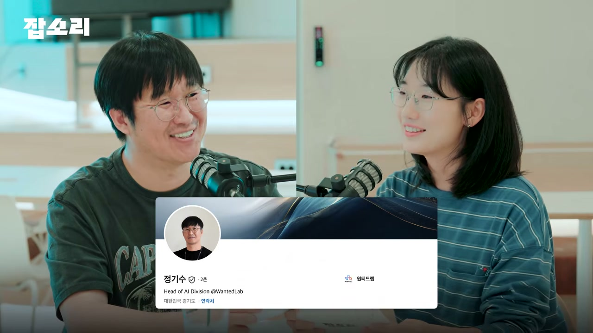

"우리 이런 거 도입했어. 구성원들이 이런 거 많이 써." 요즘 적잖은 회사가 AX(AI 전환)를 말할 때 꺼내는 문장이다. 들으면 그럴싸하다. 그런데 원티드랩에서 기업들의 AX 현장을 직접 들여다보는 정기수님은, 잘하는 기업의 입에서는 정작 그런 문장이 나오지 않는다고 말한다. 그들은 도입한 도구의 목록을 자랑하는 대신 이렇게 말한다. "우리 이번에 생산성이 이만큼 올랐어. 기존에 못했던 건데 AI로 인해서 이런 게 가능해졌어."

채널 원티드의 잡소리 ep.43은 원티드랩에서 AI 조직을 운영하는 정기수님을 불러 그 차이를 한참 파고든 대화다. 겉보기엔 다 AX를 하고 있다. 그런데 속을 열어 보면 누군가는 텅 비어 있다. 그 빈 곳과 채워진 곳을 가르는 선이 어디에 그어지는지, 이 인터뷰는 꽤 구체적인 사례와 숫자로 보여준다.

## 도구 목록이 아니라 숫자가 말하게 하라

가짜 AX와 진짜 AX의 갈림길은 의외로 앞쪽, 목표를 세우는 단계에 있다. 정기수님은 AI 경험이 부족하거나 "주변이 하니까 우리도" 정도로 가볍게 들어온 조직일수록 표면적인 이야기에 머문다고 본다. 무엇을 도입했고 누가 많이 쓰는지를 말한다. 반대로 잘하는 기업은 도입 자체를 자랑하지 않는다. **AX라는 건 AI를 통해 일하는 모습이 바뀌는 것이지, 무엇을 도입했다가 아니라 그래서 우리가 얼마나 더 좋아졌는지를 말할 수 있어야 한다**는 것이다.

그래서 진행자가 묻는다. AI를 도입한 다음 숫자로 증명할 성과가 쌓이는 게 보일 때, 그때 비로소 AX 전환이 완벽하게 됐다고 볼 수 있느냐고. 정기수님의 답은 짧다. "네, 저는 일단 그렇게 생각합니다." 도입은 시작이고, 정량적 성과가 쌓이는 지점이 전환의 완성에 가깝다는 입장이다.

여기서 그가 가장 인상 깊었다고 꼽은 사례가 나온다. 어떤 큰 조직이 'AI 리더블 데이터(AI Readable Data)'라는 표현을 쓰고 있었다. 일을 하다 보면 정보가 여러 시스템에 파편화돼 저장되고, 중복되고, 관리가 안 된다. 그걸 AI가 잘 읽어 갈 수 있도록 중앙화된 문서 시스템을 만드는 작업이었다. 인상 깊었던 건 시스템 자체가 아니라 태도였다. 꽤 큰 조직임에도 모든 구성원이 'AI가 읽을 수 있는 데이터'를 만들기 위해 움직이고 있었다는 점.

이 사례가 의미심장한 건, 많은 사람이 AI를 "도구에 의존만 하는" 방식으로 쓰기 때문이다. 좋은 도구를 붙이면 알아서 잘 되리라 믿는다. 그런데 이 조직은 도구를 붙이기 전에, AI가 일을 잘하도록 자기 데이터부터 정돈하고 있었다. 정기수님이 인터뷰 후반에 반복해서 말하는 "환경을 설계한다"는 사고가 이미 여기서 드러난다.

## 가장 흔한 실수는 '돈 썼으니 성과 내놔'

그렇다면 기업들이 AI를 도입할 때 가장 많이 저지르는 실수는 뭘까. 정기수님은 먼저 못을 박는다. 그 실수는 잘못이 아니라 무조건 겪어야 할 과정이라고. 그렇게 전제를 깔고 나서 핵심을 짚는다. 사람들이 정량화를 너무 빨리 하려 든다는 것이다.

AI는 기본적으로 돈이 든다. 구독료가 나가고 토큰비가 발생한다. 돈을 썼으니 성과가 무조건 나야 한다는 압박이 생기고, 그 성과를 너무 빨리 얻으려다 보니 제대로 된 활용이 아니라 보여주기식 결과물을 내는 경우가 많아진다. 빈껍데기 AX는 게으름에서가 아니라 오히려 조급함에서 태어난다.

그가 든 예는 가까운 회사가 아니라 미국 빅테크다. 우버에서 개발자들에게 클로드 코드를 잔뜩 풀어줬더니, **1년치 예산을 4개월 만에 다 써버렸다**고 한다. 토큰을 최대한 끌어 쓰는 이른바 '토큰 맥싱'의 관점에서 보면, 우버만이 아니라 마이크로소프트도 메타도 비슷한 이야기를 내고 있다는 것이다. 일단 써 보자고 접근했을 때 누구나 조금씩은 이런 잘못된 경험을 통과한다. 그러니 그 실수 자체를 부끄러워할 일이 아니라, 통과해야 할 길로 받아들이라는 게 그의 메시지다.

## 사람을 먼저 둘 것인가, 사람을 바꿀 것인가

조직을 제대로 꾸리려면 어디서 시작해야 하나. 새 AI 인재(AI 네이티브)를 데려오는 게 먼저인가, 기존 구성원을 AI 네이티브로 바꾸는 게 먼저인가. 정기수님은 여력이 있다면 AX 경험이 있는 전문가가 내부에 있는 편이 가장 효율적이라고 본다. 전문가가 안에 있어야 구성원을 육성할 때부터 좋은 전략이 나오기 때문이다.

다만 상황이 안 된다면 방향을 분명히 한다. 단순 툴 활용 교육이 아니라, 문제를 직접 풀어 보면서 AI 도구가 우리 회사 안에서 어떻게 도움이 될 수 있는지를 체험하는 교육이어야 한다는 것이다. 이 구분이 중요하다. 'AI 다루는 법'을 가르치는 것과 '내 문제를 AI로 푸는 경험'을 시키는 것은 결과가 다르다.

도구를 강제하는 문제에서도 그의 입장은 또렷하다. 원티드랩이 AX 전환을 하며 처음 시도한 건 첫 6개월간 재무팀 · 피플팀(인사 · 조직문화 담당)과 함께 논의한, "일단 돈을 먼저 쓰게 해 주자"였다. 뭐가 좋은지 각자 개인의 경험부터 쌓게 하자는 것이다. 도구가 워낙 많으니 선택권은 자유로워야 한다고 본다.

물론 수렴이 일어나는 영역도 있다. 개발자는 지금 대부분 클로드 코드 아니면 오픈AI 코덱스로 모였다. 하지만 콘텐츠를 만들거나 문서를 다루는 직군은 도구가 너무 많다. 여기에 대고 "우리는 모두 이 도구를 쓸 겁니다"라고 강제하면, 틀린 방법은 아닐지 몰라도 효율적인 길은 아닐 수 있다. 보안 리스크처럼 쓰면 안 되는 도구가 섞일 위험도 감내해야 한다. 그래서 핵심은 도구가 아니라 순서다. AI로 뭘 할 수 있는지 먼저 이해하고, 이 일에 이 도구가 필요해서 고르는 접근이어야 한다는 것이다.

## AX 챔피언, 개인의 짜증을 성과로 바꾸는 장치

말로만 듣던 환경 설계가 실제로 어떻게 굴러가는지, 원티드랩의 'AX 챔피언' 프로그램이 그 구체적인 모습이다. 도입한 지 6개월 정도 됐고, 두 달 단위로 운영된다. 직군과 연차를 불문하고 "일하면서 추가로 내가 AI 도구를 써서 내 문제를 해결한다"는 미션을 받는 프로그램이다.

참가자 비율은 개발자와 비개발자가 반반이다. 실력 차이는 당연히 생긴다. 그래서 절대 목표치를 두지 않는다. 개개인별로 상대적인 목표치를 잡는다. 지금 내 수준보다 조금이라도 성장하는 방향, 함께 자라는 동반 성장을 기본으로 둔다. 다섯에서 여섯 명이 한 팀을 이루고, 일주일에 네 시간쯤 모이는 'AX집중데이'를 만들어 두었다. 거기서 막혔던 걸 공유하고, 섞여 있는 개발자들이 풀어 주고, 그래도 안 되면 정기수님이 직접 돕는다. 초반에는 수준에 맞춰 듣고 싶은 사람만 듣는 기초 교육도 제공한다.

진행자가 솔직한 고민을 던진다. 자신은 콘텐츠를 만드는 사람인데, 챔피언에 참여하면 "개발도 가능한 콘텐츠 제작자"가 되어야 하는 것 아니냐고. 모두가 개발자가 되어야 하느냐는 부담이다. 정기수님의 답은 명확하다. 아니다. 개발은 문제를 풀 때 쓰는 방법론일 뿐이다. 콘텐츠를 만든다면 굳이 개발은 필요 없다. 다만 이런 건 가능하다. 내가 잠자는 사이에 콘텐츠가 쭉 만들어져 있고, 아침에 출근해 마음에 드는 것만 골라내는(체리피킹) 시스템. 그런 걸 만들 때 예전 자동화 툴보다 바이브 코딩으로 '딸깍' 하는 게 훨씬 빠르니까 그렇게 하는 것뿐이라는 얘기다.

### 오전 3~4시간이 사라진 팀

이 프로그램이 장식이 아니라는 증거는 숫자다. 지금까지 개인이 스스로 푼 문제가 7,80개쯤 되고, 팀이 모여 원티드 플랫폼에 들어갈 법한 서비스도 몇 개 만들어졌다.

가장 또렷한 건 전화 업무를 하는 팀의 사례다. 원티드의 핵심 비즈니스 중 하나인데, 그 팀은 고객에게 전화를 걸어 상황을 확인하는 일을 한다. 문제는 전화 자체가 아니라 그 앞에 붙은 준비 작업이었다. 전화 걸 대상을 찾으려면 오전에 3~4시간 동안 데이터를 정리하고 여러 상황을 체크해 명단을 뽑아야 했다.

이걸 바꿨다. 퇴근하면 AI가 자동으로 쭉 돌아서, 아침에 출근할 때쯤 누구에게 전화할지를 다 찾아 둔다. 한 가지 마법이 아니라 4,5가지 로직, 다섯 개쯤의 시스템을 하나씩 만들어 결합한 결과다. 그렇게 하니 데이터를 틀림없이 뽑아냈고, 사람은 전화 업무에만 집중할 수 있게 됐다.

성과가 정량화되는 지점이 절묘하다. 그 팀은 통화 시간이 곧 매출인 팀이다. 오전 준비 시간이 줄자 **전화에 쓸 수 있는 시간이 거의 두 배로 늘었다.** 덤으로 데이터 정확도까지 올라갔다. 도구 목록이 아니라 숫자가 말하게 하라던 첫 장면이, 여기서 그대로 실현된다.

또 다른 팀은 개발자 · 기획자 · 디자이너 네 명이 워크플로우 자체를 바꿨다. 기존처럼 역할을 나눠 순차로 개발하는 게 아니라, 모두가 일단 개발을 하고 그 결과물을 각자의 전문성으로 다듬는 방식이었다. 그렇게 '포지션 맵'을 만들었다. 지하철 노선도 위에 채용 공고를 뿌려, 역삼역이 좋은지 잠실역이 좋은지 정한 사람이 그 근처 회사를 빠르게 찾아볼 수 있는 서비스다. 출근 교통편이 중요한 사람에게 실질적인 도구다.

속도가 핵심이다. 보통의 프로세스였다면 두세 달 넘게 걸렸을 일이, 한 달도 안 돼서, 엄밀히는 2주 만에 프로토타입이 끝났다. 조금 더 다듬어 거의 프로덕션 준비까지 마친 상태라고 한다.

진행자가 듣다가 핵심을 짚는다. 업무적으로 내가 정말 해소하고 싶은 부분이 있는 사람일수록 좋은 성과를 낸다는 것. 정기수님이 "정확하다"며 받는다. 평소 리소스가 없어서, 시간이 없어서, 또는 내 역할이 아니라서 못 했던 일을 잔뜩 품고 있던 사람들이 와서 문제를 풀기 시작하니 생산성이 폭발한다는 것이다. AX 챔피언의 진짜 연료는 도구가 아니라 '쌓여 있던 짜증'이었던 셈이다.

## "교육이 아니라 환경을 설계한다"

이런 프로그램을 우리 회사에도 들이고 싶다면 뭐가 필요할까. 진행자가 "돈, 시간, 공간"을 꼽자 정기수님이 한 단어를 더한다. 인내.

그가 제일 중요하다고 보는 건 운영진이다. 그리고 늘 강조하는 한 가지. 이걸 기술 조직이 전담하거나 HR 조직이 전담하면 안 되고, 둘이 합쳐져야 한다는 것이다. 기술 조직은 회사가 기술적으로 가고자 하는 방향을 본다. 하지만 AX는 기존 일을 내려놓고 하기가 거의 불가능에 가깝다. 기존 업무에 더해, 성장 의지가 있는 사람들이 가외 시간을 더 써서 새로운 걸 만들어 낸다. 그러니 그 추가된 시간과 정성에 대한 보상 설계가 중요해진다. 여기서 HR, 곧 피플팀의 역할이 들어온다. 정기수님이 이 프로그램을 처음 설계할 때 피플팀과 가장 많이 논의한 게, 더 쓴 시간과 에너지를 어떻게 보상하고 성장을 응원할지였다.

이 모든 생각이 한 문장으로 압축된 자리가 있다. 그가 2026년 4월 고용노동부 포럼에서 우수 사례로 발표했을 때, 발제 자료의 제목이 이랬다. **"교육이 아니라 환경을 설계한다."** 주입식 교육이나 개인이 알아서 공부하는 관점이 아니라, AX가 일을 잘할 수 있는 환경을 어떻게 구성할 것인가. 그가 가장 신경 쓰는 지점이다. 앞서 나온 AI 리더블 데이터, 도구 선택의 자유, 보상 설계, 짜증을 풀게 하는 미션 설정이 전부 이 한 문장의 각론이다.

## 개인은 어디서부터 시작하나

회사가 환경을 깔아 줬다면, AX 인재가 되고 싶은 개인은 무엇부터 해야 할까. 정기수님은 두 방향을 준다.

첫째, 유명한 도구들을 일단 써 봐라. 뭐가 어떻게 동작하는지부터 봐야 한다. 둘째, 그가 건네는 템플릿이 있다. 매일 · 매주 · 매월 반복되면서 짜증나는 일이 뭔지 찾아라. (진행자가 "아 많은데"라고 받자 그가 "그렇죠"라고 웃는다.) 그중에서 AI로 풀 수 있는 걸 찾아보라는 것이다. 사람들이 가장 어려워하는 게 이게 AI로 될지 안 될지를 가늠하는 일인데, 한 번 풀고 나면 그다음부터는 다들 귀신같이 찾아낸다고 한다.

여기서 잘하는 사람들의 마인드가 나온다. **"지금 안 돼도 6개월 후엔 될 거야."** 지금부터 어디까지 되고 어디가 안 되는지 감을 잡아 나가는 구간이 중요하다는 것이다. 안 되는 데 매몰돼 비효율적으로 일하면 안 되지만, 일부 시간은 "이번에 새로 나온 모델이면 이 정도는 되지 않을까" 하는 믿음으로 한 발씩 계속 시도해 본다. 그래야 어느 시점에 어떤 일에 AI를 어떻게 쓰면 되는지 감이 잡힌다. AI 잘하는 법은 다들 똑같이 말한다. 무조건 많이 써 보는 사람이 잘한다.

### 100%를 다 알려 하지 마라

흥미롭게도 정기수님은 자기 생각이 한 번 바뀌었다고 고백한다. 원래 그는 새 도구가 나오면 한 번에 다 알고 싶어 하는 사람이었다. 업데이트가 되면 완벽히 이해하고 싶었다. 그런데 업데이트가 너무 빨라서 매번 100%를 이해하려다 지쳐 버렸다고 한다. 진행자가 "한 10%만 이해해도 괜찮겠다는 생각이 든다"고 하자 그가 동의한다. 자기도 다 모르고, 다 아는 건 애초에 말이 안 된다고.

그래서 그의 결론은 도구가 아니라 일을 중심에 두라는 것이다. 도구에 집중하면 도구를 쫓느라 지쳐 떨어진다. 대신 내가 잘 아는 워크플로우를 놓고, 여기를 어떻게 개선할까, 이건 나중에 바뀌면 좋겠다는 걸 챙겨 뒀다가, 새 도구가 나오면 거기에 적용만 해 보면 된다. 도구의 100%가 아니라 내 일의 개선점을 들고 다니는 사람이 덜 지친다.

### 슬롭을 판별하고, AI를 동료로 본다

다음 단계는 '슬롭(slop)' 이야기다. AI가 만들어 낸, 예전의 스팸 같은 질 낮은 콘텐츠를 슬롭이라 부른다. AX 인재는 자기가 만든 결과물이 슬롭인지 아닌지 판단할 수 있어야 한다. 사람들은 생각보다 잘 알아챈다. 티 안 나게 만들 수도 있지만, 내 생각이 담기지 않은 결과물은 전달되는 과정에서 의도가 흐려지고 슬롭이 된다. 그러니 AI로 뭔가 만들 때는 내가 어떤 의도로 만드는지가 명확해야 하고, AI에 끌려다니지 않는 게 중요하다는 것이다.

진행자가 "저는 약간 끌려가고 있다고 생각했다"며 솔직하게 받는다. 끌려가지 않으면서도, AI가 내 일을 더 효율적으로 만들어 줄 거라는 믿음은 갖는 것. 이 둘을 동시에 쥐는 게 어렵다는 데 둘 다 공감한다.

마지막이자 정기수님이 "제일 중요한 것 중 하나"라 꼽은 게 관점의 전환이다. **AI를 도구라는 관점에서 한 걸음 넘어서라는 것.** 도구로만 보면 일을 마무리하는 건 결국 사람이다. 사람이 설계를 다 하고 AI에게 정보 찾기 · 요약 · 초안 같은 단위 업무만 시키면, 나머지는 사람이 다 하니까 생산성이 그렇게까지 높지 않다. 반면 특정 업무를 통째로 "얘가 알아서 하도록" 사람 의존 없이 맡기는 경우가 있다. 이건 AI를 동료로 바라보는 관점이다. 사람도 틀리듯 AI도 실수한다. 그 실수가 있더라도 내 생산성이 좋아지고 유의미한 성과가 난다면, 적극적으로 동료로 인지해서 일을 어떻게 맡길지 설계하는 게 중요하다는 것이다.

도구냐 동료냐. 보조로 쓰느냐 위임하느냐. 이 작은 시점 차이가 생산성의 천장을 가른다는 게 그의 진단이다.

## 최신 정보는 X에서 시작해 흘러내린다

좋은 인풋을 주려면 AI의 흐름을 계속 따라가야 한다. 그럼 트렌드는 어디서 보나. 진행자가 꿀팁을 청하자 정기수님은 "너무 많은 분이 알아서 꿀팁이라 하기도 민망하다"면서도 출처를 짚는다.

시작은 구 트위터, X다. AI 관련 정보가 제일 빨리 흐르고, AI 기술 셀럽들이 가장 많이 활동한다. 진행자가 곧장 반박한다. "제 X엔 그런 게 안 올라오는데요." 정기수님의 답은 단순하다. 찾아야 한다고. 자기는 그것만 봐서 그들의 피드만 올라온다는 것이다. 알고리즘은 내가 보는 것을 비춘다. 그래서 그가 "팔로우할 사람 몇 명을 알려주겠다"고 하는 장면이 나온다.

그다음은 흐름이다. X에서 가장 빠르게 바이럴이 일어나고, 실질적인 토론은 그 댓글이나 레딧 같은 커뮤니티에서 벌어진다. 요즘 기업들은 제품 홍보와 빠른 피드백을 위해 디스코드 채널을 운영하는데, 재미있게도 거기서 1차 생산이 일어나면 2차 가공이 시작된다. 핫했던 것들이 잘 정리되어 유튜브 쇼츠나 링크드인으로 올라온다.

여기서 진행자가 주식에 빗댄다. "내가 알게 됐을 때가 가장 늦은 타이밍 아니냐." 2,3차 가공된 걸 볼 때쯤이면 이미 지나간 흐름 아니냐는 것이다. 정기수님도 "맞다"고 인정한다. 다만 그 시간 갭이 그렇게 크지는 않다고 단서를 단다. 그리고 선을 하나 긋는다. 제일 먼저 봐서 빨리 퍼 나르는 건 "더 즐기는 사람들의 영역"이고, 보통 사람은 거기까지 할 필요는 없다는 것이다. 트렌드 강박에 대한 담백한 현실 조언이다.

## 원티드랩 자신이 AI 비즈니스다

이야기는 업무 효율화를 넘어 사업 자체의 전환으로 옮겨간다. 정기수님은 "우리가 만나는 서비스 중 AI가 안 들어간 건 거의 없다"고 본다. 그리고 원티드랩 자신이 그 예다. 메인 비즈니스가 AI 중심으로 짜여 있다.

이유가 구조적이다. 원티드가 다루는 데이터는 이력서와 채용 공고, 곧 텍스트다. 생성형 AI로 활용하기에 더없이 좋은 형태다. 게다가 10년간 쌓아온 합격자 데이터가 있어서, 어떤 커리어가 어떤 공고에 더 잘 합격할지를 자체 모델로 다룰 수 있다. 데이터의 성질과 축적이 곧 AI 사업의 기반이 되는 셈이다.

그 위에서 최근 '커리어 멘토 에이전트'를 출시했다. 특징은 가상의 페르소나가 아니라 실제 인물의 페르소나를 가져왔다는 점이다. 현실에서 커리어적으로 좋은 성장을 해 본 사람들의 페르소나를 담아, 이력서 코칭을 받거나 특정 기업 지원 시 나를 어떻게 설명할지 가이드를 받을 수 있다. 이력서를 더 잘 쓰게 하고, 나에게 더 맞는 기업에 잘 지원하도록 돕는 도구다. 취업난이 심하다지만, 더 많은 사람이 더 잘 맞는 일자리에서 일하도록 AI로 더 해 보려 한다는 것이다.

다른 회사를 돕는 방식도 인터뷰에 나온다. 정기수님은 본의 아니게 프로보노로, 다양한 산업에서 쌓은 경험과 노하우를 가능한 선에서 나눈다. 닿는 길은 그의 링크드인, 원티드 공식 채널, 또는 원티드 비즈니스 담당자에게 그를 찾아 달라고 하는 것이다.

## AX의 끝, 그리고 "현재를 살자"

대화의 마지막은 멀리 본다. 진행자가 "완벽하게 그려진 AX는?"이라 묻자, 정기수님은 컴퓨터와 휴대폰을 끌어온다. 지금 우리에게 컴퓨터 없는 세상, 휴대폰 없는 세상이 없듯이, 이제는 AI 없는 세상도 없다는 것이다. AI는 당연히 더 좋아질 것이고, 인지하지 못할 만큼 친숙하게 곁에 와 있을 것이다. 그러니 AI와 함께 살아가는 세상을 받아들여야 하지 않겠냐는 게 그가 그리는 완성형이다.

흥미로운 건 정기수님이 AI에 별로 두려움을 느끼지 않는다는 대목이다. 그에게 AI는 옛날 합성 사진을 두고 "포토샵했다" 하던 게 "AI 했다"로 단어만 바뀐 느낌이라고 한다. "그냥 툴이 바뀌었군" 정도라는 것이다.

그렇다고 미래를 낙관만 하지는 않는다. 많은 사람이 AGI, 강인공지능을 말한다. 누구는 2028년이면 AGI가 나타나 일자리가 다 없어진다 하고, 누구는 2030년을 말한다. 의견은 분분하다. 정기수님도 언젠가는 올 거라 보지만, 그쯤 되면 자기가 지금 하는 모든 일은 "안 해도 될 일", 대체될 일이 되리라 생각한다. 그래서 어떻게 될지는 솔직히 상상이 안 된다고 말한다.

여기서 그의 결론이 의외의 방향으로 떨어진다. **"그냥 지금 더 열심히 살자. 어차피 시간이 더 지나면 못할 테니까. 현재를 살자."** AI가 발전할수록 내가 할 일이 줄어드는 건 너무 명확하니, 어쩌면 '일을 한다'는 것 자체가 그리워질지 모른다는 것이다. 그러니 그 관점에서 지금 많은 일을 해 두자는 마음이다. 멀리 세운 거시적 계획은 언제든 뒤틀릴 수 있는 시대다. 현재를 잘 따라가다 보면 미래에 닿아 있지 않겠냐는 것이다.

정기수님은 마지막 소감에서 한 번 더 못을 박는다. 지금은 정답이 없는 세상이고, 그 안에서 어떻게 하면 더 잘할 수 있을까를 생각하며 산다고. 오늘 한 말도 정답은 절대 아니라고. 다만 각자가 이 시대를 살며 얻은 인사이트와 생각이 더 많이 공유되고 소통되는 자리가 있으면 좋겠다는 것이다.

이 인터뷰를 한 줄로 줄이면, AX는 좋은 도구를 사다 붙이는 일이 아니라 사람이 일하는 환경을 다시 설계하는 일이라는 것이다. 정량적 성과로 증명하고, 짜증나는 반복을 미션으로 바꾸고, 도구의 100%가 아니라 내 일의 개선점을 들고 다니고, AI를 동료로 본다. 교육이 아니라 환경을 설계한다는 그 한 문장이, 흉내만 내는 AX와 성과를 내는 AX를 가르는 가장 단단한 선이다.
