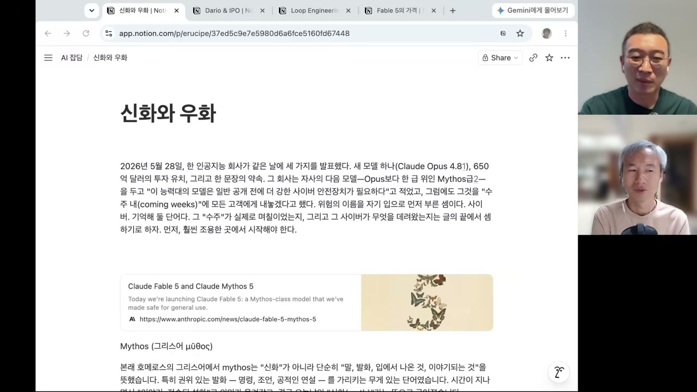
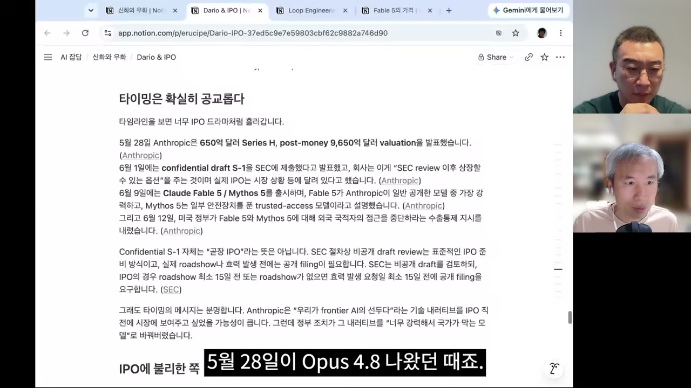
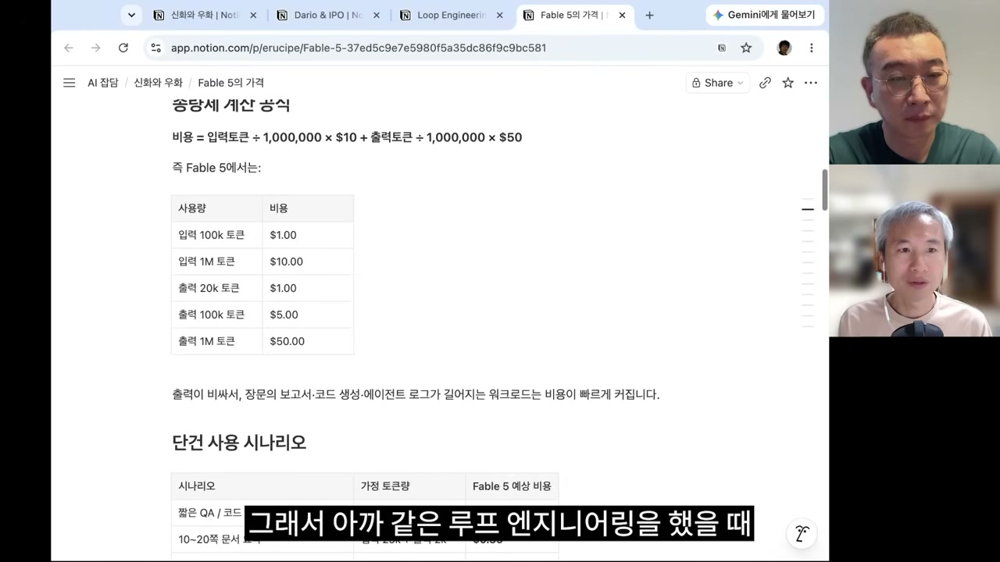
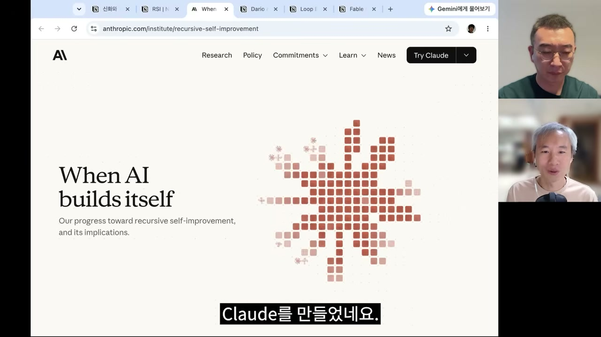

3년 전, 두 사람은 "공부하는 셈치고 한번 만나보자"며 자리를 잡았다. 그게 100회가 됐다. 첫 회를 녹음하던 무렵은 GPT-4가 막 나왔을 때였고, 마이크로소프트의 세바스티앙 부벡이 'AGI의 불꽃'이라는 논문에서 GPT-4를 해부하며 유니콘 그림을 그리게 하던 시절이었다. 그때의 화제가 "모델이 유니콘을 그릴 수 있느냐"였다면, 지금은 "펠리컨이 자전거를 타는" 그림으로 넘어왔다. 그 사이 불가능하다던 것들은 하나씩 깨졌다.

이번 100회는 두 진행자가 멀리 떨어진 채 녹음됐다. 정 사장은 샌프란시스코 출장 중이라 현지에서 프론티어 랩과 스타트업을 돌며 들은 인사이더 이야기를 들고 왔고, 스튜디오에 남은 승주는 며칠 사이 쏟아진 뉴스를 들고 마주 앉았다. 그리고 그 며칠 사이에, 이 대담의 거의 모든 화제를 집어삼킨 사건이 하나 터졌다. Anthropic의 새 모델 Fable 5가, 미국 정부의 수출 통제로 외국 국적자에게 닫혀버린 것이다.

## 미토스와 페이블, 이름에 담긴 구도

먼저 사건의 골격부터. 4월에 Anthropic이 Mythos라는 모델을 살짝 공개했다. 두 달쯤 지나 이번 화요일, 그것이 Fable이라는 이름으로 바뀌어 갑자기 풀렸다. 커뮤니티가 바이브 체크를 하며 "뭐가 달라졌나" 떠들던 게 불과 3일. 그러다 어제, 미국 정부 규제로 미국 국적자가 아닌 사람은 Fable에 아예 접근할 수 없게 됐다.

이름이 재밌다. Mythos는 신화고, Fable은 우화다. 그동안 Anthropic의 작명은 하이쿠, 소네트, 오퍼스처럼 시의 크기가 커지며 작품성이 짙어지는 계열이었다. 그런데 이번엔 결이 확 바뀌었다. 신화를 사람들에게 대중적으로 풀어 전하는 것이 우화이고, 이솝우화처럼 배포용으로 다듬은 결과물이 결국 Fable이라는 것이다. 미토스는 여전히 신계에 가둬둔 채 일부만 접근하고, 그 존재를 인간에게 내려주는 형태가 페이블인 셈이다.

흥미로운 건, 이 이름 풀이를 모델 자신이 짚어줬다는 점이다. 정 사장이 "이 이름의 근간이 뭘까"를 직접 물었더니, 모델이 제한된 원본(미토스)과 안전하게 공개된 버전(페이블)이라는 구도가 이름 자체와 맞물려 있다고 답했다. 정 사장은 그 설명에 공감했다고 말한다. 그리고 그 구도는 단순한 작명 놀이로 끝나지 않았다. 페이블이 그렇게 닫힌 이유를 파고들면, 제일브레이크를 했을 때 보안과 생물학에 관련된 기능을 켤 수 있다는 이야기가 되기 때문이다. Fable이 발표됐을 때 정 사장이 직접 바이오 관련 쿼리를 던지자 모델은 곧장 "이건 대답할 수 없습니다"라며 닫혀버리고 4.8 모델로 바뀌어버렸다고 한다. 광범위하게, 거의 기계적으로 차단하는 인상이었다는 것이다.

그러니까 닫힘은 안전만을 위한 선제 조치였지만, 정 사장은 그게 안전 하나로만 설명되지는 않을 거라고 본다. 정황은 훨씬 복합적이다.

## 타임라인을 겹쳐 보면

정 사장은 이 사건을 다리오 아모데이가 블로그에 써온 글들의 흐름 위에 올려놓고 읽었다. 다리오 아모데이는 페이블과 미토스를 만든 Anthropic의 CEO다. 사건 하나만 떼어 보지 말고, 회사를 이끄는 사람의 생각이 그간 어떻게 흘러왔는지를 시간순으로 깔아두고 그 위에서 해석해보려는 것이다. 다만 글을 일일이 읽기는 번거로우니, GPT-5.5에게 "머신즈 오브 러빙 그레이스부터 가장 최근 글까지 깊이 읽고 핵심을 인용해 솔직한 생각을 말해달라"고 시켜 한 번에 훑었다.

그렇게 추려진 게 오래된 것부터 글 셋이다. 2024년 말에 쓴 '머신즈 오브 러빙 그레이스', 그보다 최근에 기술의 '청소년기'를 다룬 묘하게 음미할 만한 글, 그리고 며칠 전 가장 최근의 'Policy on the AI Exponential'(AI 급성장 시대의 정책)이다.

날짜를 끝에서부터 줄 세우면 그림이 선명해진다.

- 5월 28일, Opus 4.8이 나왔고 시리즈 H 밸류에이션 9,650억 달러가 발표됐다.
- 6월 1일, RSI(Recursive Self-Improvement, 재귀적 자기증강) 발표. 같은 날, SEC에 상장을 위한 S-1 증권신고서를 컨피덴셜 드래프트로 제출했다. 제출하면 경쟁자나 대중이 정보를 알게 되니 일정 기간 비공개로 두는 드래프트가 있는 모양이다.
- 6월 9일, Fable 5를 한번 쇼업.
- 그리고 3일 만에, 미 정부에 의해 닫힘.

정 사장의 해석은 이렇다. Anthropic은 능력을 보여줘야 하니 어떻게든 이 모델을 배포하고 싶었다. 하지만 안전을 늘 내세워온 회사이니 위험을 잘 깎아내야 했고, 그래서 배포할 수 있을 만큼 다듬었는데, 그게 3일 만에 정부에 의해 막혀버린 것이다. 재미 삼아 모델에게 "이게 IPO에 유리할까 불리할까"를 물었더니, 너무 당연하게도 TAM(Total Addressable Market, 전체 접근 가능 시장) 관점에서는 불리하다는 답이 돌아왔다. 외국 국적자가 막히면 시장이 줄어드니까.

그런데 같은 사건을 뒤집어 보면 다른 메시지가 읽힌다. 단기적으로는 "언제든 국가 권력이 이걸 다룰 수 있다"는 불안한 신호지만, 동시에 "국가가 통제에 나설 만한 능력이다"라는 걸 방증한 셈이 되기도 한다. 만약 이게 해프닝으로 끝나 다시 접근이 회복된다면, 아직 OpenAI가 5.6을 못 내고 있는 상황에서 오히려 유리하게 작용할 수도 있다.

이 RSI 발표에서 정 사장은 기시감을 느낀다. 2025년 10월 30일, 야쿱 파호츠키가 샘 알트먼과 함께 자기증강형 AI 연구자 로드맵을 발표했던 그 장면이다. 그즈음 AI 연구자 인턴을 내고, 2028년에는 완전 자율 AI 연구자를 내놓겠다던 그 그림이 지금 맞아 돌아가고 있다는 것이다. 거기에 안드레이 카르파티가 한 달 전쯤 Anthropic의 프리트레이닝 팀에 합류한 일도 겹친다. 오토 리서치를 하던 사람이 그 자리에 들어갔다는 사실이, 미약하더라도 같은 방향을 가리킨다.

물론 "이거 다 IPO 맥싱(밸류에이션 극대화) 아니냐"는 시선도 있다. 정 사장도 그 부분엔 공감한다. 다만 공감의 결론은 이쪽이다. 지금 이건 전략자산급으로 공인됐다는 것. AGI라는 말은 요새 오히려 희미해진다. 어떤 영역은 너무 잘하고 어떤 영역은 여전히 못해서 들쭉날쭉하기 때문이다. 그래서 'AGI냐 아니냐'보다, 국가가 손을 댈 만한 무언가가 됐다는 사실이 더 또렷하다.

## 페이블은 얼마나 비싼가

성능 이야기에서 두 사람은 신중하다. 누군가는 "이거 오퍼스보다 뭐가 더 좋은지 모르겠다"고 하고, 누군가는 벌써 "돈 내고 써야겠다, 의미 있다"고 한다. 수확 체감이 안 되는 사람은 오퍼스 4.8의 경계 이상으로 나갈 필요가 없는 섹터에 있는 것일 수도 있다. 그게 나쁜 게 아니라, 그 정도에서 행복한 지점에 있는 것이다. 사람마다 다를 수밖에 없으니 누군가의 시각을 일반화해 읽기는 어렵다. 다만 사이버 시큐리티나 바이올로지처럼 프론티어 연구를 하던 사람들 입장에서는, 못하던 일을 해냈다고 체감할 만큼 확 좋아진 지점이 있었다고 한다.

그런데 성능보다 두 사람이 더 파고든 건 가격이다. 요새 또 하나의 세일즈 마케팅 용어가 나왔다. 루프 엔지니어링. 하네스 엔지니어링 다음에 나온 말인데, 트위터에서 클로드 코드를 만드는 보리스 체르니와 오픈클로를 만든 피터 슈타인베르거가 비슷한 시기에 루프에 대한 트윗을 했다. 요지는 "이제 우리는 루프를 짜고, 그걸 맡겨두고 우리 생각은 다른 쪽으로 전환해야 한다"는 것. 1년도 더 전에 나온 랄프 루프와 뭐가 다른가가 캐치 포인트인데, 랄프 루프가 단순했다면 지금 말하는 루프 엔지니어링은 더 복잡하다. Anthropic이 발표한 다이나믹 워크플로우, 울트라 코드 같은 키워드처럼 오케스트레이션을 강하게 거는 구조다. 메인 모델들이 펼치고 접고를 반복하는 게 정식화된 셈인데, 문제는 그럴수록 토큰 비용이 엄청나게 늘 수 있다는 점이다.

그래서 정 사장은 직접 계산해봤다. 루프 엔지니어링이라는 마케팅 수사를 그냥 위임 방식으로 섣부르게 돌리면 얼마가 나오는가.

| 모델 | 입력 / 100만 토큰 | 출력 / 100만 토큰 |
| --- | --- | --- |
| Fable 5 | $10 | $50 |
| Opus 4.8 | $5 | $25 |

오퍼스보다 페이블이 기본 두 배 비싸다. 입력 100만 토큰에 10달러, 출력에 50달러다. 여기서 곁가지로, 왜 입력은 싸고 출력은 비싼가를 짚고 넘어간다. 디코딩 때문이다. 출력의 디코딩은 한 스텝 한 스텝 돌아야 하지만, 입력은 프리필을 한 번에 배치로 때릴 수 있다. 이론상으로는 1대 5보다 훨씬 더 벌어져야 하는데, 그냥 퉁쳐서 서로 카피하며 가격 체계를 만드는 분위기라는 게 정 사장의 관찰이다.

그리고 이 가격이 거꾸로 모델 크기를 역산하는 근거가 된다는 게 드와케시 편에서 얻은 인사이트다. 4.8을 5T(5조 파라미터)급으로 본다면, 가격이 두 배인 미토스는 막연히 10T급으로 짐작해볼 수 있다. 물론 정 사장도 "4.8이 몇이고 미토스가 몇인지는 전혀 모른다"고 못 박는다. 밖에서 스타트업이 현실적으로 트레이닝한다면 3\~50B 정도가 맥스고, 100B만 넘어도 단위가 확 뛰며, 500B쯤 되면 그보다 훨씬 더 뛴다. 그런데 프론티어 랩들이 쓰던 오퍼스나 프로급은 1\~2조급이라고들 이야기한다. 다들 컨펌은 안 해주지만 대략 그렇게 흘린다는 것이다. GPT-4 때부터 2조 정도가 나왔으니, 미토스가 10조라면 5배 차이인데 가격 차이는 두 배에 그친다. 드와케시의 해석을 따르면 이건 원가 근처라는 뜻이다. 경쟁 상황이라 여기서 크게 마진을 남기진 않을 거라는 추측이다.

전체 가격 지형에서도 엔트로픽이 제일 비싸다.

이 숫자들을 굳이 왜 알아야 하느냐는 승주의 질문에, 정 사장의 답이 인상적이다. 숫자를 체화하면 겁먹지 않게 된다는 것이다. 거대한 모델이 나와 나를 압도한다는 막연한 공포가 아니라, "아 이게 뭔가 이유가 있구나"로 바뀐다. 가격이나 모델 크기 같은 숫자 근처에 해석의 여지가 있어서, 압도당하는 대신 들여다보게 된다.

실제 비용 감각은 이렇다. 페이블은 6월 22일까지 한시적으로 열기로 했었다(구독에 포함할지 종량제로 갈지 간을 보려던 것인데 정부 제재로 막혔다). 그래도 API로 쓴다면 얼마가 나올까. 쉬운 단건 시나리오로 다이나믹 워크플로우를 돌리면 최대 1,000 에이전트까지 돌릴 수 있는데, 소넷 4.6으로 400달러 근처인 작업을 페이블로는 1,500달러를 들여야 한다. 사람들이 페이블에 크레딧을 주고 밤새 돌려보던 그 재미가, API 기준으로는 예전에 비하면 만만치 않은 돈이라는 얘기다.

여기서 미첼 하시모토의 비판이 등장한다. 훨씬 적은 돈으로 사람이 노력해서 하면 더 빨리 제대로 일을 끝낼 수도 있는데, 더 비싼 돈을 들여 모델이 긴 시간 일하게 만든다는 지적이다. 반면 정형원 박사는 다른 쪽을 본다. 아직 테스트 타임 컴퓨트에서 꺼낼 수 있는 과실이 많이 남았다는 것. 결국은 스케일이고, 더 큰 스케일을 내면 모델이 할 수 있는 일이 훨씬 많아진다는 전망이다. 정 사장은 양쪽에 다 고개를 끄덕인다. 상업적으로는 결국 가격과 성능의 트레이드오프이고, 비싸더라도 짧은 토큰 안에 일을 끝내 이득인 섹터가 있는가 하면, 작은 모델로 테스트 타임 컴퓨트를 더 많이 돌리는 게 이득인 섹터도 있다. 정답은 각자 계산할 몫이다.

## 클로드가 클로드를 만든다

이 모든 흐름의 배경에 깔린 그림이 하나 있다. Anthropic이 올린 'When AI builds itself' 포스팅이다. 정 사장은 이 그림 하나가 이미 내용을 다 설명했다고 본다. 처음 등장하는 게 클로드인데, 그 클로드가 클로드를 만들고, 그걸 재귀적으로 반복한다.

승주가 곧장 받아친다. 이건 우리가 너무 잘 아는 것과 완벽한 동형 아니냐고. 생명의 세포 분열과 똑같다는 것이다. 프랙탈을 보여주고 있는데, 하나에서 출발해 끝까지 가도 큰 섹터에서 봐도 여전히 자기 자신과 똑같은 모양이다. 여러 번 말해왔고 모두가 기대하듯, RSI의 문턱으로 가고 있다는 선언이다. 아직 그 궤도에 정확히 있다고는 하지 않지만, 그 방향이라는 걸 분명히 했다. 그리고 이 글을 6월 초에 내고, 6월 초에 S-1 문서를 제출했다. 다 의도가 있는 비즈니스라는 게 정 사장의 읽기다.

느낌상 이건 전혀 플라토(정체기)가 아니다. 계속 기울기가 높아지는 궤도다. 다만 여기서 두 사람이 던지는 질문이 묵직하다. 밖에 있는 우리가 알고리즘이나 아키텍처 변화에 호들갑을 떠는 게 민초들의 삶이라면, 정작 프론티어가 제일 중요하게 보는 건 데이터셋과 스케일이다. 그건 밖에서 잘 보이지도, 접근하지도 못한다. 알고리즘 발전은 이제 큰 차별화 요소가 아니다. 좋은 게 나오면 그냥 안에 끼워 넣으면 그만이고, 진짜 중요한 건 데이터셋의 양과 모양, 그리고 컴퓨팅 스케일이다.

여기서 스케일링의 비정함이 드러난다. 미토스는 10조 파라미터급 모델인데, 이건 모델 자체의 크기 얘기고 그걸 학습시킨 데이터의 양은 또 따로다. 3년 전만 해도 프론티어 모델이 3조, 5조 토큰에서 학습했다는 얘기를 들었다면 지금은 기본 30조 토큰이고 계속 늘어난다. 드와케시 10편에 따르면 지금 친칠라 옵티멀보다 100배 정도 오버트레인된 상태다. 그런데도 더 늘리면 거기서 추가 이득이 계속 나온다는 게 지금 보고 있는 현실이다.

문제는 그 다음 한 칸이다. 투입을 10배 늘리면 체감하는 향상은 2배쯤 올라오는 상황. 1조에서 10조로 가며 성능이 2배 좋아졌다 치자. 거기서 또 2배를 가려면 불과 6개월 전에 익숙하던 스케일에서 100배를 더 올려야 한다. 100배 스케일이란, 지금 지구상에 현존하는 컴퓨테이션을 한 모델의 트레인에 다 부어야 한다는 수준이다. 현실적으로 어렵다. 그래서 정 사장은 한 가지 가능성을 던진다. 10조급에서 어떤 상업적 기대는 한참 동안 멈출 수도 있다고. 그 다음은 엔비디아 GPU가 아니라 퀀텀 컴퓨팅 정도로 패러다임이 바뀌어야 지속 가능한 수준일 수 있고, 그쯤 되면 거의 공상과학 영역이라, 예전에 아셴브레너가 시추에이션 어웨어니스에서 보여줬던 식의 숫자를 제시하긴 어려워 보인다.

흥미로운 건, 이 한계효용 이야기를 다리오가 이미 했다는 점이다. 2024년 말 머신즈 오브 러빙 그레이스에서 특정 영역의 수확 체감을 전망했는데, 그게 지금 벌어지고 있다. 그때만 해도 샘 알트먼이나 다리오가 밖에 나와 말하면 그걸 해석해 나름의 그라디언트를 읽을 수 있었는데, 지금은 그 사람들조차 모르는 미지의 영역으로 끌려 올라가는 느낌이라고 정 사장은 말한다. 정리해서 발표할 틈도 없이, 그냥 막 부어넣고 있는 중이다. 그 수혜는 여전히 반도체, 전력, 데이터센터로 간다. 엔비디아는 계속 좋다.

## 통제는 게임의 규칙을 바꾼다

미국 정부가 10조급 모델에 손을 댄 이 장면은, 두 사람에게 새로운 게임의 시작으로 읽힌다. 목적물이 보이면 그건 이제 컴퓨테이션과 시간의 함수라는 걸 모두가 확인했다. 마치 누가 먼저 원자폭탄을 개발하고, 개발해서 뒤따라오는 사람의 사다리를 걷어찰 수 있느냐의 게임이다.

그런데 미국만 할 리 없다. 배웠으니 중국도 할 수 있고, 수출 통제 역시 중국도 걸 수 있다. 여기서 미국과 중국은 일종의 치킨 게임이자 죄수의 딜레마에 놓인다. 미국이 전략자산화하고 통제하면, 중국은 그것들을 풀면서 미국이 아닌 다른 나라를 다 껴안는다. 그런데 미국과 중국이 둘 다 막는다면, 역설적으로 한국에 기회가 온다. 마침 키미 K2.7 코드 버전이 조용히 나왔지만 지금 분위기에 묻혔다는 이야기도 곁들여진다.

정 사장은 이걸 나쁘게 보지 않는다. 오히려 좋다고 본다. 독자 파운데이션 모델 쪽에서는 좋은 이슈일 수 있다. 업스테이지가 100B 모델을, SK텔레콤이 500B 모델을 내놓은 상황에서, 국가 차원에서도 자원을 떨어뜨릴 준비를 하고 있다. 크고 작은 프론티어 모델을 향해 달릴 인센티브는 충분하다. 그러면서 정 사장이 던지는 한 문장이 이 국면을 압축한다. 지금은 돈보다 기회와 미래에 대한 준비, Future Readiness가 더 소중한 자산이라는 것. 돈이 오히려 더 흔한 시기다.

샌프란시스코에서 정 사장이 본 풍경도 이 진단과 맞물린다. 데이터셋 만드는 회사, 에이전트 빌딩 회사, 새로운 월드 모델을 개발하겠다는 회사까지, 꿈을 꾸는 20대 초반 창업자가 굉장히 많았다. 17살, 14살에 대학에 들어간 천재들이 "지금의 트랜스포머는 문제가 있다, 새로운 월드 모델이 필요하다"고 말하면 자본이 쭉쭉 반응한다. 대여섯 명이 회사를 만들면 한국 돈으로 3천억에서 5천억 밸류에이션을 부르는 경우가 허다하고, 투자받는 금액도 몇백억 단위다. 환율이 1,500원까지 벌어져 그 차이가 더 크게 느껴진다.

반면 같은 자본 안에 정반대 시각도 공존한다. "2년 전에도 그런 얘기하는 애들 많았는데 결국 현실 문제는 하나도 못 풀고 다 도망가고 회사는 망하더라"는 것. 그래도 아직은 희망이 지배한다. 꼭 프론티어 랩에 팔려야 하는 것도 아니다. 프론티어 랩과 비슷한 일을 하고 싶어 하는 돈 많은 엔터프라이즈가 많아서, 대형 엑싯이 아니어도 중간중간 꽤 돈을 버는 엑싯 찬스가 많다.

같은 패턴이 LLM 바깥에서도 반복된다. 정 사장이 타겟하는 비즈니스는 신약 개발, 론제비티 같은 바이오 쪽인데, 여기서 두 부류가 갈린다. 제넨텍이나 큰 제약회사에 있던 분들은 여전히 "그건 안 돼, 그건 어려워"라고 말한다. 반면 그 산업을 완전히 AI 사이드에서 접근하는 사람들은 "지금이 GPT-2 모멘트 정도"라며 정반대로 생각한다. 그들의 발상은 이렇다. 예전 머신러닝은 문제마다 데이터셋 형태가 정해지고 모델 구조가 거기 맞춰 바뀌어야 했지만, LLM과 멀티모달, 그리고 RL과 인바이런먼트가 들어오면서는 그냥 하나의 문제로 풀린다. 큰 모델이 일반화하면 구체적인 문제도 다 풀린다는 원칙이다. 바이오 쪽 사람들도 똑같이 생각한다. DNA, 프로틴, 셀(이걸 올간이라 부른다) 레벨에서 생기는 것들을 그냥 다른 모달로 규정하고, 소리, 이미지, 비디오처럼 한꺼번에 집어넣고 트레인한다. "그렇게 하는데 되네?"를 직접 본 것이 정 사장이 이번 출장에서 얻은 제일 큰 수확이었다.

## 그래서, 모델과 무엇을 했는가

마지막에 정 사장은 한 발 물러나 결이 다른 이야기를 꺼낸다. 노버트 위너가 1950년에 쓴 '인간의 인간적 활용'이라는 책이다. 자동화 사회에서 인간의 인간적 활용은 무엇이 되어야 하는가를 다룬 책인데, 지금 국면에서 떠올랐다고 한다.

그 이야기를 꺼낸 이유는 정 사장 자신의 페이블 5 바이브 체크 경험 때문이다. 그동안 읽고 옮겨 적어둔 교육 관련 글들을 입력해 페이블과 대화를 나눠봤다. 재미있는 건 두 개의 세션이었다. 하나는 이야기를 나눈 세션, 하나는 그 대화를 다시 돌아보는 세션. 대화하면서 모델이 자신을 추켜세운다고 느꼈는데, 다른 세션에서 그 아첨과 성찰 능력 자체를 아주 잘 짚어내더라는 것이다. 클로드 계열이 원래 그걸 잘했지만, 페이블은 정말 잘했다고 정 사장은 말한다.

그러다 정 사장은 사이버네틱스에서 통용되는 한 개념을 모델에게서 배웠다. **The purpose of a system is what it does**(시스템의 목적은 그것이 실제로 하는 일이다). 내가 무엇을 하고 싶어 하느냐, 내 의도나 목표와는 별개로, 실제로 하고 있는 일이 모델과 나의 관계를 드러낸다는 뜻이다. 정 사장은 이 말이 참 맞다고 느낀다. 자신이 모델과 나눈 대화 자체가 곧 자신이 하는 일이었기 때문이다. 페이블과 대화하며 정 사장은 "나는 생산적이고 실용적인 코드도 만들지만, 무언가 꽂힌 것을 파고드는 걸 즐기는 사람이구나"를 재인하게 됐다고 한다.

이걸 거꾸로 돌리면 흥미로운 관점이 된다. 그동안 모델과 나눈 대화를 돌아보는 것이다. 어떤 사람은 코드를 생산하고 일에 쓰는 실용적 방향이고, 어떤 사람은 호기심을 탐구하는 성향이다. 그게 모델과 자신의 관계를 통해 드러난다. 다만 정 사장은 이 경험을 자세히 공유하기 어렵다고 솔직히 말한다. 공부를 파고들수록 좁은 영역으로 들어가게 되고, 생경한 용어가 점철되어 남에게 전하기가 갈수록 어려워지기 때문이다. 페이블이 다 좋았던 것도 아니다. 오퍼스 4.6 시절 글쓰기를 잘하던 프롬프트를 돌렸을 땐 좀 밋밋했고, 수확 체감이 있었다. 프롬프트 문제일 수도 있다. 결국 나에게 맞는 걸 알아보려면 다각도로 실험하는 수밖에 없다는 결론이다.

## 100회, 그리고 사람의 시간

대담은 회고로 닫힌다. 작년 이맘때를 떠올리면 격세지감이다. 클로드 코드가 2025년 2월에 나왔고, 그해 5월과 6월은 커뮤니티가 "클로드 코드란 무엇인가"를 막 알아가던 시기였다. 그 무렵 소라가 나왔고, 코덱스가 헛발질하는 동안 Anthropic은 2025년 가을부터 클로드 코드의 버프를 받아 회사 가치를 쭉 올렸다. 그 사이의 변화가 어마어마해서, 어제 일어난 수출 통제를 1년 전에 미리 말해줬다면 믿었을까 싶을 정도다.

그러면서 엔지니어링의 의미가 바뀌었다는 통찰이 나온다. 이제 아무도 라인 바이 라인으로 코딩하지 않지만, 쓸 만한 시스템을 만들려면 여전히 엔지니어링이 필요하다. 에이전트와 함께 한 층위 올라가 아키텍처를 설계하는 일로 바뀐 것이다. 정 사장이 마인크래프트 에이전트를 만들며 러스트를 쓰기 시작했는데(직접 쓴 게 아니라 모델이) 너무 잘 돼서 깜짝 놀랐다고 한다. 그런데 몇천 라인에서는 문제없던 것이 3일 만에 6만 라인으로 뻥튀기되자, 리팩토링해야 할 중복이 쏟아졌다. 그 시멘틱한 중복을 잡으려고 도구를 찾게 되는데, 코르카의 강규영 CTO님이 노즈라는 '코드의 냄새를 맡는 도구'를 순식간에 만들어냈다고 한다. 엔지니어링에 도움이 되는 도구 자체를 만드는 부트스트래핑이 또 일어나고 있는 셈이다.

100회를 맞은 두 사람의 결론은 자축이 아니라 고민 쪽이다. 일주일 단위로 콘텐츠를 요약하는 방식으로는 따라갈 수 없을 만큼 너무 빨리 변하는 시기가 됐다. 사람의 속도로 따라가는 게 불가능한 느낌이라, 이걸 시스템화해야겠다는 생각. 실리콘밸리와 서울 사이를 더 강력하게 연결하고, 한국에서 일어나는 일을 여기에 더 알려야겠다는 생각. 나라 단위가 아니라 진짜 지구 단위 스케일의 일이 벌어지고 있어서, 자기들이 할 일을 꾸준히 찾아야겠다는 다짐이다.

그리고 마지막에 정 사장은 자신에게 똑같은 질문을 돌린다. 바이올로지 쪽에 너무 재미난 게 많아 하루하루가 잘 가지만, 다 할 수는 없다고. 사람의 시간을 살아야 하니, 가장 영양가 있고 임팩트 큰 일 하나를 잡아야 하는 타이밍이라고. 시스템의 목적은 그것이 실제로 하는 일이라는 그 말이, 결국 100회를 채운 두 사람에게 그대로 돌아온 셈이다. 다음 페이즈로는 팔란티어 FDE 출신 엔지니어를 모셔 세션을 열어볼 생각이라는 예고와 함께, 100회는 그렇게 마무리됐다.
