"저는 요새 제 뇌를 빼버렸습니다."

영상은 이 한 문장으로 시작한다. 채널 '실용주의 개발'의 화자는 자기가 더 이상 정리를 하지 않는다고 말한다. 위키를 작성하지도 않고, 무엇을 할지 시키고 필요할 때 질문만 던질 뿐이라는 것이다. 그 모든 걸 대신하는 게 그가 'LLM 위키'라고 부르는 시스템이다. 도발적인 도입이지만, 그가 진짜로 겨누는 건 누구나 한 번쯤 겪은 작고 짜증나는 장면들이다.

## 매번 같은 설명을 반복하는 피로

챗지피티나 클로드를 쓰다 보면 매 대화마다 처음부터 맥락을 다시 깔아야 한다. 어제 했던 대화를 찾으려고 히스토리를 몇 분째 스크롤한 경험, 같은 배경 설명을 또 타이핑하는 피로. 화자는 이게 누구나 겪는 문제이고, 특히 개발자한테는 굉장히 귀찮은 일이라고 짚는다.

여기서 흔한 반론이 하나 나온다. "AI가 다 해주니까 괜찮은 거 아니냐", "AI는 프롬프트만 잘 짜면 되는 거 아니냐." 화자는 이걸 **절반만 맞는 얘기**라고 못 박는다. 클로드코드나 코덱스를 쓰는 사람이라면 한 번쯤 'AI가 내 코드를 다 안다'고 느낀다. 코드는 알 수 있다. 하지만 그 코드가 왜 그렇게 짜였는지, 회의에서 무슨 얘기가 오갔는지, 어떤 히스토리 위에서 결정됐는지는 AI가 알 방법이 없다. 진짜 문제는 프롬프트 바깥에 있다는 것이다.

## 맥락이 흩어진다

화자가 첫 번째 문제로 꼽는 건 '맥락의 분산'이다. 내가 손으로 정리하던 메모장이나 노션은 나중에 열어보면 정리가 안 된 쓰레기장이 되어 있다. 챗지피티는 AI를 갖고 있지만 내 데이터는 모르고, 내 메모장은 데이터를 갖고 있지만 AI가 없다. 둘 다 한 조각씩만 쥐고 있을 뿐, 둘을 다 갖춘 건 없다. 그래서 이건 프롬프트로 풀릴 문제가 아니라는 것이다.

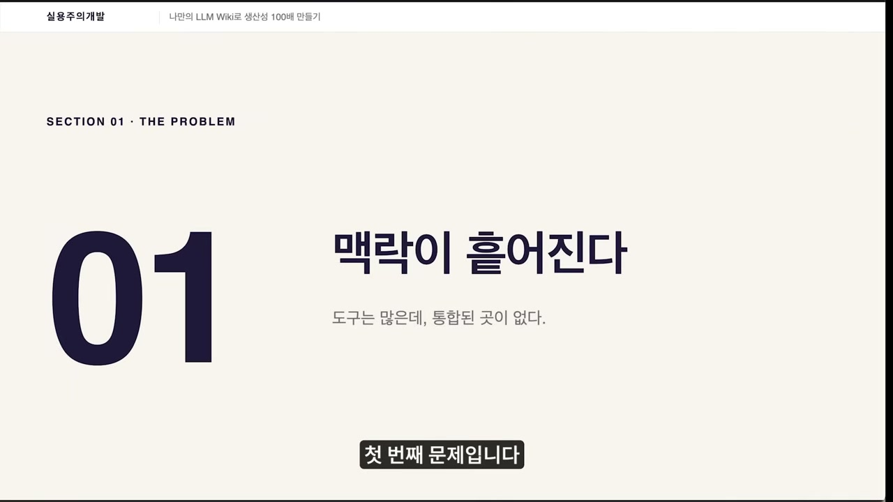

개발자나 기획자가 평소 마주치는 장면을 그는 네 가지로 늘어놓는다. 3개월 전에 어떤 아키텍처로 결정했는데 왜 그렇게 했는지 지금은 기억이 안 난다. PR 코멘트를 뒤져봐도 단편만 남아 있다. 회의에서 "그거 지난번에 얘기했잖아요"라는 말을 듣고 멘붕이 온다. 분명 들었는데 기록이 없다. 슬랙 어딘가에서 중요한 의사결정이 분명 있었는데 어느 채널 어느 스레드였는지 못 찾는다. 1년 전에 비슷한 버그를 분명히 풀었는데 어떻게 풀었는지 기억이 안 나서 또 처음부터 디버깅한다.

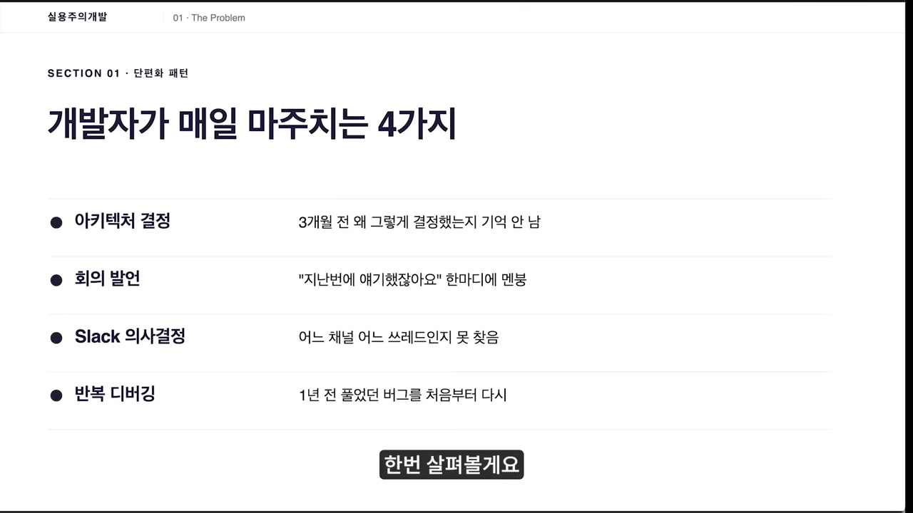

도구가 없어서 생기는 일이 아니다. 노션, 슬랙, 지라, 깃, 챗지피티. 도구는 오히려 많다. 문제는 다 단편만 갖고 있고 통합이 안 된다는 데 있다.

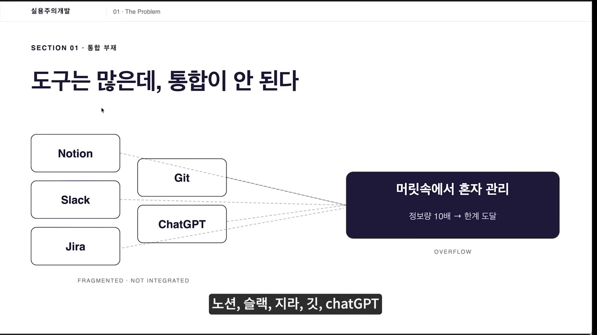

여기에 화자는 AI 시대 특유의 가속을 얹는다. 다들 업무에서 AI를 쓰면서 예전보다 정보가 몇 배로 쏟아진다. 그의 체감으로는 10배가 넘는다. 어제 어떤 회의에 들어갔고 뭐가 결정됐는지, 슬랙에서 누구랑 무슨 얘기를 했는지, 코드는 어디까지 짰는지. 이걸 머릿속에서 혼자 관리하려면 머리통이 깨진다. 정보가 늘수록 흩어진 맥락의 비용은 선형이 아니라 그 이상으로 커진다.

## LLM 위키라는 이름

그래서 우리가 진짜 원하는 게 뭐냐고 화자는 되묻는다. 나와 프로젝트의 모든 맥락이 한 곳에 살아 있고, AI가 그걸 읽고 알아서 답해주는 것. 그걸 부르는 이름이 있다는 게 그의 답이다.

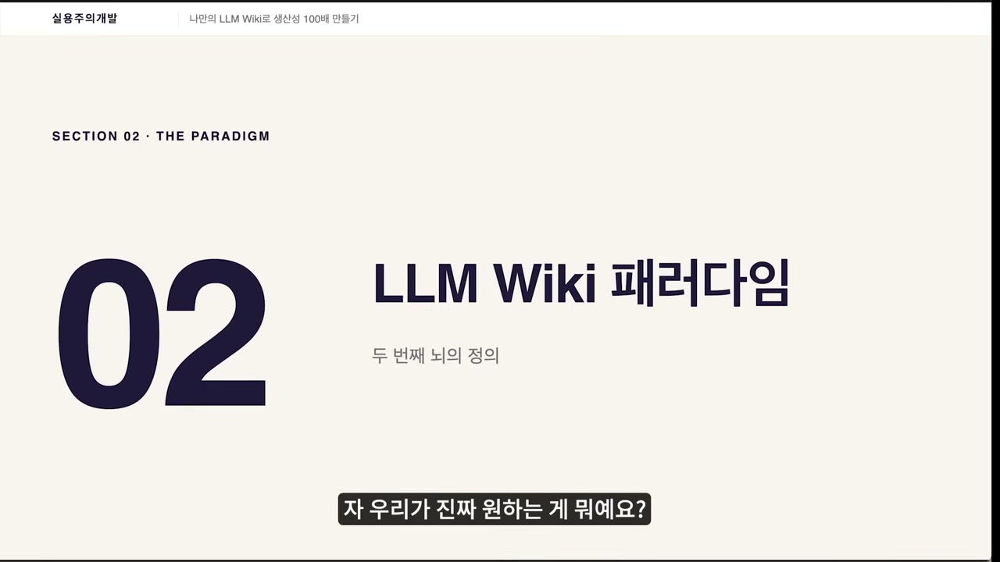

LLM 위키. 정의하면 개인 지식 DB 위에서 AI가 직접 읽고 추론하는 시스템이다. 쉽게 말하면 나만 아는 AI를 만드는 구조다. 화자는 여기서 한 걸음 더 나간다. 이건 단지 '나만 아는 AI'가 아니라 '나를 알아버리는 AI'를 만드는 구조이고, 맥락이 쌓이고 쌓이면 결국 **나를 나보다 더 잘 아는 AI**가 된다는 것이다.

흥미로운 건, 이 구조의 뿌리가 AI가 아니라 종이 카드라는 점이다. 화자는 이 시스템이 제텔카스텐이라는 방식으로 되어 있다고 말한다. 독일의 사회학자 루만이 개발한 메모 시스템으로, 아이디어 하나당 카드 하나를 만들고 그 카드들을 서로 링크하는 게 핵심이다. 그냥 정보를 저장하는 게 아니라, 메모끼리 연결되면서 새로운 아이디어가 자연스럽게 생겨나도록 설계한 방식이다. 요즘은 옵시디언 같은 도구가 이 방식을 많이 구현하고 있다.

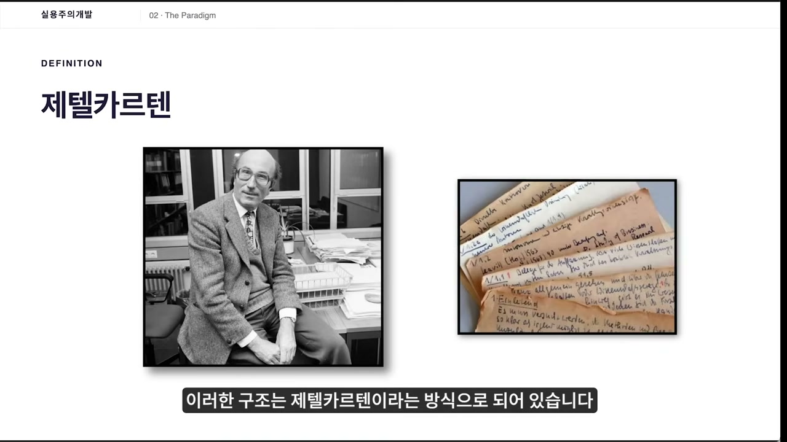

## 카르파티가 꺼낸 패턴

이 추상적인 개념을 먼저 꺼낸 사람으로 화자가 지목하는 건 안드레이 카르파티다. 오픈AI 공동 창업자이자 전 테슬라 AI 디렉터인 그가 2026년 깃허브에 'LLM 위키'라는 패턴을 공개했다는 것이다.

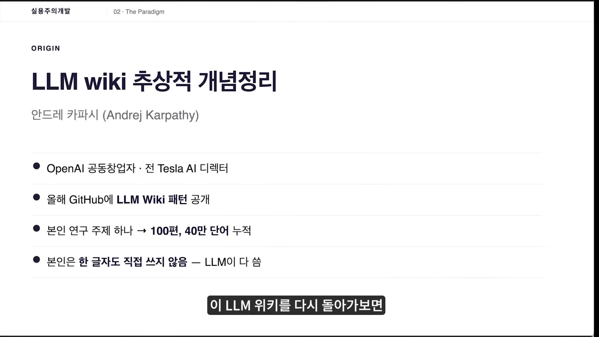

화자가 인용하는 카르파티의 사례는 구체적이다. 한 연구 주제 하나로 100편, 40만 단어를 쌓았는데 본인은 한 글자도 쓰지 않았다고 한다. LLM이 다 썼다는 것이다. 카르파티는 이렇게도 말했다고 한다. "요즘 제 토큰 쓰임새가 코드를 만지는 것보다 이 지식을 만지는 쪽으로 더 가고 있다." 코드를 짜는 데 AI를 쓰는 단계를 넘어, 지식 자체를 쌓고 다듬는 데 AI를 쓰는 단계로 옮겨가고 있다는 신호다.

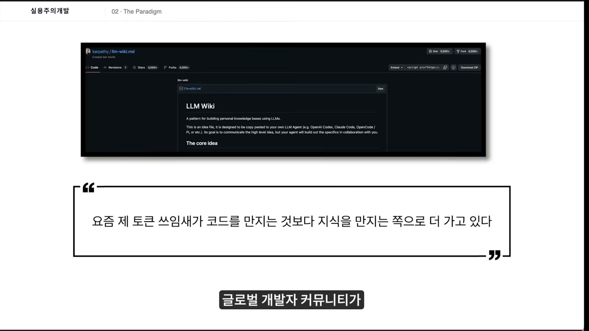

## 왜 옵시디언과 클로드 코드인가

그럼 이걸 어떻게 만드느냐. 화자는 도구가 딱 두 가지 필요하다고 말한다. 옵시디언과 클로드 코드다. 이 조합을 고른 이유가 이 영상에서 가장 실질적인 대목이다.

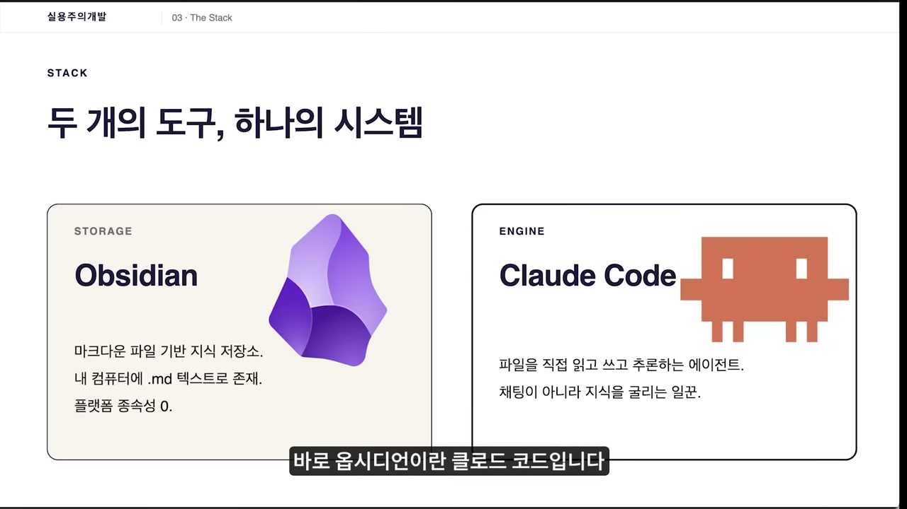

옵시디언을 고른 이유는 그것이 저장하는 파일이 그냥 마크다운, 즉 텍스트 파일이라는 데 있다. 내 컴퓨터에 텍스트 파일이 떨어져 있을 뿐이다. 별것 아닌 것 같은 이 사실에서 화자는 두 가지를 끌어낸다. 첫째는 플랫폼 종속성이 없다는 것이다. 노션 같은 클라우드 기반 도구는 데이터가 그쪽 서버에 묶여 있어서, 만약 노션이 망하면 내 데이터가 어떻게 될지 모른다. 반면 옵시디언은 파일을 로컬에 두기 때문에, 옵시디언이 망하더라도 자료는 내 컴퓨터에 안전하게 남는다. 둘째는 수명이다. 텍스트 파일이라 10년 전 컴퓨터에서도 열리고 10년 뒤 컴퓨터에서도 열린다. 화자의 표현으로는 **내 데이터가 영원히 살아남는다**는 뜻이다. 덤으로 깃으로 버전 관리가 되고, 백업은 폴더를 복사하면 끝이다.

여기에 클로드 코드가 붙으면 성격이 달라진다. 클로드 코드는 그 파일들을 직접 읽고 쓰고 추론한다. 챗지피티처럼 채팅창에 답을 뱉고 끝나는 게 아니라, 진짜로 내 디스크에 있는 파일을 만들고 고치는 에이전트라는 것이다. 옵시디언에 쌓인 내 지식을 AI가 직접 관리해주는 셈이다. 이 둘이 합쳐지면 내가 통제하는 데이터 위에서 AI가 직접 읽고 추론하는 일이 일어난다. 서두에서 말한 '통합 안 됨'이라는 문제를, 이 두 도구가 푼다는 게 화자의 결론이다.

저장은 내가 통제하는 텍스트 파일에 두고, 그 위에서 추론은 에이전트에게 맡긴다. 데이터의 주권과 AI의 능력을 한쪽도 포기하지 않으려는 설계로 읽힌다.

## 실제로 어떻게 굴리는가

화자는 자기가 이걸 어떻게 쓰는지 예시를 보여준다.

인상 깊게 본 뉴스레터나 기술 블로그가 있으면 마우스 클릭으로 클리핑만 해버린다. 그러면 내 프로젝트, 내가 하는 일에 연관되게끔 자동으로 정리가 쭈르륵 된다. 위키의 주요 내용 위주로, 나에게 맞춰서.

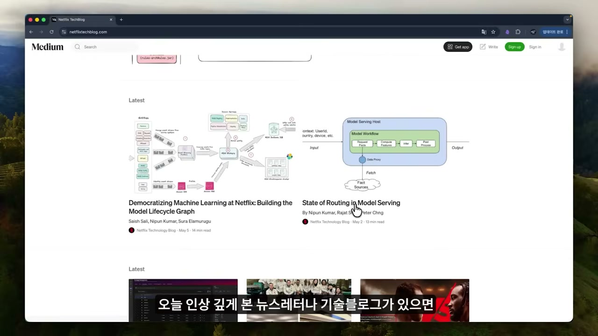

회의도 마찬가지다. 보통 회의가 끝나면 회의록을 정리하지만, 바쁘면 미루다가 결국 안 하게 된다. 화자는 회의가 끝나면 그냥 `/ingest-meeting` 한 줄을 친다. 녹취가 들어오면 누가 왔고, 뭐가 결정됐고, 누가 뭘 하게 됐고, 미해결 이슈가 뭔지 자동으로 위키 페이지에 정리된다. 결정사항은 태깅까지 돼서 나중에 검색이 가능하고, 누가 무슨 말을 했는지 정확하게 기록된다.

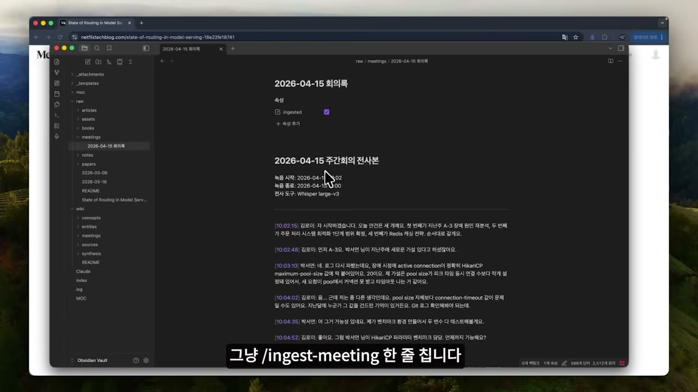

슬랙 메시지도 들어온다. MCP라는 게 있어서 클로드가 슬랙에 직접 접근할 수 있고, 바빠서 슬랙을 다 못 봐도 주요 내용을 알아서 정리해준다는 것이다.

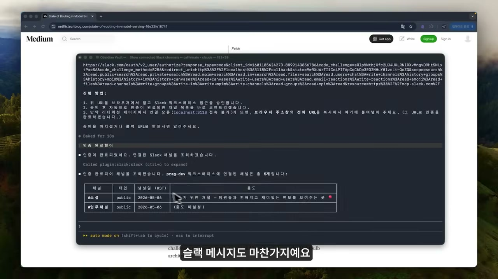

쓰임새는 정리에만 그치지 않는다. 학습 목적으로도 쓴다. "어제 프로젝트에서 개발한 내용 중 중요한 포인트가 있는지 알려줘"라고 묻거나, 한 발 더 나가 "내가 제대로 이해했는지 위키에서 중요한 내용을 조합해서 퀴즈를 내줘"라고 시킬 수 있다.

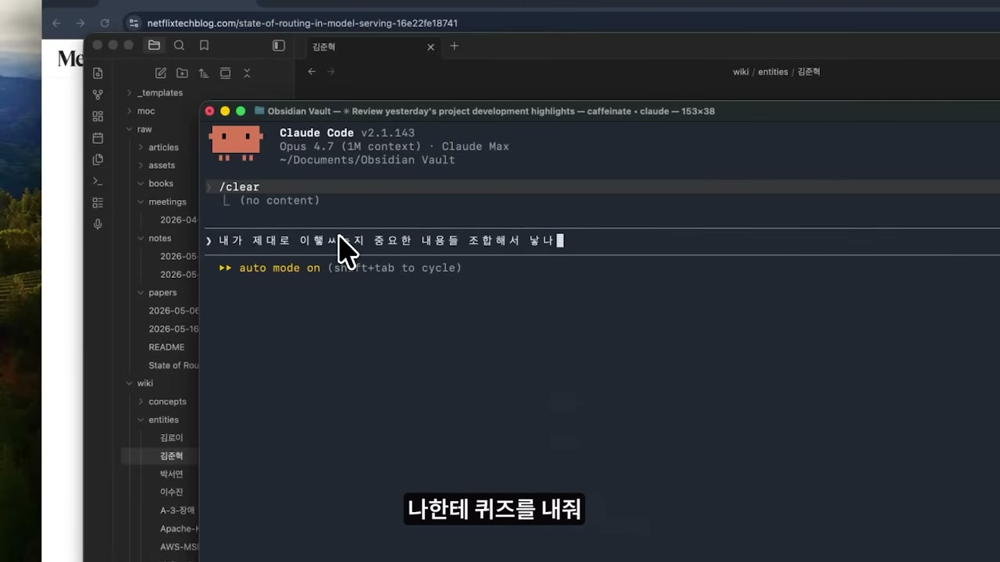

심지어 팀원이나 주변 사람의 업무가 어디까지 진행됐는지, 나와의 관계는 어떤지까지 위키 페이지로 관리된다. 사람까지 위키화된다는 것이다.

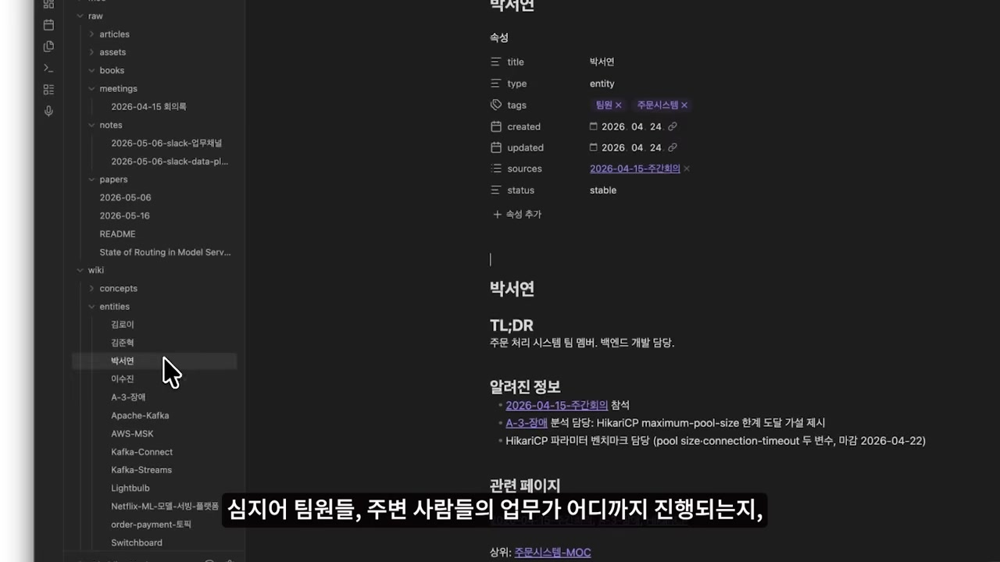

이 모든 게 쌓이면 어떤 질문이 가능해지는가. 화자는 그날 아침 LLM 위키에 "오늘 해야 할 개발 업무 정리해줘"라고 물어봤다고 한다. 같은 질문을 챗지피티에 그냥 던지면 챗지피티는 무슨 소리인지 모른다. 맥락이 없기 때문이다. 그런데 LLM 위키는 어제의 TODO, 회의, 슬랙을 이미 알고 있어서 우선순위로 정렬된 오늘의 할 일을 돌려준다. 게다가 위키는 지치지 않고 스스로 정리하고 스스로 개선한다.

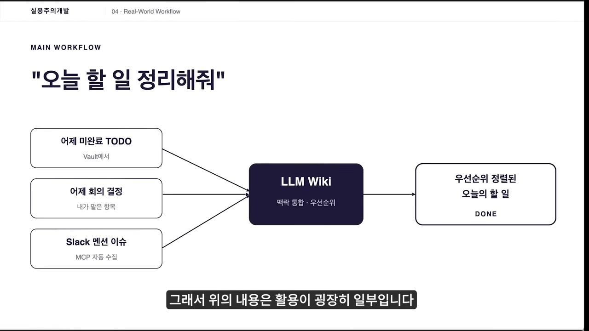

## 바뀐 것은 결국 시간

화자가 이걸 쓰면서 가장 크게 달라졌다고 꼽는 건 시간이다. 그는 여러 프로젝트를 동시에 클로드 코드로 돌리고 있고, 그러다 보면 새 기술 자료와 라이브러리 문서, 공식 문서가 매일 엄청나게 들어온다. 예전엔 이걸 정리하느라 따로 시간을 냈고, 바빠서 미루면 그냥 휘발됐다. 지금은 옵시디언에 클립만 하면 끝이다. 태깅하고, 비슷한 주제 페이지를 연결하고, 요약하는 건 클로드가 알아서 한다. 나중에 "그때 봤던 데이터베이스 최적화는 뭐였지?" 하고 물으면 바로 나오니 외울 필요도 없다.

그가 이걸 한 문장으로 정리한 게 인상적이다. **공부의 ROI가 바뀌었다**는 것이다. 따로 정리할 시간을 내지 않아도, 클리핑해둔 게 다 자산으로 쌓이기 때문이다. 들인 노력 대비 남는 게 달라졌다는 얘기다.

## 한 가지 솔직하게 짚을 것

여기까지가 LLM 위키라는 개념과 그 효용에 대한 설명이라면, 영상의 뒷부분은 성격이 다르다. 화자는 이걸 직접 만들려면 막막하다고 말한다. 본인 프로젝트에 맞게 구조를 잡고, 스킬을 만들고, 회의록 워크플로우를 짜고, 매일 어떻게 굴릴지 시행착오로 잡으려면 시간이 오래 걸린다는 것이다. 자기 핏에 맞는 LLM 위키를 만들려면 개인별 튜닝이 필요하다고도 한다. 그리고 그 해결책으로 자신의 강의를 소개한다.

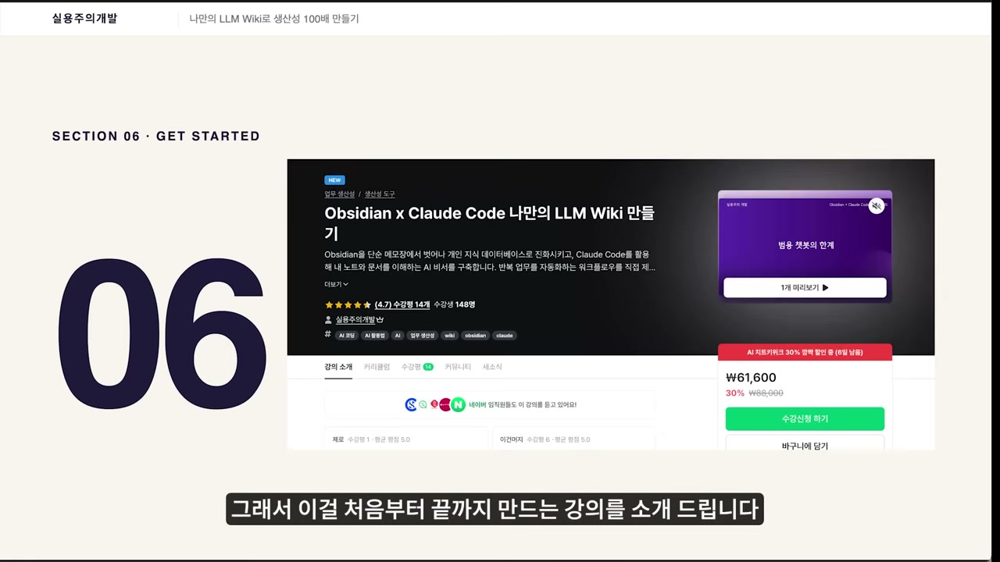

'옵시디언 클로드 코드 나만의 LLM 위키 만들기'라는 강의로, 3시간이면 본인의 위키를 바로 구축할 수 있다고 한다. 화자는 네이버 임직원들도 듣고 있고, 출시한 지 한 달도 안 됐는데 140명 넘게 수강했으며, 클로드 코드와 옵시디언을 결합한 강의 자체가 거의 없다는 점을 근거로 든다. 강의는 최신 트렌드에 맞춰 계속 무료로 업데이트된다고 한다.

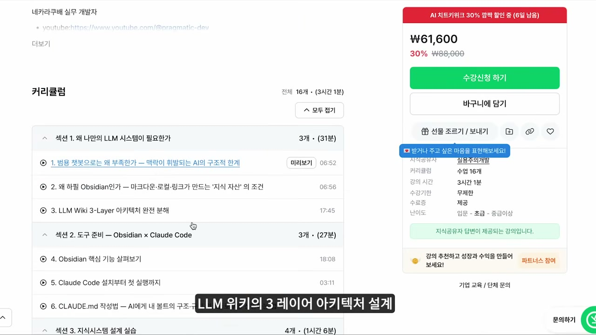

커리큘럼으로 그가 밝힌 건 LLM 위키의 3레이어 아키텍처 설계, 인제스트·린트·쿼리 같은 커스텀 커맨드를 직접 만드는 법, `CLAUDE.md`를 본인 프로젝트 규칙에 맞게 선언하는 법, 매일 지식을 쌓는 루틴과 조직 역학, 팀원 정보까지 위키화하는 페이지 설계다.

이 영상이 결국 강의 홍보로 수렴한다는 점은 분명히 해둘 필요가 있다. 그렇다고 앞부분의 문제 제기가 무효가 되는 건 아니다. 흩어진 맥락, 반복되는 설명, 휘발되는 정리. 이건 도구를 팔지 않는 사람도 똑같이 겪는 현실이고, '내가 통제하는 텍스트 파일 위에서 AI가 추론한다'는 설계 원리 자체는 강의를 사지 않아도 따라 해볼 수 있는 방향이다. 화자의 마지막 말은 이렇게 닫힌다. 지식의 홍수 속에서 나 혼자 지식을 관리할 수는 없고, AI와 함께해야 한다는 것. 그 진단에는, 강의 여부와 별개로, 곱씹을 구석이 있다.
