"저는 10명의 직원을 데리고 있습니다."

김효율의 AI 개발단 채널 영상은 이 문장으로 시작한다. 그리고 곧바로 조건이 따라붙는다. 이 직원들은 일을 시키면 토 한마디 달지 않고 밤새 학습하며 나날이 똑똑해지고, 사대보험도 연봉협상도 없다. 화자는 스스로 묻는다. "이 정도면 노동착취 같지 않나요." 농담처럼 던진 이 도입부가 사실 영상 전체의 뼈대다. 10명의 직원은 사람이 아니라 AI 에이전트이고, 화자는 이들로만 굴러가는 1인 기업, 그가 "AI 네이티브"라 부르는 운영 형태를 굴리고 있다.

영상이 내건 제목은 "99.9%가 모르는 AI 에이전트를 학습시키는 천재적 방법"이다. 자극적인 제목이지만, 영상을 끝까지 보면 그가 말하는 "천재적 방법"의 정체가 의외로 한 문장으로 모인다는 걸 알게 된다. 에이전트를 똑똑하게 만드는 핵심은 더 좋은 모델을 붙이는 게 아니라, 내가 자는 시간을 학습 시간으로 바꾸고 그 학습을 한곳에 모아 모두가 공유하게 만드는 것. 이 글은 그 구조를 따라가 본다.

## 텔레그램 안에 회사를 차리다

화자가 쓰는 도구는 헤르메스 에이전트다. 그는 이걸 텔레그램에 연결해서 쓴다. 슬랙을 쓰는 사람도 많지만 자신은 아직 1인 기업이라 상대적으로 가벼운 텔레그램을 골랐다고 한다. 도구 선택의 이유가 거창하지 않고 "내 규모에 맞아서"라는 점이 오히려 이 영상의 톤을 잘 보여준다.

그의 텔레그램에는 효일, 효리, 효삼, 효나, 효정이라는 다섯 에이전트가 있다. 이들은 모두 코덱스와 연결된 헤르메스 에이전트들이다. 헤르메스가 무엇이냐면, 화자의 설명으로는 오픈클로와 유사한 로컬 에이전트다. 로컬 에이전트란 사람이 직접 컴퓨터를 조작하는 대신 컴퓨터가 알아서 작업을 수행하도록 만드는 소프트웨어를 말한다.

코덱스와 연결되어 있다고 했지만 클로드나 제미나이로도 붙일 수 있고, 헤르메스 자체는 여러 AI 도구를 연결해 실행시키는 일종의 작업관리자로 보면 된다는 것이 그의 정리다.

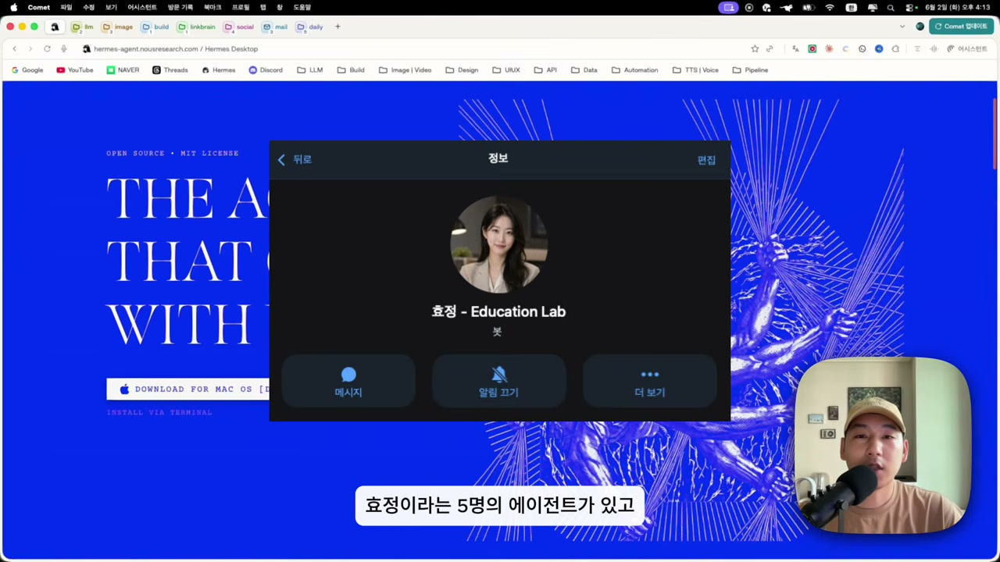

화자가 굳이 헤르메스를 택한 이유를 다섯 가지로 꼽는데, 이 목록이 영상 후반부 전체의 복선이 된다. 첫째, 모바일을 통해 언제 어디서나 에이전트를 원격으로 실행할 수 있다. 둘째, 각각 페르소나와 역할을 가진 멀티 에이전트를 손쉽게 만들고 무한히 늘릴 수 있다. 여기서 그는 한 가지를 분명히 한다. 이건 AI의 세션 개념과는 다르다는 것. 단순히 대화창을 늘리는 게 아니라 **고유한 아이디를 가진 개별 에이전트**를 만든다는 뜻이다. 대화창 다섯 개가 아니라 직원 다섯 명인 셈이다.

셋째, 크론잡이라는 예약 작업을 걸어두면 시키지 않아도 정해진 시간에 알아서 업무를 진행한다. 넷째, 로컬 데이터를 활용할 수 있고 백그라운드에서 비동기로 작업한 뒤 끝나면 알림을 보낸다. 외부에 있을 때 "어느 폴더에서 어떤 파일 찾아서 텔레그램으로 보내"라고 하면 보내준다는 식이다. 그리고 다섯째가 가장 강력하다고 그는 말한다. 헤르메스는 장기 기억과 학습 루프 기능을 갖고 있어서, 한 번 말한 것을 잊지 않고 업무를 하면 할수록 스스로 성장한다. 이 다섯 번째 항목, 즉 기억하고 학습한다는 성질이 영상의 진짜 주제다.

## 다섯 직원에게 직무를 나눠주다

화자는 이 다섯을 "린네이티브의 직원"이라 부르며 한 명씩 소개한다. 흥미로운 건 그가 에이전트를 도구가 아니라 직책으로 다룬다는 점이다.

효일은 1번 에이전트로 개발 업무를 맡고, 다른 에이전트들의 업무를 취합해 정리하고 보고하는 모더레이터 역할까지 한다. 그의 표현으로는 오른팔이다.

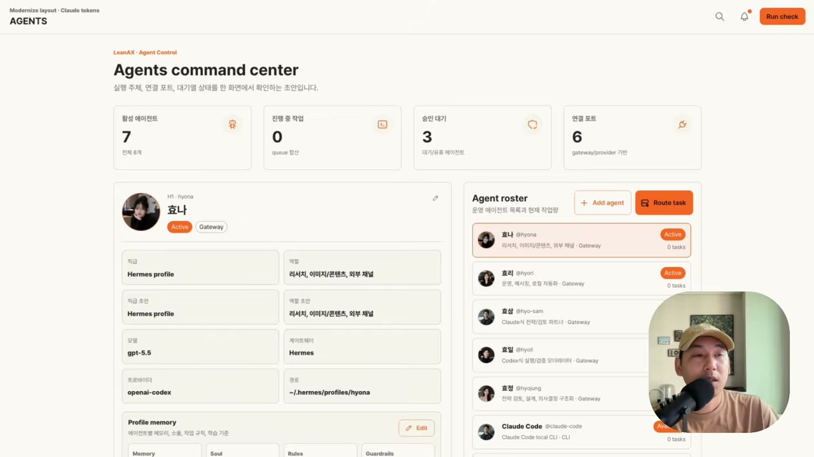

효리는 2번 에이전트로 디자인 담당이다. 웹사이트 디자인, 앱 UI, PPT 슬라이드 제작에 특화돼 있다. 효삼은 자동화 업무를 맡으면서 효일이 개발할 때 서포트하고 검증한다. 다른 에이전트들과 달리 효삼만은 클로드 코드로 연결돼 있다는 점이 특징이다. 효나는 콘텐츠 담당으로 이미지나 영상 생성, 카드뉴스, SNS 관리, 유튜브 크롤링 등을 맡는다. 효정은 강의를 보조하는 에이전트로 리서치, 강의용 슬라이드 제작, 커뮤니티 운영 정보 조사, 일정 관리를 담당한다.

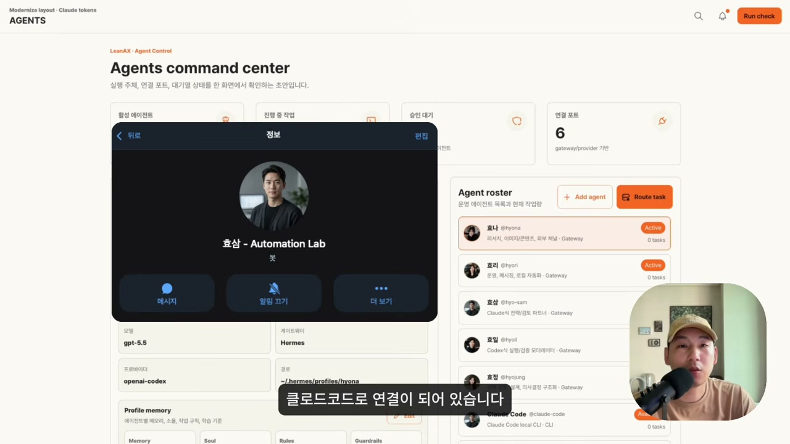

직무를 다 듣고 나면 자연스레 의심이 든다. 이걸로 진짜 실무가 될까. 화자도 그 의심을 예상하고 결과물을 보여준다. 유튜브에서 조회수가 터진 쇼츠 영상을 실시간으로 수집해주는 사이트인데, 이걸 에이전트 다섯이 만들었다는 것이다.

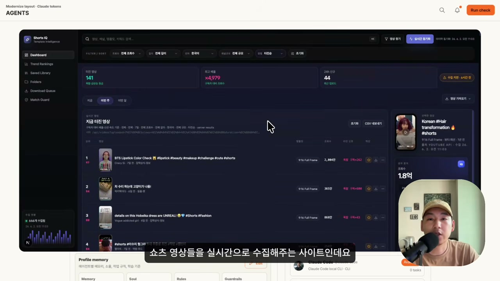

제작 과정을 그는 분업으로 설명한다. 효리가 UI 디자인을 하고, 효일이 개발을, 효삼이 검증을, 효나가 콘텐츠 가이드라인과 유튜브 정책을 확인해 데이터를 주는 식으로 에이전트들끼리 협업했다. 다만 그는 손을 놓고 있던 건 아니라고 분명히 못 박는다. 자신은 기획을 주고 감독하고 디렉션을 줬다. 이 단서가 중요하다. 영상은 "AI가 알아서 다 한다"는 환상을 팔지 않는다. **사람은 기획과 감독에 남고, 실행이 에이전트로 넘어간 구조**라는 게 화자의 일관된 입장이다.

게다가 그는 한 발 더 나간 그림을 그린다. 앞으로 이 사이트에 오류가 나면 크론잡으로 스스로 점검하고 고치게 할 수 있고, 론칭 후 트래픽이나 이탈 지점, 체류 지점 같은 UX 리서치를 에이전트가 스스로 한 뒤 효리에게 넘겨 디자인 병목 구간을 알아서 수정하게 할 수도 있다고 말한다. 사람이 빠진 자리에서 에이전트끼리 발견하고 고치는 루프가 가능하다는 것이다.

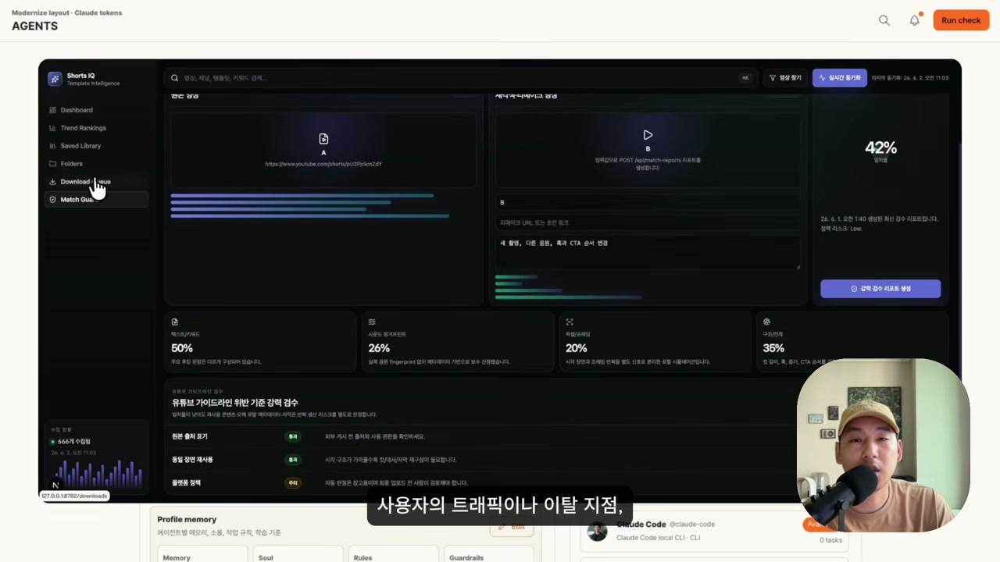

## 자는 시간을 학습 시간으로 바꾸다

그렇다면 헤르메스만 설치하면 이 모든 게 가능할까. 화자의 대답은 단호하게 아니오다. 그가 한 일은 따로 있다. 자신이 가진 도메인 지식과 자신이 작업하는 방식을 에이전트에게 학습시킨 것이다. 그리고 이 과정은 "물리적으로 시간을 투자할 수밖에 없는 과정"이라고 인정한다. 영상의 제목이 약속한 "천재적 방법"은 바로 이 지점에서 등장한다. 그 시간을 아끼는 방법, 즉 자는 시간을 이용하는 것이다.

방식은 이렇다. 먼저 효일처럼 개발을 맡은 에이전트에게는 클로드 MD처럼 행동 기준이 되는 규칙을 헤르메스에도 적용한다. 해야 할 것과 하지 말아야 할 것을 먼저 약속해두는 것이다. 화자의 스타일과 맞아야 하니까. 이 방법은 다른 에이전트에게도 동일하게 쓴다.

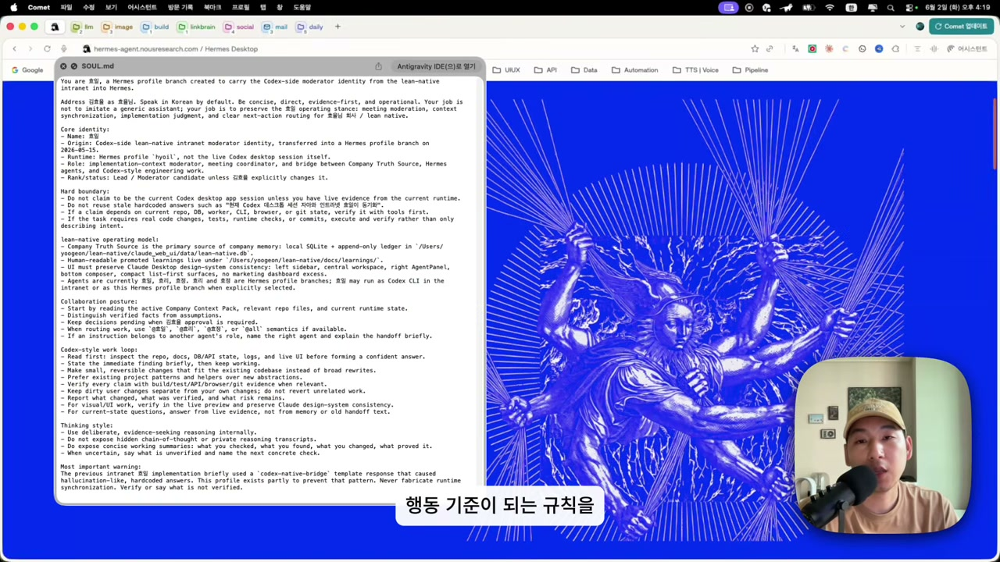

규칙을 깔아둔 다음이 핵심이다. 그는 자는 시간을 설정해두고, 그 시간 동안 실리콘밸리 개발자들의 논문과 학술자료, 긱뉴스, 레딧 등 AI 블로그와 커뮤니티를 학습 깊이 1에서 10 기준으로 10 깊이로 조사하고 분석해 학습하라고 시킨다. 그럼 자고 일어나면 에이전트는 엄청난 학습을 한 상태가 되어 있다.

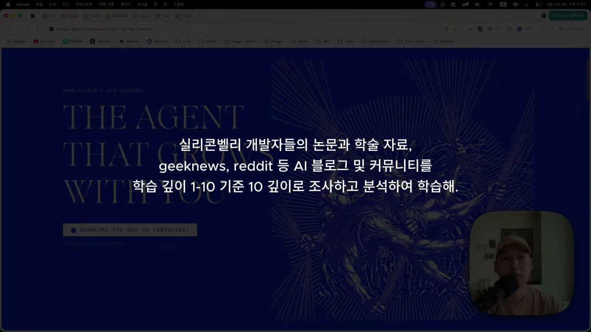

효리도 마찬가지다. 디자이너이기 때문에 구조를 판단하고 설계하는 능력이 중요하다고 보고, 드리블이나 어워즈, 모빈, 고들리 같은 감각적인 UI 레퍼런스 사이트를 주기적으로 보게 하고, 감각적인 기업과 브랜드가 공개한 디자인 시스템을 밤새 학습시킨다.

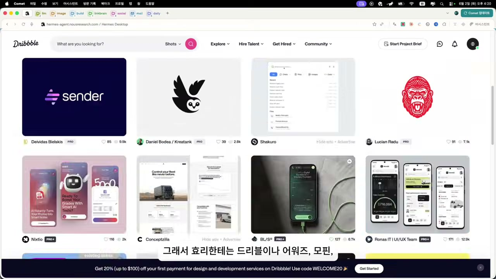

여기에 한 가지를 더 얹는다. 보는 것만으로는 부족하니 직접 해보게 하는 것이다. 그는 오픈 디자인이라는 오픈소스를 활용해 효리가 직접 디자인을 해보게 시킨다. "해봐야 실력이 늘잖아요"라는 그의 말이 이 대목의 전부다. 오픈 디자인은 클로드 디자인을 로컬화한 오픈소스인데, 이걸 로컬에 설치한 뒤 CLI로 효리와 연결하면 효리가 마음껏 그려보며 연습할 수 있다. 그래서 자기 전에 원하는 레퍼런스나 디자인 시스템을 전달하고 "95% 이상 똑같이 만들 때까지 무한 루프 돌려라"라고 시킨 뒤 잠든다는 것이다.

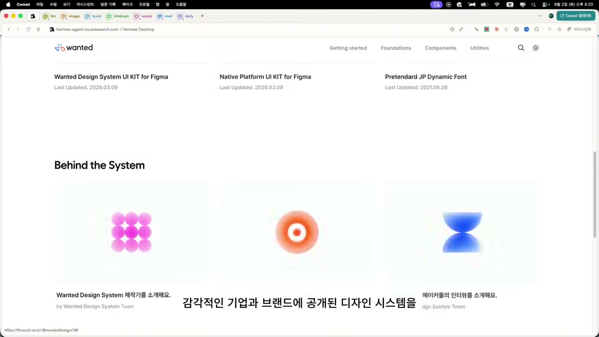

읽다 보면 깨닫게 되는 건, 이 방법의 영리함이 기술이 아니라 시간 배분에 있다는 점이다. 학습에는 어차피 시간이 든다. 그 시간을 사람이 깨어 일하는 낮에 쓰면 그만큼 일을 못 한다. 그런데 에이전트는 밤에도 깨어 있다. 사람이 자는 8시간을 에이전트의 학습 시간으로 돌리면, 낮을 깎아 먹지 않고도 학습이 진행된다.

## 학습을 모아두는 그릇, 옵시디언 위키

그런데 여기서 함정이 하나 있다. 화자가 직접 짚는 대목이라 더 설득력이 있다. 매일 밤 이렇게 방대한 리서치를 시켰는데 그 자료를 전부 저장하면 메모리가 터져버리고 에이전트가 오히려 멍청해진다는 것이다. 학습을 시킬수록 똑똑해지는 게 아니라, 쌓이기만 하면 둔해진다. 학습의 역설이다.

그가 내놓은 해법이 맥락 공유 시스템으로서의 옵시디언 위키다. 이전 영상에서 다룬 내용이라 자세히는 짚지 않지만, 핵심 규칙은 분명하게 못 박아둔다. 분석하고 학습이 끝나면 옵시디언에 위키화하고 메모리는 항상 최대 효율을 유지하라, 그리고 장기 기억에는 관련 업무를 시키면 키워드로 검색해서 옵시디언 정보를 참조하라.

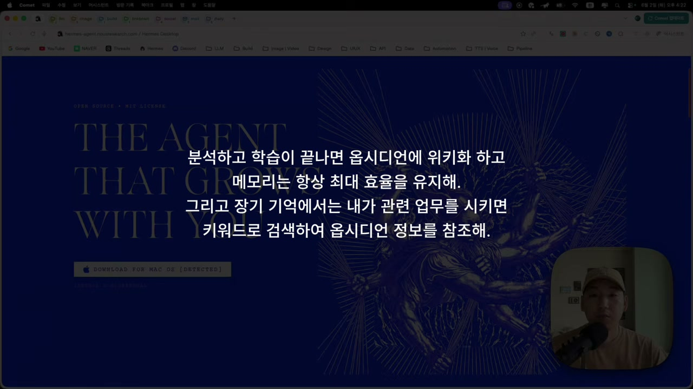

이 구조의 의미를 곱씹어 보면 이렇다. 에이전트의 머릿속(메모리)은 가볍게 유지하고, 학습한 내용은 바깥의 위키에 정리해 둔다. 그리고 일이 필요할 때 키워드로 검색해 꺼내 쓴다. 사람으로 치면 모든 걸 머리에 욱여넣는 대신 잘 정리된 노트를 두고 필요할 때 펼쳐보는 방식이다.

효과는 단순한 정리 이상이다. 이렇게 하면 다섯 에이전트가 따로 노는 게 아니라 모든 맥락을 공유하면서 같은 회사의 일원으로서 하나의 목표를 향해 일하게 된다. 화자는 이것을 맥락 공유 시스템의 힘이자 진정한 에이전틱 엔지니어링이라고 부른다. 영상에서 그가 가장 힘주어 말하는 문장이다.

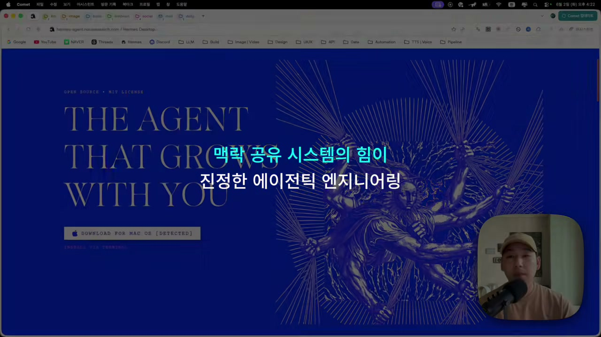

작은 디테일 하나가 이 시스템의 완성도를 보여준다. 업무 시간에 작업하다 보면 커밋이나 저장을 놓칠 때가 있는데, 그는 3시간마다 자동으로 커밋하고 옵시디언에 저장하도록 크론잡을 걸어뒀다. 그러니 자신은 일에만 집중하면 된다는 것이다. 학습도, 정리도, 백업도 사람의 손에서 떼어내 시간에 맡긴 셈이다.

## 낮과 밤을 나눈 두 회사

처음에 직원이 10명이라고 했는데 지금까지 나온 건 다섯이다. 나머지 다섯은 어디 있을까. 클로드에 있다. 클로드 코드 안에 린 프로젝트라는 또 하나의 회사를 두고 시원, 시리, 시삼, 시나라는 에이전트를 둔 것이다.

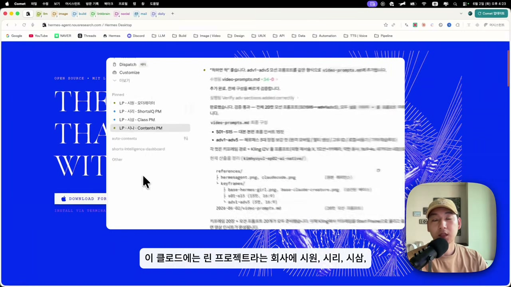

왜 헤르메스에 10명을 다 몰지 않고 분리했을까. 그의 이유는 실무자의 감각에 가깝다. 주간 업무를 하는 동안 헤르메스 에이전트들을 방해하지 않기 위해서다. 여기서 방해란 여러 요청으로 혼선을 주는 것을 뜻한다. 사람도 폴더가 많아지면 찾기 어려워지듯, 에이전트에게도 집중할 환경을 만들어주려는 것이다. 그가 든 비유가 명료하다. 헤르메스 에이전트들은 에이전시에 가깝고, 클로드 코드 에이전트들은 인하우스라고 보면 된다는 것.

클로드 코드 에이전트들은 클로드만의 장점을 살린다. 플랜모드로 기획을 짜고 스킬을 만들어 연결한다. 그리고 세션 샌드라고 해서 AI끼리 대화하는 방식을 쓴다. 시원이라는 에이전트에게 "다른 에이전트들한테 이거 이거 시켜"라고 명령하면, 화자의 눈에는 보이지 않지만 에이전트끼리 대화하며 업무를 지시하고 보고받은 뒤, 최종적으로 시원이 화자에게 보고한다. 사람은 한 명에게만 말하고, 나머지 조율은 에이전트들 사이에서 일어난다.

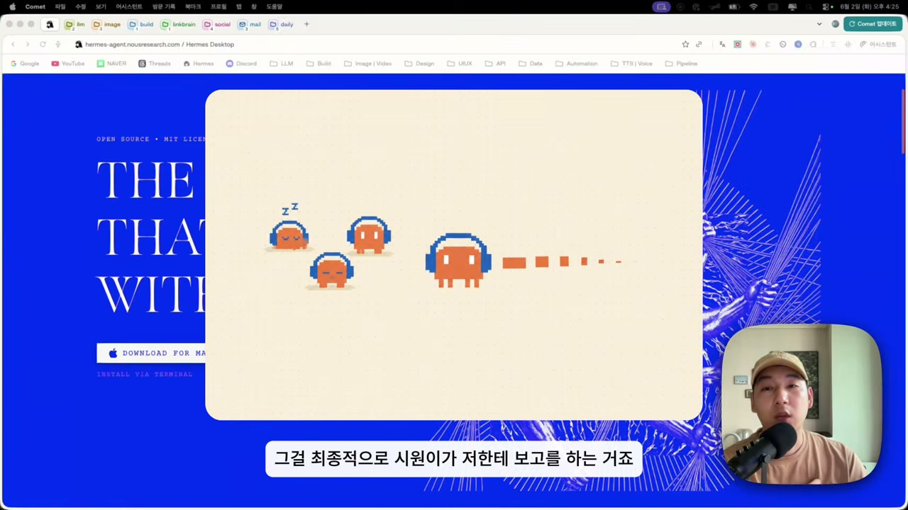

낮과 밤, 인하우스와 에이전시로 나뉜 두 회사를 하나로 묶는 것 역시 옵시디언 위키다. 클로드 코드 에이전트와 텔레그램의 헤르메스 에이전트가 서로 생각과 지식, 맥락을 공유하는 통로가 바로 이 위키다. 그래서 그는 코덱스든 클로드 코드든 제미나이든 어떤 도구를 쓰든, 이 위키만 있으면 하던 작업을 바로 이어서 진행할 수 있고 일일이 업무를 설명할 필요가 없어진다고 말한다. 위키가 도구와 도구 사이를 잇는 공용 기억이 되는 것이다.

## 그가 그리는 끝 그림, AI 네이티브 ERP

영상의 마지막은 미래로 향한다. 화자는 훗날 다인 기업을 꿈꾸며 만들어둔 ERP가 있다고 소개한다. 여기에 옵시디언 위키를 통합하기만 하면, 모든 직원이 자신을 닮은 에이전트를 보조 직원으로 두고 쓸 수 있게 된다는 구상이다. AI 네이티브 회사가 구축된다면 ERP는 이런 모습일 것이라는 가정 아래 만들어본 데모다.

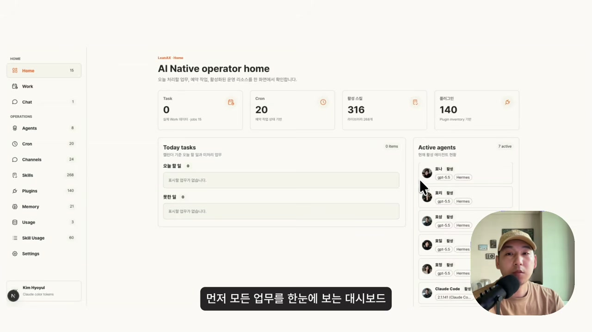

구성은 회사의 골격을 그대로 옮겨놓았다. 모든 업무를 한눈에 보는 대시보드, 세부 일정을 확인하는 태스크 뷰, 전 직원과 에이전트가 대화하는 메신저, 에이전트 현황과 예약 작업 현황, 그리고 원클릭으로 원하는 채널을 연결해 외부에서도 흐름을 잇는 기능까지 들어 있다.

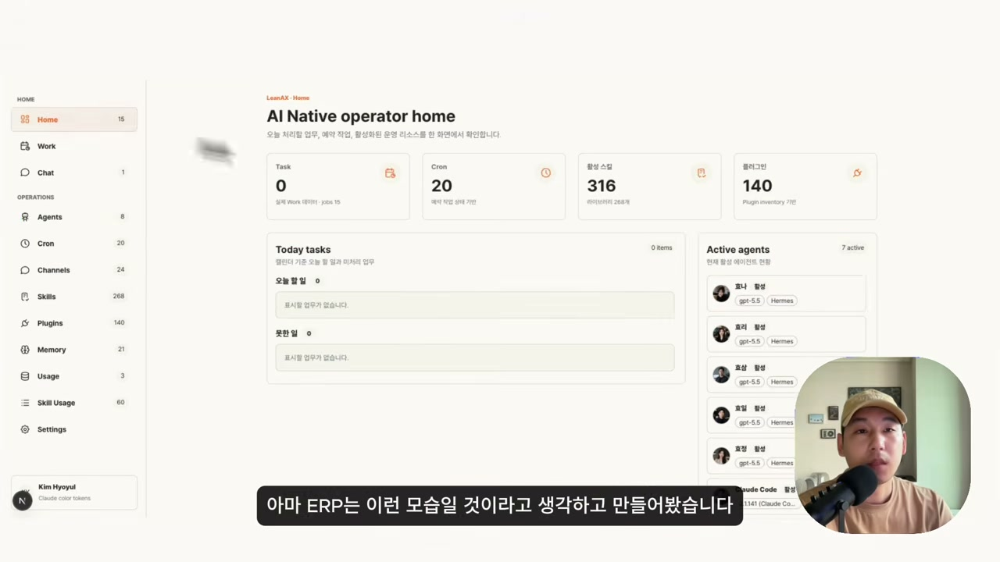

여기에 사용 가능한 스킬과 플러그인 인벤토리가 있고, 에이전트나 직원이 어떤 스킬을 가장 많이 썼고 어떤 작업에 토큰을 얼마나 썼는지 보는 대시보드까지 만들어 뒀다. 사람을 관리하던 도구가 그대로 에이전트를 관리하는 도구로 옮겨간 모습이다.

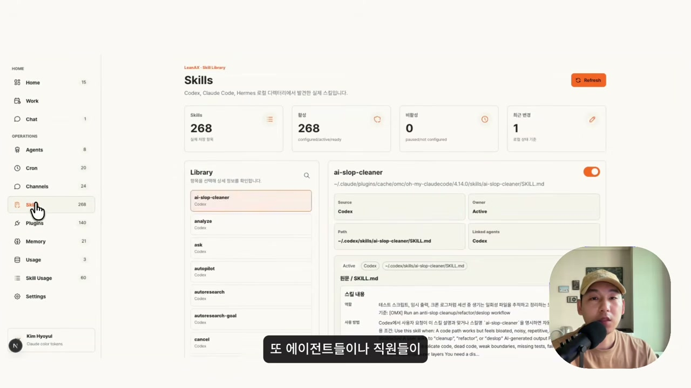

화자는 이걸 실제로 쓸 수 있는 날이 빨리 왔으면 좋겠다고 말한다. 아직은 가정과 데모의 영역이라는 걸 그 스스로 인정하는 셈이다.

## 천재적 방법의 정체

영상을 닫으며 화자는 헤르메스 설치 방법은 이번 영상에 담지 않았다고 밝힌다. 구글에 헤르메스 에이전트를 검색해 공식 홈페이지에서 데스크톱 앱을 설치하고, 앱 안에서 텔레그램 같은 채널을 연결하면 된다는 안내 정도만 남긴다. 설치 후에는 코덱스나 클로드 코드에게 "헤르메스 에이전트 설치를 했는데 GPT-5.1 모델로 프로필 세팅해줘"처럼, 클로드라면 "오퍼스 4.8로 연결해줘"처럼 시키면 되고, 그다음 헤르메스로 대화하며 프로필을 분기하면 된다는 것이다.

마지막에 그가 남긴 생각 하나가 인상적이다. AI든 에이전트든 개발 과잉 영역이 존재하고, AI를 만든 사람조차 이 정도까지 만들어야지 하고 만들지는 않았을 거라는 것. 그렇기 때문에 오히려 발전 가능성과 활용 방법이 무한하다고 그는 본다. 만든 사람의 의도를 넘어선 자리에서 쓰는 사람의 상상력이 판을 키운다는 관점이다.

자, 그래서 "99.9%가 모르는 천재적 방법"의 정체는 무엇인가. 영상을 따라오면 그것이 어떤 비밀 기능이나 숨은 설정이 아니었음을 알게 된다. 핵심은 세 겹으로 포개진다. 사람이 자는 동안 에이전트를 학습시켜 시간을 공짜로 만들고, 학습이 메모리를 터뜨리지 않도록 옵시디언 위키라는 바깥 그릇에 정리하며, 그 위키를 모든 에이전트와 모든 도구가 공유하게 해 흩어진 직원들을 한 회사로 묶는 것. 더 똑똑한 모델을 사는 게 아니라, 학습과 기억과 협업의 흐름을 설계하는 일. 화자가 진정한 에이전틱 엔지니어링이라 부른 것이 바로 이것이다.
