
<iframe src="https://www.youtube.com/embed/B3aEn9rY-po" title="YouTube video player" frameborder="0" allow="accelerometer; autoplay; clipboard-write; encrypted-media; gyroscope; picture-in-picture; web-share" referrerpolicy="strict-origin-when-cross-origin" allowfullscreen></iframe>

예전에는 포털에서 찾던 걸 유튜브에서 찾다가, 이제는 AI에게 묻는다. 테드의노트 채널의 화자는 이 변화를 짚으며 한 가지를 덧붙인다. 정보를 찾는 속도는 점점 빨라졌는데, 정작 그 정보를 내 것으로 만드는 방법은 별로 달라지지 않았다는 것이다. 그렇게 빠르게 긁어모은 정보가 정말 내 머릿속에 남고 있는가.

## 수집은 지식이 아니다

화자는 자기 이력을 빌려 문제를 꺼낸다. 디자이너 시절 그의 레퍼런스 창고는 핀터레스트였다. 이미지를 찾고 저장하기에 그만한 플랫폼이 없었고, 인스타와 유튜브에서도 각각의 저장 기능을 따로 썼다. 저장소가 플랫폼 수만큼 흩어져 있었던 셈이다.

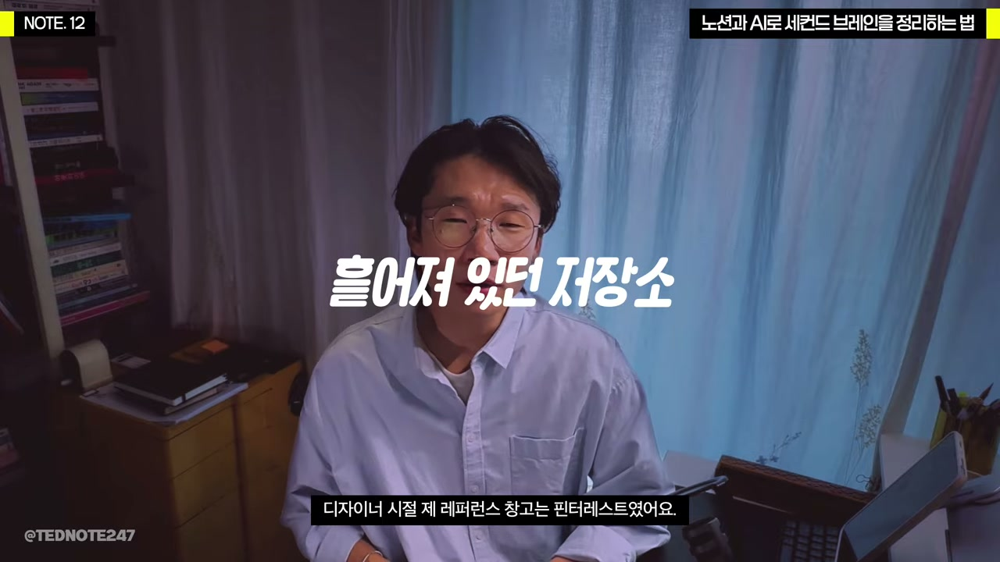

그런데 이 방식에는 그가 "수집과 오류"라고 부르는 함정이 있었다. 캡처만 하고 다시 보지 않는 것이다. 저장하는 행위 자체는 훌륭하다고 그는 인정한다. 문제는 그다음이다. 저장만 해놓고 다시 보지 않으면, 그건 지식 관리가 아니라 그냥 수집에 지나지 않는다. 모아두고 들여다보지 않는 정크 파일일 뿐이다.

여기까지는 세컨드 브레인을 한 번이라도 만들어 본 사람이라면 누구나 겪는 흔한 이야기다. 인간은 모든 걸 기억할 수 없으니, 나중에 다시 보면 떠오르도록 돕는 지식 관리 데이터베이스를 외부에 둔다. 내 뇌의 한계를 외부 시스템으로 보완하는 것이고, 도구가 노션이든 옵시디언이든 에버노트든 본질은 같다는 게 그의 정리다.

흥미로운 건 화자가 여기서 멈추지 않고, 요즘 새로 생긴 함정을 하나 더 짚는다는 점이다.

## AI 요약이라는 새로운 함정

AI로 정보를 요약하는 기능이 흔해지면서 정보를 모으기는 훨씬 수월해졌다. 그런데 편안해진 만큼 놓친 게 있다고 그는 말한다.

> AI 요약은 원문의 심도 깊은 맥락이나 원작자의 고유한 관점, 그 사람만이 가진 통찰의 결을 간략화해버려요. 핵심만 추리는 과정에서 정작 가장 중요한 깊이가 사라지는 거예요.

결과적으로 얕은 지식만 계속 흡수하는 상황이 반복될 수 있고, 이 부분은 자기도 분명히 경계하는 지점이라고 화자는 못 박는다. 한쪽에는 요약의 편리함이 있고, 다른 한쪽에는 그 편리함이 깎아내는 깊이가 있다. 그가 뒤에서 보여 주는 워크플로는 결국 이 둘 사이에서 어떻게 균형을 잡느냐에 대한 답이다.

그는 유튜브를 예로 든다. 재미있는 콘텐츠는 30분이든 1시간이든 빠져들어 시간 가는 줄 모르고 보지만, 아무리 유익해도 지루한 콘텐츠는 3분을 넘기기가 힘들다. 이건 의지의 문제가 아니라 자극적인 것에 반응하는 게 자연스러운 일이라고 그는 본다. 게다가 애초에 콘텐츠를 소비할 시간이 부족한 사람도 있다. 그런 사람에게 가장 빠르게 소비할 수 있는 형태가 텍스트이고, 그래서 많은 사람이 AI 요약에 기댄다. 영상을 직접 보지 않고도 핵심만 텍스트로 훑는 것이다.

여기서 그의 입장은 분명하다. AI에 의존하면 얕은 지식만 남을 수 있으니, 내 것으로 만들려면 어느 정도 깊이를 들여다보는 과정이 반드시 필요하다는 것이다. 그가 만든 워크플로는 바로 이 "한 번 더 들여다보는 과정"을 시스템 안에 강제로 끼워 넣는 장치다.

## 캡처에서 인사이트까지, 화자의 흐름

그가 실제로 쓰는 순서는 이렇다. 먼저 크롬 브라우저에 노션(Save to Notion)과 릴리스 AI 두 플러그인을 설치한다. 저장하고 싶은 콘텐츠를 이 플러그인으로 보내면, 각 플랫폼에서 AI가 자동으로 요약을 시작한다.

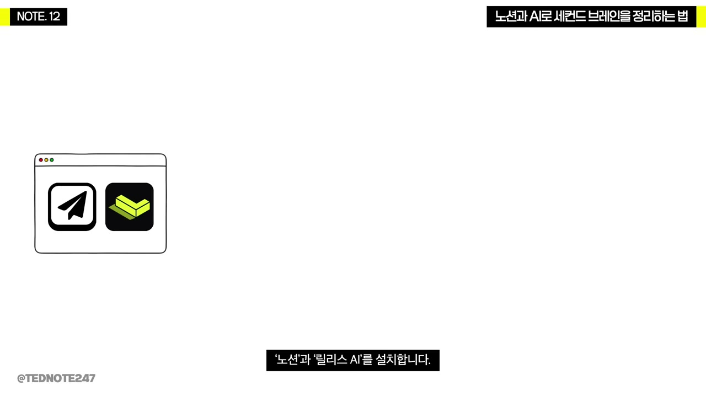

그다음이 핵심이다. 그는 릴리스 AI가 텍스트로 정리해 준 콘텐츠를 보고, 요약된 정보와 구체적인 정보를 확인한 뒤, 그 노트를 노션 데이터베이스로 옮긴다. 옮기고 끝이 아니다. 거기에 자기가 직접 이해한 내용이나 생각을 적어 둔다. 그러면 모든 데이터가 입력된 노션 데이터베이스가 노션 AI를 통해 한 번 더 업데이트된다. AI가 정리해 준 것 위에 나의 관점과 해석을 얹는 것이다. 그는 이 과정을 이렇게 요약한다.

> 이 과정이 있어야 내가 저장한 정보가 비로소 내 지식으로 이어집니다.

AI 요약이 깊이를 깎는다는 앞의 우려에 대한 그의 대답이 바로 여기에 있다. 요약을 안 쓰는 게 아니라, 요약 위에 사람의 해석을 한 겹 덧대고 그걸 다시 AI에게 읽히는 것이다.

## 디지털 코덱스라는 그릇

화면으로 넘어가면 그의 실제 데이터베이스가 나온다. 이름은 "디지털 코덱스"다. 코덱스란 책이 존재하기 전에 나무판에 기록을 남기던 문서를 뜻하는데, 흩어져 있는 콘텐츠와 레퍼런스를 하나하나 모으는 일이 그 코덱스와 닮았다고 해서 붙인 이름이다.

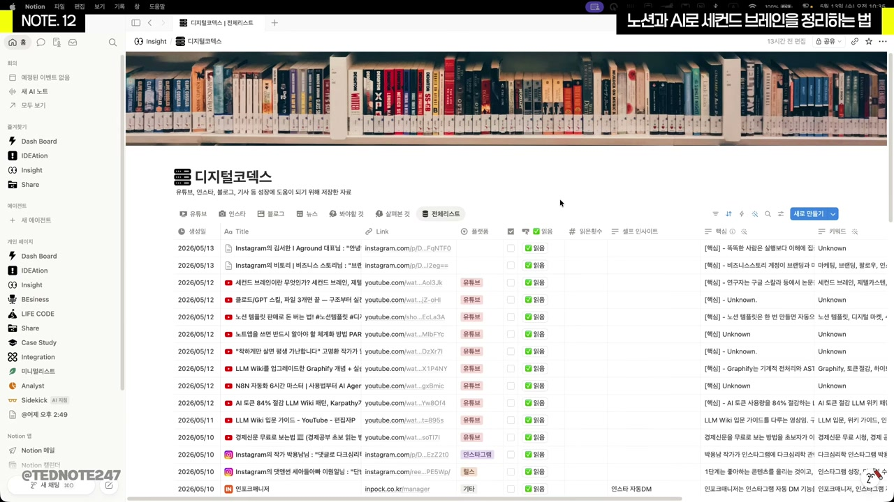

저장은 주로 PC 크롬의 Save to Notion으로 하고, 모바일에서는 링크만 가져온 뒤 나중에 PC에서 다시 저장한다. 이 데이터베이스의 가장 큰 특징은 AI 사전 요약 속성 세 가지, 핵심 · 키워드 · 인사이트다. 저장만 해두면 노션 AI가 데이터를 읽고 먼저 어떤 내용인지 요약해 준다.

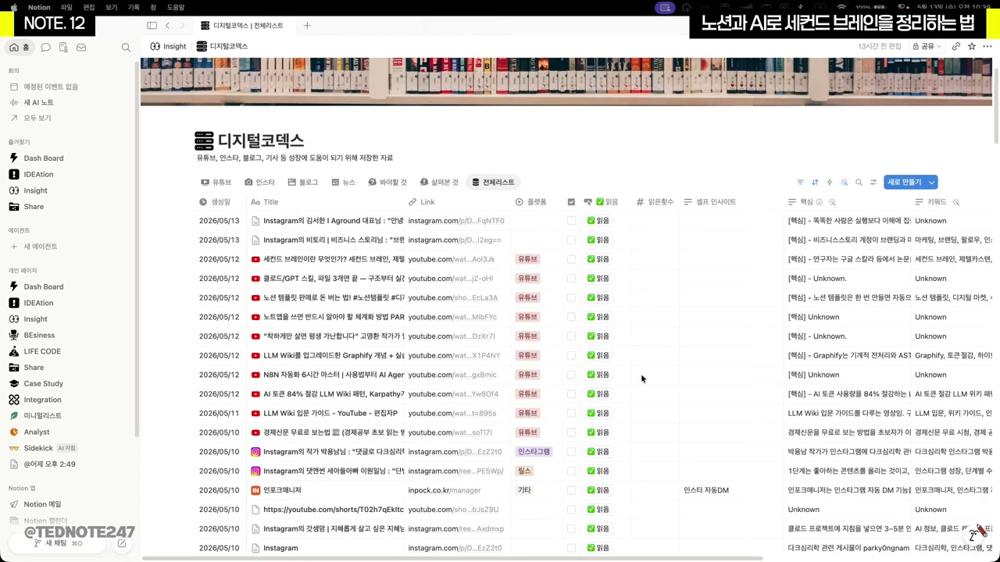

읽음 여부와 읽은 횟수도 표기된다. 아직 안 본 것에는 아무 표기가 없고, 한 번 읽은 것은 배경색이 칠해지며, 한 번 이상 읽은 것은 배경색이 사라진 상태로 누적된다. 한 번만 읽어서는 다 이해하기 힘들 수 있으니, 여러 번 읽은 것과 한 번 읽은 것을 색으로 구분하는 것이다. 제대로 읽은 것에는 셀프 인사이트를 따로 기록해 둔다.

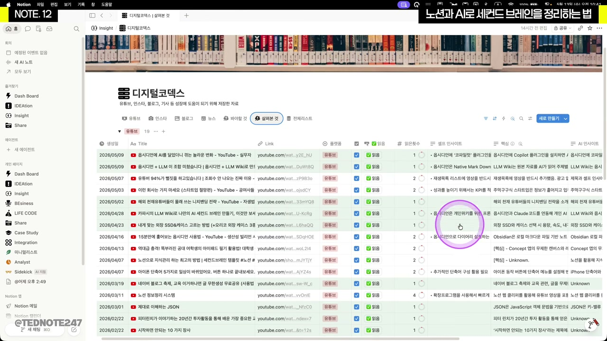

이 모든 게 대시보드 하나로 모인다. 일정, 기획안, 스프린트 프로젝트, 그리고 인사이트란이 있고, 인사이트는 유튜브, 인스타, 블로그, 뉴스 식으로 나뉜다. 아직 안 본 데이터와 살펴본 데이터가 분리되어 보이도록 구성되어 있다.

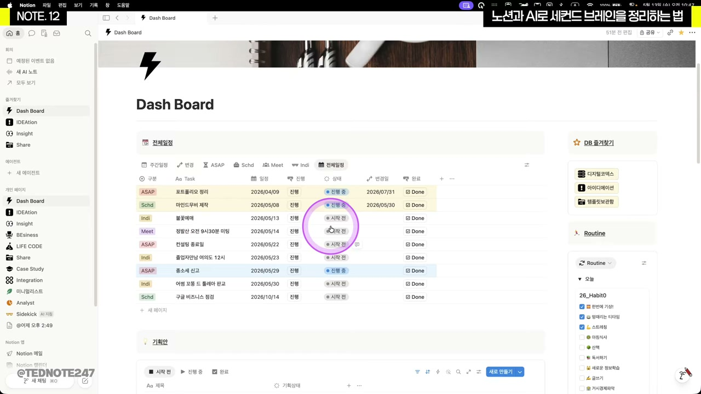

## 직접 만들어 보는 데이터베이스

영상의 절반 이상은 이 구조를 처음부터 만드는 실습이다. 따라 만들 수 있도록 단계가 촘촘하다.

새 페이지에 "레퍼런스 창고"라는 데이터베이스를 만들고 속성을 하나씩 붙인다. 언제 저장했는지 알아야 하니 생성일시를 만들어 맨 앞으로 옮기고, 이름은 제목으로 바꾼다.

다음은 플랫폼을 select 속성으로 만든다. 옵션은 유튜브, 인스타, 블로그, 기사 및 뉴스레터다. 화자는 전에 릴스와 쇼츠까지 따로 구분했었는데, 어차피 유튜브 안에 쇼츠가 있고 인스타 안에 릴스와 쓰레드가 있다 보니 그냥 합치는 게 낫더라는 경험을 덧붙인다.

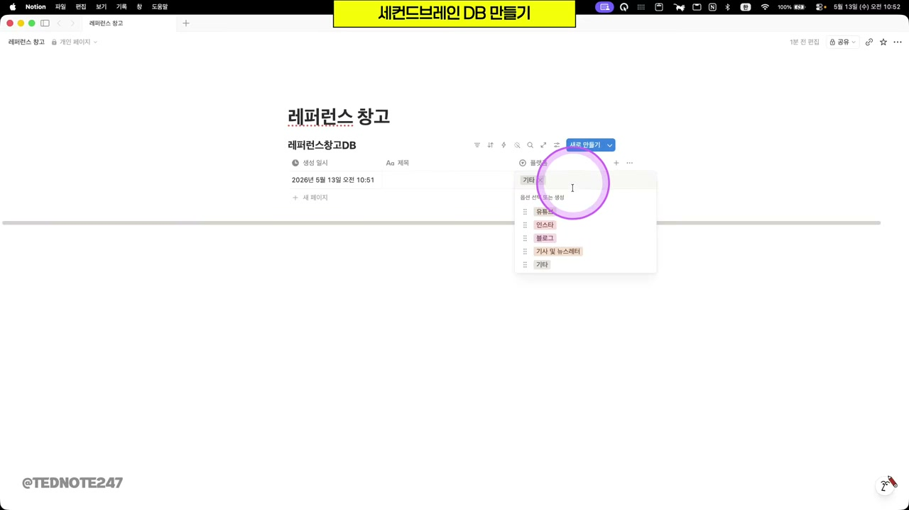

여기에 URL, 그리고 "읽은 횟수"라는 숫자 속성을 더하고, "읽음"이라는 버튼을 추가한다. 이 버튼은 단순한 표시용이 아니다. 읽음 버튼을 누르면 읽은 횟수가 자동으로 올라가도록 자동화를 건다. 읽음 속성에서 자동화 편집으로 들어가, 새 작업 → 페이지 편집 위치를 누른다.

속성 편집에서 읽은 횟수를 고르고, 수식으로 읽은 횟수 +1을 넣는다. 예전과 달리 수식 입력이 간소화되어 별도 명령어 없이 속성을 선택하고 더하기 1만 하면 된다. 구문 유효성이 유효로 나오면 저장한다. 버튼을 누를 때마다 숫자가 1씩 올라가는 걸 그 자리에서 확인시켜 준다. 여기에 더해, 버튼을 누르면 체크박스도 함께 체크되도록 작동을 하나 더 건다.

## 핵심은 할루시네이션을 막는 프롬프트

이어지는 AI 자동 채우기 속성을 만드는 부분에 이 영상의 핵심이 있다. 셀프 인사이트와 핵심 텍스트 속성을 만든 뒤, 핵심은 노션 AI가 요약하도록 설정한다. 최근 업데이트로 커스텀 에이전트 형태가 생겼지만, 화자는 누구나 따라 할 수 있도록 기본 형태로만 설명한다.

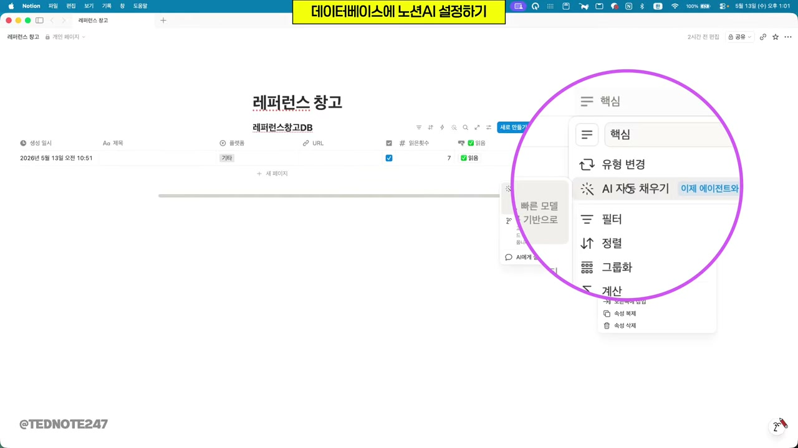

트리거는 페이지 생성 시에는 비워 두고, 페이지 콘텐츠가 편집될 때 동작하도록 체크한다. 그리고 에이전트 지침을 중요 규칙과 출력 형식 두 가지로 나눠 적는다.

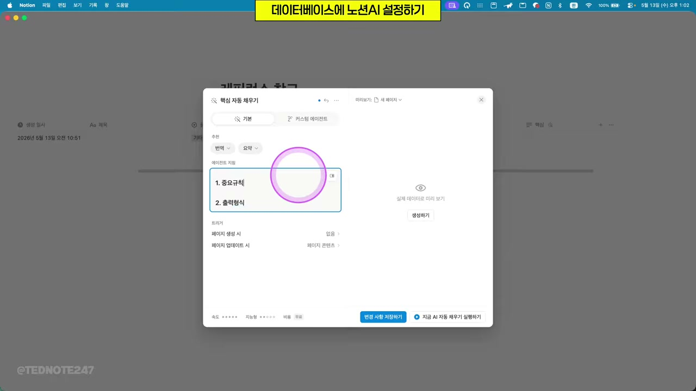

중요 규칙에 그가 넣는 항목이 흥미롭다. URL 원문을 직접 읽었다고 추측하거나 가정하면 안 되고, URL 링크를 꼭 확인해 그 페이지 안에서 확인 가능한 정보만 쓰라는 것이다. 이렇게 해두는 이유를 그는 직접 설명한다. 저장할 때 URL을 가져오면 노션 AI가 그 URL에 접속해 정보를 파악하려 하는데, 대부분은 파악하지 못하더라는 것이다. 할 때도 있고 안 할 때도 있어서 불안정하다. 이 지침을 넣지 않으면 노션 AI가 임의로 내용을 지어내는 경우가 많다고 그는 말한다.

그래서 세 번째 규칙을 넣는다.

> URL을 읽지 못했거나 파악이 불가능한 경우 추측하지 말고 언노운으로 표시해 주세요.

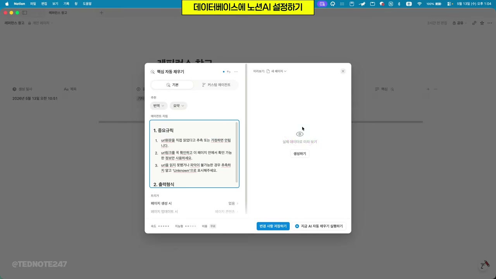

AI가 거짓말로 작성하는 걸 할루시네이션이라고 하는데, 추측해서 작성하는 게 바로 그 할루시이고, 그래서 이런 지침을 넣어 둔다고 그는 설명한다. 앞에서 "AI 요약은 깊이를 깎는다"고 경계했던 사람이, 이번에는 "AI가 모르는 걸 아는 척한다"는 또 다른 약점까지 시스템 차원에서 막아 두는 셈이다.

키워드 속성도 같은 방식으로 만들되, 명사형 키워드로 작성하라고 지정하고, 플랫폼이나 생성 링크 같은 불필요한 표현은 표시하지 말라고 덧붙인다. 출력 형식에서는 영상 내용이나 주제를 확인할 수 없는데도 제목만 보고 맥락을 비슷하게 꾸며내는 경우, "콘텐츠 확인할 수 없음" 같은 키워드가 반복 출력되는 경우, 유튜브 생성일이나 링크가 키워드로 끼어드는 경우를 일일이 금지한다. 그리고 정보 확인이 어려운 것은 언노운으로 표기하게 한다.

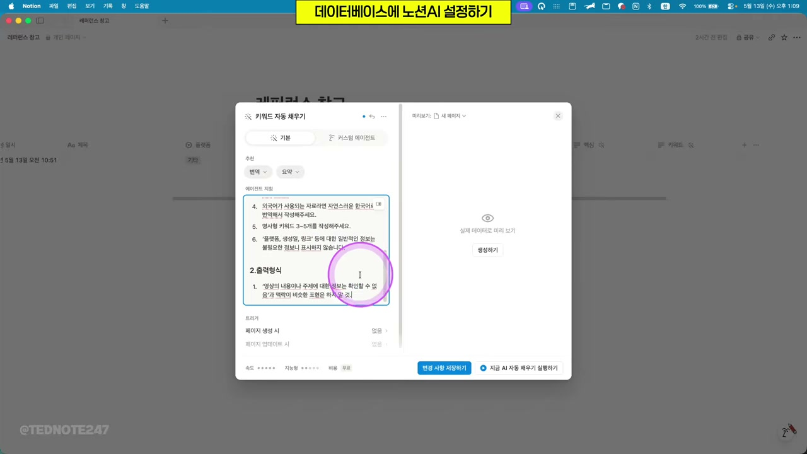

이 지침들은 그동안 직접 써 보면서 계속 잘못 출력되던 내용을 하나하나 모아 넣은 것이라고 그는 밝힌다. 머리로 짠 규칙이 아니라, 실패를 겪으며 쌓은 규칙인 셈이다. 마지막으로 AI 인사이트 속성을 만들면서 300자 이내로 제한을 건다. 이렇게 핵심 · 키워드 · 인사이트 세 속성이 정보를 입력하면 알아서 돌아가도록 완성된다.

## 플랫폼별로 갈라 보는 대시보드

데이터베이스 기본 구조가 끝나면, 플랫폼별로 볼 수 있게 보기를 나눈다. 설정에서 레이아웃을 표로 두고 데이터 소스 제목 표시를 해제한 뒤, 보기를 복제해 가며 만든다.

전체 리스트를 복제해 유튜브 보기를 만들고, 아이콘을 유튜브 모양으로 바꾼 다음, 필터에서 플랫폼을 유튜브로 잡는다. 정렬은 생성일시 내림차순으로 해서 최근 것이 위로 오게 한다.

같은 식으로 인스타(카메라 아이콘), 블로그, 기사 및 뉴스레터(신문 아이콘) 보기를 복제해 만든다. 여기에 더해 읽은 것과 안 읽은 것을 가르는 보기도 만든다. 체크박스가 체크된 것만 모으면 "살펴본 것"(체크박스 아이콘), 체크되지 않은 것만 모으면 "봐야 할 것"(돋보기 아이콘)이 된다.

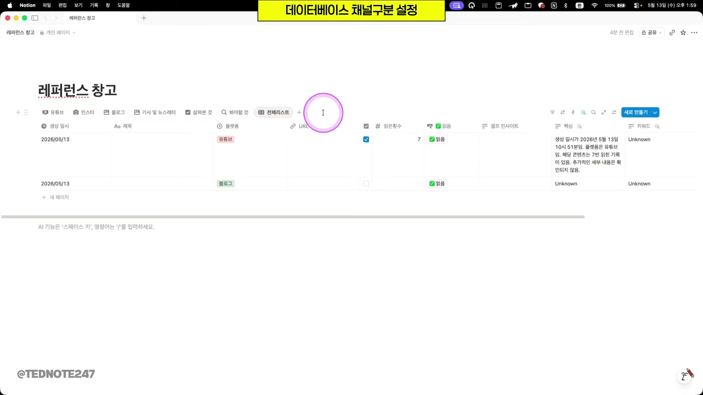

이렇게 만든 데이터베이스를 페이지로 전환한 뒤, 대시보드 형태로 다듬는다. 그가 쓰는 방법이 약간의 트릭이다. 데이터베이스의 링크를 복사해 같은 페이지에 다시 붙여넣으면 "연결된 데이터베이스 보기"로 들어온다. 원본 데이터베이스는 그대로 두고, 링크로 가져온 것은 별도로 보기를 설정해 콜아웃으로 묶어 가며 화면을 정리한다.

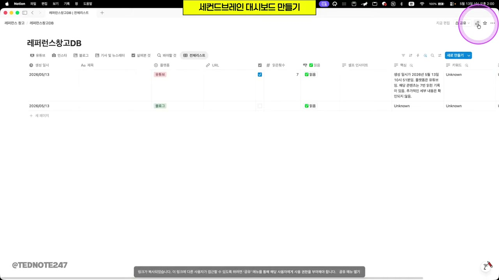

유튜브, 인스타, 블로그, 기사 섹션을 각각 콜아웃으로 묶고 아이콘을 붙이면, 안 본 것과 본 것이 플랫폼별로 한눈에 갈리는 대시보드가 완성된다. 대시보드를 열었을 때 맨 처음 안 본 것들의 리스트가 나와야, 내가 이런 걸 저장해 뒀고 좀 더 살펴봐야겠다는 자각이 든다는 게 그의 설계 의도다.

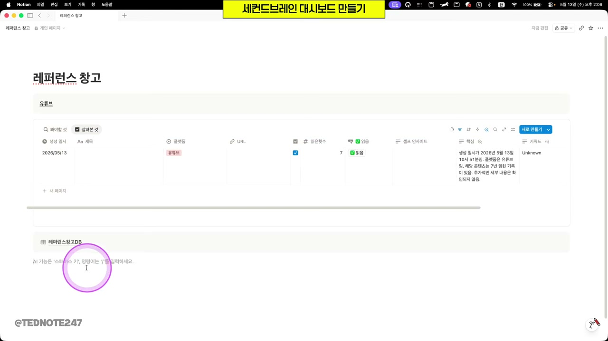

## 실제로 저장해 보기

구조가 다 갖춰지면 이제 실제 콘텐츠를 넣어 본다. 크롬 확장에 Save to Notion과 릴리스 AI를 설치한다. 화자는 검색이 되도록 정확한 명칭으로 찾으라고 일러 준다.

유튜브에서 "LLM 위키"를 검색해 영상 하나를 고른다. Save to Notion을 눌러 폼을 만들고, 커넥트 데이터베이스에서 아까 만든 레퍼런스 창고 DB를 선택한다. 플랫폼 필드를 추가해 유튜브로 지정하고, 클립 액션은 비디오로 골라 영상까지 그대로 가져온다.

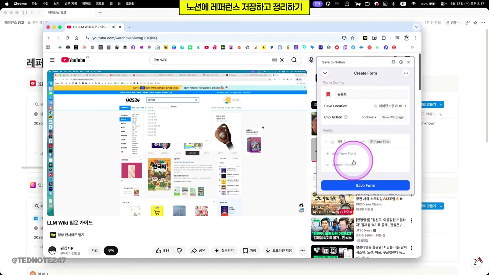

저장하면 노션의 봐야 할 것 보기에 들어와 있다. 열어 보면 링크, 플랫폼 태그, URL, 썸네일, 영상 임베드까지 다 들어와 있다.

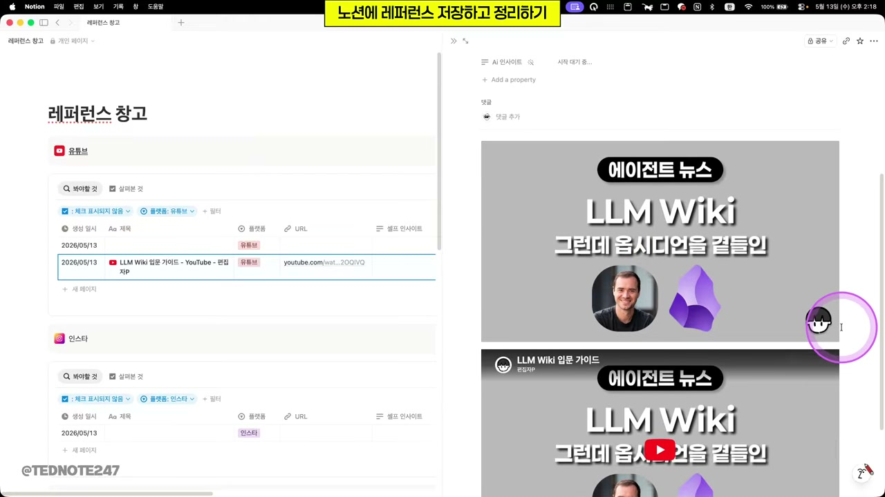

그런데 화자는 여기서 결정적인 한계를 짚는다. 영상이 저장됐어도 그 영상이 무슨 내용인지는 알 수가 없다는 것이다. 알려면 영상을 직접 다 봐야 하는데, 그럴 시간이 없다. 바로 이 지점에서 릴리스 AI가 등장한다. 노션에 저장한 상태에서 옆의 릴리스 AI를 누르면 노트 생성 중이라는 표시와 함께 릴리스 AI 웹페이지로 넘어간다.

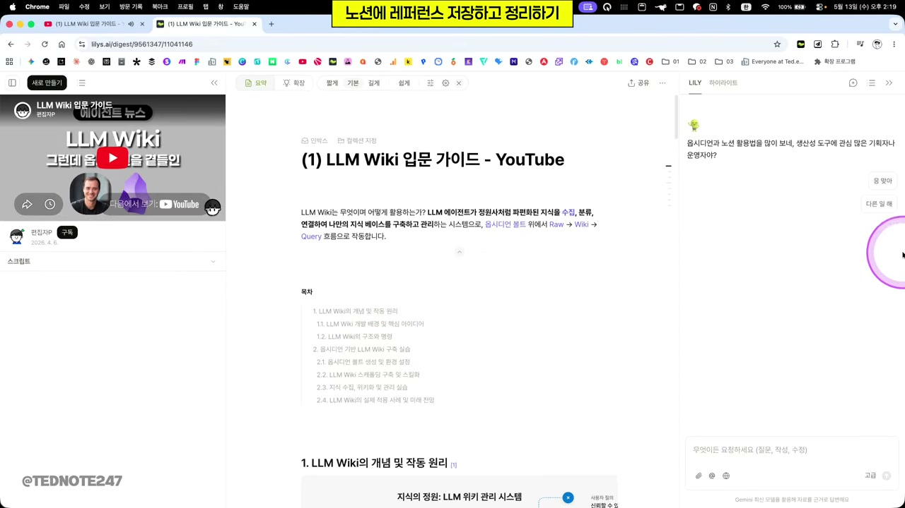

릴리스 AI는 목차부터 마인드맵까지 그려 주며 대략 어떤 내용인지 요약한다. 옆의 넘버링을 선택하면 영상에서 그 부분을 말하는 구간을 표시해 준다. 텍스트만으로 영상이 무슨 내용인지 다 알 수 있게 되는 것이다.

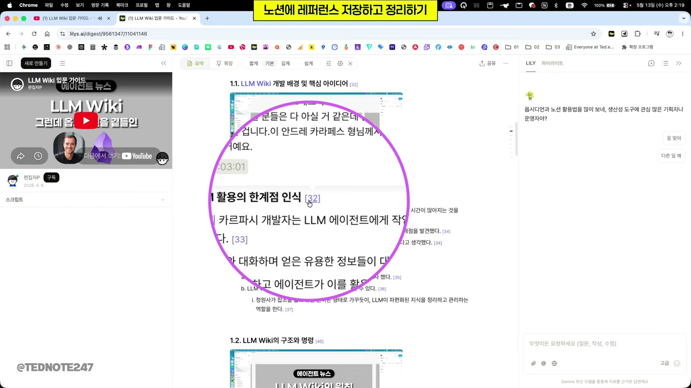

여기서 화자는 자기가 실제로 부딪힌 불편함과 그 우회법을 솔직히 공유한다. 릴리스 AI에는 노션으로 내보내기 기능이 있지만, 그걸로 보내면 페이지로만 저장되고 그가 지정한 데이터베이스로는 안 들어가더라는 것이다. 아직 조금 불안정하다고 보기 때문에, 그는 내보내기 대신 내용을 복사해 노션 페이지에 직접 붙여넣는다. 다만 이때 목차는 따라오지 않아서, 콜아웃으로 목차를 따로 만들어 준다.

붙여넣고 창을 닫으면 노션 AI가 핵심 · 키워드 · 인사이트를 정리하기 시작한다. 여기서 그는 앞서 만든 프롬프트의 효과를 짚는다. 내용이 자세하게 나올 수 있는 이유는 URL뿐 아니라 그 아래에 붙여넣은 본문 정보를 추가했기 때문이다. URL만으로는 AI가 내용을 파악하지 못할 때가 많으니, 사람이 릴리스 AI 정리본을 붙여 넣어 줘야 비로소 제대로 된 요약이 나온다는 것이다.

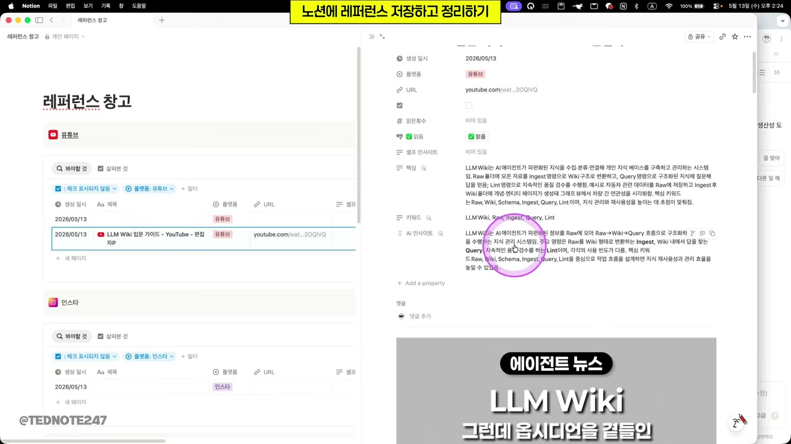

그리고 마지막 한 겹이 셀프 인사이트다. 정리된 내용을 보면서 내가 이해한 것, 도움이 될 만한 방향, 알게 된 지식을 셀프 인사이트에 간단히 적는다. 그러면 세 속성이 그것까지 이해해 다시 한 번 업데이트된다. AI의 요약 위에 사람의 해석을 얹고, 그 해석을 다시 AI가 읽어 내용을 정교하게 만드는 순환이다.

읽은 것은 읽음 버튼을 눌러 살펴본 것으로 넘긴다. 여러 번 읽은 것과 구분하고 싶으면 조건부 색상에서 읽은 횟수를 기준으로 배색을 지정한다. 한 번 읽었을 때 색이 표시되고, 한 번 더 누르면 색이 사라지게 해 두는 식이다.

인스타그램도 같은 방식이다. 다만 인스타는 URL을 따로 복사해 새 창에 붙여넣은 뒤 Save to Notion으로 보내야 하고, 폼을 복제해 플랫폼을 인스타그램으로 바꾼다. 저장하면 캡션까지 끌려오기 때문에 약간의 정리가 필요하다.

PC에서는 피드가 한꺼번에 떠서 URL을 복사해 별도 창으로 띄워야 하는 게 번거롭지만, 그래도 이렇게 저장해 두는 편이 나중에 관리 측면에서 훨씬 낫다는 게 그의 판단이다. 인스타 역시 릴리스 AI로 요약이 가능하고, 블로그나 기사도 같은 식으로 수집하면 나만의 세컨드 브레인이 채워진다.

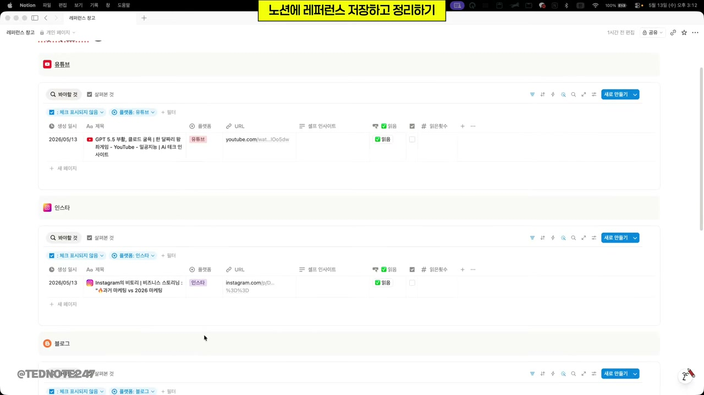

## 결국 다시 들여다봐야 의미가 있다

영상 끝에서 화자는 자기가 보여 준 방법도 세컨드 브레인 구조 중 하나일 뿐이고, 이런 구조는 결국 내가 다시 정리해서 들여다보지 않으면 의미가 없다고 말한다.

처음에 짚었던 "수집과 오류"로 되돌아가는 마무리다. 크롬 확장으로 클릭 한 번에 저장하고, 릴리스 AI가 요약하고, 노션 AI가 핵심 · 키워드 · 인사이트를 채우는 이 정교한 파이프라인의 끝에도, 결국 사람이 셀프 인사이트를 적고 다시 읽는 행위가 남는다. 자동화는 정보를 모으고 깎고 정리하는 일까지는 대신해 주지만, 그것을 내 지식으로 바꾸는 마지막 한 걸음은 대신해 주지 못한다. 화자가 만든 시스템 곳곳에 사람의 손이 한 번씩 끼어들도록 설계된 이유가 거기에 있다.

릴리스 AI는 7일간 유료 버전을 무료로 쓸 수 있고, 영상에서 만든 데이터베이스 구조와 프롬프트는 더보기란에서 내려받을 수 있다고 화자는 안내한다. 다만 그가 영상 내내 강조한 건, 만드는 단계보다 다 만든 뒤에 다시 들여다보는 습관이 더 중요하다는 것이었다.
