메타에서 4년, 8년차 개발자라는 사람이 요즘 회사에서 맡고 있다는 일이 좀 특이하다. 코드를 짜는 게 아니라 "두 번째 뇌"를 만드는 일이라고 했다. 알렉스라는 이름으로 활동하는 이 사람이 실밸개발자 채널에 나와, 자기가 만든 세컨드 브레인을 화면에 띄우면서 이야기를 시작한다.

화면에는 점과 선이 가득하다. 수백 개의 노드가 거미줄처럼 연결된 그래프다. 알렉스는 이걸 한마디로 "모든 지식의 집합체"라고 부른다. 더 정확히는 그릇이다. 단순한 저장소가 아니라, AI 에이전트가 정보에 잘 접근할 수 있도록 만들어진 지식 창고. 정의 자체는 소박한데, 그 안에 깔린 문제의식은 그렇지 않다.

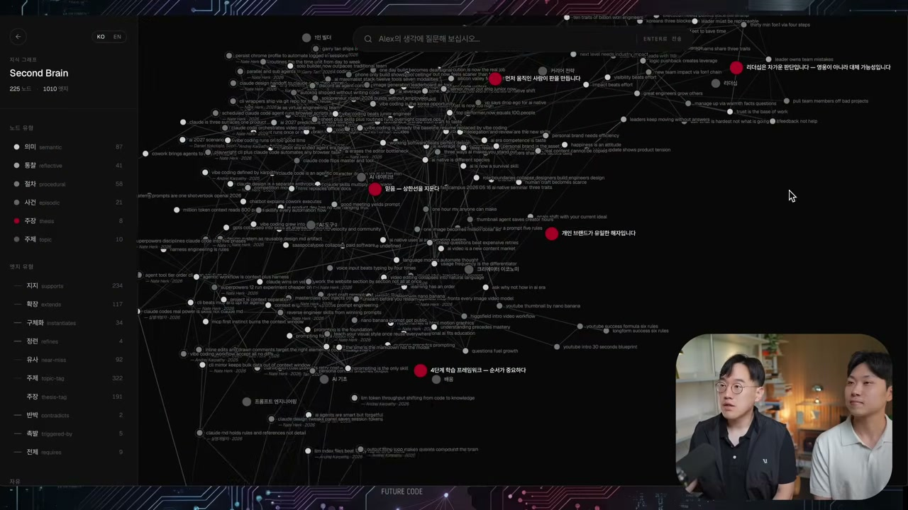

## 사람이 병목이다

세컨드 브레인이 왜 필요한가. 알렉스의 출발점은 의외로 단순한 불만이다. 에이전트를 잘 쓰려면 결국 사람이 옆에 붙어 있어야 한다. 계속 지도해주고, 명령을 내리고, 프롬프트를 쓴다. 그런데 바로 그 사람이 병목이 되어버린다. 24시간 대기할 수 없고, 휴가를 가면 멈춘다. 반면 에이전트는 그렇지 않다.

그래서 질문이 뒤집힌다. 내가 없어도 에이전트가 내 목표와 맥락을 이해해서 스스로 굴러가게 만들 수 없을까. 아이언맨의 자비스 같은 것이다. 나의 지식과 맥락을 전부 집어넣은 퍼스널 어시스턴트. 알렉스가 세컨드 브레인에서 가장 큰 힘으로 꼽는 건 **영구적이고 지속적인 저장소(permanent persistent storage)**, 그러니까 영원한 기억력이다. 그가 든 예가 구체적이다. 둘이 프로젝트를 하다가 한쪽이 휴가를 가도, 그 사람을 닮은 맥락을 가진 에이전트가 있다면 남은 사람이 그 뇌에게 질문하고 답을 받을 수 있다.

흩어진 자료를 그냥 쌓아두기만 하면 이게 안 된다. 핵심은 자료들을 노드와 엣지로 구별해서 그 사이의 관계를 이어주는 데 있다. 실밸개발자는 이걸 "지도"에 비유한다. 세컨드 브레인이라는 지도를 얼마나 정교하게 그려서 에이전트가 얼마나 잘 내비게이션할 수 있게 만드느냐. 그게 그래프로 나타난다는 것이다.

## 온톨로지, 생각의 부품과 관계

관계 이야기가 나오면 온톨로지라는 단어를 피할 수 없다. 요즘 핫한 키워드라는데, 풀어보면 정보의 개체와 관계성을 구현하는 일이다. 뇌라는 주제를 예로 들면, 왼쪽에는 생각의 유형들이 있다. 통찰, 절차, 사건, 주장처럼 의미를 가진 분류들. 그리고 이 생각의 조각들이 서로 어떤 유형의 관계를 맺는지가 엣지로 표현된다. 어떤 건 지지하고, 어떤 건 확장하고, 어떤 건 유사하고, 어떤 건 반박한다. 이 관계 구조를 그래프로 구현한 것이 온톨로지다.

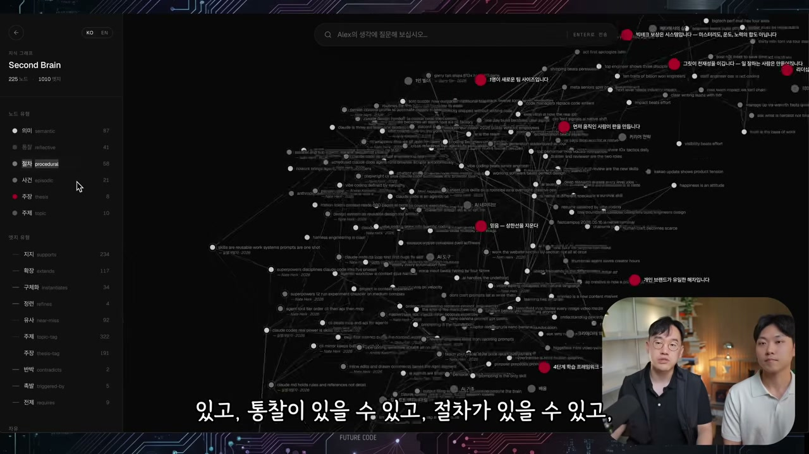

알렉스는 자기 세컨드 브레인이 세 층으로 되어 있다고 설명한다. 첫째는 원자 단위의 마크다운 생각 파일이다. 텍스트 노트로 생각을 하나씩 정리한 것. 둘째는 타입이 있는 그래프, 곧 앞서 말한 온톨로지다. 셋째는 에이전트, 클로드 코드를 써서 소스를 정제하고 기존 지식과 연결해 그래프를 스스로 만들어내는 층이다. 그리고 여기서 더 나아가 에이전트와 붙여 질의응답까지 가능하게 만들었다.

## 휴가 간 사람에게 묻기

말로만 들으면 추상적이니, 두 사람은 직접 해본다. 실밸개발자가 휴가를 갔다고 치고, 알렉스가 그의 세컨드 브레인에게 "클로드 코드는 어떻게 잘 쓰는 건가"를 묻는다. 답변이 흥미롭다. 그냥 LLM이 일반론을 뱉는 게 아니라, 실밸개발자 본인이 했던 말과 스타일을 그대로 살려 답한다. 항상 세 가지로 나눠 설명하는 그의 버릇까지 따라왔다. 스킬 시스템을 믿어라, CLAUDE.md는 가드레일이다, MCP와 CLI를 써라.

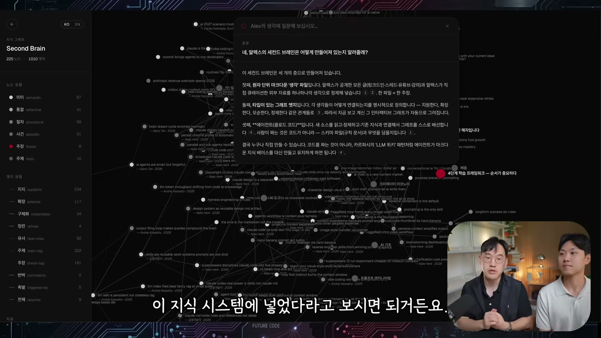

이게 가능한 이유는, 알렉스가 그동안의 포스트와 유튜브, 큐레이트한 자료들을 전부 이 지식 시스템에 넣어뒀기 때문이다. 그래서 답변에는 출처가 붙는다. 그는 이걸 할루시네이션을 막는 좋은 장치로 본다. 클로드한테 그냥 물어보면 그 답을 얼마나 믿어야 할지 감이 안 온다. 하지만 출처가 나오면 내가 직접 가서 검증할 수 있다. 그러니 인플루언서의 역할도 바뀐다고 그는 말한다. 출처를 다 표기해두면, 더 알고 싶은 사람은 원본 소스로 찾아가면 된다.

여기서 이번엔 실밸개발자가 받는다. 자료가 쌓이기만 하고 소비되지 못하는 현실에 대한 공감이다. 좋은 영상과 글을 일단 저장은 해두지만 볼 시간이 없어 다 보지 못한다고 그는 털어놓는다. 자기도 유튜브에 다운로드만 해둔 게 50개가 넘는데 실제로는 거의 못 본다는 것이다. 세컨드 브레인은 바로 그렇게 쌓이기만 하던 자료를 필요할 때 구조화해서 꺼내 쓰게 해준다.

이 원류로 알렉스가 지목하는 게 안드레이 카파시가 올린 LLM 위키다. 많은 사람이 이 LLM 위키와 옵시디언이라는 소프트웨어를 써서 그래프를 쉽게 만든다. 알렉스 본인은 거기서 한 발 더 나아가 디스틸레이션, 캡처, 그래프, 릴레이셔널, 엠베딩 같은 걸 더 구체적으로 구현했다고 한다.

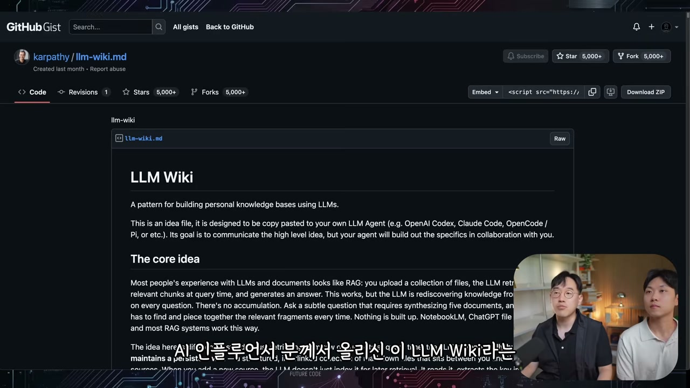

## 나를 복제한다는 것

알렉스가 이걸 만든 진짜 이유는 자기를 최대한 대체할 수 있는 서비스를 만들고 싶어서다. 구독자들이 던지는 질문이 너무 많은데 일일이 답할 여건이 안 된다. 그렇다면 답을 안 하는 것보다, 자기 생각을 닮은, 더 나아가 자기 생각을 함축해놓은 지식 시스템에 직접 질문하게 하면 어떨까. "2026년에 AI 네이티브가 되려면 뭘 배워야 하나" 같은 질문에 세컨드 브레인은 그가 강의에서 실제로 했던 말을 그대로 끌어와 답한다. AI가 거의 모든 일을 해낼 수 있다고 진심으로 믿고, 자신도 모든 도구를 끝까지 끌어 쓰는 사람. 알렉스가 정의하는 AI 네이티브가 그렇게 본인 입으로 한 적 있는 문장으로 재생된다.

두 번째 이유는 감각, 곧 테이스트다. 새 포스트를 쓸 때 머릿속 생각을 글로 옮기는 일이 쉽지 않을 때가 있다. 그런데 자기 스타일과 톤을 넣은 지식 창고가 있다면, 콘텐츠를 만들 때도 더 잘 활용할 수 있지 않을까. 실제로 "이 세컨드 브레인이 왜 중요한지 내 보이스와 톤대로 스레드 포스트 하나를 써줘, 최근 포스트도 참고해서"라고 시키면, 시스템은 메모리에 저장된 보이스와 과거 스레드를 읽어 글을 만들어낸다.

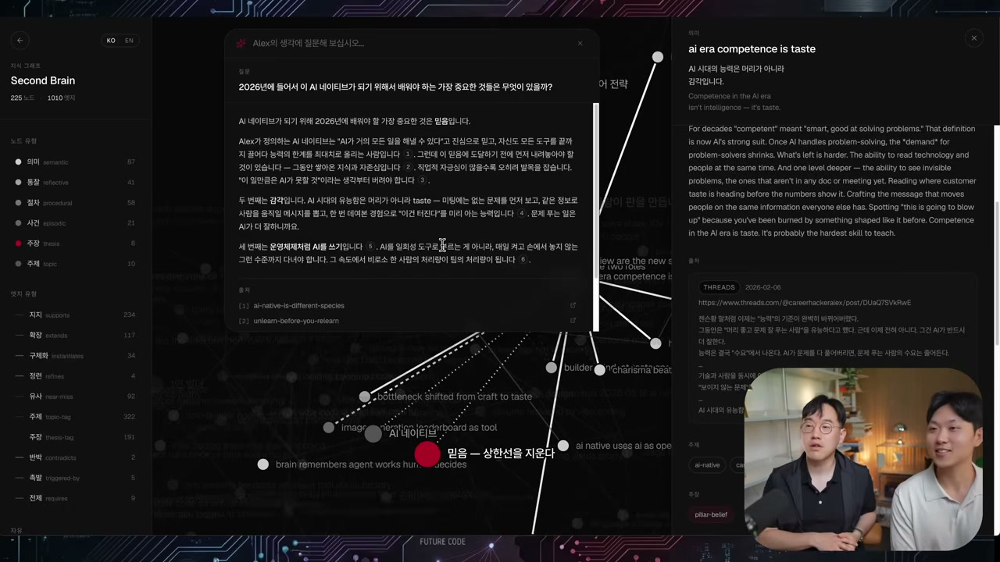

## 목소리를 3분 만에 복제하는 시대

복제 이야기는 곧 불편한 쪽으로 흘러간다. 이걸 서비스로 풀면, 누군가 알렉스의 톤과 스타일대로 스레드를 만들어 그 사람인 척 행세할 수 있다. AI가 "대딸깍의 시대"라 남의 아이디어와 보이스를 카피하는 일이 너무 쉬워졌다는 것이다.

알렉스가 겪은 일화가 이걸 생생하게 만든다. 최근 그의 음성을 카피해 쇼츠 내레이션으로 만든 사람이 있었다. 목소리가 너무 똑같아서 사람들이 "내 부계정인가" 하고 제보까지 해줬다. 강아지 쇼츠에 그의 목소리가 입혀져 "왜 항상 웃고 있을까요, 이를 전문 용어로 사모예드 스마일"이라고 말한다. 정작 본인은 한 적 없는 녹음인데, 실밸개발자가 듣고 "제 목소리보다 더 제 목소리 같다"고 할 정도다. 요즘 보이스 카피는 3분이면 된다.

다행히 사기로 이어지진 않았다. 알렉스의 아내는 "사람들이 네 목소리를 좋아하나 보다, 좋은 거 아니냐"고 했다는데, 그는 애매하다고 느낀다. 같은 목소리로 누군가를 비방하거나 컨트로버셜한 말을 시킬 수도 있기 때문이다.

여기서 그가 내리는 결론이 이 영상의 한 축이다. 그런 것들이 쉽다고 해서 나의 가치가 변하는 건 아니다. 그래서 앞으로 라이브가 중요해질 거라고 본다. 송길영 박사도 유튜브에서 비슷한 이야기를 한 적이 있다는데, 이유는 분명하다. **라이브는 카피할 수 없다.** 즉석에서 질문을 받고 대처하는 능력, 소통하는 능력은 복제되지 않는다. 그러니 그런 콘텐츠가 더 귀해진다. 걱정스러운 부분이면서, 동시에 내가 가질 수 있는 엣지이기도 하다.

## 진짜 무기는 맥락이다

영상 후반, 세컨드 브레인이 직접 써낸 글 한 편이 나온다. 두 사람이 화면을 보며 "이건 진짜 잘 썼다"를 연발하는 그 글의 요지는 이렇다.

처음 세컨드 브레인 이야기를 꺼냈을 때 사람들은 물었다. 메모 앱이랑 뭐가 다르냐, 굳이 왜 만드냐. 만들면서 본인도 자문했다. 그런데 지난 몇 달 AI를 쓰면서 확실해진 게 있다. 모델은 다 똑같아졌다. 클로드든 GPT든, 같은 질문을 하면 같은 답이 나온다. 그래서 AI를 쓴다는 건 더 이상 차별점이 아니다.

진짜 차이는 한 군데서 난다. **무엇을 먹여서 시키느냐.** "마케팅 전략 짜줘" 하면 누구나 뻔한 답을 받지만, 8년치 생각과 실패와 관점과 취향을 먼저 확인시키고 시키면 그제야 "내 답"이 나온다. 세컨드 브레인은 그 맥락을 쌓아두는 곳이다. 흩어진 메모가 아니라 생각 하나하나를 잘게 쪼개 서로 연결하고, 필요할 때 언제든 꺼낼 수 있게 만든 두 번째 뇌.

글은 한 문장으로 못을 박는다. AI 시대의 지식은 더 이상 무기가 아니다. 지식은 이제 공짜다. 진짜 무기는 나만 가진 맥락이고, 이건 AI가 절대 공짜로 나눠주지 못한다.

이 통찰은 다른 데서도 한 번 더 확인된다. 지금은 클로드와 GPT 정도만 쓰지만, 모델이 상향평준화되면서 일마다 모델을 골라 쓰는 시대가 온다. 그때 제일 중요한 건 모델마다 컨텍스트를 어떻게 먹이느냐다. 알렉스가 예로 든다. 그는 챗GPT에 채팅을 워낙 많이 해서 그게 자기를 어느 정도 안다. 그런데 내일 제미나이가 새로 나오면? 그 맥락을 그대로 가져갈 수 없다. 하지만 세컨드 브레인을 만들어두면 클로드에도, 챗GPT에도 똑같이 연결할 수 있다. 모델을 바꿔도 뇌는 그대로 존재한다.

여기서 하네스 엔지니어링과도 연결된다. 하네스란 모델이 이상한 짓을 하지 않고 내가 원하는 대로 답하도록 규칙을 나열하는 일인데, 나의 뇌 구조와 생각을 모아두는 것 자체가 곧 하네스가 된다. 흥미로운 전망도 나온다. 모델이 너무 좋아지면서 결국 모델이 자기 하네스를 알아서 만들어내는 때가 온다는 것이다. 코덱스와 클로드 양쪽에서 쓰이는 골(goal) 스킬처럼, 대충 프롬프트를 줘도 원샷으로 끝까지 굴러가게 만드는 방향. 그렇게 하네스를 우리가 거의 구축하지 않아도 되는 때가 오면, 그때 가장 중요해지는 게 세컨드 브레인이다. 아무리 모델이 하네스를 잘 만들어도, 나에 대한 정보만큼은 만들 수가 없기 때문이다. 웹에서 긁어올 순 있어도 너무 비효율적이다. 결국 맥락을 누가 더 잘 쌓아뒀느냐에서 격차가 벌어진다.

## 검증, 답이 없는 것을 채점하기

잘 만든다는 건 어떻게 아는가. 알렉스는 이발(eval), 곧 평가를 꺼낸다. LLM은 할 수 있는 게 너무 많은데, 얼마나 잘 되는지는 느낌이 안 온다는 말이 많다. 그래서 질문을 던지고 그 답을 보고 평가한다. "이 답은 내 생각이 잘 반영 안 됐네, 왜 안 됐어, 이 weight를 조정해" 하는 식으로. 알렉스는 구독자들이 주는 질문들을 매일 검증한다. "디자인 시스템 만드는 법" 같은 질문에 답이 안 좋으면, "이렇게 답했어야지, 왜 그랬어" 하고 클로드가 알아서 고치게 한다.

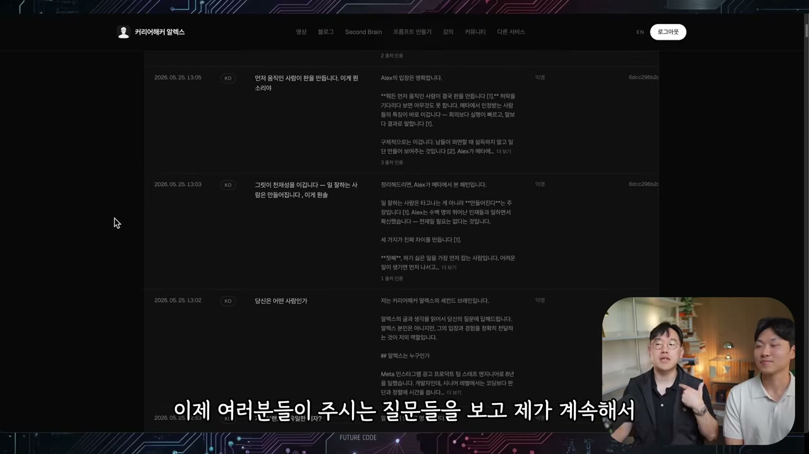

그런데 코드와는 결정적으로 다르다. 코드는 테스트의 답이 정해져 있다. 이 로직은 무조건 이 값이 나와야 한다는 결정론(deterministic). 그게 코드의 장점이었다. 하지만 LLM은 답이 없다. 그래서 답변에 대한 채점은 결국 "내 느낌", 바이브 테스트로 간다. 그 취향을 얼마나 잘 맞춰가느냐가 이발의 목적지다. 그리고 세컨드 브레인은 바로 그 취향과 맥락과 스타일에 포커스되어 있으니, 검증도 더 잘 해낸다. 테이스트는 실제로 사람들이 썼을 때 좋은 경험을 주는 것, 곧 UI UX의 다음 단계다.

## 따라 만들기: 카파시의 LLM 위키

후반부는 실습이다. 실밸개발자의 세컨드 브레인을 직접 만들어본다. 알렉스가 자기 것을 만들 때 쓴 복잡한 임베딩 방식 대신, 이번엔 카파시가 한 것 그대로, LLM 위키와 옵시디언으로 간다.

먼저 맥락을 모은다. 실밸개발자는 유튜브를 잘하고 싶어서 늘 클로드와 작업하는데, 매번 프로젝트 안의 대본과 아이디어를 다 읽혀 새 계획을 세우게 한다. 이미 세컨드 브레인 비슷한 걸 하고 있는 셈인데, 문제는 계속 반복해야 한다는 것, 그리고 다른 프로젝트에서 쓰고 싶을 때 불편하다는 것이다. 패스트캠퍼스 강의를 만들 때도 유튜브 대본을 크로스 레퍼런스할 일이 많았다. 한 군데 모아둘 세컨드 브레인이 필요했던 이유다.

그가 깃헙에 미리 유튜브 영상 자료를 넣어뒀다. 에이전트 엔지니어링 같은 주제로 에피소드를 나누고, 그 안에 슬라이드와 스크립트가 들어 있는 구조다. 클로드 코드에게 클론을 시킨다.

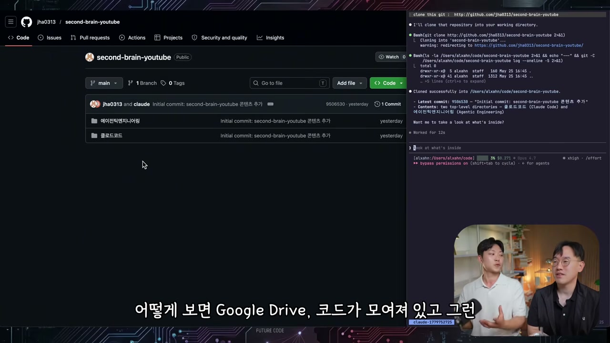

이제 옵시디언으로 이 폴더를 연다. 대본 파일들이 왼쪽에 뜨고, 그래프 뷰를 켜면 노드가 보인다. 하지만 파일끼리 아직 연결선이 없다. 점만 흩어져 있는 상태다.

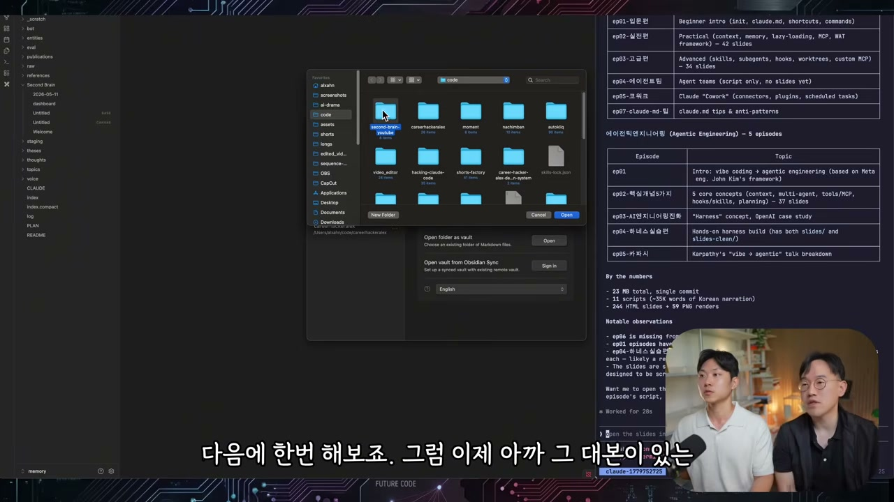

옵시디언 안에서 터미널을 열어 클로드 코드를 실행하고, LLM 위키를 먹인다. 처음 하는 사람을 위한 설명도 곁들인다. 커뮤니티 플러그인에서 터미널을 설치해야 왼쪽에 터미널 버튼이 나온다. 프롬프트는 거창하지 않다. "안드레이 카파시의 LLM 위키를 바탕으로 이 코드베이스를 LLM 위키화 시켜줘." 링크 하나면 된다.

LLM 위키가 무엇인지 둘이 한국어로 다시 정리한다. 옛날에도 개발자들은 위키를 많이 썼다. 문제는 아무도 업데이트를 안 한다는 것, 그래서 안 읽고, 읽어도 틀린 정보가 많다는 것이었다. 카파시의 제안은 "걱정 마라, 위키는 이제 우리가 관리할 필요 없다, 에이전트가 관리해준다"는 것이다. 파일이 아무리 많아도 서로 그래프를 일일이 만들 게 아니라, 다 에이전트한테 시키면 된다. raw 파일은 그대로 보관하고, processed 폴더를 새로 만들어 대본의 핵심을 위키 파일로 뽑아내고, 인덱스 파일로 그 위키들의 관계를 찾을 수 있게 한다. 원본은 건드리지 않고 그 위에 위키를 얹는 3계층 구조다.

작업이 돌아가는 동안 화면에는 에이전트 11개가 병렬로 떠서 대본을 인제스트하는 로그가 흐른다.

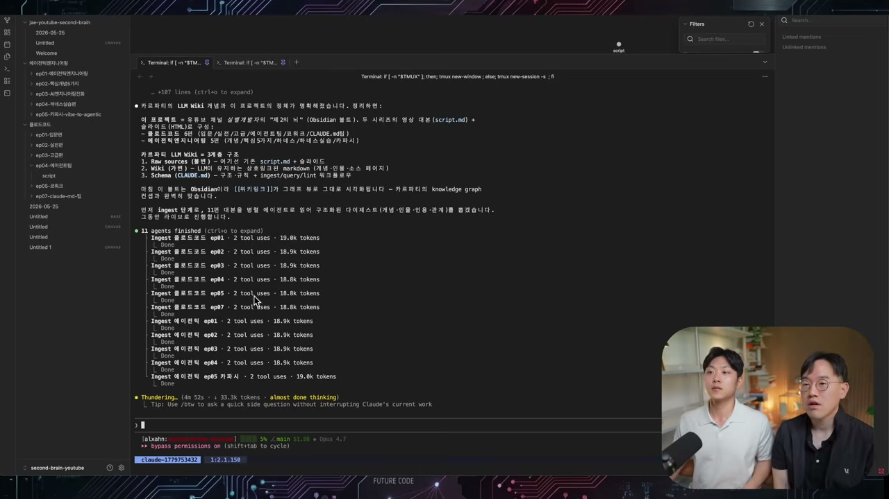

## RAG는 왜 필요 없어졌나

여기서 RAG 이야기가 나온다. 실밸개발자가 RAG가 뭐냐고 묻자, 알렉스가 1GB 문서를 예로 풀어준다.

옛날에는 그렇게 큰 문서를 한 번에 읽을 방법 자체가 없었다. 그래서 부분마다 조각을 냈다. 그게 청킹이다. 10만 장 문서면 한 장씩 잘라 각각을 벡터로, 즉 숫자로 만든다. 이 벡터화가 엠베딩이다. 새 질문이 들어오면 "알렉스의 세컨드 브레인이 뭐야?"라는 질문도 벡터로 만들고, 가장 유사한 벡터를 찾는다. 코사인 유사도나 BM25 같은 걸로 시멘틱 서치를 해서 가장 가까운 문서 조각을 가져와, 답변할 때 프롬프트에 같이 끼워 넣는다. "알렉스의 세컨드 브레인 알려줘, 그리고 관련 지식은 이걸 참고해" 하고 프롬프트에 실제 문서를 덧대주는 것, 그게 RAG다.

LLM 위키는 이걸 할 필요가 없다고 말한다. 청킹도 엠베딩도 안 하고, 그냥 LLM에게 파일을 잘 쪼개주고 잘 찾는 법을 알려주면 알아서 찾는다. 이유는 두 가지다. 컨텍스트 윈도우가 커졌고, 에이전트가 파일을 찾는 일을 훨씬 잘하게 됐다. 그래서 카파시는 이렇게 비유한다. 옵시디언은 그냥 IDE일 뿐이고, LLM이 프로그래머, 위키가 코드베이스다. 지식이 한 번 컴파일되면 그 뒤로는 에이전트가 알아서 최신 상태로 유지한다. 매 질문마다 새로 검색하고 유지보수할 필요가 없다. 계속 누적되며 풍부해지는 컴파운딩 산출물이다.

잠시 뒤 그래프로 돌아가니 엣지가 잔뜩 생겨 있다. 점들이 이제 선으로 묶였다.

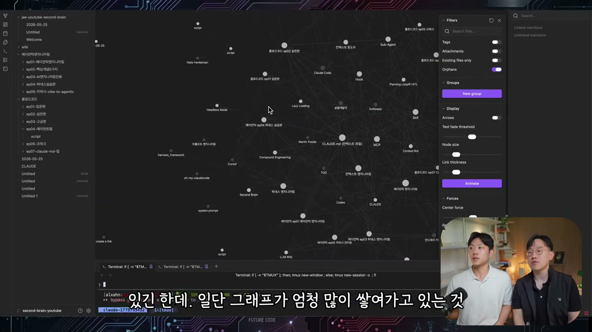

생성된 위키 파일을 클릭하면 Properties라는 스키마가 채워져 있다. Type은 소스, 태그, 그리고 이게 유튜브 대본임을 스스로 알아채고 편수와 분량까지 스키마로 만들어뒀다.

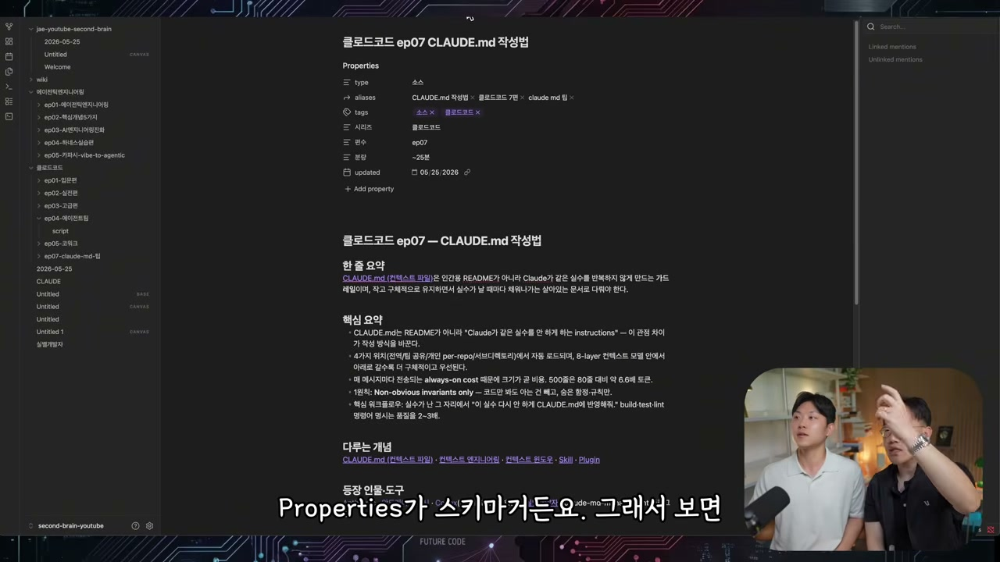

노드 하나를 누르면 연결된 개념으로 타고 들어간다. CLAUDE.md, 컨텍스트 엔지니어링 같은 개념 노트로 계속 이어진다. 에이전트가 링크를 스스로 만들어 Vault 안의 모든 것이 연결되게 했기 때문이다.

## 옵시디언은 예쁜 IDE일 뿐

옵시디언을 꼭 써야 하느냐는 질문에, 알렉스의 답은 명확하다. 옵시디언이 주는 이점은 분명히 있다. UI를 만들어준 것, 특히 태그로 필터링되는 게 큰 도움이다. 굳이 내가 직접 그래프를 그리고 스키마를 따지 않아도 가장 빠르게 만들 수 있는 게 옵시디언이다.

하지만 한계도 뚜렷하다. 지금은 지식 창고가 0.001%밖에 안 찼다. 이게 천 개, 만 개로 늘어나면 사람이 이걸 직접 볼 일이 있을까. 쓰는 방법은 둘뿐이다. 서치, 그리고 그래프를 타고 들어가는 traversal. 그런데 "에이전트 엔지니어링 중에서도 하네스 부분만 보고 싶은데" 같은 복합 조건이 되면 단순 필터링은 막힌다. 에이전트 엔지니어링이 만 개, 하네스가 3만 개 나오는데 둘이 합쳐진 100개만 보고 싶을 때, 키워드 필터로는 안 된다. 정보 자체가 결정론적이지도, 균일하지도 않기 때문이다. 그래서 결국 임베딩이나 에이전트가 필요하다.

정리하면 이렇다. 옵시디언은 전체를 둘러보고 큰 그림(매크로)을 보기에 좋은, 예쁘고 사용자 친화적인 뷰어다. 초보자에게도 쉽다. 하지만 실제로 활용할 때는 에이전트한테 물어봐야 한다.

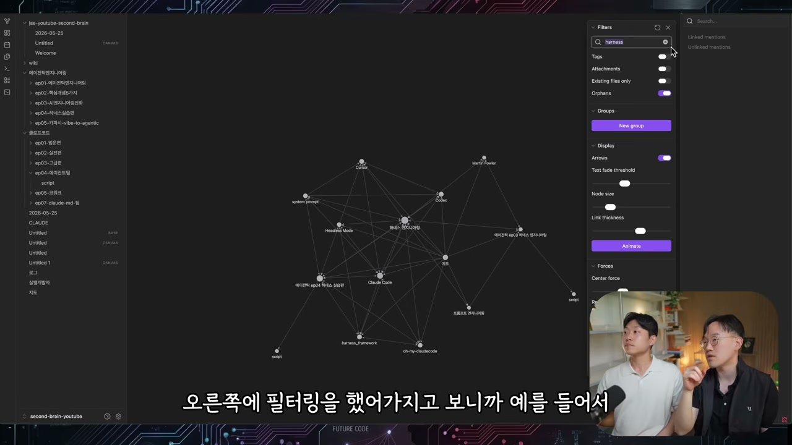

이걸 직접 확인해본다. "AI 네이티브 시대에 우리가 꼭 해야 될 것들을 정리해줘"라고 묻자, 클로드는 위키를 읽고 인덱스를 읽는다. 그런데 raw source까지 확인하는 과정에서 핵심 개념이 잡힌다. **이게 캐싱이다.** 10만 개 raw source를 다 읽을 수는 없으니, 위키 1000개만 읽고 거기서 제대로 된 raw source를 찾아갈 수 있게 도와주는 설계. 알렉스의 표현으로는 에이전트 기반 검색(agent-driven searching)이다. 위키는 답 자체가 아니라, 답이 있는 원본으로 가는 빠른 지도인 셈이다.

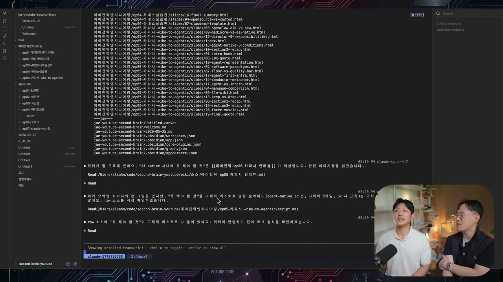

마지막으로 세컨드 브레인 전체를 정리시킨다. 실밸개발자의 유튜브 영상, 대본, 슬라이드를 raw source로 두고, LLM이 유지하는 상호 링크 지식 그래프 위키를 얹은 옵시디언 볼트. 위키 노드는 58개가 만들어졌다. 상위 개념으로는 에이전틱 엔지니어링, 하네스 엔지니어링, 바이브 코딩, 소프트웨어 3.0, AI 네이티브, 컴파운드 엔지니어링, LLM 위키, 컨텍스트 계열이 추출됐다. 한눈에 들어온다.

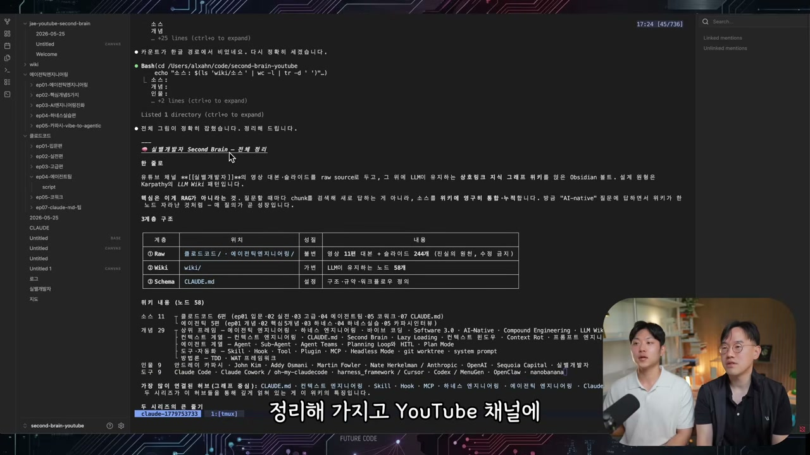

여기서 일회성과 시스템의 차이가 드러난다. 대본을 다 다운받아 "이거 읽고 개념 정리해줘" 하면 원 오프로 끝난다. 하지만 이렇게 멀티로 만들어두면 개념마다 더 직접적으로 추가 질문을 할 수 있다. "컨텍스트 엔지니어링 관련된 모든 소스와 그에 대한 생각을 알려줘" 같은 식으로.

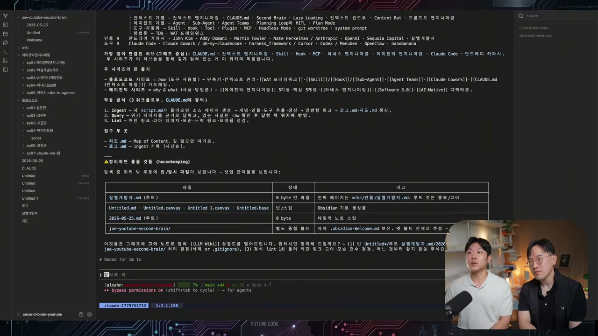

옵시디언 CLI는 없고, 그래프를 코드로 바꾸는 것도 안 된다. 결국 그래프 뷰는 베이직한 필터링과 뷰 메커니즘일 뿐이고, 실제로 활용하려면 클로드 코드로 위키에 쿼리를 날려 에이전트를 써야 한다. 옵시디언은 예쁘게 보여주고 기본 필터링을 돕는 도구이고, 실제로 모든 걸 하는 건 터미널에서 돌아가는 클로드다. 그래서 알렉스가 자기 세컨드 브레인에서 검색하면 그래프가 바로 뜨도록, UI와 에이전트를 연결해둔 이유가 여기 있다. 사람이 손으로 필터하는 데는 한계가 있으니까.

## 끝나지 않는 뇌

두 사람이 만든 건 카파시 스타일의 입문 버전이다. 알렉스가 회사에서 다루는 건 여기서 한 층 더 나아간 것이라고 했다. 옵시디언 세컨드 브레인은 끝이 아니다. 진짜 질의응답을 원하면 에이전트가 같이 가야 하고, 서비스로 만들려면 임베딩을 올리고 정보를 어딘가 배포해야 한다.

그럼에도 이 영상이 남기는 건 도구 사용법이 아니라 한 문장이다. 모델은 평준화됐고, 지식은 공짜가 됐다. 남는 차이는 내가 무엇을 먹여서 시키느냐, 곧 나만 가진 맥락이다. 그 맥락을 노드와 엣지로 쌓아 에이전트가 언제든 꺼내 쓰게 만든 것이 세컨드 브레인이고, 그건 질문을 던질 때마다 함께 자라는 시스템이다. 매 질의가 곧 성장이라는 그들의 말처럼.

여러분의 두 번째 뇌는 지금 어디 있는가.
