얼마 전 안드레이 카르파티가 LLM 위키라는 작업 틀을 공개했다. 유명한 AI 연구자가 내놓은, 실제로 쓸모도 좋은 틀이다. 그런데 영상 속 화자는 이 틀에 한 가지 위험한 장점이 있다고 말한다. "위험한 장점"이라는 말이 묘하다. 장점인데 위험하다니. 그가 가리킨 건 이런 것이다. 좋은 도구일수록, 그 도구가 정작 무엇을 모르는지는 잘 보이지 않는다.

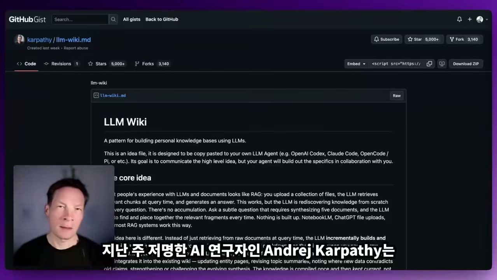

## 왜 그냥 AI에 파일을 던지면 안 되는가

카르파티가 짚은 문제부터 보자. 우리가 평소에 하는 일은 단순하다. 일반 AI에 파일을 하나 올리고, 답을 받는다. 이때 안에서 벌어지는 일은 RAG, 즉 올린 문서에서 관련된 글자 조각을 끌어와 그걸로 답을 만드는 방식이다.

문제는 그다음이다. 같은 시스템에 다시 말을 걸면, 그 시스템은 늘 똑같은 일을 처음부터 다시 한다. 과거에 했던 작업은 잊고, 이번에 올린 것만 본다. 그래서 지식의 바탕이 매번 흔들린다. 어제 정리한 내용 위에 오늘 것을 쌓아 올리는 게 아니라, 매번 백지에서 다시 시작하는 셈이다.

카르파티가 LLM 위키로 풀고 싶었던 게 바로 이 흔들림이다. 한 번 정리한 지식을 파일로 남겨 두고, AI가 매번 그 위에서 일하게 만들자는 발상이다. 이 위키를 IDE나 Obsidian에서 열면, 시스템이 raw 폴더부터 노트까지 폴더 구조를 다 만들어 준다. 자료는 raw 폴더에 정리되고, 그걸 바탕으로 위키가 생성된다. 위키 안의 페이지들은 서로의 개념과 연결되어 있고, 주요 아이디어끼리도 묶여 있다. 말하자면 내 지식을 구조화한 한 덩어리가 파일로 남는 것이다.

여기까지가 카르파티의 그림이다. **시스템은 만들어졌는데, 정작 그것을 어떻게 활용할지가 다음 질문으로 남는다.** 위키가 생겼다고 새로운 통찰이 저절로 나오지는 않기 때문이다. LLM에게 무언가를 생성해 달라고 하면 개념과 질문과 데이터는 잘 뽑아 주지만, 그건 LLM이 이미 학습한 범위 안에서 가장 그럴듯한 결과일 뿐이다. 화자가 던지는 물음은 이것이다. 이 위키를 진짜 새로운 생각의 도구로 만들려면 무엇이 더 필요한가.

## 지식 그래프라는 한 겹

화자가 내놓는 답이 지식 그래프다. 그는 인프라노두스라는 도구로 지난 10년 동안 지식 그래프 시각화를 다뤄 왔다고 말한다. 아이디어를 네트워크로 보는 기술인데, 이 도구가 하는 일은 세 가지다. 텍스트에서 주요 아이디어와 클러스터를 찾아 보여주고, 지식이 어느 쪽으로 쏠려 있는지 그 비중을 드러내고, 그 위에서 새로운 아이디어를 길어 올린다.

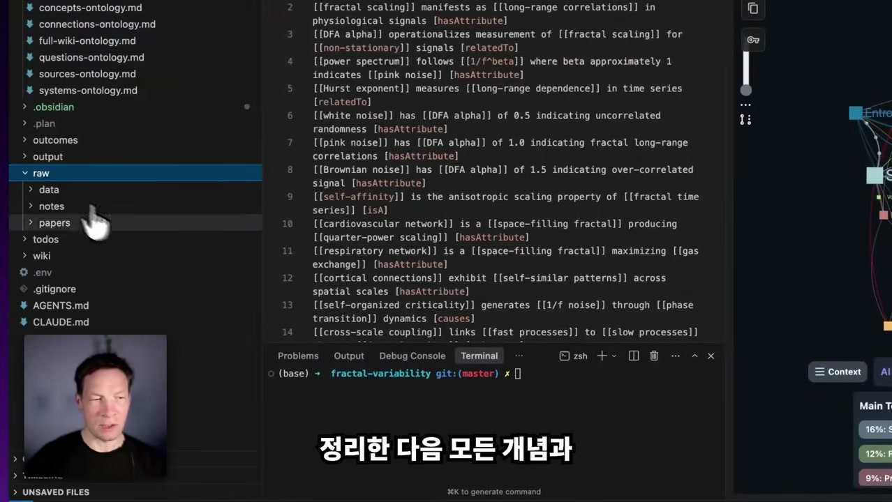

핵심은 마지막 항목이다. 위키가 지식을 차곡차곡 쌓는 일이라면, 지식 그래프는 그 쌓인 더미를 위에서 내려다보며 빈틈을 찾는 일이다. 화자는 자기가 미리 만들어 둔 위키를 보여준다. 자신이 연구하는 주제에 대해, 갖고 있던 책들을 전부 raw 폴더에 넣어 만든 것이다. 책과 여러 주제의 자료가 들어가고, 시스템이 그 원자료들로부터 주요 개념의 구조를 뽑아낸다.

이렇게 위키가 만들어지면 그 폴더에서 Claude Code를 띄워 질문을 던질 수 있다. 질문이 들어오면 시스템은 위키를 훑고, 개념을 추려, 그 안에서 가장 들어맞는 답을 만든다. 어떤 용도에든 쓸 만하지만, 화자가 특히 흥미롭다고 보는 건 새로운 아이디어를 만들고 싶을 때다. 그런데 그러려면 먼저 이 위키가 어떻게 짜여 있는지를 봐야 한다. 그래서 지식 그래프가 들어온다.

## 세 가지 깊이로 붙이는 법

화자는 지식 그래프를 LLM 위키에 붙이는 방법을 깊이가 다른 세 단계로 보여준다.

첫 번째는 시각적으로 보는 것이다. 위키 폴더를 자신이 좋아하는 IDE에서 연다. 여기서는 Cursor를 쓰거나 안티그래비티를 쓴다. 거기에 인프라노두스 익스텐션을 설정해 두면, 논문에서 뽑힌 주요 개념을 클릭해 그래프로 펼쳐 볼 수 있다.

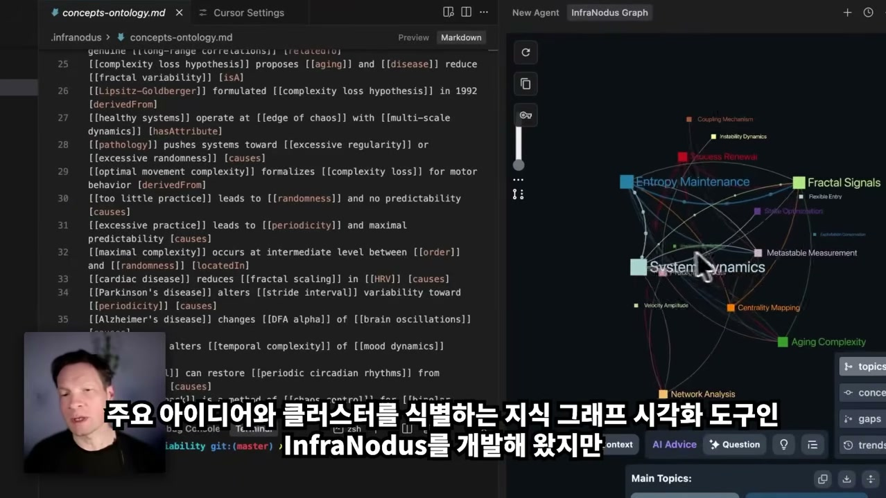

이 그래프가 두 가지를 동시에 보여준다. 하나는 내 연구의 큰 주제들이다. 네트워크, 페이즈 다이내믹스, 프랙털 구조 같은 덩어리가 한눈에 들어온다. 다른 하나는, 아직 약한 작은 클러스터다. 더 키워야 할 부분이 어디인지가 그림으로 드러난다. 그리고 그 클러스터들 사이의 갭, 즉 서로 더 잘 이어질 수 있는데 아직 끊겨 있는 지점에 들어가, 둘을 연결해 새로운 아이디어를 만들어 낼 수 있다.

이 시각화는 Obsidian에서도 똑같이 쓸 수 있다. Obsidian에는 인프라노두스 플러그인이 있어서, 개념 폴더를 그 플러그인으로 열면 그 안에 든 아이디어들의 연결을 그래프로 보여준다. 같은 토픽 개요가 나오고, 마찬가지로 갭이 보인다. 그 갭을 잇는 연구 질문을 AI가 생성하게 해서, 떨어져 있던 두 클러스터를 연결하는 새 아이디어를 끌어낼 수 있다.

두 번째 단계는 한 발 더 들어간다. 눈으로 보는 대신, 그래프를 LLM의 사고 안으로 끌어들이는 것이다. Claude로 돌아와 인프라노두스 MCP 서버를 쓴다. 그래프가 LLM이 생각하기 위한 연결망이 되도록 하는 것이다. 인프라노두스의 그래프 생성 도구를 쓰면, 위키의 개념 폴더에서 개념을 분석하고, 그 결과를 MCP 도구로 Claude와 이어 붙인다. 인프라노두스에는 이 모든 콘텐츠를 연결하는 API가 있어서, 개념 목록을 마크다운 파일로 내주고, 그 위에서 지식 그래프 도구를 돌릴 수 있다.

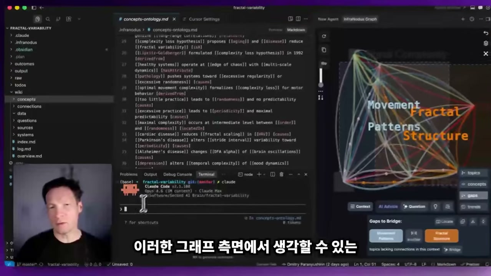

결과는 눈으로 보던 것과 비슷한 의견이다. 다만 그림이 아니라 글로 나온다. 주요 토픽 클러스터, 프랙털 다이내믹스, 임계 전이, 프로세스 결합, 그리고 갭에 대한 정보까지 텍스트로 정리해 준다. 그래프가 필요하면 그래프를 보고, 아니면 Claude Code 안에서 MCP 서버를 그대로 쓰면 된다.

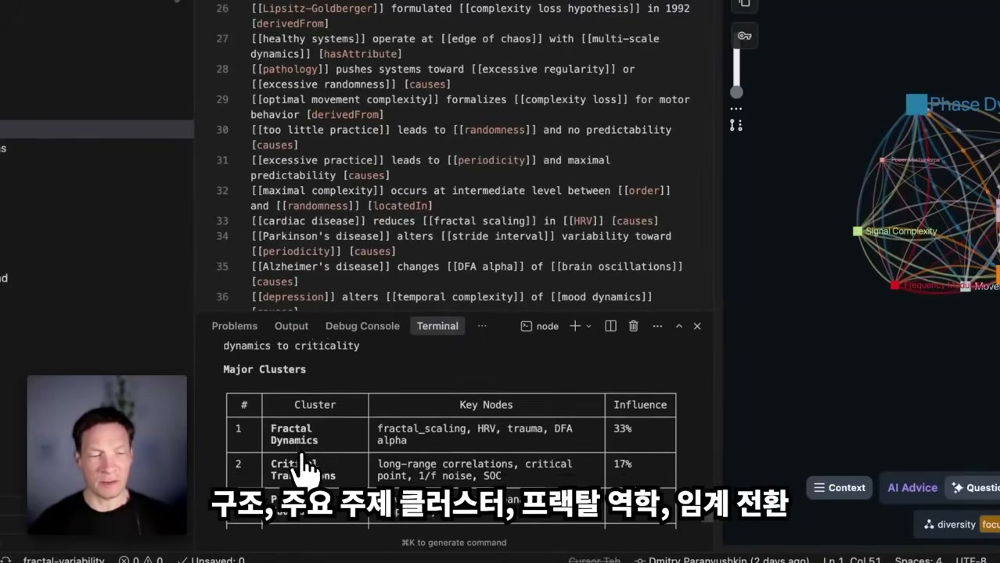

세 번째가 가장 깊다. 외부 도구로 폴더를 분석하는 데서 그치지 않고, **지식 그래프를 위키의 구조 자체에 심어 넣는 것이다.** 화자가 만든 스킬은 위키를 만들고 아이디어를 생성할 때, 온톨로지 그래프를 담는 폴더를 함께 만든다. 그가 전에 자기 채널에서 다뤘던 온톨로지 그래프다. 이걸 Obsidian에서 열면 그 안의 주요 개념들과 그 연결이 그려진다. 예컨대 동기화 패턴이라는 개념이 있는데 프랙털 네트워크와는 아직 연결되지 않은 게 보이면, 그 둘을 골라 흥미로운 질문을 만들어 이어 붙인다. 이렇게 끊겨 있던 지식 클러스터를 연결하면 연구 전체가 한층 단단하고 촘촘해진다.

이 온톨로지 그래프를 위키의 모든 내용을 가로질러 한 번 만들어 두면, 시스템 안에서 무슨 일이 벌어지는지에 대한 일종의 살아 있는 기억이 생긴다. 그래서 Claude든 다른 시스템이든 다시 돌아왔을 때, 이 시스템의 규칙과 개념들이 위키 안에서 어떻게 이어지는지를 따라가며 새로운 아이디어를 낼 수 있다. 그래프를 단순히 위키 옆에 대 보는 게 아니라, 위키 안에 녹여 넣는 방식이다.

## 처음부터 끝까지: 금융 위키를 짓다

말로만 들으면 추상적이니, 화자는 빈 폴더에서 시작해 전 과정을 직접 보여준다.

먼저 컴퓨터에 새 폴더를 만들고 이름을 준다. 여기서는 finance라는 이름이다. 그 안으로 들어가 Cursor 같은 개발 환경을 연다. 폴더는 아직 텅 비어 있다. 거기서 터미널을 열고 Claude를 띄운다. LLM 위키 스킬을 이미 깔아 둔 상태라, "내가 가진 금융 지식을 모아 저장소로 만들어 달라"는 식의 일반적인 요청을 던지면 된다. 화자는 이 스킬을 일부러 질문을 되묻도록 짜 두었다고 말한다. 그래서 어떻게 진행할지를 스킬이 먼저 물어 온다.

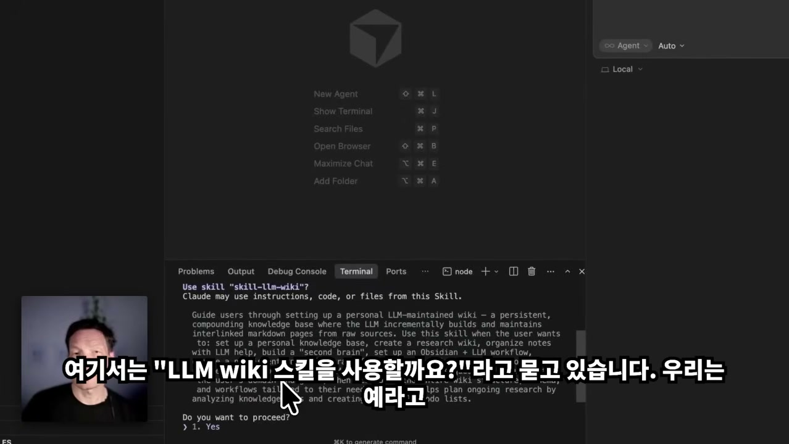

질문은 차근차근 이어진다. 이 위키로 금융의 어느 쪽을 연구하고 싶은가. 화자는 개인 투자와 전략이라고 답한다. 어떤 종류의 소스를 넣을 것인가. 책은 넣고, 영상과 팟캐스트는 빼고, 개인 노트와 데이터는 넣는다. 최종 목적이 무엇인가. 배우고, 결과를 뒷받침하고, 삶을 발전시키는 것이라 답한다. 소스는 몇 개나 둘 것인지까지 묻는다. 매번 무언가를 구성할 때 스킬이 이렇게 몇 가지를 되물어, 사용자의 구체적인 용도에 맞게 시스템을 맞춰 준다.

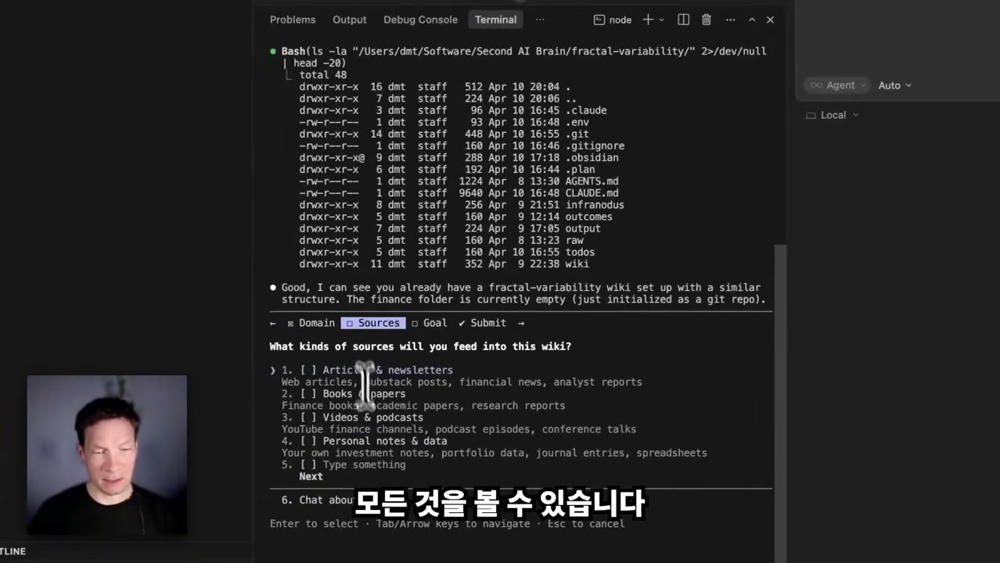

답을 마치면 프로젝트 구조가 짜인다. relevant articles, notes, data, books를 모아 둘 raw 폴더가 생기고, 그 지식이 구조화될 자리, 흥미로운 아이디어가 생성될 output 폴더, 그리고 to-do 폴더가 함께 만들어진다. 인프라노두스를 쓰기 때문에 거기 연결할 페이로드도 들어간다. CLAUDE.md 파일과 AGENTS.md 파일도 만들어져, 이 프로젝트가 무엇이고 무엇을 이루려는지를 에이전트에게 일러 준다.

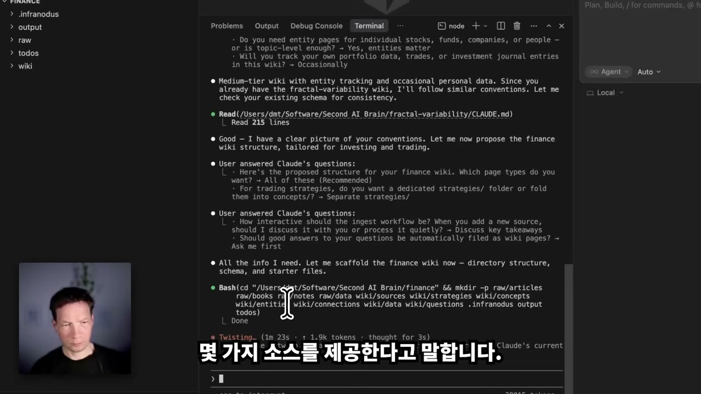

이제 소스를 넣을 차례다. 화자는 Dropbox의 research papers 폴더를 가리키며 "거기서 금융과 경제에 관련된 걸 다 찾아라"고 말한다. Claude는 그 폴더를 뒤져 금융, 돈, 경제 주제에 관한 논문과 이미지, 자료를 끌어온다. 자료가 많이 나왔다고 하니, 전부는 아니더라도 Finance and Market Dynamics 같은 갈래로 약 30권의 책을 추린다. Claude Code는 그 책들의 PDF 내용을 읽어 마크다운 파일로 바꾼다. 이게 중요한 이유가 있다. 마크다운이면 어떤 텍스트 에디터에서든 열 수 있고, 무엇보다 LLM이 곧장 읽을 수 있는 기본 텍스트가 되기 때문이다.

변환이 끝나면 책마다 위키 페이지가 생긴다. 한 페이지를 열어 보면 그 책의 주요 정보, 영역, 중요한 개념, 그리고 그 책 안 아이디어들의 연결이 구조화되어 있다.

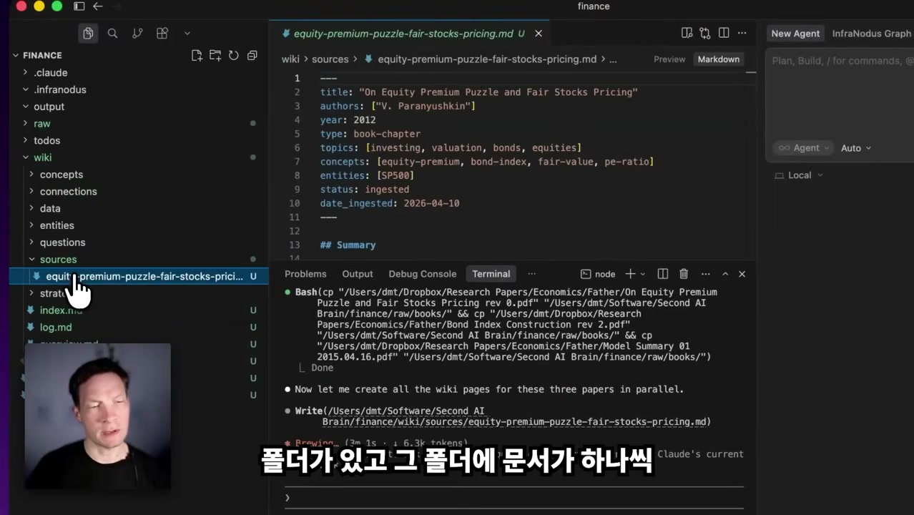

## 갭을 찾아 질문으로

여기서부터가 화자가 가장 공들이는 대목이다. 위키가 만들어지는 동안, 그는 Cursor에 설정해 둔 인프라노두스 액션으로 모든 페이지의 내용을 들여다본다. 예를 들어 국제수지(balance of payments) 페이지에서 우클릭해 그래프로 시각화하면, 금융, 경제, 투자, 시장 인사이트 같은 주요 개념들이 펼쳐진다. AI를 거치지 않고 폴더 전체를 클릭해 그래프를 볼 수도 있다. 그러면 인프라노두스가 여러 파일의 개념을 한데 모아, 가장 중요한 것들을 보여준다.

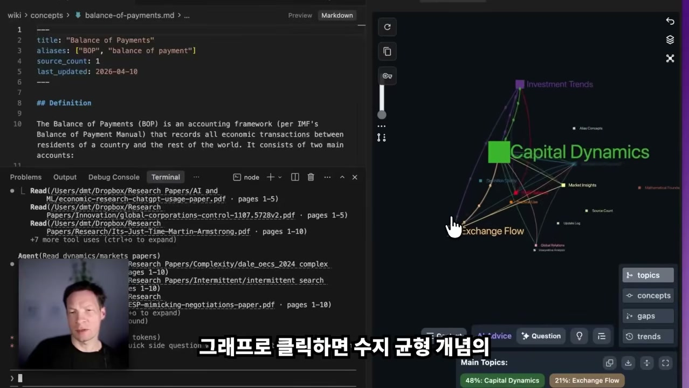

이 그림에서 화자는 한 가지를 발견한다. 돈과 금액에 관한 개념은 많은데, 회귀 분석(regression analysis)에 관한 건 별로 없다는 것이다. 그런데 회귀 분석은 그에게 매우 중요하다. 금융 데이터를 분석할 프레임워크가 될 부분이기 때문이다. 그러니 이 클러스터를 더 키워야 한다. **흥미로운 건, LLM이 지식을 쌓아 가는 그 과정이 그래프 위에서 실시간으로 보인다는 점이다.** 어디가 비었는지, 어떤 자료를 더 넣어 균형을 맞춰야 하는지가 눈에 들어온다.

그래서 갭으로 들어간다. 어느 주제들이 서로 잘 연결되지 않았는지를 보고, AI Advice 버튼을 누르면 일종의 정교한 프롬프트가 생성된다. 이걸 골라서 Claude에 다시 붙여 넣으면, Claude가 그 아이디어들을 어떻게 더 발전시킬 수 있는지를 한결 잘 이해한다. LLM이 위키를 만드는 그 순간에 무슨 일이 일어나는지를, 그림으로 또렷이 보면서 다룰 수 있는 것이다.

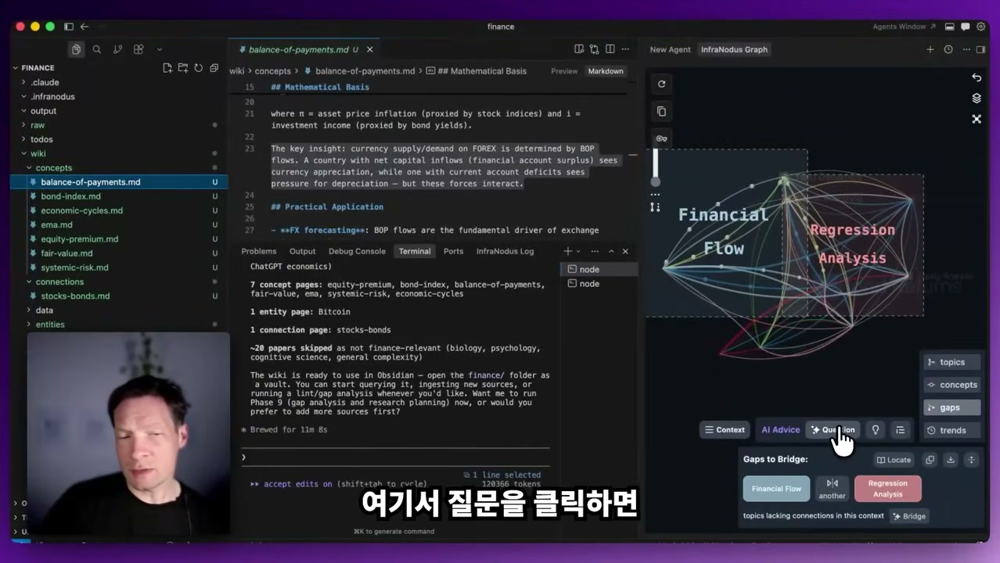

화자는 실제로 이 과정을 해 보인다. 금융 흐름과 회귀 분석이라는 두 갈래가 약하게 연결된 걸 골라, 질문을 클릭한다. 인프라노두스 로그가 그 두 클러스터의 그래프 구조를 담아 주고, 화자는 그걸 복사한다. 그런 다음 또 다른 터미널을 열어 Claude를 띄우고, 개념 폴더를 보며 이 두 클러스터를 어떻게 이을지 생각해 보라고 시킨다. 이때 인프라노두스 로그에서 가져온 그래프 구조를 영감으로 함께 건넨다. 이 구조적 정보가 LLM의 시선을, 비어 있는 갭으로 향하게 만든다.

그렇게 나온 연구 질문 하나가 화면에 뜬다. "임계 전이(critical transitions)와 시스템적 취약성(systemic fragility)이 BOP·FX 모델의 신뢰성에 어떻게 영향을 미치는가." 화자는 이 질문을 연구 페이지로 만들고, To-do 리스트에 넣는다. 나중에 직접, 또는 AI를 써서 더 파 보기 위해서다.

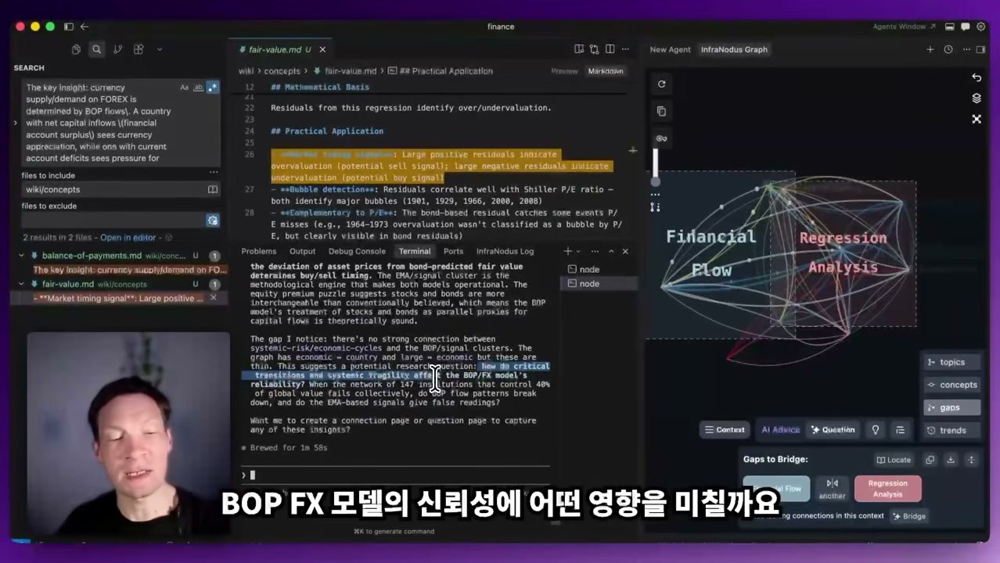

이 질문이 매력적인 이유를 화자는 이렇게 설명한다. 이건 아직 문헌에서 다뤄지지 않았지만, 문헌이 말하고 있는 주제들에 닿아 있는 질문이다. 기존 자료를 잘 쓸 수 있다는 걸 알면서도, 그 자료들을 새로운 방식으로 이어 붙여 새로운 무언가를 찾아낼 여지가 있다는 뜻이다. 갭이 곧 기회인 셈이다.

이 갭에서 질문으로 가는 길은 한 번 더 자동화된다. 위키가 다 차고 나면, "이 위키 전체에 갭 분석을 돌려라"라고 시킬 수 있다. 그러면 화자가 그래프에서 손으로 갭을 고르던 일을, 이번엔 Claude가 대신한다. 위키가 빨아들인 주요 개념들을 읽고, 인프라노두스 갭 분석 도구를 띄워, 클러스터가 더 잘 연결되고 새 아이디어가 나오도록 돕는다. MCP 서버를 통해 인프라노두스 분석을 위키 콘텐츠에 직접 연결해 구조적 갭을 찾아내는 것이다.

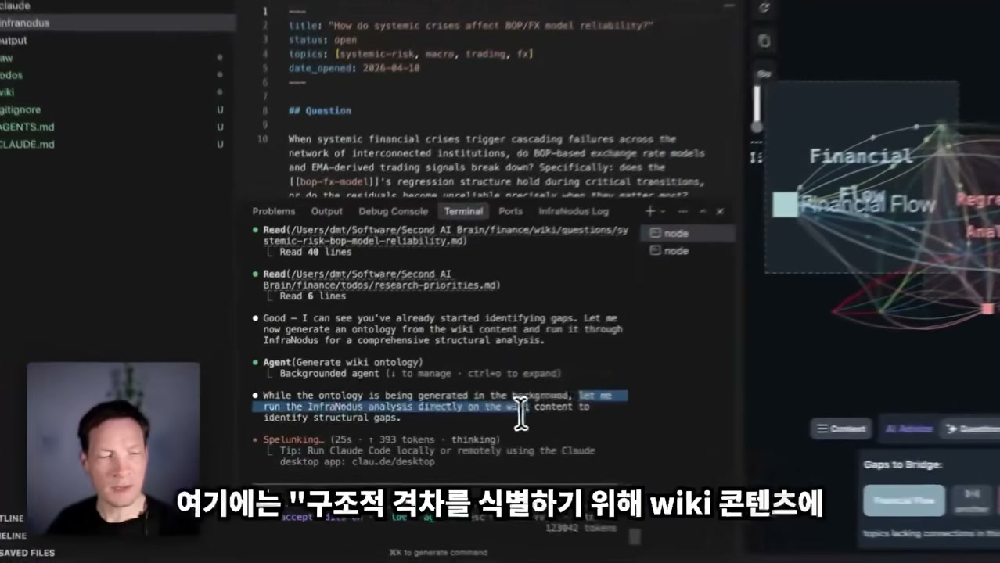

## 흔들리지 않는 지식을 향해

화자가 마지막에 강조하는 건 결과물의 질이다. 주요 토픽 클러스터를 찾고, 그 갭을 짚고, 갭을 모델에 넘기고, 그 갭이 더 잘 연결되어야 할 지점에 집중하게 만든다. 이 흐름을 거치면 얻는 인사이트가 훨씬 더 깊고, 훨씬 더 독창적이다. 그저 LLM에게 "새로운 생각을 내놓아라"고 했을 때 나오는 그럴듯한 답과는 결이 다르다.

화자의 연구 최종 결과물에는, 그가 발견해 to-do로 넣은 우선 질문들이 있고, 모든 주제의 아이디어를 잇는 온톨로지 인프라노두스 그래프가 있다. 이 위키를 통해 각각의 개념이 서로 연결되어 있어서, 다음에 이 폴더를 Claude Code나 다른 도구로 다룰 때 LLM은 위키 전체의 관계망을 타고 모든 아이디어에 접근할 수 있다. 그 결과 개념 하나하나를 더 정확히 이해하게 된다.

처음으로 돌아가 보면, 카르파티가 풀고 싶었던 건 매번 백지에서 시작하는 AI의 망각이었다. 화자가 더한 건, 그 위키를 단순한 저장고가 아니라 자기 빈틈을 스스로 드러내는 지도로 만드는 일이다. 지식 그래프가 어디가 비었는지 보여주고, 그 빈틈이 다음 질문이 되고, 그 질문이 다시 위키로 돌아와 자료를 채운다. 화자가 권하는 마무리는 담백하다. 스킬을 설정하고, 자기 프로젝트에서 자기 데이터로 테스트해 보라는 것. 그래서 어떤 인사이트가 나오는지 직접 확인하고, 잘 안 맞으면 스킬을 자기 작업에 맞게 고치라는 것이다.

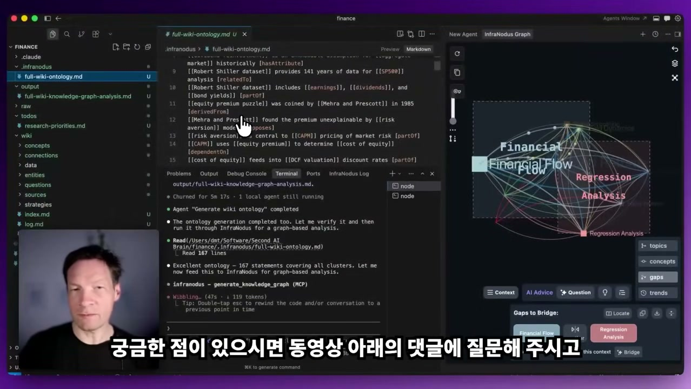
