LLM 위키를 한 번이라도 만들어 본 사람이라면 아마 비슷한 경험을 했을 것이다. 폴더를 만들고, 스키마를 짜고, 인제스트를 돌려 그럴듯하게 작동하는 시스템을 완성한다. 그런데 한두 달 뒤에 그걸 들여다보면, 더 이상 쓰지 않거나 그냥 지식의 무덤이 되어 있다. 브레인 트리니티의 브라이언은 이 현상을 한두 번 본 게 아니라고 말한다. 그가 보기에 사람들이 LLM 위키를 실패하는 방식은 늘 똑같다. 구조를 통째로 갈아엎는 것을 여러 번 반복한다는 것이다.

이 영상은 또 하나의 LLM 위키 구현법 강의가 아니다. 오히려 그 반대다. **구현법은 넘쳐나는데 정작 이걸 왜, 내 삶의 어디에 끼워야 하는지는 아무도 말해주지 않는다**는 문제의식에서 출발한다. 브라이언은 LLM 위키의 의미와 위치, 역할, 그리고 그것을 오래 유지하는 관점에 대한 자기 생각을 나누려고 이 영상을 찍었다고 말한다.

## 우리는 모두 자비스를 꿈꿨다

LLM 위키가 왜 이렇게 난리가 났을까. 브라이언은 그 뿌리를 아이언맨의 자비스에서 찾는다. 슈트 하나만 입고 있으면 내가 무엇을 좋아하는지, 지금 뭘 해야 하는지를 어느 순간에도 이해하고 있는 비서. 우리는 오랫동안 그런 자비스를 꿈꿔왔다.

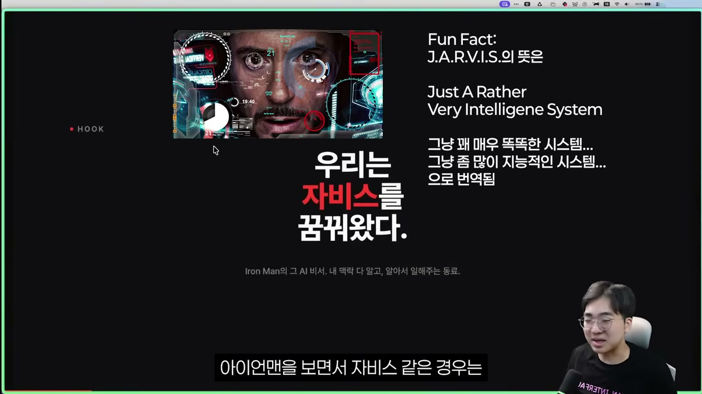

그리고 최근 들어 그 꿈이 갑자기 손에 잡힐 듯 가까워졌다. 클로드 코드뿐 아니라 오픈클로, 헤르메스 에이전트 같은 하네스 도구들이 인기를 끌고, 여기에 내 파일을 함께 연결하는 옵시디언과 LLM 위키 같은 방법론이 나오면서, 자비스가 가능성의 영역으로 들어온 시대가 된 것이다. 그래서 사람들이 LLM 위키에 환장하고 있다는 게 브라이언의 진단이다.

흥미로운 건 이 모든 열풍이 단 하나의 포스트에서 시작됐다는 점이다. 카파시가 X에 올린 글 하나가 2,100만 뷰를 찍었고, 그 뒤로 LLM 위키라는 것이 카파시의 GitHub 지스트 안에 문서 하나로 정리되었다.

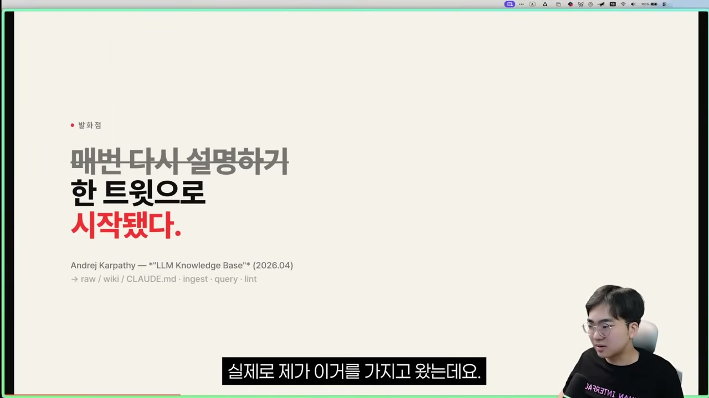

그런데 카파시는 구체적으로 자기가 이걸 어떻게 하는지를 전혀 보여주지 않았다. 문서 아래에는 이런 문장이 적혀 있다. "This document is intentionally abstract." 이 문서는 의도적으로 매우 추상적으로 남겨놨다는 뜻이다. 그래서 이 지스트는 정답이 적힌 매뉴얼이 아니라, "나는 이렇게 하고 있다", "이렇게 하는 게 맞는 것 같다"는 댓글이 쌓이는 일종의 성지순례 공간이 되었다.

빈칸이 의도적으로 비어 있으니, 사람들은 그 빈칸을 각자의 방식으로 채워 나갔다. 브라이언 자신도 그중 하나였고, 그 역시 자기만의 적용법을 영상으로 공개했다.

## 다들 똑같이 만들고, 다들 똑같이 그만둔다

문제는 그다음이다. 브라이언을 비롯한 크리에이터들의 영상을 보고 사람들이 따라 만든다. 로우 폴더를 만들고, 위키 폴더를 만들고, CLAUDE.md로 스키마를 정의하고, 인제스트 · 쿼리 · 린트 같은 스킬을 만든다. "어, 이거다" 하고 따라 했더니 실제로 작동도 한다.

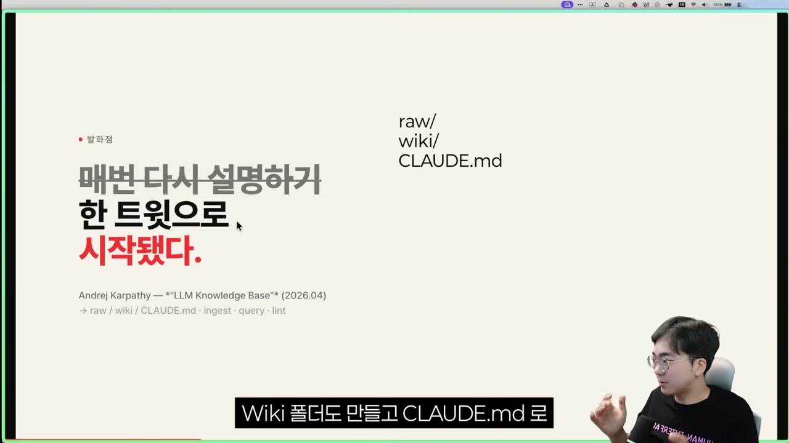

여기까지는 다 똑같다. 그리고 한두 달 뒤, 그 시스템은 방치된다. 브라이언이 이 실패를 단순히 "시스템을 잘못 만들어서"라고 보지 않는다는 게 핵심이다. 영상에 나오는 방법론은 대부분 잘 작동한다. 진짜 문제는 그 방법론들이 하나같이 같은 질문을 빼먹는다는 데 있다. 내가 만든 LLM 위키가 내 삶의 어디에 끼어들어가고, 어떤 역할을 해야 하는지를 아무도 다루지 않는 것이다.

그래서 브라이언은 단언한다. **그런 본질적인 고민 없이 목적 없이 시작하면, 아무리 시스템이 좋아도 한두 달 안에 실패할 수밖에 없다.**

그는 이 패턴이 LLM 위키만의 일이 아니라고 본다. 세컨드 브레인이라는 개념이 떠오르기 시작하던 4~5년 전, 제텔카스텐이 유행하던 시절에도 똑같았다. 개인지식관리라는 것은 결국 내 삶 전체를 정리하고 구조화하는 일인데, 시스템 바깥의 세상은 엄청나게 복잡하다. 평생 살아온 모든 것을 어떻게 한 번에 다 관리하겠는가. 여기에 완벽주의까지 더해진다. 시스템이 완벽하게 작동해야 한다는 생각에 모든 과거 문서, 모든 템플릿, 모든 시스템을 유지하려다 지쳐버린다.

브라이언은 이걸 마케팅 용어로 "소비되고 빨리 죽는" 유행에 빗댄다. 그가 든 예시는 두쫀쿠랑 탕후루다. 맛있어서 퍼지고, 사람들이 유행을 따라 사 먹어보고, 그리고 지금은 거의 찾아보기 힘들다. 왜 그렇게 열광했는지 목적은 분명하지 않았다. 맛있긴 했지만 그게 끝이었다. 목적 없이 시작된 LLM 위키도 똑같은 길을 갈 것이라는 게 그의 우려다.

## LLM 위키의 정체, 외부 지식의 얕은 컴파일

그렇다면 LLM 위키는 대체 무엇인가. 브라이언의 정의는 간결하다. **LLM 위키는 외부 지식의 얕은 컴파일이다.**

여기서 "외부 지식"이란 내 머릿속에서 내가 직접 프로세싱한 지식이 아니라, 바깥에 있는 정보와 지식들을 얕은 이해를 위해 모아놓은 것을 말한다. 세상의 수많은 지식을 로우 폴더에 원문 형태로 담아두고, 인제스트를 돌려 그 안의 요소들을 분해하고 연결해 위키로 정리한 뒤, AI가 그 위키를 이용해 답변한다.

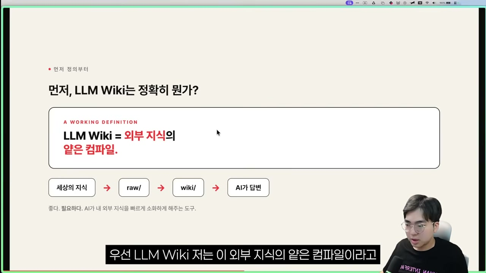

브라이언은 한 가지를 분명히 한다. LLM 위키가 얕은 지식만 담당해야 한다고 말하는 건 아니라는 것이다. 원래 LLM 위키의 목적은 오히려 그 반대에 가깝다. 인터넷의 수많은 지식을 AI가 잘 소화할 수 있는 형태로 깊게 분해해두고, 질의응답을 할 때 깊은 이해를 위해 활용하는 것. 다만 그가 던지는 질문은 현실적이다. "활용할 수 있다"와 "실제로 그렇게 활용한다"는 다르다는 것이다.

요즘 사람들은 자동화, 딸깍 한 번에 알아서 해주는 것에 끌린다. LLM 위키로 지식을 다 모아뒀더라도, 거기서 직접 질의하고 깊이 고민해 새로운 지식을 만들어내는 일을, 사람들은 생각보다 잘 하지 않을 것이다. 두뇌를 쓰는 건 귀찮은 일이기 때문이다. 그래서 실질적으로 LLM 위키가 담당하게 되는 건, 내가 직접 경험하고 깊게 고민한 게 아닌, 얕은 지식의 영역이라는 것이다.

이게 무력하다는 말은 아니다. 오히려 강력하다. 사람은 1만 개의 문서를 정리하지 못하지만 AI는 지치지 않고 한 번에 해낸다. 빠르고 대량으로 지식을 프로세싱해주는 능력은 분명히 필요하다.

## 새로운 인사이트는 여기서 나오지 않는다

그런데 바로 여기에 결정적인 한계가 있다. **새로운 인사이트는 LLM 위키에서 나오지 않는다.**

내가 직접 프로세싱하지 않고 이해하지도 않은 것들을 담아둔 LLM 위키는, 결국 외부인의 시선이고 AI의 관점이다. 그것이 못하는 일은 분명하다. 세상을 바꿔놓을 완전히 새로운 관점을 그 자체로 내놓지는 못한다. 남의 글, 남의 영상, 남의 텍스트이기 때문이다.

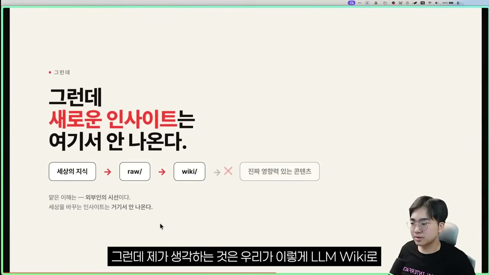

그래서 이 얕은 컴파일에는 반드시 더해줘야 하는 다른 한 축이 있다. 나의 경험, 내가 실제로 내린 판단, 나의 기록, 나의 일기. 내가 직접 경험하고 느껴서 기록해놓은 것들, 암묵지에 있던 것을 형식적으로 꺼내놓은 것들, 내 머릿속 지식을 꺼내 구조화한 것. 브라이언은 이것을 마이 노트라고 부르고, AI가 대체할 수 없는 사람의 영역이라고 못 박는다.

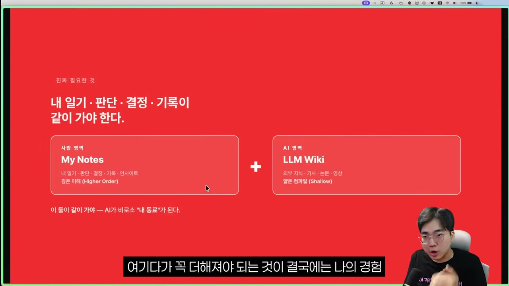

왼쪽에는 사람의 영역인 마이 노트, 오른쪽에는 AI의 영역인 LLM 위키. 이 둘이 같이 가야 비로소 AI가 내 동료가 된다. 브라이언이 늘 강조하는 표현이 여기서 나온다. 골드 인, 골드 아웃이다.

우리는 흔히 garbage in, garbage out이라고 말한다. 브라이언이 보기에 갈비지란, 나의 목적과 판단과 관점이 들어가지 않은 채 의미 없이 쌓이는 수집물이다. LLM 위키에 목적도 관점도 이해도 없이 데이터만 계속 쌓이면, 그건 골드가 아니라 갈비지다. 반대로 골드는 왼쪽 영역, 즉 내가 실제로 경험하고 느끼고 인사이트를 얻은 것들이다. 내 판단, 내 관점, 내 생각이라는 금덩이 데이터에 AI의 얕은 이해를 함께 넣어 활용하자는 것. 그래야 골드가 들어가서 골드가 나온다.

## 줌 아웃, LLM 위키가 들어갈 자리

여기까지가 LLM 위키의 정체와 한계에 대한 이야기였다. 이제 브라이언은 시점을 크게 끌어올린다. 내가 머릿속에서 만들고자 하는 AI 운영체제 전체 그림에서, LLM 위키가 어디에 들어가야 하는지를 보여주기 위해서다. 무언가를 만들고 나면 그게 삶의 어느 부분에 끼어드는지, 어떤 목적을 띠는지를 알아야 하고, 그걸 알면 매일 쓰게 된다는 것이다.

그가 이 전체 그림에 붙인 이름이 브레인 트리니티 시스템이다.

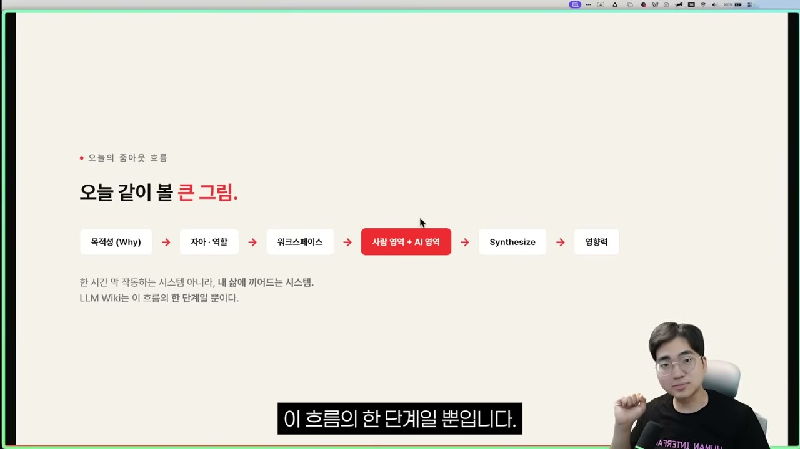

이 다이어그램을 위에서부터 하나씩 줌인해 보자. 먼저 미리 짚어둘 점이 있다. 이 전체 시스템에서 LLM 위키가 차지하는 부분은 아주 작고, AI가 들어가는 부분도 그 작은 일부뿐이라는 것이다.

### 맨 위, 철학(Polaris)

제일 위에는 나만의 철학이 있다. 브라이언은 이것을 북극성, 폴라리스라고 부른다. 내가 사람으로서 살아가는 이유와 방향이다. 한마디로 표현하기는 쉽지 않지만, 결국 나는 누구인가, 나는 왜 사는가, 무엇을 사랑하고 중요시하는가, 어디로 가는가, 어떻게 살 것인가 같은 질문들로 정리된다.

이 철학은 어떻게 발견하는가. 결국 기존의 경험들에서 시작된다. 현재를 기점으로 미래로 나아가면서 우리는 수많은 정보와 지식, 기회, 만남을 마주한다. 지금 이 영상을 보는 것도 하나의 만남이다. 그런 순간마다 무의식적으로 어떤 생각을 하고 감정을 느끼며, 그 감정이 또 다른 선택으로 이어진다. 내 삶에 영향을 끼친 중요한 선택들을 쭉 이어보면, 결국 내가 추구하는 삶의 방향성이 드러난다. 그것이 북극성이자 삶의 철학이다.

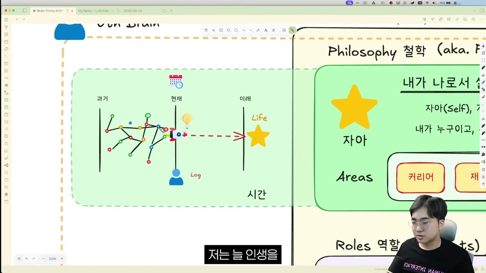

### 철학에서 역할로

그런데 이 자아, 이 방향성은 그 자체만으로는 아무런 효과가 없다. 자아를 실현하려면 24시간 365일이라는 한정된 시간을 쪼개 그 시간대마다 다양한 역할을 수행해야 한다. 브라이언은 이 역할들을 "나의 다양한 버전들"이라고 부른다. 같은 자아지만 다른 버전인 것이다.

그의 경우 낮에는 회사에서 AI 컨설턴트로, 밤과 주말에는 자기 생각을 공유하는 크리에이터로, 나머지 시간에는 가장으로, 그리고 박사 지원을 앞둔 연구자로 역할을 바꿔가며 자아를 실현한다. 각각의 역할에서 이룬 것들이 곧 자아를 실현하는 매개체다.

여기서 한 겹이 더 있다. 각 역할에는 궁극적으로 어떤 대상과 목표가 있다는 것이다. 가장으로서는 아내와 미래의 아이들이라는 대상이 있고, 그들의 행복과 평화와 안정을 책임지는 것이 목표다. AI 컨설턴트로서는 조직의 AI 트랜스포메이션을 돕는 것이, 크리에이터로서는 시청자의 지식관리 생산성을 개선하는 것이 목표다.

### 역할에서 액션으로, 그리고 지식으로

그 타인이라는 대상에게 목표를 실천하는 방법이 프로젝트와 태스크다. 이 영상 하나도 프로젝트일 수 있고, 그가 진행하는 온오프라인 프로그램들도 프로젝트다. 그것을 만들기 위한 다양한 태스크들까지 합쳐 브라이언은 액션이라고 부른다. 결국 우리는 역할을 통해 액션을 취하고, 그 액션으로 가치를 만들어 대상에게 목표를 실행한다.

그런데 프로젝트와 태스크 같은 액션은 그냥 되는 게 아니다. 거기에 재료가 되는 지식과 정보가 필요하다. 교과서일 수도, 기억일 수도, 산출물일 수도, AI일 수도 있다. 이렇게 해서 철학에서 시작한 구조가 역할, 액션을 거쳐 마침내 지식까지 4개의 계층으로 완성된다.

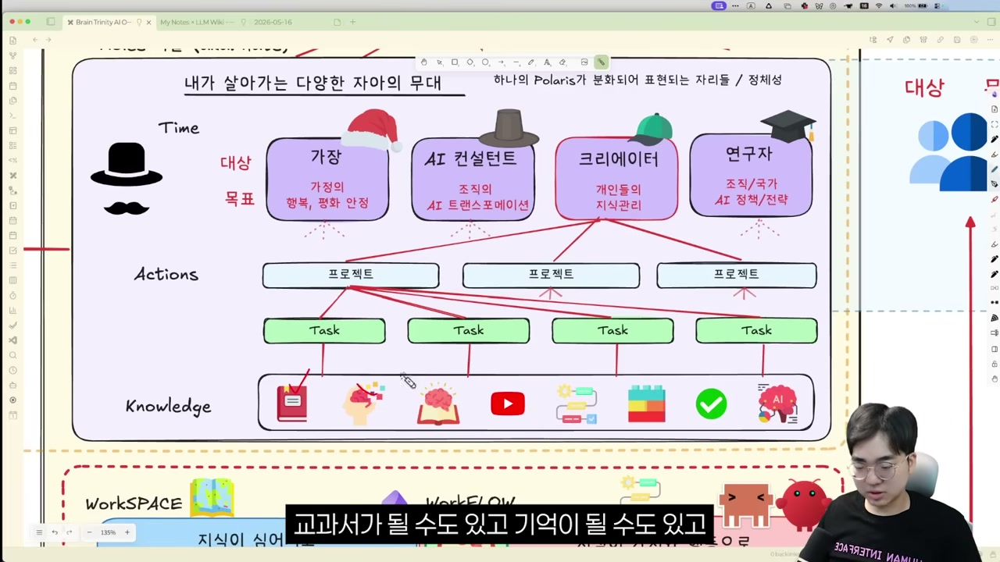

브라이언은 이 철학과 역할을 통틀어 "본질"이라고 부른다. 인간으로서 어떤 철학과 자아가 있고, 그 자아는 그 자체로 실현되지 않으므로, 한정된 인생의 시간을 역할로 나눠 액션을 취하고, 그 액션으로 대상에게 목표를 이룸으로써 자아를 실현한다. 여기까지가 목적에 대한 이야기다.

## AI OS, 그 목적이 실행되고 쌓이는 공간

목적이 정해졌으면, 그것이 실제로 실행되고 무언가 쌓이는 공간이 필요하다. 브라이언은 이것을 AI OS라고 부른다. 내 삶을, 그 목적을 운영하는 체제라는 뜻이다.

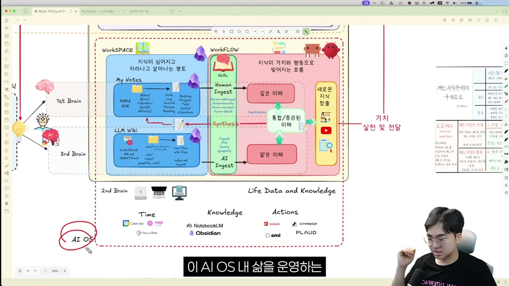

엄밀히 말하면 이 OS에 꼭 AI가 들어가야 하는 건 아니다. 목적을 실현하는 데 AI가 필수는 아니지만, 우리가 결국 추구하는 게 AI를 활용한 시스템이므로 AI OS라고 부른다는 것이다. 그리고 바로 이 안에 LLM 위키가 들어간다.

이 AI OS 안에서는 워크스페이스와 워크플로우가 작동한다. 워크스페이스는 지식이 심어지고 자라나는 영토, 즉 역할을 수행하며 쌓이는 경험과 지식들이 서로 연결되고 구조화되어 저장되는 나만의 공간이다. 워크플로우는 그 지식들을 토대로 작업이 일어나 새로운 가치가 실현되는 공간이다.

이 운영체제 안에는 두 주체가 있다. 사람이 작업하는 영역과 AI가 작업하는 영역이다. 브라이언은 이를 각각 퍼스트 브레인(사람)과 서드 브레인(AI)이라고 부른다. 그리고 이 워크스페이스와 워크플로우 전체가 곧 세컨드 브레인, 다시 말해 내 자아의 복제본이다. 그 세컨드 브레인을 운영하는 두 주체가 퍼스트 브레인과 서드 브레인인 것이다.

퍼스트 브레인인 사람은 세상의 바깥 지식을 수집해 기록하고 프로세싱한다. 서드 브레인인 AI 역시 수집하고 관리하고 프로세싱한다. 핵심은 그다음이다. AI가 한 얕은 이해와 내가 한 깊은 이해를 통합해, 증강된 이해로 발전시키는 것이다.

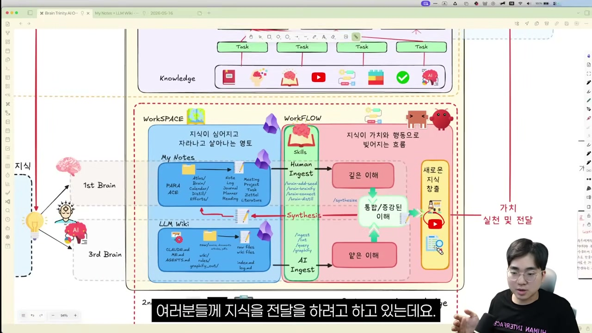

이렇게 통합된 이해는 다시 내 노트로 들어가 활용되거나, 영상 · 논문 · 프레젠테이션 같은 형태의 새로운 지식으로 나온다. 그 지식이 각 역할별 대상에게 전달되어 영향을 준다. 브라이언은 지금 이 영상 자체가 그 사례라고 말한다. 그가 개인지식관리에 대해 쌓아온 인사이트와 AI와 함께 수집한 자료들이 통합된 이해가 되어 영상이 되었고, 우리가 보는 건 그 껍데기라는 것이다.

## LLM 위키는 이 전체에서 작은 일부일 뿐이다

이제 다시 줌아웃하면, 브라이언이 처음부터 하고 싶었던 한 가지 메시지가 또렷해진다.

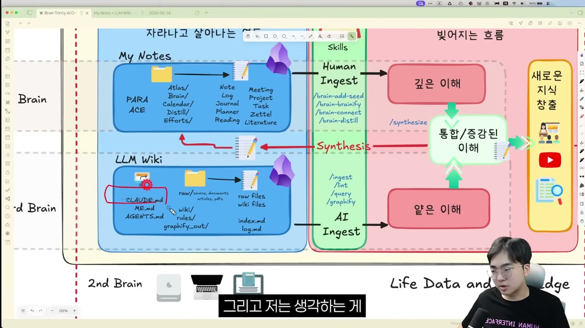

이 전체 운영체제에서 AI가 하는 일은 작은 부분이고, LLM 위키는 그중에서도 작은 일부다. 이 안에서도 CLAUDE.md로 스키마를 만들고, me.md처럼 나에 대해 알고 있는 자료들이 함축된 형태로 마이 노트와 함께 업데이트된다. 그런 부분들이 LLM 위키 안에 들어가 있어야 하긴 한다. 하지만 전체 목적을 따져보면, LLM 위키는 이 시스템에서 작은 자리를 차지할 뿐이다.

이 LLM 위키를 워크플로우에 어떻게 녹여 더 가치 있게 쓸지, 어떤 자동화나 크론 잡을 돌릴지는 각자가 개인적으로 정할 몫이다. 다만 브라이언이 거듭 강조하는 건 하나다. **LLM 위키가 내가 꿈꾸는 자비스 전체가 되는 게 아니라, 전체 AI OS 안의 일부가 되어야 한다는 것이다.**

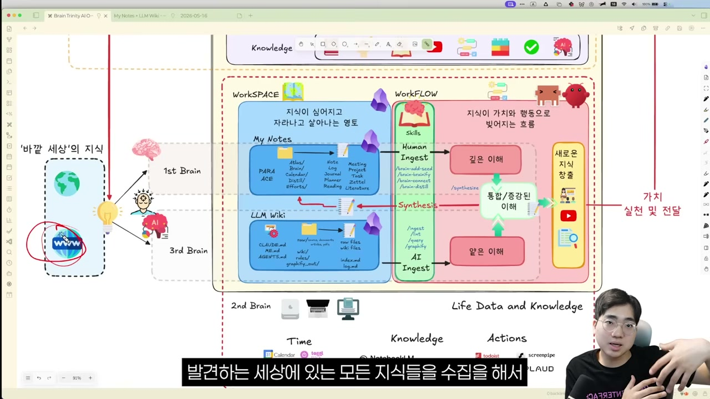

이 시스템 안에서 우리는 현실이든 인터넷이든 발견하는 모든 지식을 수집하고, 퍼스트 브레인과 서드 브레인이 서로 왔다 갔다 상호작용하며 각자의 역할을 한다. 그렇게 정보와 지식과 가치를 함께 만들어낸다. 결국 LLM 위키는 이 전체 시스템에서 얕은 이해를 담당하는 한 부분이며, 그것을 시스템에 녹여낼 때는 내 취향과 생각과 경험을 적은 마이 노트뿐 아니라 맨 위에 있던 나의 목적과도 연결되어야 한다.

그래서 이 영상은 LLM 위키를 만들지 말라는 이야기가 아니다. 만들되, 그것을 내 삶의 어느 부분에 끼울지를 함께 고민해 달라는 한 가지 메시지를 전하기 위한 것이다. 카파시가 빈칸으로 남겨둔 그 "intentionally abstract"를, 남의 구현법을 베끼는 것으로 채울지 아니면 내 목적으로 채울지. 한두 달 뒤에도 그 시스템을 쓰고 있을지 아닐지는, 어쩌면 거기서 갈린다.
