LLM 위키는 강력하다. 하지만 그것만으로는 충분하지 않다.

브레인 트리니티의 브라이언은 이전 영상에서 AI 워크스페이스 안에서 LLM 위키가 어디에 위치하는지에 대해 자기 의견을 밝힌 적이 있다. 그가 다시 꺼내든 구도는 단순하다. 실제로 경험하고 깊이 이해한 것을 적어두는 마이 노츠(My Notes), 그리고 그 반대편에 있는 외부 지식. LLM 위키는 이 외부 지식 쪽, 그중에서도 "얕은 지식"을 위한 공간이다. 내 고유한 생각이 아니라, 빠르게 재활용하고 일단 빠르게 소화시키고 싶은 자료들을 모아두는 자리다.

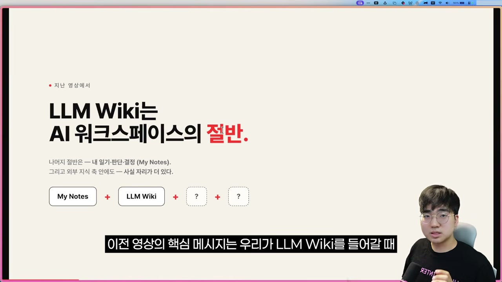

그런데 이 영상의 출발점은 이렇다. **외부 지식의 축은 LLM 위키 하나로 지탱되지 않는다. 두 자리가 더 필요하다.** 브라이언은 이걸 추상적으로 주장하지 않고, 자신이 실제로 겪는 세 가지 불편에서 끌어낸다.

## 세 가지 구멍

첫 번째 문제는 원본을 둘 곳이다. 옵시디언으로 오랫동안 개인 지식 관리를 해온 사람들은 대체로 마크다운 문서만, 그러니까 직접 입력했거나 한 번 가공해 정리한 메모만 그 안에 넣으려 한다. PDF나 이미지를 옵시디언에 그냥 넣어도 동작이야 하지만, 보통은 그렇게 하지 않는다. 이유는 용량이다. 옵시디언은 기본적으로 로컬이라 클라우드 동기화를 쓰려면 구글 드라이브나 드롭박스, 혹은 공식 옵시디언 싱크를 붙이게 되는데, 싱크는 월 4달러에 1기가, 월 10달러에 50기가 정도다. 마크다운 문서라면 문제될 게 없지만 PDF · PPT · 동영상을 넣기 시작하면 용량이 금방 찬다.

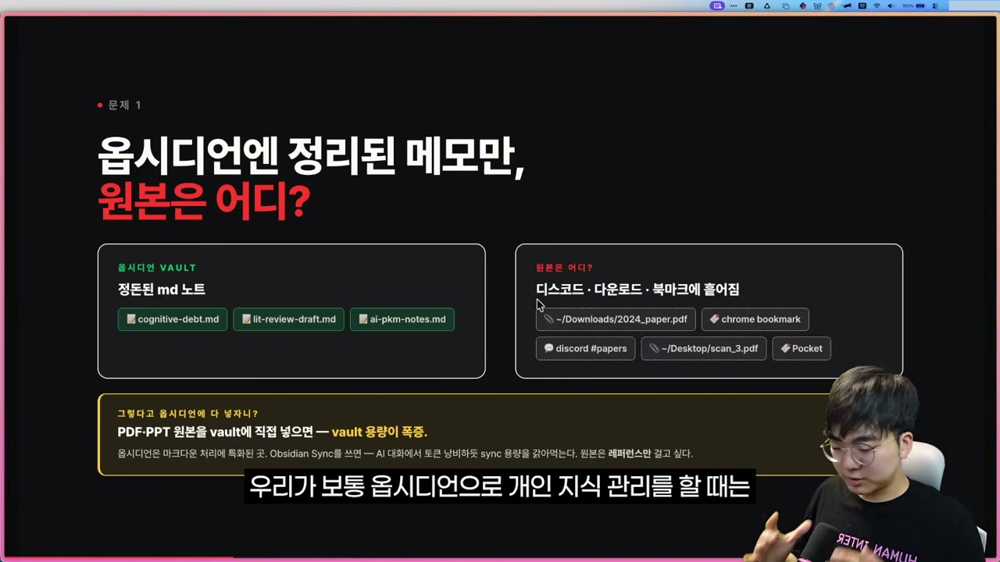

그래서 사람들은 원본을 옵시디언 바깥에 두고 다양한 방식으로 안쪽과 연결을 걸어둔다. 문제는 이게 귀찮다는 것. 그러다 보면 다운로드 폴더나 디스코드, 북마크 같은 데 흩어지면서 정리된 메모와 원본 파일 사이의 연결이 슬그머니 끊어진다.

두 번째 문제는 대화의 휘발성이다. 여러 소스를 한 대화창에 넣고 질의응답을 하면, 제한된 컨텍스트 윈도우 때문에 몇 번 물어보는 사이 모델의 기억이 흐려진다. 나중에 그 대화로 돌아오면 파일들의 위치를 다시 일러줘야 한다. 간단한 답 하나 얻고 끝낼 거라면 한 대화 안에서 파일 올리고 묻고 끝내도 된다. 하지만 브라이언의 표현대로, 진짜 공부와 연구는 그렇게 되지 않는다. 소스를 넣고 여러 번 물어보고, 그 답조차 여러 소스에서 끌어와야 하고, 시간이 지나 다시 돌아왔을 때 같은 자료가 또 쓰인다. 그러니 외부에서 긁어온 자료를 고정된 묶음으로 묶어두고, 시간을 두고 거듭 드나드는 연구용 작업 공간이 따로 필요하다.

세 번째 문제는 출처 추적이다. 답을 받긴 했는데, 그 답의 이 부분이 어느 문서 어느 페이지에서 왔는지를 계속 붙들고 있기가 쉽지 않다. 원본이 마크다운으로 옵시디언 안에 정리돼 있으면 그나마 낫지만, 외부 공간에 따로 저장했다면 옵시디언 안에 없으니 소스 연결을 유지하기가 어렵다.

세 문제는 결국 한 곳을 가리킨다. 외부 소스를 가져와 대화로 이리저리 소화하더라도, 그 원본을 지속적으로 추적하고, 담아두고, 재활용할 수 있는 공간이 있어야 한다는 것이다.

## 세 자리, 세 역할

브라이언이 내놓는 해법은 외부 지식의 축 안에 LLM 위키 말고 두 가지를 더 세우는 것이다. 조테로와 노트북LM. 핵심은 이 셋이 각자 다른 역할을 맡되 따로 놀지 않는다는 데 있다.

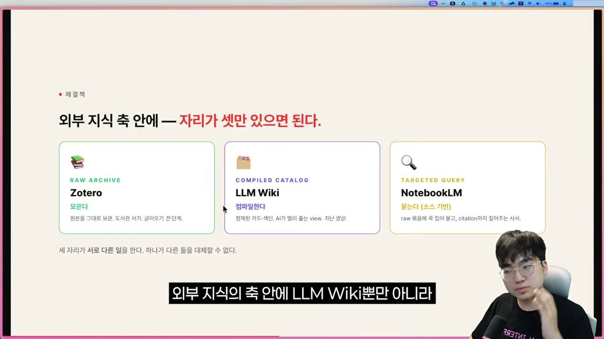

**조테로는 원본을 모으는 도서관이다.** 논문이든 동영상이든 보고서든, 외부에 있는 것들을 들여와 정리해두는 나만의 서가. 나중에 보고 싶은 것을 일단 쌓아두고, 그중에서 LLM 위키로 가공하고 싶은 것만 골라 꺼낸다. LLM 위키는 그 원본을 토대로 AI와 함께 1차 정제를 해서 카드 형태로 만드는 자리다. 그리고 노트북LM은 그 정제된 위키 중 일부만 콕 집어 집중적으로 질의응답을 하거나 결과물을 뽑아내는 자리다.

LLM 위키 자체에서도 슬래시 쿼리 스킬로 위키 전체를 대상으로 질문할 수 있다. 그런데 "특정한 소스들만 가지고 계속 질문하고 싶다"면, 그 일은 노트북LM이 더 잘 맞는다. 같은 외부 지식이라도 묻는 결이 다른 것이다.

여기서 브라이언이 두 도구를 끌어온 진짜 이유가 드러난다. 이 셋을 클로드 코드나 오픈AI 코덱스 같은 AI 하네스 하나에 모아 통합할 수 있다는 것. 옵시디언까지 연결하면 하나의 워크플로우가 된다. 떨어진 세 도구가 아니라, 한 자리에서 한 번에 묻고 활용할 수 있다는 점이 그가 꼽는 가장 강력한 포인트다.

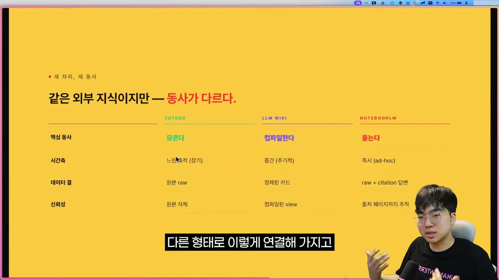

## 조테로를 클로드 코드에 붙이다

조테로는 학술 연구와 논문 작성에 쓰는 레퍼런스 매니저, 즉 서지관리 프로그램이다. 그런데 무료이고, 논문을 쓰지 않는 일반 사용자도 얼마든지 쓸 수 있다. 핵심은 소스 원문을 그대로 저장해두고, 나중에 그 소스가 어디서 왔는지 추적하고 관리하는 프로그램이라는 점이다. 앞에서 말한 첫 번째와 세 번째 구멍, 원본을 둘 곳과 출처 추적을 정확히 메우는 자리다.

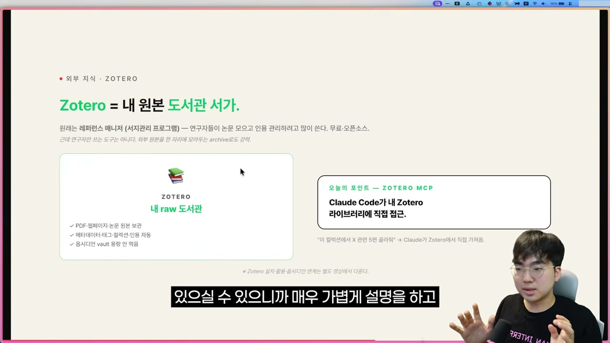

설치할 때 본체와 함께 꼭 깔아야 하는 것이 조테로 커넥터다. 이걸 쓰면 웹페이지에 있는 소스를 조테로로 가져오는 동시에 메타데이터까지 긁어온다. 브라이언이 거듭 강조하는 게 이 메타데이터인데, 나중에 클로드 코드로 질문하거나 워드 · 구글 독스로 문서를 쓸 때 결국 이 메타데이터로 원본과 연결되기 때문이다.

브라이언은 실제로 논문 하나를 커넥터로 긁어와 조테로의 마이 라이브러리에 저장한다. 더블클릭하면 PDF가 열리고, 하이라이트하거나 캡처할 수 있다. 이 하이라이트만 따로 빼서 정리할 수도 있다.

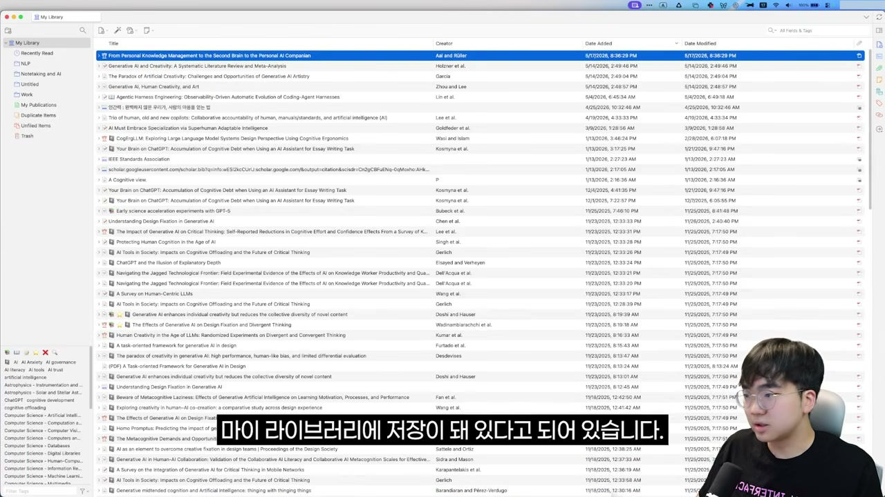

동영상도 가져온다. 그가 자주 보는 채널인 원더루트(표기 미확인)를 예로 드는데, 여기서 그는 조테로 커넥터로 가져오는 쪽과 LLM 위키로 가져오는 쪽을 비교한다. 옵시디언 웹 클리퍼는 영상의 트랜스크립트를 저장해주지만 메타데이터가 잘 안 잡힐 수 있고, 조테로 커넥터로 가져오면 웹페이지 원문이 영상 형태로 저장되면서 메타데이터까지 챙긴다.

자료를 저장했으면 이제 클로드 코드로 프로세싱할 차례다. 조테로를 클로드 코드에 연결하는 건 누군가 만들어둔 조테로 MCP로 한다. 설치는 단순하다. 깃허브 링크를 복사해 클로드 코드에 "이 사이트 설치해줘"라고 요청하면, 클로드가 조테로 MCP임을 알아보고 바로 가져온다.

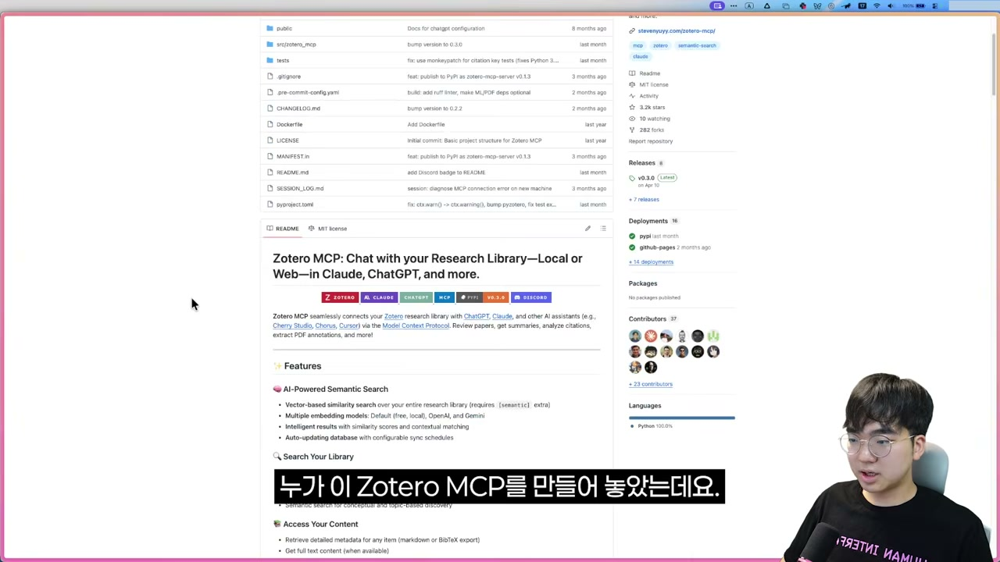

이 MCP를 통하면 조테로 안의 모든 것과 대화할 수 있다. 시맨틱 기반 검색은 물론이고, 메타데이터뿐 아니라 하이라이트와 전체 풀텍스트까지 끌어와 연결한다. 브라이언은 MCP를 깐 뒤 자기 LLM 위키 폴더 구조에 맞춰 스킬 세 개를 만들어 두었다. 조테로 인제스트(원문 · 요약 · 메타데이터를 마크다운 노트로), 조테로 서치(키워드나 리서치 퀘스천으로 논문 추천), 조테로 사이트(빕텍스 등 인용 내보내기). 그가 직접 만들어달라고 해서 나온 셋일 뿐, "조테로 MCP에서 뭘 할 수 있어?"라고 물으면 태그 검색, DOI로 추가, 라이브러리 생성 같은 더 많은 기능을 알려준다.

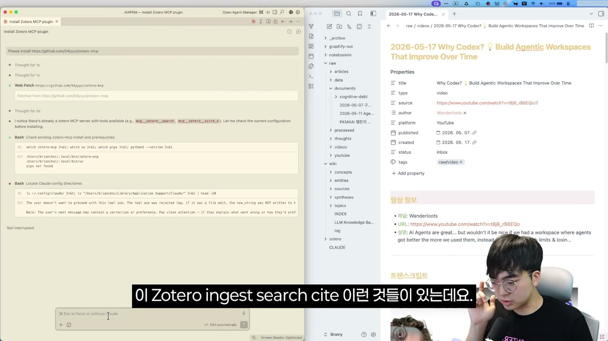

실제 동작은 이렇게 흐른다. "최근에 찾은 자료 중 ChatGPT와 개인 지식 관리를 위해 AI가 활용된 논문들을 모아 알려줘"라고 묻자, 클로드는 시맨틱 검색과 최근 추가 논문 가져오기를 함께 돌려 답을 찾는다. 그가 직접 넣은 노트바와 "How people manage their second brains" 같은 논문에 더해, 직접 넣지 않은 연관 자료까지 끌어온다. 거기서 "이것들로 조테로 컬렉션 하나 만들어줘"라고 하면 PKMxAI라는 컬렉션이 만들어지고, "인접한 논문들도 가져와줘"라고 하면 아홉 편 남짓이 따라락 추가된다.

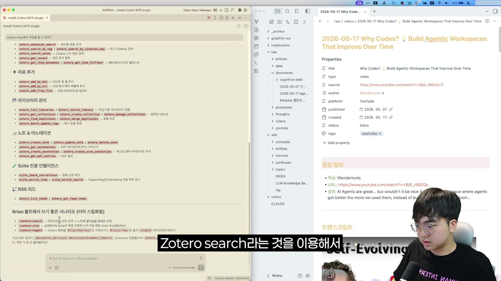

여기서 중요한 한 가지. 이렇게 컬렉션이 채워져도, 오른쪽에 메타데이터가 붙어 있기 때문에 논문 원문과 함께 다룰 수 있다는 점이다. 리터러처 리뷰를 부탁하거나 원본 텍스트를 대조하는 일이, 출처를 잃지 않은 채 가능해지는 것이다.

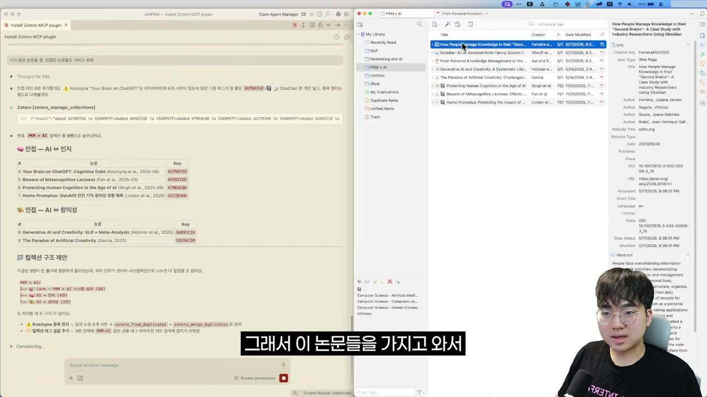

## 조테로에서 LLM 위키로

리터러처 리뷰는 조테로 안에서 보지 않는다. 브라이언은 이걸 다시 자기 LLM 위키로 가져온다. 조테로 인제스트 스킬에 "도큐먼트, 토픽 네임으로 하나 가져와줘"라고 요청하면, 토픽 네임이 PKMxAI인 논문들이 마크다운 형태로 옵시디언에 들어온다. 그의 볼트 이름은 "브레인이"다.

이때 토큰 소모를 의식해야 한다. 풀텍스트를 통째로 가져오면 양이 커지므로, 인제스트는 토큰을 쓴다는 걸 감안하고 진행한다. 가져온 노트에는 메타데이터, 어노테이션(하이라이트), 그리고 요약된 형태의 풀텍스트가 담긴다.

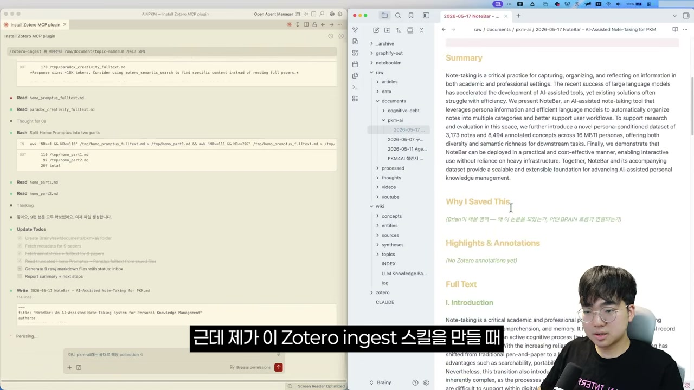

여기서 브라이언이 스킬을 만든 방식이 드러난다. 인제스트 노트에는 "Why I saved this"라는 섹션이 있는데, 이건 자동으로 채워지지 않고 비워둔다. 내가 이 자료를 왜 저장했는지, 어떤 부분이 인상 깊었는지를 직접 넣어야 한다는 뜻이다. 그는 이번엔 예시라 통과시키지만, 본래는 이렇게 하면 안 된다고 못 박는다. "원래 인제스트할 때는 내 목적을 하나하나 다 입력했다." 왜 가져왔는지, 어디서 인상 깊었는지를 디테일하게 적을수록 AI가 내 기준에 맞게 소화해준다는 것이다.

그리고 이 통합의 진짜 맛은, 조테로에서 온 것이든 인터넷에서 직접 받은 것이든 한 번에 인제스트할 수 있다는 데 있다. 그는 조테로 논문 원문과 비디오 폴더에 모아둔 자료를 함께 묶어 "AI와 개인 지식 관리가 어떻게 연결되고 있는지, 그 관점에서 소화시키고 싶어"라는 프롬프트로 한꺼번에 인제스트를 건다. 출처가 어디든 결국 옵시디언 안에서 한 번에 소화된다.

소화가 끝나면 지정한 소스들이 "AI와 PKM 커넥션 랜드스케이프" 같은 형태로 엮인다. 로컬 그래프를 열면 기존에 모아둔 소스들과 새 소스들이 그물처럼 연결된 모습이 보인다.

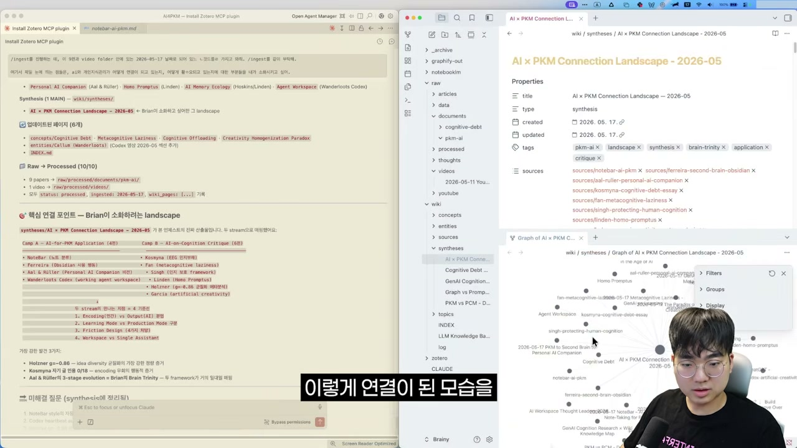

지식이 자동으로 연결되고 활용되는 것, 그게 애초에 LLM 위키를 쓰는 이유다. 나중에 이렇게 연결된 것들을 다시 활용하고 싶으면 슬래시 쿼리나 그래피파이(graphify) 같은 걸 쓰면 된다.

## 노트북LM까지 연결하다

조테로와 클로드 코드를 잇는 것까지가 1막이라면, 이 영상을 만든 궁극적인 이유는 노트북LM까지 연결하는 것이라고 브라이언은 말한다.

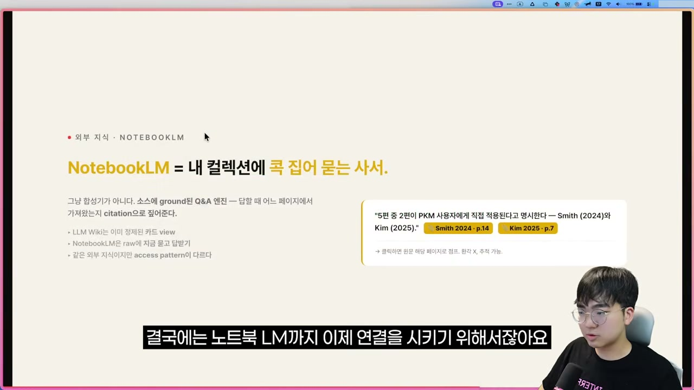

노트북LM은 구글이 만든 연구 · 공부용 도구다. 하나의 노트북 안에 여러 소스를 넣고, 그 소스들에 근거한 답을 받거나 팟캐스트 · 프레젠테이션 · 인포그래픽 같은 다양한 결과물을 뽑아낸다. 지금까지는 이 모든 걸 노트북LM 웹 안에서만 해야 했다. 그런데 노트북LM과 클로드 코드를 잇기 위한 노트북LM 엠시피를 누군가 만들어 두었다. 조테로 MCP와 똑같이, 깃허브 레포를 복사해 클로드 코드에 "설치해줘"라고 하면 된다.

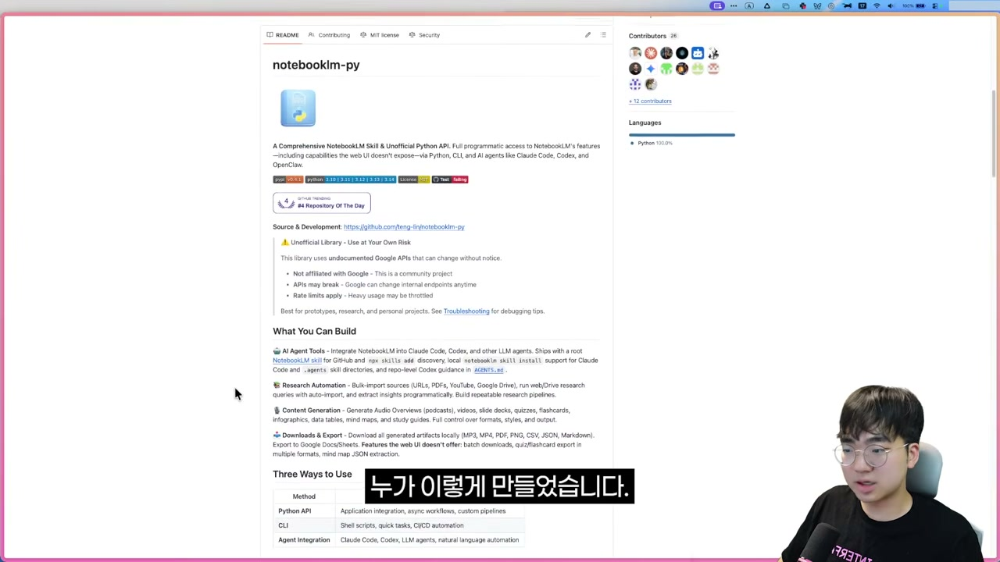

이 노트북 LM 파이의 좋은 점이 하나 있다. 일을 시킬 때 드는 토큰과 프로세싱이 클로드 코드가 아니라 제미나이 쪽에서 처리된다는 것이다. 그러니까 클로드 코드에서 노트북LM을 콜(call)하는 셈이라고 생각하면 된다.

연결한 뒤의 흐름은 간결하다. "지금까지 인제스트한 노트들과 원래 소스들을 바탕으로 노트북을 하나 만들어줘. PKMxAI Deep Dive라는 이름으로"라고 입력하면, 노트북LM 앱 안에 새 노트북이 생긴다. 그리고 조테로를 통해 LLM 위키에 모아둔 자료들이 그대로 그 안으로 올라간다.

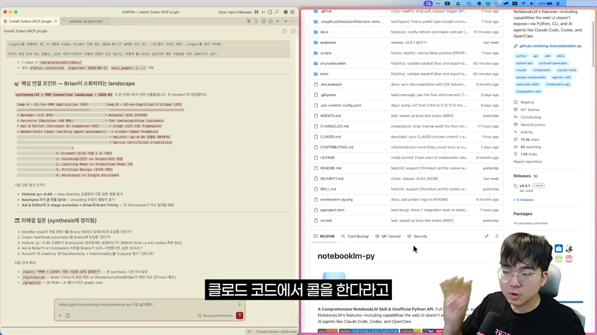

브라이언이 "너무 신기하다", "벌써부터 흥분했다"고 말하는 지점이 여기다. 보통 노트북LM을 만들면 소스를 구글 드라이브에서 가져오거나 딥리서치를 돌려 채워야 하는데, 그는 자기 LLM 위키 안에 있는 것들을 그대로 올리고 있다. 인제스트한 마크다운 노트뿐 아니라, 조테로에 있던 논문 원문 PDF까지 노트북 안으로 들어간다. 그가 추가 요청을 넣자 조테로 페이퍼들이 대기열에 올라가고, 구글 드라이브에 있던 조테로 PDF 원문들까지 하나둘 추가된다.

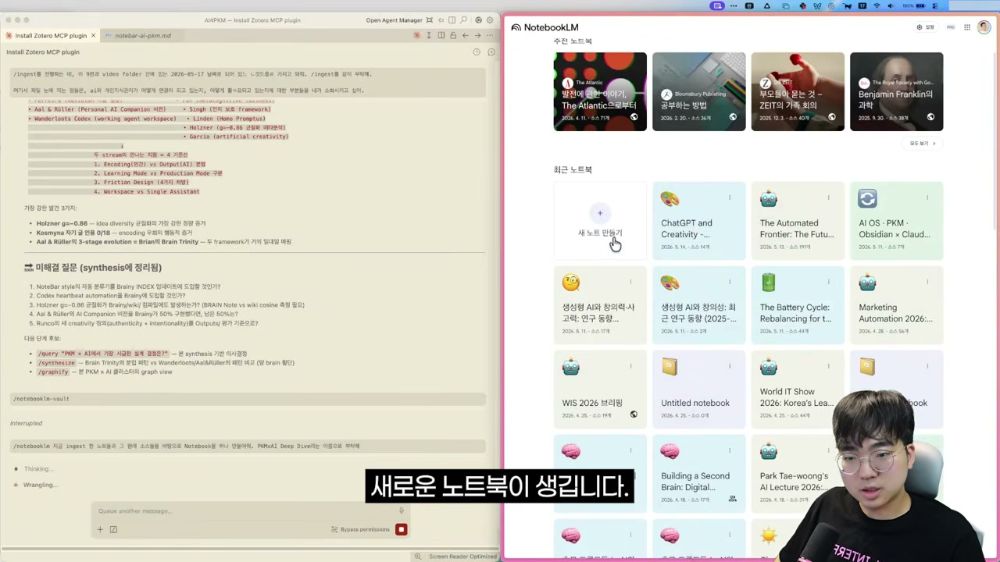

소스가 다 들어가면 그 노트북 안에서 자유롭게 대화해도 된다. 하지만 브라이언이 노트북LM을 쓰는 주된 이유는 아웃풋에 있다. 그는 인포그래픽을 하나 만들기로 한다. "인포그래픽을 만들어서 내 브레인이 안의 아웃풋 폴더에 추가해줘."

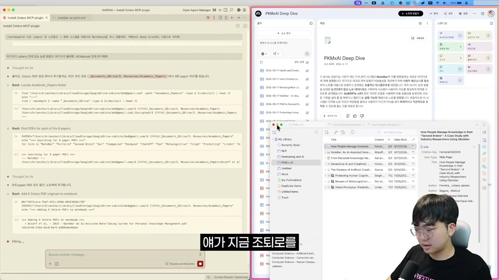

명령은 클로드 코드에서 들어가지만, 실제 생성은 노트북LM의 스튜디오 안에서 돈다. 클로드 코드에서 "인포그래픽 생성 중" 표시를 확인할 수 있고, 완료되면 그 결과물이 옵시디언에 저장된다. 이 두 가지가 핵심 장점이다. 명령은 클로드 코드에서, 결과는 옵시디언에. 노트북LM에 직접 들어갈 필요가 없어지는 것이다.

옵시디언 안에는 미리 만들어둔 노트북LM 아웃풋 폴더가 있고, 생성된 인포그래픽이 그 안으로 떨어진다. 두뇌 그림과 "서드 브레인" 같은 요소가 들어간 한 장이 완성된다.

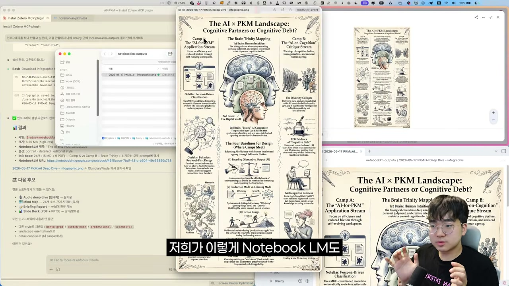

노트북LM을 옵시디언에서 통제할 수 있다는 말은, 사람들이 이미 잘 쓰고 있는 PDF · PPT 생성까지 프롬프트를 잘 짜서 확장할 수 있다는 뜻이다. 브라이언은 요즘 노트북LM으로 PPT를 잘 만드는 데 디자인.md를 잘 활용한다는 이야기를 흘려두며, 그런 것들도 같은 방식으로 끌어올 수 있다고 덧붙인다.

## 골드 인, 골드 아웃

브라이언이 이전 영상부터 반복해온 표현이 "골드 인, 골드 아웃"이다.

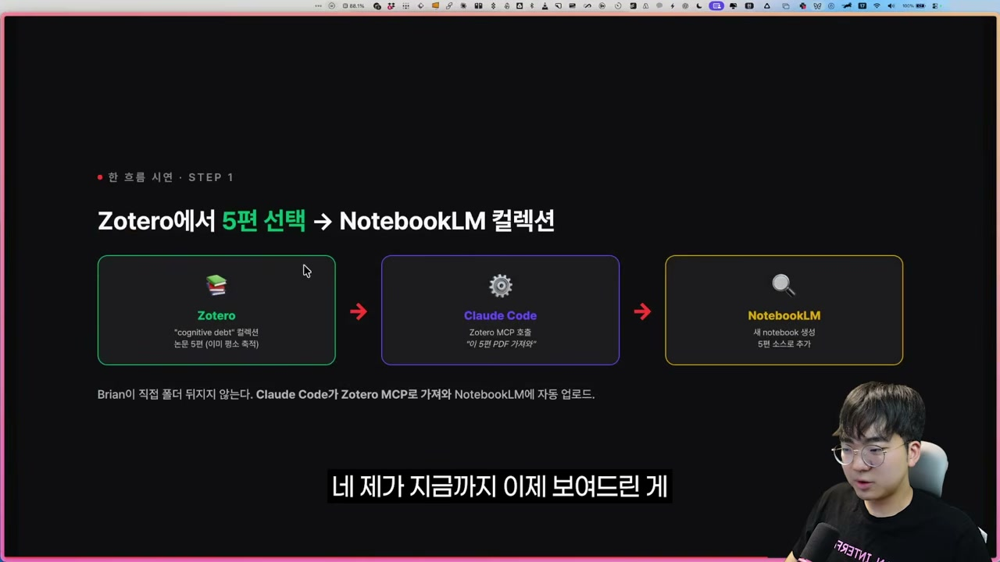

논점은 이렇다. LLM 위키를 그냥 컴파일해서 쓰는 데서 멈추지 않고, 조테로에서 원문 소스를 연결하고, 노트북LM에서 던진 질문들과 거기서 나온 아웃풋에 내 인사이트를 더해 위키를 다시 증강시키면, 외부 소스를 훨씬 잘 활용하게 된다는 것이다.

세 도구가 각자 잘하는 일은 분명하다. 조테로는 원본을 잃지 않게 붙들고, LLM 위키는 그걸 1차로 정제하고, 노트북LM은 고른 소스 위에서 묻고 만든다. 그런데 이 영상이 진짜로 말하는 건 도구 셋의 기능이 아니다. 클로드 코드라는 한 자리에서 이 셋과 옵시디언이 하나로 꿰어진다는 점, 그래서 외부에서 긁어온 원본이 흩어지지 않고 출처를 단 채 정제되고 결과물로 돌아온다는 점이다. 앞에서 짚은 세 개의 구멍, 원본의 자리 · 대화의 휘발성 · 출처 추적이 이 파이프라인 안에서 함께 메워진다.

그가 마지막에 남기는 당부도 같은 결이다. LLM 위키를 자세히 활용하는 것뿐 아니라, 다양한 소스를 조테로나 노트북LM 같은 것과 연결시켜 자기 지식을 증강하는 AI 워크스페이스를 만들어 가라는 것.
