"세컨드 브레인이 뭐냐"는 질문에, 커리어해커 알렉스는 거창한 정의 대신 그릇 이야기부터 꺼냈다. 모든 지식의 집합체이긴 한데, 어제 세미나에서도 했던 말처럼 그냥 그릇 같은 거라고. 다만 그 그릇이 보통 그릇이 아니라, 에이전트가 정보를 잘 꺼내 쓸 수 있게 만들어진 저장소이자 지식 창고라는 게 핵심이다. 영상은 이 한마디에서 출발해, 왜 요즘 실리콘밸리의 개발자들과 회사들이 너도나도 이걸 만들고 있는지를 두 시간 가까이 파고든다.

게스트로 나온 실밸개발자는 메타에서 4년을 일한 8년차 개발자이고, 요즘 유튜브에서 클로드 코드 강의로 한창 주목받고 있다. 그런데 이 사람이 영상 내내 취하는 자세가 흥미롭다. "저는 세컨브레인에 대해서 잘 모르고, 오늘 알렉스한테 이게 뭔지 배우고 저만의 세컨브레인을 같이 구축해보려고 왔다"고 대놓고 말한다. 전문가 대 전문가의 과시가 아니라, 한 명이 만든 걸 다른 한 명이 처음 보는 사람의 눈으로 계속 캐묻는 구조다. 그래서 이 대화는 정답을 가르치는 강의가 아니라, "이게 왜 좋은데?"와 "그래서 한계는 뭔데?"가 끊임없이 부딪치는 토론에 가깝다.

## 사람이 병목이다

알렉스가 세컨브레인을 만든 이유는 단순하다. 에이전트를 잘 쓰려면 결국 사람이 옆에서 계속 지도하고, 명령을 내리고, 프롬프트를 써야 한다. 그런데 바로 그 사람이 병목이 되어버렸다는 것이다. 사람은 24시간 대기할 수 없지만 에이전트는 할 수 있다. 그렇다면 내가 없어도 에이전트가 내 목표와 내 맥락을 이해해서 스스로 돌아가게 만들 수 없을까. 알렉스는 이 지점에서 아이언맨의 자비스를 끌어온다. 자비스가 사실 세컨브레인, 혹은 그 이상의 개념으로 이해되고 있는 것 같다고.

그가 꼽는 세컨브레인의 가장 큰 힘은 영구적인 저장소, 그러니까 영원한 기억력이다. 내가 없어도 나와 똑 닮은 맥락이 거기 있다면, 둘이 프로젝트를 하다 내가 휴가를 가더라도 동료가 그 뇌를 가진 에이전트에게 질문해 답을 얻을 수 있다. 말로만 들으면 추상적이라, 알렉스는 바로 시연에 들어간다.

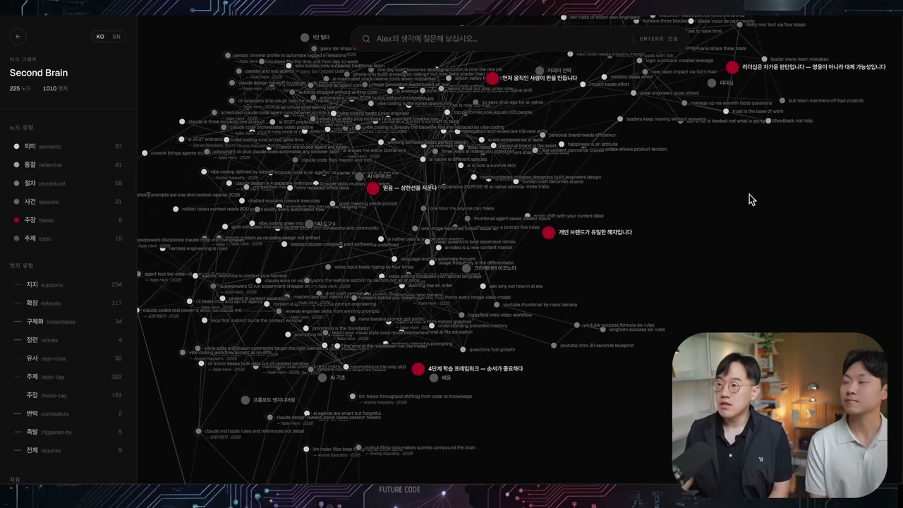

화면을 채운 건 점과 선이 얽힌 그래프다. 점 하나하나가 노드, 그것들을 잇는 게 엣지다. 알렉스는 이걸 "우리 뇌의 구조를 최대한 비슷하게 데이터화해서 자산으로 만든 것"이라고 설명한다. 실밸개발자가 여기에 자기가 아는 만큼을 보탠다. 방대한 자료를 있는 그대로 쌓아두는 게 아니라, 노드와 엣지로 구별해서 자료들 사이의 관계성을 이어주는 게 중요하다고. 그래야 에이전트가 이 지도를 빠르게, 정교하게 내비게이션할 수 있다는 것이다.

여기서 온톨로지라는 단어가 나온다. 알렉스는 이걸 정보의 개체와 관계성을 잘 구현하는 것이라고 푼다. 화면 왼쪽을 보면 생각, 통찰, 절차, 사건, 주장 같은 분류가 있고, 그 생각의 조각들이 서로 어떤 유형의 관계를 맺는지가 정의되어 있다. 어떤 건 다른 걸 지지하고, 어떤 건 확장하고, 어떤 건 유사하고, 어떤 건 반박한다. 단순히 메모를 모아두는 것과 이게 다른 지점이 바로 이 관계의 타입이다.

## 질문을 던지자 세 개의 층이 답했다

실밸개발자가 검색창에 묻는다. "알렉스의 세컨드브레인은 어떻게 만들어져 있는지 알려줄래?" 그러자 단순히 LLM이 그럴듯한 답을 지어내는 게 아니라, 알렉스가 그동안 해온 포스트와 유튜브, 직접 큐레이트한 자료를 기반으로 답이 나온다.

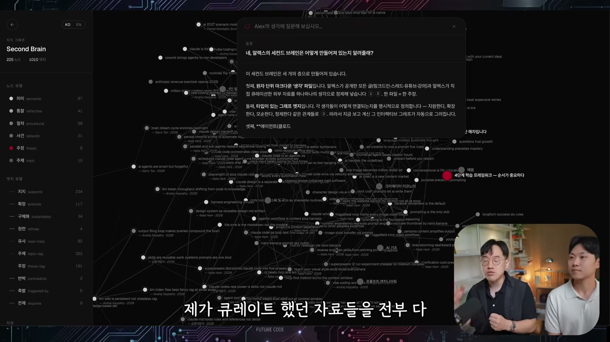

답변은 이 세컨브레인이 세 개의 층으로 되어 있다고 말한다. 첫째는 원자 단위의 마크다운 생각 파일, 그러니까 텍스트로 저장한 노트다. 둘째는 타입이 있는 그래프, 앞서 말한 온톨로지가 구현된 부분이다. 셋째는 에이전트, 즉 클로드 코드가 소스를 정제하고 기존 지식과 연결해 그래프를 스스로 만들어내는 층이다. 여기에 질의응답 기능까지 붙인 것이 알렉스의 세컨브레인이다.

알렉스는 이 구조의 원형이 안드레이 카파시가 올린 LLM 위키라고 밝힌다. 많은 사람이 이 LLM 위키와 옵시디언이라는 소프트웨어를 써서 그래프를 비교적 쉽게 만드는데, 자신은 거기서 조금 더 나아가 정형화된 디스틸레이션과 그래프 릴레이셔널 임베딩 같은 걸 구현했다고. 다만 오늘 함께 해볼 건 그보다 단순한 버전, 프롬프트를 복사 붙여넣기만 해도 충분히 구현되는 쪽이라고 미리 선을 긋는다.

이어 실밸개발자가 두 번째 질문을 던진다. "클로드 코드는 어떻게 잘 쓰는가." 그러자 알렉스 특유의 답변 스타일이 그대로 묻어 나온다. 그는 늘 답을 세 가지로 나눠 말하는 버릇이 있는데, 세컨브레인이 그것까지 픽업한 것이다.

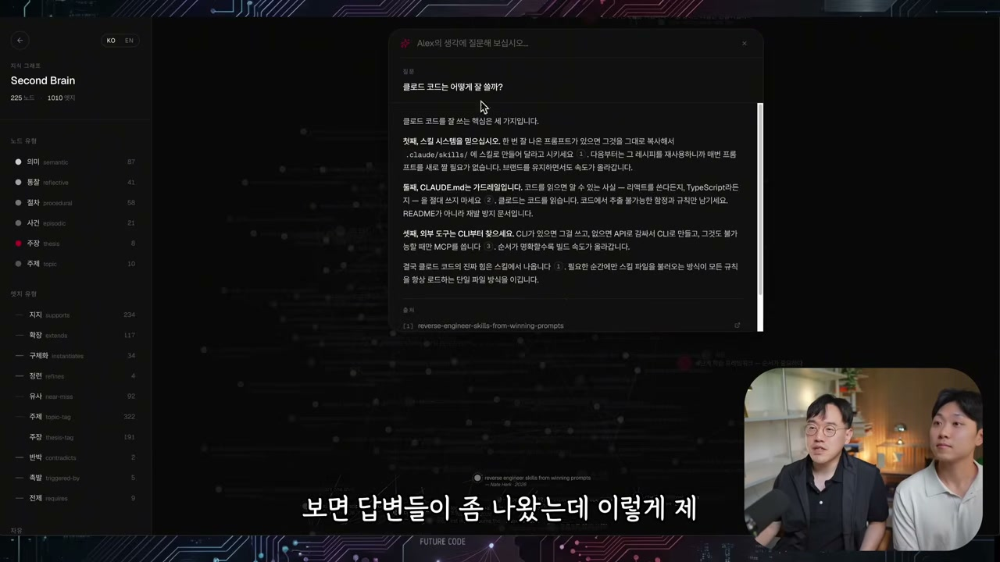

첫째는 스킬 시스템을 믿고 스킬을 잘 쓰라는 것, 둘째는 CLAUDE.md가 가드레일이라는 것, 셋째는 MCP와 CLI를 쓰라는 것. 알렉스는 이게 하네스 엔지니어링 이야기라고 짚는다. 그런데 답변에는 출처까지 붙어 있다. "안드레이 카파시가 알려준 CLAUDE.md의 비밀" 같은 실밸개발자의 유튜브 영상을 지식 창고에 넣어둔 덕분이다. 알렉스는 이 출처 표기를 두고 두 가지를 짚는다. 하나는 인플루언서의 역할이 바뀐다는 것. 더 알고 싶은 사람은 출처를 따라가 원본을 배울 수 있으니까. 다른 하나는 이게 **할루시네이션을 막아주는 장치**라는 것이다. 클로드에게 그냥 물으면 그 답을 얼마나 신뢰해야 할지 감이 안 오지만, 출처가 나오면 신뢰의 근거가 생긴다.

실밸개발자가 여기에 공감하며 자기 경험을 보탠다. 좋은 유튜브나 글, 정보를 일단 저장해두는데 볼 시간이 없어서 못 본다고. 자기도 다운로드한 유튜브만 50개가 넘지만 다 보지는 못한다. 세컨브레인은 그렇게 쌓아둔 것들을 필요할 때 구조화해서 꺼내 쓰게 해준다.

## 나를 복제하고, 내 취향을 닮는다

알렉스가 이걸 만든 진짜 이유로 넘어간다. 첫째는 자기를 대체하는 서비스를 만들고 싶었다는 것. 구독자들이 던지는 질문이 너무 많은데 일일이 답할 여건이 안 된다. 답을 안 하느니, 자기 생각을 닮은 지식 시스템에 직접 질문할 수 있게 해주면 어떨까. 실제로 "2026년에 AI 네이티브가 되려면 뭘 배워야 하나" 같은 질문을 던지자, 세컨브레인은 알렉스가 강의와 스레드에서 실제로 했던 말을 그대로 가져와 답한다. AI 네이티브란 AI가 거의 모든 일을 해낼 수 있다고 진심으로 믿고, 자신도 모든 도구를 최대치로 끌어다 쓰는 사람이라는 정의처럼.

둘째 이유가 더 미묘하다. 바로 감각, 테이스트다. 알렉스는 새 포스트를 쓸 때 생각은 많은데 그걸 글로 표현하는 게 쉽지 않을 때가 있다고 털어놓는다. 그런데 자기 스타일과 톤을 지식 창고에 넣어두면, 콘텐츠를 만드는 데서도 더 잘 활용할 수 있지 않을까. 실제로 "이 세컨드 브레인이 왜 중요한지 새로운 스레드 포스트를 하나 만들어줘, 내 최근 포스트도 참고해서"라고 시키자, 시스템이 메모리에서 그의 보이스를 읽고 그가 써둔 스레드를 참고해 글을 뽑아낸다.

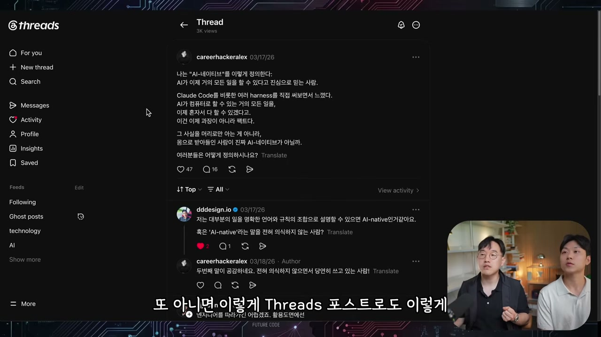

여기서 대화는 잠깐 무거워진다. 실밸개발자가 날카로운 질문을 던지기 때문이다. 이걸 서비스로 공개하면, 누군가는 알렉스의 톤과 스타일대로 스레드를 만들어 그 사람인 척 행세할 수 있지 않겠냐고. AI가 흔해진 시대라 남의 아이디어와 스타일, 보이스를 카피하고 활용하는 일이 너무 쉬워졌다.

알렉스는 자기가 겪은 일화로 답한다. 최근에 누군가 그의 음성을 카피해 쇼츠 내레이션을 만들었고, 사람들이 그걸 알렉스의 부계정인가 하고 제보까지 해줬다는 것이다. 강아지가 왜 항상 웃고 있을까를 설명하는, 사모예드 스마일을 다루는 쇼츠였다. 직접 들어본 그는 "제 목소리보다 더 제 목소리 같다"고 말한다. 요즘 보이스 카피는 3분이면 된다. 다행히 사기로 이어지진 않았지만, 누군가 이걸 악용해 비방이나 안 좋은 얘기를 하는 데 쓴다면 충분히 문제가 될 수 있다.

그런데 알렉스의 결론은 비관이 아니다. 그런 일이 쉽다고 해서 **내 가치가 변하는 건 아니다**라는 쪽이다. 그가 앞으로 중요해질 거라 보는 건 라이브다. 자기도 분명히 믿는 이야기지만, 라이브는 카피를 못한다는 송길영 박사 얘기를 유튜브에서 봤다며 끌어온다. 즉석에서 질문을 받고 대처하고 소통하는 능력은 복제되지 않으니, 그런 콘텐츠가 더 귀해진다는 것이다. 카피가 쉬워질수록, 내가 가질 수 있는 엣지와 차별성을 놓치지 않는 게 오히려 더 중요해진다.

## 같은 모델, 같은 질문, 그런데 다른 답

영상의 가장 인상적인 대목은 세컨브레인이 직접 쓴 글이 화면에 떠오를 때다. AI 시대에 왜 세컨브레인이 필요한지를 그것이 알렉스의 목소리로 풀어낸다.

> 처음 이 얘기를 꺼냈을 때 이런 질문도 많이 받았다. 메모앱이랑 뭐가 다르냐, 그걸 굳이 왜 만드냐. 나도 만들면서 자문했다. 그런데 지난 몇 달간 AI를 쓰면서 확실해진 게 있다. 모델은 다 똑같고, 모두가 ChatGPT를 쓰지만, 같은 질문이 오면 같은 답이 나온다. 그래서 AI를 쓴다는 건 더 이상 차별점이 아니다.

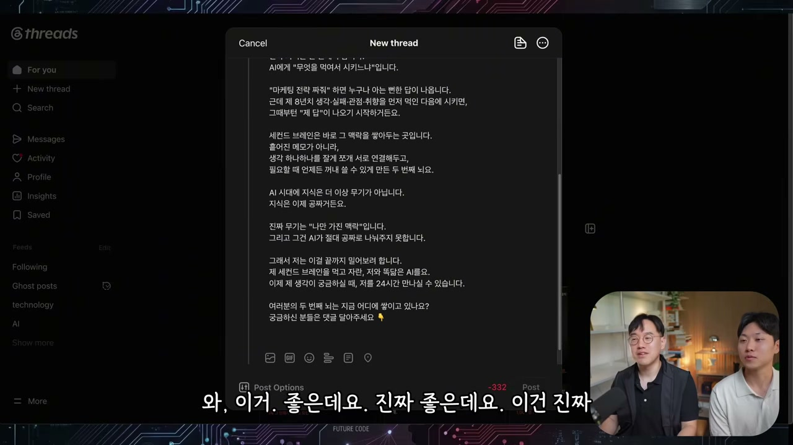

진짜 차이는 한 군데에서 난다고 글은 말한다. 무엇을 먹여서 시키느냐다. "마케팅 전략 짜줘" 하면 누구나 뻔한 답을 받지만, 8년치 생각과 실패와 관점과 취향을 먼저 확인하고 시키면 내 답이 나오기 시작한다. 세컨브레인은 바로 그 맥락을 쌓아두는 곳이다. 흩어진 메모가 아니라, 생각 하나하나를 잘게 쪼개 서로 연결하고 필요할 때 꺼낼 수 있게 만든 두 번째 뇌. 그래서 글은 이렇게 못 박는다. AI 시대의 지식은 더 이상 무기가 아니다. 지식은 이제 공짜다. **진짜 무기는 나만 가진 맥락이고, 이건 AI가 절대 공짜로 나눠주지 못한다.**

이 글을 읽은 두 사람의 반응이 그대로 자막에 남아 있다. "이건 진짜 잘 썼다", "기가 막힌데요", "이건 진짜 놀랍네요". 알렉스는 이걸 그대로 바로 올리겠다고 말한다. 그러면서 같은 글을 맥락 없는 일반 ChatGPT에도 시켜본다. 비슷하게 나오긴 하지만, "진짜 무기는 나만 가진 맥락" 같은 핵심이 거기서는 잘 안 읽힌다고 알렉스는 짚는다. 이 차이가 바로 컨텍스트가 얼마나 중요한지를 보여주는 증거다.

이 비교는 모델을 골라 쓰는 시대에 대한 이야기로 이어진다. 지금은 클로드와 GPT를 주로 쓰지만, 모델들이 이미 상향평준화됐고 앞으로는 일마다 모델을 골라 쓰는 시대가 온다. 실밸개발자가 정리한다. 그럴 때 제일 중요한 건 모델마다 컨텍스트를 어떻게 잘 먹이느냐인데, 그게 바로 세컨브레인이라고. 모델을 바꿔도 뇌는 똑같이 존재하니까. 알렉스가 영구 메모리 이야기로 받는다. 자기는 ChatGPT에 채팅을 엄청 많이 해서 어느 정도 자기를 알지만, 내일 새 모델이 나오면 그 맥락을 그대로 가져갈 수 없다. 세컨브레인을 만들어두면 클로드에도 ChatGPT에도 연결할 수 있으니, 나의 엣지를 계속 가져가려면 이게 꼭 필요하다는 것이다.

## 하네스가 알아서 쌓이는 시대가 와도

대화는 자연스럽게 하네스 엔지니어링으로 넘어간다. 실밸개발자는 이걸 일관성, 맥락, 규칙, 규율로 본다. 모델이 이상한 짓을 하지 않고 내가 원하는 대로 답을 주게끔 규칙을 나열하는 것. 그런데 그는 한 발 더 나간다. 내 뇌 구조와 생각들을 이렇게 모아두는 것 자체가 곧 하네스 엔지니어링이 되는 게 아니냐고.

두 사람은 흥미로운 미래를 함께 그린다. 모델이 너무 좋아지면서, 결국 모델이 본인의 하네스를 어느 정도 스스로 만들어내는 시대가 온다는 것이다. 실밸개발자가 요즘 핫한 루프라는 스킬을 언급한다. 원샷 프롬프트로 끝까지 굴러가게 만드는 그 방식이 에이전트의 끝판왕 같다고. 그렇게 하네스를 우리가 거의 구축하지 않아도 되는 때가 오더라도, 그때 가장 중요해지는 게 바로 세컨브레인이다. 아무리 모델이 하네스를 잘 만들어도, 나에 대한 정보는 만들 수가 없기 때문이다. 웹에서 긁어올 순 있겠지만 너무 비효율적이고. 결국 세컨브레인을 잘 구축한 사람과 안 한 사람, 그런 회사와 그렇지 않은 회사 사이의 격차가 크게 벌어진다는 것이 두 사람의 전망이다.

알렉스가 이 흐름을 한 문장으로 정리한다. 앞으로는 중간 과정에서 결과물을 다듬는 것보다, 어떤 문제를 왜 푸는지가 더 중요해진다고. 그러려면 맥락이 필요하고, 그 맥락을 누가 더 잘 쌓아놨느냐가 핵심이 된다. 맥락이 충분하면 에이전트에게 그냥 던지면 된다. "우리가 뭐 하는지 알지? 가서 사업 만들어 와." 맥락이 없을 때 만드는 것과는 천지 차이라는 것이다.

여기서 실밸개발자가 변화 하나를 짚는다. 예전엔 클로드나 GPT에게 물어본 뒤 우리 스타일대로 많이 고쳐야 했는데, 요즘엔 세컨브레인으로 나온 걸 거의 바로 쓸 수 있다고. 중간 단계 하나가 사라진 셈이다. 알렉스가 받는다. 돌려 깎기가 줄어든 건, 이미 다 깎아놨기 때문이라고. 그게 결국 하네스라는 것이다.

## 잘 만들었는지는 어떻게 아는가

이걸 잘 만들었다는 건 무엇으로 판단할까. 알렉스는 이밸(eval), 즉 평가를 꺼낸다. 질문을 던지고 그 답을 보고 평가하는 것이다. "이 답은 내 생각이 잘 반영이 안 됐네" 싶으면 왜 안 됐는지, 검색기를 바꿀지 같은 걸 조정한다. 알렉스는 구독자들이 주는 질문을 매일 검증한다고 했다. 답변을 보고 "이건 이렇게 답했어야지, 왜 그랬어" 하면 클로드가 알아서 해결해주고, 그렇게 이밸 벤치마크도 만든다.

그런데 코드의 테스트와는 결정적으로 다른 지점이 있다. 코드는 답이 정해져 있다. 이 로직은 무조건 이 답이 나와야 한다는 결정론적 성격이 코드의 장점이었다. 하지만 LLM은 다르다. 그래서 이밸은 사실 정해진 답이 없다. 답변에 대한 답은 알렉스 자신만 안다. 그의 느낌, 바이브 테스트로 가는 것이다. 결국 **취향을 얼마나 잘 맞춰가는가가 이밸의 목적지**라는 결론에 둘은 도달한다. 테이스트란 사람들이 실제로 썼을 때 좋은 경험을 주는 것, UI와 UX의 다음 단계 같은 것이다. 그리고 세컨브레인은 바로 그 취향과 맥락과 스타일에 완전히 포커스되어 있으니, 그런 걸 더 잘할 수 있다.

## 처음 만져보는 사람의 손으로 직접

여기까지가 알렉스의 완성된 세컨브레인 투어였다. 그는 자신이 이걸 어떻게 만들었는지 아예 웹사이트로 정리해 올렸다고 공개한다.

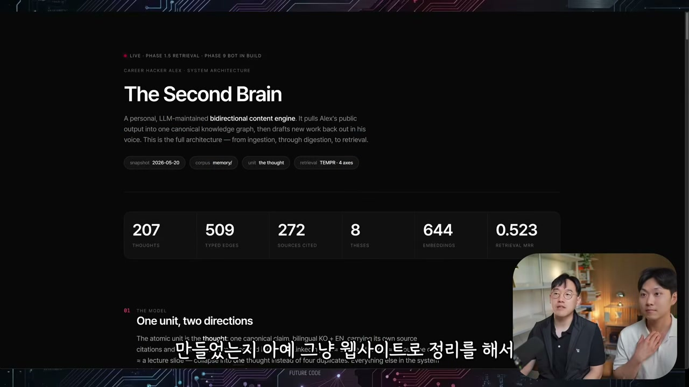

뿌리는 게 맞는지 고민을 많이 했지만, 어차피 찾으면 다 되는 시대라 공개하기로 했다고. 클로드에게 이 페이지를 복사해 붙여넣고 "알렉스라는 사람은 이렇게 했다더라, 너가 알아서 만들어봐" 하면 된다는 것이다. 그리고 영상은 2부로 넘어간다. 옵시디언이 처음이라는 실밸개발자가, 직접 자기 유튜브용 세컨브레인을 만들어보는 실습이다.

실밸개발자에게는 이미 동기가 있었다. 유튜브를 클로드와 함께 할 때마다 매번 프로젝트의 대본과 썸네일 아이디어를 다 읽혀서 새 계획을 세우게 하는데, 그걸 계속 반복해야 한다는 게 문제였다. 최근 패스트캠퍼스 강의를 만들 때도 유튜브 대본과 아이디어를 크로스 레퍼런스할 일이 많았는데, 프로젝트별로 흩어져 있어 불편했다. 한 군데 모아둘 세컨브레인이 필요했던 것이다.

시작은 GitHub다. 실밸개발자가 미리 유튜브 영상 자료 몇 개를 깃헙에 올려뒀다. 비유를 먼저 꺼낸 건 실밸개발자다. 깃헙이 구글 드라이브 같은 저장 공간 아니냐고, 거기 올려둔 유튜브 스크립트를 다운로드하는 거 아니냐고 정리하자, 알렉스가 받아 보충한다. 맞다고, 개발자들의 코드와 자료가 모여 있는 곳이라고. 그 저장소를 클로드 코드에게 시켜 클론한다.

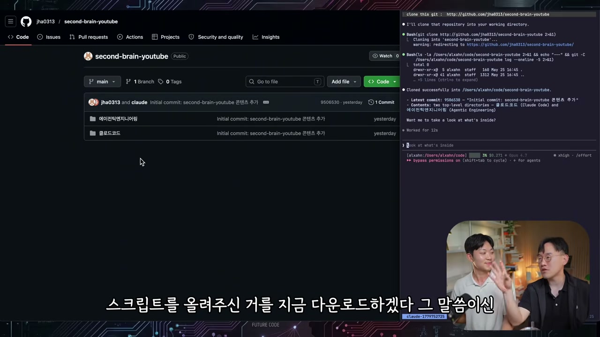

대본 자료가 로컬에 들어왔으니, 이제 옵시디언을 연다. 옵시디언은 파일 브라우저이자 내장 그래프를 가진 도구다. 볼트를 열어 대본 폴더를 불러오자 파일들이 왼쪽에 쭉 나타난다. 그래프 뷰를 누르면 노드들이 보이긴 하는데, 결정적인 게 빠져 있다.

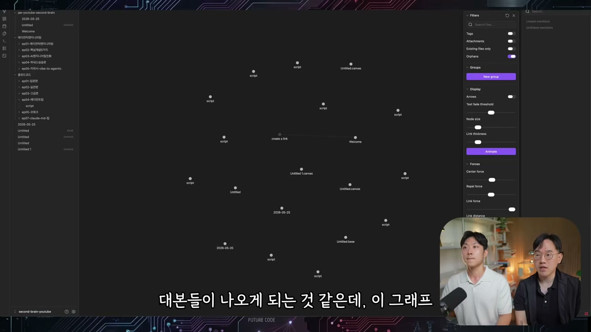

파일들끼리 아직 연결된 게 하나도 없다. 점만 흩어져 있고 선이 없는 상태. 이 연결을 만드는 일을 클로드와 함께 해보는 게 실습의 핵심이다. 옵시디언 안에서 터미널 플러그인을 설치하면 터미널을 열어 클로드 코드를 바로 실행할 수 있는데, 거기에 LLM 위키를 먹인다. "안드레이 카파시의 LLM 위키를 바탕으로 이 코드베이스 프로젝트를 LLM 위키화 시켜줘." 링크 하나만 주면 되는 일이다.

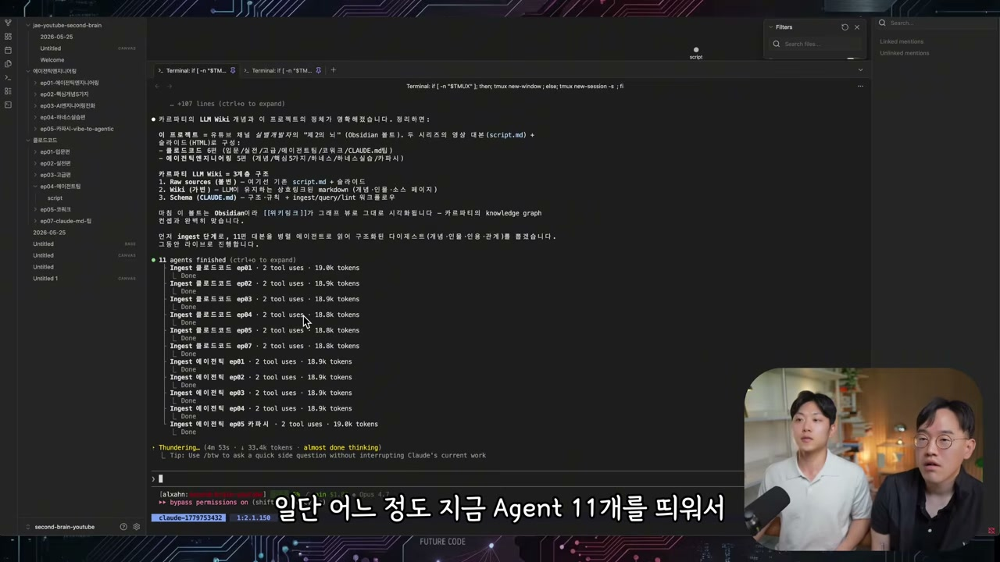

클로드는 에이전트 11개를 띄워 대본들을 병렬로 읽기 시작한다. 인제스트, 그러니까 정보를 함축해 쌓는 작업이다. 그동안 두 사람은 다른 창에서 LLM 위키가 대체 뭔지 클로드에게 설명을 시킨다.

## LLM 위키는 RAG가 아니다

여기서 영상은 잠깐 개념 강의가 된다. 카파시가 2026년 4월에 올린 LLM 위키의 핵심은, LLM이 직접 위키를 관리한다는 것이다. 개발자들은 늘 위키를 써왔지만 가장 큰 문제는 아무도 업데이트를 안 한다는 것이었다. 관리가 안 되니 잘못된 정보가 쌓이고, 그래서 안 읽는다. 카파시의 제안은 걱정하지 말라는 것이다. 위키를 우리가 관리할 필요 없이, 에이전트 친구들이 관리해준다.

그렇다면 RAG와는 뭐가 다른가. 실밸개발자가 묻자 알렉스가 차근차근 푼다. 옛날엔 1GB짜리 문서가 있으면 그걸 통째로 읽을 수가 없었다. 그래서 부분마다 조각을 냈다. 이게 청킹이다. 10만 장의 문서가 있으면 한 장씩 잘라 벡터화한다. 숫자로 만드는 것이다. 이 벡터화한 걸 임베딩이라고 한다. 새 질문이 들어오면 그 질문도 벡터화해서, 임베딩끼리 유사도 점수를 계산한다. 코사인 유사도나 BM25 같은 걸로 가장 비슷한 벡터를 찾고, 그 벡터에 해당하는 문서 조각을 가져와 프롬프트에 함께 넣는다. "Alex의 세컨브레인 알려줘"에 "그와 관련된 지식은 이걸 참고해"를 덧붙이는 것, 그게 RAG다.

LLM 위키는 여기서 그걸 할 필요가 없다고 말한다. 청킹도, 임베딩도 안 하고, LLM에게 파일을 잘 쪼개주고 찾는 법만 알려주면 알아서 잘 찾는다. 왜냐하면 컨텍스트 윈도우가 커졌기 때문이다. 그리고 에이전트가 실제로 파일을 찾는 일을 훨씬 잘하게 됐기 때문이다. 두 사람이 정리한 비유가 있다. 옵시디언은 그냥 IDE일 뿐이고, LLM이 프로그래머, 위키는 코드베이스다. 임베딩 없이 에이전트로 계속 관리되는 위키. 카파시는 이 위키가 한 번 컴파일된 뒤 계속 최신 상태로 유지되고, 매 질문마다 새로 유지보수할 필요 없이 누적되며 풍부해지는 컴파운딩 산출물이라고 본다.

## raw, wiki, schema 그리고 세 가지 동작

작업이 진행되는 동안 두 사람은 카파시가 정의한 아키텍처를 살핀다. 세 개의 레이어가 있다. 우리가 할 일은 raw 소스를 넣는 일뿐이고, 나머지는 스킬을 활용해 위키도 에이전트가 만들고 스키마도 에이전트가 관리한다. 그리고 세 가지 동작이 돈다. 인제스트는 정보를 쌓는 것이다. 유튜브 링크만 던지면 같은 방식으로 처리하는, 일종의 CLI를 만든 셈이다. 쿼리는 사용자 프롬프트로, 인제스트되어 정리된 문서들을 바탕으로 답을 돕는다. 린트는 하네스 같은 것으로, 주기적으로 건강검진을 해서 모순이 있거나 지워야 할 문서가 있으면 에이전트를 활용해 고쳐나간다. 알렉스는 이게 피드백 루프, 이밸과 상통한다고 본다.

잠시 후 그래프로 돌아가자 화면이 달라져 있다.

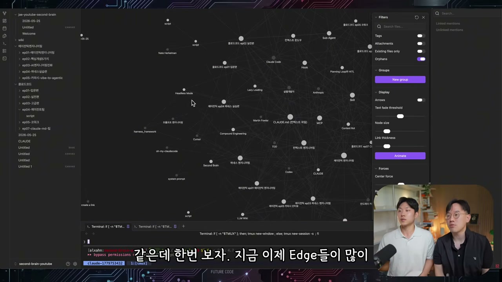

아까는 점만 흩어져 있던 그래프에 엣지가 잔뜩 생겼다. 전부 새로 만들어진 연결이다. 파일 하나를 눌러 들어가니, 클로드가 새로 만든 위키 파일이 나온다.

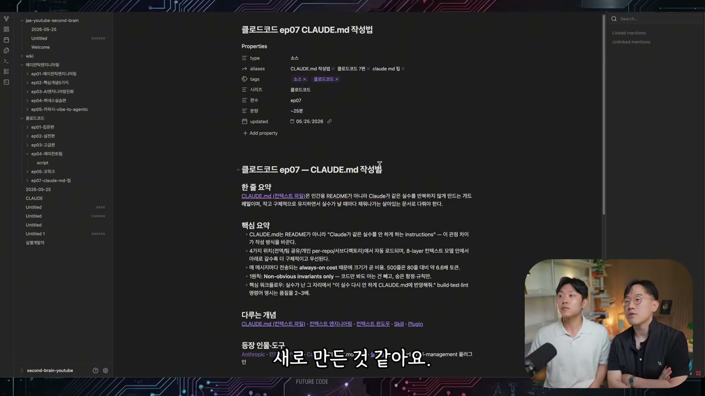

이 위키 파일의 Properties가 곧 스키마다. Type은 소스, 태그를 만들어 태그끼리 모일 수 있게 하고, 편수와 분량 같은 것까지 있다. 놀라운 건 이걸 에이전트가 스스로 알아냈다는 점이다. 이게 유튜브 대본이라는 걸 깨닫고, 편수와 분량까지 스키마로 만들어준 것이다. 한 줄 요약과 핵심 요약이 있고, 위에는 링크들이 걸려 있어 그래프 선으로 이어진다. 클라우드 CLAUDE.md 파일을 누르면 컨텍스트 엔지니어링으로, 거기서 또 다른 개념으로 계속 타고 들어갈 수 있다. 지식이 서로 연결되게 만드는 것이다.

## 그래서 옵시디언은 꼭 필요한가

실밸개발자가 줄곧 품고 있던 질문을 던진다. 세컨브레인 하면 꼭 따라 나오는 게 옵시디언인데, 옵시디언을 써야만 세컨브레인을 만들 수 있는 거냐고. 알렉스의 답은 명확하다. 옵시디언이 주는 이점은 분명히 있지만, 그게 다는 아니다.

옵시디언의 강점은 UI다. 특히 필터링이 도움이 된다. 태그를 누르면 그 태그만 따로 볼 수 있다.

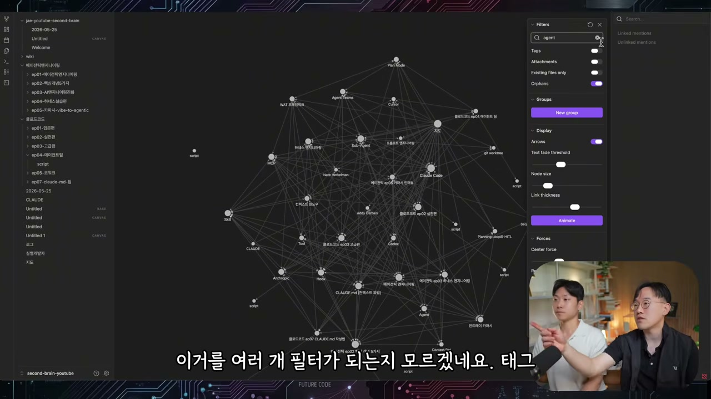

클로드를 검색하면 클로드 관련만, 하네스를 검색하면 하네스만 나온다. 내가 따로 뭘 만들지 않아도 나온다는 게 장점이다. 알렉스는 자기가 그래프를 웹사이트로 만들 땐 스키마까지 전부 직접 따야 했다고 비교한다. 그런 수고 없이 가장 빠르게 잘 만들 수 있는 게 옵시디언이라는 것이다.

하지만 한계도 또렷하다. 두 사람은 지금 지식 창고가 거의 비어 있는, 0.001%밖에 안 찬 상태라는 걸 인정한다. 이게 천 개, 만 개로 계속 늘어나면 결국 사람이 이걸 직접 볼 일이 있을까. 옵시디언의 검색과 필터링은 키워드 기반이라 결정론적이다. 그런데 정보 자체가 균일하지 않다. "에이전트 엔지니어링 중에서도 하네스에 관한 부분"을 알고 싶은데, 에이전트 엔지니어링을 검색하면 만 개, 하네스를 검색하면 3만 개가 나오고, 합쳐서 100개만 보고 싶을 땐 한계에 부딪힌다. 설치했는데 3만 개가 나오면 없는 거랑 똑같다. 결국 이런 비균일한 정보를 다루려면 LLM과 임베딩이 필요한 이유가 여기 있다.

그래서 두 사람이 내린 결론은 역할 분담이다. 옵시디언은 예쁘게 보여주고 기본적인 필터링과 둘러보기를 돕는 도구, 초보자나 큰 그림을 훑을 때 좋은 도구다. 전체적인 매크로를 보는 데는 그래프가 유용하다. 하지만 실제로 뭔가를 활용하려면 결국 터미널에서 돌아가는 클로드에게 물어봐야 한다. 모든 걸 실제로 하는 건 옵시디언의 하네스가 아니라 클로드다. 옵시디언은 IDE처럼 보여줄 뿐이다.

## 비어 있던 뇌가 한 장의 지도가 되기까지

실습의 마지막, 두 사람은 만들어진 세컨브레인에 직접 질문을 던진다. "AI 네이티브 시대에 우리가 꼭 해야 될 것들을 정리해줘." 클로드는 raw 소스가 어떻게 구성됐는지 확인하고, 위키와 인덱스를 읽어 답한다. 흥미로운 검증도 나온다. 에피소드 5에 카파시 인터뷰가 달렸는지 묻자, 실밸개발자는 자기가 안 본 내용인데 위키가 그걸 정리해뒀다는 걸 발견한다. 알렉스는 이게 캐싱의 개념이라고 설명한다. raw 소스가 10만 개면 다 읽을 수 없으니, 위키가 그중 핵심만 추려 제대로 된 소스를 찾을 수 있게 돕는 설계라는 것이다.

마침내 전체 정리가 나온다.

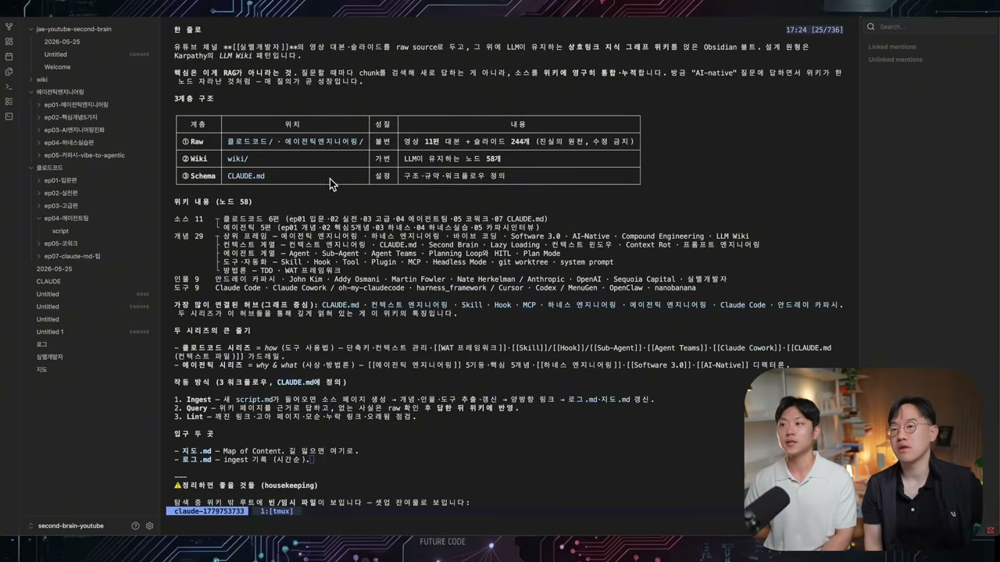

실밸개발자의 세컨브레인은 유튜브 영상 대본과 슬라이드를 raw 소스로 두고, LLM이 유지하는 상호 링크 지식 그래프 위키를 얹은 옵시디언 볼트다. 원형은 카파시의 LLM 위키 패턴이고, 핵심은 다시 한번 "RAG가 아니다"라는 것이다. 질문할 때마다 검색해서 새로 답하는 게 아니라, 소스가 위키에 누적되며 컴파운딩된다. 매 질의가 곧 성장이다. 점점 성장하는 뇌인 셈이다. 위키는 58개의 노드로 만들어졌고, 상위 프레임으로 에이전틱 엔지니어링, 하네스 엔지니어링, 바이브 코딩, 소프트웨어 3.0, AI 네이티브, 컨텍스트 엔지니어링, LLM 위키, llms.txt 계열(표기 미확인) 같은 개념들이 추출됐다. 인물과 도구로는 오 마이 클로드코드, 나노 바나나, MenuGen 같은, 안드레이 카파시가 한 것들까지 정리되어 있다.

알렉스가 원오프와의 차이를 짚는다. 스크립트를 다 다운받아 "이거 다 읽고 개념 정리해줘" 하면 일회성으로 끝난다. 하지만 이렇게 멀티로 만들어두면, 개념마다 더 직접적인 추가 질문을 던질 수 있다. 컨텍스트 엔지니어링에 관련된 모든 소스를 알려달라거나, 그에 대한 생각들을 달라거나.

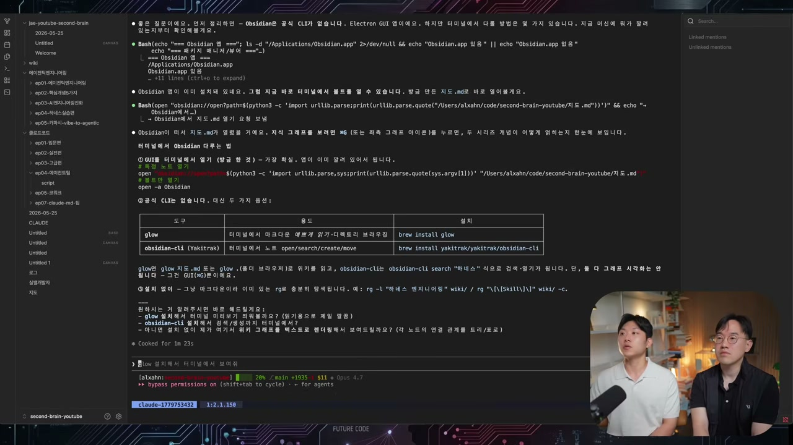

다만 옵시디언 CLI를 가져와 그래프를 LLM으로 필터링하게 만들려던 시도는 막힌다. 공식 CLI가 없고, Electron 앱이라 그래프 뮤테이션은 안 된다. 그냥 파일을 만들어 열어둘 수 있을 뿐이다. 그래서 결국 두 가지 길이 정리된다. 그래프 뷰는 베이직한 필터링과 서칭과 뷰 메커니즘이고, 실제로 활용하려면 클로드 코드로 위키에 쿼리를 날려 에이전트를 써야 한다. 알렉스가 진짜로 만든 건 바로 그 둘을 연결한 것이다. 검색을 했을 때 관련 그래프가 딱 나오게, UI와 에이전트가 함께 작동하게.

영상은 한층 더 나아가는 세컨브레인을 다음 편 숙제로 남기며 끝난다. 옵시디언과 간단한 LLM 위키는 끝이 아니라는 것, 진짜 질의응답을 원하면 에이전트가 함께 가야 하고 큰 그림만 본다면 그래프의 이점이 있지만 그게 다는 아니라는 것을 확실히 해두면서. 실밸개발자가 마지막 소감으로 남긴 말이 이 두 시간을 요약한다. 세컨브레인은 다들 옵시디언 정도 레벨에서 끝나는데, 거기서 한 단계 더 나아갈 수 있는 사람에게 배운다면 그게 엄청난 자산이 될 거라고. 모델은 상향평준화됐고 지식은 공짜가 됐다. 같은 질문에 같은 답이 나오는 시대에 남는 차별점은 내가 무엇을 먹여 시키느냐, 그러니까 나만의 맥락이다. 카파시의 LLM 위키와 옵시디언으로 누구나 비어 있는 뇌 하나를 시작할 수 있지만, 그 뇌를 진짜 무기로 키우는 건 결국 거기에 쌓이는 나 자신이다.
