"아 이거 지난주에 분명히 얘기했는데, 그게 뭐였지?" 회의를 하다 보면 누구나 한 번쯤 겪는 장면이다. 사람끼리 모인 자리에서도 같은 설명이 계속 반복된다. 그런데 영상 속 화자가 짚는 건, 그 똑같은 반복을 우리가 클로드 코드나 코덱스 같은 AI 에이전트한테도 매번 되풀이하고 있다는 사실이다.

채팅 세션에서 AI가 정말 마음에 드는 답변을 내놨다고 하자. 그 답변은 그 세션 안에서 일어난 일이라, 메모장에 따로 복사해두지 않으면 창을 닫는 순간 날아가 버린다. 회의록도 마찬가지다. 누군가, 보통은 막내가 열심히 타이핑하지 않으면 결정과 그 근거가 따로 흩어진다. 개인이 업무 중에 발견한 메모는 메신저로 억지로 공유하지 않는 한 팀이 볼 수 없는 지식으로 남는다. 그리고 대개는 그냥 까먹는다.

지식이 흩어져 있으면 사람도 AI도 매번 그걸 찾거나 맥락을 다시 이해하는 비용을 치러야 한다. 이 영상은 그 비용을 줄이려고 직접 부딪혀본 기록이다. 화자는 안드레이 카파시가 말한 'LLM 위키'를 그대로 적용한 게 아니라, 비개발자와 개발자가 섞여 있는 작은 스타트업에서 같은 문제를 자기 방식으로 풀어냈다. 그 저장소를 옵시디언과 Git으로 어떻게 굴렸고, 문서가 감당 못 할 만큼 불어났을 때 RAG를 어떻게 끌어들였으며, 결국 얼마나 힘들었는지에 대한 이야기다.

## 지식 저장소는 결국 하네스의 입력 계층이다

본론에 들어가기 전에 화자가 깔아두는 전제가 하나 있다. 우리가 AI 에이전트를 다룰 때는 보통 '하네스'라는 걸 구성한다. 모델은 여러 종류가 있고, 그 모델을 잘 부리기 위해 감싸는 장치가 하네스다. 하네스는 닫힌 질문 기반의 도구를 설정하고, 어떤 정책을 코드로 검증하기도 한다.

그런데 정책만으로는 작업이 완료되지 않는다. 여기서 지식 저장소가 등장한다. 지식 저장소는 이 하네스에 데이터를 넣어주는 입력 계층이다. 어떤 문서를 보여주고, 스킬을 연동하고, AI가 볼 수 있는 문서와 없는 문서를 나누고, 민감한 문서와 그렇지 않은 문서를 권한별로 분리한다.

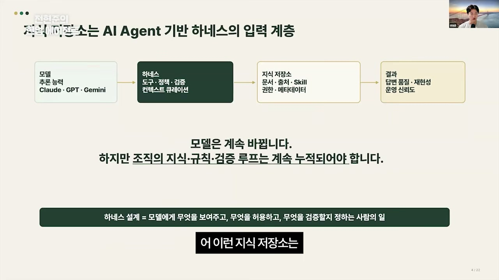

이렇게 조직 레벨의 지식과 규칙, 검증 루프가 계속 변한다는 사실 자체를 저장소로 구현해두면, 하네스를 만든 사람뿐 아니라 그걸 연동하는 모두가 비슷한 품질의 답변을 받고 누구나 그걸 재현할 수 있게 된다. 화자가 노리는 건 결국 이 재현성이다.

이름은 부르는 사람마다 다르다. 세컨드 브레인이라 부르기도 하고, 카파시가 말한 LLM 위키라 부르기도 하며, 화자는 회사에서 'Knowledge Context'라고 이름 붙여 쓰고 있다. 부르는 말은 달라도 가리키는 건 하나다. 흩어진 지식을 한곳에 모아 AI가 쓸 수 있게 만든 저장소를 가리킨다.

## RAG는 매번 다시 찾고, LLM 위키는 한 번에 정리한다

이 글에서 가장 중요한 대비가 여기 있다. 우리가 익히 알던 RAG와 LLM 위키는 무엇이 다른가.

RAG의 가장 큰 단점은 매번 데이터를 다시 검색해야 한다는 것이다. 3년 전쯤 RAG를 처음 도입해본 사람이라면 알겠지만, RAG는 원본 문서를 잘게 쪼개(청크) 보관한다. 그래서 질문이 들어오는 시점마다 원본에서 관련 청크를 찾아 다시 조립해야 한다. 화자의 표현을 빌리면, RAG는 "뭐가 들어왔는지 모르겠지만 일단 때려 넣으시게" 하는 방식의 저장소다. 들어올 때는 분류 없이 쌓고, 검색은 쿼리 타임으로 미룬다.

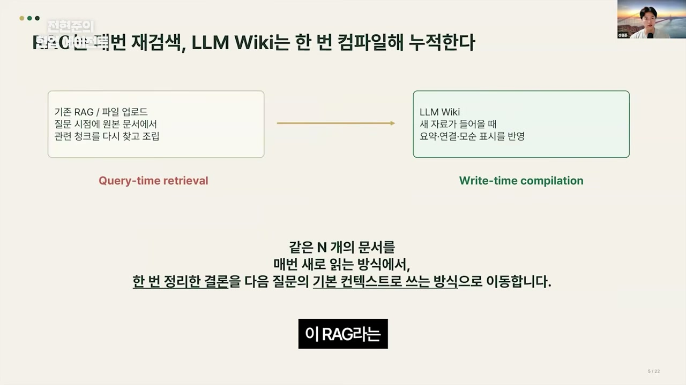

LLM 위키는 정반대다. 문서는 처음 한 번 들어올 때 다른 문서와, 하다못해 인덱스와라도 연결돼야 한다. "이 문서는 여기에 들어와 있어요"라는 정보를 위키가 알아서 관리한다. 그래서 "이런 정보는 있구나, 이런 건 이 위키에 없구나" 하는 것까지 연결된다. 핵심은 타이밍이다. RAG가 쿼리 타임에 정보를 가져오는 리트리벌이라면, LLM 위키는 문서가 처음 쓰여지는 라이트 타임에 컴파일한다. 문서가 처음 쓰일 때 "라이트 타임에 컴파일한다"는 어구 자체가 카파시의 LLM 위키 기스트(Gist)에서 쓰던 표현이다.

라이트 타임 컴파일이 실제로 뭘 하는지는 구체적이다. 같은 문서를 받아도 매번 새로 읽지 않고, 한 번 정리한다. 원본을 그냥 저장하는 게 아니라, 내가(혹은 내가 다루는 에이전트가) 한 번 읽어 결론을 내린 다음, 다음 질문에서 그 결론을 기본 컨텍스트로 바로 쓰는 방식으로 옮겨둔다. 정보가 바로바로 꺼내 쓸 수 있는 상태로 미리 가공돼 있는 것이다.

## 카파시가 제안한 세 개의 레이어

카파시는 LLM 위키를 세 개의 레이어로 구성하자고 제안했다.

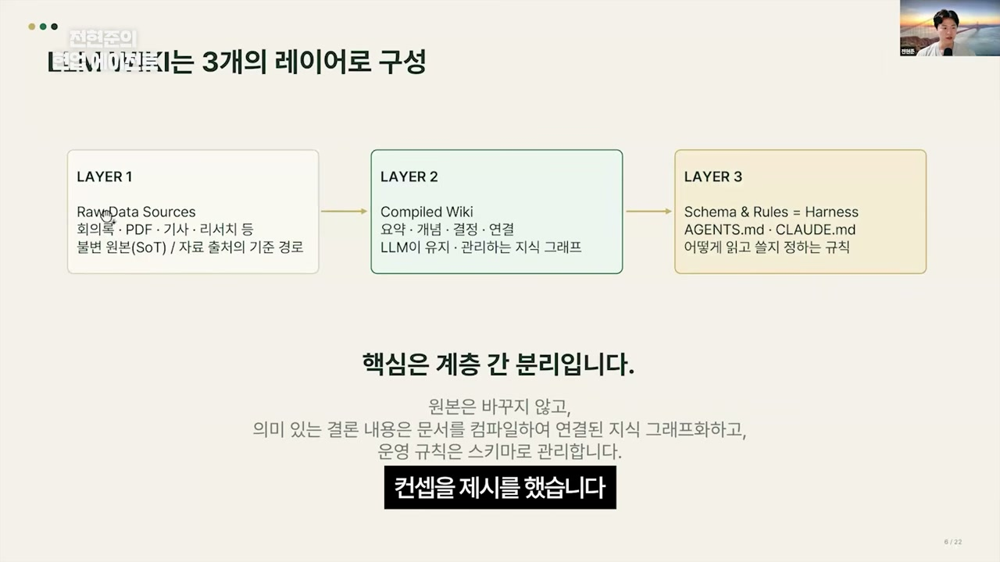

첫 번째는 로우 데이터 소스다. 소스 오브 트루스, 즉 손대지 않는 불변의 원본이다. 이 원본은 특정 경로에 보관해둔다. 두 번째는 그 원본을 감싸는 정보 계층, 바로 위키다. 요약을 하고, 개념을 짚고, 문서의 최종 결정을 내리고, 여러 문서끼리 연결한다. 결국 LLM이 유지관리하는 지식 그래프의 형태가 된다. 세 번째는 규칙이다. 위키만 두면 그냥 쓰레기만 쌓이는 산이 된다. 그래서 스키마와 룰을 줘서 무엇을 어떻게 읽고 쓰고 저장할지 정해둔다. 과다하게 쌓이지 않고, 찾고 싶을 때 바로 찾도록.

화자가 여기서 거듭 강조하는 키포인트는 '계층을 분리했다'는 사실 자체다. 저장 규칙을 다루는 부분, 원본 문서를 저장하는 부분, 그리고 그 문서로 내가 뭘 할 수 있는지 정리해둔 부분. 이 셋을 나눠둔 게 굉장히 중요하다는 것이다.

데이터가 계속 들어온다고 생각하면, 입수(인제스트)하는 흐름이 생긴다. 새 자료를 저장할 때 그냥 쌓는 게 아니라 소스의 핵심을 요약하고, 그 문서의 링크(거의 마크다운 파일이니 그 경로)를 만들어 다른 문서들과 서로 연결해둔다. 사용자가 이걸 활용해 질문하고 답을 받다가 마음에 드는 답변이 나오면, 그 답변은 또다시 위키로 들어간다. 그러면서 가운데 문서 레이어가 업데이트되고, 규칙에 의해 문서 품질이 지속적으로 보존된다.

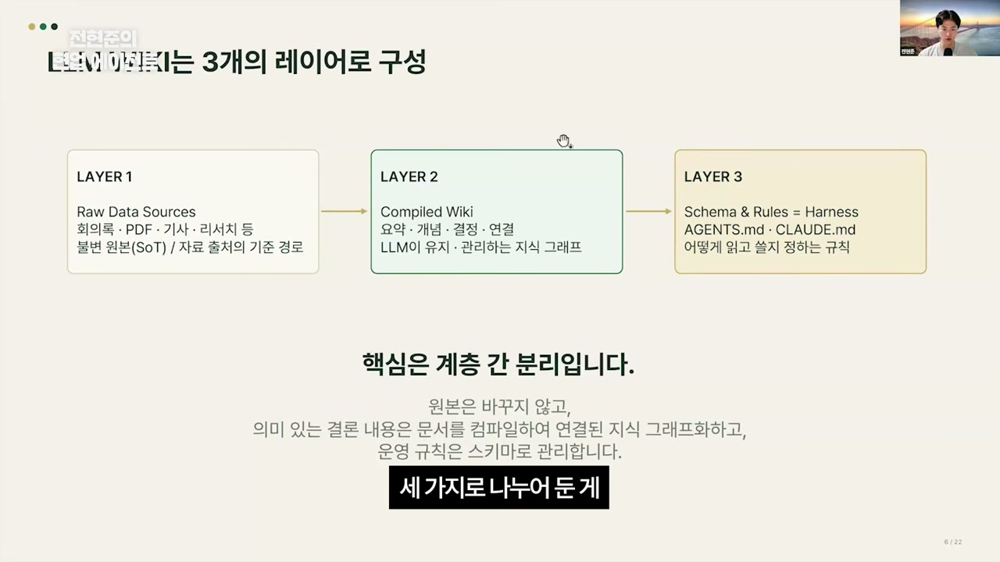

그래서 LLM 위키는 시스템으로 보면 설계가 쉽다. "별거 없네" 하면서 금방 적용한다. 함정은 마지막에 있다. 문서 품질을 보존하는 일이 굉장히 어렵다. **LLM 위키의 진짜 가치는 문서 구조를 잡거나 AI한테 문서를 만들어달라고 하는 데 있는 게 아니라, 그 유지보수를 자동화하는 데서 나온다.** 만들기는 누구나 한다. 어려운 건 그걸 썩지 않게 지키는 일이다.

## 카파시의 두 파일은 개인용이다

카파시는 개념만 제시했기 때문에 실제로는 파일 두 개로 표현했다. 하나는 index.md. 가지고 있는 모든 문서의 인덱스를 담고, 원본 문서에 연결돼 있다. 다른 하나는 log.md. 이 원본으로 무언가를 만들었을 때, 문서를 추가하거나 삭제한 내용을 시간순으로 기록한다.

깔끔하다. 다만 여기엔 선이 있다. 개인은 이렇게 써도 되지만 회사나 팀에서는 이렇게 쓸 수 없다. 파일 두 개로는 여러 사람의 권한도, 공유 여부도, 충돌도 감당이 안 된다. 그래서 화자는 이 개념이 팀 단위로 어떻게 발전할 수 있을지를 고민하기 시작했다.

## 옵시디언 볼트와 Git 레포, 같은 파일의 두 얼굴

화자는 사실 LLM 위키라는 말이 나오기 전부터 사내 지식 저장소를 고민하고 만들어왔다. 그가 짠 폴더 구조는 이렇다.

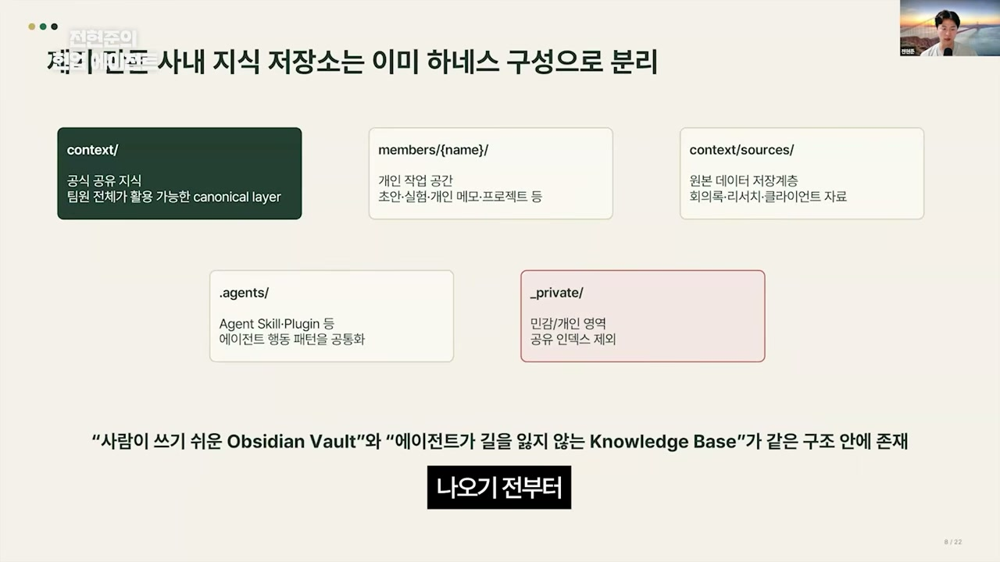

`context` 폴더는 팀이 서로 합의한, 팀원 전체가 활용 가능한 공유 레이어다. 내가 쌓았든 다른 팀원이 쌓았든, 회사 차원에서 공유돼야 하는 것들이 모인다. `members` 폴더는 개인 작업 공간으로, 개인 이름을 붙여 구분한다. 개발자라면 개발 프로젝트가, 아니면 문서나 기획, 디자인이 들어간다. `agents` 폴더는 양쪽에 다 존재한다. 회사 레벨에서 공유하는 에이전트로도, 개인 레벨의 에이전트로도. 개인이 만든 스킬이나 (클로드로 치면) 플러그인을 잘 가꿔서 팀 전체와 공유하고 싶으면, 정식 절차를 거쳐 공유 지식으로 올린다.

여기서 화자가 따로 챙긴 규칙이 `_private`다. 개인 작업을 하다 보면 공유하기 껄끄러운 자료, 민감한 내용, 그냥 쓸데없이 해본 대화가 생긴다. 언더바를 붙인 이 프라이빗 폴더에 두면 절대 members나 context로, 또 뒤에 설명할 Git에서도 동기화되지 않는다.

비개발자도 이 저장소를 다뤄야 했기 때문에, 화자는 사람이 쓰기 쉬운 옵시디언의 볼트(옵시디언은 워크스페이스를 '볼트'라 부른다)와 에이전트가 활용할 지식 베이스를 하나의 시스템에 넣었다. 정체는 단순하다. 그냥 Git 레포지토리 하나다.

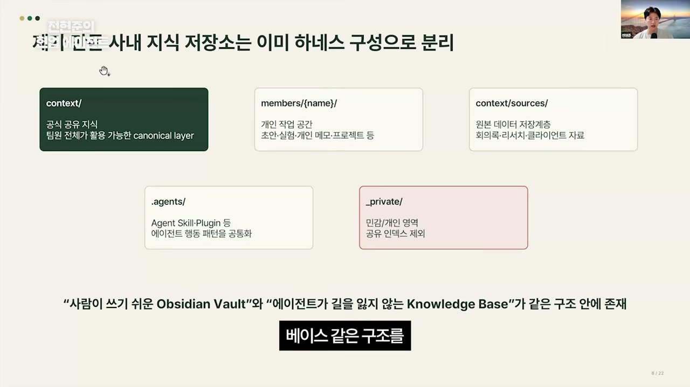

가운데 마크다운 문서 저장소(=Git 레포)를 두고, 두 가지 뷰가 존재한다. 비개발자는 주로 옵시디언에서 노트를 작성한다. 손으로 쓰는 게 기반이라, 옵시디언이 제공하는 여러 기능을 다 다룰 수 있어야 했다. 개발자는 같은 저장소를 Git으로 본다. PR을 올리고, 코드 오너는 CI 같은 프로세스를 다루고, 작업물을 리뷰하거나 롤백한다. 같은 파일을 두 부류가 각자의 방식으로 만지는 것이다. (화자는 "개발자, 비개발자로 나눠서 죄송하다, 내가 개발자라 그렇게밖에 못 나눴다"고 덧붙인다.)

그리고 양쪽 모두 AI 에이전트를 쓸 때 `agents.md`라는 공식 시스템 프롬프트를 보게 했다. 에이전트가 들어와 제멋대로 저장소를 휘젓는 게 아니라, 정해둔 규칙 안에서만 작업하도록 묶어둔 것이다.

## "팀에 공유하고 싶어" 한마디가 PR을 만든다

개인 작업물을 팀 지식으로 승격시키는 과정은 이렇게 흐른다.

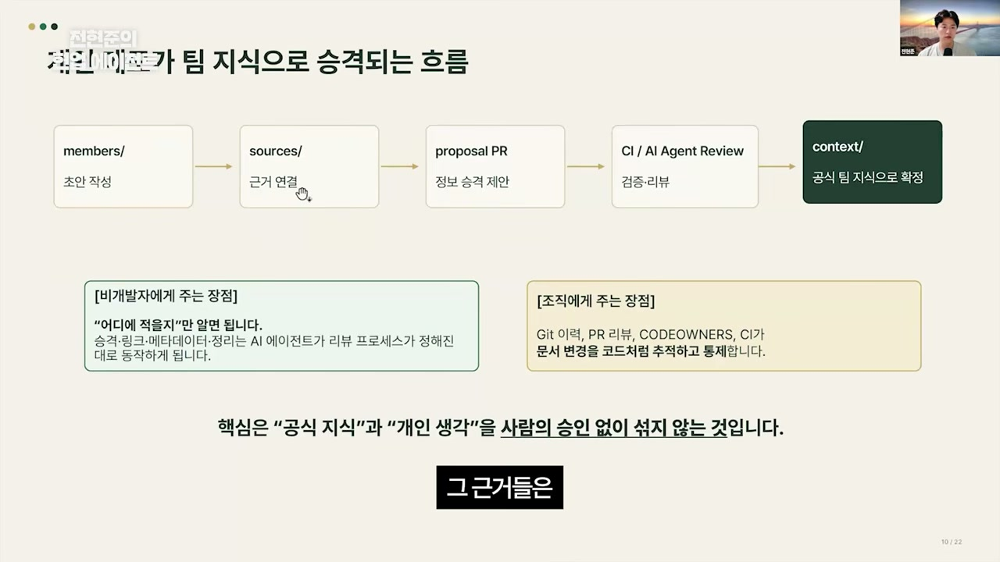

먼저 `members` 아래 개인 폴더에서 초안을 쓴다. 그 근거가 되는 원본은 `sources`라는 경로에 저장해둔다. 원본과 방금 만든 지식을 묶어 "이거 우리 팀이 공유해야겠다" 싶으면, 화자는 보통 하루 한 번 PR을 올린다. 물론 본인이 아니라 에이전트가 작성한다. 이 PR은 자동으로 검증되고, 규칙을 다 지켰는지, 기존 지식과 충돌하지 않는지, 기존에 비슷한 지식이 있으니 이 위치에 들어가면 좋겠다는 추천까지 받아 리뷰된다. 그리고 마지막에 사람이 머지를 승인하면 `context` 저장소로, 팀 지식으로 확정된다.

비개발자에게 "PR이 뭐야" 같은 어려움을 주지 않으려고, 화자는 '어디에 적을지'만 전달했다. 여기에 정보를 쓰고, 클로드 코드든 코덱스든 평소 쓰던 에이전트한테 "이거 우리 팀에 공유하고 싶어"라는 한마디만 하면, 에이전트가 전체 리뷰 프로세스를 알아서 타도록 만들었다. 내부 저장 구조를 사용자가 몰라도 되게 한 것이다.

이 모든 게 Git 위에서 돌아간다는 게 핵심이다. Git은 원래 변화를 관리하는 플랫폼이라, 누가 무엇을 언제 바꿨는지를 코드처럼 추적하고 통제하고 검색할 수 있다. 그런데 화자가 장표에는 안 적었지만 꼭 강조하는 지점이 있다. 검증 리뷰를 AI한테만 맡기고 통과시키는 게 아니라, 반드시 사람의 승인을 거친다는 것. 매번 들어가서 승인 버튼을 누르는 건 귀찮은 일이지만, 이걸 하지 않으면 저장소는 바로 쓰레기장이 된다. 공식 지식이 될 자격이 있는가, 우리 규칙을 잘 만족하는가에 대한 최종 판단만큼은 사람이 한 번 더 한다.

## 무엇이 좋아졌나: 설명할 일이 사라지고, 찐막을 찾게 됐다

이 저장소를 에이전트 시스템에 도입한 효과는 분명했다.

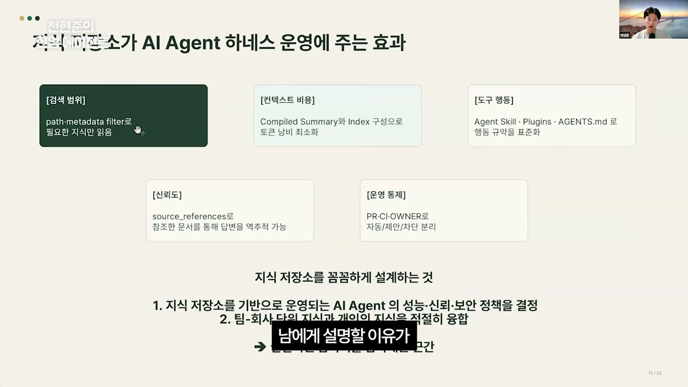

가장 먼저, 필요한 컨텍스트를 남에게 설명할 이유가 없어졌다. "거기 가서 보세요", "제 멤버 폴더 어디 가서 보세요" 하고 슬랙에 링크 하나만 던지면 끝이었다. 멤버 문서의 관리 권한이 본인에게 있으니, 자기 컨텍스트 비용도 계속 줄여야 했고, 개발자든 아니든 모두가 에이전트 토큰을 아끼려고 각자 노력하게 됐다.

또 하나 흥미로운 변화는 모두가 스킬을 만들기 시작했다는 것이다. "나는 에이전트로 이렇게 작업한다" 같은 걸 공유하게 했더니, 처음엔 아무 규칙 없이 마구 공유하게 풀어둔 탓에 나중에 필터링이 필요했을 만큼 스킬이 쏟아졌다. "어, 이런 스킬도 만들 수 있었네" 하는 발견이 오가며 업무 효과를 많이 봤다.

신뢰도도 올라갔다. 예전엔 구글 닥스로 관리를 많이 했는데, 써본 사람은 안다. 수많은 목록 속에서 "파이널의 라스트 파이널이 마지막이었나, 그냥 파이널이 마지막이었나" 헷갈린다.

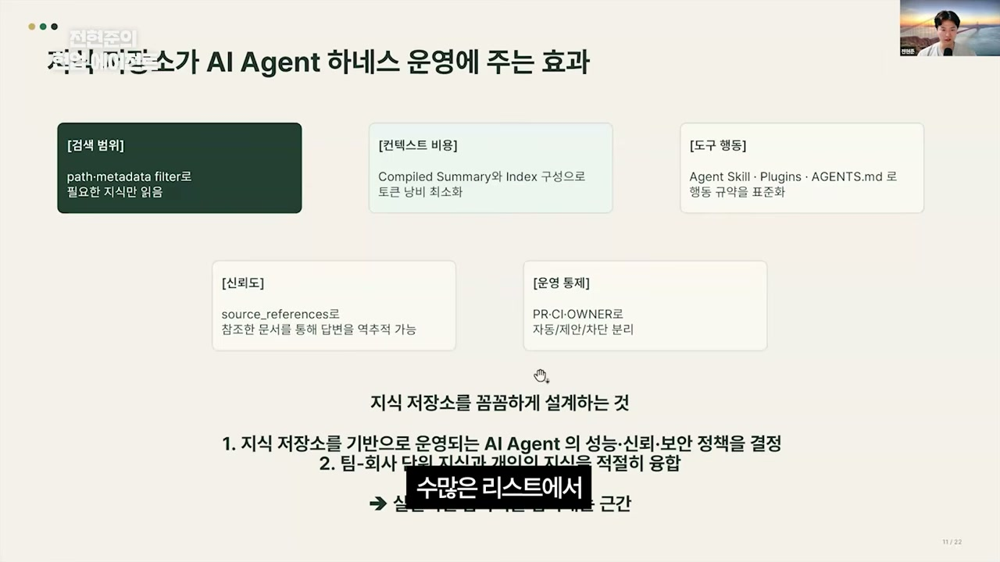

원본 문서에 아예 레퍼런스를 걸어두니 "아, 라스트 파이널이 진짜 찐막이었구나"를 역추적할 수 있게 됐다. 문서를 계속 관리하는 구성을 해두니 클린한 지식들이 쌓였다. 그러다 그는 한 걸음 더 나아간 가능성을 떠올린다. 팀 · 회사 단위 지식과 개인 지식이 적절히 융합되니, 이 공간이 암묵지를 담아내는 근간이 될 수도 있지 않을까. 형식지를 넘어 암묵지까지 다루는 건 AI 에이전트를 다루는 사람들의 엄청난 고민인데, 업무하며 쌓이는 암묵지를 이렇게 다뤄볼 수 있지 않을까 하는 것이다.

## 그런데 문서가 폭발했다

좋은 일에는 대가가 따랐다. 정보를 부지런히 저장하다 보니 마크다운 문서가 폭발적으로 늘었다. 이유는 단순하다. 에이전트가 만들어주니까. 처음엔 아무 생각 없이 막 쌓았다.

문제는 인덱스였다. 인덱스를 담은 마크다운 파일 하나가 천 줄, 천오백 줄로 늘고, 억지로 삼천 줄 언더에서 끊어도 그런 파일이 20개, 30개가 되니 관리가 안 됐다. 화자는 이걸 기존 방식으로 풀 수 없을까 고민하다가, 익숙한 RAG 시스템을 여기 연동해보기로 한다.

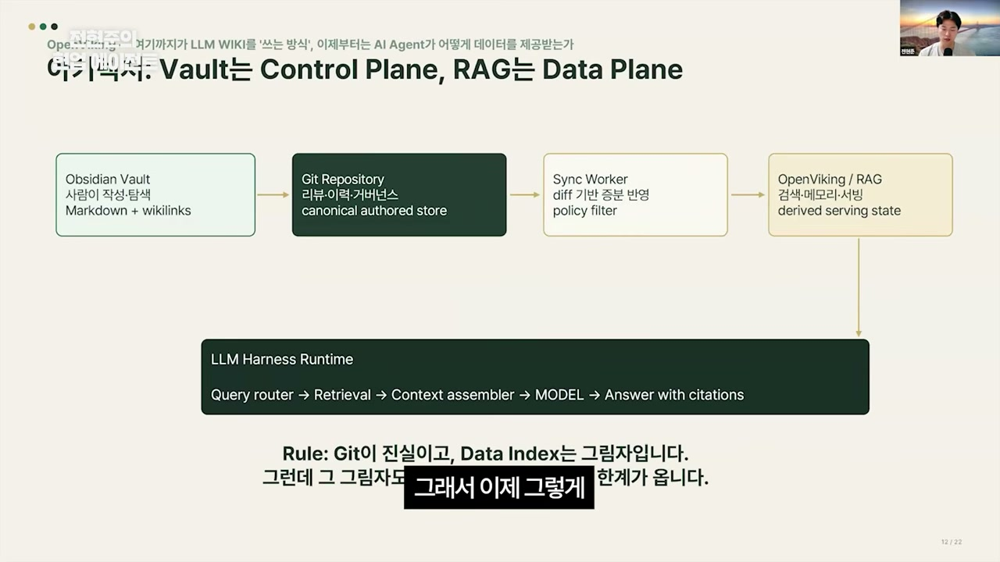

발상은 이랬다. 규칙화된 문서 저장소는 오히려 RAG하기 쉬운 구성 아닌가. 이걸 통째로 RAG에 메타데이터로 예쁘게 정리해 저장하면, 문서가 쌓이는 걸 더는 고민하지 않아도 될 것 같았다. 마침 에이전트한테 여러 번 검색하는 건 더 이상 어려운 일이 아니다. 질문하고 검색해 온 다음 컨텍스트를 합쳐보고, 아니다 싶으면 돌아가 또 합쳐보고. 그렇게 RAG를 연동하기로 한 데에는 인정이 깔려 있었다. 문서가 폭발적으로 늘어나는 걸 LLM 위키 구조만으로는 완벽하게 해결할 수 없다는 것. 그래서 RAG의 벡터 DB가 주는 장점을 차용했다.

## 왜 오픈바이킹이었나: 파일 시스템처럼 다루는 RAG

화자가 고른 건 오픈바이킹이라는 문서 RAG 시스템이다. 선택 이유가 그의 설계와 맞물린다.

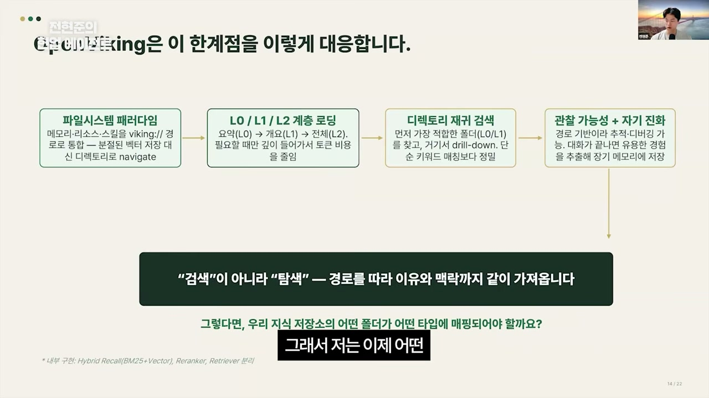

첫째, 오픈바이킹은 완전히 파일 시스템의 패러다임을 갖고 있었다. 메모리, 리소스, 스킬 같은 걸 바이킹 URI(표기 미확인)라는 경로로 통합한다. 그래서 벡터 DB를 직접 다루는 게 아니라 기본적으로 파일 시스템 형태로 다룰 수 있었고, 앞서 설계한 Knowledge Context의 Git 레포지토리와 연동이 잘 됐다.

둘째, L0에서 L2까지 이어지는 계층적 데이터 로드 시스템이 있었다. 원본 문서를 무한히 그대로 집어넣는 게 아니라, 정제된 데이터부터 넣을 수 있다는 장점이다.

셋째, 검색에서 가장 중요했던 건 재귀 검색이었다. 한글로 한글을 검색하는 게 힘든 문제를 넘어서, 디렉토리를 계속 쳐다보며 찾아 확인하게끔 구성할 수 있었다. 나아가 디렉토리화된 시스템이다 보니, 이걸 관리하는 에이전트를 하나 만들어두기만 하면 관찰 가능성이 계속 높아졌고 셀프 이볼빙이 가능했다. 에이전트가 문서를 들여다보다 "지난번 PR의 이 문서, 저 문서랑 좀 겹치는데 합치면 어때요?"를 스스로 찾아내는 것이다. 앞서 말한 암묵지를 캐내기가 이래서 쉬웠다. 단순 검색을 넘어 자율적으로 탐색한다는 게 오픈바이킹의 장점이었다.

화자는 자신의 Knowledge Context 경로를 오픈바이킹이 제공하는 타입에 하나씩 대응시켰다.

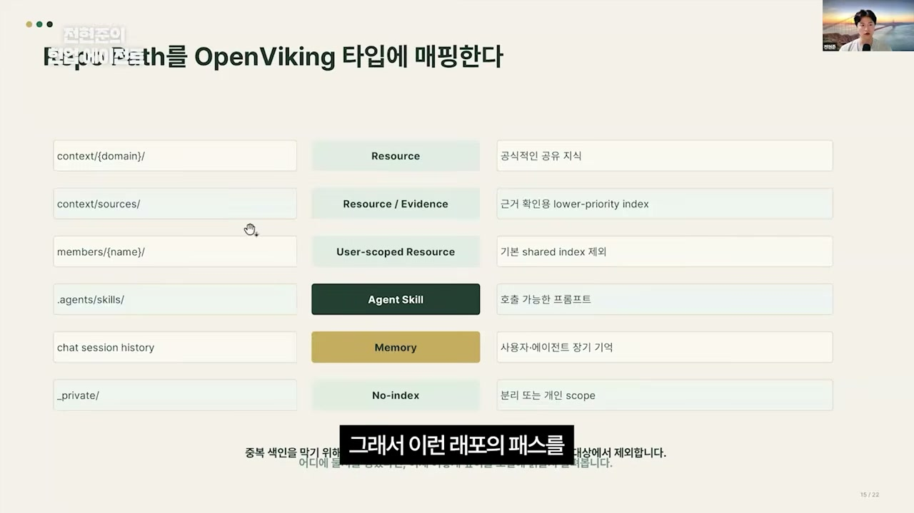

리소스, 에비던스, 유저 스코프드 리소스, 에이전트 스킬, 메모리, 그리고 인덱싱하지 않는 것들까지. 폴더 경로를 RAG의 타입으로 번역해 관리한 것이다.

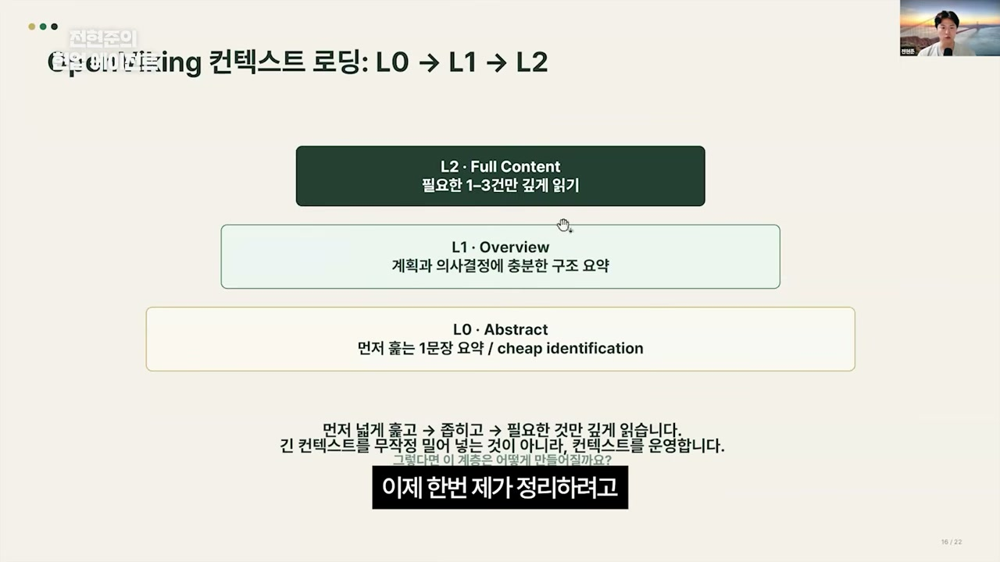

컨텍스트 로딩은 L0에서 L2까지 차근차근 이어진다. 결국 LLM 위키가 그랬듯, 콘텐츠를 원본 그대로 두지 않고 한 번 읽어 내 업무에 의미가 있는지 가린 다음 정제된 문서에 써두고, 그걸 먼저 본다는 컨셉이다. 그렇게 RAG 파이프라인에 저장할 때 넣어두고, 질문할 때는 꺼내서 읽는다. 저장과 검색이 다르지 않다.

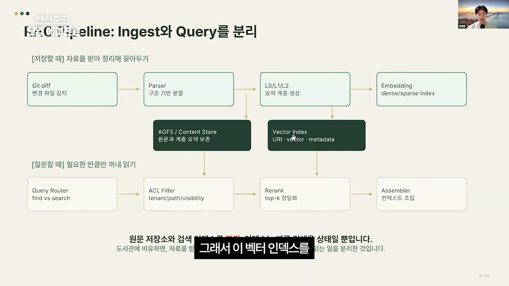

파서나 임베딩으로 시작하는 윗부분은 많이들 봤을 흔한 그림이다. 화자가 짚는 포인트는, 벡터 인덱스라는 게 결국 검색용 상태일 뿐이라는 것. 그래서 이 인덱스를 지속적으로 관리하는 프로세스와 그걸 검색하는 프로세스를 분리해 관리했다.

정리하면 화자가 느꼈던 불편함은 모두 왼쪽, 그러니까 마크다운 문서 관리만으로 버티던 쪽에 있었다. 토큰이 미친 듯이 폭발하고, 문서를 찾아오긴 했는데 그걸로 답하라니 LLM이 아무리 많이 받아들여도 제대로 된 답이 어려웠다. 단순 청크 검색만 하니 아쉬웠고, 검색에서 계층을 몇 번 타고 들어가면 사람이 보기 힘든 수준이 됐다. 적당히 계층을 유지해야겠다는 깨달음, 그리고 폴더로 잘 나눠도 문서 · 메모리 · 에이전트 스킬이 자꾸 섞이니 이걸 타입으로 나누고 싶다는 니즈가 오픈바이킹으로 화자를 데려간 셈이다.

## 마지막 고민은 거버넌스였다

RAG까지 확장하니 문서가 정말 잘 관리됐다. 회사가 만드는 문서를 체계적으로 볼 수 있게 됐고, 오픈클로나 헤르메스 에이전트 같은 것들과 연동했다. 화자의 회사 슬랙에는 벌써 열몇 개의 에이전트가 살고 있는데, 이들이 업무 대화를 나누고 회의 내용을 바로바로 문서 저장소에 저장하는 일이 스무스하게 일어났다.

그러자 고민이 한 단계 더 올라갔다. AI한테 이 문서 관리 시스템을 어디까지 맡겨야 하는가. 거버넌스의 문제다. 시스템을 도입한다고 끝나지 않더라는 것이 화자의 솔직한 토로다.

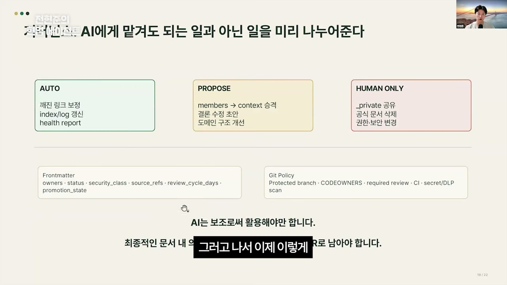

전략은 명확했다. 사람이 할 일을 먼저 정의하고, 사람이 하지 않을 일과 귀찮은 일은 에이전트에 위임한다. 사람이 무조건 쥐는 건 셋이다. 프라이빗은 반드시 사람이 관리한다. 삭제도 사람이 한다. 팀 지식의 삭제는 사람이 결정하고 그 흔적은 Git 히스토리에 다 남아 검색할 수 있다. 그리고 아주 예민한 권한이나 보안에 관한 부분도 사람이 꼭 한다. 그 외 나머지는 에이전트가 하도록 하네스를 구성했다.

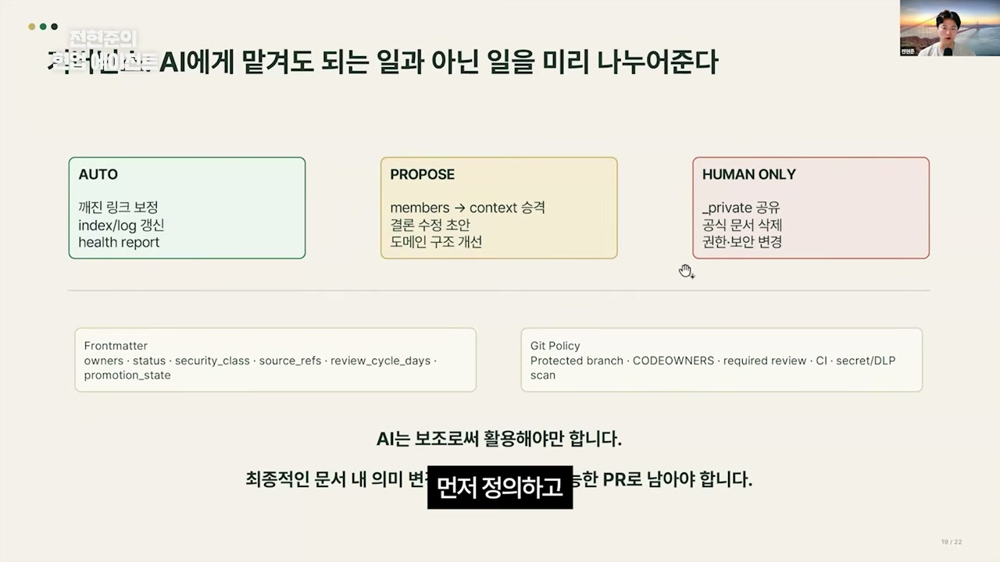

문서 구조는 프론트매터로 잡았다. 옵시디언이 제공하는 템플릿 익스텐션의 프론트매터에 조금 더 얹어, 사람이 에이전트한테 시키는 문서들을 직접 관리하도록 했다. 그 문서들을 다 Git에 올려 누구나 보고 누구나 변경점을 관리하게 했다.

흥미로운 건, 그렇게 어렵던 거버넌스가 막상 하네스를 제대로 구성하고 나니 그리 어려운 일이 아니게 됐다는 점이다. 에이전트가 할 일과 사람이 할 일을 명확히 구분 짓는 것만으로 시스템이 한층 안정적이 됐다.

## 작은 아이디어가 운영 가능한 시스템이 되기까지

화자가 짚는 자료의 출처는 솔직하다. 그는 LLM 위키와 오픈바이킹 두 가지를 실제로 썼다. 그리고 옵시디언을 쓰다 보니 알게 된 재밌는 사실 하나를 덧붙인다. 옵시디언은 그냥 마크다운 문서 저장소라서, 잘 모를 수 있지만 CLI 도구를 갖고 있다. 그래서 클로드 코드나 코덱스에 연동하기가 쉽다. 원래는 여기까지만 준비했는데, 발표 딱 이틀 전에 옵시디언 CEO가 옵시디언 스킬을 만들어 올렸다. 옵시디언을 스킬로 다루면 편리하다는 것이라, 화자는 이것도 추가 자료로 챙겼다.

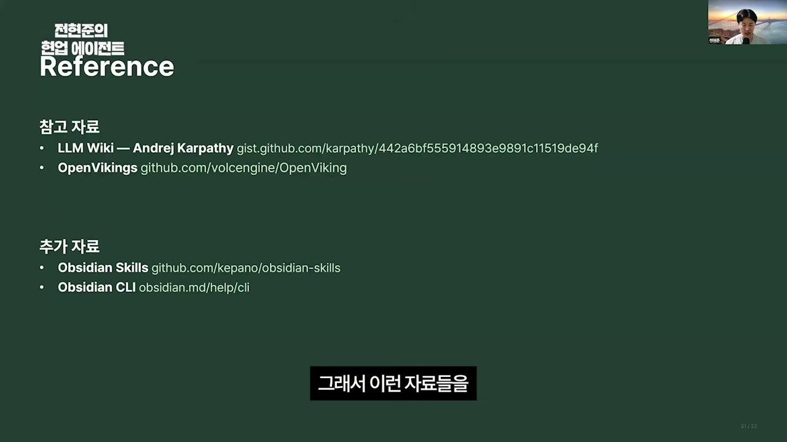

결론은 이렇게 모인다. Knowledge Context는 LLM 위키라는 작은 아이디어에서 출발했지만, Git이라는 동기화 시스템 위에서 옵시디언으로 운영 가능하게 만들어진 것이다. 흩어진 메모와 채팅과 회의록이 사라지지 않게 한곳에 모이고, 라이트 타임에 한 번 정제돼 다음 질문의 컨텍스트가 되고, 사람과 에이전트가 권한을 나눠 지키는 구조. 매번 같은 설명을 다시 하지 않으려는 욕심에서 시작한 시도가 거기까지 갔다.

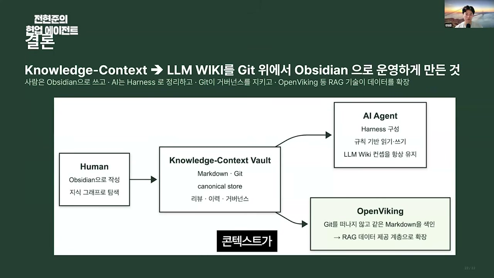

세미나를 딱 한 장으로 그리면 위 그림이 된다. 사람과 지식 저장소, 그 위에 올라탄 RAG, 그리고 그걸 쓰는 AI 에이전트. 화자가 처음에 던진 질문, 언제까지 AI에게 매번 같은 설명을 다시 해야 하느냐에 대한 그의 대답은 결국 이 한 장에 담겨 있다. 설명을 줄이려면 지식을 한곳에 두고, 한 번 정리해두고, 사람과 AI가 어떻게 그걸 지킬지를 정해야 한다는 것. 그리고 그 마지막 승인 버튼만큼은, 귀찮아도 사람의 몫으로 남겨둬야 한다는 것.
