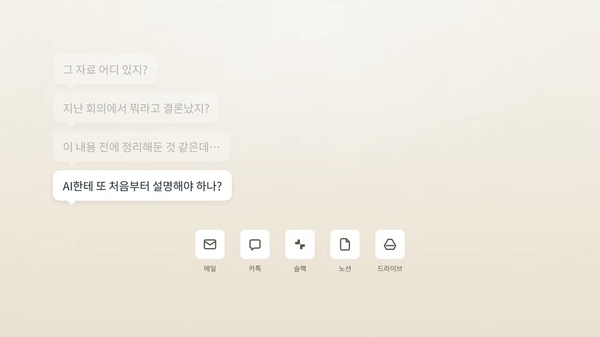
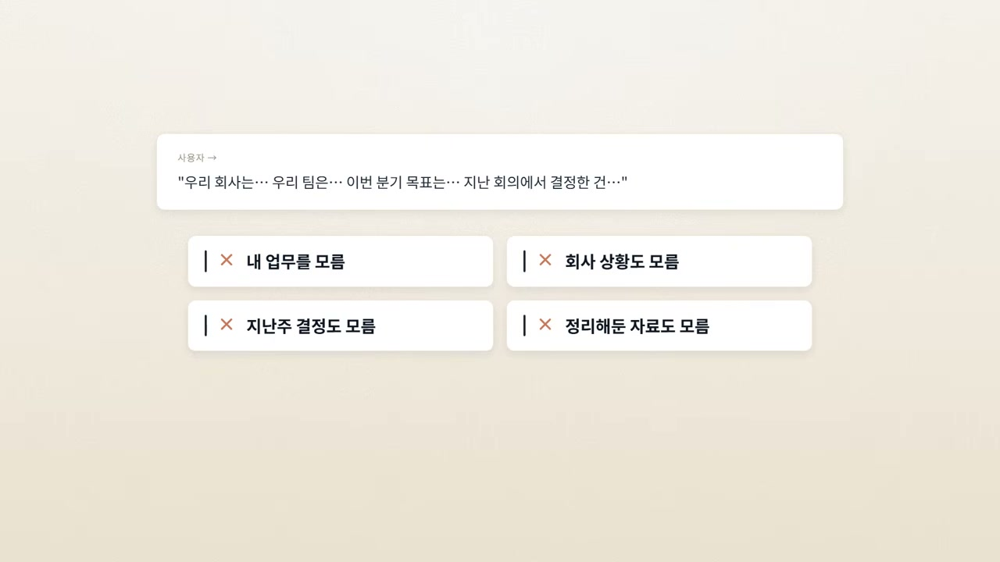
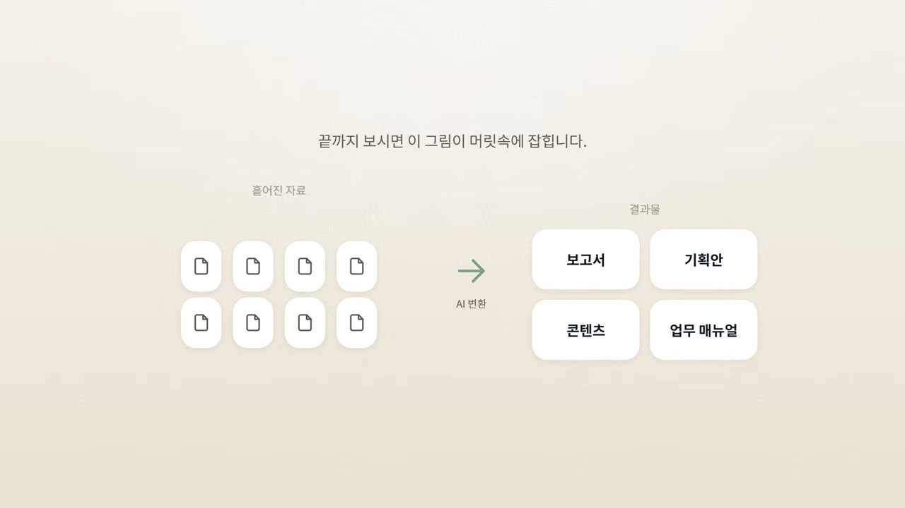
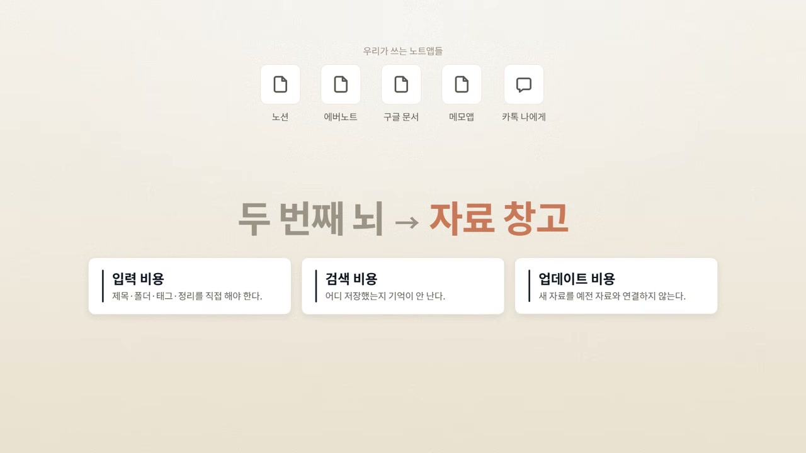
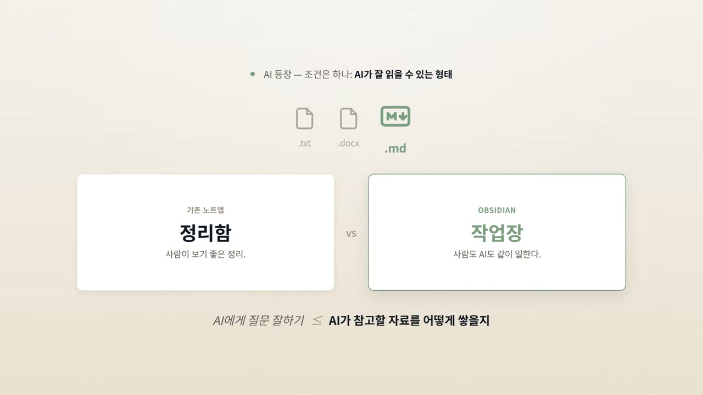
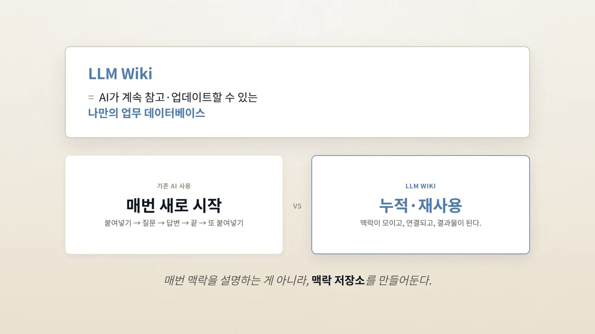
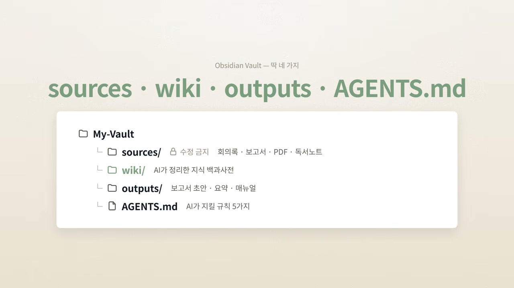
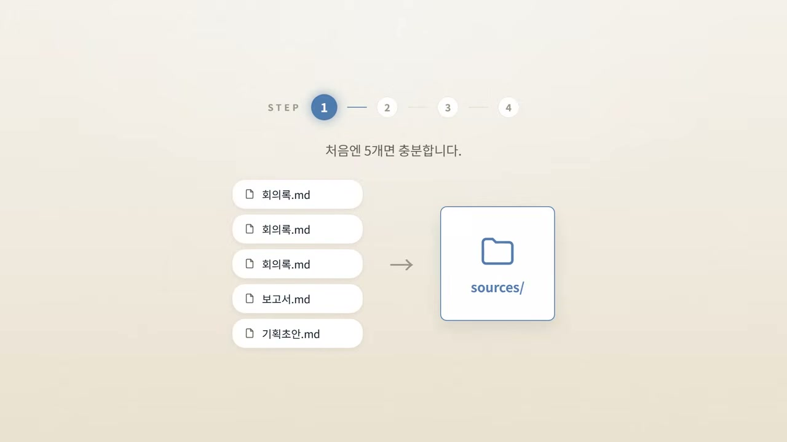
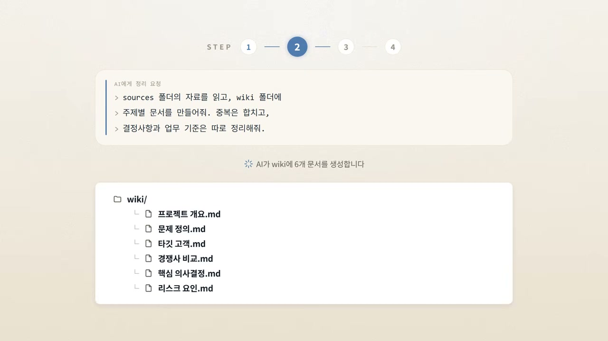
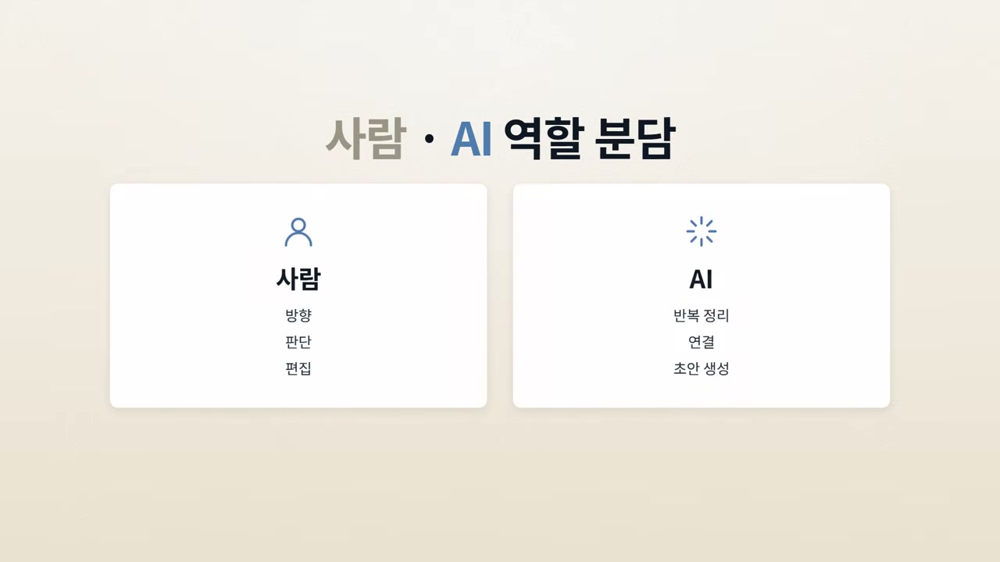

회사에서 일하다 보면 일을 시작하기도 전에 지치는 순간이 있다. "그 자료 어디 있지? 지난 회의에서 뭐라고 결론 났더라?" 메일함을 뒤지고, 카톡과 슬랙을 검색하고, 노션을 열고, 구글 드라이브를 헤매고, 예전 회의록을 찾는다. 그러다 보면 정작 해야 할 중요한 일은 손도 못 댔는데 이미 기운이 빠져 있다.

칼퇴연구소 채널의 영상은 바로 이 장면에서 시작한다. 자료가 흩어져 있다는 것. 그리고 요즘은 여기에 AI까지 들어왔다.

## AI를 쓰는데, 왜 매번 처음부터 설명하고 있지

챗GPT나 클로드를 처음 업무에 붙일 때의 기대는 단순하다. 일이 엄청 빨라질 것 같다. 그런데 막상 써보면 다른 종류의 피로가 찾아온다. AI가 내 업무를 모른다. 우리 회사 상황도 모른다. 지난주에 어떤 결정을 했는지 모르고, 내가 예전에 어떤 자료를 정리해 뒀는지도 모른다. 그래서 매번 처음부터 설명해야 한다.

그렇게 한참 상황을 설명하다 보면 묘한 생각이 든다. "AI를 쓰고 있는데, 왜 내가 AI를 교육시키느라 시간을 쓰고 있지?" 화자가 오늘 이야기의 핵심이라며 꺼내는 답은 이렇다. AI를 잘 쓰는 사람은 질문을 잘하는 사람이 아니다. **AI가 참고할 수 있는 자기만의 업무 지식 시스템을 가진 사람**이다.

그 시스템을 만드는 가장 현실적인 조합으로 영상이 제시하는 것이 옵시디언(Obsidian)과 LLM 위키다. 옵시디언을 그냥 메모 앱으로 쓰는 게 아니라, AI가 계속 읽고 정리하고 업데이트하고 결과물까지 만드는 업무 시스템으로 바꾸는 방식이다.

머릿속에 잡아야 할 그림은 이렇다. 흩어진 회의록, 보고서, 독서노트, 아이디어, 프로젝트 재료를 AI가 읽기 좋은 구조로 모아두고, 필요할 때마다 보고서, 기획안, 글, 콘텐츠, 업무 매뉴얼로 바꿔내는 흐름이다.

## 노트 앱은 왜 결국 자료 창고가 되는가

해법으로 넘어가기 전에 영상은 먼저 기존 노트 앱이 왜 부족했는지를 짚는다. 노션, 에버노트, 구글 문서, 메모 앱, 워드 파일, 심지어 카카오톡 '나에게 보내기'까지. 자료를 모아두면 나중에 다 써먹을 수 있을 것 같지만, 시간이 지나면 세 가지 문제가 반복된다.

첫째, 넣는 게 귀찮다. 자료 하나 저장하려고 제목을 정하고, 폴더를 고르고, 태그를 붙이고, 보기 좋게 정리해야 한다. 둘째, 찾기가 어렵다. 분명히 저장했는데 어디 뒀는지 기억이 안 나고, 제목이 기억나지 않으면 검색조차 막힌다. 셋째, 업데이트가 안 된다. 새 자료가 생겨도 예전 자료와 연결되지 않는다. 예전 메모는 예전 메모대로, 새 메모는 새 메모대로 따로 쌓인다.

그래서 노트 앱은 "나중에 보겠다"고 쌓아둔 자료 창고가 된다. 문제는 그 나중이 거의 오지 않는다는 것이다. 그런데 AI가 등장하면서 이 구조가 바뀌고 있다. 이제 사람이 모든 자료를 직접 정리할 필요가 없다. AI가 자료를 읽고 요약하고 분류하고 연결하고 필요한 결과물로 바꿔줄 수 있기 때문이다.

단, 결정적인 조건이 하나 붙는다. **AI가 잘 읽을 수 있는 형태로 자료가 저장되어 있어야 한다.** 바로 이 지점에서 옵시디언이 강해진다.

## 정리함이 아니라 작업장

옵시디언은 겉보기에 평범한 메모 앱이다. 그런데 내부 구조가 다르다. 옵시디언은 노트를 내 컴퓨터 폴더 안에 마크다운 파일로 저장한다. 이게 왜 중요한가. 마크다운은 사람도 읽기 쉽고 AI도 읽기 쉬운 텍스트 형식이기 때문이다.

영상이 쓰는 비유가 명료하다. 기존 노트 앱이 사람이 보기 좋은 정리함에 가깝다면, 옵시디언은 사람과 AI가 같이 일하는 지식 작업장에 가깝다. 그래서 앞으로 AI를 업무에 제대로 쓰려면, AI에게 질문을 잘하는 법만큼이나 AI가 참고할 자료를 어떻게 쌓아둘 것인가가 중요해진다. 좋은 질문보다 좋은 자료 더미가 먼저라는 이야기다.

## LLM 위키: 매번 새로 시작하지 않는 구조

여기서 핵심 개념인 LLM 위키가 등장한다. 어렵게 생각할 것 없이, AI가 계속 참고하고 업데이트할 수 있는 나만의 업무 데이터베이스다.

차이는 우리가 보통 AI를 쓰는 방식과 비교하면 또렷해진다. 평소에는 자료를 붙여넣고, 질문하고, 답변을 받고, 대화가 끝난다. 며칠 뒤 비슷한 질문을 하려면 또 자료를 붙여넣어야 한다. 매번 새로 시작하는 방식이다.

LLM 위키는 다르다. 자료를 한 곳에 모아두고, AI에게 그 자료를 읽어 주제별 문서로 정리하게 한다. 새 자료가 생기면 기존 문서와 연결해 업데이트하게 하고, 필요할 때는 그 위키를 바탕으로 결과물을 만들게 한다. AI와의 대화가 일회성으로 흩어지지 않고, 내 업무 지식이 계속 쌓이고 연결되고 재사용되는 구조가 된다. 핵심은 매번 맥락을 설명하는 게 아니라, **AI가 참고할 맥락 저장소를 한 번 만들어 두는 것**이다.

## 폴더 네 개로 끝나는 구조

그럼 실제 구조는 어떻게 짤까. 처음부터 복잡할 필요는 없다. 옵시디언에서 새 볼트(Vault)를 만들고 딱 네 가지만 준비하면 된다.

**첫째, 소스(sources) 폴더.** 원본 자료를 넣는 곳이다. 회의록, 보고서, 기사, PDF, 리서치 자료를 그대로 던져둔다. 여기서 한 가지 규칙이 붙는다. 소스 폴더의 원본은 가능한 한 수정하지 않는다. 나중에 AI가 어떤 자료를 바탕으로 정리했는지 추적할 수 있어야 하기 때문이다.

**둘째, 위키(wiki) 폴더.** AI가 정리한 지식 문서가 들어가는 곳이다. 프로젝트 개요, 문제 정의, 고객 분석, 경쟁사 비교 같은 문서가 여기 쌓인다. 소스가 재료 창고라면 위키는 AI가 정리해둔 업무 백과사전인 셈이다.

**셋째, 아웃풋(outputs) 폴더.** 결과물이 들어가는 곳이다. 보고서 초안, 회의 공유용 요약본, 업무 매뉴얼 같은 것들이다.

**넷째, 에이전트 MD(AGENTS.md) 파일.** AI에게 주는 업무 지시서다. 예를 들면 이런 내용을 적어둔다. 원본 자료는 수정하지 말 것, 새 문서를 만들 때는 출처를 남길 것, 중복되는 내용은 합칠 것. 이렇게 규칙을 정해두면 AI가 훨씬 일관된 결과물을 낸다.

## 네 단계로 돌아가는 실제 흐름

구조를 세웠다면 운영은 네 단계로 돈다.

**1단계, 원본 자료를 소스 폴더에 넣는다.** 처음부터 많이 넣을 필요는 없다. 회의록 3개, 보고서 1개, 기획 초안 1개 정도면 충분하다.

**2단계, AI에게 정리를 요청한다.** "소스 폴더의 자료를 읽고 위키 폴더에 주제별 문서를 만들어줘. 중복되는 내용은 합치고, 중요한 결정사항과 업무 기준은 따로 정리해줘. 각 문서에는 참고한 원본 자료를 표시해줘." 그러면 AI가 자료를 읽고 위키 문서를 만든다.

예를 들어 신규 서비스 기획 자료를 넣으면 프로젝트 개요, 문제 정의, 타겟 고객, 경쟁사 비교, 핵심 의사결정, 리스크 요인 같은 문서가 생긴다.

**3단계, 새 자료가 생길 때마다 업데이트한다.** 새 회의록이 생겼다면 이렇게 요청한다. "새로 추가한 소스 자료를 읽고 기존 위키 문서 중 업데이트가 필요한 부분을 수정해줘. 새로운 개념이 있으면 새 문서를 만들고 관련 문서와 링크로 연결해줘." 이제 AI는 새 자료만 따로 요약하는 게 아니라 기존 지식 구조에 연결한다. 위키가 한 번 만들고 멈추는 게 아니라 자라는 것이다.

**4단계, 필요할 때 결과물을 만든다.** "위키 폴더의 내용을 바탕으로 임원 보고용 1페이지 기획안을 만들어줘." 혹은 "경쟁사 비교 문서를 참고해서 우리 서비스의 차별화 포인트를 5개로 정리해줘." 이렇게 하면 메모가 단순한 기록으로 끝나지 않고 업무 결과물로 바뀐다.

이 흐름 속에서 사람과 AI의 역할이 갈린다. 사람은 방향을 정하고 판단하고 편집한다. AI는 반복적인 정리, 연결, 초안 생성을 맡는다. 그러면 내가 읽고 정리하고 생각해둔 것들이 한 번 쓰고 끝나는 게 아니라 계속 재사용되는 지식 자산이 된다.

## 도구는 바뀌어도 자료 구조는 남는다

개념은 어렵지 않다. 영상도 그 점을 인정한다. 문제는 막상 만들려고 하면 막힌다는 데 있다. 폴더 구조를 어떻게 짜야 할지, 자료를 어떤 형식으로 넣어야 할지, AI에게 어떤 프롬프트를 줘야 할지, 어디까지 구축해야 할지가 막막하다. 화자는 이 막막함을 풀기 위해 'AI 시대의 나만의 LLM 위키 만들기'라는 자료를 만들었다고 말한다. 기본 개념부터 볼트 구조, 프롬프트 템플릿, 자료를 결과물로 바꾸는 업무 흐름, 7일 구축 플랜까지 담았다는 설명이다.

다만 이 자료 소개를 걷어내고 보면, 영상이 끝까지 밀고 가는 주장은 하나로 모인다. AI 도구는 계속 바뀐다. 오늘은 챗GPT를 쓰고 내일은 클로드를 쓰고 다음 달엔 또 다른 도구를 쓸 수도 있다. 하지만 내 자료 구조가 잘 잡혀 있으면 도구가 바뀌어도 계속 활용할 수 있다. 옵시디언과 LLM 위키 조합이 중요한 이유가 여기 있다. 투자 대상이 그때그때의 모델이 아니라, 그 모델들이 공통으로 읽어갈 내 지식 기반이라는 것이다.

정리하면 이렇다. 업무에서 AI를 쓸 때 가장 큰 병목은 AI의 성능이 아니라, AI에게 줄 맥락이 흩어져 있다는 것이다. 자료는 여기저기 흩어져 있고, 결정사항은 회의록 속에 묻혀 있고, 아이디어는 메모 앱에 쌓여만 있다. 그래서 물어볼 때마다 처음부터 설명하게 된다. LLM 위키는 이 문제를 풀기 위한 구조다. 원본은 소스에 모으고, AI가 정리한 지식은 위키에 쌓고, 결과물은 아웃풋에 저장하고, AI가 지킬 규칙은 에이전트 MD에 적어둔다.

그렇게 하면 옵시디언은 단순한 메모 앱이 아니라, AI가 읽고 연결하고 업데이트하고 결과물을 만드는 나만의 업무 지식 시스템이 된다. 앞으로 AI를 잘 쓰는 사람은 프롬프트를 잘 쓰는 사람이 아니라, AI가 계속 참고할 수 있는 자기만의 지식 시스템을 가진 사람일 가능성이 크다. 영상이 처음부터 끝까지 같은 말을 다른 각도에서 반복하는 셈인데, 그만큼 화자가 한 가지에 확신을 걸고 있다는 뜻이기도 하다.
