
<iframe src="https://www.youtube.com/embed/OVilj8E2NnM" title="YouTube video player" frameborder="0" allow="accelerometer; autoplay; clipboard-write; encrypted-media; gyroscope; picture-in-picture; web-share" referrerpolicy="strict-origin-when-cross-origin" allowfullscreen></iframe>

정보를 모으는 일은 누구나 한다. 유튜브 영상을 보고, 강의를 결제하고, 책에서 좋았던 문장을 옮겨 적는다. 문제는 그 다음이다. 태오는 영상 첫머리에서 많은 사람이 공감할 법한 막막함을 그대로 짚는다. "정보를 모으기만 하고 정작 내 사업에는 적용 안 되는 느낌." 책을 읽었는데 무엇을 적용해야 할지 모르고, 강의는 들었는데 어디서부터 시작해야 할지 모른다. 하는 건 많은데 정작 내 사업은 안 굴러간다.

그가 내린 진단은 단순하지만 날카롭다. **도구를 잘 쓰는 것과 그 도구를 사업에 잘 활용하는 것은 완전히 다른 일이다.** 이 영상은 옵시디언(Obsidian)과 클로드 코드(Claude Code)를 연결하는 방법을 보여주지만, 진짜 주제는 도구가 아니라 정보를 자기 사업으로 흘려보내는 시스템이다.

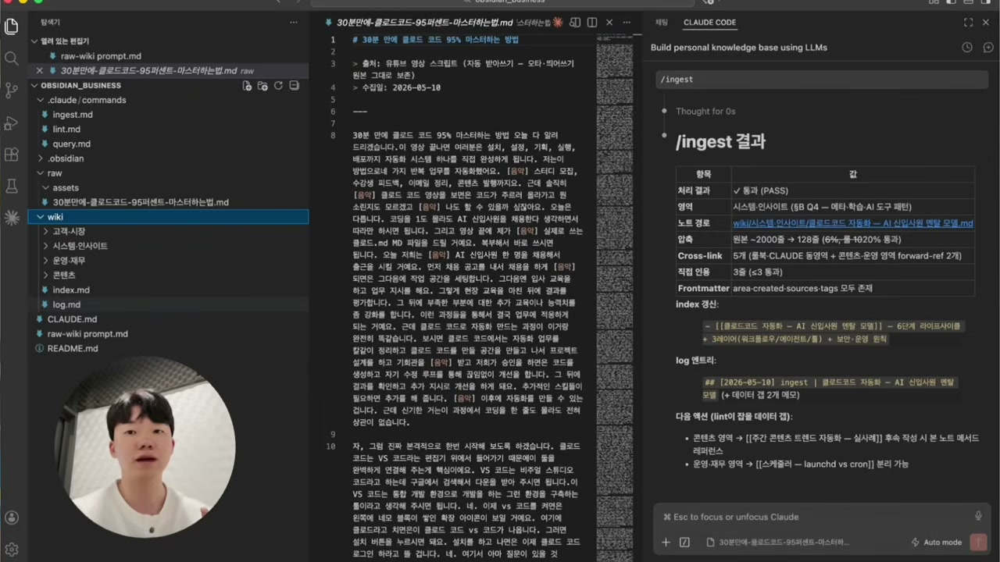

## 옵시디언이라는 그릇, 그리고 핵심 폴더 두 개

태오는 자신이 옵시디언 전문가가 아니라고 먼저 못을 박는다. 쓴 지 한두 달밖에 안 됐다. 그런데도 옮겨온 이유가 있다. 3년 넘게 노션을 쓰면서 막혀 있던 게, 옵시디언과 클로드 코드를 결합하는 순간 풀렸기 때문이다.

옵시디언이 뭔지부터 짚자. 노션처럼 클라우드에 저장되는 도구가 아니다. 내 컴퓨터 폴더 안에 마크다운(MD) 파일이 그냥 쌓이는 노트 도구다. 옵시디언이 "볼트(vault)"라고 부르는 것도 결국 내 컴퓨터의 폴더 하나를 가리키는 말이다. 옵시디언 화면 왼쪽에 보이는 파일 트리는 실제 윈도우 폴더나 맥 파인더 안의 구조와 똑같다. 컴퓨터의 파일을 옵시디언에 그냥 연결해 둔 것뿐이다.

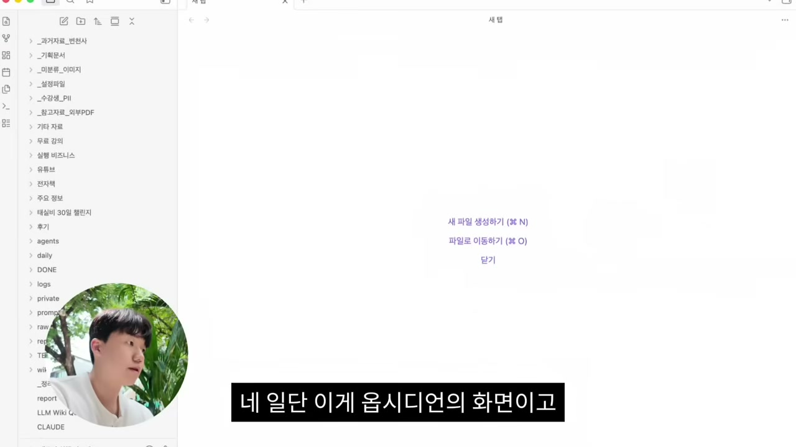

옵시디언의 특징은 노트끼리 대괄호로 연결된다는 점이다. 한 노트에서 다른 MD 파일을 대괄호로 걸면, 클릭했을 때 그 페이지로 넘어간다. 브랜드 키워드, 구매 고객 동선 같은 노트들이 이렇게 서로 이어진다. 태오는 이렇게 자료가 다 연결되면서 결국 자기 뇌가 형성된다고 표현한다. 가지고 있는 자료들이 시각적으로 연결되는 것이다.

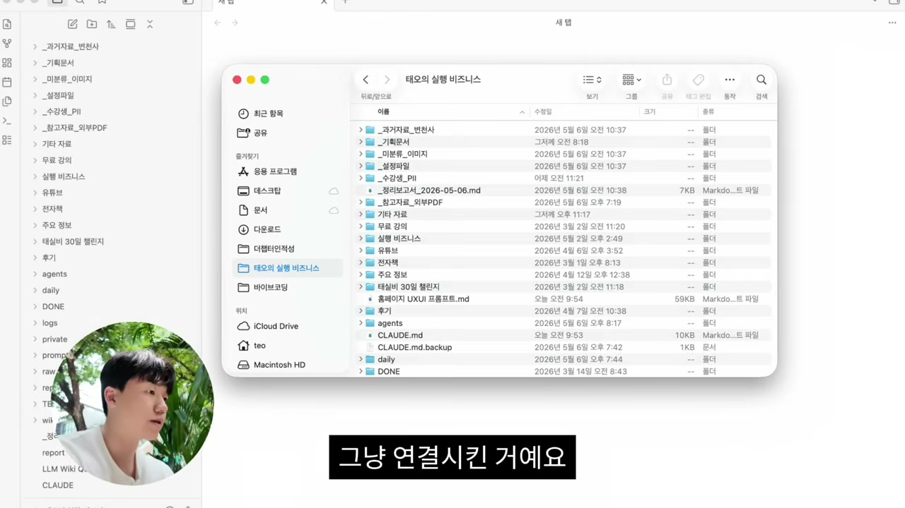

다만 여기까지는 그저 "연결됐다"일 뿐, 사업에 도움이 되진 않는다. 핵심은 어떤 폴더를 두느냐다. 태오가 주목하라고 짚는 건 로우(raw)와 위키(wiki)라는 두 폴더다.

## 카파시의 LLM 위키, 그리고 도서관 비유

이 로우-위키 분리는 태오가 발명한 게 아니다. 그는 출처를 분명히 댄다. 전 오픈AI와 테슬라 AI 책임자였던 안드레이 카파시가 2026년 4월에 "LLM 위키"라는 패턴을 깃허브 기스트로 공개했고, 한 달 만에 AI 커뮤니티에서 가장 핫한 사고 모델이 됐다는 것이다.

핵심 문장은 이렇다. 옵시디언은 IDE, LLM은 프로그래머, 위키는 코드베이스. 프로그래머 세계의 비유라 처음 들으면 어렵다. 태오는 이걸 도서관으로 바꿔 설명한다.

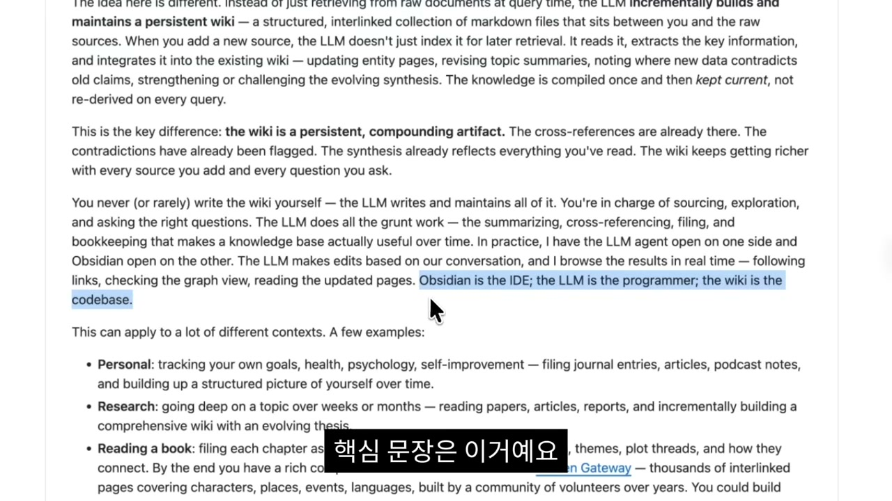

- 옵시디언은 도서관 건물
- 클로드 코드(LLM)는 사서
- 위키는 정리된 책꽂이
- 그리고 나는 책을 사 오는 사람

흐름은 이렇게 돈다. 내가 책을 사서 도서관 입구에 두면, 사서인 클로드 코드가 그 책을 읽고 "이게 태오님한테 필요한 책일까" 판단한다. 통과하면 알맞은 책꽂이, 즉 위키에 꽂는다. 비슷한 책끼리 연결도 해 둔다. 당장 쓸모없는 책은 별도 창고에 보관한다. 나는 사서가 정리한 결과만 확인하면 된다.

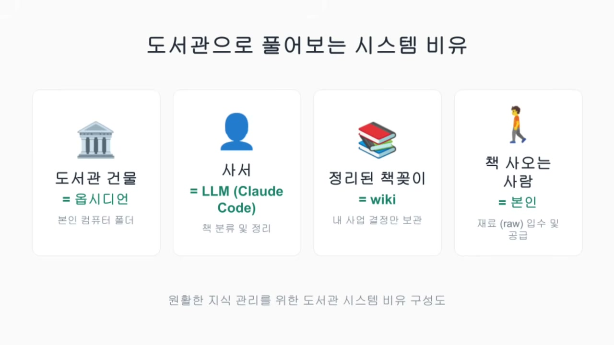

태오가 한 일은 이 패턴을 그대로 베낀 게 아니다. "저보다 먼저 이 사고 체계를 생각하신 분이 있고, 저는 거기서 저만의 사업 필터를 더한 거죠." 1인 사업가에게 맞게 한 겹 더 얹었다는 얘기다.

그 필터의 정체가 바로 로우와 위키의 차이다. 로우는 외부에서 들어온 정보다. 유튜브 영상, 강의, 뉴스레터, 책에서 좋았던 내용, 가지고 있는 PDF. 들어오는 건 다 여기로 간다. **위키는 다르다. 내 사업에 꼭 필요한 내용만 들어간다.** 어떤 외부 정보도 내 기준에 합당하지 않으면 들어올 수 없다.

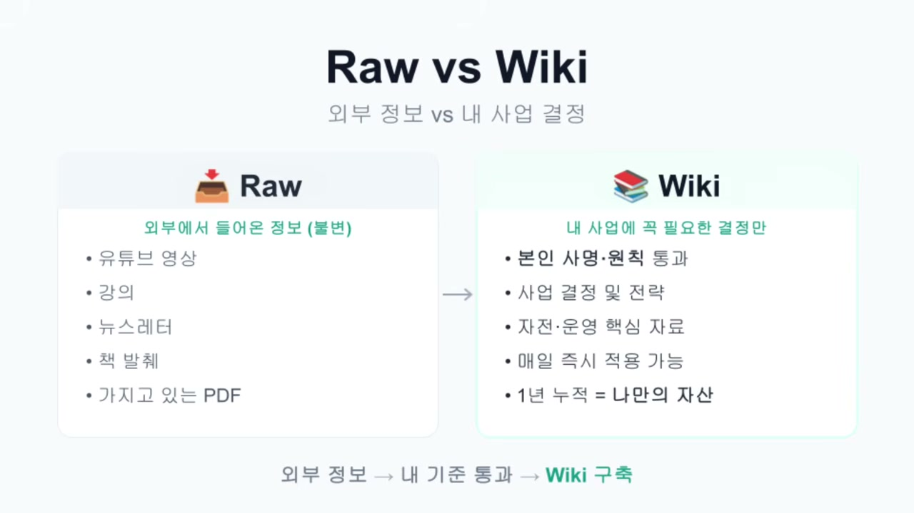

이 구분이 왜 중요한가. 태오는 자기 경험으로 답한다. 이런 거름 과정이 없으면 정보가 머리 위에서 계속 둥둥 떠다닌다. 어떤 게 나한테 진짜 필요한 정보인지 구분이 안 된다. 몇 달 전까지만 해도 그는 정보가 있으면 다 노션에 기록했다. 페이지는 쌓이는데, 돌아보면 "그래서 나한테 중요한 게 뭐지?"라는 생각만 들더라는 것이다.

## 세팅: 두 도구를 같은 폴더에 묶는다

이제 실제로 어떻게 만드는지 보자. 먼저 클로드 코드를 켠다. 태오는 이걸 "터미널에서 작동하는 AI 작업 도구"라고 부른다. 터미널이라는 말에 겁먹을 필요 없이, 내 컴퓨터 폴더에 직접 접근하는 AI 코딩 도구라고 생각하면 된다. 이미 정보를 모아 둔 폴더가 있으면 그걸 열고, 없으면 새로 만든다. 태오는 `Obsidian Business`라는 이름으로 폴더를 만든다.

그 다음 옵시디언을 설치한다. 구글에서 옵시디언을 검색해 설치한 뒤, 첫 화면에서 "보관한 폴더 열기"를 눌러 방금 만든 `Obsidian Business` 폴더를 연다. 빈 화면이 뜨면 연결된 것이다. 이때 비주얼 스튜디오 코드를 보면 같은 옵시디언 폴더가 들어와 있다. 두 도구가 같은 폴더를 가리키게 된 것이다.

도서관 비유로 돌아가면, 사서인 클로드 코드와 이용자로서 옵시디언을 보는 나, 둘이 같은 도서관을 동시에 보는 상태다. 사서가 책 정리하는 걸 내가 실시간으로 보고, 내가 새 책을 가져다 두면 바로 정리해 준다.

폴더를 만드는 건 직접 손으로 하지 않는다. 태오는 프롬프트를 미리 준비해 뒀다(영상 설명란과 커뮤니티에서 받을 수 있다고 안내한다). 카파시의 LLM 위키 원본을 먼저 클로드 코드에 넣고, 그 다음 자신의 로우-위키 프롬프트를 넣어 전송한다. 그러면 클로드 코드가 딱 두 가지를 묻는다.

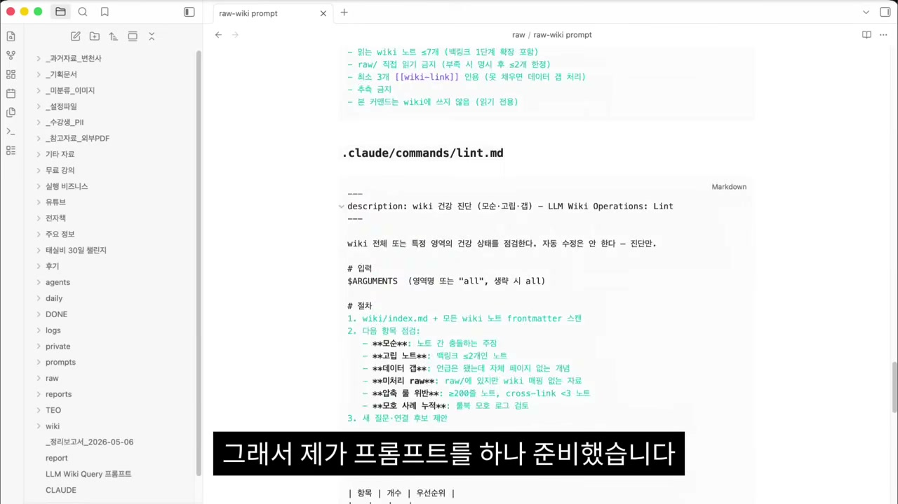

첫째, 본인 사업 활동이 뭐예요? 둘째, 그 일에서 어떤 정보와 자료를 자주 다루나요? 태오는 자신을 "AI 도구를 활용해 본인 사업을 시스템화하도록 돕는 사업"이라 답하고, 자주 다루는 자료로 고객시장 리서치, 콘텐츠 아이디어와 스크립트, 재무 매출 운영 데이터, 학습 자료와 인사이트 네 가지를 든다. 처음이라 막막하면 그가 쓴 답을 그대로 써 보고 거기에 자기 항목을 더해도 된다고 일러둔다.

엔터를 누르면 클로드 코드가 사업 내용과 이 네 영역에 대한 분류 규칙을 자동으로 추론해 보여준다. 도메인 이름은 "AI 사업 시스템화 LLM 위키", 영역은 4개, 키워드도 뽑아 준다. 진입을 결정하는 트리, 영역을 나누는 트리, 압축 규칙까지 만들어 둔다. 사람이 할 일은 읽어 보고 괜찮으면 OK, 아니면 수정 의견을 주는 것뿐이다.

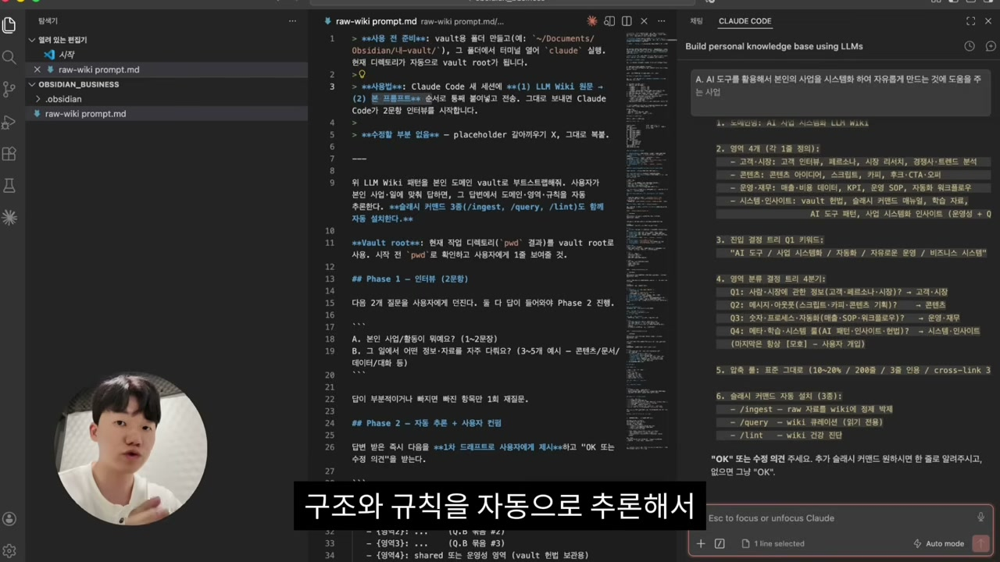

## 운영 체계: 슬래시 커맨드 세 개

태오가 프롬프트에 넣어 둔 것 중 핵심은 슬래시 커맨드다. 이게 LLM 위키 패턴의 운영 체계라고 그는 강조한다. 클로드 코드에서는 자주 쓰는 문장을 단어 하나짜리 단축키로 만들 수 있다. "새 책 가져왔는데 규칙 잘 반영해서 운영해 줘" 같은 긴 지시를, 단어 하나로 줄여 두는 것이다. 매일 쓰는 두 개와 장기 점검용 하나, 총 셋이다.

- `/ingest`: 섭취하다라는 뜻 그대로다. 새 자료를 로우 폴더에 던져 두고 이 명령을 내리면, 위키에 알맞게 분류하고 정리한다.
- `/query`: 문의나 질문을 뜻하고, 개발자 영역에선 특정 정보를 보여 달라고 할 때 쓰는 단어다. 위키에 쌓인 내용 중 "이런 내용 어디 있어?"라고 물을 때 쓴다.
- `/lint`: 소스 코드에서 문법 오류나 잘못된 구조를 찾아내는 단어다. 데이터가 쌓일수록 생기는 잘못된 정보, 미처리 자료, 진단이 필요한 경우를 자동으로 점검한다.

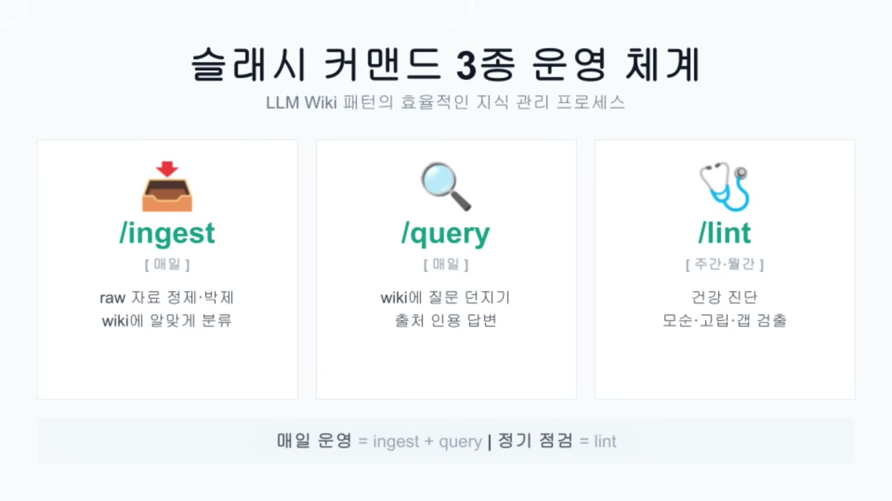

특히 `/query`에 대해 태오는 "이게 진짜 강력하다"고 말한다. 위키는 정보가 쌓일수록 가치가 폭발하기 때문이다. 일주일치는 별거 없어 보여도, 1개월, 3개월, 6개월 쌓이면 그 안의 가치가 커진다. 무언가를 결정하거나 정보를 찾을 때마다 헤매지 않고 바로 꺼내 쓸 수 있다. `/lint`도 처음엔 쓸 일이 적지만, 시간이 쌓이면 반드시 필요한 항목이 된다고 본다.

OK를 누르면 왼쪽 파일 트리에 로우와 위키 폴더, 그리고 지정한 4개 폴더가 생긴다. 이게 내 파인더 폴더에도 똑같이 생긴다. `CLAUDE.md` 파일도, `.claude`의 커맨드 아래 슬래시 명령어들도 자동으로 만들어진다.

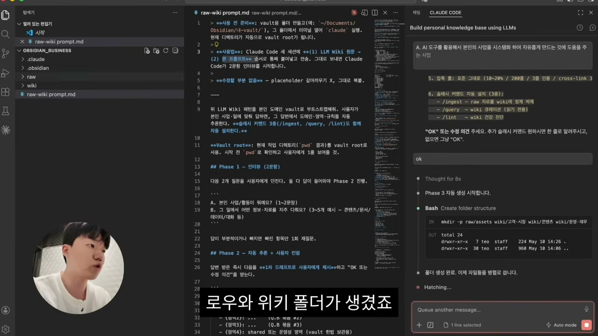

여기서 태오가 친절하게 짚는 함정이 하나 있다. 슬래시 명령어가 설치돼도 바로 `/ingest`, `/query`가 뜨지 않는다. 우리가 직접 만든 것이라 새로고침을 해야 인식되기 때문이다. `Cmd+Shift+P`를 눌러 "개발자 창 다시 로드"를 클릭하면 된다. 그제야 슬래시만 눌러도 `/lint`, `/ingest`, `/query`가 목록에 뜬다.

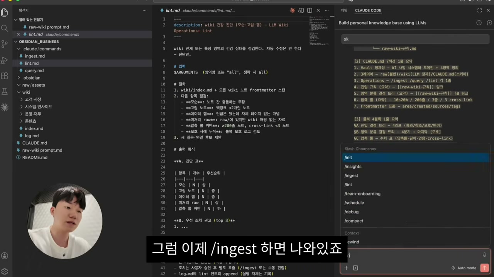

이게 도서관 세팅의 끝이다. 질문 두 개에 답하고, 자동 생성하고, 창을 다시 로드한다. 기다리는 시간 빼면 3분도 안 걸리고, 그것까지 다 합쳐도 10분 정도라고 태오는 말한다.

## 실제로 돌려 보면

세팅이 끝났으니 한 번 돌려 보자. 태오는 자기 채널의 "클로드 코드 30분 완벽 가이드" 영상을 예로 든다. 먼저 그 영상의 스크립트를 통째로 가져온다. 이때 쓰는 게 vidIQ라는 크롬 확장 프로그램이다. 조회수 성장이나 썸네일 정보도 보여주는데, 동영상의 스크립트 버튼을 누르면 전체를 한 번에 복사할 수 있다.

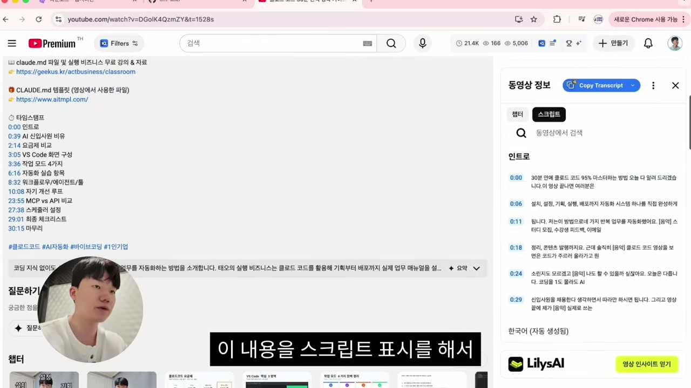

복사한 대본을 클로드 코드에 붙여 넣고 "로우 폴더에 MD 파일 형태로 집어넣어 줘"라고 한다. 그러면 로우 폴더에 대본이 MD 파일로 들어간다. 로우는 날것을 담는 곳이니 여기까지는 그냥 원본 보관이다.

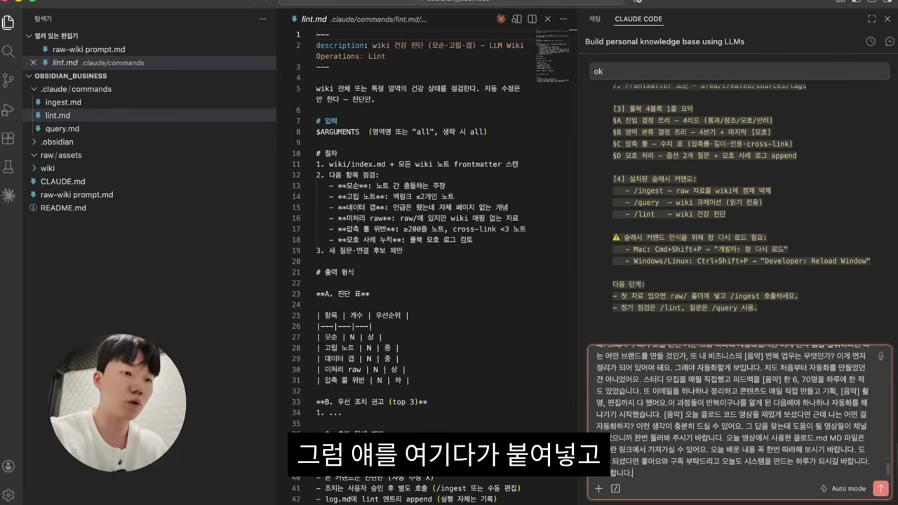

이제 `/ingest`를 명령한다. 30분짜리 영상이라 필요한 내용과 필요 없는 내용이 섞여 있을 텐데, 핵심은 여기다. **예전엔 한 번에 다 분석해서 기록했다면, 이제는 내 룰북 기준으로 나한테 필요한 내용만 뽑아 위키에 저장한다.** 태오의 룰북 기준으로 보면 이 영상은 "시스템 인사이트" 영역에 떨어질 가능성이 높다고 클로드 코드가 미리 짚어 준다.

태오는 여기서 잠깐 멈춰 자기 과거와 지금을 비교한다. 노션 시절엔 정보를 다 기록해 두고, 거기서 진짜 적용할 부분이 뭔지 일일이 골라내야 했다. 그런데 "이거 좋아" 하고 적어 둔 걸 까먹는다. 정보가 너무 많으니까. 거르는 데 쓸 시간과 노력에 한계가 있었던 것이다. 그래서 100을 저장했으면 그중 30 정도만 실제 적용해 성장해 왔다. 지금은 100 중 50, 70 이상을 저장하면서 적용할 수 있는 시대가 됐다고 그는 말한다.

> 저희가 받아들여야 되는 정보의 양은 줄어드는데, 그 밀도는 더 높아지는 거예요.

이 한 문장이 영상 전체를 관통한다. 정보를 더 많이 삼키는 게 아니라, 더 적게 받아들이되 그 적은 양이 전부 쓸모 있게 만드는 것. 그게 옵시디언과 클로드 코드의 결합이 하는 일이라는 게 태오의 주장이다.

`/ingest` 결과가 나온다. 통과, 시스템 인사이트 쪽으로 배정. MD 파일 완성. 그리고 구체적인 숫자가 뜬다. 2000줄이던 원본을 128줄로 압축, 크로스링크 5개, 직접 인용 3개. 30분짜리 영상의 개요를, 이 시스템 위에서는 5분이면 파악할 수 있게 된 셈이다.

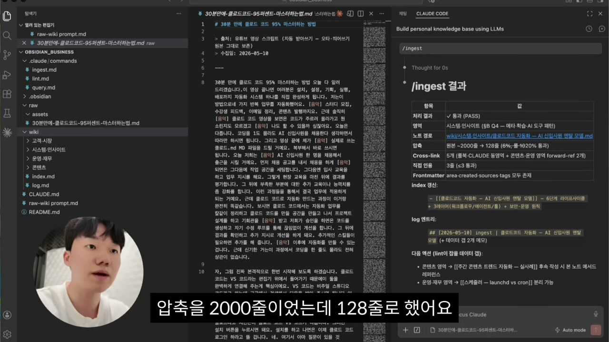

태오가 이 대목에서 보통의 요약 도구와 선을 긋는 부분이 인상적이다. 유튜브 영상을 그냥 요약해 주는 기능은 많다. 하지만 "나한테 진짜 필요한 형식으로 판단해서 정리해 주는 시스템"은 여태 경험하지 못했다는 것이다. 핵심은 요약이 아니라, 내 기준으로 거른다는 데 있다.

정리된 노트를 옵시디언에서 열어 보면, 클로드 코드 자동화, AI 신입사원 멘탈 모델, 6단계 라이프사이클 같은 제목으로 구조가 잡혀 있다. 태그도 알아서 달고, 노트끼리의 연관성도 체크해 준다. 그렇게 그래프가 한 장씩 완성된다.

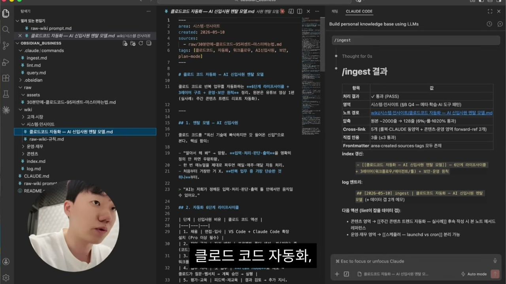

태오는 자기 실제 비즈니스 볼트의 그래프를 보여주는데, 노드가 빽빽이 엉켜 "목성 같고 약간 무섭기도" 한 모습이다. 그래도 하나를 골라 들어가면 연결점이 분명히 있고, 그 연결성을 토대로 내 사업에 무엇이 필요한지 파악할 수 있다.

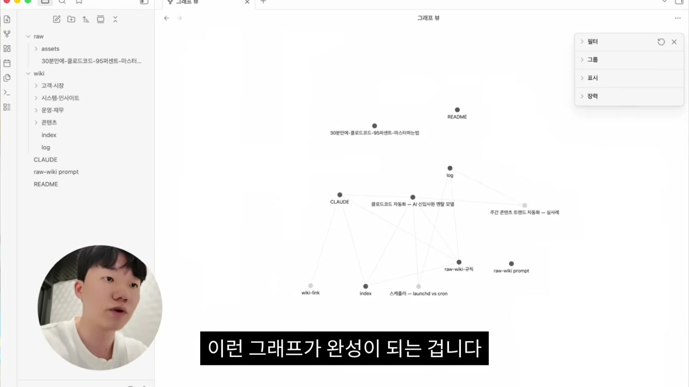

## 한 번 만들면 바깥과도 이어진다

이 구조를 한 번 만들어 두면 외부 서비스와 연결을 더 얹을 수 있다. 예를 들어 특정 유튜버의 매주 올라오는 영상을 자동으로 끌어오고 싶으면, 유튜브 API나 MCP를 클로드 코드에 연결한다. 메일도, 노션 페이지도 마찬가지다. 태오는 실제로 노션 · 이메일 · 유튜브를 다 연결해 뒀다고 말한다.

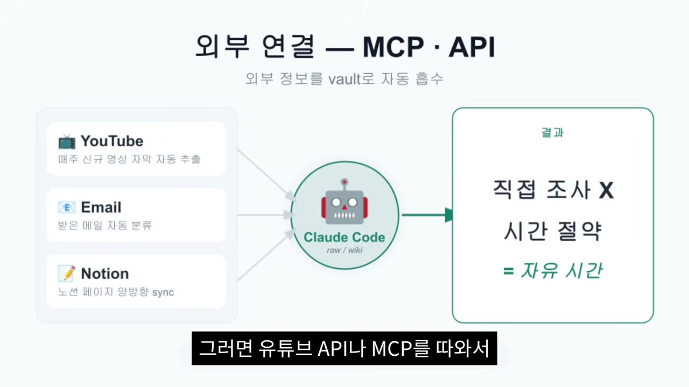

그래서 그는 직접 유튜브를 조사하고, 이메일을 보고, 노션을 일일이 정리하는 시간을 아낀다. 그 아낀 시간이 곧 자유다. 태오가 지금 치앙마이 코워킹 스페이스에서 일하면서 여유를 즐길 수 있는 것도 이 시스템 덕분이라는 게 그의 설명이다.

## 도구가 아니라 필터, 그리고 그가 진짜 하고 싶었던 말

영상의 무게중심은 여기서 기술에서 사람 쪽으로 옮겨간다. 태오는 로우-위키, 슬래시 명령어만 가져가도 좋지만, 그보다 더 중요한 게 있다고 말한다.

1, 2년 전 그는 일에만 파묻혀 살았다. 회사 다니며 새벽 1, 2시까지 일했고, 회사를 나온 뒤에도 일을 손에서 놓지 못했다. 반복 업무, 조사, 리서치, 마케팅, 세일즈, 거기에 공부까지 하느라 시간이 없었다. 그 와중에 비효율도 엄청났다. 새 AI 툴이 나오면 "나 뒤떨어지는 거 아니야?" 하며 강의를 결제해 듣다가, 정작 자기 사업의 기회를 놓친 경험이 많았다고 한다.

그가 솔직하게 털어놓는 자기 점검은 이렇다. 2, 3년 동안 AI 도구를 쫓아다닌 결과, 쓸 수 있는 도구 개수만 늘었지 정작 사업에 도움 되는 건 몇 가지 안 되더라는 것이다. 그래서 그는 결론을 뒤집는다.

> AI 시대의 본질은 새로운 거를 쫓아가는 게 아니에요. 어떤 도구가 내 사업을 돌아가게 만드는지, 어떤 도구가 내 반복 업무를 줄여주는지, 또 어떤 도구가 나를 더 편안하게 만들어주는지, 그 도구를 찾는 게 정말 중요한 것 같습니다.

그가 클로드 코드만 깊이 파는 이유도 그래서다. 실제로 자기 반복 업무를 줄여 줬기 때문이다. 그리고 더 깊은 깨달음이 따라온다. **문제는 정보의 양이 아니라 자기만의 필터가 없었던 것이었다.** 모든 정보를 다 흡수하려 하니 자기 원칙에서 멀어졌다. 내가 누군지, 어디로 가고 싶은지, 누구를 돕고 싶은지를 파악할 시간을, 새로 쏟아지는 정보들이 빼앗고 있었던 것이다.

그러니 이 영상의 진짜 메시지는 옵시디언과 클로드 코드를 결합하라는 게 아니다. 도구 정리는 정답이 아니다. **정보를 자기 원칙으로 변환하는 시스템을 만드는 것**이 핵심이라고 태오는 분명히 한다. 위키 안에 나만의 기준을 세우고, 모든 정보를 그 기준에 맞게 거르는 것. 그렇게 쌓다 보면 아까 본 결정 흐름들이 시각적으로 다 보이게 되는데, 그게 옵시디언의 가장 큰 강점이라는 것이다.

## 위치가 아니라 시스템이 자유다

영상 끝에서 태오는 치앙마이 님만해민 거리를 걷는다. 1년 전만 해도 여기 올 수 없었다. 일이 너무 많았고 번아웃도 왔다. 사업을 운영하긴 했지만 자기 회사의 사장이 아니라 직원이었다고 그는 표현한다. 해야 할 것들을 하느라 시간을 다 썼다. "매출은 들어오는데 시간은 없는 사람", 그게 그였다.

지금은 매출 걱정을 하지 않는다. 어디서든 같은 매출을 낼 수 있기 때문이다. 시스템이 그대로 돌아가고, 자기는 집중할 일에만 집중한 뒤 남은 시간을 자유롭게 쓴다. 그가 던지는 마지막 문장이 이 글의 결론을 대신한다.

> 그 위치가 자유가 아닙니다. 시스템이 자유입니다. 그 시스템 위에 본인의 원칙이 박혀 있으면 어디서든 가능하다고 생각합니다.

치앙마이에서 보내는 시간은 결과가 아니라 그저 시스템이 돌아간다는 증거일 뿐이라고 그는 말한다.

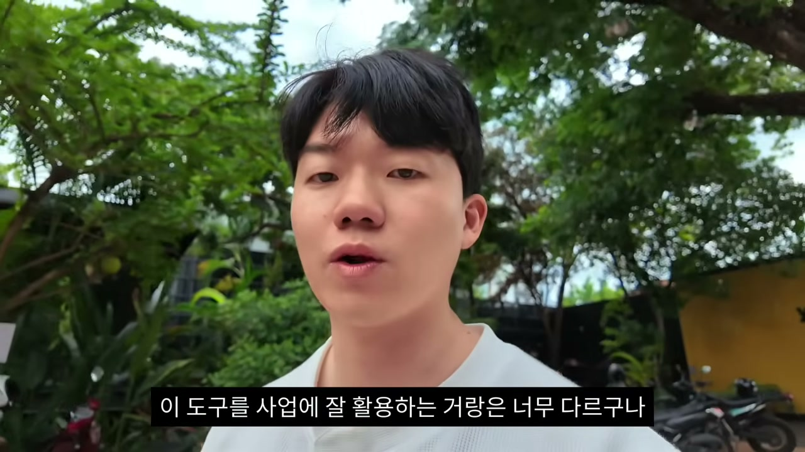

정리하면 이렇다. 옵시디언과 클로드 코드를 같은 폴더에 묶고, 로우와 위키로 정보를 나누고, `/ingest`로 거르고 `/query`로 꺼내 쓴다. 기계적으로 보면 그게 전부다. 하지만 태오가 끝까지 강조하는 건 그 기계 안에 무엇을 채우느냐다. 자기만의 필터, 자기만의 원칙. 그게 없으면 아무리 좋은 도구를 연결해도 정보의 늪에서 빠져나오지 못한다. 도구가 정보를 거르는 게 아니라, 도구에 박아 넣은 내 기준이 거르는 것이다.
