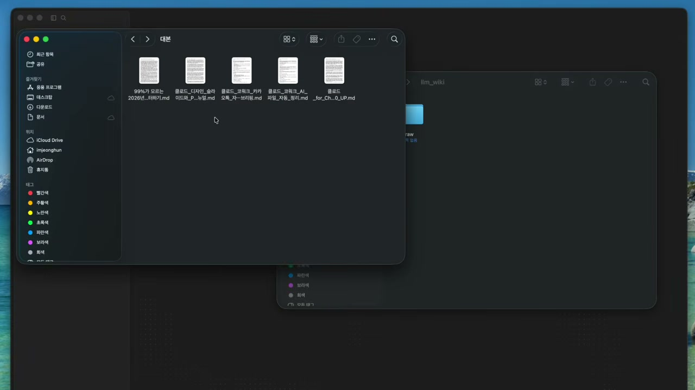
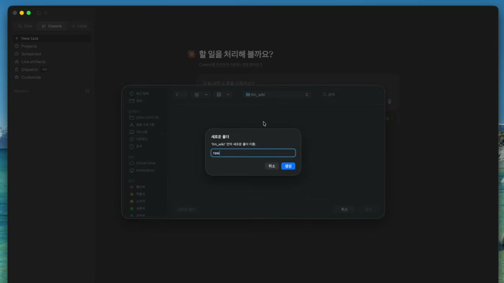
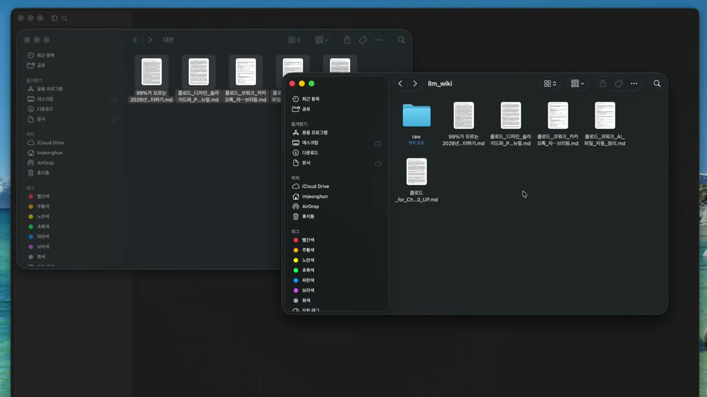
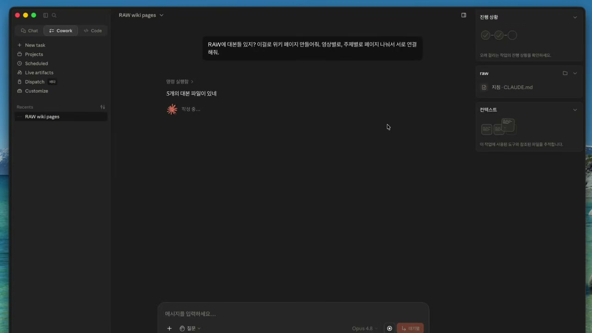
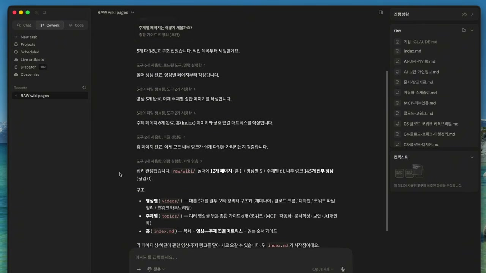
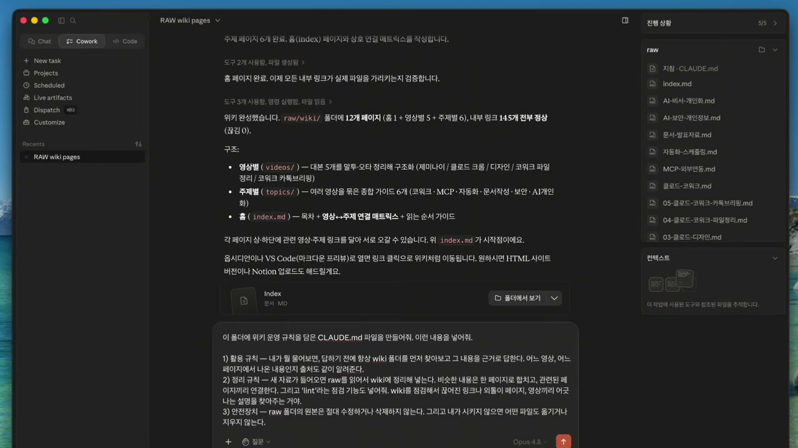
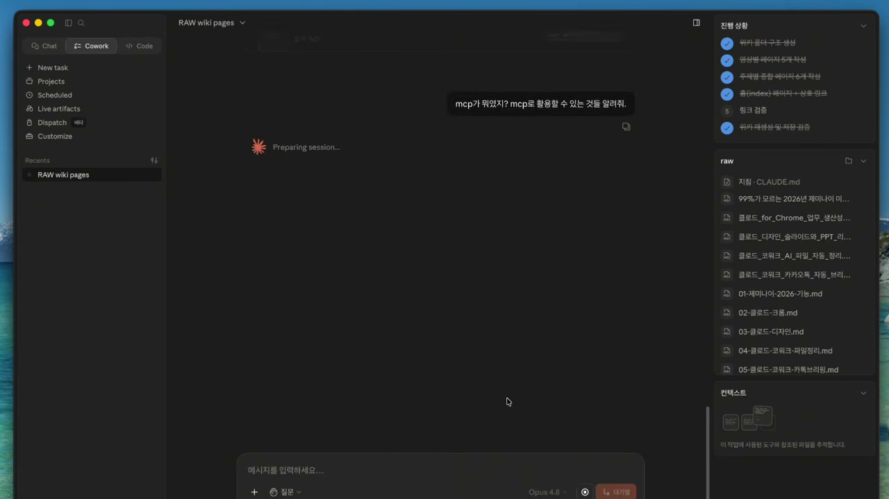
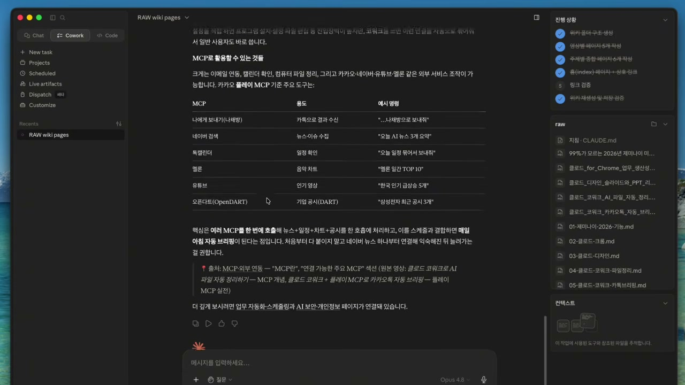
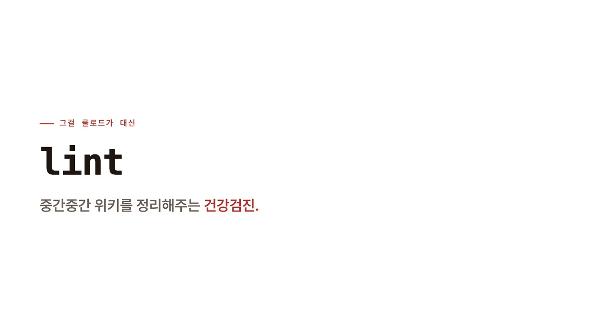

챗봇을 쓰는 방식은 보통 이렇다. 궁금한 게 생기면 그때그때 물어보고, 답을 받고, 창을 닫는다. 다음에 비슷한 게 궁금해지면 또 처음부터 물어본다. 기로(표기 미확인)는 영상에서 자기 자신을 "무조건 그때그때 챗봇한테 물어보기만 하던 검색 처돌이"였다고 표현했다. 위키의 중요성을 알기 전까지는 그랬다는 것이다.

이 영상이 던지는 문제의식은 거기에 있다. AI한테 매번 새로 묻는 것과, 내 자료를 한곳에 쌓아두고 거기서 꺼내 쓰는 것은 전혀 다른 일이라는 것. 그는 이걸 "나만의 LLM 위키"라고 부른다. 그리고 "진짜 이게 기본이 돼야 제대로 된 결과물이 나올 수 있다"고 단언한다.

## 왜 위키인가, 정리가 곧 공부다

먼저 짚을 게 있다. 위키를 만드는 이유가 단순히 "검색이 잘 되게 하려고"가 아니라는 점이다.

기로는 영상 도입부에서 같은 말을 두 번 한다. "위키가 깔끔하게 잘 정리되어 있으면 물론 검색도 잘 되지만, 그걸 정리하는 와중에 내 지식까지 엄청 깊어진다." 검색 편의는 부산물이고, 핵심은 **정리하는 과정 자체가 공부가 된다**는 데 있다. 흩어진 자료를 한곳에 모으고 구조를 잡는 동안, 머릿속의 지식도 같이 정돈된다는 얘기다.

그는 요즘 클로드 코워크를 쓴 이후로 "흩어진 자료 속에서 헤매던 걱정"을 덜었고, 동료나 지인들한테 "너 일처리가 좀 빨라졌다"는 말을 자주 듣는다고 했다. 그러다 최근에 "조금 충격받는 사건"이 있었다고 운을 뗀다. 꽤 많은 사람들이 이 위키의 중요성을 간과하고 있더라는 것. 위키 정리는커녕 자료 관리 자체를 손 놓고 있는 지인들을 보면서, 이걸 알려주고 싶어졌다는 게 영상을 만든 동기다.

도구는 클로드 코워크다. 예전 영상에서 한 번 소개했던 것인데, 그 이후로 "코딩할 줄 몰라도 누구나 쓸 수 있게" 더 쉬워졌다고 한다. 보통 이런 작업은 클로드 코드로 많이 하지만, 클로드 코드는 일반 사람들한테 거부감이 들 수 있어서, 그런 사람도 편하게 쓰라고 나온 게 코워크라는 설명이다. 그는 "사실 저는 개발자인데도 코워크를 훨씬 더 좋아한다"고 덧붙인다.

## 시작하기 전에 정해야 할 한 가지

만드는 법으로 바로 넘어가기 전에, 그가 "사실 제일 중요한 단계"라며 못 박는 지점이 있다. **어떤 데이터를 넣을지, 그리고 그걸 어떻게 활용할지를 먼저 정하는 것**이다.

이게 사람마다 다 다르다는 게 이유다. 누군가는 업무 자료를, 누군가는 공부한 내용을, 누군가는 취미 관련 자료를 넣을 것이다. 데이터의 종류가 다르면 활용법도 달라진다. 그래서 그는 이 부분만큼은 각자 충분히 고민해보고 만들라고 권한다. 영상에서 보여주는 건 어디까지나 "방법"이지, 정답인 데이터 구성이 아니라는 선 긋기다.

그가 시연용으로 고른 데이터는 자기 유튜브 영상이다. 영상을 통째로 넣기는 애매하니, 영상마다 있는 대본을 저장하는 것으로 시작한다. 유튜브에서 대본을 긁어와서, 컴퓨터에 raw라는 폴더를 하나 만들고, 거기에 차곡차곡 쌓아두는 식이다.

## raw 폴더, 손대지 않는 원본 보관소

코워크에 들어가면 가장 먼저 하는 일은 권한 부여다. 코워크가 내 컴퓨터의 특정 폴더에 접근할 수 있게 열어주는 것. 그가 강조하는 건 "제가 지정한 폴더만" 코워크가 드나들 수 있다는 점이다. 전체 컴퓨터가 아니라 내가 연 폴더만이다.

raw 폴더를 만들고 권한을 준 다음, 유튜브 대본을 코워크한테 넘기면서 "raw에 저장해줘"라고 하면 끝이다. 말로 시키면 코워크가 파일로 저장한다.

여기서 그가 따로 시간을 들여 짚는 원칙이 하나 있다. **raw에 들어가는 건 손 안 댄, 긁어온 그대로의 원본 데이터라는 것.** 다듬고 변환한 데이터만 들고 있으면 안 되는 이유를 그는 이렇게 든다. "나중에 뭔가 고치거나 문제가 생겼을 때, 원래 뭐였더라? 하고 기준 삼을 게 사라져버린다." 그래서 원본은 항상 따로 둬야 한다. 그가 직접 정리한 한 문장이 이거다. "raw는 손대지 않는 원본 보관소다."

데이터가 계속 늘어나면 어떻게 추가하느냐는 질문도 미리 받아 답한다. 자동이냐 수동이냐. 그는 지금처럼 그냥 직접 긁어다 넣는 수동 방식을 쓴다. 새 영상을 올리면 그 대본을 raw에 넣어주는 식이다. 마음먹으면 자동으로 들어오게 만들 수도 있지만, "처음에는 복잡하니까" 하나하나 수동으로 넣는 게 오히려 감 잡기에 더 좋다고 한다. 자동화는 감을 잡은 뒤의 일이라는 순서 감각이다.

## 위키 만들기, 한 문장으로 시키면 끝

raw에 대본을 어느 정도 다 넣었으면, 이제 진짜 위키 페이지를 만든다. 여기서 둘의 역할이 갈린다. raw의 원본은 직접 쓰려고 넣은 게 아니다. 위키를 만들기 위한 재료이자, 나중에 문제가 생겼을 때 "원래 뭐였지?" 하고 확인할 기준일 뿐이다. **우리가 실제로 꺼내 쓰는 건 위키다.**

만드는 방법은 코워크한테 가볍게 요청하는 것이다. "raw에 대본들이 있지? 이걸로 위키 페이지 만들어줘. 영상별로, 주제별로 페이지 나눠서 서로 연결해줘." 이렇게 시키면 클로드가 알아서 raw의 대본들을 쭉 읽고, 위키에 페이지를 만들어 정리한다. 영상 하나하나마다 요약 페이지가 생기고, 거기서 다뤘던 개념들은 주제별 페이지로 묶인다.

여기서 누구나 떠올릴 만한 걱정 하나를 그가 먼저 꺼낸다. **"원본이 지저분하면 그 오염된 글 때문에 위키도 같이 망가지는 거 아니냐."** 대본은 말로 한 걸 긁어온 거라 같은 표현이 반복되고 오타도 많은 날것이기 때문이다.

그도 처음엔 걸렸지만, 막상 해보니 괜찮더라고 한다. 위키로 옮길 때 AI가 그런 걸 다 정리하고 고유명사도 통일해서 깔끔하게 만들어준다는 것. 게다가 위키에는 어차피 내가 넣은 자료만 들어가니 엉뚱한 게 섞이지 않는다. 영상끼리 설명이 어긋나는 게 있어도 그건 뒤에 나올 점검 기능이 잡아준다고 미리 예고한다. 원본은 더럽게 두되, 깨끗한 결과물은 AI에게 맡긴다는 분업이다.

그렇게 "제 이름을 단 위키"가 생긴다. 정리하면 흐름은 단순하다. 원본을 raw에 모아두고, AI한테 시켜서 위키에 쌓고, 그렇게 생긴 위키를 꺼내 쓰는 것. 이게 LLM 위키다.

## CLAUDE.md, 위키에 생명을 불어넣는 규칙

그런데 위키를 만들어둔 것만으로는 바로 쓸모가 생기지 않는다. 이 대목이 영상에서 가장 중요한 전환점이다.

"AI가 알아서 이 위키 페이지를 찾아서 답해주지는 않는다." 지금 만들어둔 건 그냥 폴더 속에 마크다운 파일들을 모아놓은 것뿐이기 때문이다. 그래서 AI한테 이걸 활용하라고 규칙을 줘야 한다. 그 규칙을 담는 게 클로드 코드에서 쓰는 CLAUDE.md라는 파일이다. 이 파일이 있으면 작업하기 전에 먼저 이걸 읽고 지침으로 삼아 움직인다. 코워크는 방식이 조금 달라 자체 지침에 넣어도 되지만, 영상에서는 비슷하게 CLAUDE.md 파일을 만들고 "이거 보고 움직여라"라고 알려주는 식으로 간다.

이 파일에 들어가는 건 크게 두 가지다. 하나는 **이 지식을 어떻게 찾고 활용하는지에 대한 규칙**, 또 하나는 **지식이 쌓이고 업데이트될 때 그걸 어떻게 정리할지에 대한 규칙**이다. 위키를 읽는 법과 위키를 가꾸는 법, 두 갈래인 셈이다.

그리고 여기에 안전장치를 하나 더 박아두라고 권한다. raw에 넣어둔 원본 파일은 "절대 수정하거나 삭제하지 않는다"를 규칙에 명시하는 것이다. 이유가 현실적이다. AI가 파일들을 확인하고 정리하는 과정에서 혹시라도 원본을 건드리거나 지울 수 있기 때문이다. 한 발 더 나가서 "시키지 않으면 어떤 파일도 옮기거나 지우지 않는다"까지 넣으면 더 안전하다.

CLAUDE.md를 잘 정리해두면 "그다음부터는 알아서 너무나도 잘 굴러간다"는 게 그의 표현이다. 그러니 "여기는 확실하게 제대로 해놔야 된다." 위키 페이지는 AI가 만들어주지만, 규칙은 사람이 짜야 한다는 무게중심이 여기에 있다.

## 직접 써보기, 채널 전담 직원과 대화하듯

이제 만든 걸 써볼 차례다. 그는 한 가지를 곱씹어보게 한다. 자기 유튜브 데이터로 위키를 만들었으니, 이건 사실상 **"제 유튜브 전용 AI가 하나 생긴" 것**이라는 점이다.

유튜브를 하는 사람이라면 자기가 어떤 영상에서 뭘 다뤘고 뭐라고 말했는지가 다 머릿속에만 있다. 그런데 그게 시간이 지나면 휘발된다. 까먹는다. 위키에 저장해두면 그게 안 날아간다. 내가 뭘 했고, 뭐라고 설명했고, 어떤 지식은 다뤘고 어떤 건 아직 안 다뤘는지를 전부 AI한테 물어보며 관리할 수 있다. 머릿속에 다 담고 있지 않아도, 잊어버려도 괜찮아지는 것이다.

가장 먼저, 가장 자주 쓰는 건 그냥 물어보는 것이다. 내가 만든 자료를 다시 꺼내 거기서 정보를 찾는 것이다. 예를 들어 "MCP가 뭐였지?"라고 물으면, 이전 영상에서 설명했던 내용을 위키에서 찾아 답해준다. 한 발 더 나가 "MCP로 활용할 수 있는 것들 알려줘"라고 물을 수도 있다.

여기서 진짜 값어치가 드러난다. CLAUDE.md에 "답하기 전에 위키를 먼저 보고 답해라"는 규칙을 박아놨기 때문에, AI가 알아서 위키를 뒤져서 답한다. 그냥 일반 챗봇에 묻는 것과 다른 지점이 바로 이거다. 게다가 답할 때 출처도 같이 준다. 어느 영상, 어느 페이지에서 나온 내용인지까지 달아주니 믿고 쓸 수 있다.

그가 특히 마음에 들어 하는 활용이 하나 더 있다. 새로운 기술을 설명하려는데 "이게 이렇게 동작하는 건데 어떻게 비유하면 좋을까?"라고 물으면, 자기가 예전에 썼던 비유들을 참고해 마음에 드는 비유를 들어줄 확률이 높아진다는 것. 이유는 **"제 표현 스타일이 쌓여 있으니까"**다. 위키가 단순한 사실 창고가 아니라, 내 말투와 설명 방식까지 담은 저장소가 된다는 얘기다. 또 영상에서 잘못 안내한 지식이 있었다면 그걸 확인하고 정정하기도 쉬워진다.

이 모든 걸 그는 이렇게 비유한다. "제 유튜브 채널을 같이 관리해주는 관리자랑 대화하는 거예요. 제 채널 전담 직원 한 명이랑 얘기하는 거죠." 영상 데이터를 통째로 그 친구한테 위임해두고, 필요할 때 꺼내 쓰는 셈이다.

## 린트, 위키의 건강검진

위키가 커지면 관리가 문제가 된다. 그는 옵시디언으로 노트 정리를 해본 사람이라면 공감할 거라고 한다. 처음에는 좋다가도, 양이 많아지면 관리하고 유지하는 게 "진짜 일"이 된다는 것. 그런데 그 일을 클로드가 대신 해준다.

그 정리 기능이 린트다. 이것도 CLAUDE.md에 넣어둔다. 쓰는 법은 간단하다. 자료를 한참 넣다가 중간중간 "린트 한번 돌려줘" 한마디 하면 된다.

린트가 하는 일은 두 가지다. 원본과 위키 사이의 싱크를 맞추고, 위키 페이지들끼리 제대로 정리돼 있는지 점검하는 것. 앞에서 "영상끼리 설명이 어긋나도 뒤에서 잡아준다"고 예고했던 그 점검 기능이 바로 이거다. 그는 이걸 "위키가 스스로 건강검진하는 것"이라고 표현한다.

이 효과는 자료가 쌓일수록 두드러진다. 영상이 수십 개로 쌓이고 위키가 커지면, 그때부터 진짜 효율성이 드러난다는 것이다. 작을 때는 굳이 필요 없어 보이지만, 규모가 커질수록 사람 손으로는 감당이 안 되는 지점을 린트가 메운다.

## 해보고 나서 남은 것들

마지막으로 그가 직접 해보며 느낀 점 몇 가지를 편하게 풀어놓는다.

하나는 의외의 지점이다. **막상 손이 제일 많이 간 데가 CLAUDE.md였다는 것.** 위키 페이지야 AI한테 시키면 알아서 만들어주는데, 그걸 어떻게 쓸지 규칙을 정해두는 건 자기가 직접 챙겨야 했다고 한다. "파일을 쌓는다기보다는 규칙을 한번 정해두는 일에 가까웠다"는 정리다. 작업의 무게중심이 데이터 입력이 아니라 규칙 설계에 있었다는 솔직한 회고다.

또 하나는 쓸모가 천차만별이라는 점이다. 결국 어떻게 데이터를 모으고 어떻게 활용할지를 얼마나 잘 짜느냐에 달려 있다. 그는 오늘 영상은 보여주려고 한 거라 활용법을 엄청 고심해 짠 건 아니라고 솔직히 인정한다. 그러면서 "여러분이 진짜 매일 일하는 업무에서 쓰는 데이터를 잘 모아두면 그게 정말 엄청난 자산이 된다"고 말한다. 두고두고 꺼내 쓸 수 있는 자산이라는 것이다.

그리고 그가 영상 전체에서 가장 힘주어 말하는 게 이거다. "자료가 많아지면 관리가 어렵더라" 같은 말들이 있을 텐데, 그것도 결국 직접 겪어봐야 안다는 것. 누가 해봤더니 별로더라 해서 머리로만 아는 것과, 내가 직접 해보다가 "이거 진짜 좀 불편하네" 하고 몸으로 아는 건 "정말 천지 차이"라고 강조한다.

그가 LLM 위키를 정의하는 한 문장은 이렇다. "AI 시대에 내 데이터를 직접 모으고 가공하는 가장 기본적인 행위." 이걸 더 잘 쓰게 해주는 방법이야 앞으로도 계속 나오겠지만, 이 기본기는 한 번쯤 직접 해보고 느껴봐야 한다는 것이다. 그 자신도 "이런 거 해야지" 하면서 막막해서 한참 미뤘었는데, 막상 하나씩 해보니 "정말 별거 아니더라"고 한다.

그래서 그의 권유는 부담을 덜어주는 쪽이다. "와 이거 위키로 만들면 대박이겠다" 싶은 데이터가 당장 안 떠올라도 괜찮으니, 가벼운 거 하나 실험 삼아서라도 해보라는 것. 그렇게 하다 보면 "어느새 나만의 두 번째 뇌가 생겨 있을 거고, 분명히 직접 해봐야지만 얻어가는 게 있을 것"이라는 말로 영상을 맺는다.
