
<iframe src="https://www.youtube.com/embed/wXc7-vFSd5U" title="YouTube video player" frameborder="0" allow="accelerometer; autoplay; clipboard-write; encrypted-media; gyroscope; picture-in-picture; web-share" referrerpolicy="strict-origin-when-cross-origin" allowfullscreen></iframe>

업무하면서 쌓인 경험, 책을 읽고 배운 점, 업계 동향을 조사하며 느낀 점. 이런 것들이 다 내 머릿속에만 있다. 그래서 AI한테 뭘 물어볼 때마다 매번 처음부터 내 상황을 설명해줘야 한다. "나는 이런 일을 하고 있고, 이런 맥락이 있고…" 이 설명을 어제도 했고 그제도 했다.

영상 속 화자인 시민개발자 구씨가 던지는 질문은 여기서 시작한다. 내가 터득한 노하우를 어딘가에 저장해두고, 그걸 AI한테 통째로 주입해서 쓸 수는 없을까. 그가 이번에 소개하는 건 그 저장소를 사람이 아니라 AI가 직접 만들어주는 방식이다. 우리는 자료만 던져놓고, 정리는 AI한테 맡긴다.

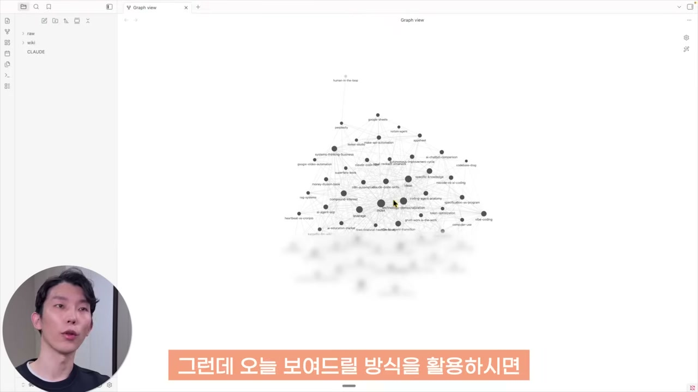

위 화면에서 각각의 점 하나가 지식 페이지 하나다. 어떤 지식이 다른 어떤 페이지와 관련이 있는지를 선으로 이어 보여준다. 점 하나를 눌러 들어가면 실제로 정리된 내용이 나온다. 핵심은, 이 페이지들을 구씨가 직접 쓴 게 아니라는 점이다. AI가 작성했고, 사람은 보고 쓰기만 한다.

## 며칠 전 카파시가 공개한 아이디어

이 시스템의 출발점은 안드레이 카파시다. 테슬라에서 AI 총괄을 맡았고 오픈AI 창립 멤버이기도 한 사람인데, 2026년 4월 초에 'LLM 위키'라는 걸 GitHub에 공개했다. 내용 자체는 간단하다. AI를 써서 나만의 지식 베이스를 만드는 시스템이다.

다만 여기엔 한 단어로 요약되는 핵심이 있다. 지식이 복리로 쌓인다는 것이다. 그냥 자료를 모아두는 게 아니라, 모인 자료끼리 서로 연결되면서 시간이 갈수록 가치가 불어난다. 이 복리를 만들어내기 위해 LLM 위키는 세 개의 층으로 설계되어 있다.

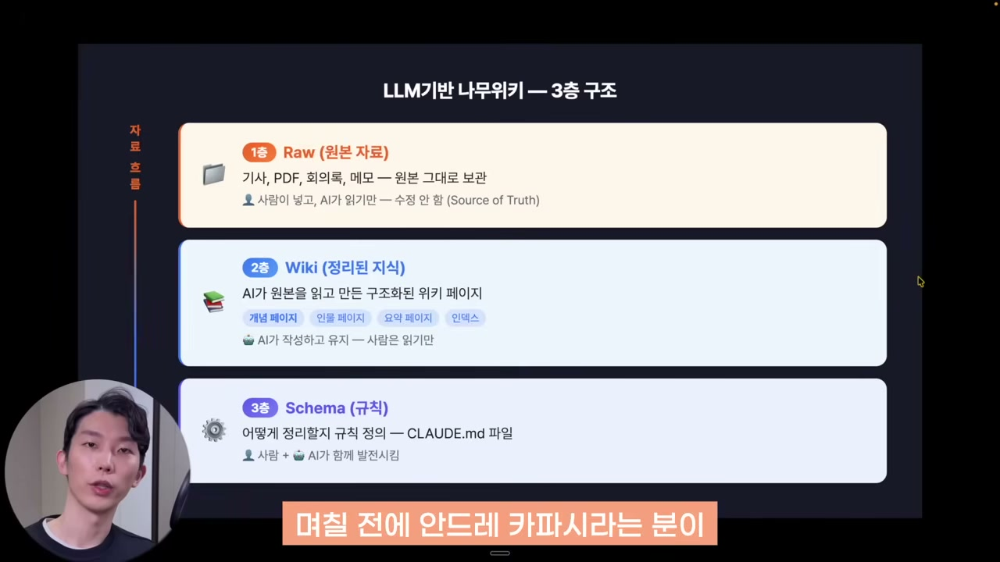

**1층은 로우 데이터다.** 기사, PDF, 회의록, 메모처럼 내가 가진 원본 지식을 그냥 다 넣어두는 폴더다. 가공하지 않은 날것 그대로다.

**2층은 위키다.** 1층에 넣어둔 원본을 AI가 읽고, 나무위키 페이지처럼 정리해준다. 인터넷의 나무위키 문서를 누군가가 정리해 올려두는 것처럼, 그 작업을 AI가 한다. 그리고 단순히 개별 페이지만 만드는 게 아니라, 한 페이지에 등장하는 키워드나 개념이 다른 페이지에 있으면 거기에 링크를 걸어준다. 이 상호 참조 작업까지 AI가 맡는다.

**3층은 스키마, 즉 규칙이다.** 클로드 코드에서는 보통 `CLAUDE.md` 파일로 시스템이 어떻게 작동했으면 좋겠는지를 정의하는데, 여기에 로우 데이터를 어떻게 쌓고 어떤 방식으로 위키를 만들지 그 프로세스를 적어둔다. 이 규칙만 한 번 정해두면, 그다음부터 사람은 1층에 자료를 넣는 일만 하면 된다. 2층 위키는 규칙에 따라 자동으로 생성된다.

여기서 한 발 더 나아간 장치가 있다. 지식을 쌓다 보면 잘못된 정보, 너무 오래된 정보, 이제는 관련성이 떨어지는 정보가 섞인다. 서로 모순되는 내용도 생긴다. 카파시는 이걸 점검하는 작업을 '린트(lint)'라고 부른다. 비개발자 입장에서는 내 지식에 대한 건강검진이라고 보면 된다. 주기적으로 문제가 있는 부분을 체크하고, 그것도 AI를 써서 수정하고 업데이트한다.

## 옵시디언으로 안 됐던 이유

사실 위키 형태로 업무 지식을 쌓는다는 발상 자체는 새롭지 않다. 옵시디언이라는 도구가 한때 '세컨드 브레인'으로 각광받았다. 구씨도 예전에 시도해봤고, 영상으로 만들어볼까 해서 테스트를 꽤 했다고 한다.

그런데 결국 영상으로 만들지 못했다. 이유는 단순하다. 시간이 지날수록 업데이트하는 게 너무 귀찮아졌기 때문이다. 페이지를 만드는 것까지는 괜찮은데, 문제는 그다음이다. 페이지끼리 링크를 열심히 교차 참조로 걸어줘야 하는데, 문서가 많아질수록 이 교차 참조가 감당하기 힘든 작업이 된다. 그래서 열심히 하지 않게 되고, 결국 시스템이 죽는다.

이 시스템의 장점이 바로 거기에 있다. 그 귀찮은 작업을 AI가 다 대신 해준다. 사람은 로우 데이터만 잘 넣어주면 된다. 역할을 나눠보면 이렇다. **옵시디언은 뷰어, 클로드 코드는 로우 데이터를 정리해 위키를 만드는 편집자, 그렇게 완성된 나만의 나무위키가 내 업무 지식 페이지가 된다.**

## 노트북LM, RAG와는 뭐가 다른가

여기까지 들으면 자연스럽게 떠오르는 의문이 있다. 그냥 노트북LM 쓰거나 RAG 시스템 만들어서 쓰는 거랑 뭐가 다른가.

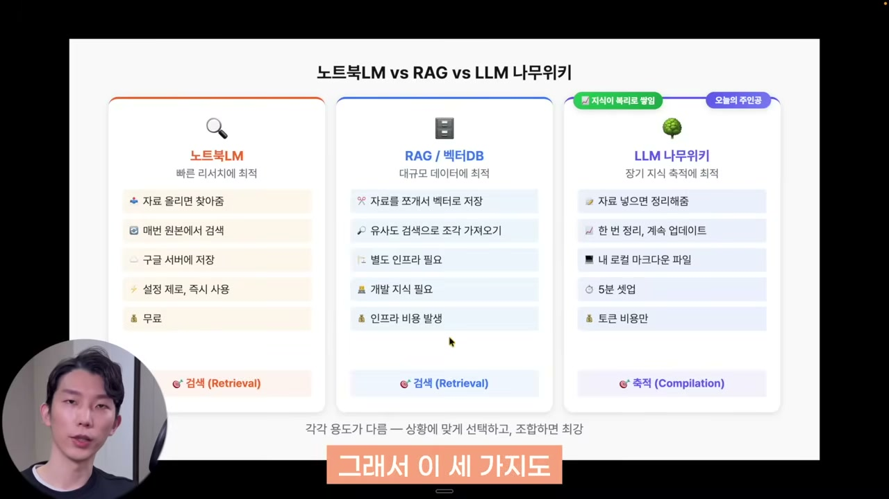

**노트북LM**은 구글이 만든 RAG 기반 서비스다. 관심 있는 자료를 업로드해두고 질문하면, 올려놓은 소스를 바탕으로 똑똑하게 답해준다. 팟캐스트나 인포그래픽, 슬라이드, 스프레드시트까지 만들어준다. 새로운 지식을 학습할 때 유용하다.

**RAG 시스템**은 좀 더 기술적이다. 대용량 파일을 잘게 쪼개서 벡터라는 숫자로 변환해 데이터베이스에 저장한다. 그러면 내가 질문했을 때 알고리즘이 그 질문과 가장 유사한 정보를 찾아 조합해서 AI한테 넘겨준다. 다만 바이브 코딩으로 만들더라도 설정이 까다롭고, 계속 쌓아나가려면 인프라 비용도 꽤 든다. 그래도 기업에서 수십만 건 이상의 문서를 다뤄야 할 때는 여전히 유효한 기술이다.

문제는 이 두 시스템의 성격이다. 둘 다 **지식을 '찾는' 걸 도와주는 도구지, 지식이 축적돼서 복리를 일으키는 구조는 아니다.** 바로 이 지점이 LLM 나무위키의 차별점이다.

LLM 나무위키는 데이터를 쌓는 방식 자체가 다르다. 자료를 넣으면 AI가 한 번 읽고 정리해준다. 그리고 새 정보가 들어오면 기존에 정리된 자료 '위에' 얹힌다. 새 자료가 들어왔다고 무조건 새 위키를 만드는 게 아니다. 이미 있는 페이지에 보완만 하는 게 낫다고 AI가 판단하면, 새 페이지를 만드는 대신 기존 페이지에 내용을 추가한다. 독립적인 페이지를 계속 찍어내는 게 아니라, 가진 페이지를 점점 풍부하게 키워가는 형태다.

게다가 RAG처럼 인프라가 필요하지도 않다. 옵시디언 앱 하나로 내 로컬에 마크다운 파일로 저장만 하면 돌아간다. 훨씬 가볍고, 데이터를 내가 완전히 통제할 수 있다. 그래서 결론은 용도가 다르다는 것이다. 개인이나 작은 조직에서 우리만의 노하우를 쌓고, 디벨롭하고, 그걸 AI한테 주입해 내 맥락에 맞는 답을 받고 싶을 때, 이 시스템이 빛을 발한다.

## 실제로 구축해보기

필요한 건 딱 두 가지다. 옵시디언과 클로드 코드.

옵시디언을 설치한 다음, 하단의 Vault 옵션에서 Manage Vault, Create New Vault를 누른다. 이름을 정하고, 내 로컬 PC 어디에 저장할지 지정하면 볼트가 생성된다. 구씨는 '구시위키'라는 폴더로 볼트를 만들었다. 이 볼트 안에서 로우 데이터를 쌓고 위키를 만들게 된다.

볼트를 만들었으면 나머지 작업은 거의 다 클로드 코드에서 한다. 구씨는 VS Code를 깔고 그 안에 터미널 버전으로 클로드 코드를 띄웠다. 핵심은 **클로드 코드를 옵시디언 볼트와 같은 폴더에서 실행**하는 것이다. 그래야 클로드 코드가 작업한 결과가 옵시디언에도 그대로 보인다. 둘은 같은 로컬 폴더를 바라보고 있는 셈이다.

이제 프롬프트로 작업을 요청한다. "나만의 지식 노하우 위키를 만들어줘"라고 하면서, 카파시의 위키 아이디어가 담긴 GitHub Gist 링크를 함께 걸어준다. AI가 그걸 참고하게 하는 것이다. 그 아래에는 본인의 도메인을 적어준다. 나는 어떤 일을 하고, 어떤 로우 데이터를 넣을 거니까 그걸 위키로 만들어달라고. 마지막으로 로우 폴더, 위키 폴더 같은 파일 구조를 간단히 설명해준다.

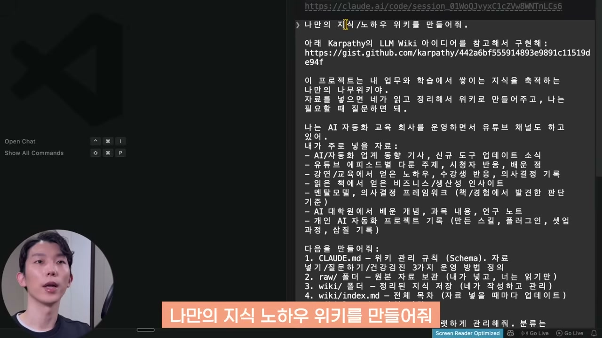

그러면 클로드 코드가 구조를 한 번에 만들어준다.

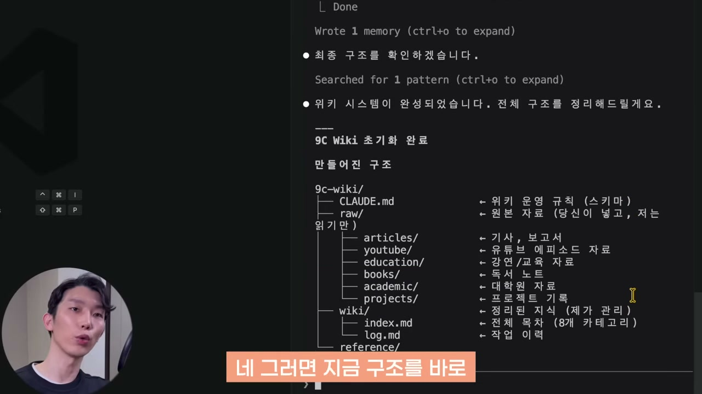

운영 규칙을 담은 `CLAUDE.md`가 있고, 로우 폴더 안에는 내용별 하위 폴더가, 위키 폴더 안에는 목차 역할을 하는 인덱스 파일이 생긴다. 나중에 질문해서 답을 받을 때 이 인덱스가 있어야 효율적으로 검색된다. 작업 이력을 남기는 로그 파일과, 사업 방향을 적어두는 비즈니스 컨텍스트 파일도 만들어졌다. 정리하면, 로우 폴더에 파일을 넣으면 위키 페이지를 생성하고, 교차 참조를 걸고, 인덱스와 로그를 갱신하고, 건강검진으로 모순이나 노후화를 점검해 고친다. 이 모든 규칙이 한 번에 깔끔하게 세팅된 것이다.

이대로 써도 되지만 입맛에 맞게 고쳐도 된다. 구씨는 로우 데이터를 하위 폴더로 나누는 걸 별로 의미 없다고 봤다. 어차피 자기가 로우를 직접 들여다볼 일은 거의 없고 AI한테 질문만 하는데, AI가 로우를 확인할 때 폴더로 구분돼 있으면 하위 폴더를 또 찾아 들어가야 하기 때문이다. 그래서 하위 폴더 없이 평평하게 저장하도록 바꿨다. 처음 설정이 좀 어긋나도 클로드 코드한테 시키면 알아서 정리해주니 걱정할 게 없다.

## 로우 데이터 채워 넣기

시스템은 다 만들었으니, 이제 어떤 자료를 넣을지가 문제다.

가장 간단한 건 업계 동향 기사다. 이걸 옵시디언에 손쉽게 넣으려면 '옵시디언 웹 클리퍼'를 설치하면 좋다. 크롬에 추가하면 된다.

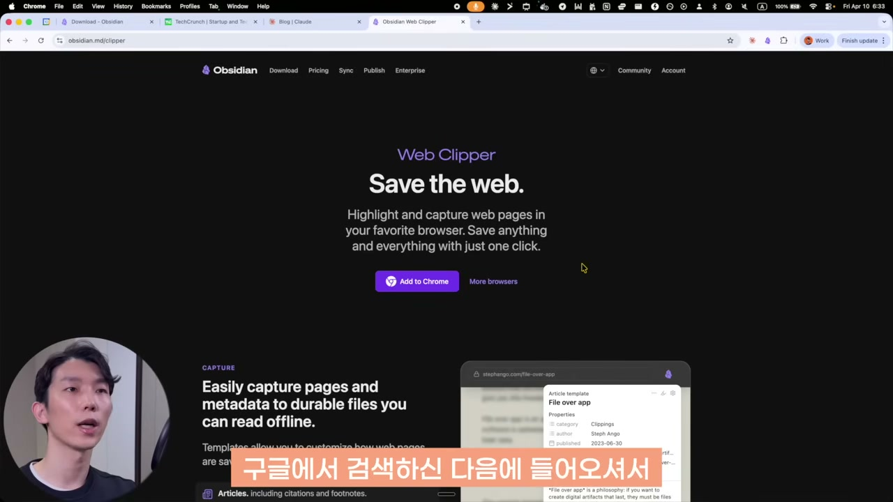

설정에서 노트 저장 위치를 로우 폴더로 지정해두고, 챗GPT가 100달러 플랜을 출시했다는 기사를 보고 있다면 웹 클리퍼로 'Add to Obsidian'을 누른다. 그러면 기사 내용이 곧장 구시위키의 로우 폴더로 들어온다. 관심 있는 기사 몇 개, 유용한 클로드 블로그 글 몇 개를 이런 식으로 추가한다.

직접 클리핑하지 않고 클로드 코드한테 맡기는 방법도 있다. 자주 들르는 사이트가 있다면 "이 사이트들에서 새 정보가 나오면 항상 로우 폴더에 추가해줘"라고 파이프라인을 짜둘 수 있다. 또는 웹서치로 직접 검색해서 넣게 할 수도 있다. 구씨는 "AI 자동화나 바이브 코딩 강의 가격이 궁금하다"며 클로드 코드한테 검색해 로우에 넣어달라고 요청한다. 그러자 클로드가 크롬을 직접 띄워 브라우저를 조작하며 자료를 찾는다.

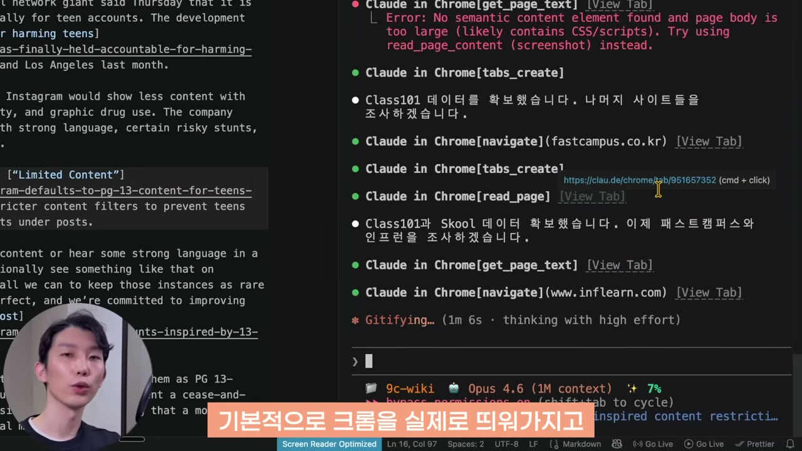

링크 몇 개만 주면 클로드 크롬이 리서치해서 문서까지 만들어준다. 직접 정리하면 시간이 꽤 걸릴 일을, 링크만 주고 바로 끝낸다. 이렇게 만든 문서가 다시 로우가 되어 위키 재료가 된다.

여기에 본인 업무와 직결된 자료를 더한다. 프로젝트 설명, 페르소나 같은 것들. 구씨는 유튜브 콘텐츠를 만드니 기존 대본들을 로우에 넣었다. 마크다운이 아니어도 PDF나 이미지처럼 AI가 읽을 수 있는 포맷이면 다 된다. 책을 읽으며 기억하고 싶었던 부분이나 인사이트를 정리한 노트도 함께 넣는다. 이 대목이 나중에 결정적으로 작동한다.

## 핵심부터 심고, 나머지는 자동으로

로우를 채웠으면 위키를 생성할 차례다. 그런데 구씨는 한 번에 다 돌리지 않고, 먼저 기둥이 될 핵심 페이지부터 선별해 반영해달라고 한다. 이유가 있다. 정보가 100개 있을 때 그냥 무작위로 넣는 것보다, 카테고리별로 중심이 될 핵심 페이지를 먼저 세워두면, 그다음 자료들이 추가될 때 그 기둥을 중심으로 상호 참조가 훨씬 잘 걸리기 때문이다.

그래서 "10개를 선별해 위키에 반영해줘"라고 요청한다. 약 100개의 로우 파일 중에서 내용 풍부도, 카테고리 다양성, 교차 연결, 잠재력을 기준으로 10개가 추려지고, 그 10개로 위키 페이지가 만들어진다.

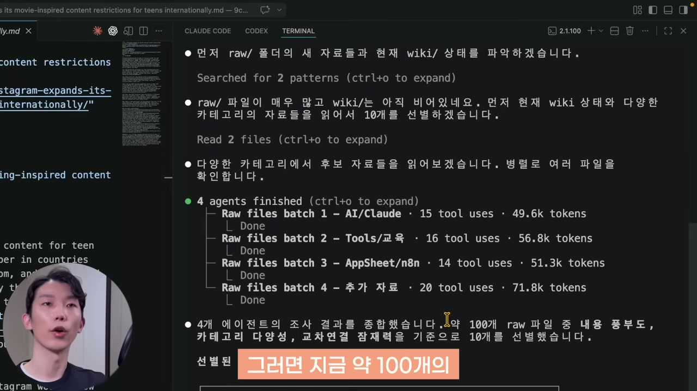

핵심을 심었으면 나머지 100개를 처리할 차례다. "로우에 새로 나온 자료 10개를 찾아 위키에 반영해줘"라고 한다. 이때 LLM 위키의 진짜 장점이 드러난다. 서로 다른 자료 사이에서 의외의 연결점을 찾아낸다는 것이다. 그래서 "의외의 연결점이 있다면 적극적으로 연결해줘"라는 당부도 붙인다.

흥미로운 건, 자료 10개를 넣었다고 위키가 항상 10개 생기는 게 아니라는 점이다. 한 번은 위키 페이지가 7개로 줄었다. 필요한 지식만 추려 페이지를 만들고, 위키로 만들기 적합하지 않은 파일은 건너뛰되 '처리한 목록'에는 올려둬서 중복 처리되지 않게 한다. 이렇게 10개씩 잘라 반복하면 효율적으로 전체를 소화할 수 있다.

매번 손으로 요청하기 귀찮다면 루프로 돌리면 된다. 한 번 처리에 10분쯤 걸린다 치면, 10분 간격으로 "로우에 새로 넣은 자료 10개를 찾아 위키에 반영하고, 의외의 연결점이 있으면 적극 연결해줘"라는 프롬프트를 자동으로 돌린다.

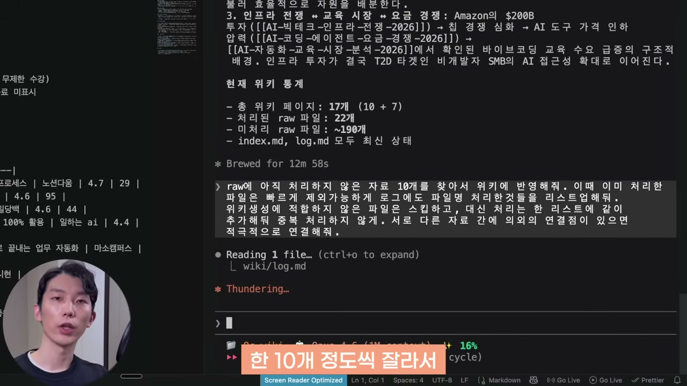

이렇게 걸어두면 일주일 정도는 위키 갱신을 신경 쓸 필요 없이, 옵시디언에 로우 데이터만 계속 던져두면 된다. VS Code에 들어올 일도 없다. 루프가 끝나면 프롬프트를 다시 한 번 넣어주면 또 일주일이 자동으로 돌아간다.

## 복리가 드러나는 순간

이제 만들어진 위키를 실제로 써볼 차례다.

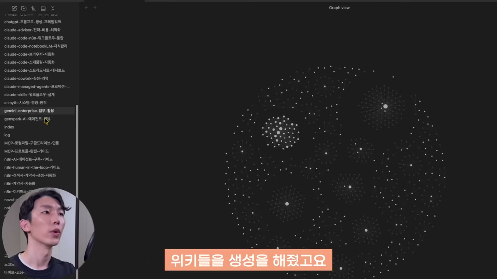

옵시디언에 들어가면 로우를 바탕으로 만들어진 위키가 보인다. 가령 '노트북LM 활용 튜토리얼' 페이지는 구씨 대본 기반으로 작성된 것인데, 하단에 관련 페이지들이 늘 함께 나열된다. 그래프를 보려면 단축키(맥은 Command+G, 윈도우는 Control+G)를 누른다. 그런데 로우 데이터까지 다 섞여 있어 너무 복잡하니, 설정 탭에서 필터에 `path:wiki`를 입력해 위키 문서만 남긴다. 그러면 클로드 코드가 만든 위키 페이지들만 남아, 이것들이 어떻게 연결돼 있는지 한눈에 보인다. 이게 바로 나만의 나무위키다.

다만 실제 활용은 이 그래프를 들여다보는 것보다, 클로드 코드에서 직접 질문하는 쪽이다. "위키를 참고해서 의외의 연결점이나 내 사업에 적용할 인사이트가 있으면 알려줘"라고 하면, 개별 페이지에서는 안 보이지만 여러 페이지를 겹쳐놓으면 드러나는 연결점 5가지를 정리해준다.

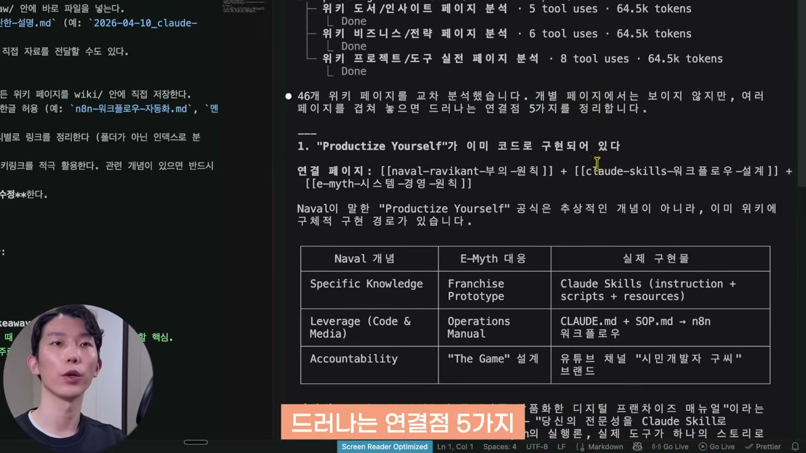

여기서 한 걸음 더 들어가면 복리의 힘이 분명해진다. 구씨가 던진 질문은 이렇다. "내가 읽은 책에서 배운 것 중에 교육사업 가격 전략에 적용할 멘탈 모델이 있어." 앞서 로우에 강의 가격 데이터도 넣었고, 읽은 책의 멘탈 모델도 노트로 넣어뒀다. AI는 이 둘을 조합해 답한다.

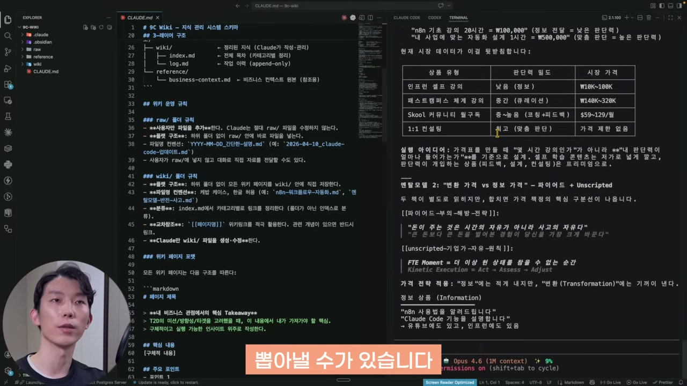

답변의 골자는 이랬다. 가격표를 만들 때 '몇 시간짜리 강의인가'가 아니라 '내 판단력이 얼마나 들어가는가'를 기준으로 설계해야 한다는 것. 거기에 '변환 가격', '정보 가격' 같은, 구씨가 읽은 책에 있던 개념을 자기 비즈니스에 맞춰 적용해준다. 이게 핵심이다. 그냥 가격 데이터만 넣고 전략을 물으면 답은 잘 해준다. 하지만 **내 맥락, 내가 중요하게 여기는 지식을 바탕으로 한 답은 아니다.** 위키를 관리해두고 물으면, 나에게 커스텀된 답과 내가 원하는 인사이트가 나온다. 내가 쌓은 사고 모델을 AI가 공유받아 그 모델로 답하는 것이다.

## 솔직한 한계, 그리고 건강검진

구씨는 이 시스템에도 분명한 한계가 있다고 못 박는다.

**첫째는 토큰 비용이다.** AI가 자료를 읽고 위키를 만드는 과정, 특히 교차 참조를 많이 거는 과정에서 토큰을 많이 쓴다. 페이지가 늘수록 교차 참조 계산에 토큰이 더 든다. 맥스 플랜이면 괜찮지만 프로 모델이면 사용량 압박을 받을 수 있다. 다만 예시에서는 자료를 막 넣었을 뿐이고, 실제로는 진짜 노하우로 남기고 싶은 문서만 선별해 넣으면 개인이나 작은 조직에서는 무리가 없다는 게 그의 판단이다.

**둘째는 규모의 한계다.** 수백 페이지까지는 잘 작동하지만, 마크다운 문서가 수만 개가 되면 제대로 돌아가기 어렵다. 그땐 결국 벡터 데이터베이스로 가야 한다. 카파시도 이 한계를 언급한 바 있다.

**셋째는 정보의 노후화다.** AI 업계는 6개월 전엔 맞는 말이었는데 지금은 상황에 맞지 않는 주장이 흔하다. 그래서 지속적인 업데이트가 필요한데, 이게 바로 앞에서 말한 건강검진 규칙이다.

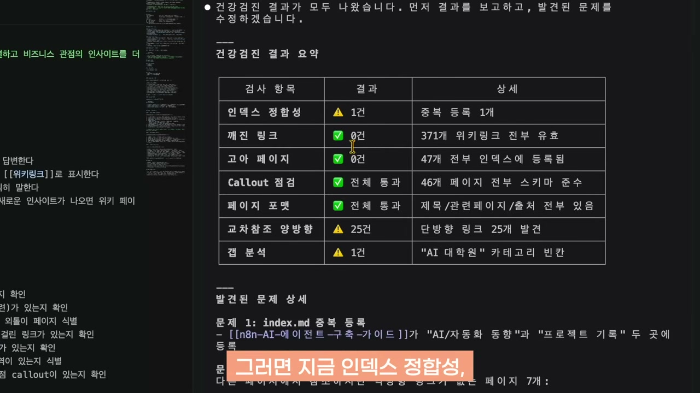

`CLAUDE.md`에 건강검진 규칙을 넣어뒀기 때문에, "위키 건강검진 한번 하자"고 하면 클로드 코드가 문서를 훑어 모순이나 노후화된 정보를 찾아 제안해준다. 인덱스 정합성, 교차 참조 양방향성, 갭 분석 같은 항목을 점검하고 개선 작업까지 진행한다. 옵시디언으로 세컨드 브레인을 만들다가 결국 포기하게 만들었던 그 '업데이트의 귀찮음'을, 이번엔 시스템 안에 규칙으로 박아넣은 셈이다.

## 정리

정리하면 이렇다. 수백만 건의 문서를 다 넣어두고 검색해야 하는 상황에는 비효율적인 시스템이 맞다. 하지만 개인이나 소규모 팀이 업무 지식을 복리로 쌓아 활용하고 싶을 때는 가성비가 매우 좋다.

장점은 분명하다. 꼭 기억하고 싶은 자료를 로우 폴더에 그냥 기계적으로 넣어주기만 하면, 클로드 코드가 알아서 의미 있는 위키를 만들고, 그걸 바탕으로 내 상황에 맞는 답을 해준다. 지식이 복리로 쌓이니 쓰면 쓸수록 더 유용해진다. 세팅도 간단하다. 옵시디언 설치하고, 폴더 하나 만들어 Open Folder as Vault로 추가하고, 클로드 코드한테 작업을 요청하면 끝이다.

옵시디언이 한때 약속했지만 사람의 손으로는 지켜내지 못했던 세컨드 브레인을, 이번엔 그 귀찮은 정리와 연결을 AI한테 떠넘기는 방식으로 다시 시도하는 것이다. 결국 남는 질문은 하나다. 내 머릿속에만 있던 노하우 중 어떤 것을, 가장 먼저 나만의 나무위키로 옮겨볼 것인가.
