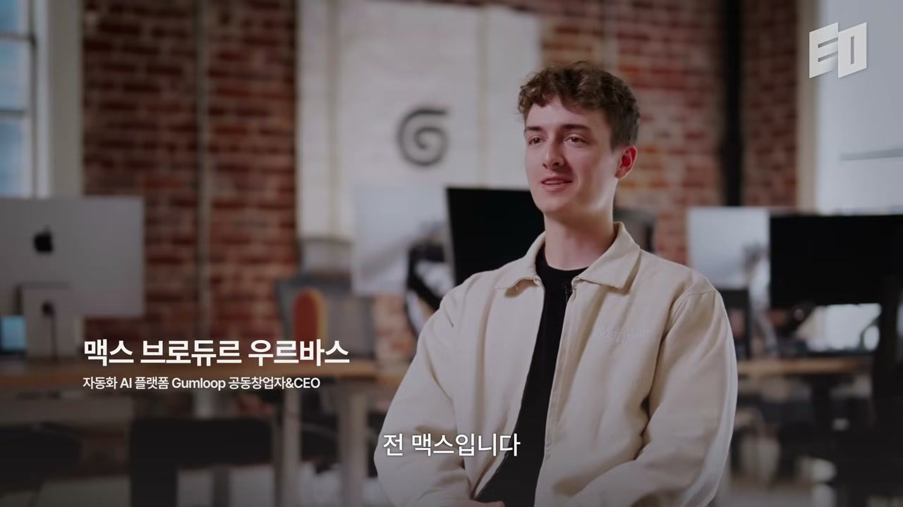
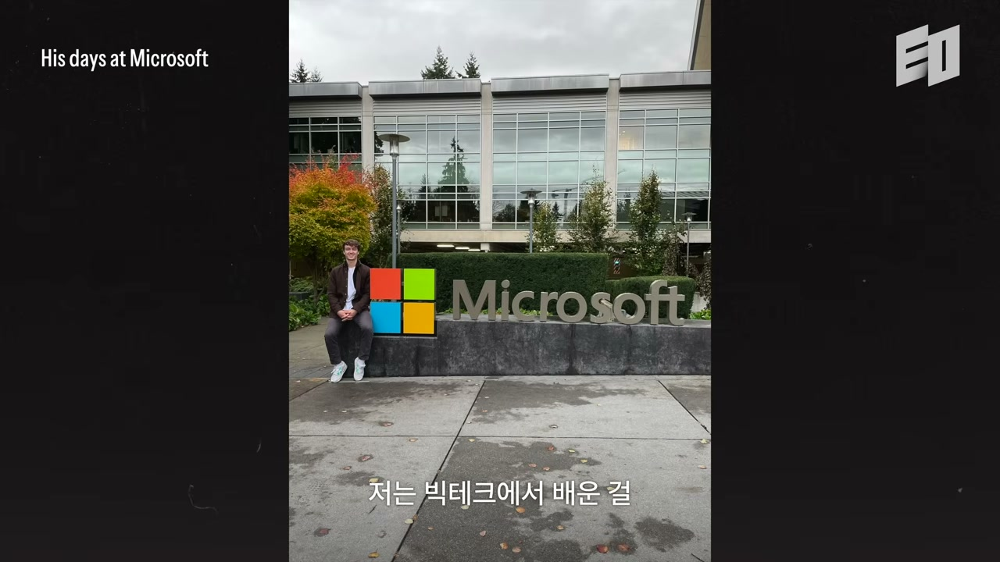
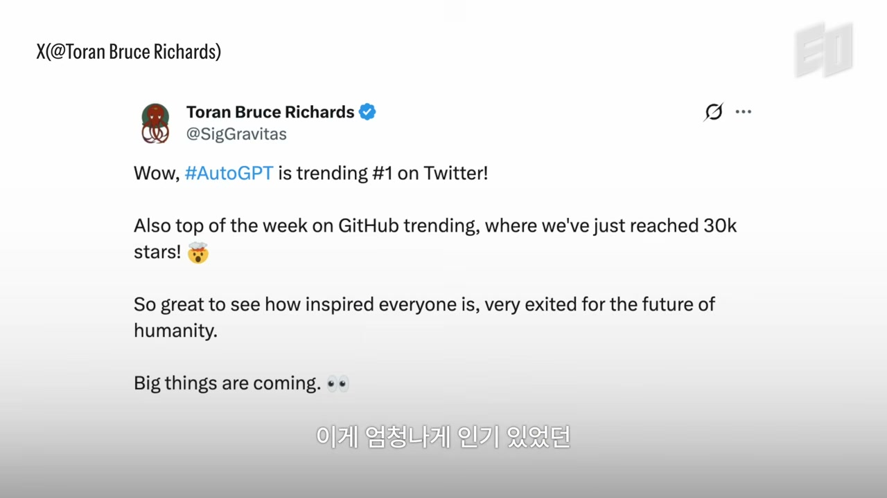
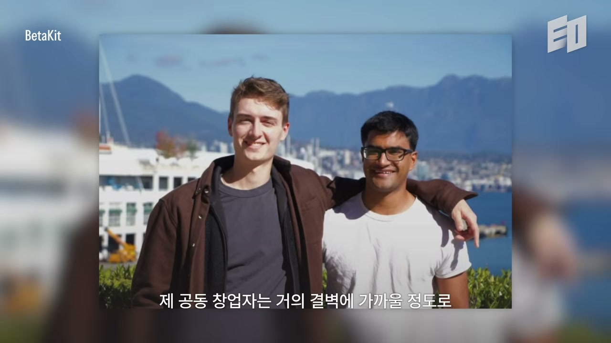
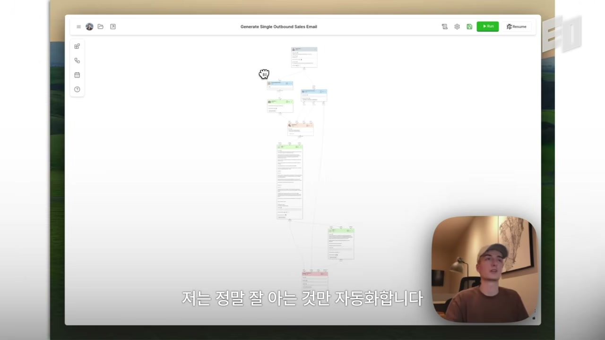
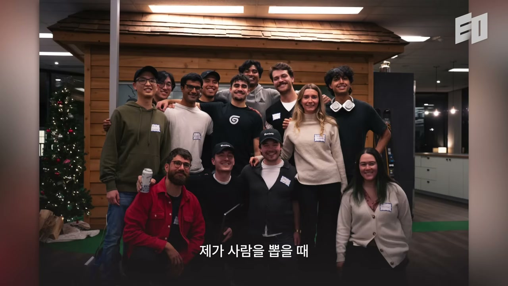

"트위터에 들어가면 다들 이렇게 말해요. 모든 걸 자동화했고, 일주일에 한 시간만 일하는데 주말에 SaaS 앱으로 천만 달러를 번다고." Gumloop의 창업자이자 CEO인 Max Brodeur-Urbas는 이 말을 옮긴 뒤 곧장 단정한다. "대부분은 그냥 마케팅이에요. 거짓말을 하고 있는 거죠."

자동화 플랫폼을 만들어 파는 사람이 자동화로 떼돈을 번다는 환상을 가장 앞장서서 깬다는 건 묘한 일이다. Gumloop은 Instacart, Shopify, DoorDash, Gusto 같은 큰 기업들에서 하루 약 400만 건의 워크플로우를 자동화하는 회사다. 그러니까 그는 AI 자동화로 먹고사는 사람이다. 그런 그가 "AI가 당신을 대신해 일하게 만드는" 그림을 가장 강하게 부정한다. 이 인터뷰는 그 모순처럼 보이는 지점에서 출발해, AI 시대에 무엇을 자동화해야 하고 무엇을 손에 쥐고 있어야 하는지에 대한 한 창업자의 입장으로 이어진다.

## 빅테크는 이력서의 로고 한 줄이었다

Max는 Montreal의 McGill 대학에서 소프트웨어 공학을 전공했다. 학교 다닐 땐 성적에 집착했다. "공부만 했어요. 받을 수 있는 최고 학점을 받으려고 했죠." 대학 내내 목표는 단 하나, 좋은 직장을 얻는 것이었다. 그는 빅테크에 들어가는 게 옳은 길이라고 믿었고, 실제로 Microsoft에 들어갔다. 그리고 빠르게 깨달았다. "거길 싫어한다는 걸 금방 알았어요."

여기서 그는 흔한 조언 하나를 정면으로 반박한다. 창업을 고민하는 사람에게 사람들은 보통 이렇게 말한다. "일단 빅테크에 잠깐 들어가서 많이 배운 다음에 내 걸 하면 돼." Max는 이걸 일종의 자기합리화(cope)라고 부른다. 그렇게 말하고 들어간 사람들이 결국 황금 수갑(golden handcuffs)에 묶여 영영 떠나지 못하고, 정작 자기 사업은 시작도 못 한다는 것이다.

더 날카로운 건 그다음이다. "빅테크에서 배운 걸 제 스타트업에서 써먹은 게 하나도 없는 것 같아요." 그가 보기에 Microsoft가 준 유일한 것은 일종의 기본 존중이었다. 이력서에 그 회사 로고가 박혀 있으면, 사람들이 당신을 그냥 아무개가 아니라 "어떤 회사가 이 사람이 유능하다고 검증해준 사람"으로 본다는 것. 딱 그만큼만 도움이 됐고, 새로운 걸 배운 건 없다고 그는 잘라 말한다. 오히려 지금 그가 하는 많은 일은 Microsoft에서 싫었던 것들에서 출발한다. "제가 하는 일 대부분은 빅테크가 일하는 방식과 정반대예요."

그가 빅테크를 떠난 논리에는 시간에 대한 감각이 깔려 있다. 책임도 의무도 없는 스물한두 살, 그 시절은 다시 오지 않는다. 그런 시간을 매일 출근해 로그인하고 티켓 하나 고치고 로그아웃하는 데 쓴다면, 정말 중요한 몇 년을 낭비하는 셈이라는 것이다. "어차피 할 거면 지금 하자. 더 안정적이고 책임감 있는 선택은 나중에 알아보자." 그는 이게 옳은 선택이었다고 말한다.

## 미국에서 추방당하던 날, 물러날 곳이 사라졌다

이 대목에서 인터뷰는 갑자기 한 개인의 사건으로 내려간다. Max는 Microsoft를 그만두고 Vancouver로 돌아갔다. 계획은 단순했다. Vancouver에서 1년쯤 침실에 틀어박혀 이것저것 만들어보자는 것. 그러다 주말에 Seattle에 있는 옛 룸메이트를 보러 가려고 국경을 넘으려 했다.

국경 직원들이 캐물었다. 어디 가느냐, 어디 묵느냐, 무슨 일을 하느냐. 그가 말한 것보다 더 오래 머물 거라는 의심을 받았고, 실제로는 이틀만 있을 거였는데도 국경에서 돌려보내졌다. 그리고 거기엔 5년간 미국 입국 금지가 따라붙었다. 불법적인 일은 전혀 없었다. 그는 이 순간을 분명하게 기억한다. "솔직히 꽤 무서웠어요. 국경에서 여자친구 아파트로 차를 몰고 돌아오는데, 거의 충격 상태였어요." 마음을 가라앉히는 데 며칠이 걸렸다.

그런데 바로 이 사건이 전환점이 된다. "그때가 내가 회사를 만들어야 한다는 걸 깨달은 순간이었어요. 물러날 곳(fallback plan)이 없었으니까." 안정적인 빅테크 일자리도, 미국으로 돌아갈 길도 사라진 자리에서 그는 더 진지해지기로 한다. 사람들이 실제로 원하는 것, 돈이 되는 것을 만들자고. 그리고 다음 6개월을 할 수 있는 한 가장 열심히 일했다.

## "스타트업에서는 내가 틀렸음을 증명하려고 달린다"

이 6개월의 시행착오에서 그가 길어 올린 통찰은 직관과 정반대다. 그는 닥치는 대로 만들었다. VR 게임 중재 소프트웨어, 일반적인 신뢰·안전(trust and safety) 도구, 웹 트래픽 봇 탐지 소프트웨어, 사기 방지 플랫폼. 뭐든 조금이라도 가치 있어 보이면 MVP로 만들어 팔아보고, 시장에 관심이 있는지 살폈다. 일주일에 한 번꼴로 다른 아이디어를 실험했고, 그때마다 빠르게 그게 나쁜 아이디어라는 걸 배웠다.

반복할수록 그는 자기가 틀렸음을 증명하는 데 익숙해졌다. 그리고 스타트업의 반직관적인 사실 하나를 깨닫는다. "스타트업에서는 사실 내가 틀렸다는 걸 증명하려고 달리는 거예요. 그게 일어날 수 있는 최고의 일이에요. 몇 주, 몇 달의 시간을 아껴주니까."

처음엔 정반대로 했다. 몇 달씩 아이디어를 붙들고 만들면서, 누군가 "이건 만들 가치가 있다"고 자기를 옳다고 증명해주길 바랐다. 그렇게 석 달을 낭비했다고 그는 말한다. 해야 할 일은 그 반대였다. "왜 이게 안 되는지를 말해줄 사람을 적극적으로 찾아 헤매야 해요. 안 되는 이유를 못 찾겠으면, 그제야 추구할 만한 실체 있는 아이디어가 있는 거죠."

다시 한다면 그는 "될지도 모른다"는 이유를 바라며 무작정 많이 만드는 대신, "안 될 강력한 이유"를 사냥하겠다고 한다. 그게 가장 많은 정보를 주기 때문이다. 그리고 한마디 덧붙인다. "그 전에 열 번 실패하지 않았다면, Gumloop을 만들지도 못했을 거예요."

같은 맥락에서 그는 사용자와의 대화를 강조한다. 사용자에게 최대한 많이 말을 거는 건 거의 "얻어내야 하는 특권"이라는 것이다. 초반엔 말 걸 사용자조차 없어서, 제발 한번 써달라고 사람들에게 비는 처지가 된다. 즐겁지 않지만 거쳐야 하는 과정이다. 그리고 사용자가 듣기 싫은 말을 할 때, 가령 "당신 제품 별로다", "엉뚱한 걸 만들고 있다", "내 문제를 해결 못 한다"고 할 때, 바로 그게 가장 값진 피드백이라고 그는 본다.

여기엔 또 하나의 신호가 깔려 있다. 지금의 Gumloop 작업을 시작했을 때, 그는 처음으로 신나서 밤 12시까지 사무실에 남았다. "그게 너무 좋아서 멈출 수가 없었어요." 노트북을 닫고 싶지 않게 만드는 그 무언가를 찾으면, 매일이 더 쉬워지고 멈출 수 없는 추진력이 쌓인다는 것이다.

## AutoGPT 열풍 속에서 본 진짜 수요

Gumloop의 기원은 AutoGPT다. 한때 트위터와 세상을 휩쓴, 굉장히 인기 있던 오픈소스 에이전트 프레임워크. Max는 그것이 처음으로 "AI가 스스로 무언가를 에이전트처럼 해내고 문제를 푸는 것처럼 느껴진" 순간이었다고 말한다. 그도 트위터에서 보고 써봤고, 첫 데모는 꽤 놀라웠다.

그가 주목한 건 기능이 아니라 Discord 서버의 풍경이었다. 기하급수적으로 커지던 그 서버에서 사람들이 이런 질문을 쏟아내고 있었다. GitHub가 뭐예요? 터미널은 어떻게 써요? 로컬에 어떻게 설치해요? 디펜던시가 뭐예요? Max는 깨달았다. 이 문제를 대신 풀어주고 깔끔한 UI를 하나 붙여주면, 뭔가 흥미로운 일을 하는 거라고. 처음엔 프론트엔드 만드는 법을 배울 좋은 기회 정도로만 여겼지, 대단한 게 될 거라곤 생각하지 않았다. 그래서 Discord에서 누가 로컬 환경 설정을 도와달라고 하면, 그는 첫 버전인 AgentHub 링크를 보내줬다.

며칠 만들고 나니 생각이 커졌다. "이건 에이전트를 위한 GitHub가 될 수 있겠다." 에이전트가 유용하다면, 그것들을 호스팅하고 다루는 플랫폼을 가질 수 있다는 것. 하지만 그 아이디어는 며칠 만에 무너졌다. 에이전트가 유용하지 않다는 걸 깨달았기 때문이다. 그리고 바로 그게 깨달음의 순간이었다. "사람들이 쓰고 싶어 하는 플랫폼은 있는데, 에이전트가 너무 불안정해서 사람들이 답답해하고 있었어요."

그래서 그는 사람들이 은밀하게 원하던 것을 줬다. 바로 안정성과 예측 가능성이다. 사용자들의 쓰임새가 다 너무 단순해서, 단계를 하나씩 차례로 자동화하게 해주는 프레임워크만 만들면 되겠다고 판단했다. 그게 자연스럽게 지금의 자동화 플랫폼으로 자라났다.

결정적인 건 청중의 정체였다. 오픈소스 프로젝트였으니 개발자용이었는데, 정작 열광한 쪽은 비개발자였다. 회사의 비즈니스 관리자, 운영팀, HR 담당자처럼 AI가 자기 일을 실제로 해결하고 자동화해준다는 데 들뜬 사람들. 진짜 청중의 80%가 비기술직이라는 걸 알아챈 순간, 그는 방향을 정한다. 이들에게 다가가기 쉽고, 쓰는 게 재밌고, 복잡함으로 좌절시키지 않는 무언가를 만들어야 한다고. 그게 "단순화된 AutoGPT"의 동기였다.

## YC, 그리고 $20짜리 첫 결제 알림

Gumloop은 배치(batch) 시작 5개월 전에 YC에 합격했다. 그 5개월 동안 제품은 완전히 무료였다. 배치 중 어느 시점에 과금을 켜기로 알고 있었고, 첫 주에 켰다. 가격은 월 20달러. "ChatGPT보다 비싸게 받는 건 상상할 수 없었거든요." 첫 유료 고객은 Kai라는 사람이었다. 그가 20달러를 결제했을 때 둘은 환호했다. "Stripe 알림이 뜨는 걸 보는 게 역대 최고의 순간이었어요." 그리고 Kai는 지금도 사용자다.

YC 기간 내내 Max는 캐나다에 묶여 있었다. 입국 금지의 결과였다. YC에 있다는 기대에 부응해 굉장한 걸 만들어야 한다는 압박은 다 짊어졌지만, 대신 어떤 방해물도 없었다. Vancouver의 작은 스튜디오 아파트, 자기 방에서 그는 할 수 있는 한 빠르게 코드를 썼다.

여기서 그가 얻은 교훈은 네트워킹에 대한 통념을 뒤집는다. 집중을 유지하고, 테크 업계 사람들이 여는 네트워킹 이벤트와 파티에 휩쓸리지 않는 게 정말 강력하다는 것. "정말 굉장한 걸 만들고 있는 사람들은 그런 이벤트에 없어요. 뭔가에 제대로 꽂혀 있으면 아무도 네트워킹 같은 거 안 해요." 그는 이 태도를 지금도 유지한다. 웬만하면 이벤트에 안 가고, 공동창업자는 거의 결벽적으로 이벤트에 안 간다. "대부분 사람들이 그를 만난 적이 없어요. 늘 일만 하고 있거든요."

가장 큰 교훈은 이것이다. 집중을 유지하고 사용자와 최대한 많이 대화하면, 네트워크는 꽤 자연스럽게 생겨난다. 투자 유치도 마찬가지다. 많은 사람이 투자자를 만나고 아이디어를 설득하려면 나가서 네트워킹을 해야 한다고 생각한다. 하지만 예외적인 걸 만들면, 그들이 알아서 당신을 찾아온다. "그렇게 복잡하지 않아요. 그들 없이도 당신이 성공할 거라는 걸 보여주기만 하면 돼요. 그럼 기다려달라고 이메일을 보내는 쪽은 당신이 되는 거죠." YC 기간 가장 큰 깨달음이 이거였다고 그는 말한다. 그건 네트워크나 칵테일 파티로 만들어지는 게 아니라고.

## "이해하지 못하는 걸 자동화하면, 그건 슬롯머신이다"

이제 인터뷰는 처음의 모순으로 돌아온다. Max는 지금 AI를 둘러싼 한 가지 안티패턴을 지목한다. 한 방향으로 너무 멀리 가버린 사람들, 이를테면 "내 회사를 50개의 AI 에이전트가 굴리고, 매일 뭘 해야 할지 알려주는 AI 임원진(C-suite)이 있다"고 말하는 부류다. 그는 이게 틀린 접근이라고 본다. "그건 그냥 슬롭(slop) 머신을 만드는 거예요." 그러곤 못 박는다. 슬롯(slot)이 아니라 슬롭, 즉 쏟아내는 쓰레기.

그가 제시하는 기준은 명료하다. AI를 무엇에 써야 하고 무엇에 쓰지 말아야 하는지를 아는 것. 중요한 부분에는 사람의 손길을 남기고, 반복적인 것만 자동화하는 게 답이라는 것이다. 그가 보는 최고의 사용자는 AI로 자기 일 전체를 대체하는 사람이 아니라, AI로 한껏 능력이 증강된(super AI-enabled) 사람이다.

문제는 이게 미끄러운 비탈(slippery slope)이라는 점이다. 트위터의 그 "일주일에 한 시간 일하고 주말에 천만 달러" 이야기가 다시 등장한다. Max는 그런 사람들을 "코스 브로(course bros)"라 부른다. 꿈을 파는 사람들. 이 워크플로우만 복사하고 댓글 달면 이번 주말에 3만 달러를 벌 수 있다며 레시피를 주겠다는 사람들. "장담하는데 그건 한 번도 통한 적 없어요. 그들은 실제로 새로운 걸 제공하지 않으면서 생산성이라는 비전을 팔고 있는 거예요." 그의 논리는 단순하고 반박하기 어렵다. 주말에 3만 달러를 벌어주는 마법 같은 해법이 있다면, 그걸 트위터에서 당신에게 거저 주고 있을 리가 없다.

그가 말하는 가치의 출처는 정반대 자리에 있다. "가치는 당신이 깊이 이해하는 무언가에 AI를 적용할 때 나와요." 가장 생산적이고 가장 많은 가치를 만드는 사람들은, 자기가 정말 잘 아는 것을 가져다 거기에 AI를 적절히 얹고 그로부터 규모를 키운다.

그래서 그는 자기 원칙을 이렇게 정한다. "저는 제가 정말 이해하는 것만 자동화해요." 이해하지 못하는 걸 자동화하면 그건 그냥 슬롯머신, 즉 도박이 된다. 그가 드는 예는 구체적이다. 코드를 전혀 할 줄 모르면서 AI로 코딩을 하면, 결국 만드는 건 멀웨어나 다름없다. 언젠가 발목을 잡는다. 바이브 코딩(vibe coding)은 거기까지밖에 못 간다. 워크플로우 자동화도 똑같다. 자기가 결코 직접 해낼 수 없거나 이해하지 못하는 걸 자동화하려 하면, 형편없는 결과물이 나온다. 그래서 그는 AI를 자신을 빠르게 하는 데 쓴다. 이해하는 일을 훨씬 빠르게 처리해 더 많은 걸 배우고 사람으로서 성장하는 용도. 이해를 건너뛰거나 AI가 자기를 대체하게 두는 용도가 아니다.

## "마지막 세대의 위대한 엔지니어가 이미 태어났을지도 모른다"

이 원칙은 한 시대 진단으로 확장된다. Max는 다소 불길한 가능성을 꺼낸다. "마지막 세대의 위대한 엔지니어들이 이미 태어났을 수도 있어요." 그 이유는 이렇다. 지금까지는 무엇이 돌아가는지 실제로 이해해야만 했던 시대가 있었고, 그렇게 이해한 사람들이 이후 AI로 가속을 받았다. 그런데 이제는 이해하는 단계를 건너뛰고 곧장 AI로 가속만 할 수 있게 됐다.

그는 여기서 갈림이 생길 거라고 본다. 한쪽엔 AI를 학습 도구로, 일종의 선생으로 써서 근본 원리를 진짜로 붙드는 훨씬 작은 공동체가 있다. 다른 한쪽엔 왜 이게 되는지 굳이 이해하려 들지 않는 다수가 있다. 후자의 유혹은 강력하다. 웹사이트가 작동하고 기능이 원하는 대로 돌아가면, 왜 그렇게 됐는지, 안 됐다면 왜 안 됐는지, 어떤 파급효과가 있을지 파고들 이유가 사라지기 때문이다.

그래서 그는 진짜 예외적인 사람과 그렇지 않은 사람 사이의 간극이 더 벌어질 거라고 예측한다. "잠깐 멈춰서 문제를 이해하려 하고, 모르는 걸 AI에게 가르쳐달라고 할 결단력이 있다면, 예전보다 훨씬 더 빨리 예외적인 사람이 될 거예요." 그리고 평균적인 사람은 슬롭으로 미끄러져 내려간다. 이해를 건너뛰게 해주는 바로 그 도구가, 끝까지 이해하려는 소수에게는 도리어 가속 페달이 된다는 것이다.

## 채용은 데이트와 같다

Gumloop의 채용은 이 모든 것과 한 줄로 이어진다. 채용은 거의 다 네트워크를 통해 이뤄졌고, 그중 상당수는 원래 고객이었다. Instacart에서 일하던 고객이 회사를 그만두고 합류했고, Webflow에서도, Shopify에서도 그랬다. 이미 확신을 가진 사람들이다. 플랫폼을 너무 사랑한 나머지 모든 걸 내려놓고 합류하기로 한 것이다.

Max는 이게 스타트업에 어울리는 채용 방식이라고 본다. 스타트업이 가진 거라곤 사실상 낙관(optimism)뿐이기 때문이다. 매일 출근하는 게 신나야 하고, "왜 이 회사가 이걸 못 해?", "왜 저 큰 회사가 너희를 그냥 짓밟지 않겠어?" 같은 말에 모두가 틀렸음을 증명하는 사람이 되어야 한다. 그런데 이미 매일 그 도구를 쓰며 비전을 보고 있는 사람이라면, 그 전환은 아주 빠르다. 온보딩 세부사항만 정하면 된다.

그가 든 비유는 데이트다. "어떤 면에서 데이트 같아요. 누군가가 데이트하고 싶어 하는 사람이 되어야 해요. 그냥 데이트해달라고 빌 순 없잖아요." 회사에 합류해달라고 빌 수는 없다. 그러니 굉장한 걸 만들고 실적(traction)을 보여서, 세상 최고의 사람들이 합류하고 싶게 만들어야 한다. 그의 공동창업자조차 초기에 작동하는 제품 버전이 있었기 때문에 합류했다. 첫 버전을 시연하는 걸 보고 들떠서 들어온 것이다.

그렇게 만들어진 팀의 문화를 그는 자랑한다. Gumloop엔 늦게까지 남으라는 사람도, 몇 시까지 출근하고 몇 시에 퇴근하라는 규칙도 없다. 다들 똑같이 미션에 들떠 있고 하는 일을 사랑한다. 그가 채용에서 거는 큰 필터는 이거다. "이 사람과 내 모든 시간을 보내고 싶은가? 24시간 내내 같이 있을 수 있나?" 그런 사람들을 뽑을수록 모두에게 더 신나는 일이 되고, 추진력은 그 방향으로 쌓인다.

## "할 수 있다고 생각하는 것" 하나

인터뷰의 마지막에서 Max는 창업을 가로막는 회의로 돌아온다. 모든 스타트업에는 만들지 말아야 할 이유가 백만 가지쯤 있다. 아이디어를 듣고 "해자(moat)가 뭔데?", "왜 X 회사가 이걸 안 하겠어?", "왜 Y 회사가 저걸 안 하겠어?"라고 묻기는 너무 쉽다. 그런 질문에 골몰하고 집착하는 사람들은 결국 아무것도 만들지 못하고, 큰 기업에서 그들 게임의 졸(pawn)이 되어 일하게 된다고 그는 본다.

반대로 일단 시도하고 위험을 감수하며 남들이 틀렸음을 증명하려 들면, "어떻게 거기까지 갔어?", "어떻게 이렇게 많은 사람이 쓰는 회사를 이끌게 됐어?"라는 말을 듣는 자리에 도달한다. 답은 단순하다. 시도했고 됐다, 안 되면 또 시도했다. "첫날에 저는 Zapier가 우리보다 이걸 더 잘할 백 가지 이유, OpenAI 같은 큰 회사들이 우릴 짓뭉갤 이유를 스스로에게 설명할 수도 있었어요. 그랬다면 아무도 Gumloop을 쓰지 않았을 거고, 우린 새로운 걸 아무것도 못 만들었겠죠."

그래서 그가 꼽는, 창업가를 창업으로 밀어 넣는 가장 큰 자질은 의외로 단순하다. **자기가 할 수 있다고 생각하는 것.** 자기가 해낼 사람이라고 믿지 않으면 애초에 회사를 시작하지 않는다. 그러니 필요한 건 일종의 맹목적인 자신감(blind confidence)이다. "할 수 있다고 생각할 때 사람이 얼마나 많은 걸 해내는지, 그게 꽤 흥미로워요."

이 인터뷰 전체를 관통하는 모순은 결국 모순이 아니었다. AI 자동화 회사를 만든 사람이 "AI에 다 맡기지 말라"고 말하는 건, 그가 자동화의 한계를 누구보다 가까이서 봤기 때문이다. 이해하지 못하는 걸 자동화하면 도박이 되고, 이해를 건너뛰면 슬롭이 된다. 깊이 이해한 것에 AI를 얹을 때만 가치가 나온다. 그리고 그 모든 것 이전에, 안 될 백만 가지 이유 대신 "내가 할 수 있다"는 한 가지를 붙드는 일이 있다.
