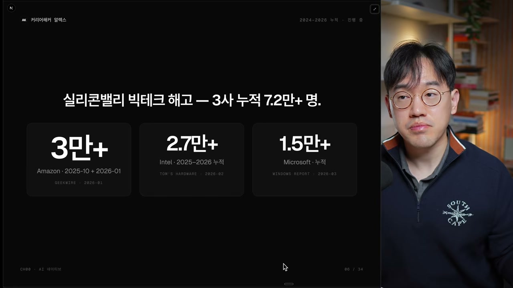
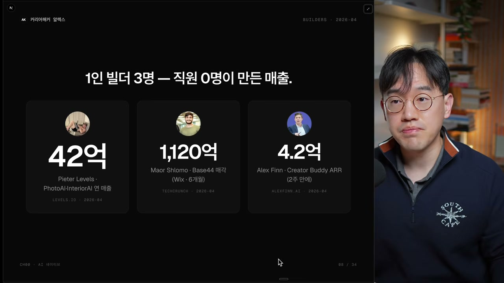
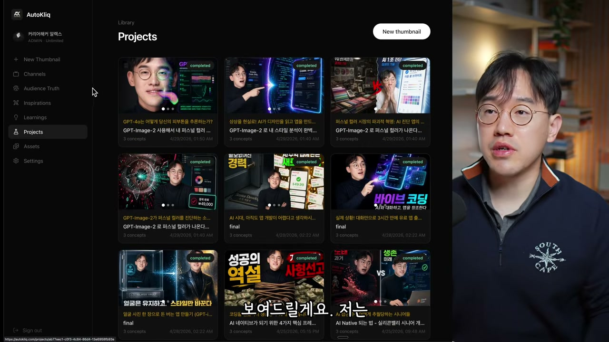
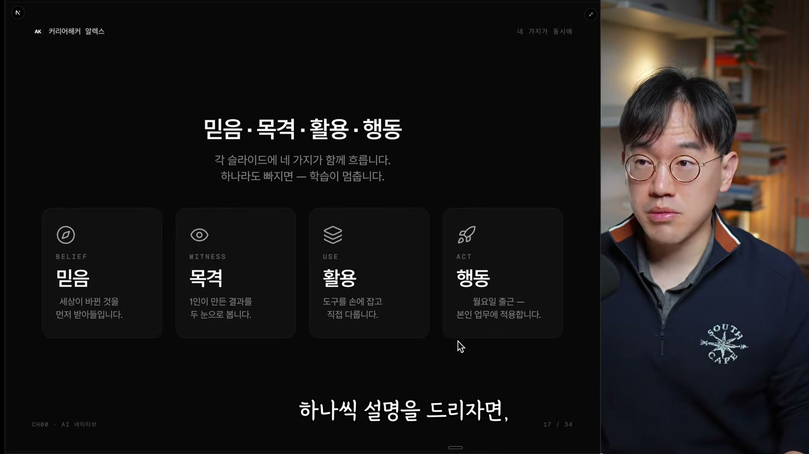
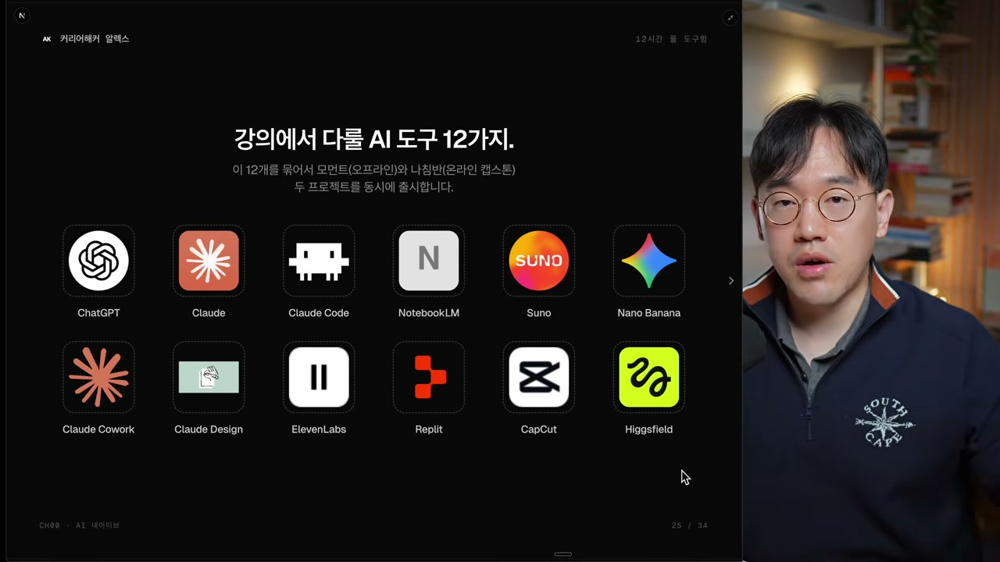
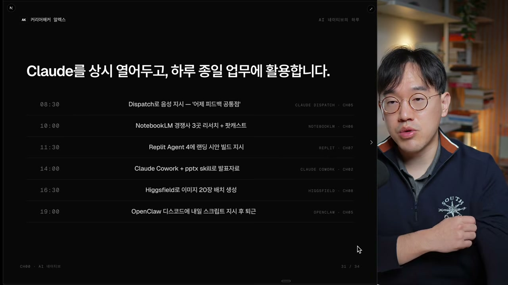

"12시간 뒤, 여러분은 다른 사람이 됩니다." 강의는 이 한 문장으로 시작한다. 메타 실리콘밸리에서 8년차 스태프 엔지니어로 일하고 있고, 구독자 20만 명의 유튜브 채널 커리어해커 알렉스를 운영하는 강연자가 한 약속이다. 그는 자기 일을 이렇게 정리한다. 메타 안에서는 AX, 그러니까 회사를 더 AI를 잘 쓰는 조직으로 바꾸는 일(AI 트랜스포메이션)을 공부하고 가르치고 도구로 만든다. 회사 밖에서는 1인 개발자이자 1인 사업가로 사이드 프로젝트를 만든다. 지난 한 해(2025년)에만 따로 시작한 프로젝트가 최소 50개는 넘는다고 했다.

그가 던지는 메시지는 의외로 짧다. **비개발자도 AI 하나만 잘 쓰면 혼자서 회사 하나를 굴릴 수 있다.** 강의는 이 말을 하기 위해서, 그리고 이 말이 허세가 아니라는 확신을 주기 위해서 만들어졌다는 것이다.

<!-- IMG 📷 강의 인트로 화면 또는 "12시간 뒤, 여러분은 다른 사람이 됩니다" 타이틀 슬라이드 -->

## 2026년, 판이 다시 짜이고 있다

강연자는 "2026년 세상이 바뀌었다"는 슬라이드로 본론을 연다. 3년 전 챗GPT가 나오면서 정보를 얻는 법, 배우는 법, 커리어 고민을 털어놓는 법까지 일상의 많은 부분이 바뀌었고, 핸드폰이나 컴퓨터가 처음 나왔을 때처럼 이제 AI 없이 일상을 유지하기 어려운 지점까지 왔다는 진단이다. 그런데 변화는 거기서 멈추지 않았다. 2026년이 되면서 그 속도가 더 빨라졌고, 누군가는 직업을 잃고 누군가는 정보의 홍수 속에서 길을 잃었다. 강연자는 자신을 포함해 그런 사람이 많아졌다고 인정하면서, 그래서 이 강의를 준비했다고 말한다.

그가 변화의 진앙으로 지목하는 곳은 실리콘밸리다. 세상에서 가장 똑똑한 사람들과 기술적으로 가장 앞선 기업들이 모인 곳에서 판이 다시 짜인다는 건, 그 변화가 실제로 크고, 여기서 그치지 않고 눈덩이처럼 굴러 전 세계로 퍼진다는 뜻이라는 것이다. 한국에도 당연히 상륙할 거라고 본다.

그 한 단면이 해고다. 강연자는 해고가 보통 한 번으로 끝나지 않는다고 본다. 한 회사가 운영이 어렵거나 재무 상태가 나빠 사람을 자르는 경우도 있겠지만, 여러 기업이 동시다발적으로 자른다는 건 그 안에 다른 뜻이 숨어 있다는 신호다. 아마존에서 3만 명, 인텔에서 몇만 명, 마이크로소프트도 메타도 몇만 명씩 자르는 흐름을 두고, 그는 실리콘밸리에서 직접 일하는 사람으로서 이 위기가 무엇을 시사하는지 어느 정도 감을 잡았다고 말한다. 앞으로 회사가 사람을 뽑을 때 기대하는 아웃풋이 많이 바뀌고 있고, 그걸 재정비하는 과정이라는 해석이다.

여기서 그는 한 박자 쉬고 방향을 튼다. 위기는 곧 기회라는 흔한 말이지만, 그가 이 말을 끌고 오는 자리는 구체적이다. 같은 변화의 반대편에서 정반대로 놀라운 일이 벌어지고 있다는 것이다.

## 직원 0명으로 유니콘을 만드는 사람들

강연자가 주목하는 사건은 1인 기업가들이 큰 회사를 만들어내고 있다는 사실이다. 그는 기업가치 1조 원 이상의 회사를 유니콘이라 부른다고 설명하면서, 이게 원래 얼마나 도달하기 어려운 목표였는지를 짚는다. 1조라는 기업가치를 가진다는 건 그만큼 큰 비즈니스 밸류와 부가가치를 만들어낸다는 뜻이고, 그래서 유니콘 하나를 만들려면 보통 수천에서 수만 명이 필요했다. 잘한 작은 스타트업이라도 몇백 명은 있어야 했다. 그걸 혼자서 해낼 수 있다는 건, 한 사람이 끌어낼 수 있는 아웃풋의 총량이 훨씬 많아졌다는 신호다.

그래서 그는 유니콘급은 아니지만 이름값 있는 1인 빌더 세 명을 슬라이드에 올렸다.

피터 레벨스는 1인 개발자로 여러 AI 도구를 섭렵해 계속 서비스를 런칭하며 매출을 만든다. 연 매출이 약 42억 원까지 혼자서 올랐다. 마오르 슐로모는 베이스44라는 서비스를 만들어 윅스에 천억 원 이상의 기업가치로 매각했다. 그것도 단 6개월 만에. 알렉스 핀은 크리에이터로서 어떤 서비스를 만들어 2주 만에 ARR(연간 반복 매출) 4.2억 원을 찍었다.

이 셋의 공통점은 하나다. **직원이 한 명도 없다.** 직원 없이 스스로 AI 군단을 거느려서 여러 서비스를 발 빠르게 만들고 매출까지 냈다. 강연자는 이 사람들이 만든 제품을 하나씩 짚는다. 피터 레벨스의 포토에이아이는 사진을 올리면 증명사진으로 바꿔주거나 배경을 갈아주는 이미지 서비스이고, 같은 사람이 만든 다른 서비스는 방 인테리어를 새로 디자인하도록 도와준다. 베이스44는 바이브 코딩 앱으로, 레플릿이나 러버블, 볼트 같은 비슷한 부류가 있다. 알렉스 핀의 크리에이터 버디는 크리에이터에게 필요한 도구들을 하나로 묶어 판매하는 서비스다.

여기서 강연자가 강조하고 싶은 건 따로 있다. 이 사람들이 천재이고 행동력과 추진력이 월등한 건 맞지만, **그들이 이걸 한 땀 한 땀 코딩해서 만든 게 절대 아니라는 것이다.** 심지어 개발자로 계속 일하지 않은 사람도 있다. 중요한 건, 1인이 여러 도구를 잘 활용하기만 하면 그 누구라도 할 수 있다는 점이다. 그는 이걸 "윌(will)", 즉 의지라는 단어로 묶는다. 의지를 가지고 정확한 방법만 안다면 이런 성과를 낼 수 있다는 것이다.

## 개발자가 줄어드는 자리에서 열리는 문

또 하나의 변화는 개발자 고용, 특히 신입 개발자 고용이 급감했다는 사실이다. 강연자는 이걸 산업 전체가 변하고 있다는 신호로 읽는다. 옛날에는 개발자를 대체할 인력이나 기술이 없어 개발자가 귀했지만, 이제 어느 정도의 개발 인력은 대체가 가능해졌고 그래서 회사들이 고용을 줄인다는 것이다.

그런데 이 말을 뒤집으면 다른 그림이 나온다. **누구나 개발자가 될 수 있다는 뜻이고, 개발 도구를 활용해 서비스를 만들어 런칭할 수 있다는 뜻이다.** 그리고 서비스를 만들어 런칭한다는 건 더 적은 돈으로 더 큰 효율을 낼 수 있다는 의미이기도 하다. 오프라인 매장을 차려 운영하는 것보다, 서비스업을 재빠르게 만들어 린하게 출시하는 쪽이 새로운 기회라는 것이다.

그래서 회사들은 사람이 아닌 AI를 고용하기 시작했고, 사람들도 다른 사람이 아닌 AI를 고용하기 시작했다. 강연자는 이 대목을 신기한 변화라고 부른다. 그렇다면 우리도 다른 사람을 뽑는 대신, 어떻게 하면 AI를 써서 인력을 충당할 수 있을지 고민해보자는 게 그의 제안이다.

## "코드 한 줄 안 썼습니다", 본인의 데모

말만으로는 믿음이 생기지 않는다는 걸 그도 안다. 그래서 자기 작업을 직접 펼쳐 보인다. 그는 이 강의에서 보여줄 12가지 도구를 여러 방면으로 활용해 자신의 시간과 돈을 아끼고 능력과 범위를 키우는 데 레버리지하고 있다고 말한다.

첫 번째는 오토클릭, 유튜브 썸네일 서비스다. 본인이 유튜버로 일하면서 유튜버들이 어디서 시간과 돈을 가장 많이 쓰는지 알게 됐고, 거기서 비즈니스 밸류를 찾았다. "이거 그냥 챗GPT나 나노바나나로 이미지 만들면 되는 거 아닌가?" 하는 반문이 나올 수 있지만, 만들 수 있는 것과 잘하는 것은 다르다는 게 그의 답이다. 이 서비스는 이미지 생성뿐 아니라 채널 분석 같은 기능도 갖췄는데, 강연자는 이 모든 기능을 구현하기까지 **코드를 단 한 줄도 쓰지 않았다고 말한다.** 물론 검수는 많이 했다. 판매까지 하려면 여러 테스팅과 검증 레이어가 필요하고, 그것까지 전부 AI 도구로 만들었다는 것이다.

그다음은 노트북LM이다. 그는 리서치를 "컨텍스트", 곧 맥락을 만드는 중요한 과정으로 본다. 사업을 할 때 시장 조사를 하고 리포트나 논문을 분석하고, 거기서 끝나지 않고 그걸 프롬프트로 바꿔 서비스를 만드는 데까지 이어지는 단계다. 노트북LM으로 리서치 에이전트를 굴리면, 논문 10개를 동시에 직접 읽지 않아도 충분한 맥락을 가지고 좋은 서비스를 만들 수 있다는 것이다.

모바일 앱도 보여준다. 룩랩은 셀카를 올리면 퍼스널 컬러, 어울리는 헤어스타일, 안경, 패션을 추천하는 리포트를 만들어주는 앱으로, 레플릿으로 뚝딱 만들었다고 했다. 여기서 그치지 않는다. 강연자는 콘텐츠 쪽으로도 손을 뻗는다. 가상의 하트시그널 에피소드 포스터를 만들거나, 배우의 프로필 시트를 만들거나, 아이돌을 만들어 뮤직비디오를 만들거나, 로고와 영화와 소설과 광고까지. 그는 일레븐랩스로 자기 목소리를 딴 보이스를 만들어 쇼츠에 쓰고, 수노로 배경음악을 만든다. 이 도구들을 서로 연결해가며 쓰는 게 핵심이다.

심지어 이 강의를 담을 웹사이트 플랫폼도 AI로 만들었고, 나중에는 블로그, 커뮤니티, 챗봇까지 붙일 계획이라고 한다. 코드는 거의 한 줄도 안 썼고, 프롬프트조차 직접 쓴 게 거의 없다. 그래서 강의에서 클로드 코드를 많이 다룰 거라고 예고하는데, 핸드폰으로 데스크톱 작업을 시키는 디스패치, 멀티 에이전트를 핸드폰으로 돌리는 오픈클로드까지 등장한다. 그는 퇴근길에 핸드폰으로 "내가 하던 프로젝트 계속 마무리해줘" 같은 프롬프트를 친다고 말한다. 자신을 도구를 지휘하는 오케스트레이터로 부른다.

## 믿음, 목격, 활용, 행동

데모를 마친 강연자는 본격적인 프레임워크로 넘어간다. 그런데 그 전에 묵직한 전제를 하나 깐다. 새 프레임워크를 알기 전에, 그동안 배워온 것을 사실상 전부 다시 배워야 한다는 것이다. 지식이 많다는 게 오히려 함정이 될 수 있다는 이유에서다.

그는 개발자를 예로 든다. 20~30년 전문가로 일한 사람일수록 AI가 만든 결과물을 쉽게 신뢰하지 못한다. AI가 실수도 하고 아직 성숙한 도구가 아니라는 걸 알기 때문인데, 문제는 그 불신이 오히려 자기 발목을 잡는다는 점이다. 이미 AI는 충분히 잘하고 있는데도, 자기가 배워온 것들이 생각의 틀을 단단히 잡고 있어 그 앞으로 뚫고 나가기 어렵다는 것이다. 그래서 새 도구가 나오면 그 도구에 대한 편견을 깨고 바닥부터 다시 시작하는 게 중요하다고 강조한다.

그 다시 배우기를 위한 네 가지 요소가 이 강의 전체를 관통한다.

첫째는 믿음이다. 세상이 바뀐 걸 받아들이고, AI가 대부분의 일을 생각보다 잘한다는 전제 위에서 시도한다. 만약 기대만큼 결과가 안 나왔다면 AI를 의심하기 전에 자기 활용법을 의심해본다. "이렇게 하면 더 잘하지 않을까?" 하는 시도를 통해 AI를 다루는 법을 익힌다.

둘째는 목격이다. 잘 된다는 걸 머리로는 알아도, 누군가 실제로 써서 보여주지 않으면 믿음이 생기기 어렵다. 그래서 강연자가 계속 시연한다. "이렇게 하니까 되네요, 보셨죠?" 하는 식으로 믿음을 굳혀준다.

셋째는 활용이다. 보고 믿어도 한 번도 안 써보면 의미가 없다. 직접 도구를 켜서 프롬프트를 넣고 결과가 나오는 걸 손으로 체감하는 연습이 AI 네이티브를 만든다.

넷째는 행동이다. 여러 도구를 잘 연결해 활용하면 유니크하고 쓸모 있는 아웃풋이 나온다. 그런데 거기서 그치면 안 된다. **나의 생각과 나의 테이스트가 반영되어야 한다.** 그냥 따라하는 데서 멈추지 않고, 내 고유한 것을 AI 도구에 접목해 새로운 가치를 만들어내는 것. 강연자는 이걸 진정한 AI 네이티브라고 부른다.

여기서 그가 말하는 AI 네이티브는 이런 사람이다. 우리가 태어나서 한국말을 자연스럽게 하듯, AI 도구를 쓰는 게 당연한 사람이다. AI를 운영체제처럼 매일 편하게 쓰는 사람. 그는 이 강의가 도구를 가르치는 걸로 끝나지 않는다고 못 박는다. 도구를 가르치는 강의는 유튜브에도 많고 AI한테 직접 물어봐도 되지만, 믿고, 보고, 활용하고, 행동하는 이 패턴은 반복해야만 살과 뇌리에 박힌다는 것이다. 그는 이걸 "조금 다른 종"이라는 표현까지 쓰며, AI 네이티브라는 종으로 거듭나는 훈련이라고 말한다.

## 12가지 도구, 7가지 모달리티

강연자는 네 가지 요소를 더 구체적으로 풀기 위해 멀티모델 접근을 가져온다. 핵심 도구 12가지만 묶으면 웬만한 건 다 할 수 있다는 게 그의 생각이다. 챗GPT와 클로드, 클로드 안의 부가 프로젝트들(클로드 코드, 클로드 디자인), 목소리와 배경음악을 위한 일레븐랩스와 수노, 리서치를 위한 노트북LM, 이미지를 위한 나노바나나, 서비스 런칭을 위한 레플릿, 영상 편집의 캡컷, 영상 제작의 힉스필드 같은 도구들이다.

왜 이렇게 묶었느냐. 일에 필요한 모든 모달리티를 커버하고 싶었기 때문이다. 모달리티란 정보의 포맷 같은 것이다. 채팅과 대화로 된 텍스트, 조금 다른 쓰임의 텍스트인 리서치, 이미지와 디자인, 코드, 영상, 그리고 오디오와 보이스. 강연자는 이 도구들을 다 섭렵하고 나면 안 되는 게 없다고 말한다. 서비스 제작도, 마케팅도, 책 쓰기도, 영상도, 포트폴리오도, 디자인도. 내가 개발자든 디자이너든 상관없이, 그리고 앞으로는 그 구분 자체가 상관없어질 거라고 본다. 그가 되려는 건 모든 걸 만들 수 있는 빌더다.

물론 아직 못하는 것도 있다. 피지컬한 것, 곧 디지털 바깥의 물리적 작업은 LLM이 아직 못한다. 하지만 강연자는 피지컬 AI나 월드 모델이 나오면서 이것도 많이 바뀔 거라고 보고, 그래도 이 프레임워크는 계속 유효하다고 말한다. 로봇이 나와도 그걸 잘 쓰는 사람과 못 쓰는 사람으로 나뉠 거라는 것이다.

## 카페 하나, SaaS 하나, 직접 만들어 보인다

강의는 추상적인 약속에서 멈추지 않는다. 강연자는 강의 동안 실제로 프로젝트 두 개를 처음부터 끝까지 만들겠다고 한다. 하나는 오프라인 쪽이다. 카페를 창업한다고 가정하는데, 자영업자가 꼭 카페일 필요는 없으니 식당이나 학원으로 바꿔도 된다. 자영업을 하는 사람에게도 친숙한 도구가 되도록, "내가 카페를 창업한다면 이렇게 하겠다"를 보여준다.

다른 하나는 온라인 SaaS다. 나침반이라는 이름의 커리어 코칭 SaaS로, AI가 커리어 코칭을 돕거나 전문가를 이어주는 플랫폼을 함께 만들어볼 예정이다. 강연자는 이런 프로젝트 만드는 게 정말 어렵지 않다고 말한다. 강의가 끝나면 온라인 서비스를 하는 사람은 "이런 도구로 이런 기능을 붙이면 되겠구나"를, 자영업자는 "메뉴를, 광고물을, 인스타 포스트를 이렇게 만들 수 있겠구나"를 알게 될 거라는 것이다.

전체 분량은 대략 12시간 정도다. 12가지 도구와 7가지 모달리티를 일주일 만에 커버할 수 있도록 밀도 있게 짰다고 한다. 일주일 만에 AI 네이티브가 되는 걸 목표로 하되, 그게 안 되더라도 될 수 있는 방법론과 도구는 반드시 제공하겠다는 약속을 덧붙인다.

## 12시간 뒤의 하루

강연자가 그려 보이는 변화는 결국 하루의 모양으로 압축된다.

아침에 일어나면 에이전트에게 지시한다. "어제 내가 한 일들 요약해보고, 오늘 할 일을 미리 준비해둬." 비서처럼 쓰는 것이다. 카페 창업을 준비 중이라면 "이쪽 지역 시장 분석을 해봐"라고 시키고, 급하게 이벤트나 서비스 런칭을 위해 모바일 앱이 필요하면 레플릿으로 한 시간 안에 뚝딱 만든다. 늘 하던 보고서나 PPT 만들기도 클로드로 스킬을 만들어두면 프롬프트 한 줄로 해결한다. 이미지와 영상 생성은 너무 쉽고, 오픈클로드로 멀티 에이전트를 동시에 돌리기도 한다.

강연자는 AI를 운영체제로서, 자신의 몸과 팔과 다리와 머리로 활용할 수 있게 돕겠다고 말한다. 실리콘밸리에서는 이미 디자이너가 개발하고 개발자가 디자인하는 일이 벌어지고 있다는 것이다. 컴퓨터를 잘 쓰는 사람이 여러 가지를 다 하듯, AI를 잘 쓰는 사람도 그렇게 될 수 있다는 게 그의 그림이다.

그는 인트로를 약속으로 닫는다. 1인의 한계를 뛰어넘어 그 무엇이든 만들 수 있는 인재로 거듭나도록 돕겠다는 것. 앞으로 10~11개 챕터에 걸쳐 이 모든 부분을 하나씩 짚어나갈 거라고 예고한다. 만약 자신이 그 자리에 없더라도, 자신을 똑 닮은, 자신보다 더 뛰어난 AI 에이전트를 세워 답하게 만들겠다는 말까지 덧붙인다. 그 약속 자체가 이미 그가 말하는 AI 네이티브의 모습인 셈이다.
