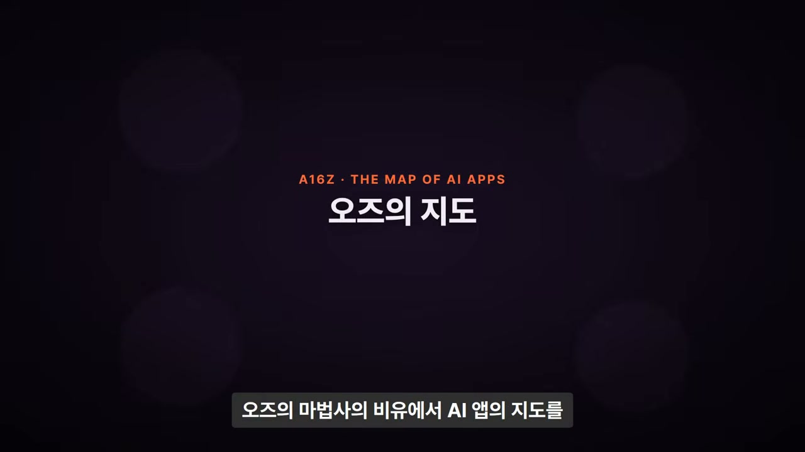
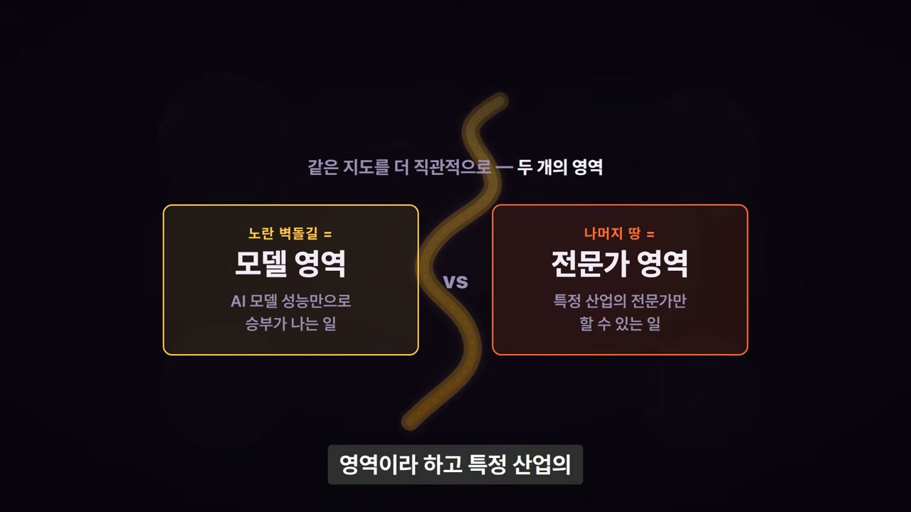
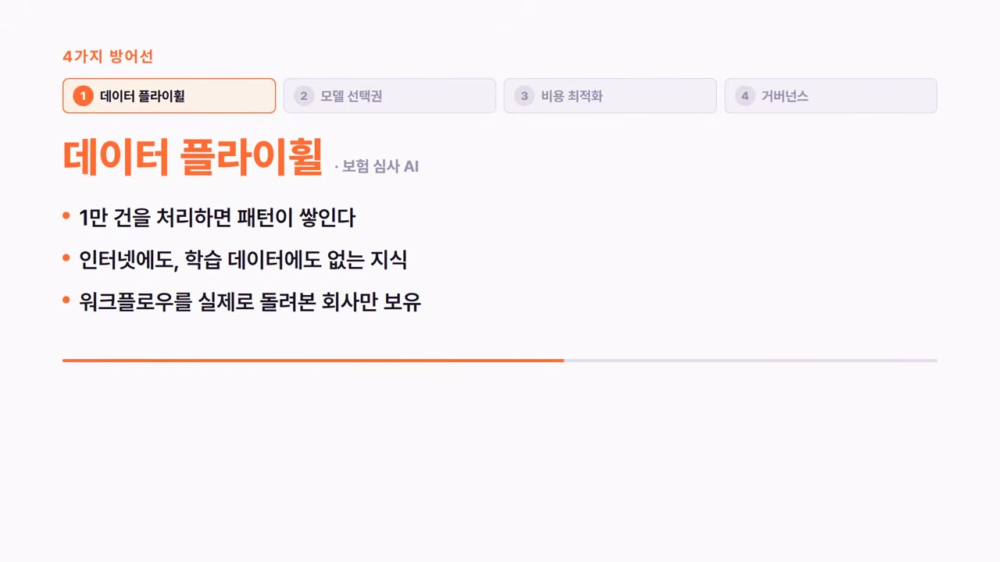
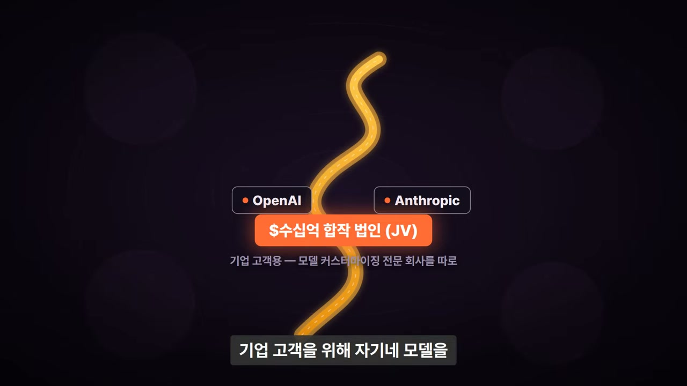
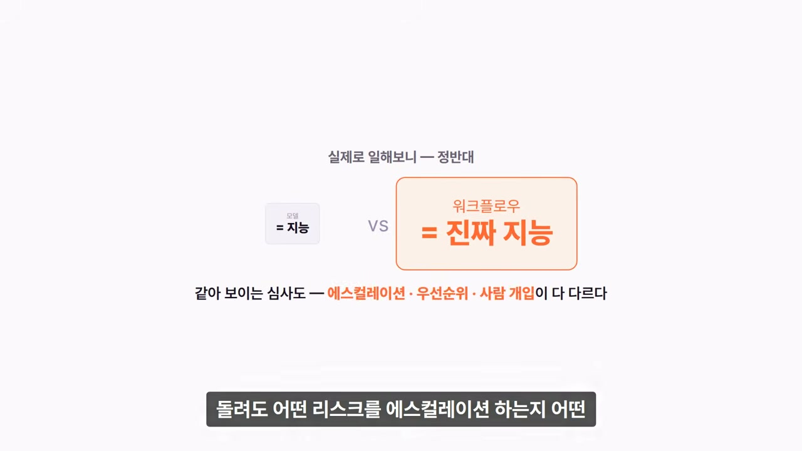
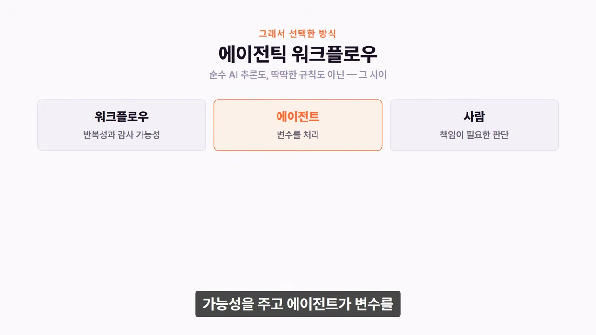
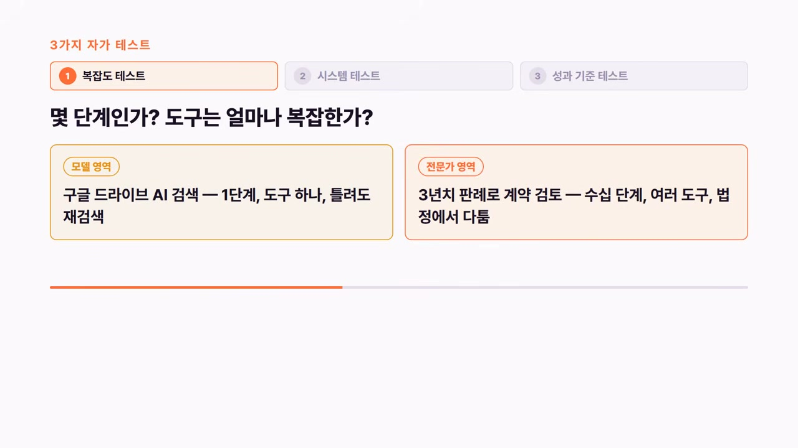
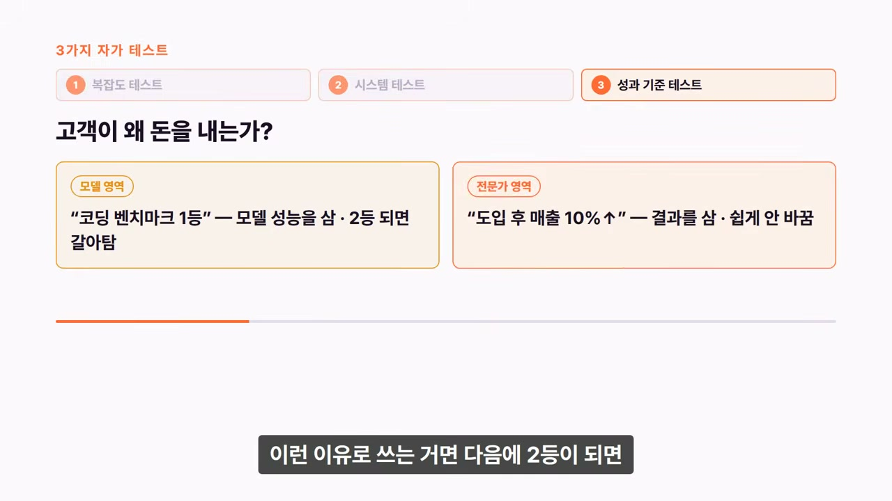
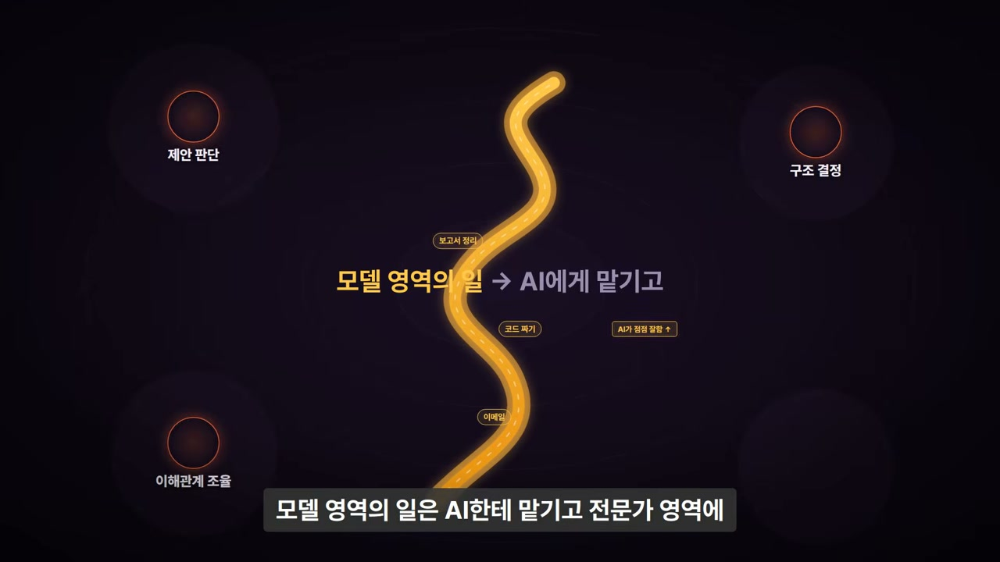
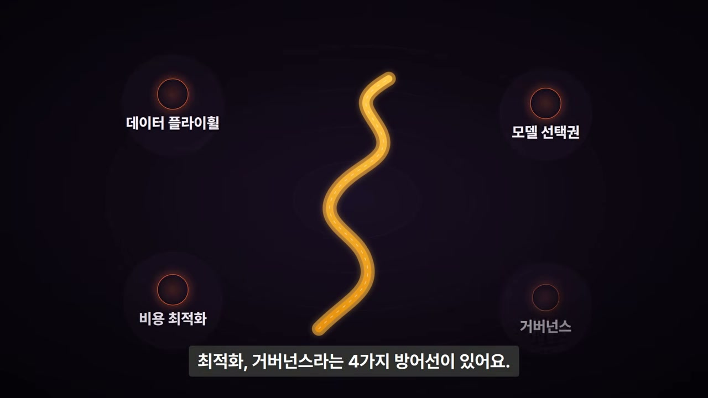

"AI 앱은 다 죽는다." 요즘 이 말이 정말 자주 보인다.

이유는 단순하다. 오픈AI는 코덱스를 만들었고, 앤트로픽은 클로드 코드를 만들었다. 모델을 만드는 회사들이 직접 제품을 내놓기 시작하면서, AI 위에 뭘 올려봤자 결국 랩이 다 먹는다는 인식이 퍼졌다. 모델을 가진 쪽이 그 위에 앱까지 만들면, 그 모델을 빌려 쓰는 스타트업은 무슨 수로 이기겠는가.

그런데 a16z가 이 질문을 정면으로 다룬 글을 하나 썼다. 오즈의 마법사 비유로 AI 앱의 지도를 그린 글인데, 읽고 나면 머릿속이 꽤 정리가 된다. 영상 속 화자는 이 글의 핵심을 따라가며 "이게 우리한테 어떤 의미인지"를 같이 생각해보자고 한다.

a16z, 정식 명칭은 앤드리슨 호로위츠다. 실리콘밸리에서 가장 유명한 벤처캐피탈 중 하나로, 깃허브 · 에어비앤비 · 코인베이스 같은 회사에 초기 투자한 곳이고 지금은 AI 분야에 막대한 돈을 넣고 있다. 그래서 이들이 "AI 앱이 살아남을 수 있는가"를 분석하는 건 한가한 평론이 아니다. 자기 투자금이 걸린 문제다. 그만큼 분석이 상당히 냉정하고 현실적이다.

## 노란 벽돌길 위에서는 싸움이 안 된다

핵심 비유는 오즈의 마법사다. 도로시가 걸어가는 그 노란 벽돌길. a16z는 이 길을 AI 랩들이 걸어가고 있는 길이라고 정의한다.

이 길 위에는 코드 생성, 글쓰기, 이미지 생성 같은 문제들이 놓여 있다. 이들의 공통점은 하나다. **모델이 좋아지면 바로 제품이 좋아진다.** 프리트레이닝에 돈을 더 쓰면 코딩 품질이 곧바로 올라가는 구조다. 그래서 이 영역에서는 모델을 직접 만드는 회사가 압도적으로 유리하다. 마진이 좋고, 가격 결정권이 있고, 유통 채널이 거대하다.

문제는 지금 수많은 AI 스타트업이 정확히 이 길 위에서 뛰고 있다는 데 있다. 고성능 모델을 가져다가 구글 드라이브나 슬랙 같은 커넥터를 달고, 그 위에 에이전트 레이어를 얹는 방식. 이게 딱 오픈AI의 코덱스, 앤트로픽의 클로드가 하고 있는 일이다. 같은 길 위에서 같은 방향으로 가는데, 상대는 모델을 직접 만드는 회사다. 싸움이 될 리 없다. a16z의 표현을 빌리면, 아무 데도 도착하지 못하는 길을 걷고 있는 것이다.

그런데 글의 요점은 "앱 레이어가 죽었다"가 아니다. AI 랩이 직접 하는 영역에서는 죽지만, 그 밖에는 엄청나게 넓은 기회가 있다는 것이다.

## 이메일을 써줘, 그리고 보험 청구를 심사해줘

화자는 오즈의 마법사 비유를 좀 더 직관적인 두 가지로 나눈다. AI 모델 성능만으로 승부가 나는 일을 **모델 영역**, 특정 산업의 전문가만 할 수 있는 일을 **전문가 영역**이라 부른다.

차이는 예시 하나로 분명해진다. "이 이메일 써줘"는 모델 영역이다. 좋은 모델 하나면 끝난다. 반면 "이 보험 청구를 심사해줘"는 전문가 영역이다. 고객 데이터를 봐야 하고, 과거 심사 기록을 확인해야 하고, 회사 내부 규정을 적용해야 하고, 어느 단계에서 사람이 결재해야 하는지를 판단해야 한다. 그리고 틀리면 소송이다.

이런 문제는 모델이 아무리 좋아져도 범용 AI 하나로 끝나지 않는다. 여기서 가치를 만드는 건 모델 성능이 아니라 그 주변의 소프트웨어, 워크플로우, 가드레일이다. 보험 심사 하나를 풀려면 고객 데이터에서 과거 기록, 내부 규정, 사람 결재 판단까지 여러 단계가 사슬처럼 엮여야 한다. 모델은 그 사슬의 한 칸일 뿐이다.

## 랩이 밀고 들어오면? 네 개의 방어선

여기서 자연스러운 반문이 나온다. 랩들이 계속 좋아지면 결국 전문가 영역까지 밀고 들어오지 않을까. 화자가 이 글에서 가장 인상 깊었다고 꼽은 대목이 바로 이 반문에 대한 답이다. a16z는 왜 전문가 영역이 방어 가능한지를 네 가지로 설명한다.

첫째, 데이터 플라이휠. 보험 심사 AI를 계속 예로 들어보자. 이 에이전트가 1만 건의 심사를 처리하면, "이런 케이스는 거절이 맞았다", "이 상황에서는 사람 판단이 필요했다" 같은 패턴이 쌓인다. 이 지식은 인터넷에 없다. 어떤 트레이닝 데이터에도 없다. 현장에서 워크플로우를 실제로 돌려본 회사만 가지고 있다. a16z는 이게 두 겹으로 쌓인다고 표현했다. 고객사들 사이에서 축적되는 패턴이 한 겹, 한 고객사 안에서 깊어지는 고유한 지식이 또 한 겹. 시간이 갈수록 후발주자가 복제하기 어려워지는 구조다.

둘째, 모델 선택권. 오픈AI는 자기 모델만 준다. 앤트로픽도 마찬가지다. 반면 전문가 회사는 작업마다 가장 좋은 모델을 골라 쓸 수 있다. 이 작업은 오퍼스가 좋고, 저 작업은 오픈소스 파인튜닝 모델이 낫고, 단순한 건 소형 모델로 돌리면 된다. 게다가 새 모델이 나올 때마다 프롬프트를 재조정하고, 기존 고객의 엣지 케이스를 다시 테스트하고, 프로덕션을 깨뜨리지 않으면서 배포하는 일이 따라온다. 이걸 랩이 대신 해주느냐? 안 해준다. "새 모델 나왔으니 마이그레이션 하세요" 하고 끝이다. 그 마이그레이션을 전문가 회사가 대신 흡수해준다.

셋째, 비용 최적화. 모든 질의를 최고 성능 모델로 돌리면 마진이 마이너스다. 전문가 회사는 정말 어려운 작업만 프론티어 모델로 돌리고, 나머지는 중간 모델, 쉬운 건 파인튜닝된 소형 모델로 처리한다. 이게 가능하려면 각 작업이 어느 수준의 지능을 필요로 하는지 정확히 알아야 한다. 그건 해당 산업에 깊이 들어가본 회사만 판단할 수 있다.

넷째, 거버넌스. 법률에서는 FRCP 규정, 헬스케어에서는 HIPAA, 금융에서는 SEC와 FINRA. 산업마다 AI가 지켜야 하는 규제가 완전히 다르다. 전문가 회사는 해당 산업의 도구, 워크플로우, 데이터를 통째로 가지고 있으니 규제 준수를 보장할 수 있다. 범용 AI 랩이 이걸 하려면 100개 산업을 동시에 전문가 수준으로 커버해야 하는데, 그건 구조적으로 불가능하다.

이 네 가지를 관통하는 키워드는 하나다. 하나의 산업, 하나의 기능에 깊이 들어가는 것. 랩들은 모든 사람을 위해 모든 곳에 있어야 한다. 바로 그게 모델 영역을 만들 수 있었던 이유이고, 동시에 전문가 영역에는 들어갈 수 없는 이유이기도 하다. **모든 곳에 동시에 있을 수는 있어도, 한 곳에서 최고가 될 수는 없다.** 둘 다는 안 된다.

## 랩들이 직접 증명해버렸다

여기서 정말 흥미로운 건 이게 그냥 이론이 아니라는 점이다. 오픈AI와 앤트로픽이 최근에 한 일이 있다. 수십억 달러 규모의 합작 법인을 발표했다. 기업 고객을 위해 자기네 모델을 커스터마이징하고 구성하는 전문 회사를 따로 세운 것이다.

뒤집어 생각하면 명확하다. 다음 모델 업데이트로 해결될 문제라면 수십억을 들여 따로 회사를 만들겠는가. 안 만든다. 랩들 스스로가 범용 모델만으로는 기업의 모든 문제를 풀 수 없다고 인정한 셈이다. 전문가 영역이 진짜라는 걸, 다름 아닌 랩들이 직접 증명해버린 것이다.

## "진짜 지능은 워크플로우 안에 있다"

글에 나오는 실제 사례 하나가 와닿는다. 퍼더AI라는 보험 전문 AI 회사의 CEO가 직접 쓴 부분이다.

이 사람의 말로는, 보험 업계에 흔히 듣는 가정이 있다고 한다. "모델이 지능이고, 워크플로우는 그 주변의 껍데기다." 그런데 실제로 보험사들과 일해보니 완전히 반대였다는 것이다. 진짜 지능은 워크플로우 안에 있더라는 말이다. 두 보험사가 똑같아 보이는 심사 프로세스를 돌려도, 어떤 리스크를 위로 올려 보고하는지, 어떤 판단 기준이 충돌할 때 무엇을 우선하는지, 언제 사람이 개입해야 하는지가 다 다르다.

게다가 이 로직은 하나의 깔끔한 규칙 엔진에 들어 있지 않다. SOP 문서에 좀 있고, 매니저 리뷰에 좀 있고, 언더라이팅 철학에 좀 있고, 수년간의 운영 경험 속에 흩어져 있다. 모델이 읽을 수 있는 형태로 정리된 적이 없는 것이다.

그래서 이 회사가 선택한 방식이 에이전틱 워크플로우다. 순수하게 AI가 매번 처음부터 추론하는 것도 아니고, 딱딱한 규칙만 따르는 것도 아닌, 그 사이를 잡은 방식이다. 워크플로우가 반복성과 감사 가능성을 주고, 에이전트가 변수를 처리하고, 사람은 책임이 필요한 판단을 한다.

이 CEO가 마지막에 한 말이 가장 인상적이다. 첫날 배포한 워크플로우가 가치의 본체가 아니라, 프로덕션에서 수천 번 돌리면서 생기는 학습 루프가 진짜 가치라는 것이다. 앞서 나온 데이터 플라이휠과 같은 이야기를, 실제로 그 안에서 일하는 사람의 입으로 다시 들은 셈이다.

## 나는 지금 어느 영역에 있나: 세 가지 테스트

글에서 또 실용적이었던 건, "그래서 내가 지금 모델 영역에 있는지 어떻게 판단하느냐"에 대한 테스트를 제시한 부분이다.

**복잡도 테스트.** 내가 풀고 있는 문제가 몇 단계를 거치는지, 그 단계를 지원하려면 얼마나 복잡한 도구를 만들어야 하는지를 본다. 구글 드라이브에서 AI 검색은 한 단계, 도구 하나, 결과가 틀려도 다시 검색하면 된다. 모델 영역이다. 반면 법률사무소에서 3년치 판례를 기반으로 계약서를 검토하는 작업은 수십 단계, 여러 도구, 결과가 법정에서 다 터질 수 있다. 전문가 영역이다.

**시스템 테스트.** 고객이 내 제품을 통해 업무를 실행하는가, 아니면 고객이 이미 쓰는 시스템 위에 지능을 얹어주는가. 시스템이면 전문가 영역, 도구면 모델 영역이다. 판단 기준은 명확하다. 랩에서 경쟁 제품을 내놔도 고객이 여전히 내 제품을 필요로 한다면 시스템이고, 필요 없어진다면 도구다.

**성과 기준 테스트.** 고객이 왜 돈을 내는지를 본다. "이 AI가 코딩 벤치마크 1등이래." 이런 이유로 쓰는 거라면 다음에 2등이 되는 순간 갈아탄다. 모델 성능을 사고 있는 것이라 더 좋은 모델이 나오면 끝이다. 모델 영역이다. 반면 "이 에이전트 도입하고 나서 우리 팀 매출이 10% 올라갔다." 이런 이유라면 쉽게 안 바꾼다. 그 결과를 만든 게 모델 하나가 아니라 내 회사에 맞게 세팅된 워크플로우 전체이기 때문이다. 전문가 영역이다.

a16z가 여기서 재밌는 표현을 썼다. 최고의 에이전트 회사는 헤지펀드처럼 운영해야 한다는 것이다. 헤지펀드가 시장 평균을 넘는 초과 수익을 내는 게 존재 이유이듯, AI 회사도 시험 점수 같은 평균이 아니라 고객의 실제 매출, 실제 비용 절감에서 초과 성과를 내야 살아남는다는 뜻이다.

## 이건 회사 얘기만이 아니다

여기서부터는 화자 자신의 생각이다. 이 글은 스타트업과 창업자를 대상으로 쓴 것이지만, 화자는 읽으면서 개인 커리어에도 그대로 적용된다고 느꼈다고 한다.

우리가 하는 일도 모델 영역과 전문가 영역으로 나뉜다. 이메일 쓰고, 코드 짜고, 보고서 정리하는 일은 모델 영역이다. AI가 점점 더 잘하게 될 영역이다. 반면 우리 회사 상황에서 이 고객한테 어떤 제안을 해야 하는지 판단하는 것, 이 프로젝트에서 어떤 구조가 맞는지 결정하는 것, 여러 부서의 이해관계를 조율하는 것. 이런 건 복잡하고 맥락 의존적이고 정답이 하나가 아닌 문제들이다. 전문가 영역이다.

그렇다면 우리가 해야 할 일도 명확해진다. 모델 영역의 일은 AI에게 맡기고, 전문가 영역에 해당하는 역량을 키우는 것. a16z가 스타트업에 한 조언이 개인에게도 그대로 먹힌다. 특정 산업이든 특정 기능이든, 하나의 영역에 깊이 들어가서 AI만으로는 풀 수 없는 복잡한 문제를 풀 수 있는 사람이 되는 것. 그게 AI 시대의 가치다.

정리하면 a16z가 그린 지도는 이렇다. AI 랩이 직접 하는 모델 영역이 있고, 거기서 경쟁하면 죽는다. 하지만 그 밖에 전문가 영역이라는 거대한 기회가 있고, 거기엔 데이터 플라이휠, 모델 선택권, 비용 최적화, 거버넌스라는 네 가지 방어선이 있다. 그리고 AI 랩들 스스로도 이 사실을 인정했다.

그러니 질문은 결국 우리 각자에게 돌아온다. 나는 지금 모델 영역에 있는가, 전문가 영역에 있는가.
