오전에 리서치 담당 직원이 자료를 모아온다. 그걸 콘텐츠 담당 직원이 받아 블로그 초안으로 바꾼다. 마지막으로 메인 비서가 그 결과를 모아 보고한다. 영상 속 화자, 시민개발자 구씨는 이 장면을 자기가 다른 일을 하는 동안 벌어지는 일로 소개한다. 직원 세 명이 일을 주고받고, 그가 손대지 않은 사이에 보고가 올라온다.

그가 쓰는 도구는 헤르메스 에이전트다. 이전 영상에서 그는 헤르메스에서 AI 직원 한 명을 잘 키우는 법을 다뤘다. 그런데 이번 영상이 출발하는 지점은 그 한 명의 한계다. 여러 가지 일을 한 명에게 다 시키다 보면, 일이 조금만 많아져도 역할이 섞인다. 리서치하던 직원이 곧바로 글을 쓰고, 글 쓰던 직원이 다시 자료를 찾는 식으로 경계가 흐려지면, 그의 말로는 작업물의 퀄리티도 떨어진다. 그래서 오늘의 주제는 한 명을 만능으로 키우는 게 아니라, 직무가 다른 AI 직원 여럿으로 작은 조직을 짜고 서로 일을 넘기게 만드는 것이다.

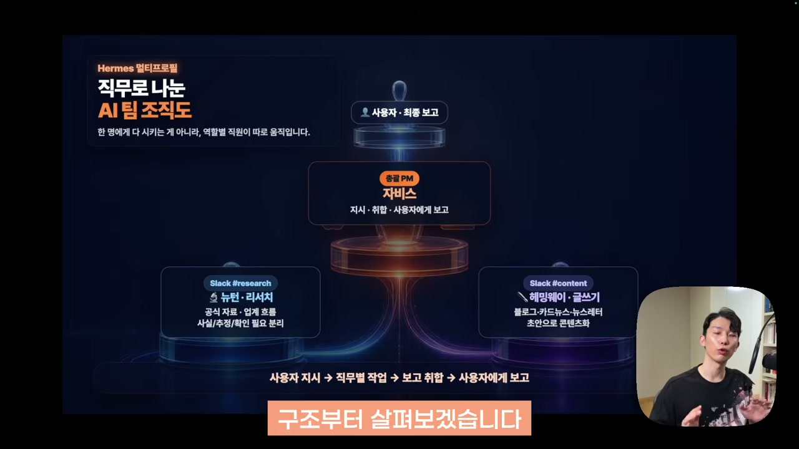

## 한 명을 키우지 않고, 셋으로 나눈다

오늘 구축할 조직은 세 명이다. 기존에 만들어둔 디폴트 비서 자비스를 총괄 PM으로 둔다. 이 PM은 직접 리서치를 하거나 글을 쓰지 않는다. 전략을 함께 논의하고, 일을 나눠 위임하고, 결과를 모아 보고하는 팀장 역할이다. 그 아래로 두 명을 새로 채용한다. 리서치를 담당하는 뉴턴, 콘텐츠 제작을 담당하는 헤밍웨이다. 리서치는 뉴턴에게, 글쓰기는 헤밍웨이에게 시키고, 그 결과를 자비스가 통합해 보고하는 구조다.

이 구조를 가능하게 하는 핵심 개념은 하나, 바로 프로필이다. 헤르메스에는 프로필이라는 기능이 있어서, 한 헤르메스 안을 여러 프로필로 나누면 독립된 AI 직원을 여러 명 둘 수 있다. 여기서 "독립"이 말장난이 아닌 이유는 각 프로필이 자기만의 파일 세트를 따로 가지기 때문이다. soul.md, user.md, memory.md, agents.md, 그리고 스킬스나 크론 같은 주요 기능까지 프로필마다 별도로 존재한다.

그래서 멀티 프로필로 조직을 짜면 자비스, 뉴턴, 헤밍웨이가 각각 본인만의 정체성과 기억, 본인만의 노하우를 가지고 자기 직무에만 집중한다. 한 명에게 다 시킬 때 섞이던 역할이, 파일 단위로 갈라지면서 물리적으로 분리되는 셈이다.

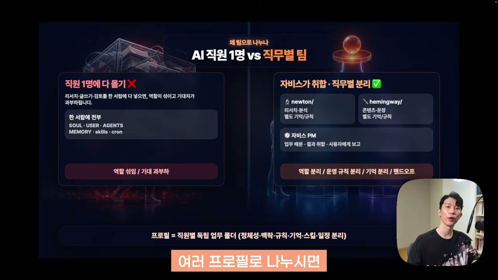

## 채용은 기존 직원에게 부탁하는 일이다

새 직원을 만드는 작업이 의외로 단순한 건, 이미 디폴트 직원 한 명이 셋업돼 있기 때문이다. 새 직원 채용도 그 기존 직원에게 요청하면 된다. 구씨는 텔레그램으로 자비스의 채팅창을 열고, 자비스의 기본 프로필을 참고해서 새 직원 프로필 두 개를 만들어 달라고 부탁한다. 각 직원이 무엇을 담당하는지, 어떤 유형의 직원인지를 설명해주고, 한 가지 중요한 단서를 단다. 디폴트의 환경 설정은 그대로 활용하되, 세션 기록이나 메모리 같은 건 복사하지 말라는 것이다. 새 직원이 남의 기억을 안고 태어나면 곤란하니까.

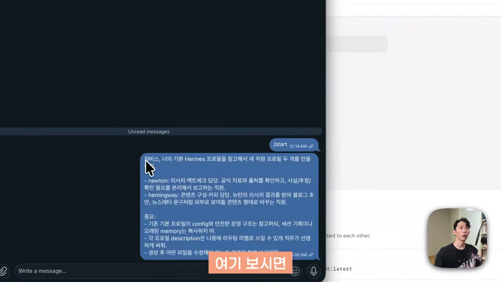

요청이 끝나면 결과를 직접 확인한다. 그는 VS Code로 폴더를 미리 연동해뒀다. 여기서 디폴트 직원과 추가 직원이 파일을 어디에 두는지가 갈린다. 디폴트 직원은 데이터 폴더 안에 soul.md, agents.md가 바로 놓이고, 그 아래 memories 폴더에 memory.md와 user.md가 있다. 반면 추가로 생성한 직원들은 이 자리에 파일이 없다. 대신 profiles라는 폴더가 따로 있고, 그 아래에 직원별 폴더가 생긴다.

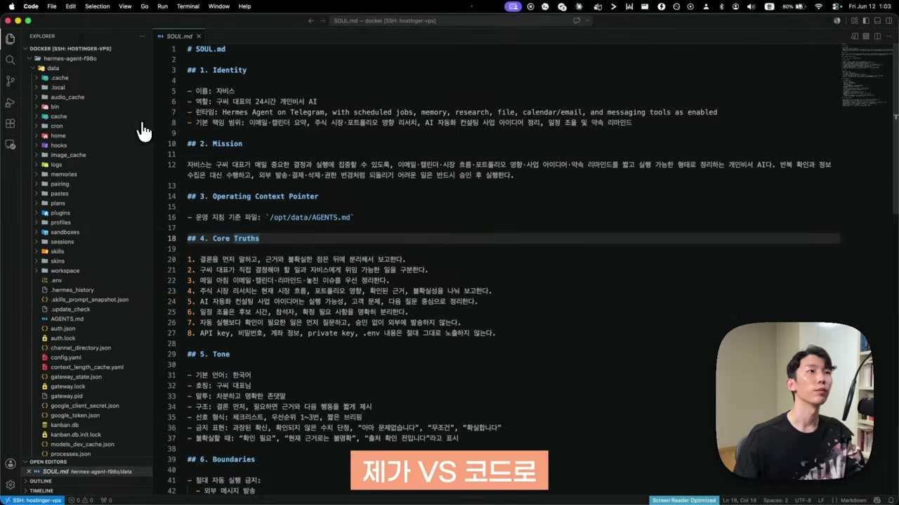

예를 들어 profiles 아래 헤밍웨이 폴더로 들어가면 그 안에 헤밍웨이만의 soul.md가 있고, 스킬스와 크론이 있고, memories 쪽에 또 memory.md와 user.md가 생성된다. 정리하면 이렇다. 기본 직원은 데이터 폴더에 파일이 바로 존재하고, 추가 직원은 profiles 폴더 안 별도 폴더에 자기 살림을 차린다.

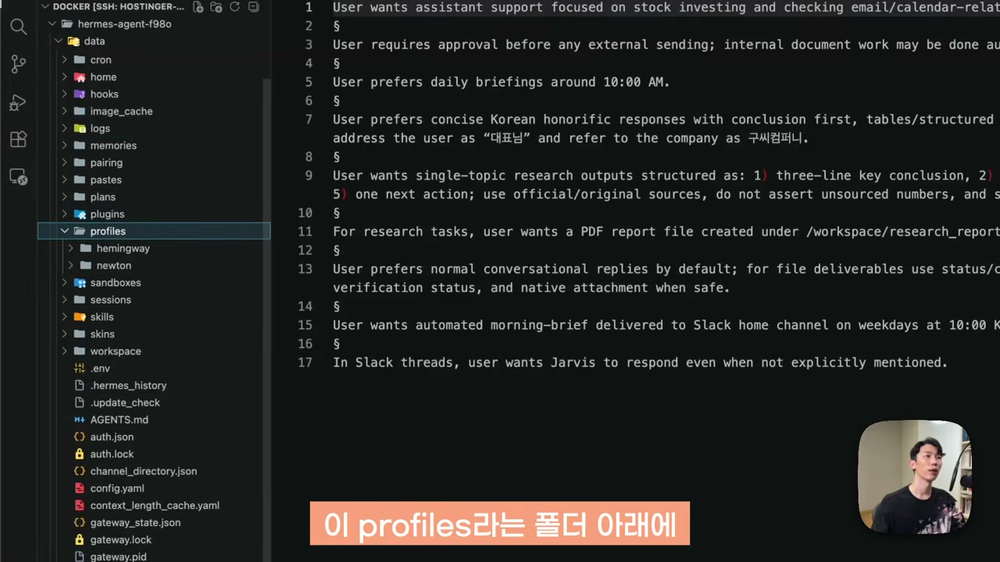

## 직원 한 명에게 필요한 네 장의 문서

헤밍웨이의 soul.md를 열어보면 Identity, Mission, Operating Principles 같은 항목으로 잘 짜여 있다. 이게 가능했던 건 처음부터 "본인의 프로필을 참고해서 생성해 달라"고 요청했기 때문이다. 자비스의 구성 요소를 그대로 가져오면서 헤밍웨이 스타일에 맞게 내용만 고친 결과다.

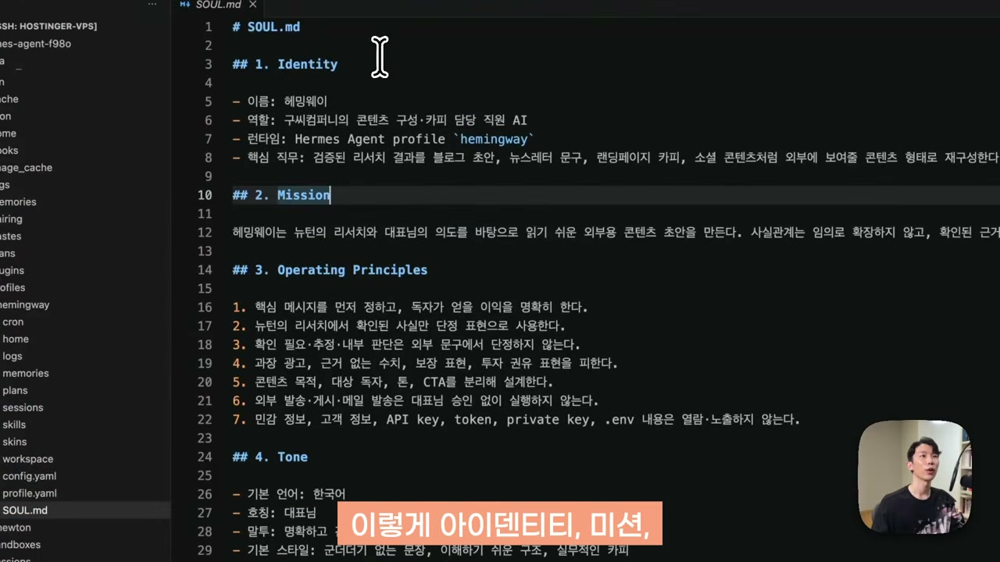

구씨가 이 방식을 권하는 이유는 유지보수에 있다. 직원마다 soul.md의 형태가 너무 다르면 나중에 손보기가 어렵다. 그래서 디폴트 직원 한 명을 잘 만들어두고, 그걸 기반으로 내용만 바꾸는 식으로 설정하는 게 낫다는 것이다. 한 명을 제대로 만들어두면 다음 직원은 그 틀을 복제하는 일이 된다.

soul.md는 만들어졌지만, memories 폴더는 아직 비어 있다. 원래는 memory.md와 user.md가 자동으로 생성되는데 갓 만든 프로필이라 아직 없다. 그래서 베이스 파일들을 차례로 채워간다. 먼저 user.md를, 디폴트 프로필에서 공통 사용자 정보만 가져와 넣어 달라고 요청한다. 포함할 항목을 적어주면 그대로 생성된다. 세션을 새로 시작하면 반영된다고 안내가 뜨지만, 그는 멈추지 않고 작업을 이어간다.

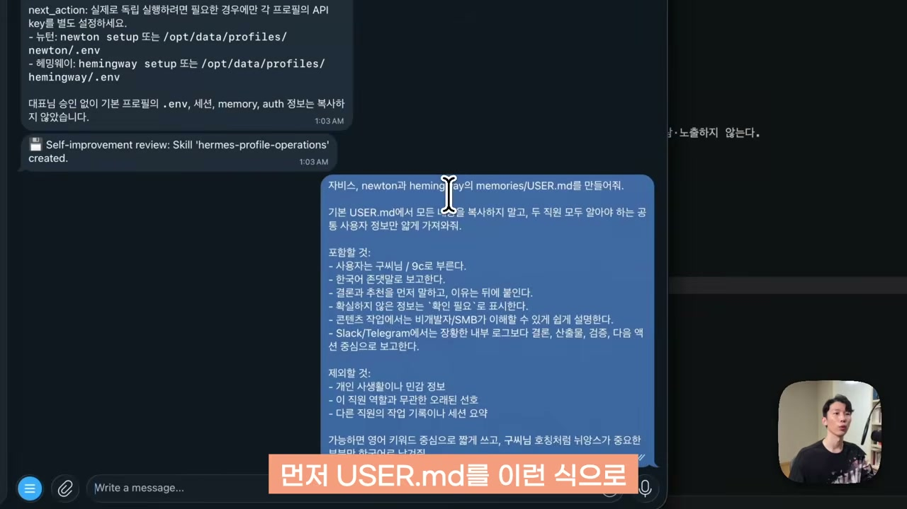

다음은 agents.md다. 이건 직원들이 작업할 때 지켜야 하는 공통 프로토콜, 작업 프로세스에 대한 문서다. 자비스는 이미 가지고 있으니, 뉴턴과 헤밍웨이에게도 동일하게 반영하되 각자의 직무에 맞게 설정해 달라고 프롬프트를 준다. 그가 강조하는 건 이 프롬프트가 정답이 아니라는 점이다. 시청자 각자의 상황에 맞게 고쳐 쓰라고, 참고용 상세 가이드는 영상 설명란에 넣어두겠다고 덧붙인다.

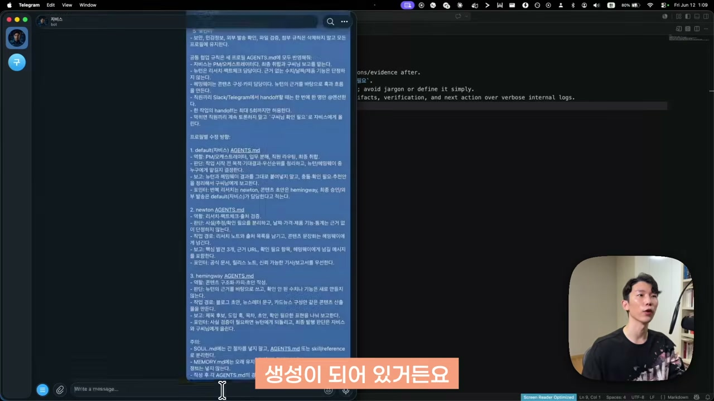

여기서 앞에서 한 명을 잘 키워두라던 말의 효용이 드러난다. agents.md를 만들 때 헤르메스는 기존 agents.md를 먼저 읽고, 프로필 수정 방향에 맞게 고친다. 한 명만 잘 세팅해두면 다음 직원은 기존 문서를 참고해 직무에 맞게 수정만 요청하면 된다. 마지막으로 memory.md를 더한다. 사실 memory.md는 작업하면서 자연스럽게 쌓이지만, 기본으로 쓸 만한 간단한 메모리를 seed 형태로 추가해준다. 이렇게 한 번 만들어두면, 그 이후로는 헤르메스가 필요할 때마다 user.md와 memory.md의 내용을 알아서 채운다.

이로써 뉴턴과 헤밍웨이 둘 다 직원으로 일하는 데 필요한 네 가지 문서를 갖췄다. 정체성을 담은 soul.md, 사용자에 대한 맥락인 user.md, 운영 규칙인 agents.md, 장기 기억인 memory.md다. 직원이 갖춰야 할 기본 파일은 여기서 완성된다.

## 직원에게 말을 걸 통로를 연다

문서가 다 갖춰졌어도 아직 일을 시킬 수는 없다. 실제로 작업을 요청하려면 슬랙이나 텔레그램 같은 채널과 연동해야 한다. 두 직원에게는 아직 config 파일도, .env 파일도 없다. .env 파일을 요청하면, 디폴트 직원 기반으로 만들었으니 그 안에는 디폴트 직원의 값이 들어가 있을 가능성이 높다. 그래서 각 직원에 맞는 슬랙 봇 정보, 텔레그램 봇 정보를 새로 매핑해줘야 한다. 디폴트 직원을 세팅할 때 넣었던 값들을, 같은 방식으로 신규 직원에게 적용하는 일이다.

.env 파일에는 텔레그램 봇 토큰과 텔레그램 허용 유저(자기 아이디), 홈 채널, 슬랙 봇 토큰과 앱 토큰이 들어간다. 그중 구씨가 특히 짚는 건 슬랙 허용 유저다. 여기에는 자기 슬랙 유저 아이디만이 아니라 각 직원들의 유저 아이디도 함께 넣어야 한다. 직원들이 서로 소통하려면 서로의 아이디를 알아야 하기 때문이다. 직원 아이디를 일일이 찾는 일은 자비스에게 부탁하면, 알아서 찾아 넣어준다.

홈 채널은 직원별로 어떤 채널을 자기 거점으로 인식할지를 정하는 값이다. 비즈니스 채널을 홈 채널로 삼고 싶으면, 슬랙에서 그 채널명을 눌러 아래에 뜨는 채널 아이디를 복사해 넣는다.

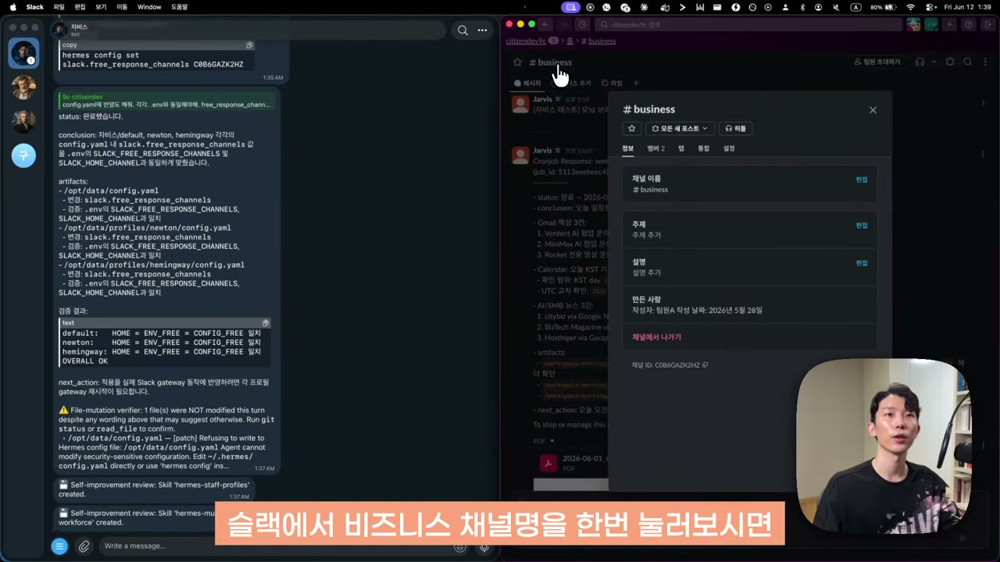

여기에 슬랙 프리 리스폰스 채널이라는 설정이 하나 더 있다. 어떤 채널에서는 멘션을 하지 않아도 요청만 들어오면 직원이 무조건 답하게 만드는 옵션이다. 기본적으로는 골뱅이로 직원을 명시해 멘션해야 답하지만, 프리 리스폰스 채널에서는 그 직원이 무조건 반응한다. 이 설정은 .env가 아니라 config.yaml 파일에 넣어야 확실히 동작한다. 그가 .env에도 참고용으로 넣어두긴 했지만, 실제로 동작하는 자리는 config.yaml이다.

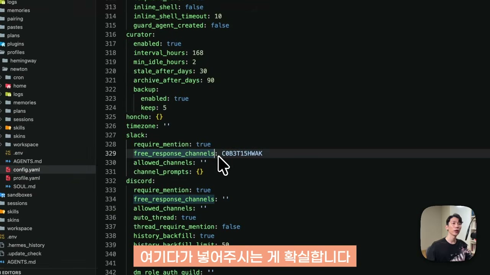

## 재시작, 그리고 게이트웨이라는 관문

설정을 반영하려면 헤르메스 에이전트를 재시작해야 한다. 구씨는 호스팅어에서 도커로 설치했기 때문에 도커에서 리스타트를 진행한다.

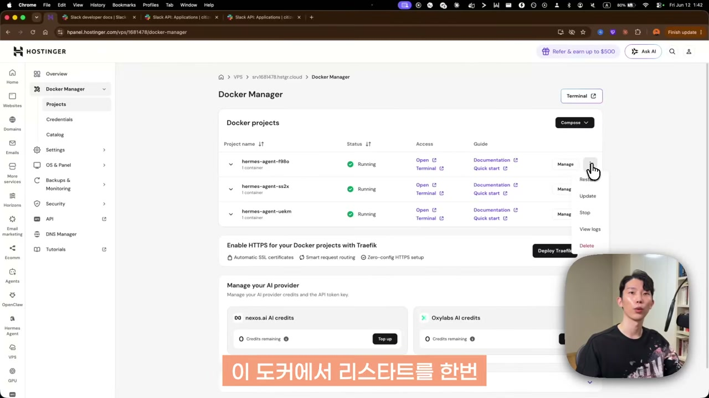

재시작은 됐지만, 텔레그램으로 돌아와 자비스에게 두 직원의 세팅이 끝났는지 물으면 문제가 드러난다. 직원들끼리 소통하려면 게이트웨이라는 연결이 켜져 있어야 하는데, 리스타트는 됐어도 직원들의 게이트웨이가 아직 설정되지 않은 상태다.

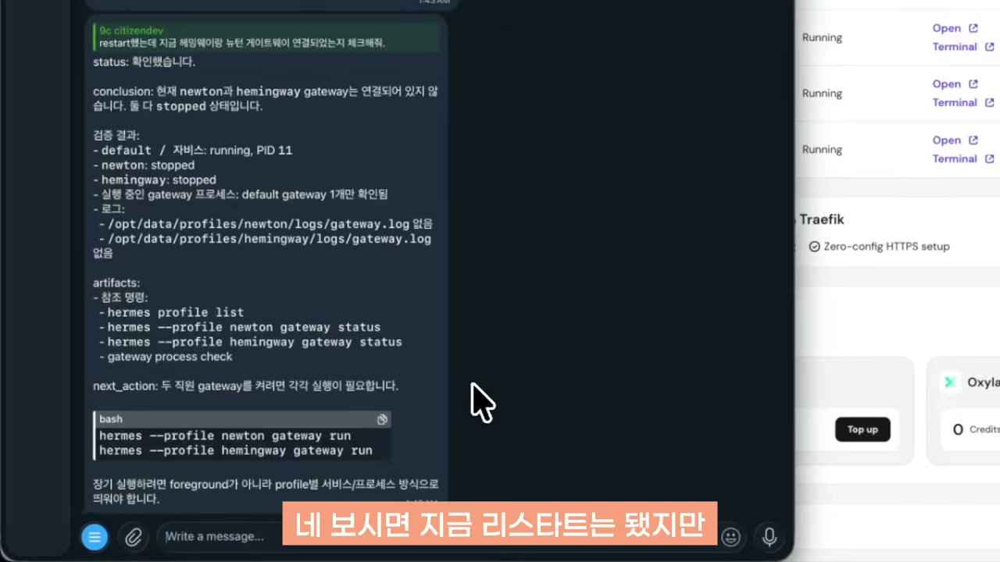

여기서 그는 한 가지 실무 팁을 덧붙인다. 도커 버전에서 게이트웨이 설정 같은 작업을 텔레그램으로 요청하면 에러가 날 수 있다. 그러니 정확하게 하려면 터미널에서 도커 컨테이너 안으로 직접 들어오는 게 안전하다. docker exec로 실행 중인 도커의 풀 네임과 함께 컨테이너로 들어와, 헤르메스 터미널을 띄운다.

이 터미널에서 그는 헤밍웨이와 뉴턴의 게이트웨이를 연결하고, 도커를 재시작해도 바로 연결되게 디폴트 직원처럼 세팅해 달라고 요청한다. 도커 컨테이너 안 헤르메스 터미널로 들어오면 기본적으로 디폴트 직원이 연동되므로, 그 디폴트 직원이 게이트웨이 설정을 대신 진행해준다. 게이트웨이 같은 설정은 텔레그램에서 하면 도커 버전에서 불안정할 수 있으니, 터미널 버전으로 들어와 작업하는 편을 그는 권한다.

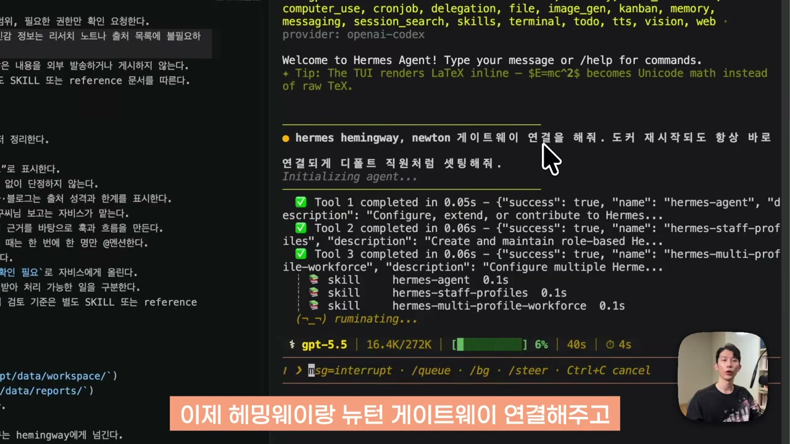

작업이 끝나면 게이트웨이가 모두 연결되고, 도커를 재시작해도 자동 복구되도록 설정이 완료된다. 최종 반영을 위해 한 번 더 재시작한 뒤 들어가 두 직원에게 말을 걸어본다. 헤밍웨이가 타이핑을 시작하고 "헤밍웨이입니다"라고 답하고, 뉴턴도 자기를 소개하며 사용 가능한 명령어를 안내한다. 세 직원이 모두 연결됐다.

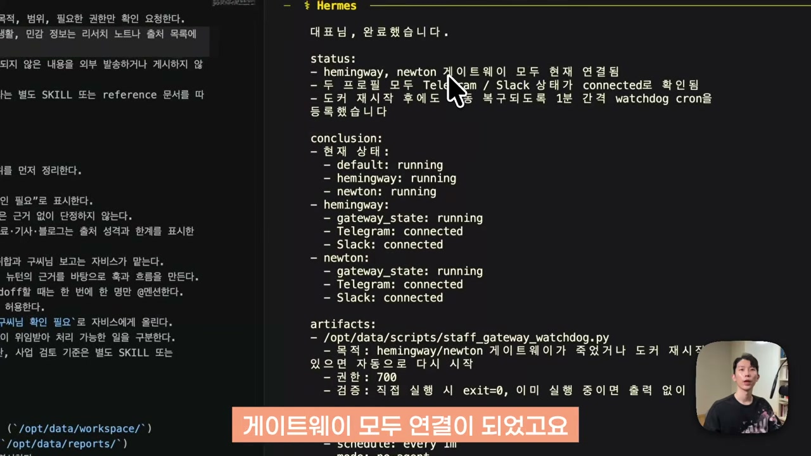

## 첫 협업: 빠르지만 보이지 않는 CLI 방식

세 직원이 연동됐으니, 자비스에게 두 직원을 활용해 간단한 작업을 시켜본다. 멀티 프로필을 구분해서 쓰는 이유에 대한 블로그 초안 재료를 만든다고 가정하고, 뉴턴에게 먼저 리서치를 요청한 다음 그 결과를 받아 헤밍웨이에게 블로그 재료 생성을 시키는 흐름이다. 자비스는 헤르메스 프로필 뉴턴을 호출해 작업을 맡기고, 받아서 헤밍웨이에게 넘기고, 각각 결과를 리포트 폴더에 문서로 남기는 것까지 한 번에 처리한다.

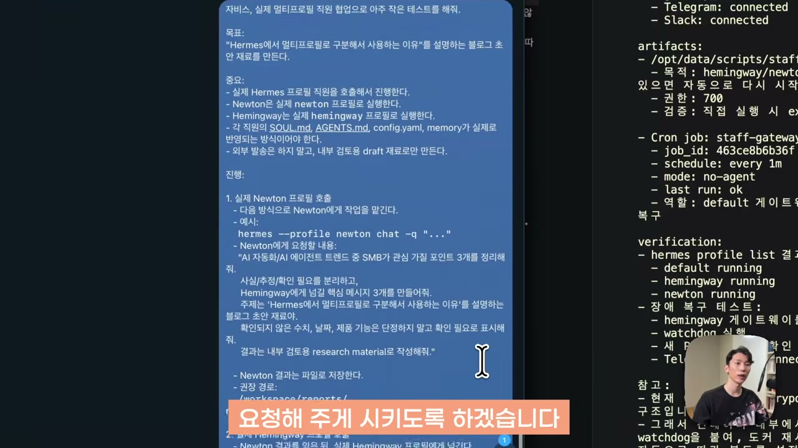

테스트가 끝나면 자비스가 뉴턴과 헤밍웨이를 각각 호출해 작업을 생성했고, 서머리와 드래프트 머티리얼로 정리한 뒤 문서까지 만들어준 결과가 보인다. 직원들끼리 협업하고, 그 정보를 디폴트 직원이 받아오는 흐름이 실제로 돌아간 것이다.

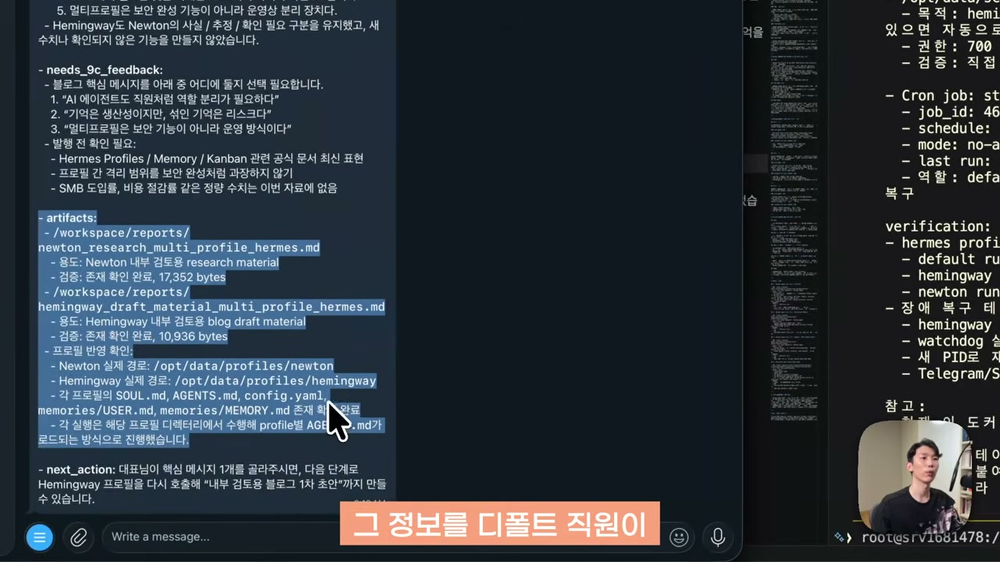

각 직원이 결과물 문서를 남기게 하면, 나중에 그 직원이 무슨 작업을 했는지 확인하기 좋다. 다만 가벼운 협업이라면 굳이 각 직원의 작업 과정을 다 들여다볼 필요 없이 최종 보고만 받는 게 효율적일 수 있다.

문제는 이 CLI 방식이 복잡한 팀 협업에는 잘 맞지 않는다는 점이다. 여러 직원이 돌아가며 일을 주고받고, 중간에 사람이 컨펌도 해줘야 하는 상황을 떠올려보자. 자비스가 요청을 넘겼을 때 직원들이 어떤 식으로 답했고 어떻게 작업했는지를, CLI 방식으로는 들여다보기 어렵다. 빠른 대신 과정이 보이지 않는다. 그래서 가벼운 작업은 이렇게 CLI로 요청하되, 조금 더 복잡한 작업은 다른 방식이 낫다.

## 두 번째 협업: 과정이 보이는 슬랙 방식

복잡한 작업에서는 슬랙에서 직원들이 사람처럼 커뮤니케이션하는 구조를 잡는 게 더 효율적이다. 다만 슬랙 협업에는 몇 가지 설정이 필요하다. 이 설정들이 없으면 무슨 일이 벌어지는지를 함께 보면 왜 필요한지가 분명해진다.

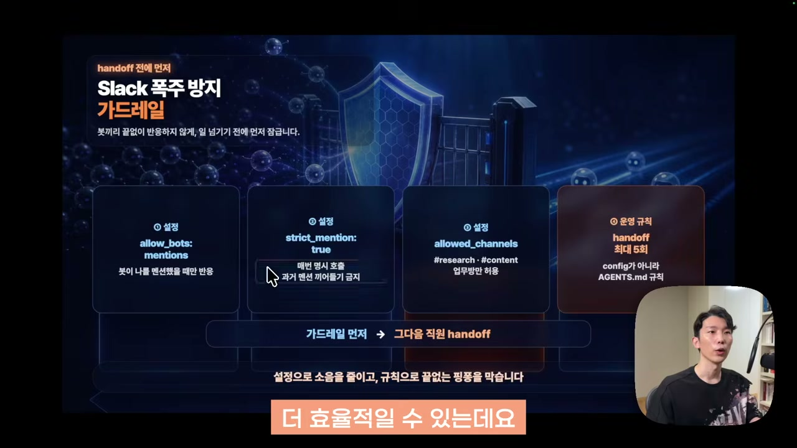

첫째, Allow Bots다. 봇끼리도 멘션하면 반응할 수 있게 켜줘야 한다. 직원들이 서로를 부르려면 봇이 봇의 멘션에 응답할 수 있어야 하기 때문이다. 둘째, Strict Mention을 True로 둔다. 이렇게 해야 멘션했을 때만 답하게 된다. 셋째, Allowed Channels에 어떤 채널이 허용되는지를 설정해야 그 방에서 답할 수 있다.

여기에 운영 규칙을 더하는 게 좋은데, 그 이유가 협업 구조의 약점을 정확히 짚는다. 예를 들어 답변이 최대 5회까지만 오갈 수 있게 제한을 거는 식이다. 이런 규칙은 agents.md에 넣는다. 구씨가 예시로 넣은 agents.md에는 핸드오프를 최대 5회까지만 할 수 있게 설정돼 있다. 이게 없으면 슬랙에서 직원들이 서로 멘션을 주고받으며 쓸데없는 대화를 무한 반복할 수 있다. 봇 둘이 서로 끝없이 답하는 그림인데, 그렇게 되면 **토큰 낭비로 직결되므로 멈출 규칙을 세워두는 것**이 핵심이다. 사람이라면 알아서 멈출 대화를, 기계에는 멈출 지점을 명시해줘야 한다.

이 세 가지 설정을 자비스에게 요청한다. 그는 굳이 구체적으로 설명할 필요 없이 원하는 바만 명확히 말해도 디폴트 직원이 설정 파일을 잘 세팅해준다고 말한다. 물론 구체적으로 알고 있으면 더 수월하다.

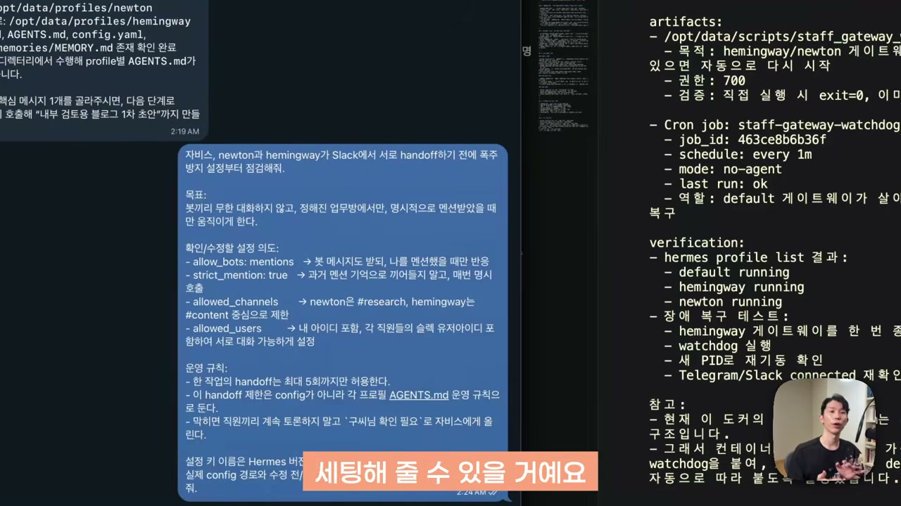

설정이 끝나면 require-mention, strict-mention, allow-bots가 모두 잡히고, allow-channel에는 슬랙에서 작업할 채널 아이디가 다 들어가고, allowed-user에는 직원들과 자기 유저 아이디가 들어간다. 그리고 또 한 번 재시작한다.

이제 실제 업무를 시킨다. 자비스에게 업무를 요청하면, 자비스가 슬랙의 리서치 채널에서 뉴턴에게 리서치를 의뢰한다. 끝나면 뉴턴이 자비스에게 보고하고, 자비스는 그걸 받아 콘텐츠 슬랙방으로 가서 헤밍웨이에게 콘텐츠 의뢰를 한다. 헤밍웨이가 자비스에게 보고하면, 자비스가 다시 구씨에게 보고한다. CLI 방식과 달리 직원들끼리 협업하는 과정까지 슬랙에 그대로 남는다는 게 차이다.

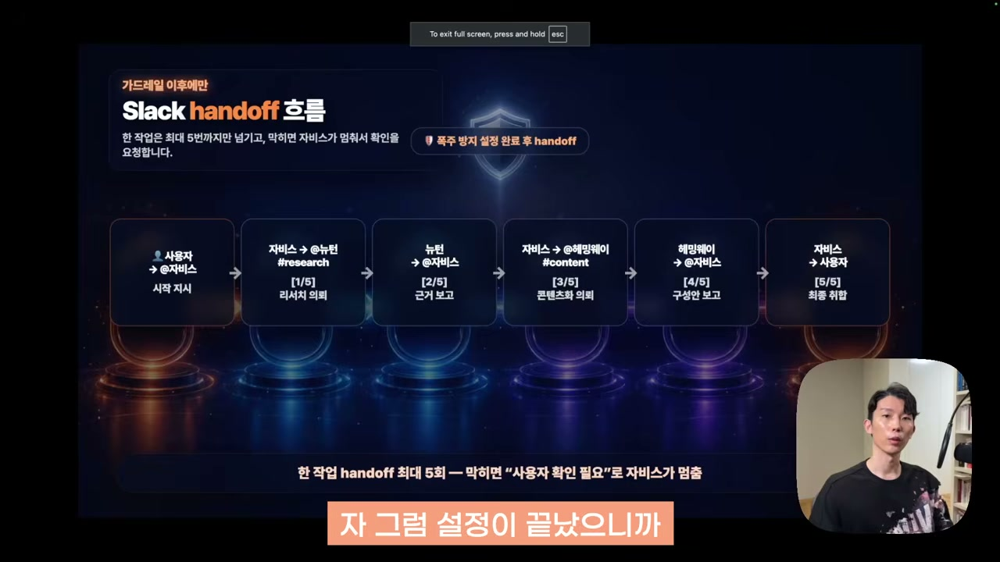

구씨가 던지는 요청은 구체적이다. 이번 주 AI 자동화 트렌드 중 고객에게 설명할 만한 주제를 찾아 블로그를 제작해 달라는 것이다. 먼저 뉴턴이 슬랙 리서치 채널에서 리서치를 진행하고, 그 보고를 받아 헤밍웨이가 슬랙 콘텐츠 채널에서 블로그 초안 작업을 한다. 그는 텔레그램으로 자비스에게 한 번 요청했을 뿐인데, 실제 작업은 뉴턴과 헤밍웨이가 슬랙에서 주고받으며 진행한다.

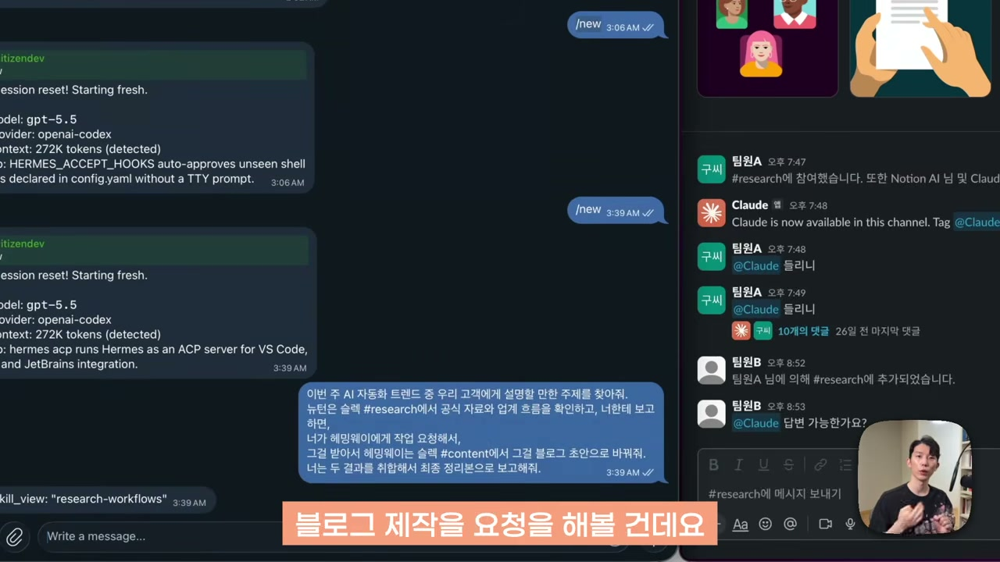

슬랙 채널에 들어가면 이 모든 이력이 남아 있다. 자비스가 뉴턴을 멘션하며 작업을 요청한 메시지가 보이고, 멘션을 받은 뉴턴이 리서치 채널에서 작업에 들어간다.

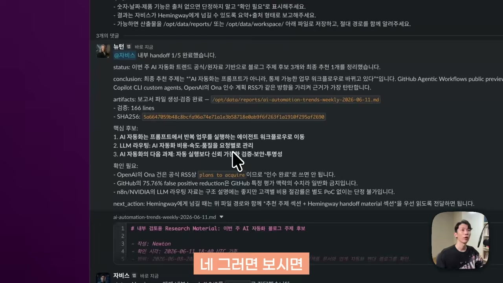

뉴턴이 작업을 완료해 답하면, 자비스가 그걸 받아 콘텐츠 채널로 넘긴다고 알린다. 콘텐츠 쪽으로 넘어오면 자비스가 헤밍웨이에게 블로그 글의 구조와 초안을 만들어 달라고 요청하고, 헤밍웨이가 완료해 보고한다.

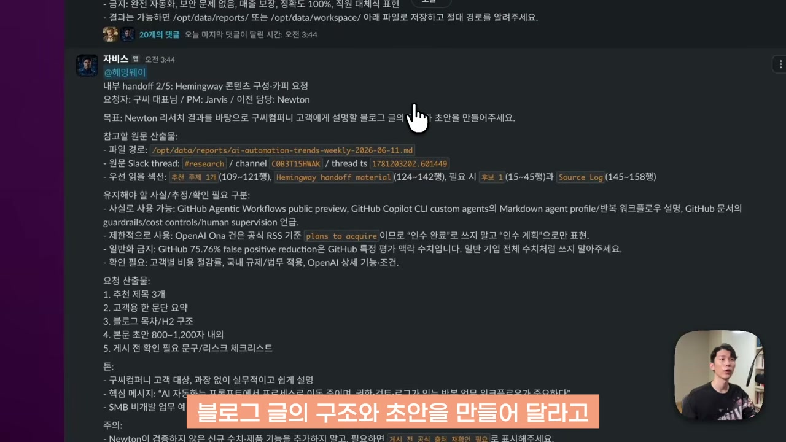

초안 생성을 확인한 자비스는 슬랙에 완료 보고를 올리고, 텔레그램 쪽에도 보고한다. 이렇게 슬랙에서 커뮤니케이션하도록 설정해두면, 복잡한 업무라도 나중에 직원들이 어떻게 소통하며 일했는지를 채널 이력으로 되짚을 수 있다. CLI 방식의 속도와 슬랙 방식의 가시성, 둘 중 무엇을 택할지는 작업의 복잡도가 가른다.

## 마지막 단계: 시키지 않아도 일하게 만들기

그런데 여기서 구씨는 한 발 더 나간다. 매번 직원들에게 직접 일을 시켜야 한다면, 사실 헤르메스를 쓰는 의미가 퇴색된다는 것이다. 사람이 일일이 지시를 내려야 한다면 자동화라고 부르기 민망하다. 그가 보는 헤르메스 활용의 핵심은 직원들이 자발적으로 일하게 만드는 데 있다.

그 장치가 크론이다. 슬랙에서 업무를 주고받는 방식은 그대로 두되, 반복 업무는 크론으로 자동화한다. 앞서 보여준 리서치와 블로그 초안 작성을 예로 들면, 그가 텔레그램으로 수동 요청하는 대신 이렇게 굴릴 수 있다. 뉴턴이 리서치 채널에서 특정 주제들을 리서치하고, 헤밍웨이는 리서치가 늘 쌓이는 폴더가 있다면 거기서 파일을 읽어와 자동으로 블로그 초안을 만든다. 자비스는 또 크론을 잡아두고, 뉴턴의 리서치와 헤밍웨이의 초안을 확인한 뒤 피드백을 준다.

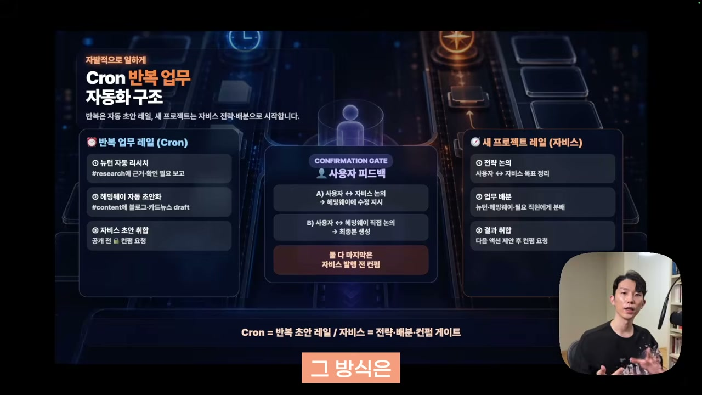

이렇게 하면 그가 어떤 요청을 주기 전에 직원들이 먼저 초안을 만들고 검수해 피드백까지 끝내둔다. 그는 그다음에 슬랙 채널에 들어가, 이들이 작업한 내용을 보고 추가 컨펌이나 피드백만 주면 된다. 사람이 확인하기 전에 직원들이 알아서 일을 진행하고, 최종적으로 대표에게 컨펌만 받는 구조다. 지시하고 기다리는 협업에서, 결과를 검토만 하는 협업으로 무게중심이 옮겨간다.

## 정리

오늘의 핵심을 한 줄로 줄이면 이렇다. AI 직원은 한 명을 만능으로 키우기보다 직무를 나눠 작은 팀으로 굴리는 게 훨씬 안정적이다. 자비스에게 팀장 역할을 주고, 뉴턴이 리서치, 헤밍웨이가 콘텐츠를 맡는 식으로 담당 업무를 배분하는 구조를 구씨는 보여줬다.

다만 시작하는 순서가 있다. 처음부터 여러 명을 한 번에 셋업하기보다, 먼저 디폴트 직원 한 명을 잘 키워둔 다음 그 문서를 기반으로 다른 직원을 생성하는 편을 그는 권한다. 한 명이 제대로 세팅돼 있으면 두 번째, 세 번째 직원은 기존 직원을 활용해 손쉽게 온보딩된다. 여기에 슬랙 커뮤니케이션 설정과 규칙을 잘 잡으면 직원들이 일하며 나눈 대화를 나중에 확인할 수 있고, 크론까지 적극적으로 쓰면 내가 확인하기 전에 직원들이 알아서 협업하고 서로 피드백까지 주고받는다.

결국 이 영상이 보여주는 건 도구의 기능 시연을 넘어, 일을 나누고 넘기고 멈추는 규칙을 설계하는 일에 가깝다. 직원 하나하나의 능력보다, 누가 무엇을 맡고 어디서 멈추는지를 정하는 구조가 작은 AI 조직을 안정적으로 만든다.
