"내용 자체는 부정적일 수 있습니다." 영상은 이 경고로 문을 연다. 널널한 개발자 TV의 진행자는 2026년 6월 12일 오후 5시 50분, 마이크 앞에 다시 앉았다. 페이블 5가 세상에 공개된 지 며칠 안 됐고, 그는 앞서 "이 모델이 인간 개발자, 특히 지식 노동자의 퇴사를 앞당길 것 같다"는 취지의 영상을 한 번 올린 적이 있다. 그런데 정작 그 근거를 제대로 설명하지 못한 것 같아서, 이유를 말하려고 돌아왔다는 것이다.

그는 두 가지를 먼저 못 박는다. 하나, 최종 판단은 자기가 아니라 보는 사람이 할 일이다. 둘, 여기서 말하는 이유는 객관적이라기보다 자신의 주관적 판단이다. 이 두 단서를 깔고 본론으로 들어간다. 그가 끌어오는 근거는 거창한 통계가 아니라, 클로드 코드를 만든 사람이 며칠 전 SNS에 흘린 짧은 글 한 줄에서 시작한다.

## 창시자가 흘린 단어 하나

보리스 체르니. 클로드 코드를 만든 사람으로 알려진 인물이고, 자신의 X 계정에 하네스 엔지니어링을 비롯한 여러 생각을 자주 공유한다. 진행자의 표현을 빌리면 "클로드 코드를 만든 사람의 의견이니 무시할 수는 없"다.

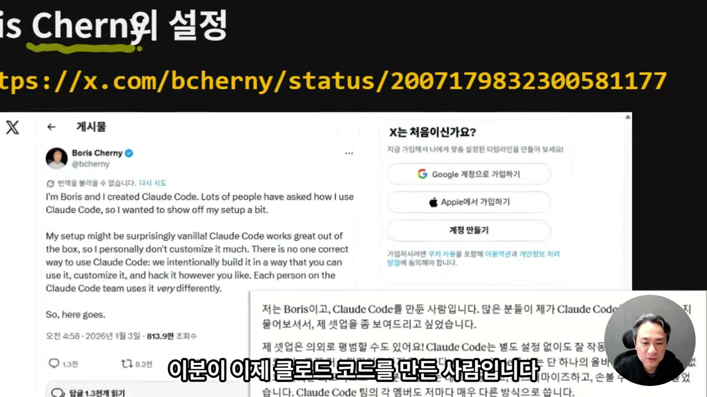

그 체르니가 며칠 전, 진행자가 6월 10일로 추정하는 날에 새 글을 올렸다. 핵심은 이렇다. "Opus 4.5 이후로 가장 큰 발전을 느꼈다." 진행자가 보기엔 나름 격찬이다. 그리고 같은 맥락에서 흥미로운 고백이 하나 더 붙는다. Opus 4.5가 나온 뒤로 자기는 터미널에서만 코딩한다는 것, 즉 IDE 자체가 필요 없어졌다는 것이다.

여기까지는 모델 칭찬으로 들린다. 진행자가 진짜 방점을 찍는 곳은 따로 있다. 체르니가 꺼낸 표현 중 "자체 검증 루프"라는 말, 그리고 "장시간 실행될 수 있는 강력한 모델"이라는 말이다.

이 "루프"라는 단어가 영상 전체를 관통한다. 클로드가 결과를 내놓기 전에 자기 작업을 스스로 검토하고, 그다음 피드백 루프를 완료하도록 동작한다. 진행자가 미토스급 모델, 즉 페이블 5에서 가장 중요하게 본 성능도 정확히 이 지점이다. 화려한 벤치마크 숫자가 아니라 "장시간 작동한다"는 것 하나.

## 멈추지 않는다는 것의 무게

또 한 사람, 앤트로픽 내부 개발자로 추정되는 랜스 마틴이 "페이블 5를 이용한 루프 디자인하기"라는 글을 올렸다. 진행자는 여기서 모델들을 일렬로 세워 비교하는 그림을 가져온다.

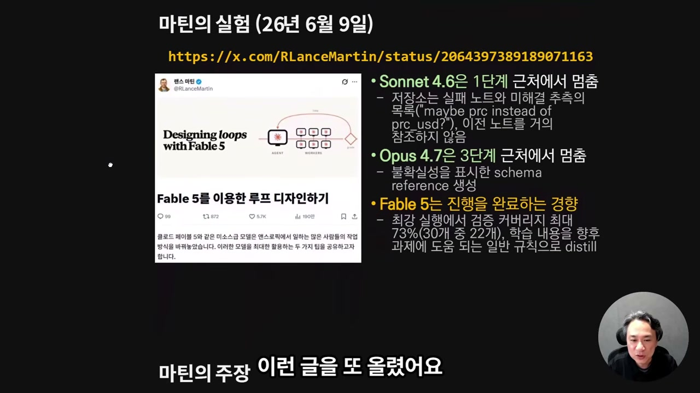

어떤 일을 할 때 절차가 있다고 하자. 1단계를 밟고, 2단계로 가고, 다음 단계로 가고, 필요하면 앞 단계로 되돌아오는 식으로 5단계까지 흐른다고 치자. 이 흐름 위에 모델을 올려보면, 소넷 4.6은 1단계 근처에서 멈춘다. 여기서 "멈춘다"는 건 모델이 지시받은 작업을 더는 진행할 수 없다고 스스로 판단해 손을 놓는 것이다. 더 어떻게 못 하고 그 자리에 서버리는 것.

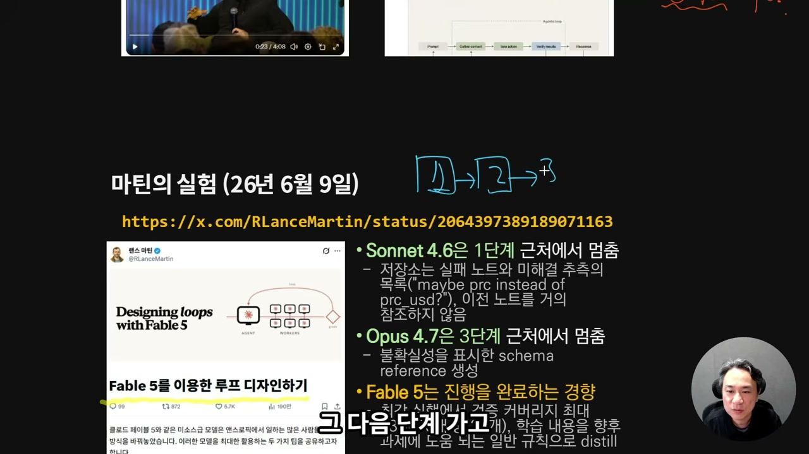

마틴의 그림은 Opus 4.7로 설명돼 있었는데, 진행자는 왜 4.7인지는 모르겠다며 자기 기준을 댄다. Opus 4.8로 간단한 프로젝트를 직접 돌려보니 3단계는 그냥 넘기고 그 이상까지 갔고, 심지어 루프를 꽤 잘 돌아줬다는 것이다. 그가 페이블 5의 가장 큰 강점으로 꼽는 한 문장은 이거다.

**죽이 되든 밥이 되든 결과를 낸다.**

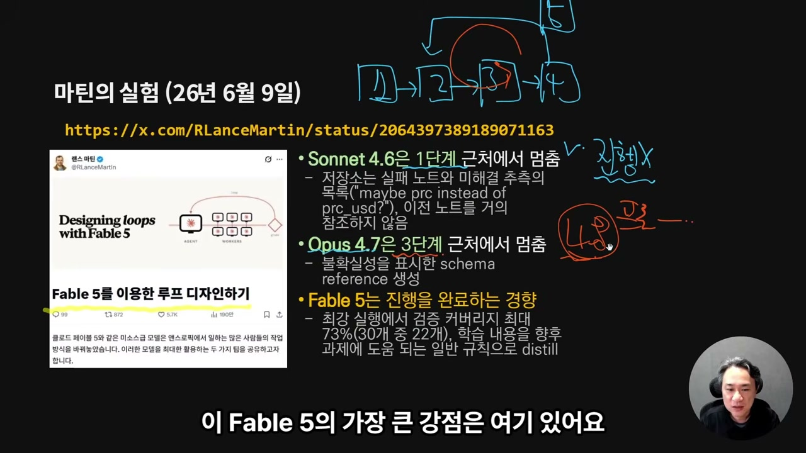

마틴의 주장에 따르면 페이블 5는 Opus 4.7 대비 학습 파이프라인을 약 6배 개선했고, AI 에이전트를 클라우드에서 운영하는 인프라 계층인 CMA에서 파라미터 골프 같은 테스트를 거치며 매우 뛰어난 성능을 보였다. 진행자는 이 수치들을 빠르게 훑고 지나간다. 그에게 중요한 건 6배라는 숫자 자체가 아니라, 그 숫자가 가리키는 한 가지 사실, 모델이 끝까지 간다는 것이기 때문이다.

## 우리 일이 이미 루프였다

여기서 진행자는 화면을 인간 개발자의 일상으로 돌린다.

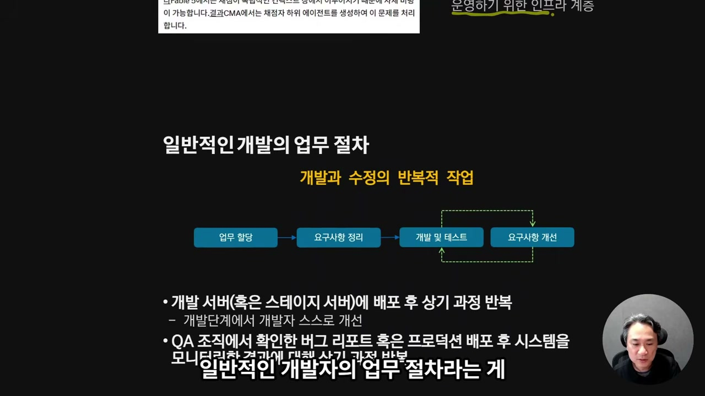

기획 회의에서 신규 기능 얘기가 나온다. 마케팅이나 경영이 개입할 수도 있다. 어쨌든 개발 업무가 생기면 누군가에게 할당된다. 할당받은 사람은 "내게 주어진 업무가 뭐지"부터 따진다. 개발해달라는 요구사항이 구체적으로 무슨 뜻인지 해석하고, 코드로 옮기기 위한 대책을 세우고, 정리가 끝나면 개발에 들어간다. 다 짠 다음엔 스스로 테스트하거나 동료에게 코드 리뷰를 받는다. 배포판이 나와도 바로 내보내지 않고 개발 서버나 스테이지 서버에 올려 내부 테스트를 한다. 문제가 없으면 QA 조직에 넘긴다. 거기서 개선사항이 나오면 요구사항을 다시 정리하거나 곧장 개발에 반영한다.

그러면 결국 무엇이 나오는가. 루프다.

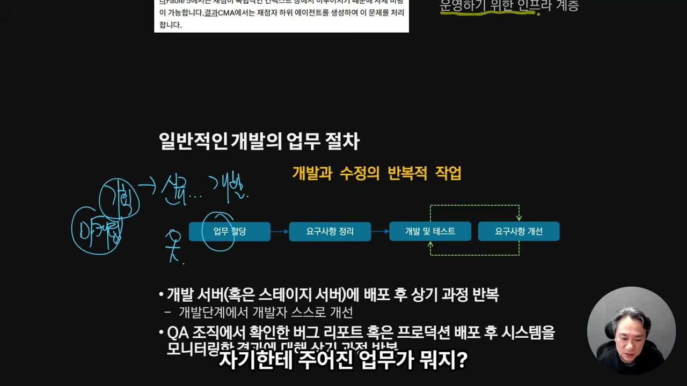

진행자는 "너무나 당연한 얘기"라고 한 박자 쉰 뒤, 이 당연한 절차와 체르니가 흘린 "루프"라는 단어를 포개 놓는다. 그러자 무서운 결론에 도달한다는 것이다. 개발자의 업무 자체가 곧 이 루프인데, 페이블 5가 바로 이 루프를 끝까지 돌릴 수 있게 됐기 때문이다.

왜 무서운지 그는 더 풀어낸다. 페이블 5는 이미지 처리 능력이 좋아서 브라우저 화면을 보면서 작업할 수 있다. 사실 AI는 브라우저를 굳이 볼 필요도 없다. curl 같은 명령으로 웹 서비스에 직접 접근해 인간처럼 QA 테스트를 수행할 수 있으니까. 여기에 바이브 코딩, 즉 코딩 자체를 AI가 했다고 가정해보자. 그러면 AI는 내부 코드까지 이미 이해한 상태다. 그 이해를 깔고 개발자처럼 테스트를 돌리거나, 코드를 안 보고 단순 QA 테스트를 돌릴 수 있다. 그 결과가 다시 피드백으로 AI에게 돌아간다. 루프가 시작된다.

> 이 루프나 인간 개발자의 루프나 크게 다를 건 없겠죠.

차이가 하나 있다면 인간 쪽이다. 사람은 퇴근하고, 월차 쓰고, 연차 쓰고, 휴가를 간다. 진행자가 짚는 무서움은 정확히 그 빈자리다. "저 루프에서 사람을 빼고 오직 AI만으로 업무를 진행하는 게 가능해졌다." 그동안 개발 전 과정에 AI를 끼워 넣으려는 시도는 계속 있었지만 잘 안 됐는데, 페이블 5부터 된다고 결론이 내려졌다는 것이다.

## 루프 엔지니어링이라는 신조어

이 새로운 일에 이름이 붙었다. 루프 엔지니어링.

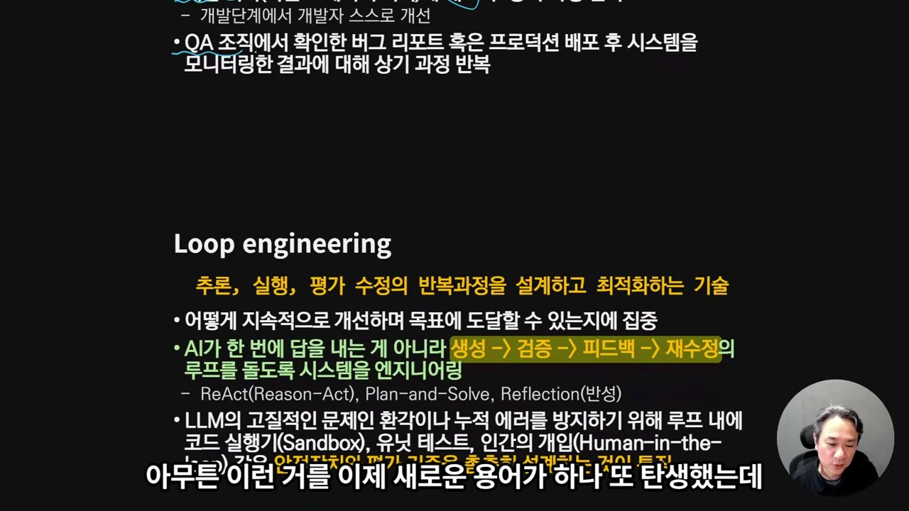

진행자는 "말장난 같긴 하지만"이라며 웃지만, 이어지는 설명은 웃을 일이 아니다. AI로 추론하고, 코드 만들고, 내부적으로 QA 테스트하는 일련의 과정을 인간이 설계만 잘 해놓으면 된다는 것이다. 그걸 하네스 엔지니어링이라 부르든 명확한 지침 설계라 부르든 이름은 상관없다. 핵심은 구조를 한 번 잘 짜두면 그다음부터 AI가 스스로 개선해 나간다는 데 있다.

목표를 하나 던진다. 그 목표가 기능이든 서비스든 하나의 단위가 되어준다면, 사람은 말 그대로 "딸깍" 한 번이면 된다. 물론 그는 곧바로 토를 단다. "설계를 딸깍이라고 부를 수는 없어요." 정밀한 설계만 해놓으면, 남은 과정은 생성하고, 코드 만들고, 리뷰하고, 피드백 받아 다시 수정시키고, 이 반복이 전부라는 얘기다. 그리고 그걸 페이블 5가 "너무 잘" 해냈다는 데 방점이 찍힌다.

LLM에는 늘 환각과 에러 누적이라는 고질병이 있었다. 진행자가 문제로 보는 건, 페이블 5가 그 병을 스스로 극복 가능한 형태로 발전했다는 점이다.

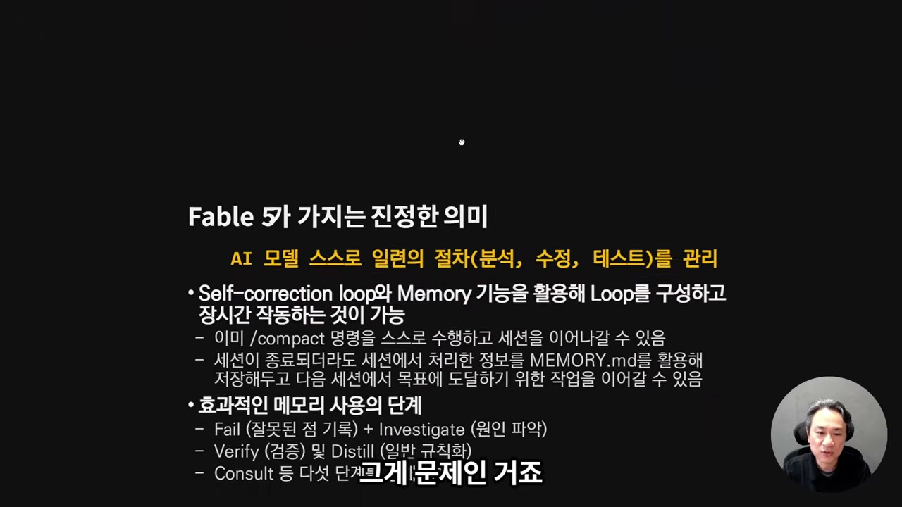

스스로 검증하고 교정하는 셀프 커렉션 루프, 그리고 메모리 기능. 이 둘이 합쳐지면 모델이 장시간 문제없이 작동한다. 여기서 "문제 상황"이란 더 이상 진행할 수 없는 순간을 말하는데, 그 진행 불가 상황만 극단적으로 낮춰주면 끝이라는 것이다.

메모리 얘기가 나오자 그는 클로드 코드 사용자에게 익숙한 파일 하나를 꺼낸다. MEMORY.md다.

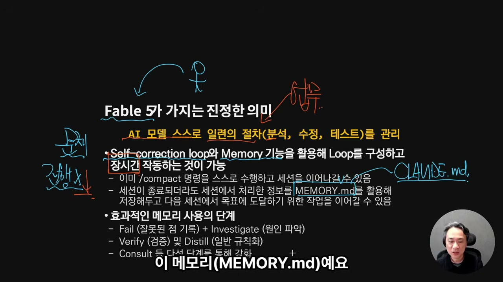

그의 구분에 따르면 CLAUDE.md는 지침에 가깝고, MEMORY.md는 개발 과정에서 AI가 스스로 판단한 정보를 담는 곳이다. 문제는 이걸 들고 있으면 대화 세션을 가로지를 수 있는 토대가 마련된다는 데 있다. 진행자는 Opus 4.8 업데이트 때 이 기능을 그저 "성능이 좋아지는 재미있는 기능" 정도로만 봤다고 고백한다. 그런데 더 깊이 생각해보니 다른 그림이 보였다는 것이다. 잘 저장해두고 다음 세션에서 목표를 향한 작업을 그대로 이어갈 수 있다는 것. 남은 건 단 하나, AI가 "더 못 하겠다"는 판단만 내리지 않거나, 그런 상황에 부딪혀도 스스로 돌파해버리는 것이다.

> 그러면 이제 얘기가 무서워지기 시작하는 거죠.

## 결국 AI가 문제다

진행자는 "결국 AI가 문제"라고 두 번 반복한다. 그러면서 이게 소프트웨어 개발에만 한정된 얘기냐고 스스로 묻고, 아니라고 답한다. 모든 지식 노동 전반에서 그렇게 될 텐데, 개발 분야가 유독 수치화해서 정확히 말하기 좋을 뿐이라는 것이다.

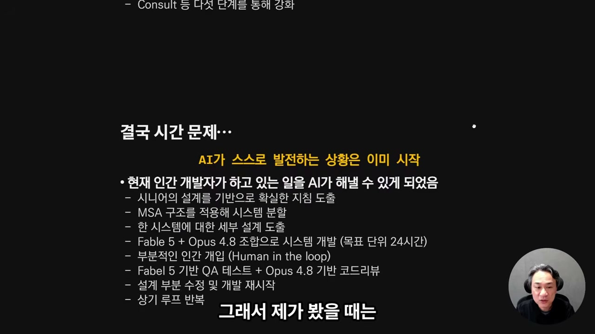

그가 드는 장치가 TDD다. 성공과 실패의 규칙이 굉장히 명확하다면 AI는 멈추지 않는다. 시니어급 엔지니어가 설계를 잘해서 정확한 지침을 도출해두고, 거기서 출발 신호를 끊는다. AI에게 개발을 시작하라고 한 뒤, 적절히 구조를 분할하고 단위화를 잘해준다. 단위별로 잘라 구현하면 절차를 세우기도 쉬워지고, 그 단위 안에서 다시 세부 설계가 나온다.

역할은 둘로 갈린다. 끌고 가는 건 페이블 5가 하고, 실제 코드 작성은 Opus 4.8 정도로 해도 된다는 구도다. 목표를 주고 24시간이든 48시간이든 페이블 5가 포기만 하지 않는다면 목표에 도달할 가능성이 높아졌고, 어느 지점까지는 무조건 결과가 나온다. 그러면 인간이 할 일은 루프에 끼어들어 테스트 일부에 개입하는 정도인데, 그마저도 페이블 5가 QA 테스트까지 자동으로 처리하도록 구성할 수 있다. 루프만 그렇게 짜두면, 거기서 나오는 결과로 다시 프롬프트를 생성하고, 그 프롬프트를 코드 작성용 Opus 4.8에 주입하면 계속 개발이 돌아간다.

## AI가 AI를 키우는 중

그리고 그는 이 모든 게 그저 가능성에 그치지 않는다는 증거를 댄다. 며칠 전, 정확히는 일주일 전 앤트로픽 공식 블로그에 올라온 글이다. 화면에는 "When AI builds itself"라는 제목이 떠 있다.

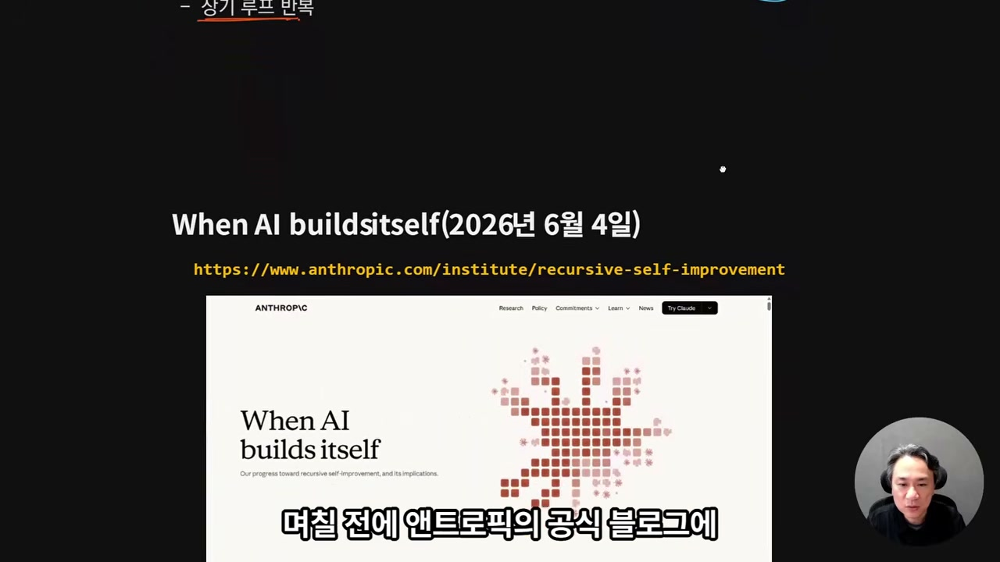

여기 담긴 수치를 진행자는 하나씩 짚는다. 앤트로픽의 엔지니어당 코드 반영량이 2024년 대비 8배로 늘었다. 그리고 2026년 5월 기준, 실제 프로덕션에 머지되는 코드의 80% 이상을 클로드가 작성했다. 사람이 한 건 20%뿐이라는 얘기다.

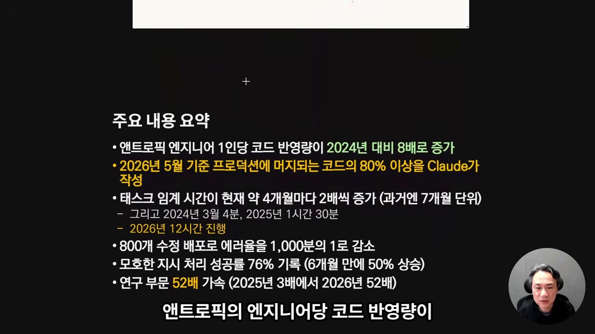

진행자는 여기서 한 걸음 더 나간다. 2026년 5월이 이 정도라면, 2027년 5월엔 몇 퍼센트가 돼 있겠느냐는 것이다. 근거는 또 있다. AI가 한 번에 처리할 수 있는 태스크의 임계 시간이 4개월마다 거의 2배씩 늘고 있다는 수치다. 과거엔 7개월 단위였는데 지금은 4개월이다. 그래서 2026년 현재 기준 12시간 정도는 무리 없이 간다. 지시가 모호해도 처리 성공률이 76%였고, 딥리서치 같은 연구 활동에서는 52배 가속이 시작됐다고 한다.

그가 내리는 진단은 묵직하다.

> 결국 AI는 현재 리커시브 셀프 임프루브먼트 상황을 이미 맞이하고 있는 것으로 보여요.

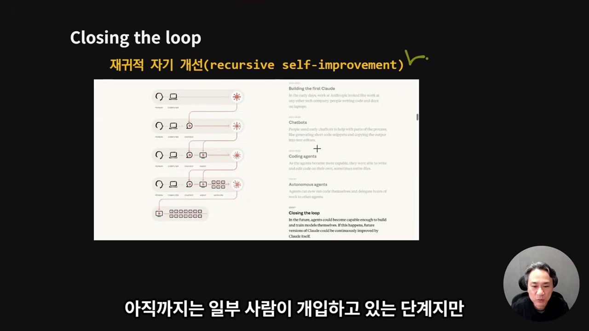

아직은 일부 사람이 개입하는 단계다. 하지만 앤트로픽의 그림은 곧 다음 단계, "Closing the loop"로 넘어간다고 그려져 있다. 진행자의 추론은 단순하다. 코딩 에이전트가 나와 화제가 된 게 불과 1, 2년 전이다. 지금의 두 배만 끌어올리는 데 1년이 걸린다고 잡아도 2027년이고, 그때면 이미 릴리스돼 있을 거라는 것이다. 그는 "아닐 거다"라는 반론을 스스로 떠올려보지만, 결국 "굉장히 빠른 속도로 그렇게 될 것 같다"로 돌아온다.

남는 변수는 소프트웨어가 아니라 물리적인 쪽, 하드웨어다. 램이 모자라네, 생산이 되네 마네, 전력 문제가 있네 없네 하는 얘기들. 이 물리적 병목만 지금보다 조금 더 개선해준다는 가정을 더하면, 루프를 통한 재귀적 자기개선은 결국 이루어질 거라고, 그것도 생각보다 빠른 시일 안에 그럴 거라고 그는 개인적으로 본다.

## 그래서, 코딩을 시키지 마라

영상의 마지막은 의외로 실용적인 조언이다. 진행자는 다시 한번 판단은 여러분 몫이라고 물러서면서도, 냉정하게 현실을 받아들일 필요가 있지 않으냐고 묻는다. 이제 중요한 건 대책이고 대응이라는 것이다.

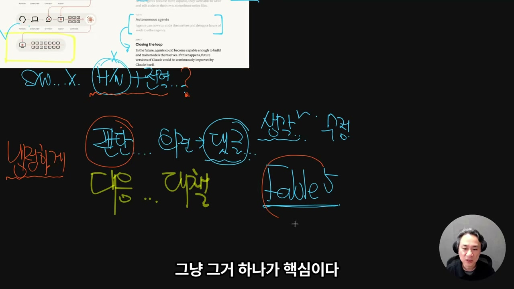

수치를 다 떠나서 그가 페이블 5의 핵심으로 다시 압축하는 한 가지는 이거다. 12시간 정도를 쉬지 않고, 어떻게든 수단을 찾아내 지속적으로 작업한다는 것. 이게 12시간에서 24시간으로 늘어나는 데 얼마나 걸리겠느냐고 그는 묻고, 사람이 설계만 조금 잘해주면 자동으로 늘어날 거라고 답한다.

그리고 던지는 구체적인 팁. 페이블 5는 비싸다. 그러니 이걸로 코딩을 시키지 마라. 대신 QA 테스트, 설계, 검증, 거기서 프롬프트를 도출하는 일에만 써라. 딱 그 정도만 하면 생각보다 토큰을 많이 안 쓴다는 것이다. 실제 코드 작성은 Opus 4.8에게 맡긴다. 그러면 페이블 5가 Opus 4.8을 끌고 24시간 내내 돌아가는 게 불가능하겠느냐고 그는 되묻는다.

> 안 될 이유가 뭐가 있죠? 저는 없다고 생각합니다.

이 대목에서 그는 자신의 경험을 근거로 댄다. 공개하기는 좀 그렇다며 자세히는 말하지 않지만, 12시간을 돌려보진 않았고 한 4시간 정도는 돌려봤다는 것이다. 그 4시간까지는 잘 돌아가는 걸 확인했고, "이런 모습은 저도 처음 봤"다고 한다. 사실 그는 혼자 일하는 처지라 자동화가 늘 필수였고, 그런 루프를 만들려는 생각도 줄곧 있었다. 그래서 직접 돌려보며 든 감정이 묘하다.

> 걱정 아닌 걱정이, 걱정 아닌 정말로 걱정이 늘게 된 거죠.

이게 그가 가진 근거의 전부다. 다음 영상에서 뭔가를 만든다면, 설계를 어떻게 처리했더니 작동 시간이 늘더라는 자기 경험을 근거로 한 것이 되지 않을까 한다며 그는 끝을 맺는다. 어쨌든 이런 세상은 이미 왔고, 그러면 우리는 어떻게 해야 할지 스스로 판단하는 것 외에 다른 도리는 없는 것 같다고.
