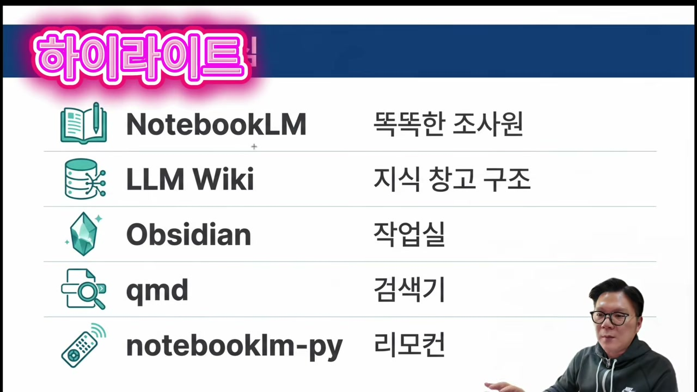
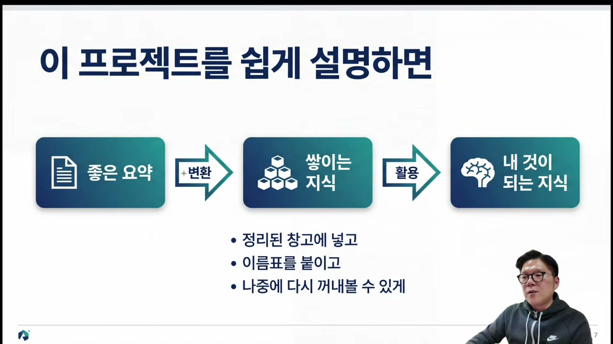
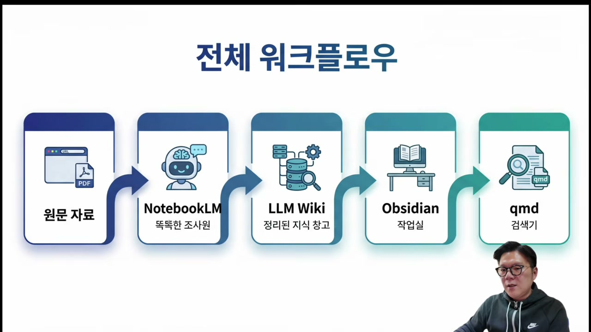
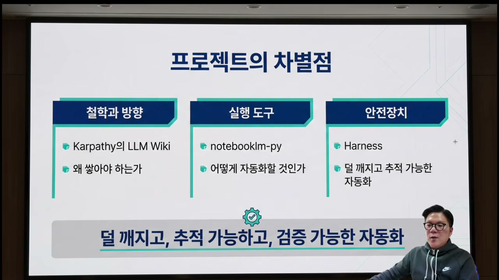
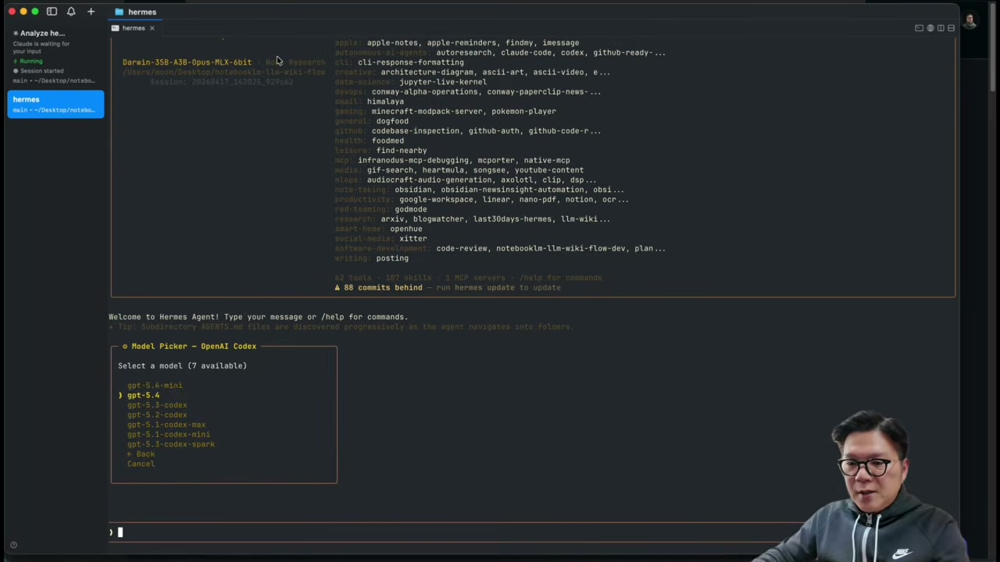
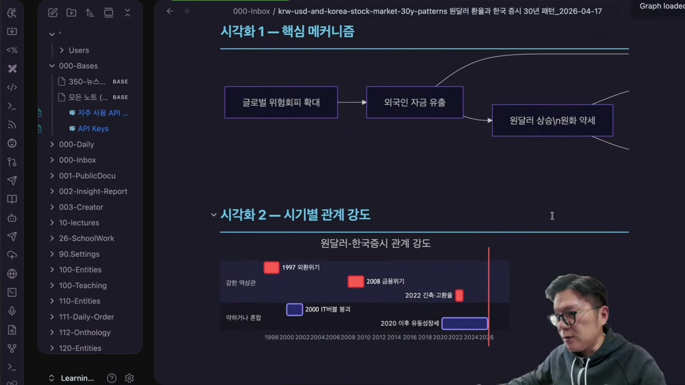
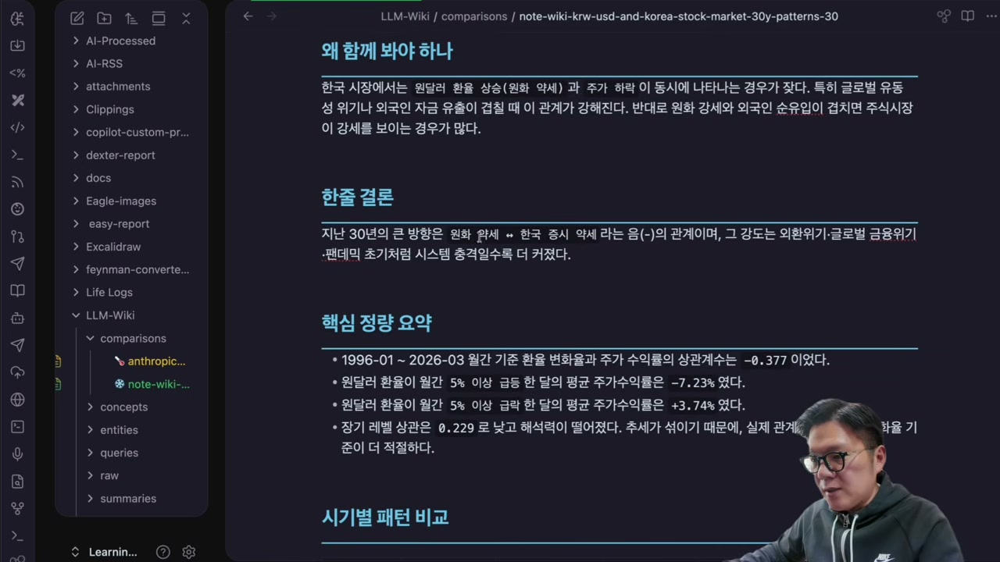
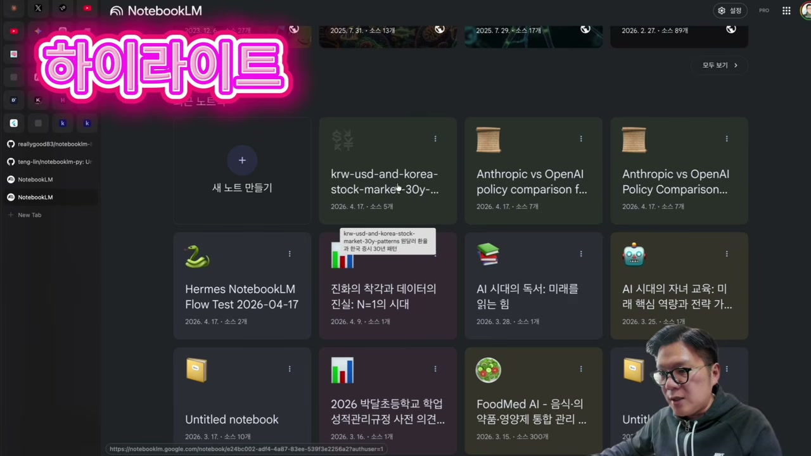
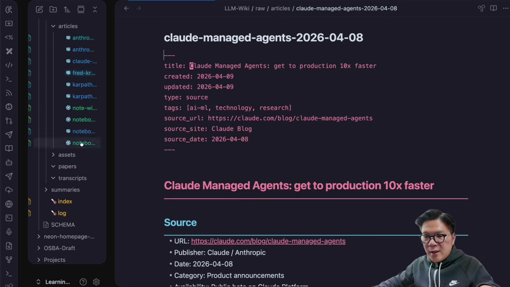

AI에게 무언가를 조사시킬 때마다 비슷한 허무함을 느낀 적이 있을 것이다. 분명 좋은 답을 받았는데, 창을 닫는 순간 그 내용은 어디론가 사라진다. 다음에 같은 주제가 필요하면 처음부터 다시 물어봐야 한다. 좋은 요약은 매번 새로 만들어지고, 매번 휘발된다.

배움의 달인 채널의 영상 한 편은 바로 이 문제를 정면으로 겨냥한다. 안드레이 카파시가 공개한 LLM 위키 개념을 가져와서, NotebookLM이 조사한 내용을 옵시디언(Obsidian) 안에 자동으로 쌓이는 지식 창고로 바꾸는 흐름을 직접 시연한다. 화자 자신의 표현을 빌리면, 목적은 단순하다. "AI가 만든 좋은 자료를 사라지지 않게" 하는 것.

## 다섯 개의 도구, 다섯 개의 역할

영상은 개념 설명이 필요하다고 판단해 PPT부터 꺼낸다. 첫 슬라이드는 이 워크플로우에 등장하는 도구 다섯 개를 한 줄씩 정리한 것인데, 각각에 사람 비유를 붙여 둔 게 핵심이다.

NotebookLM은 똑똑한 조사원이다. 실제로 자료를 찾아오는 주체다. LLM Wiki는 그 자료를 담는 지식 창고의 구조이고, 옵시디언은 사람이 직접 들여다보는 작업실이다. 여기에 검색을 담당하는 qmd, 그리고 NotebookLM을 터미널 안에서 부리는 리모컨 역할의 notebooklm-py가 붙는다.

이 구성에서 한 가지 짚고 넘어갈 부분이 있다. 보통 우리는 NotebookLM을 웹 브라우저로 연다. 그런데 이 워크플로우는 NotebookLM을 브라우저가 아니라 CLI, 즉 터미널 명령으로 쓴다. 화자의 설명으로는 브라우저의 NotebookLM에서 플레이라이트(Playwright)로 조사 결과를 저장해 CLI로 받아오는 식이다. 화자는 이 방식의 장점으로 토큰 절약을 든다. 터미널에서 직접 웹서치를 시키는 대신 NotebookLM에 조사를 떠넘기고 결과만 받아오니, 에이전트가 소모하는 토큰을 아낄 수 있다는 것이다.

## 왜 카파시의 LLM 위키인가

화자가 이 프로젝트를 만들게 된 출발점은 카파시의 LLM 위키였다. 다만 솔직한 고백이 따라붙는다. 개념은 알겠는데 "이 내용을 어떤 식으로 활용하면 좋을까"를 두고 고민을 꽤 많이 했다는 것이다. 그러다 헤르메스 에이전트(Hermes Agent)가 LLM 위키를 기본 스킬로 제공한다는 걸 알게 되면서 실마리가 풀렸다.

LLM 위키가 추구하는 바를 화자는 PPT 한 장으로 정리한다. 좋은 요약을 '변환'해서 쌓이는 지식으로 만들고, 그 지식을 '활용'해서 결국 내 것이 되는 지식으로 만든다는 3단계 흐름이다.

슬라이드 아래에 달린 세 줄이 이 개념의 알맹이다. "정리된 창고에 넣고", "이름표를 붙이고", "나중에 다시 꺼내볼 수 있게." 단순히 노트를 저장하는 것과 무엇이 다른지가 여기서 갈린다. 그냥 쌓아두는 게 아니라, 위키링크라는 이름표로 서로 연결해 두기 때문에 나중에 검색하고 다시 업데이트할 수 있는 구조가 된다.

전체 그림으로 보면 파이프라인은 다섯 칸이다. 원문 자료에서 출발해 NotebookLM으로 조사하고, 그 결과를 LLM Wiki 구조로 정리해 Obsidian에 저장한 뒤, qmd로 검색한다.

화자는 맨 앞의 '원문 자료' 칸은 자신은 쓰지 않을 거라고 미리 선을 긋는다. 원문을 직접 넣는 대신 NotebookLM에게 터미널에서 곧장 조사를 요청하는 쪽을 택한다.

## 차별점은 도구가 아니라 안전장치에 있다

비슷한 자동화 자랑은 흔하다. 그래서 화자는 이 프로젝트가 무엇이 다른지를 따로 한 장에 정리해 둔다. 세 기둥으로 나뉜다.

첫째 기둥은 철학과 방향이다. 카파시의 LLM Wiki, 그리고 "왜 쌓아야 하는가"라는 질문. 둘째는 실행 도구로, notebooklm-py를 통해 "어떻게 자동화할 것인가"를 푼다. 그런데 가장 눈여겨볼 곳은 셋째 기둥, 안전장치다. 여기 적힌 단어는 Harness다.

슬라이드 맨 아래 한 줄이 이 셋을 한 문장으로 묶는다. **"덜 깨지고, 추적 가능하고, 검증 가능한 자동화."** 화자가 "제 나름대로의 하네스(Harness)를 사용해서 훨씬 더 자연스럽게 진행되도록 했다"고 말하는 대목이 바로 이 부분이다. 자동화의 가치를 '얼마나 화려하게 돌아가느냐'가 아니라 '얼마나 안 깨지고 추적되느냐'에 두었다는 점이, 흔한 데모와 갈리는 지점이다.

## 설치는 링크 하나를 던지는 일

개념 설명이 끝나면 화자는 "백문이 불여일견"이라며 시연으로 넘어간다. 설치 방법부터 보여주는데, 절차라고 할 것도 없을 만큼 단출하다. 화자가 GitHub에 올려둔 노트북LM 위키 플로우의 주소 링크를 복사한 다음, CLI 에이전트에게 "이거 설치해서 헤르메스 에이전트 CLI에서 쓰게 해줘"라고 요청하면 끝이다.

화자는 헤르메스 에이전트로 시연하지만, 오픈클로우(OpenClaw)나 클로드 코드, 코덱스 같은 다른 에이전트에서도 설치가 된다고 못 박는다. 링크를 복사해서 설치해 달라고 요청만 하면 되는, 도구를 가리지 않는 방식이라는 것이다.

시연 직전 작은 준비 동작이 하나 들어간다. 화자의 환경은 로컬 모델로 설치되어 있어서, 모델을 GPT로 바꾼 뒤 진행한다. CLI의 모델 선택 화면에서 GPT-5.4를 고르는 장면이다.

이어서 GitHub 레포지토리를 설치해 헤르메스 에이전트 CLI에서 쓰게 해 달라고 요청하고, 한 가지를 덧붙인다. 이 플로우를 `note wiki`라는 명령어로 부를 수 있도록 설정 명령어도 만들어 달라는 것. 프롬프트를 치고 엔터를 누르면 설치가 시작된다.

이 플로우가 돌아가려면 두 가지가 들어가야 한다. NotebookLM을 에이전트 CLI 터미널 안에서 쓸 수 있게 하는 notebooklm-py, 그리고 헤르메스 에이전트에 기본 설치되어 있는 LLM 위키 스킬이다. 이 둘이 맞물려 조사 결과를 LLM 위키 방식으로 옵시디언 볼트에 저장한다.

설치를 기다리는 동안 화자는 솔직한 군말을 흘린다. 헤르메스 에이전트 CLI에서 설치하는 게 클로드 코드 같은 다른 터미널보다 조금 느린 것 같다는 인상이다. 그러면서 시청자들이 자주 묻는 기기 질문에도 답한다. 자신이 쓰는 건 최신 M5 맥스 128기가 모델이고, 로컬 LLM은 모델 성능만큼이나 디바이스 성능도 무시할 수 없다고 덧붙인다. 그렇게 약 5분이 걸려 설치가 완료되고, 요청했던 `note wiki` 형식의 명령어 체계까지 만들어진 것을 확인한다.

## 환율과 증시, 30년 상관관계를 시키다

시연 주제는 묵직하다. 화자가 CLI에 입력한 명령은 이렇다. 지난 30년간 우리나라 원달러 환율의 추이를 살펴보고, 환율 추이와 우리나라 증시의 상관관계, 그리고 증시 상승과 하락 패턴을 조사한 다음 LLM 위키로 정리하라는 것.

엔터를 누르면 스킬이 돌아간다. 동작 원리를 화자는 다시 한번 짚어 준다. NotebookLM을 CLI로 연결해 조사한 내용을 가져온 뒤, 그것을 LLM 위키로 정리하는 흐름이다. 여기서 한 가지 주의를 준다. 처음 설치하는 사람은 NotebookLM 로그인 팝업이 한 번 뜨는데, 그때 로그인만 해 주면 된다는 것. 화자는 이미 로그인해 둔 상태라 그 단계가 생략된다.

조사가 시작되자 NotebookLM이 원달러 환율과 주가 상관관계, 코스피 통계 자료를 상당히 많이 찾아온다. 화자는 이 지점을 분명히 구분한다. 자료를 찾는 건 NotebookLM이지 에이전트가 아니라는 것. 에이전트는 NotebookLM이 찾은 내용을 가져오는 역할이다. 이 조사 과정에서 NotebookLM 쪽에도 프로젝트 폴더가 하나 자동으로 생성된다.

단순 조사보다 시간이 조금 더 걸리는데, 그 추가 시간 동안 벌어지는 일이 이 워크플로우의 핵심이다. 가져온 조사 내용을 계속 LLM 위키로 변환하고 있는 것이다. 변환이 진행되면서 옵시디언 노트에 노트들이 줄줄이 만들어진다. 프레드(FRED)에서 가져온 수치 데이터로 만든 노트, 30년 패턴에 관한 노트, 메커니즘과 상관관계 강도를 담은 노트, 수입 물가와 외화 부채 부담이 한국 증시 하락으로 이어지는 흐름을 담은 노트, 그리고 질문(쿼리)들까지. 화자가 세어 보니 노트가 예닐곱 개 만들어진다.

만들어진 노트가 단순한 텍스트 덩어리가 아니라는 걸 보여주려고 화자는 옵시디언을 직접 연다. 외국인 자금 유출이 원달러 상승으로 이어지는 핵심 메커니즘이 다이어그램으로 그려져 있고, 1997년 외환위기, 2008년 금융위기, 2022년처럼 시기별로 관계 강도를 비교한 시각화까지 들어 있다.

비교 분석을 담은 보고서도 나온다. 화자가 읽어 주는 결론은 이렇다. 한국 시장에서는 원달러 상승과 주가 하락이 동시에 나타나는 경우가 잦고, 큰 방향은 원화 약세와 한국 증시 약세가 함께 가는 음의 관계라는 것. 시기별 패턴과 충격별 상승·하락 패턴까지 정량 요약으로 정리되어 있다.

화자가 거듭 강조하는 포인트가 있다. 이건 웹서치로 긁어모은 게 아니라 NotebookLM을 통해 조사한 결과라는 것이다. 그 증거는 NotebookLM 화면에서 확인된다. CLI 터미널로 요청했을 뿐인데, NotebookLM 홈에 'krw-usd-and-korea-stock-market-30y' 같은 이름의 프로젝트가 실제로 생성되어 소스를 조사한 흔적이 남아 있다.

## 노트가 아니라 연결된 지식 창고

여기까지는 "조사해서 노트로 저장"하는 흔한 방식과 겹쳐 보일 수 있다. 화자가 진짜 보여주고 싶은 차이는 그다음이다. 생성된 결과물은 노트 하나가 아니라, 위키링크 형식으로 서로 엮인 여러 갈래의 지식이다.

옵시디언 파일 트리를 펼치면 위계가 드러난다. 실제 아티클이 맨 위에 있고, 그 아래로 에셋(assets), 페이퍼(papers), 트랜스크립트(transcripts), 서머리(summaries), 그리고 전체를 묶는 인덱스(index)까지 차곡차곡 정리된다. 여기에 개념(concepts)과 엔티티(entities), 쿼리(queries)도 따로 만들어진다.

화자의 말 그대로, "다양한 지식들이 모터 하나로만 만들어지는 게 아니라" 위키피디아처럼 위키링크로 소스끼리 연결된다. 수치 데이터 노트, 30년 패턴 노트, 메커니즘 노트, 점검용 체크리스트, 쿼리, 소스 목록까지 갈래별로 따로 갈라져 서로 링크된다. 한 번의 조사가 끝나면 단편적인 노트 한 장이 아니라, 다시 검색하고 확장할 수 있는 작은 지식망이 통째로 남는 셈이다.

이 차이가 화자가 영상 내내 "지식 창고", "보물 창고"라는 말을 반복하는 이유다. 조사하고 저장하는 것에서 그치지 않고, 다양한 토픽과 주제와 소스가 서로 이름표로 묶여 나중에 다시 꺼내 쓸 수 있는 구조가 만들어진다는 것.

## 휘발되는 지식을 체계로

영상은 헤르메스 에이전트를 권하면서도 강요하지는 않는다. 화자가 헤르메스를 고른 이유는 LLM 위키가 기본 스킬로 들어가 있어서이지만, 오픈클로우나 클로드 코드에서 작업해도 된다고 거듭 열어 둔다. 헤르메스의 텔레그램을 통해 설치하는 방법도 있고, 여러 도구를 혼용해도 좋다고 덧붙인다. 자동 설치가 안 될 경우를 대비해 GitHub 링크를 따로 공유해 하나씩 설치할 수 있게 하겠다는 안내도 잊지 않는다.

마지막에 화자가 남기는 말이 이 영상의 진짜 주제다. 지식을 찾고 단순히 휘발시키는 것보다, 하나씩 체계화해서 나만의 지식 체계로 갖춰 나가는 것. 카파시가 제시한 LLM 위키 방식도 그 한 갈래이고, 또 다른 아이디어도 얼마든지 나올 수 있다는 것이다. 옵시디언의 장점도 결국 거기에 있다고 본다.

곱씹어 보면 이 영상이 보여준 건 NotebookLM이나 헤르메스 같은 특정 도구의 자랑이 아니다. AI가 만들어 준 좋은 답을 한 번 쓰고 버리는 소비재가 아니라, 연결되고 검색되고 자라나는 자산으로 바꾸는 발상의 전환이다. 화자가 감기 걸린 목소리로 끝까지 시연을 마친 이유도 그래서일 것이다. 도구는 바뀌어도, 휘발시키지 말고 쌓으라는 메시지는 남는다.
