2026년 5월 30일 토요일 아침, 노정석은 몇 주간의 공부를 마치고 돌아와 다시 녹화 버튼을 눌렀다. 그 짧은 사이에 구글 I/O가 지나갔고, 새 버전의 오퍼스가 발표됐다. "세상이 또 한 번 진보했습니다." 최승준과 마주 앉은 그가 이번에 들여다보려는 건 단순한 신모델 리뷰가 아니다. 모델이 두 달도 안 되는 주기로 갈아치워지는 이 속도가 무엇을 뜻하는지, 그리고 그 속도가 결국 인간이 하는 일을 어디로 밀어내는지다.

## 43일이라는 숫자

오퍼스 4.8은 기습적으로 나왔다. 노정석은 아직 써보지도 못한 채 타임라인의 정황만 살핀 상태였다. 그가 블로그 포스팅에 붙여본 제목은 "두 달 이하 리듬"이다. 근거는 날짜다. 오퍼스 4.7이 나온 게 4월 16일, 그러니까 4.8까지 딱 43일이 걸렸다.

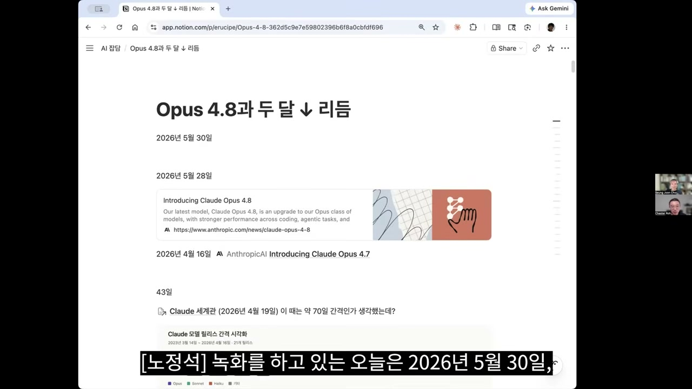

이 "두 달"이라는 숫자가 묘하다. 노정석이 4.7 때 녹화하면서 짚었던 간격은 얼추 70일, 두 달 조금 넘는 주기였다. 그래서 그는 2026년의 패턴을 "두 달에 한 사이클"로 잡아뒀는데, 43일이 나오자 "어?" 하고 멈칫했다.

흥미로운 건 이 두 달이 혼자 떠도는 숫자가 아니라는 점이다. 노정석은 여기저기서 같은 표현이 나온다고 짚는다. 드와케시 파텔과 라이너 포프 편을 공부할 때, 드와케시 파텔은 플래시카드 같은 문제를 푸는 능력이 친칠라 옵티멀의 100배 정도 오버트레인된 것 같다는 엉성한 추정을 내놓았는데, 그 전제에 깔린 게 "프론티어 모델이 두 달 동안 배포되면 두 달마다 리타이어된다"는 패턴이었다. 샘 올트먼도 호주 행사 화상 대담에서 "두 달 만에 세상이 바뀌는데 회사 연간 계획이 필요할까" 하는 뉘앙스의 말을 했다고 한다.

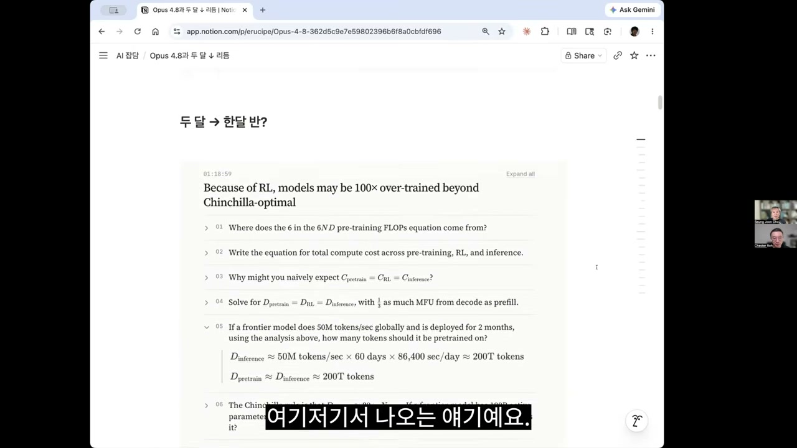

그러니까 두 달은 그냥 인상이 아니라 업계가 공유하는 체감 주기였던 셈이다. 그런데 43일이 나왔다. 노정석은 이걸 싱귤래리티 논의로 연결한다. 주기가 계속 짧아지고 발전 속도가 계속 증가하다가, 어느 시점에 무한히 증가하는 지점이 온다는 그 개념 말이다. "그 지점을 향해 가고 있는 거죠."

그가 정작 인상 깊었다는 건 벤치마크 숫자가 아니라 블로그 맨 끝의 말이었다. 오퍼스 4.8은 이전보다 "작지만 분명히 체감할 수 있는 개선"이고, 앤트로픽은 동일한 역량을 더 낮은 비용으로 제공하는 모델, 그리고 더 높은 지능을 갖춘 새 계열을 준비 중이라고 했다. 미토스 프리뷰는 일부 조직만 쓰고 있지만, 안전장치가 빠르게 준비되고 있어 "앞으로 몇 주 안에" 미토스급 모델을 모든 고객에게 제공할 수 있을 거라고 적었다.

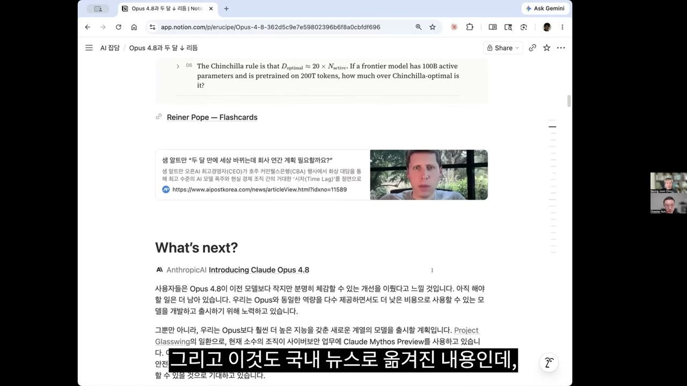

노정석은 이 "몇 주"를 계산기로 두드린다. 10주 이하라면 맥시멈 두 달. 체급을 조정하는 느낌이라고 그는 읽는다. 미토스가 새 오퍼스가 되고, 오퍼스가 소넷 자리로 내려앉는 식의 이동. 실제로 지금 소넷과 하이쿠는 임베딩 모델스러운 단위 작업 말고는 유명무실해졌고, 다들 클로드 코드를 쓸 때도 오퍼스를 붙여 쓰고 있다. 그가 잡은 일정은 여름에서 초가을, 다만 지금 패턴이라면 7월이나 8월쯤 또 한 번 큰 일이 있을 거라는 쪽이다.

## 작아진 모델, 그리고 배기량 경쟁의 끝

성능 이야기로 넘어가면 분위기가 미묘하다. 앤트로픽 스스로 "작아진 모델"이라는 표현을 썼다. 오퍼스 4.8이 4.7이나 4.6보다 작고 효율화됐는데 성능은 유지했다는 것이다. 하지만 밖에서 도는 벤치마크와 바이브는 "4.8 성능이 좀 떨어진 것 같다"는 쪽이었고, 실제로 몇몇 지표는 4.7 대비 내려간 게 있었다. 오른 것도 있었지만.

노정석은 이걸 "토큰 이코노믹스에서 살아남기 위한 처절한 몸부림"으로 본다. 그리고 자동차에 빗댄다. 한때 자동차들이 4,000cc, 5,000cc, 6,000cc로 배기량 경쟁을 하던 시절이 있었지만, 어느 정도 효율화가 이뤄진 다음에는 "상업적 운용에서는 이 정도면 충분하다"며 플래토에 접어들었다. 모델도 그러지 않겠냐는 것이다.

이 진단의 바탕에는 그의 회사가 이미 건너온 변화가 있다. 예전엔 화면에 이메일과 파워포인트와 엑셀이 떠 있었다면, 이제는 거의 에이전틱 애플리케이션이 떠 있다. 노정석의 회사는 아예 그쪽으로 다 바꿔놔서, 사람들이 슬랙에 붙어 에이전트와 일하는 것만으로 업무가 끝나게 만들어가는 중이다. 그런데 거기서 아쉬움이 느껴지는 지점이 레이턴시다.

논리는 단순하다. 만족스러운 결과가 한번 나오고 나면, 그다음에 원하는 건 당연히 그게 빨리 나오는 것이다. 정해진 품질이 정해진 시간 안에 나온다면, 사람들은 그게 오퍼스든 뭐든 최고급 모델인지를 따지지 않는다. 그냥 "빠르고 좋은 모델"이라는 개념이 생긴다. 구글이 이번에 플래시 모델을 메인으로 내세운 이유도 여기 있을 것이라고 노정석은 본다. 성능이 안 나오면 사람들은 곧장 윗 티어로 갈아타니, 다들 그 경계선을 더듬는 중이다.

## 바룬 모한의 12시간, 그리고 둠

구글 I/O에서 주인공은 제미나이 3.5 플래시였다. 프로는 준비되지 않았고, 키노트는 계속 "몇 주 후에 다음 것을 공개할 수 있을 것"이라는 말을 반복했다. 여름 즈음이 될 것 같다는 식의. 시기가 맞아떨어지고 있는 셈이다.

3.5 플래시와 관련해 최승준에게 가장 인상이 남은 건 바룬 모한이 보여준 데모 하나였다. 안티그래비티가 93기의 서브 에이전트를 구동해 15,000여 번의 모델 호출로 커스텀 커널, 파일 시스템, 드라이버를 처음부터 작성하게 했고, 12시간 뒤 둠(Doom)이 부팅됐다는 것이다.

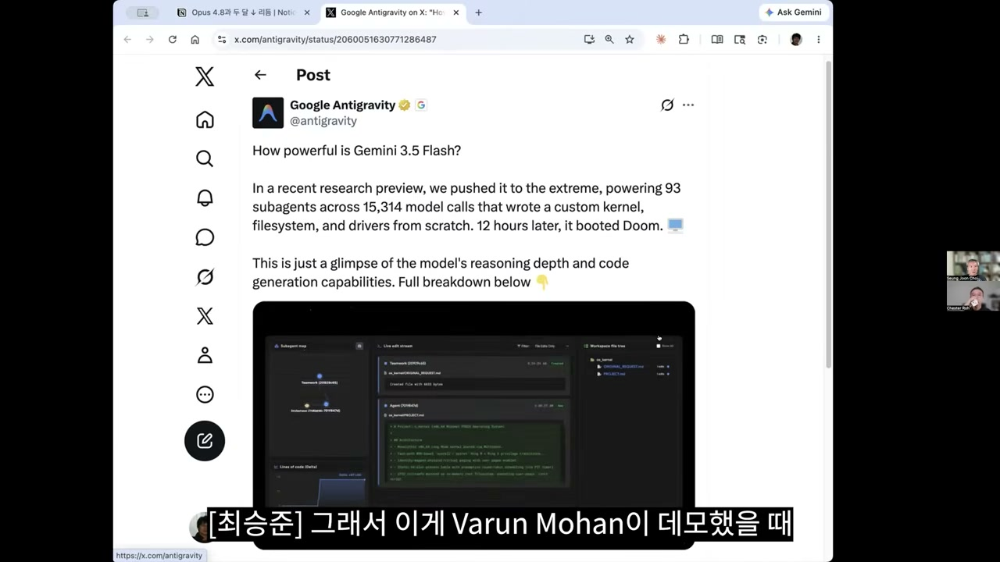

핵심은 둠이 떴다는 화려함이 아니라 그걸 해낸 방식과 비용이다. 제미나이 3.5 플래시는 이전 플래시보다 3배쯤 비싼 모델이라고 하지만, 그래도 최고급 모델이 아닌 적정 수준의 모델로 이런 롱 호라이즌 작업을 낮은 토큰 소모로 해냈다는 점이 남았다. 다들 이걸 하고 싶어 한다.

## 다이내믹 워크플로우, 그리고 "이미 있던 개념"

그 욕망에 앤트로픽이 내놓은 답이 오퍼스 4.8과 함께 나온 다이내믹 워크플로우다. 울트라싱크라는 표현을 쓰면 UI가 화려하게 변하고, 클로드는 요새 영상을 귀엽고 예쁘게 만든다. 데모에서는 체크리스트를 착착 밟아 git push로 머지하는 흐름이 지나간다.

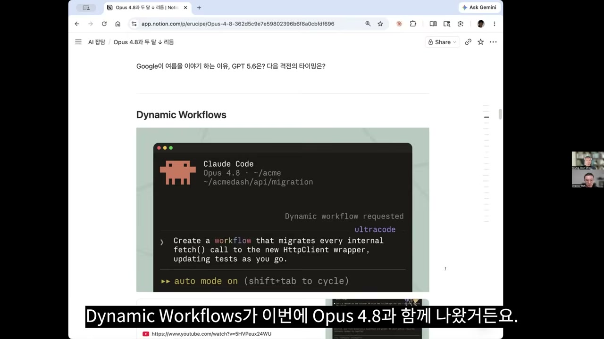

다이내믹 워크플로우가 뭐냐면, 클로드 하나가 여러 다른 클로드에게 일을 주고 그 결과를 종합하는 구조다. 사실 그동안 많이 봐온 개념이다. 다만 기존 앤트로픽의 에이전트 팀 제품과 달라지는 지점이 있다. 큰 모델이 분기마다 끼어들어 계속 조율하는 게 아니라, 처음에 어떻게 오케스트레이션할지 결정적인 코드를 짜두고 그게 될 때까지 그 플로우대로 쭉 돌린다는 점이다.

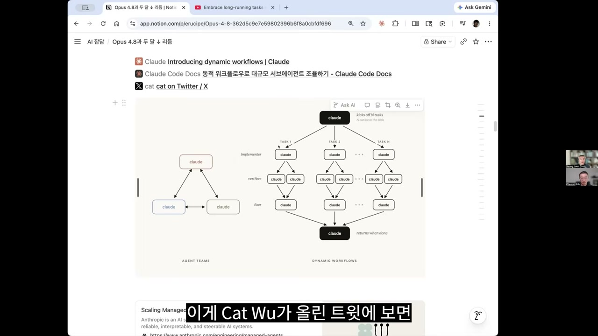

최승준은 이걸 "서브 에이전트를 조율하는 자바스크립트"라고 정리한다. 왜 이런 방식이 필요할까. 모델한테 다 맡기면 모델이 게으름을 피운다. 자기가 한 일을 자기가 평가하게 하면 "됐다"고 뻥치는 경우가, 특히 어려운 일에서 생긴다. 그래서 하네스를 조이려면 결정적인 도구와 코드로 체크해야 하는데, 그 체크조차 자기 컨텍스트 안에서 하게 하면 또 문제가 된다. 그래서 아예 새 컨텍스트인 서브 에이전트들로 분리해 검증을 돌리는 것이다. 물론 이런 방식에선 집계할 때까지 기다려야 하는, 파이프라인 비슷한 병목이 생긴다.

타임라인의 반응은 뜨겁지 않았다. "우리도 그런 거 했었어요"가 많았다. 이미 있는 개념이고 앤트로픽이 약간 딸깍했다는 식의 허탈함. 최승준 본인도 oh-my-openagent나 OMX 같은 데서 잘 돌리던 컨셉이라고 인정한다.

## 같은 산을 오르는 여러 길

그런데 최승준이 보기에 이건 단발성 제품이 아니라 하나의 흐름이다. 그는 매니지드 에이전트를 다룬 "뇌와 손을 분리하기"라는 글에서 인용됐던 연구를 꺼낸다. 컨텍스트를 일종의 오브젝트로, 그것도 REPL 같은 코딩 도구 안의 오브젝트로 두는 발상이다. 우리가 손으로 쓰던 REPL의 피드백 루프를 LLM이 프로그래밍적으로 돌리게 하는 것. 여기서 인용된 논문이 Recursive Language Models(RLM)다.

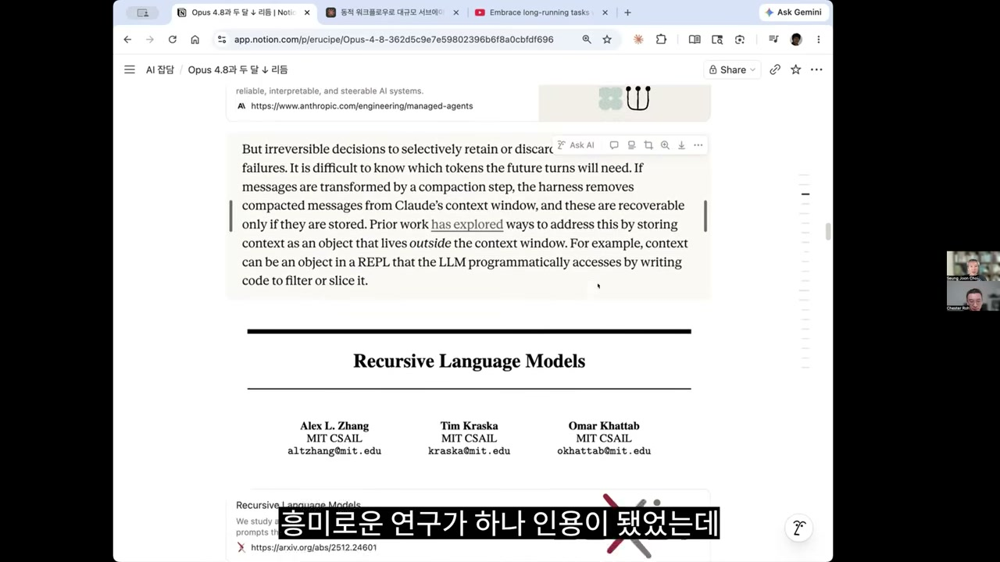

RLM 저자 알렉스 장은 "우리 페이퍼를 읽어봐라, 이미 했던 레짐이 있다"는 식으로 반응했는데, 이런 반응이 그 하나만은 아니었다. 그리고 이 RLM이 DSPy에 들어가 있더라는 게 최승준의 관찰이다. RLM 논문 저자 중 오마르 카타브가 DSPy를 스탠퍼드에서 만든 사람이니 당연한 일이다.

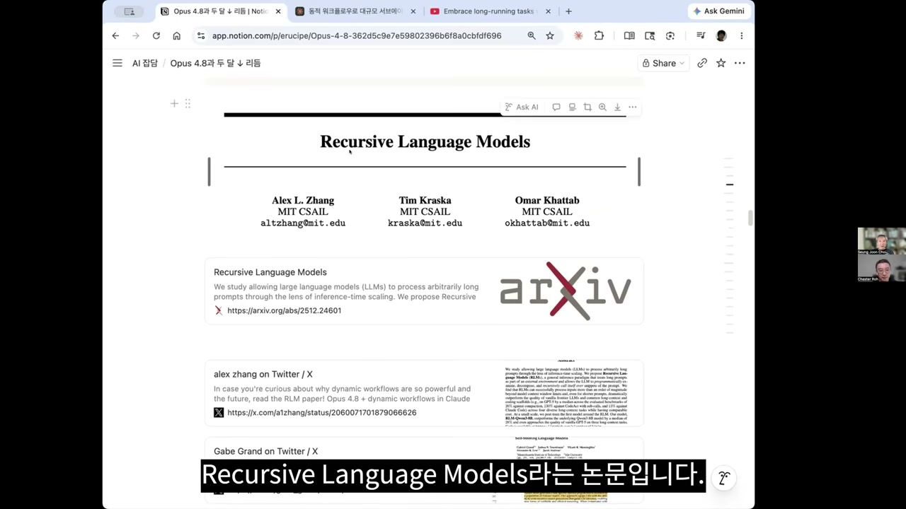

여기서 최승준은 한 겹 위로 올라간다. DSPy든 텍스트그라드든 RLM이든, 결국 다 메타 옵티마이제이션이라는 것이다. 하나의 레이어가 쌓이면 그 위에 또 다른 게 쌓이고, 그 위에 또 쌓인다. 옵티마이제이션의 층을 하나씩 더 올리는 일이다. DSPy도 결국 프롬프트 자체의 성능을 메타 옵티마이저로 계속 끌어올릴 수 있다는 발상이고, 이건 카파시가 말하던 오토 리서치 개념과 똑같다.

그가 짚는 핵심은 이 한 문장에 모인다. **Evaluation Metric만 존재하면, 모델은 우리가 무엇을 설정하든 그냥 컴퓨팅을 투입해 성능을 올리는 방향으로, 즉 검색하는 방향으로 전환해 풀 수 있다.** RLM은 LLM이 코드를 실행하고 재귀적으로 서브 LLM 코드를 돌리게 하는 이야기고, 매니지드 에이전트는 세션 추상화를 컨텍스트 밖 오브젝트로 두고 샌드박스와 REPL을 쓰는 이야기고, 다이내믹 워크플로우는 오케스트레이션을 컨텍스트가 아니라 스크립트에 둔다는 이야기다. 결국 하네스가 결정적인 도구로 그걸 꽉꽉 조여 제어한다.

바룬 모한의 그 빠르게 돌아가던 영상도 같은 층의 이야기일 것이라고 그는 추측한다. 모델이 그냥 하는 게 아니라, 하네스를 쓴 스캐폴드가 OS를 만들고 둠을 띄울 수 있는 롱 호라이즌 태스크를 한 번에 쭉 밀고 가는 것.

다만 그 롱 호라이즌 태스크도 안을 들여다보면 깔끔한 원샷이 아니다. 수많은 에러를 끊임없이 평가하면서 "이거 틀렸네 고치고, 또 틀렸네 고치고", 어마어마한 틴커링 과정이다. 수학에서 벌어진 일도 비슷했다고 최승준은 말한다. 가설을 세우고, 실험하고, 문제가 생기면 기록하고, 그 기록에서 통찰을 얻어 다음 가설을 세우고, 이걸 계속 밀어붙이는 것.

이 흐름에 노정석은 코르카 CTO 강규영에게서 들은 표현을 얹는다. "코드 애즈 하네스(code as harness)." 귀에 착 감기는 말이었다고 한다. 강규영은 그러면서 클라우드플레어의 다이내믹 워크플로우와 프로젝트 씽크를 소개했는데, 여기서도 이름이 같다. 차세대 에이전트 구축에서 코드가 하네스가 되고, 무엇을 가져오든 그걸 해낼 수 있는 플랫폼을 만든다는, 똑같은 이야기가 또 나온다. 장기 실행 에이전트, 행위자 모델, 듀얼 오브젝트.

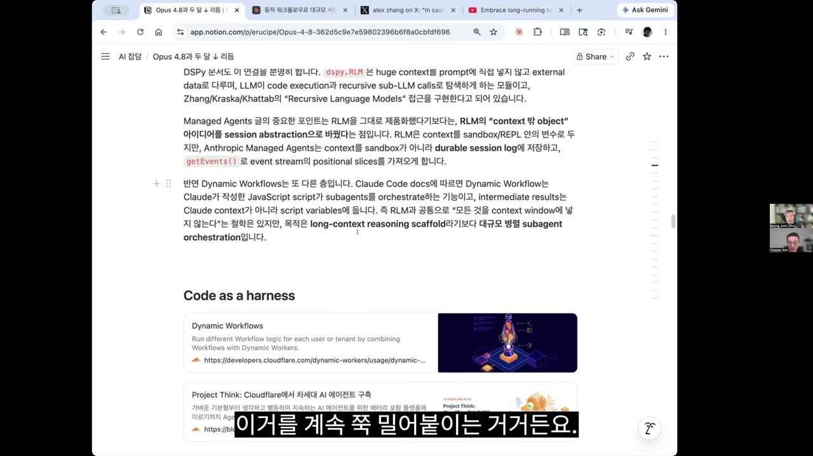

여러 회사가 같은 산을 다른 길로 오르고 있다. 자세히는 아니어도 느낌적으로 그 방향이 잡힌다.

## 에르되시의 반례, 그리고 알파고 이후의 바둑

5월 중순, 수학에서 흥미로운 일이 있었다. 에르되시 문제 가운데 하나의 반례를 모델이 해냈고, 세상이 또 놀랐다. 최승준은 이걸 GPT 5.5가 아니라 오픈AI의 내부 모델이 특수한 스캐폴딩으로 해낸 것 같다고 본다.

여기서 한 발언이 등장한다. 최승준은 "숄토가 지금은 앤트로픽에 있잖아요"라고 말하며, 그 숄토 더글러스가 오픈AI의 성과를 칭찬한 뒤 "미토스도 해냈다"는 포스팅을 했다고 전한다. 링크를 걸어두진 않았지만 제미나이도 해냈다는 반응이 있었다고도 한다. 비슷한 걸 다들 해냈다는 것이다.

최승준이 정작 재밌게 본 건 노엄 브라운의 말이었다. "알파고 이후 인간 바둑기사들의 실력은 눈에 띄게 향상됐다. 나는 수학에서도 비슷한 패턴이 나타날 것이라고 생각한다."

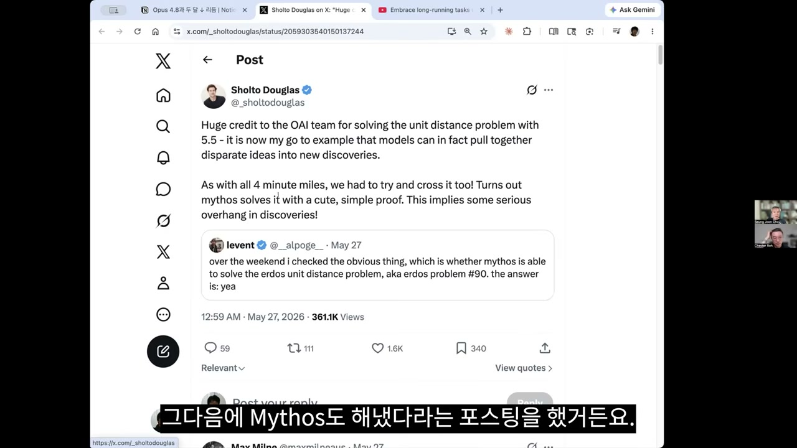

그리고 실제로 그 패턴이 나타났다. 에르되시 반례를 모델이 해냈다는 게 알려진 다음, 수학자들이 거기서 영감을 얻어 급진전을 이뤘다. 유명한 수학자 티머시 가워스의 말이 이를 가리킨다. 가법조합론의 또 다른 주요 문제가 해결됐는데, 이번엔 AI가 아니라 인간들이 해낸 일이지만 단위거리 추측에 대한 AI 해법과 관련된 방법들을 사용했다는 것이다. **AI 해법을 인간이 배워서 활용한 것이다.** 신진서 9단 같은 기사들이 AI와 많이 대국하면서 배워내는 것과 똑같은 일이 수학에서 벌어진 셈이다.

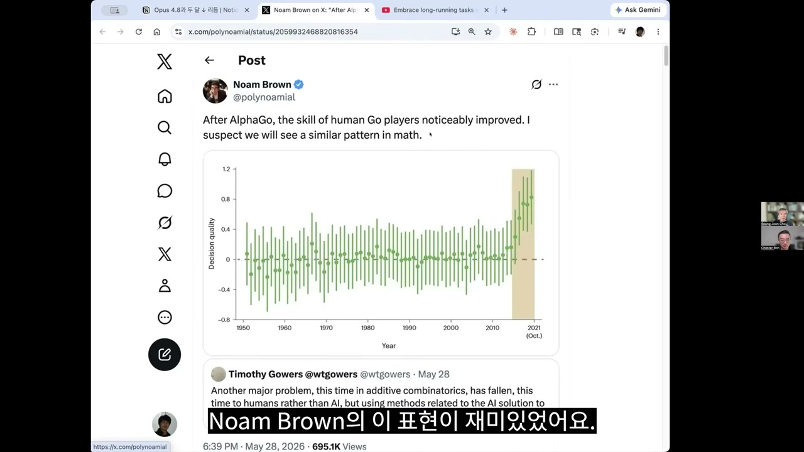

이번 오픈AI의 시도가 흥미로운 건, 인간을 아주 중요한 역할로 뒀다는 점이라고 최승준은 짚는다. 모델이 혼자 추진하는 게 아니라, 평가를 인간이 제대로 하는 메커니즘이 들어가 기존 시도와 달랐다. 휴먼 인 더 루프를 중요하게 다루는 느낌이 생기기 시작한 것이다.

왜 이게 통할까. 수학 한 분야 안에도 정수론, 조합론처럼 여러 장르가 있고, 정통한 학자들끼리도 서로의 문헌을 모를 수 있다. 그런데 AI는 프리트레이닝을 통해 전체를 알고 있으니 그 문헌들 사이를 연결할 수 있다. 그 연결에서 자극을 받아 인간도 "이렇게 연결할 수 있구나"를 알아차리면, 전이가 일어난다. 그 연장에서, AI가 인간의 탐색 공간과 직관을 넓히기 시작한 것 아니냐는 신호다. **창의성을 죽인 사건이 아니라, 인간 창의성의 지형을 바꾼 사건이다.**

## 생성형 인지저하

하지만 최승준의 마음에는 정반대 방향의 우려가 함께 있다. 그는 2025년 봄쯤 "생성형 소화불량"이라는 말을 했었는데, 요즘 곱씹는 건 "생성형 인지저하"다.

내 생각을 자꾸 모델에게 오프로딩해 대신 생각하게 하다 보면, 내가 생각하는 힘, 그 근육이 줄어간다는 느낌. 드와케시 파텔 편을 공부하면서 플래시카드에 자극받았던 것도 이 지점이다. 대화를 깊게 한 뒤 그 내용으로 플래시카드를 만들어 스스로에게 물어보면, 내가 얼마나 많은 걸 금방 잃어버리고 있는지가 드러난다. 대신 생성하게 하는 것은 곧 인지저하이고, 스킬과 역량이 줄어드는 느낌이다. 우려스럽게도 그런 일이 분명히 벌어지고 있다.

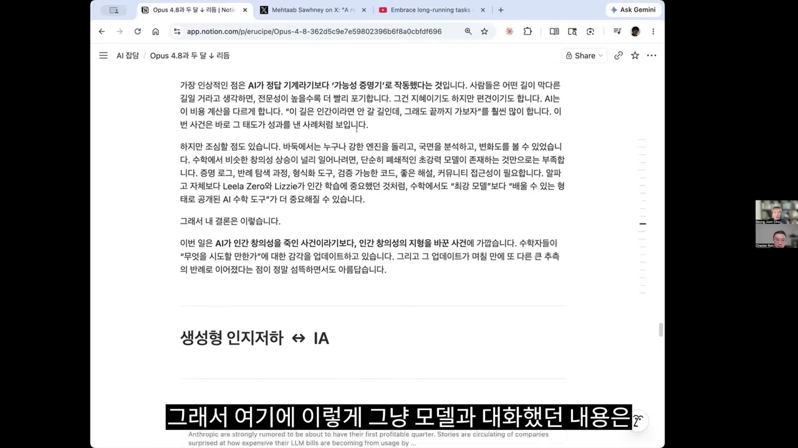

그러나 한편에는 인텔리전스 오그멘테이션, 앰플리피케이션이 있다. 같은 기술이 한쪽에선 능력을 깎고 다른 쪽에선 능력을 키운다. 이번 판에서도 기술이 격차의 도구로 작용하는 것 아니냐는 고민이다. 최승준은 2025년 여름엔 초지능이나 AGI에 가까워질수록 격차가 얇아지는 새로운 기회가 될 거라 상상했는데, 막상 뚜껑을 열어보니 슬롯머신처럼 도파민은 터지지만 정작 내 능력은 저하되는 일이 벌어질 수도 있다는 걸 본다. 그러면서 동시에 능력을 획득하는 경우도 일어난다.

노정석은 이걸 정반합으로 계속 달라질 문제로 본다. 당장은 격차를 늘리는 것 같지만 결과적으로는 격차를 줄이는 것 같고, 일단 평균은 올라갈 가능성이 있다.

여기서 그는 일의 개념 자체가 달라질 거라는 비유를 든다. 예전에 집을 지을 때 단위 시간당 흙을 얼마나 옮기느냐가 관건이던 시절엔 체력과 요령이 그 사람의 능력이었다. 그런데 포크레인 같은 굴착기가 나오면서, 지금은 그 능력이 운전면허 자격시험으로 바뀌어 있다. 지식산업도 마찬가지일 거라는 얘기다. 생각의 근육으로 문제를 풀어내던 자리가 더 이상 필요 없어지고, 다른 층위의 새로운 자격이나 능력이 생겨난다.

"생각하는 게 인간의 일"이라는 것도 사실은 통념이라고 노정석은 던진다. 과연 그게 맞느냐는 도전적인 질문. 생각하는 게 인간의 일이었는데 그게 이동하고 있어 상당히 고민스럽다고 그는 말한다. 인간의 조건과 연결되는 문제라서.

## 락인, 그리고 PMF를 찾은 두 회사

마지막은 다시 현실로 내려온다. 시몬 윌리슨이 5월 27일에 올린 포스팅, "앤트로픽과 오픈AI는 제품 시장 적합성(PMF)을 찾은 것 같다"가 출발점이다. 시몬 윌리슨은 API를 써서 오픈AI가 703개, 앤트로픽이 390개의 공개 채용 공고를 냈다는 걸 분석했다.

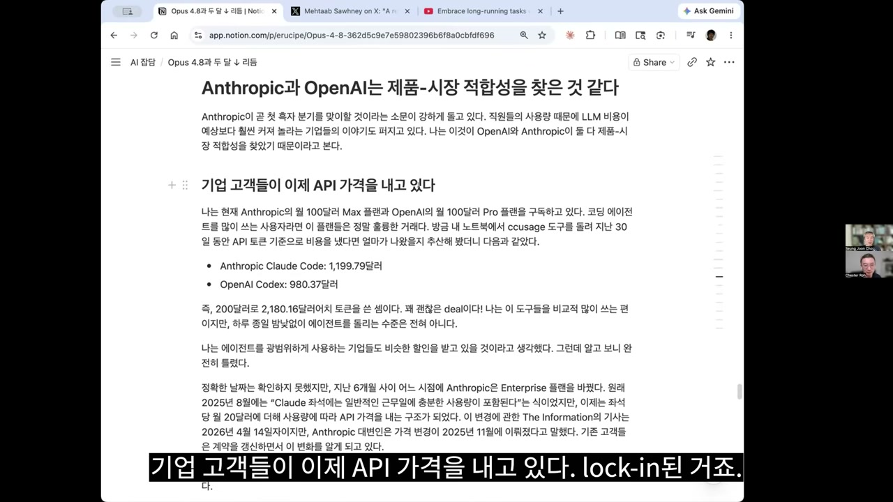

핵심 발견은 락인이다. 기업 고객들이 이제 API 가격을 내고 있다. 강을 건넜고, 안 쓸 수가 없다. 노정석의 회사도 비엔지니어들이 100불, 200불 플랜을 쓰는 비중이 높아지고 있다. 엔지니어가 아닌 사람들도 클로드 코드를 다 쓰기 때문이다. 시몬 윌리슨은 에이전트를 광범위하게 쓰는 기업들이 비슷한 할인을 받을 거라 생각했는데, 알고 보니 완전히 틀렸다고 적었다. 오히려 비싸지고 있다. 디스카운트에 페널티가 붙고, 클로드도 제미나이도 그렇다. API 가격을 내야 한다면 슬랙에 에이전트를 붙이는 일이 비싸지지만, 그래도 써야 한다.

이 대목에서 토큰 가격의 미래를 놓고 두 사람의 시각이 갈린다. 노정석은 단기적으로 토큰 가격이 상승할 여력이 많다고 본다. 중국 쪽도 오르고 있고, 메모리 가격이 오르는 걸 보면 수요가 계속 느는 게 맞다. 수요를 보는 시각엔 두 갈래가 있다. "쓸 사람은 다 썼고 플래토에 도달했다"는 쪽과 "이제 겨우 시작"이라는 쪽. 그런데 플래토라고 보는 사람들은 대부분 테크 월드 밖에서 투자 관점으로 "앤트로픽, 오픈AI 위험하다"고 해석하는 세력이고, 젠슨의 키노트에 열광하고 발표에 박수 치는 안쪽 사람들은 "이제 겨우 시작 아닌가"라고 생각한다는 것이다.

다만 노정석은 토큰 가격이 결국 전기처럼 될 거라고 본다. 피크가 어디까지 갈지, 기울기가 어디로 향할지는 아무도 모르지만, 역사적으로 보면 "낮아진다"에 베팅하는 게 무조건 높은 확률이다. 어쨌든 기업들은 락인돼 돈을 내고 있으니, 최소한 두 회사는 PMF를 찾았다는 게 시몬 윌리슨의 관점이다. IPO를 둘 다 준비 중이지만, 다들 돈을 내고 있으니 흑자 전환도 가능한 것 아니냐는 얘기까지 나온다.

채용도 늘고 있다. 메타가 8,000명 레이오프로 이슈가 되고 마이크로소프트도 줄여가는 분위기인데, 이 두 회사는 늘린다. 국내 타임라인에도 개발자 고용이 늘어간다는 뉴스가 도는데, 노정석은 이 두 흐름이 양립한다고 본다. 한쪽에선 탤런트 밀도를 높여 작은 팀으로 밀어붙이고, 다른 쪽에선 AI를 쓰는 사람이 여전히 더 필요해 고용을 늘린다.

## "개발자"라는 말이 의미를 잃을 때

그런데 노정석은 "엔지니어 채용이 는다"는 뉴스를 조심해서 봐야 한다고 못 박는다. 그가 보기에 이제 "개발자"라는 표현은 의미가 없다.

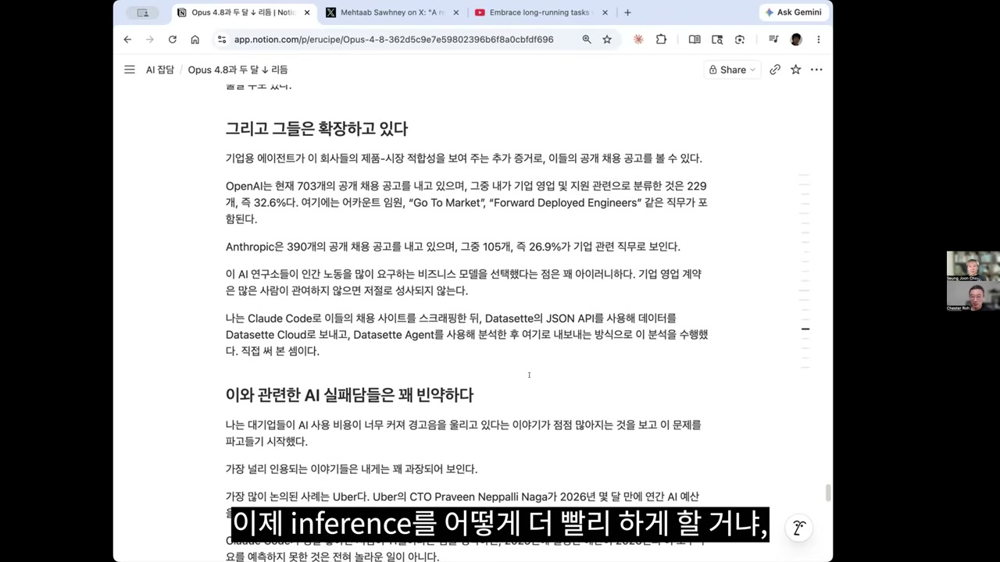

논지는 이렇다. 지금 엔지니어 어느 누구도 코딩을 하고 있지 않다. 문제 해결을 잘하는 엔지니어를 보면, AWS에서 무슨 문제가 벌어지는지, 웹서비스에서 뭐가 터지는지, 레디스 워크로드를 어떻게 분산하는지, SQL은 뭔지, OS부터 아키텍처링까지 다양한 층위의 관점을 가진 사람이다. 그런 사람이 클로드 코드를 만나면 훨씬 강력하다. 하지만 문제는 거기까지다. 고객은 아키텍처를 사는 게 아니라 자신의 문제가 해결되는 걸 산다.

예전에 빨라진 건 한 구간뿐이다. 어떤 앱을 만들어달라는 요건이 생기면 PM이 요건을 분석하고 디자이너가 펼치고 CSS로 쪼개 빌드해서 고객 앞에 새 UX를 가져다 놓는 그 구간. 그러나 그걸 가지고 진짜 고객을 더 획득하고 문제를 해결하는 구간은 여전히 남아 있다. 그래서 이제는 엔지니어링 능력을 다 갖춘 상태에서, 마케터와 영업을 사이에 두지 않고 고객과 직접 이야기하는 역량까지 필요하다. 예전 표현으로 마케터나 세일즈의 역량까지 갖춰야 문제가 한 번에 끝난다.

게다가 그 엔지니어링 역량조차 점점 필요 없어지는 방향이다. 에이전트로 워크플로우를 만들다 보면, 암묵지가 구조적으로 에이전트의 메모리에 계속 쌓인다. 예전엔 "어제 매출"이라고만 하면 할루시네이트했을 게, 이제는 쌓여온 컨텍스트 덕에 정확히 회사가 원하는 관점으로 가공돼 나온다. 아키텍처링 같은 것도 마찬가지로 캡슐화돼 아래 레이어로 쌓여 내려간다.

그래서 노정석이 내린 정의는 이렇다. **이제는 엔지니어가 아니라 모두가 문제 해결사이자 단위 사업의 사업가다.** 그의 회사에서 전통적 엔지니어링을 하는 직군 중 전통 엔지니어 출신은 절반이고, 나머지 절반은 예전에 마케터였던 사람, 프로덕트 매니저였던 사람이다. 이들이 클로드 코드를 결합하고, 엔지니어들이 만들어둔 암묵지의 프론트를 스킬로 불러 쓰기 시작하니 문제가 한 번에 끝나는 경험을 한다. 그러니 그냥 "클로드 코드 쓸 줄 아는 엔지니어를 채용하자"는 의사결정이 나왔다면, 그 기업 경영자는 문제의 본질을 아직 모르고 있을 가능성이 있다.

엔지니어를 넘어선 개념이 FDE(Forward Deployment Engineer)인데, 노정석은 그보다 더 나아간 "AI 네이티브 탤런트"라는 말을 쓴다. 다 갖춘 사람. AI를 공급하는 입장에서 보면 그게 엔지니어든 빌더든 누구든 상관없다. AI를 쓰는 사람이 결국 고객이니, AI를 쓰는 사람이 필요한 한 직업이 줄어드는 게 아니라 늘어가는 구간도 있을 수 있다. 신정규 대표의 말처럼, 사람은 문제를 해결하는 속도보다 문제를 만드는 속도가 빠르기 때문에 수요는 한참 더 늘어날 것이다.

그렇다면 전통적 엔지니어 개념은 어디로 갈까. 한 레이어 아래로 내려가 인퍼런스를 어떻게 더 빨리할 거냐, 고도의 토큰 엔지니어링과 인프라 엔지니어링, 모델 빌딩 쪽으로 떨어질 거라고 노정석은 본다.

## API 매출이 가벼워지는 이유

시몬 윌리슨 글의 후반부에는 "API 매출의 중요성은 줄어들고 있다"는 섹션이 있다. 200불짜리 서브스크립션에 사람들이 훨씬 몰리고 있다는 게 한 축이다.

다른 한 축은 온프레미스 수요다. 대기업, 은행권, 초대형 IP를 가진 회사들은 클로드 코드 같은 걸 그대로 쓰기 어렵다. 그래서 클로드 코드 하네스를 가져와 로컬 모델, 큐원이나 GLM 같은 걸 붙여 돌려야 한다. GLM 500빌리언 정도 모델은 꽤 성능이 좋고, 커서의 모델도 키미 베이스로 만들어졌다고 알려져 있다. 대형 엔터프라이즈 안의 온프레미스 수요가 엄청나게 있다는 것이다.

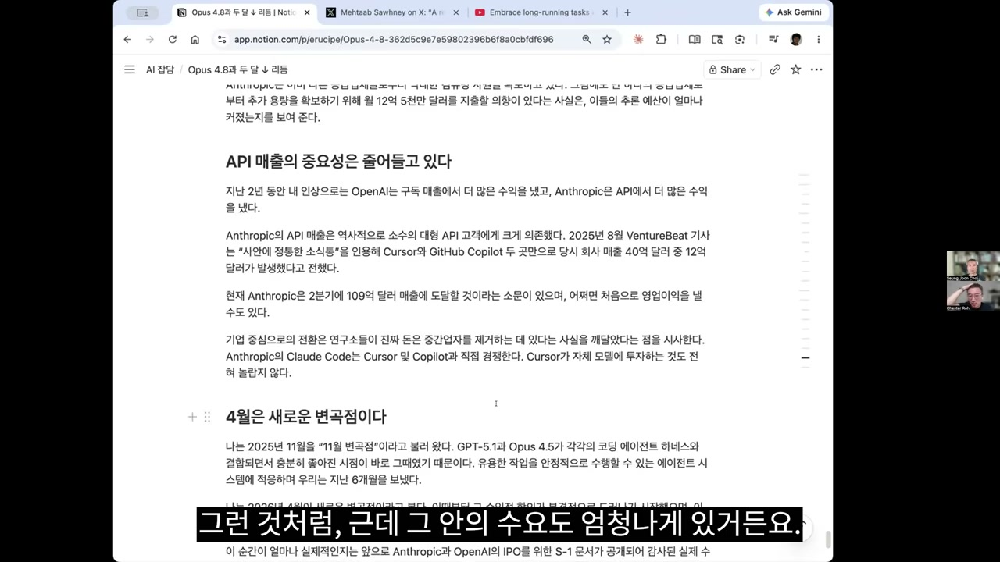

노정석의 정리는 이렇다. 클로드 코드나 코덱스는 이제 코딩 에이전트가 아니라 "아주 기본적인 디폴트 문제 해결 앱"이 됐다. 그렇다면 다뤄야 할 문제의 규모가 어떤 급의 모델로 풀어야 할지를 촘촘하게 알아 배치하는 게 관건이다. 안 그러면 예산이 순식간에 날아간다. 결국 모델의 벤치마크 성능과 레이턴시의 트레이드오프다.

## 4월이라는 변곡점, 그리고 여름의 충돌

이 모든 걸 관통하는 시몬 윌리슨의 진단이 "4월이 새로운 변곡점이었다"는 것이고, 노정석도 거기에 동의한다. 그리고 여름에 한 번 클래시가 있을 거라는 전망을 더한다.

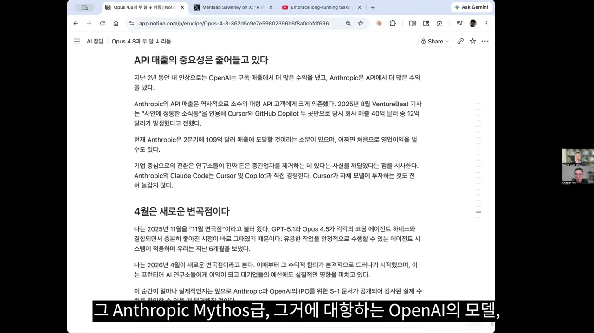

앤트로픽의 미토스급, 그에 대항하는 오픈AI의 모델, 제미나이 3.5 프로. 여름으로 들어가면서 메이저 플레이어들이 우리를 힘들게 하면서 또 기대하게 할 것이다. 그러면 잘 돌아가던 것들을 유지할지, 마이그레이션하고 싹 갈아엎을지 또 한바탕 푸닥거리를 하게 된다. 예정된 일이고, 두 달 이내에 또 일어날 일이다.

여기에 노정석이 곱씹는 우려가 다시 겹친다. 뭔가를 공부하고 역량을 키우려면 모델이 나올 때마다 그 모델을 공부해야 하니, 정작 집중해야 할 걸 집중하지 못하고 쳇바퀴 돌듯 반복하게 된다. 그래서 드와케시 파텔이나 라이너 포프에게서 배운 것 같은 걸 하려면 빨리 해야 한다.

최승준이 마지막으로 짚는 건, 두 사람이 요즘 모델 이야기를 상당히 안 하고 있다는 사실이다. 모델은 어느 수준 이상을 지났다. 이제 기어가 다음 층위로 바뀌었다. "모델은 이젠 충분히 좋아졌고, 그 위에서 얘가 AGI로 가든 말든, 나는 내 단위 업무를 가장 저렴한 가격으로 가장 빠르게 해결할 것이냐." 그건 모델의 능력과 하네스의 정도를 어떻게 잘 얼라인할 거냐의 문제다. 그게 중요해지는 시기로 넘어가고 있다.

## 붐의 끝인가, 서막인가

노정석은 그날 아침 본 A16Z의 이야기로 큰 그림을 그린다. 과거 테크 붐은 항상 비슷한 층위를 밟았다. 처음엔 칩, 모바일 때는 저전력 칩과 퀄컴, 암 같은 회사의 수혜가 갔고, 그다음이 아이폰과 안드로이드, 그 위가 우버, 카카오톡, 에어비앤비 같은 애플리케이션이었다. AI도 똑같은 걸 하고 있다. 그렇게 보면 지금 엔비디아와 하이닉스, 삼성전자 주가가 피크를 찍는 게 "이게 피크고 곧 AI 붐은 꺼진다"가 아니라 "이 붐의 시작을 알리는 서막에 불과하다"고 볼 수 있다는 것이다.

사람들은 과거의 기준으로 미래를 평가하는 나쁜 버릇이 있다. 과거의 패턴은 반복되지만, 그 패턴 속 Y축의 인텐시티와 앰플리튜드는 인플레이션을 보정하듯 상대적으로 조정해서 써야 한다. "예전 모바일에서 이만큼 갔으니 이번에도 그쯤이 피크"라는 말이 많이 틀릴 수도 있다고 그는 본다.

그가 존경하는 비노드 코슬라의 논리가 여기에 못을 박는다. 이건 기존 앱과 다르다, 왜냐하면 이건 인텔리전스라서 상방이 없다는 것이다. 영원히 살 수 있는 약으로 암을 해결했다고 치자. 사람들이 거기서 멈출까. 아니다, 무한히 살고 싶을 거고, 그걸로도 안 끝나 더 예쁘고 건강한 삶을 찾을 거고, 그게 끝나면 또 다음을 찾는다. 인간의 욕구는 열려 있다. 과거 플랫폼 전이들은 딜리버할 수 있는 상방이 꽉 닫혀 있었다. 인터넷이 나와도 TV나 신문 대비 몇 배, 모바일이 돼도 PC 못 사던 사람까지 더해 몇 배. 하지만 인텔리전스는 거의 영원히 수요가 증가한다. 노정석은 그 말에 깊이 동의하게 됐다고 한다.

가까운 미래로 내려오면, 오픈AI와 앤트로픽이 올해 안에 IPO를 할 수 있다는 뉴스가 많다. IPO를 하면 무슨 일이 생기느냐는 물음에 노정석은 답한다. 지금도 프라이빗 마켓에서 펀드레이징에 아무 문제가 없지만, IPO는 하나의 마일스톤이다. 구성원들이 가진 주식의 유동성이 확 늘고, 프라이빗 라운드에서 경영진을 옥죄던 많은 조건과 오블리게이션이 풀린다. 투자자들이 떠나고, 회사가 주도해 합법적으로 펀드레이징을 이어가며 밸류에이션을 높일 수 있다. 그리고 밸류에이션은 일종의 순위표가 된다. 1등은 어디, 2등은 어디. 그 리더보드를 그냥 오브젝티브로 찍고 가는 것 아니겠냐는 것이다. 투자자 입장에서 정작 중요한 질문은 따로 있다. 그 IPO가 시작일 것이냐, 끝일 것이냐.

두 사람이 다음으로 들여다보려는 건 모델 위가 아니라 모델 아래다. 에이전틱 시대가 되면서 인퍼런스의 중요성이 어마어마하게 커지고, 토큰이 어마어마하게 밀려오고 있다. 그래서 그 "토큰 공장"의 안을 살펴보는 일에 의미가 있다고 본다. 하드웨어의 깊은 곳에서부터, 그것들을 오케스트레이션하는 레이어, 그 위로 올라가는 소프트웨어 영역, 그 사이를 들여다보는 것. 모델이 두 달마다 갈아치워지는 속도의 한가운데서, 정작 집중하기로 한 건 그 속도를 떠받치는 바닥이다.
