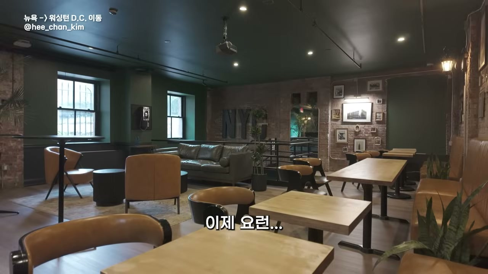
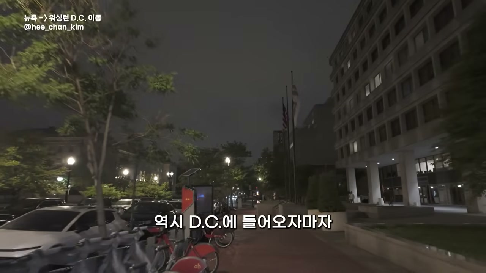
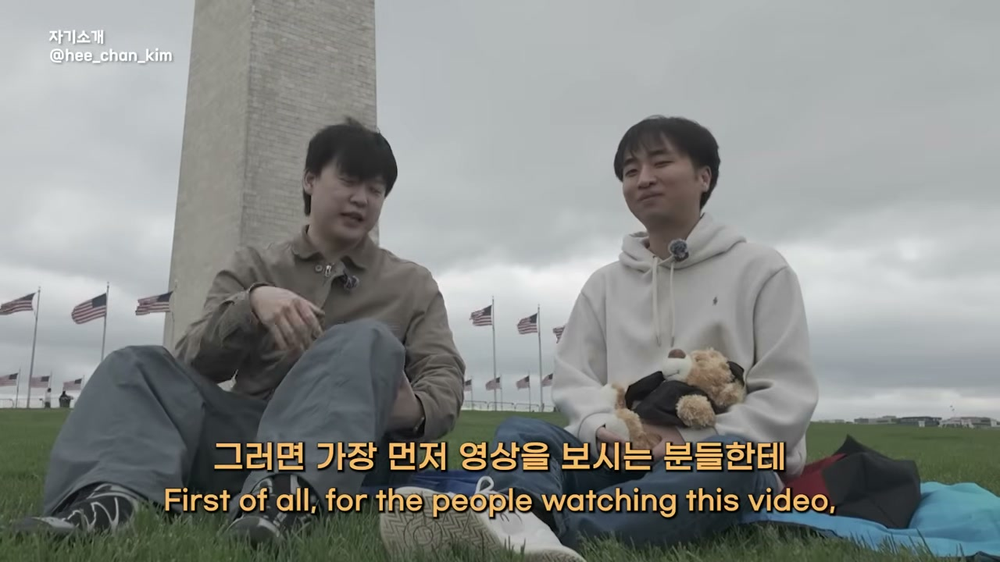
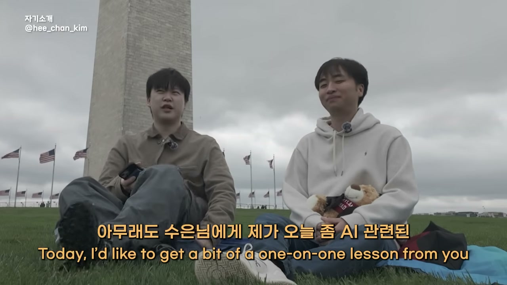

뉴욕에서의 사흘은 호스텔 바에서 끝난다. 누군가 모여 맥주를 마시던 그 공간이 아침엔 텅 비어 있고, 브이로거는 그걸 한 번 보여주고 싶었다고 말한다. 12인실, 14인실쯤 되는 방에서는 알람을 맞출 필요가 없다. 매 시간 누군가의 알람이 울리고, 같은 국적의 친구들끼리 대화가 들리고, 그렇게 아침이 온다. 오늘은 그 호스텔을 체크아웃하고 워싱턴 DC로 향하는 날이다.

DC에는 거기서 생활하는 컨설턴트와 개발자를 만나러 간다. 여정을 여행처럼 담고 있는데 재미있게 보일지 모르겠다고 그는 멋쩍어한다. 오후 2시에 출발한 플릭스버스는 다섯 시간을 달려 저녁 7시에 DC에 닿는다.

워싱턴 DC의 첫인상은 고요하다. 그리고 경찰차가 너무 많다.

> "하필 뉴욕을 갔다 와가지고. 원래 미국이 대부분 다 이런 느낌인데, 뉴욕을 갔다 와가지고 이게 더 체감되네."

밤거리엔 정말 아무도 없다. 홈리스조차 없다. 그는 겁이 많아서 무섭다고 솔직하게 말하면서도, 경찰차가 많으니 믿고 가본다. DC에 들어서자마자 성조기가 커다랗게 보인다. 미국은 늘 성조기를 크게 달아놓는 편인 것 같다고 그는 관찰한다.

모든 건물에서 힘이 느껴진다. 웅장하고, 예쁘고, 현대식이기도 하다. 그 텅 빈 거리를 걸으며 그는 혼잣말처럼 만담을 시작한다. 화요일 새벽엔 텍사스로 날아가 나사 직원을 인터뷰하고, 다음 날엔 오스틴의 한인을, 그다음엔 워런 버핏의 주주총회로 향한다. 빡빡한 일정 사이에서 그가 꺼내는 이야기는 의외로 무겁다.

> "사실 좀 항상 어떻게 살아야 잘 사는 삶일까에 대한 고민이 많았거든요."

대학생 때 그는 커리어를 잘 만들면 수도 없이 많은 문제를 풀 수 있을 거라 막연히 믿었다. 일을 잘하고 지위를 얻고 돈을 많이 벌면 사랑이든 무엇이든 모든 게 풀릴 줄 알았다. 그런데 각국에서 커리어를 잘 쌓아가는 사람들을 직접 보고 나니, 잘 만들어진 커리어가 반드시 좋은 삶을 보장하지는 않더라는 것이다. 대신 그가 거듭 느끼는 건 누구와 함께 사는가다. 독일 속담 하나를 그는 기억에서 끌어온다. 나비 같은 것들과 함께 살고 싶으면 찾아 나설 수도 잡을 수도 있지만, 가장 좋은 방법은 꽃밭을 기르는 것이라는. 좋은 사람을 좇기보다 좋은 사람이 모일 환경을 만드는 게 낫다는 뜻이다.

잠시 뒤 만날 인터뷰이도 결국 같은 곳에 닿는다. 진짜로 좋아하는 일을 찾아 사는 사람과 그렇지 못한 사람이 갈린다는 이야기다. 텅 빈 거리의 이 혼잣말이 그 주제의 밑그림이 된다.

## 워싱턴 모뉴먼트 앞에서, 한 석사생을 만나다

다음 날, 워싱턴 모뉴먼트를 배경으로 두 사람이 마주 앉는다. 오늘의 인터뷰이는 조수은 님이다. 미국 메릴랜드에서 학사를 막 마쳤고, 지금은 같은 메릴랜드에서 석사 과정을 밟는 중이다. 8월부터는 존스홉킨스로 학교를 옮겨 석사를 이어간다. 전공은 사이버 시큐리티, 그중에서도 블록체인이다. 2018년 코인에 관심을 갖다가 "이런 걸 한번 만들어봐도 괜찮겠다"며 시작해, 블록체인 쪽에서만 6년 넘는 경력을 쌓았다.

그가 이 자리에 불려 나온 이유는 따로 있다. 앤트로픽(클로드)에서 연 코드 대회에서 65등을 했고, 50등부터 위로 누가 있나 훑어봤더니 50등대에 카이스트 교수가 있었다고 한다. 같은 시스템을 주고 누가 CPU 사이클을 더 많이 줄이느냐를 겨루는, 순수한 효율 싸움이었다. 본인 주변엔 보통 CEO나 CTO들이 그 정도로 AI를 쓰고 있다고 그는 말한다. 브이로거는 이 사람에게 AI 일대일 강습을 비밀리에 받아보겠다고 농을 던지며 본론으로 들어간다.

## "주니어는 다 대체된다"는 말, 절반만 맞다

미디어에는 주니어 개발자가 모두 AI로 대체된다는 문장이 넘쳐난다. 수은 님은 이 말에 절반만 동의한다.

> "현재 개발자가 대체가 될 가능성은 저는 굉장히 높다고 봐요. 근데 그 개발자라는 기준 자체를 저는 두 가지로 보고 있어요."

기준은 직급이 아니라 동기다. 프로그래밍을 좋아해서 하는 개발자와, 그저 일자리를 찾으려고 하는 개발자. 전자는 대체되지 않을 가능성이 꽤 높다. 누가 말려도 계속하고, 크리에이티브하기 때문이다. 반대로 위에서 시켜서 하는 개발자는 대체될 가능성이 크다. 창의적이지 못하기 때문이다.

사람들은 보통 "주니어가 밀려난다"고 생각하지만, 수은 님이 현장에서 본 건 좀 달랐다. 시니어 개발자가 오픈클로조차 설치하지 못하는 장면이었다. 오픈클로는 오픈소스 AI 코딩 에이전트인데, 설치 난도가 만만치 않다. 결국 문제는 직급이 아니라 관심사라는 것이다.

> "아무리 시니어 개발자라고 해도 실제로 AI 쓰는 거나, 세상의 발전을 원하지 않는 사람이라면 그 시니어는 곧 주니어한테 대체가 될 것 같고. 더 심각한 건 주니어이지만 AI에 관심이 없고 세상의 흐름에 관심이 없다면, 그분들은 사실은 더 힘든 거죠."

대체의 칼날은 위아래로 내려오는 게 아니라, 관심 있는 사람과 없는 사람 사이를 가른다. 통계도 그 방향을 거든다. 모닝브루 같은 데를 보면 취업 못 하는 학과 2등, 3등에 컴퓨터공학이 올라 있더라는 것이다. 다만 본인은 깃허브 활동을 열심히 한 덕에 최근 잡 오퍼를 받아 협상 중이고, 이 시장을 좋아하다 보니 큰 타격은 느끼지 않는다고 했다. 그러면서도 확실한 한 가지를 못 박는다. 빅테크는 가기 어려울 거라고. 주니어를 잘 안 뽑고, 기준은 높아졌고, AI 회사든 빅테크든 시니어를 유지하는 쪽으로 기울었기 때문이다. 주니어가 하던 일이 지금 AI로 대체되는 중이라, 취업의 문 자체가 좁아지고 있다.

## AI를 공부하는 법: AI에게 AI를 물어라

그렇다면 우리 같은 사람은 AI를 어떻게 공부해야 할까. 흔히 듣는 조언은 "일단 LLM을 써보세요, 프롬프트를 많이 써보세요"지만, 마냥 쓴다고 실력이 늘지는 않는다.

수은 님의 답은 단순하면서도 의표를 찌른다.

> "사람들이 질문을 하잖아요. 이거 어떻게 쓰냐고. 그 질문을 그대로 AI한테 물어보는 게 제일 중요해요."

챗GPT를 어떻게 쓰냐고 사람에게 묻지 말고 챗GPT에게 묻는다. 그러면 어느 정도 정리해서 답을 준다. 오픈클로 사용법이 궁금하면 오픈클로에게 직접 물으면 된다. 오픈소스이기 때문에 자기 자신에 대해 엄청나게 잘 알려준다. 의외로 여기까지 생각이 닿는 사람이 많지 않다는 게 그의 관찰이다.

## 레고 개발론: 큰 성은 못 짓는다, 벽돌은 쌓을 수 있다

프롬프트를 잘 쓴다는 건 뭘까. 소셜미디어에서는 정교한 구조를 짜놓는 사람을 잘 쓰는 사람으로 친다. 수은 님이 보는 잘 쓰는 사람의 특징은 두 가지다. 질문을 신중하게 하고, 그 질문을 잘게 나눈다.

> "앱을 만들어줘가 아니라, 1번부터 10번까지 이렇게 프로세스를 나눠요. AI도 너무나도 방대한 양을 받아버리면 정신을 못 차립니다."

질문 다섯 개, 여섯 개가 섞여 있으면 AI는 헤맨다. 그래서 두세 개로 쪼개 답을 받고, 마지막에 본인이 직접 요약한다. 그러면 할루시네이션이 줄어든다. 그가 이걸 부르는 이름이 "레고 개발론"이다.

> "큰 성을 만들려고 하면 힘들어요. 근데 레고 설명서를 보면 하나하나 나눠서 만들다 보면 완성이 돼 있잖아요."

로그인 페이지가 필요하면 로그인 페이지를 만들고, 테스트하고, 통과되면 다음으로 넘어간다. 큰 덩어리를 통째로 던지지 않고 필요한 걸 잘게 쪼개는 능력, 이게 가장 중요하다는 것이다. 어떤 큰 프로젝트든 세세하게 나눌 수 있는 능력. 화려한 방법론이 많지만 결국 핵심은 이 하나로 모인다.

그런데 레고를 쌓는 사람은 누구인가. 수은 님은 여기서 인간의 자리를 분명히 한다.

> "AI가 사람을 100% 대체한다는 말은 사람의 효력이 없다는 건데, 각 개개인이 가지고 싶은 앱이나 니즈는 다 다르잖아요."

50년 뒤는 모르겠지만 5년에서 10년까지는 AI를 코워커로 두는 게 가장 현명한 방법이라고 그는 본다. 그러니 미리 두려워하기보다 어떻게 빨리 친해질지를 고민하는 편이 낫다.

## 화장실 찾기 앱을 하루 만에: 1인 창업의 진짜 난이도

말로만 들으면 막연하니, 두 사람은 구체적인 상황을 만들어본다. AI로 1인 창업을 한다면 수은 님은 어떻게 시작할까. 마침 지금 가장 급한 문제, 화장실 찾기 앱을 예로 든다.

순서는 이렇다. 먼저 AI에게 사람들이 화장실을 실제로 많이 찾는지, 그런 통계가 있는지 시장 자료를 받는다. 그다음 화장실 위치를 제공하는 API가 있는지 클로드나 GPT에게 묻는다. (API는 데이터의 원천에서 데이터를 가져오는 통로다.) API를 확보했다면, 그가 가장 중요하게 꼽는 건 프론트엔드다. 서버도 유지보수도 중요하지만, 결국 유저가 만지는 건 보이는 화면이기 때문이다.

> "요즘 애플에서 리퀴드 글래스라고 해서 그런 디자인을 제공하잖아요. 그런 식의 프론트를 먼저 개발받고."

그다음은 코덱스에서 홈페이지를 띄워놓고 화면을 눌러가며 "여기 별로야 바꿔줘"를 반복한다. 설정 탭이면 다른 앱들이 보편적으로 가진 설정을 다 넣어달라고 하면 넣어준다. 유저가 원하는 대로, 내가 원하는 니즈대로 백엔드까지 붙여가며 개발이 진행된다. 이 정도 프로덕트라면 하루면 만들어진다.

여기까지만 들으면 바이브 코딩 만능론처럼 들린다. 하지만 수은 님은 1인 창업을 한 줄 프롬프트로 끝낼 수 있다는 말에는 동의하지 않는다.

> "AI가 해버리면 사실은 그 프로덕트는 제가 이해를 하지 못한 프로덕트일 가능성이 높고요. 그리고 그 프로덕트는 사실은 커스터머가 이해하지 못한 프로덕트가 꽤 크더라고요."

내가 생각하는 니즈와 고객이 생각하는 니즈가 모두 충족돼야 비즈니스다. AI에게 통째로 맡기면 만든 사람도 쓰는 사람도 이해하지 못하는 물건이 나온다. 지금 AI의 수준은 비전공자라도 본인에게 필요한 시스템 정도는 구축할 수 있는 단계까지 왔다. 데이터 크롤링 같은 건 이제 AI가 다 해준다. 하지만 비개발자가 서비스형 앱을 만들기는 아직 힘들다. 서버를 연결해야 하고, 이슈 리포트가 오면 처리해야 하고, UI와 UX까지 챙겨야 하기 때문이다.

> "본인이 프로덕트를 만드는데 이 프로덕트가 뭔지 모르면서 만드는 경우도 좀 크다고 들었어요. 그래서 휴먼 드리븐이 되어서, 인간이 주도적으로 개발하는 방향을 놓치면 안 되는 것 같습니다."

손쉬움의 시대일수록 인간이 운전석에서 내려오면 안 된다는 것이다.

## "그건 마케팅 요소도 많아요": 미토스와 양자 보안을 보는 눈

수은 님은 스스로를 기술 혁신론자라 부르는 데 거리낌이 없다. 친구들에게 맨날 "이거 새로 나왔어, 써봤어?" 하고 다닌다. 그를 처음 사로잡은 건 GPT-3였다. 바다에 사는 신기한 생물을 물었더니 피카츄를 답하더라는 것이다. 거짓말투성이였지만, 거기서 그는 다른 걸 봤다.

> "인공지능의 뇌가 완성되어가고 있구나를 느꼈었고, 그때부터 사실은 AI랑 거의 한 몸이 되어가면서 쓰고 있습니다."

미국 대학에서 2021년쯤, 유저가 막 늘고 뉴스가 나오던 무렵의 일이다. 지금 그는 클로드 맥스와 챗GPT 프로를 함께 쓴다. 창의성이 폭발할 때면 일주일치 토큰을 3, 4일 만에 다 태운다.

그런데 이렇게 AI를 좋아하는 사람이, 정작 자극적인 뉴스 앞에서는 차분하다. 클로드 미토스가 사이버 보안 분야를 다 먹고 있다는 이야기, 양자컴퓨터가 비트코인을 뚫는다는 이야기가 한창이다. 수은 님의 진단은 침착하다.

> "미토스는 저는 사실은 어느 정도 마케팅 요소도 많이 있다고 봐요."

옛날 GPT-4가 나올 때도 세상이 바뀐다는 코멘트가 쏟아졌고, CEO들은 트윗을 자극적으로 쓴다. 더 좋아진 건 맞지만, 미토스가 나와서 지금 있는 모든 시스템이 다 해킹당하고 뒤집힐 거라고는 보지 않는다. 양자 쪽도 마찬가지다. 만약 블록체인 보안이 뚫릴 만큼 엄청난 게 나온다면, 우리가 먼저 걱정해야 할 건 블록체인이 아니라 은행 시스템이다.

> "이 시스템은 블록체인 시스템보다는 보안성이 떨어질 수밖에 없어요. 가장 먼저 신경 써야 될 것은 현 뱅킹 시스템을 먼저 고민해봐야 될 거라고 생각합니다."

5년, 10년 뒤엔 뚫릴 수 있다. 하지만 그때쯤 인간은 또 그걸 못 뚫는 무언가를 만들어낼 것이다. 그래서 그는 걱정하지 않는다. 위대한 사람들이, 어쩌면 본인이 그걸 막을지도 모른다는 농담에 그는 "그러고 싶네요"라고 답한다.

AI가 계속 발전할 거라 확신하는 이유를 묻자, 그는 개인이 아니라 국가의 차원에서 답한다.

> "어떠한 특정 국가가 AI를 쓰지 않겠다라고 발표를 하면, 사실은 그거는 국가의 성장을 포기하는 거라고 생각해요."

미국이 중국의 패권 성장을 막으려 애썼지만 로보틱스에서 중국은 결국 강해졌다. 같이 성장하지 못하는 국가는 역사의 뒤안길로 간다. 너무 급격한 변화는 사회의 혼란을 부르겠지만, "우리는 안 할 거야" 하고 두 손 두 발 다 들어버리는 것 또한 큰 문제를 낳는다. 패권 경쟁의 흐름 위에 AI가 놓여 있는 한, 멈춤이라는 선택지는 사실상 없다는 것이다.

## 트리아 카드, 그리고 블록체인이 아직 못 넘은 벽

블록체인이라는 단어에서 대부분 비트코인만 떠올린다. 실생활에 적용할 분야를 묻자 수은 님은 솔직하게 한계부터 짚는다. 블록체인이 우리 은행에 들어오려면 트랜잭션 속도가 더 빨라야 한다.

> "비자나 마스터는 진짜 수백억 건의 트랜잭션을 굉장히 빠른 속도로 끝내는데, 아직 비트코인이나 이더리움은 한 트랜잭션이 너무 느려요."

그 속도 문제만 풀리면 실생활에서 많이 쓰일 거라 본다. 요즘은 결제 시스템이 들어오는 편이고, 본인도 블록체인 카드를 쓴다며 직접 꺼내 보여준다. 트리아라는 스타트업의 카드인데, 애플페이도 들어가 있어 실물 카드처럼 긁을 수 있다. 미국에서도 되지만 트리아 안에 선물 거래가 들어가는 바람에 한국 서버로 VPN을 켜서 쓴다고 했다. 잔액은 3달러. 돈이 없어서 다행이라고, 너무 많으면 보여주기 좀 그랬을 거라고 그는 웃는다.

<!-- IMG 📷 인터뷰 중 트리아 블록체인 카드 앱 화면(잔액·카드 UI)을 보여주는 장면 -->

블록체인 종사자들의 오랜 고민이 있다. 내가 상상한 미래가 몇 년 뒤에 올 것 같긴 한데, 그 몇 년이 정확히 언제일지를 짐작하기 어렵다는 것. 그 불명확함이 걱정되지 않냐는 질문에 수은 님은 흔들리지 않는다. 관심 분야가 워낙 다양해서, 시대의 흐름을 지금껏 잘 따라왔고 앞으로도 잘 따라갈 것 같다고. 정작 그가 진짜로 걱정하는 건 따로 있다.

> "가장 걱정되는 거는, 진짜 AGI가 나오고 그들이 인간의 일을 다 대체하는 날이 온다면, 그때는 인간이란 존재는 과연 무엇을 하고 살아가야 될까."

기술 이야기 한복판에서 갑자기 인문학적 질문이 솟는다. 그때 사람들은 둘로 갈릴 거라고 그는 말한다. 진짜 자기가 좋아하는 걸 찾아서 하는 사람, 아니면 그냥 AI 옆에 앉아 있는 사람. 두 사람 다 자기도 왠지 옆에 앉아 있을 것 같다며 웃는다.

## 스물일곱, 두 번 돌면 게임이 끝난다

기술 이야기는 어느새 삶의 이야기로 넘어간다. 무엇이 이 사람을 이토록 열심히 살게 하는가. 수은 님의 시간관은 독특하다.

> "저는 이제 살 날이 많이 남지 않았다고 생각을 합니다. 제가 27인데, 27 두 번 돌면 게임이 끝나요. 여든이 넘어가잖아요."

이미 3분의 1을 살았다고 여기기에 그의 시간은 굉장히 가치 있다. 그리고 기술의 발전을 너무 좋아해서 아침에 일어나는 게 행복하다. 다음 날이 궁금하고, 어떤 게 발표됐을까, 이번 키노트는 뭐였지를 끊임없이 찾아본다.

성공의 정의를 묻자 그는 솔직하다. 돈이다. 수백억, 텐 빌리언 이상을 한번 만져보고 싶다. 한국에서 잠깐 일하며 수백억 가진 사람들을 만나고는, 드라마에서만 보던 게 아니라 실제로 누군가는 그렇게 산다는 걸 느껴 그런 꿈을 갖게 됐다. 이런 꿈을 한국보다 미국에서 더 많이 인정하고 지지해준다는 말도 덧붙인다. 그를 미국으로 이끈 첫 감정도 거기 닿아 있다.

> "미국에 너무 오니까 너무나도 다양한 사람들도 많았고, 소위 말해서 부자들도 너무 많았고. 내가 생각했던 것들이 어떻게 보면 굉장히 작았던 생각이구나 라는 생각이 들었어요."

세상이 넓다는 그 감각을 누나에게도 느끼게 해주고 싶어 미국행을 많이 추천했다고 한다. 결혼은 27이라는 나이엔 좀 이르다고 보고, 어느 정도 성공을 맛본 뒤에 하고 싶다. 그전에 젊음을 한번 불태워보는 시기를 갖고 싶다는 것이다. 아이는 둘. 와이프와 이야기가 된다면.

그가 안정형 삶을 추구하지 않는 이유는 젊음에 대한 그만의 정의에서 나온다.

> "젊다라는 단어 자체가 사실은 저희가 불안정하기 때문에 젊다라고 말을 하고, 안정하기 때문에 젊지 않다라고 말하는 경향이 있잖아요. 그래서 젊게 살기 위해서는 계속해서 불안정을 좀 추구해야 되지 않을까."

유명한 사람들이 숱한 고비를 넘겼듯, 그런 힘듦과 고비를 겪을 수 있는 것 자체가 행복이고 기회라고 그는 말한다. 결과가 안 좋더라도 잊을 수 없는 추억이 될 거라고. 다만 무모함이 진짜 시너지를 내려면 뒤에 실력이 받쳐줘야 한다는 지적에는, 노력하고 있다고 답한다. 세상엔 숨은 고수가 많아 깃허브에서 PR을 보며 버그를 수정해주는 활동으로 그들과 연락하며 배운다고.

영상의 제목이 된 한마디는 인터뷰 내내 형태를 바꿔 반복된 셈이다. 좋아해서 하는 개발자는 대체되지 않고, 관심 없는 사람이 가장 먼저 밀려나며, AI 옆에 앉을 게 아니라 진짜 좋아하는 걸 찾은 사람이 거리를 벌린다. 결국엔 진짜로 좋아해야 한다. 텅 빈 DC 밤거리에서 브이로거가 먼저 꺼냈던 "누구와 함께 사는가"의 고민과, 좋아하는 일에 한 몸이 되어 사는 한 석사생의 하루가, 같은 질문의 양면처럼 포개진다.
