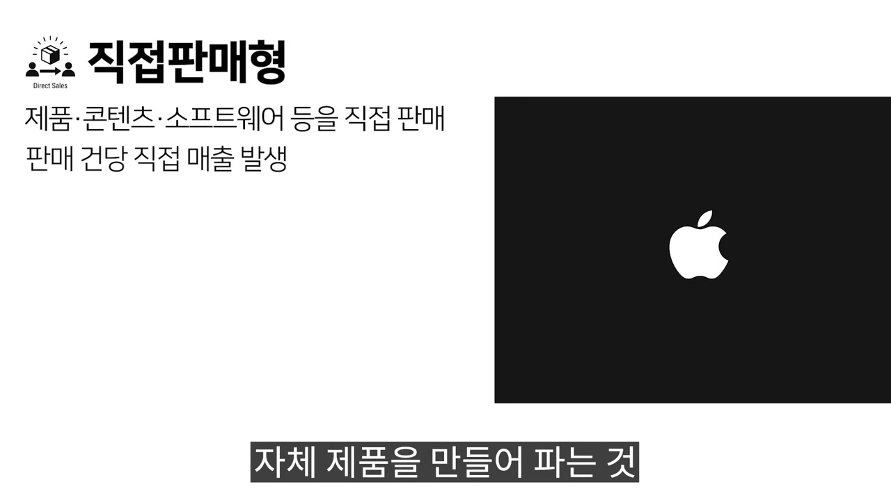
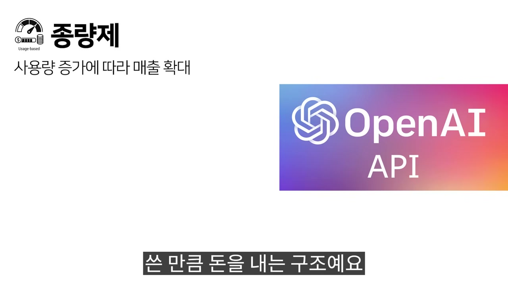
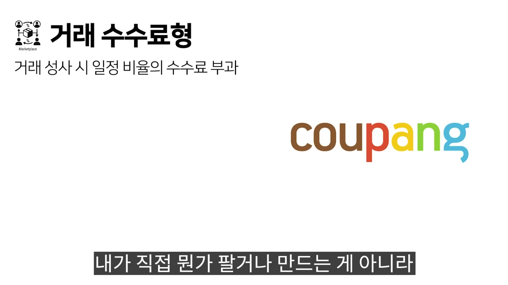
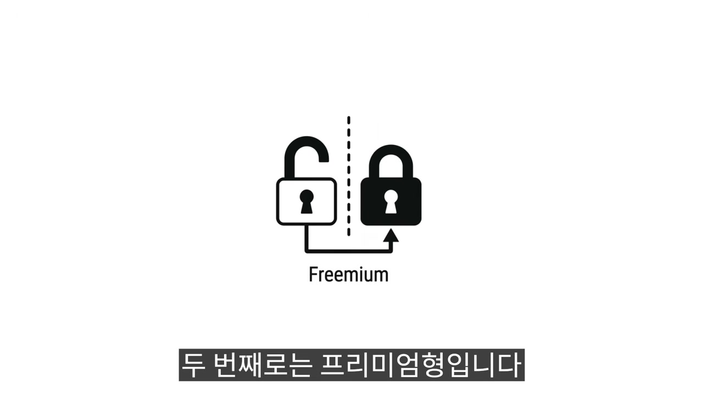
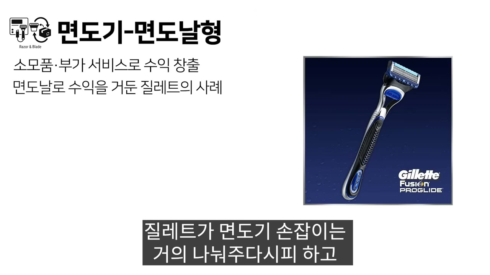
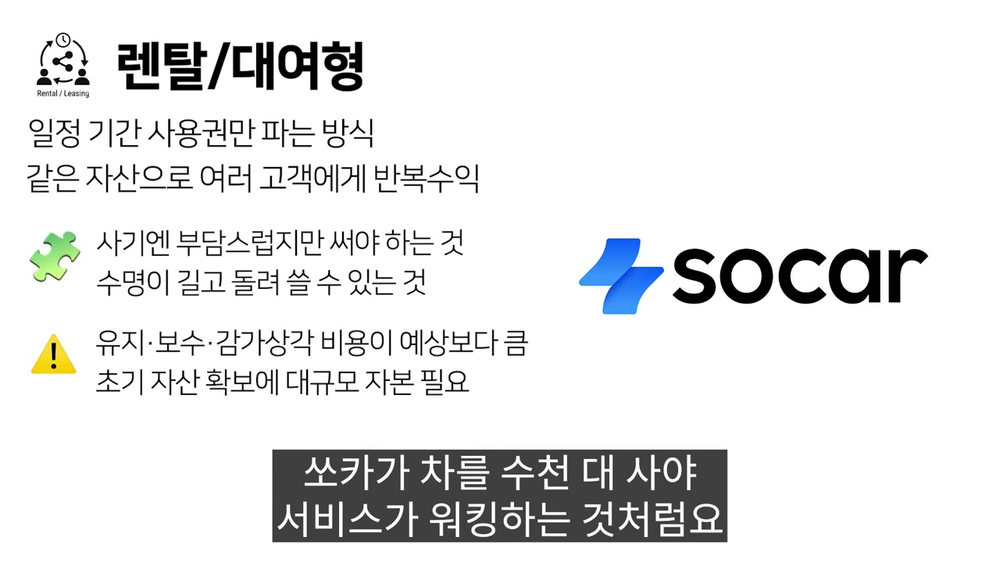
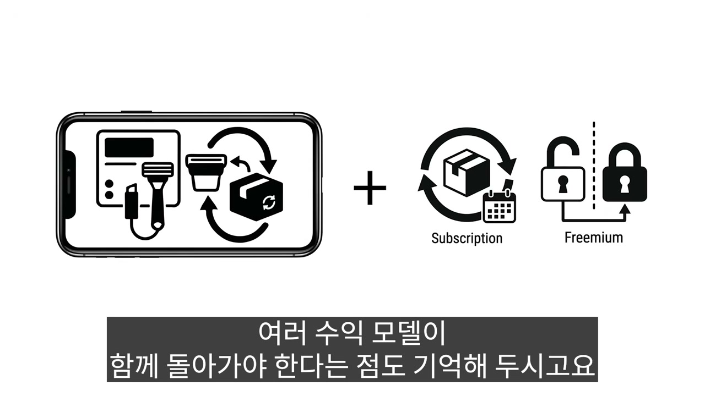

"수익 모델의 유형은 이미 정해져 있습니다." 영상은 이 한 문장으로 시작한다. 세상에 아무리 새로운 서비스가 나와도, 돈을 버는 구조는 결국 기존 패턴을 고르거나 조합하거나 둘 중 하나라는 것이다. 그러니까 창업자가 할 일은 돈 버는 법을 새로 발명하는 게 아니라, 이미 있는 15가지 패턴 중에서 내 서비스에 맞는 걸 고르는 일이다.

언뜻 김 빠지는 말 같지만, 뒤집어 보면 꽤 실용적인 전제다. 모델이 유한하다면 외울 수 있고, 외울 수 있다면 고를 수 있다. 영상은 이 15가지를 빠르게 훑으면서 각각에 대해 같은 질문을 반복한다. 이건 언제 작동하는가, 언제 무너지는가, 그리고 잘 굴러가는지 알려면 어떤 숫자를 봐야 하는가. 모델 하나하나를 외우는 것보다 이 세 질문의 틀을 손에 쥐는 쪽이 훨씬 오래 남는다.

## 돈을 누가, 언제 내는가

15가지는 무질서하게 흩어진 목록이 아니다. 영상의 설명을 따라가다 보면 몇 개의 축이 드러난다. 가장 근본적인 축은 **돈을 내는 사람이 누구인가**다.

대부분의 모델은 서비스를 쓰는 사람이 돈을 낸다. 구독형이 전형이다. 매달 혹은 매년 일정 금액을 내고 서비스를 계속 쓰는 방식. 고객이 해지하지 않는 한 수익이 반복되니까, 한번 안착시키면 매출 예측이 쉬워지고 사업이 안정된다. 영상은 요즘 대부분의 서비스가 구독을 붙이려는 이유가 바로 이것이라고 짚는다.

그런데 광고형에서는 이 전제가 깨진다. 유저한테는 돈을 안 받는다. 대신 유저가 많이 모이면, 그 사람들에게 자기 상품을 보여주고 싶은 광고주에게 돈을 받는다. "돈을 내는 사람과 서비스를 쓰는 사람이 다르다는 게 이 모델의 본질입니다." 이 한 문장이 광고형의 모든 제약을 결정한다. 사용자는 고객이 아니라 상품이 되고, 그래서 규모 싸움이 된다. 수만 명으로도 부족하고, 광고 단가가 높은 일부 업종을 빼면 수십만 수백만은 되어야 의미 있는 매출이 나온다.

후원형은 한술 더 뜬다. 여기서는 돈을 낼 의무 자체가 없는데도 사람들이 자발적으로 낸다. "이 서비스가 좋으니까, 계속 유지됐으면 하니까." 그래서 강한 팬층이나, 공익적 가치에 공감하는 사람들이 전제 조건이 된다.

이 세 모델을 나란히 놓으면 하나의 스펙트럼이 보인다. 한쪽 끝에는 쓰는 사람이 곧 내는 사람인 구독, 반대쪽 끝에는 내는 사람이 따로 있는 광고, 그 너머에는 낼 의무조차 없는 후원이 있다. 돈의 출처가 서비스에서 멀어질수록 매출은 통제하기 어려워진다. 후원형이 "이번 달 후원이 많아도 다음 달에 뚝 떨어질 수 있다"는 약점을 안고 가는 이유다.

## 한 번 받을 것인가, 계속 받을 것인가

두 번째 축은 **돈이 한 번 들어오느냐, 반복해서 들어오느냐**다. 이건 사업의 안정성을 가르는 선이다.

직접 판매형이 가장 단순하다. 내가 만든 물건이나 콘텐츠를 고객에게 직접 판다. 온라인 강의, 한 카피씩 파는 소프트웨어, 자체 제품. 단순한 만큼 약점도 선명하다. "한 번 사면 다시 살 이유가 없어지는 제품"이라면, 매출을 유지하려고 끊임없이 새 고객을 데려와야 하고, 이게 생각보다 비용이 많이 든다. 그래서 영상이 직접 판매형에서 보라고 한 지표가 객단가와 재구매율이다. 둘 다 낮으면 신규 고객 확보 비용을 감당할 수 없다.

반복 수익을 만드는 모델들은 이 약점을 구조로 푼다. 구독형은 시간을 묶어서, 종량제는 사용량에 붙여서, 라이센스형은 권리를 빌려줘서 돈이 다시 들어오게 만든다.

종량제는 쓴 만큼 돈을 내는 구조다. 많이 쓰면 많이 내고 적게 쓰면 적게 낸다. 고객 입장에선 안 쓰는데 돈 나가는 억울함이 없고, 서비스 입장에선 소규모부터 대규모 사용자까지 전부 유치할 수 있다. 다만 조건이 까다롭다. 사용량을 정확히 측정하고 과금하는 시스템이 있어야 하고, 사용자마다 쓰는 양의 편차가 커야 의미가 있다. 다들 비슷하게 쓴다면 구독이나 정액제가 훨씬 간편하니까.

라이센스형은 내가 가진 기술, 콘텐츠, 특허 같은 지적재산의 사용권한을 파는 모델이다. "한번 잘 만들어 놓으면 여러 곳에 동시에 팔 수 있다." 이게 핵심 매력이다. 대신 남들이 쉽게 따라 만들 수 없는 나만의 무언가가 있어야 하고, 라이센스형에는 특유의 자기 잠식이 따라붙는다. 라이선스를 사간 쪽이 기술을 학습해서 자체 개발로 갈아타는 경우가 흔하다. 내 기술을 빌려줬더니 그 기술로 나를 떠나는 셈이다.

반복 수익 모델들이 공통으로 보는 숫자가 있다. 구독의 월간 이탈률, 라이센스의 갱신율, 후원의 지속률. 이름은 다르지만 묻는 건 똑같다. 한 번 들어온 사람이 계속 남아 있는가. 영상이 구독의 이탈률을 설명하며 든 계산이 이 숫자의 무게를 잘 보여준다. 월 이탈률이 5%만 돼도 매달 20명 중 한 명이 떠나고, 1년이면 절반 이상이 빠진다.

## 직접 팔 것인가, 남을 통할 것인가

세 번째 축은 내가 직접 거래의 주체가 되느냐, 남의 거래에 끼느냐다. 여기서부터는 내가 통제할 수 있는 영역이 점점 줄어든다.

거래 수수료형은 내가 직접 뭔가를 팔거나 만들지 않는다. 파는 사람과 사는 사람을 연결해주고, 거래가 성사될 때마다 일정 비율을 뗀다. 거래량이 늘수록 수익도 같이 오른다. 문제는 시작이다. 공급자와 수요자 양쪽을 모두 모아야 하는데, 한쪽만 있으면 거래가 안 일어난다. "닭이 먼저냐 달걀이 먼저냐" 하는, 대부분의 마켓플레이스가 초기에 부딪히는 가장 큰 벽이다.

이 모델에는 더 은밀한 위험이 하나 더 있다. 한 번 연결된 공급자와 수요자가 다음부터 플랫폼을 거치지 않고 직접 거래해버리면 어떻게 되는가. 영상이 든 예시가 날카롭다. 과외 매칭 앱에서 선생님과 학부모가 연락처를 교환하는 순간, 플랫폼은 필요 없어진다. 연결이 곧 자기 존재 이유인데, 연결에 성공하는 순간 그 이유가 사라지는 역설이다.

제휴, 어필리에이트형은 한 걸음 더 남에게 의존한다. 내 서비스에 모인 사람들을 다른 서비스로 보내주고, 그 대가로 수수료를 받는다. 직접 팔지 않고 소개만 한다. 영상은 이걸 "조금 아슬아슬한 방식"이라고 부른다. 매출이 파트너사의 수수료 정책에 거의 전적으로 의존하기 때문이다. 갑자기 수수료율이 절반으로 줄어도 내가 할 수 있는 게 없다. 게다가 고객과의 관계마저 내 것이 아니라 파트너사의 것이 된다. 사람을 아무리 보내줘도 내 서비스에는 자산이 쌓이지 않는다.

성과보수형은 결과가 나왔을 때만 돈을 받는다. 성과가 없으면 비용도 없다. 고객 입장에선 리스크가 제로에 가까우니 진입장벽이 매우 낮고, 그래서 고객을 끌어오기가 쉽다. 다만 "성과가 무엇인지" 양쪽이 명확히 합의할 수 있어야 한다. 영상의 대비가 명쾌하다. "매출이 올랐다"는 모호하고, "채용이 확정됐다"는 분명하다. 성과의 정의가 칼같이 떨어지는 영역에서만 작동하고, 애매하면 분쟁이 끊이지 않는다.

화이트 라벨은 이 축의 끝에 있다. 내가 만든 제품이나 기술을 다른 회사가 자기 브랜드 이름을 붙여서 판다. 최종 소비자는 내 존재를 모르고, 파트너 회사의 제품인 줄 안다. "무대 뒤에서 실력으로 먹고 사는 방식"이다. 제조나 제작은 잘하지만 직접 고객을 모으거나 브랜드를 키우긴 어려운, 혹은 그럴 필요가 없는 경우에 맞는다. 대가는 분명하다. 내 브랜드가 시장에 전혀 알려지지 않고, 파트너사가 사라지면 매출까지 통째로 사라진다.

거래 수수료에서 화이트 라벨로 갈수록 한 가지가 일관되게 나빠진다. 고객이 내 고객이 아니게 된다는 것. 영상이 이 모델들에서 반복해 경고하는 게 바로 통제권의 상실이다. 매출을 남이 쥐고 흔들 수 있고, 그 남이 떠나면 사업도 함께 흔들린다.

## 무료를 미끼로 쓰는 법

네 번째 묶음은 **공짜를 어떻게 돈으로 바꾸는가**를 다룬다. 같은 목표를 향하지만 미끼의 위치가 서로 다르다.

프리미엄형은 일단 공짜로 쓰게 해주고, 더 쓰고 싶은 사람한테만 돈을 받는다. "써보니까 좋은데, 여기서 더 쓰려면 결제를 해야 하네?" 이 자연스러운 흐름을 설계하는 게 핵심이다. 여기엔 미묘한 균형이 필요하다. 무료 버전이 별로면 사람이 안 모이고, 사람이 안 모이면 유료 전환도 없다. 동시에 무료 버전이 너무 잘 되어 있으면 굳이 돈 낼 이유가 없어진다. 그래서 용량 제한이나 기능 제한, 팀원 수 제한 같은 "자연스러운 천장"이 있어야 한다. 영상이 제시한 기준은 구체적이다. 무료에서 유료로 넘어오는 전환율이 업계 평균 3~5%, 10%를 넘으면 아주 잘 되고 있는 것이다. 단, 이 숫자는 사용자 풀이 충분히 클 때만 의미가 있다. 영상은 전체 사용자 자체가 작은 니치 서비스에는 이 모델이 안 어울린다고 못 박는다. 모수가 작으면 전환율을 4~5%로 끌어올려도 유의미한 매출이 안 나오기 때문이다.

면도기·면도날형은 미끼를 본체에 심는다. 레이저 앤 블레이드(razor and blade)라고도 부르는데, 본체는 싸게, 심지어 손해를 보면서까지 팔고, 거기 들어가는 소모품이나 부가서비스로 돈을 번다. 이름의 유래를 영상이 직접 밝힌다. 질레트가 면도기 손잡이는 거의 나눠주다시피 하고, 면도날 교체로 수익을 냈기 때문이다. 본체에 반드시 붙어야 하는 소모품이 반복 소비되어야 하고, 무엇보다 그 소모품을 내가 독점적으로 공급할 수 있어야 한다. 호환품이 아무 데서나 팔리면 수익 구조가 통째로 무너진다.

영상은 이 약점을 프린터 시장으로 보여준다. 비정품 잉크가 판을 쳤을 때 정품을 파는 사업자들이 엄청 경계했던 것처럼, 서드파티 대체제의 등장은 핵심 수입원을 직접 위협한다. 미끼로 본체를 뿌려놨는데 정작 돈 벌 소모품을 남이 가져가는 상황이다.

인앱 구매형도 무료를 입구로 쓰지만 파는 방식이 다르다. 프리미엄형이 등급 자체를 업그레이드하는 거라면, 인앱 구매는 "이 아이템, 이 콘텐츠"를 하나씩 사는 방식이다. 주로 게임이나 디지털 콘텐츠에서 보인다. 안 사도 서비스는 쓸 수 있되, 사면 경험이 확실히 좋아져야 한다. 영상이 못 박은 경계가 인상적이다. 게임에서 "과금 안 하면 절대 못 이기는 구조"로 만들면 역풍을 심하게 맞는다. 여기서 핵심은 소수다. 보통 과금하는 사람은 전체의 5~10%인데, 이 소수가 전체 매출을 만들어 내기 때문에 이들이 얼마를 쓰는지가 관건이다.

<!-- IMG 🎨 프리미엄(등급 업그레이드) vs 인앱구매(개별 아이템 구매)의 차이를 나란히 보여주는 대조 도식 -->

## 자산과 데이터, 가진 것을 굴리는 법

마지막 묶음은 이미 가진 것에서 돈을 짜내는 모델들이다.

데이터 판매형은 서비스를 운영하면서 쌓이는 데이터를 가공해 필요한 곳에 판다. 원래 서비스의 부산물로 나오는 데이터가, 다른 누군가에게는 돈 주고 살 만큼 가치 있을 때 성립한다. 그래서 영상은 이걸 메인 수익보다 서브 수익으로 잘 활용된다고 본다. 조건은 고유성이다. 누구나 긁어모을 수 있는 데이터는 돈이 안 된다. 여기엔 다른 모델에 없는 리스크가 하나 붙는다. 개인정보 관련 법률이다. 어떤 데이터를 어떻게 팔 수 있는지 법적 검토를 먼저 해야 한다.

렌탈, 대여형은 소유권을 넘기지 않고 일정 기간 쓰게 해준다. 고객은 비싼 걸 한꺼번에 사지 않아도 되고, 제공자는 같은 자산으로 여러 고객에게 반복 수익을 만든다. 작동 조건이 까다롭다. 고객이 사기엔 부담스럽지만 쓰기는 해야 하는 자산이 있어야 한다. 살 만한 가격인데 굳이 빌릴 이유가 없으면 이 모델은 안 먹힌다. 영상은 여기서 흔히 잊히는 비용을 끄집어낸다. 유지보수와 감가상각, 그리고 초기에 자산을 확보하는 큰 자본이다. 쏘카가 차를 수천 대 사야 서비스가 돌아가는 것처럼, 초기 자본 조달 계획이 반드시 함께 가야 한다.

그래서 렌탈형의 핵심 지표는 가동률이다. 내가 보유한 자산이 실제로 사용되고 있는 비율. 영상의 계산이 이 숫자의 잔인함을 보여준다. 차를 100대 보유하고 있는데 하루에 10대만 나가면 가동률은 10%다. 나머지 90대는 돈을 못 벌면서 유지비만 먹고 있다. 자산을 깔고 시작하는 사업에서 가동률이 낮으면 적자를 피할 수 없다.

## 정답이 아니라 가설이다

15가지를 다 훑은 뒤 영상이 남기는 마지막 당부가, 어쩌면 목록 전체보다 중요하다. 수익 모델은 정답이 딱 정해져 있는 게 아니라 **가설로 세우라**는 것이다.

처음에 골랐던 모델이 실제로 돌려보니 안 맞을 수 있고, 그러면 바꾸면 된다. 영상이 든 사례가 배달의민족이다. 처음에는 광고 모델이었다가 지금은 거래 수수료 중심으로 바뀌었다. 그러니 완벽한 모델을 고르는 데 시간을 많이 쓰기보다, 일단 하나를 골라서 빠르게 검증하는 게 낫다. 그리고 서비스가 커질수록 하나의 모델보다 여러 모델이 함께 돌아가야 한다.

여기서 맨 앞의 그 단호한 선언이 다른 색으로 읽힌다. "수익 모델의 유형은 이미 정해져 있다"는 말은, 정답이 정해져 있다는 뜻이 아니었다. 재료가 정해져 있다는 뜻이다. 15가지는 외워야 할 정답표가 아니라, 섞어 쓰라고 펼쳐놓은 재료 목록이다. 본체는 싸게 팔아 깔고(면도기·면도날), 그 위에 구독을 얹고, 무료층에서 일부를 유료로 끌어올리는(프리미엄) 식으로 모델은 얼마든지 겹쳐 쓸 수 있다. 결국 영상이 가르치려는 건 15개의 답이 아니라, 내 서비스 앞에서 매번 다시 던져야 할 세 개의 질문이다. 돈을 누가 내는가, 그 돈이 반복되는가, 그리고 내가 통제할 수 있는가.

