"나는 더 이상 프롬프트를 쓰지 않는다. 루프 엔지니어링을 한다."

요즘 AI 코딩 커뮤니티에서 가장 술렁이는 한마디다. 앤트로픽의 보리스, 피터 같은 사람들이 이런 인터뷰를 잇따라 내놓으면서, 또 한 번 판이 뒤집힌 분위기가 됐다. 프롬프트 엔지니어링을 겨우 익혔더니 컨텍스트 엔지니어링이 왔고, 그걸 따라잡으니 이제는 루프란다. X에는 슬래시 골 하나로 앱 전체를 만들었다는 간증이 넘쳐난다. 화자의 말마따나, 이쯤 되면 어쩐지 나만 뒤처지는 기분이 든다.

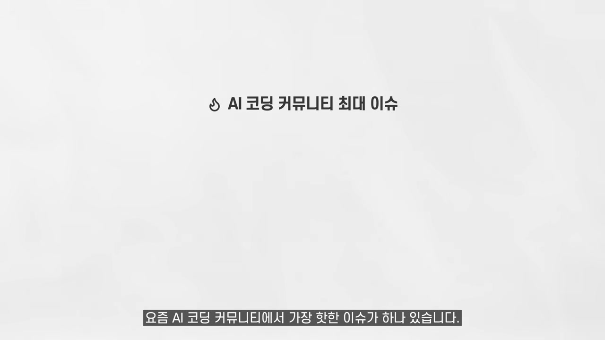

김플립 채널의 이 영상은 그 분위기에 정면으로 제동을 건다. 화자는 누구를 비난하려는 게 아니라고 먼저 못 박은 뒤, 결론을 앞에 깔아둔다. **루프는 진짜고 미래일 수도 있지만, 지금 우리가 쓰면 안 되는 이유가 명확하다는 것.** 그리고 예외적으로 지금 당장 써도 되는 루프가 딱 하나 있다는 것. 이 글은 그 두 갈래를 따라간다.

## 휴먼 인 더 루프, 우리가 지금까지 일하던 방식

용어부터 정리하고 가자. 지금까지 우리가 클로드 코드, 코덱스, 커서로 일하던 방식은 이렇다. 내가 "랜딩 페이지 만들어줘"라고 프롬프트를 넣으면, 에이전트가 결과물을 만든다. 나는 그걸 확인하고 테스트한다. 마음에 안 들면 다시 프롬프트를 넣고, 또 첫 번째로 돌아간다. 이게 휴먼 인 더 루프다. 만드는 건 에이전트지만, 방향을 잡고 통제하고 승인하는 건 사람이다.

투두리스트 앱을 만든다고 해보자. 랜딩 페이지를 먼저 만들고, 마음에 들면 인증, 그 다음 백엔드. 이렇게 단계마다 사람이 검수하며 전진한다. 핵심은 사람이 루프 안에 있다는 점이다.

## 에이전팅 루프, 사람을 루프 밖으로 빼낸다

루프 엔지니어링은 이 구조에서 사람을 빼버린다. 순서는 이렇다. 사람이 스펙 MD나 PRD MD 같은 기획 문서를 만든다. 그리고 루프를 실행한다. 사람의 역할은 여기서 끝이다. 이후로는 에이전트가 결과물을 만들고, 그 결과물이 다시 에이전트에게 피드백으로 들어가고, 에이전트가 스스로 판단해 계속 작업한다. 끝날 때까지 이 과정을 반복한다. 사람은 딱 한 번, 방아쇠를 당길 때만 개입한다.

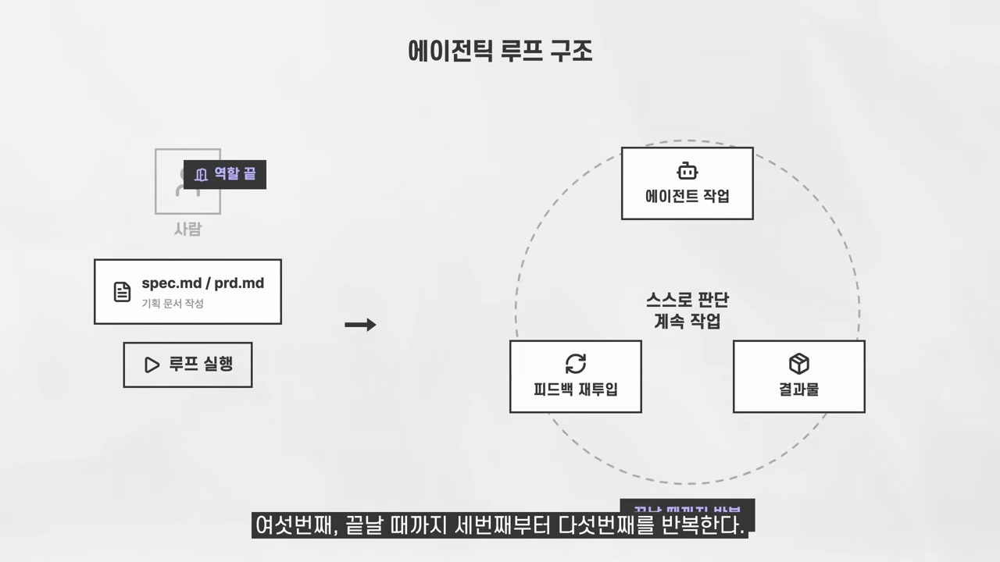

요즘 유행하는 슬래시 골, 슬래시 루프, 한때 화제였던 랄프 루프까지, 화자의 정리에 따르면 이름만 다를 뿐 사실 전부 같은 구조다. "끝날 때까지 멈추지 마, 실수하지 마"라고 명령하고 자리를 뜨는 것이다. 이론적으로는 아름답다. 자는 동안 앱이 완성되는 그림이니까.

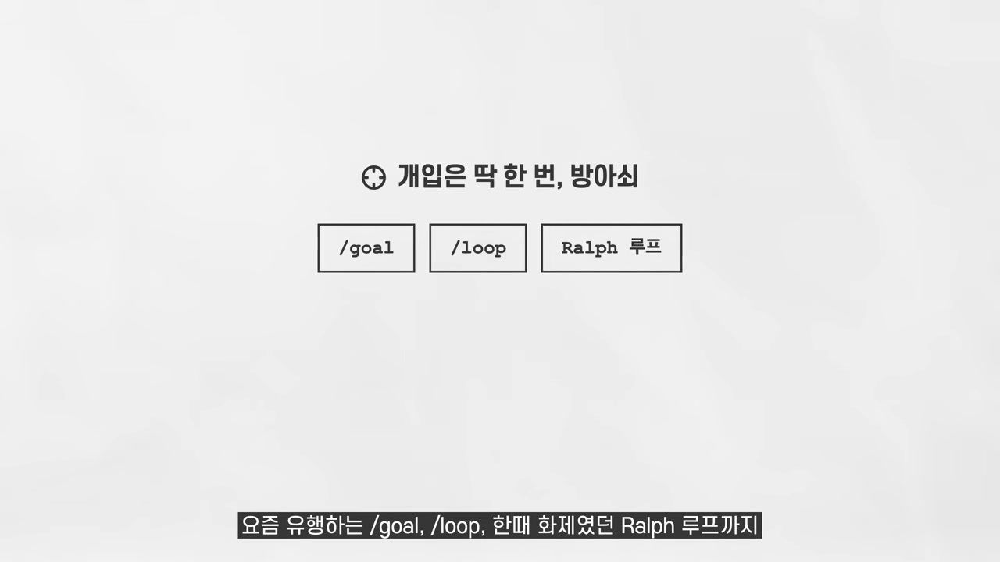

문제는 여기서부터 일이 끔찍하게 꼬인다는 데 있다.

## 첫 번째 문제, 에이전트는 반드시 가정을 한다

화자가 드는 비유는 이렇다. 당신이 스타트업을 차렸고, 아주 똑똑한 개발자를 한 명 고용했다. 기획서를 건네주고 "이대로 만들어줘"라고 한 뒤, 그 개발자가 단 한 번의 상의도 없이 혼자 전부 만들어서 가져온다. 무슨 일이 벌어질까.

그 개발자는 기획서에 없는 모든 빈칸을 자기 가정으로 채운다. 디자인의 느낌, 아키텍처 결정, 엣지 케이스 처리까지 전부. 그리고 그 결정들은 높은 확률로 당신의 머릿속 그림과 다르다. 결과물은 완성됐지만, 원하던 것은 아니다.

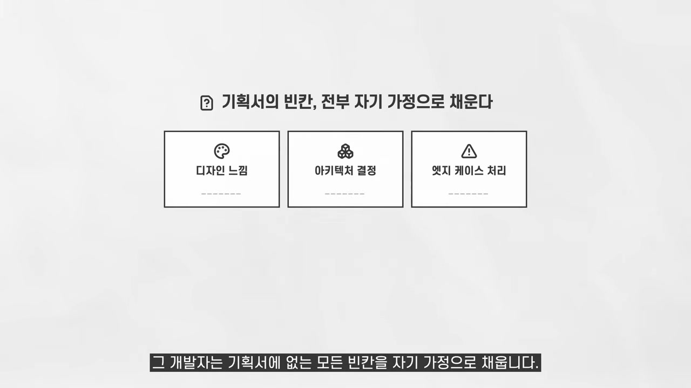

"내 기획 문서는 완벽한데?"라고 생각할 수 있다. 화자는 단언컨대 아니라고 말한다. 외주나 에이전시 일을 해본 사람이라면 안다. 고객 머릿속 생각을 전부 끄집어내려고 아무리 노력해도, 결과물을 보여주면 반드시 이 말이 나온다. "아 이건 빠뜨렸네요. 제 말은 이런 뜻이었어요." 인간끼리도 서로를 완전히 이해하지 못하는데, 문서 한 장으로 AI가 당신을 완벽히 이해할 리가 없다.

게다가 제품에 대한 생각은 만드는 도중에도 계속 바뀐다. 어제는 리퀴드 글래스가 멋졌는데 오늘은 좀 과해 보이는 게 사람 마음이다. **아직 본인도 완전히 시각화하지 못한 앱을 루프에게 통째로 맡길 수는 없는 노릇이다.** 이게 첫 번째 벽이다.

## 두 번째 문제, 루프는 돈을 태우는 기계다

두 번째 문제는 더 현실적이다. 비용이다. 루프는 본질적으로 에이전트가 자기 결과물을 읽고 다시 생성하고 또 읽고 또 생성하는 구조다. 토큰이 기하급수적으로 불어난다.

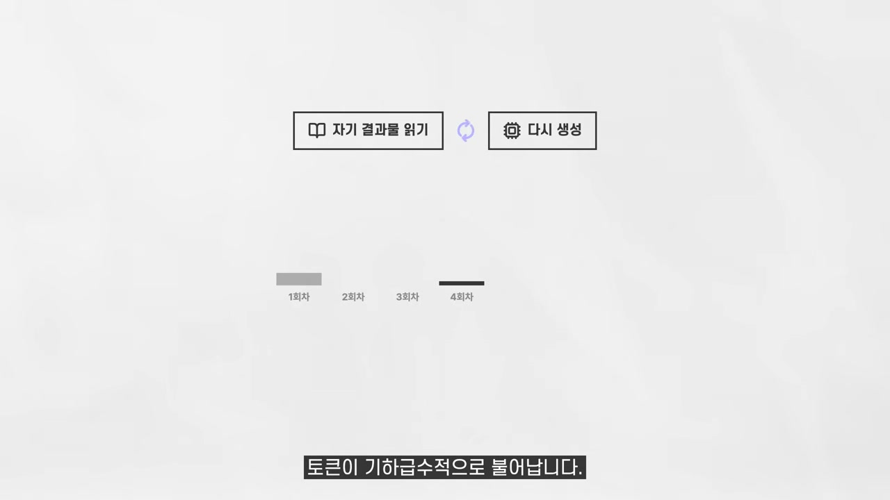

화자는 실제 수치를 든다. 앤트로픽의 피터는 한 달에 130만 달러어치 토큰을 태웠다고 직접 밝혔다. 여기서 화자가 짚는 핵심 통찰이 나온다. **루프를 전파하는 사람들에게는 토큰 예산이라는 개념 자체가 없다는 점이다.** 모델 회사 내부 인력에게 토큰은 공짜나 다름없다. 그들 입장에서 자가치유 에이전트를 실험하는 건 당연히 합리적이다. 무제한 뷔페에서 접시 수를 세는 사람은 없으니까.

문제는 그 방법론이 월 2만 원짜리 구독을 쓰는 우리에게 그대로 내려온다는 점이다. 화자의 기준은 분명하다. 월 200달러짜리 맥스 플랜이 아니라면, 루프는 고려할 가치조차 없는 선택지다.

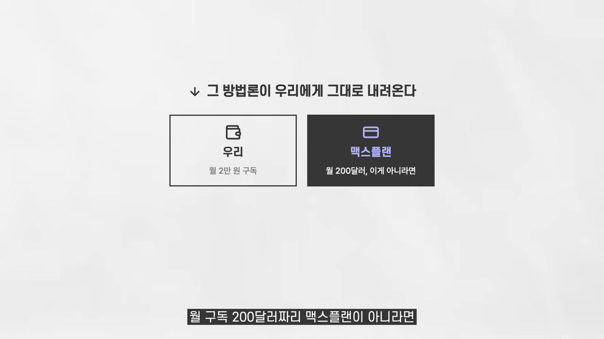

결과는 보장되지 않는데 비용은 확정인 구조. 화자는 이걸 한마디로 정리한다. 루프는 슬롯머신이다. 레버를 당기는 순간 토큰은 빠져나가고, 잭팟이 터질지는 아무도 모른다. 다만 카지노 회사, 즉 AI 회사는 항상 이긴다.

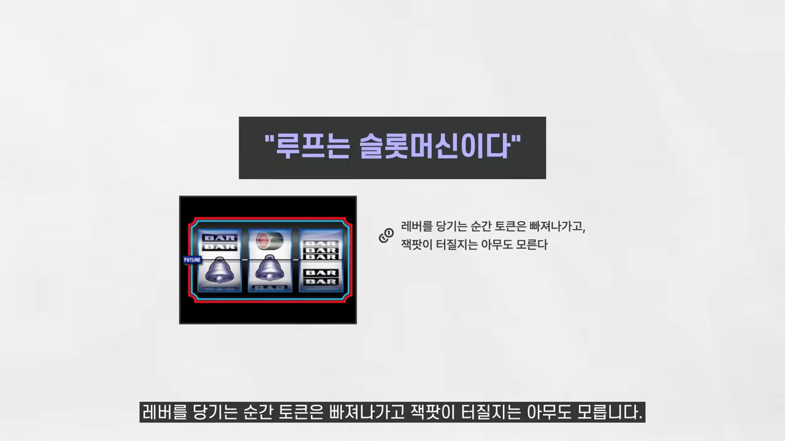

## 그런데 루프가 통하는 곳이 딱 하나 있다

여기까지만 들으면 루프 무용론처럼 들린다. 하지만 화자는 "루프는 다 쓰레기야"라고 외치는 꼰대가 되고 싶진 않다고 말한다. 그리고 반전을 꺼낸다. 현시점에 루프가 정말 필요한 곳이 있다. 바로 코드 리뷰 루프다.

워크플로우는 이렇다. AI로 코딩한 뒤 깃허브에 푸시한다. 깃허브에 설치된 그렙타일 같은 코드 리뷰 에이전트가 자동으로 리뷰하고 5점 만점으로 점수를 매긴다. 4점 이상이 아니면 절대 프로덕션에 배포하지 않는다. 점수가 낮으면 슬래시 그렙타일 루프라는 스킬을 실행한다. 그러면 에이전트가 리뷰를 읽고, 코드를 수정하고, 다시 푸시하고, 새 리뷰와 점수를 기다린다. 5점이 나오거나 5번 시도할 때까지 자동으로 반복한다.

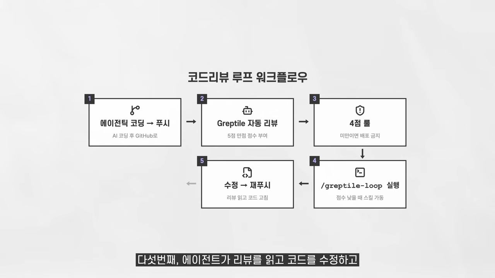

이 루프는 잘 작동한다. 왜일까. 앱 빌딩 루프와 결정적으로 다른 점이 하나 있기 때문이다. **피드백이 고정되어 있고, 성공 기준이 숫자로 정의된다.** "점수를 4점 이상으로 올려라"에는 가정이 끼어들 틈이 없다. 취향도, 비전도, 창의성도 필요 없다. 목표가 이진적이라 통과 아니면 실패다. 평가자가 외부에 존재하는 리뷰 에이전트이고, 피드백이 점수와 구체적 지적사항으로 구조화되어 있다. 루프가 폭주할 수가 없는 구조다.

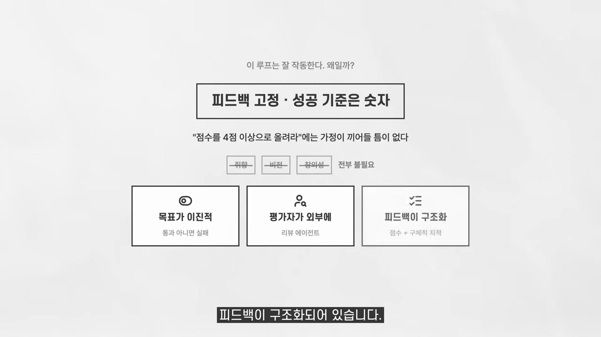

물론 이 루프조차 완벽하진 않다. 푸시하는 코드가 1000줄을 넘어가면 리뷰 에이전트가 전체 맥락을 소화하지 못해 5점이 거의 나오지 않는다. 그래서 PR을 1000줄 이하로 쪼개는 규칙을 추가로 운영하는 방법이 있다. 가장 통제된 루프에서도 또 다른 운영 규칙이 필요하다는 뜻이다.

## 루프를 써도 되는 조건, 망하는 조건

그럼 루프를 써도 되는 상황을 일반화해 보자. 화자가 추리는 조건은 이렇다. 피드백이 고정되어 있고 자동으로 생성될 것(테스트 통과 여부, 리뷰 점수). 결과가 이진적일 것(됐거나 안 됐거나). 디테일에 관심이 없을 것(일회성 실험, 프로토타입, 내부 벤치마크 도구). 같은 패턴의 반복 생산일 것(동일하고 규정된 공식의 템플릿 페이지 300개를 찍어내는 작업).

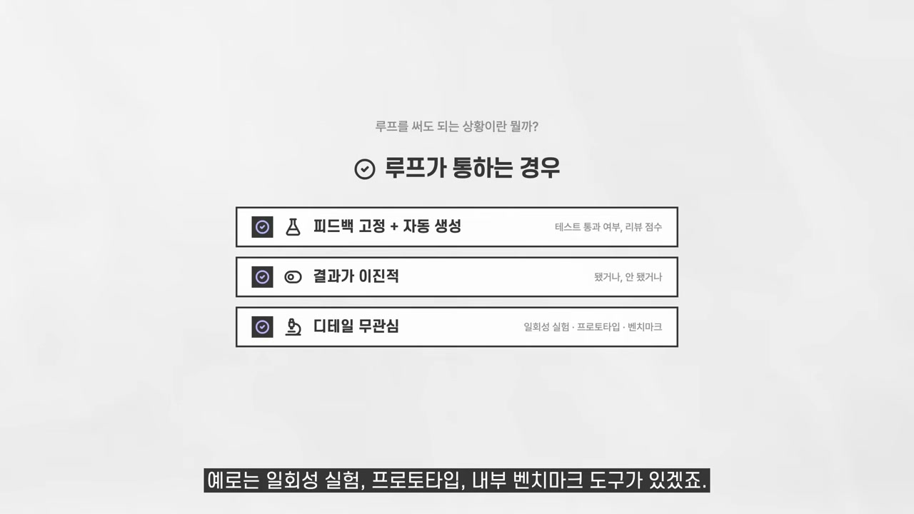

반대로 루프를 쓰다가 망하는 경우는 이렇다. 결과물에 취향과 비전이 들어갈 때(제품, 디자인, 사용자 경험). 본인도 원하는 게 뭔지 아직 명확하지 않을 때. 중간에 사람의 피드백을 받아야 하는 작업일 때. 그리고 토큰 예산이 유한할 때.

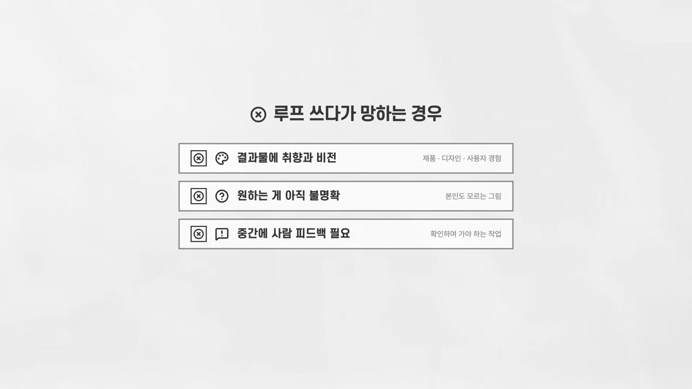

화자는 마지막 비유로 매듭을 짓는다. 루프로 앱을 만드는 건 완전 자율주행 버튼을 누르는 것과 같다. 가는 길에 괜찮은 식당이 보여도, 좋은 여행지가 있어도, 이미 지나가면 들를 수 없다. 자율주행 차는 이미 가던 길로 가게 세팅되어 있기 때문이다. 그런데 스타트업이란 본래 중간에 계속 내려서 사용자에게 물어보고 경로를 수정해야 하는 여정이다. 루프에는 그런 부분이 없다.

## 가장 좋은 루프는, 여전히 사람이 들어 있는 루프

오해하면 안 된다. 화자는 이게 "루프는 영원히 안 된다"는 이야기가 아니라고 분명히 한다. 먼 미래에는 100% 가능해질 거라고 그도 인정한다. 모델은 좋아지고, 하네스는 정교해지고, 토큰은 싸질 테니까. 1년 뒤에는 이 영상이 틀린 영상이 될 수도 있다.

다만 2026년 6월 현재의 결론은 이렇게 모인다. 첫째, 루프 전도사들의 환경과 내 환경은 다르다. 토큰이 공짜인 사람의 워크플로우를 유료 구독자가 그대로 따라 하면 안 된다. 둘째, AI는 소스를 복제할 수는 있어도 창조할 수는 없다. 제품의 디테일, 감각, 비전은 여전히 사람이 루프 안에서 공급해야 한다. 셋째, 루프를 쓰고 싶다면 코드 리뷰처럼 피드백이 고정되고 목표가 숫자로 정의되는 좁은 구간부터 시작하는 게 맞다. 그게 지금 당장 돈값을 하는 유일한 루프다.

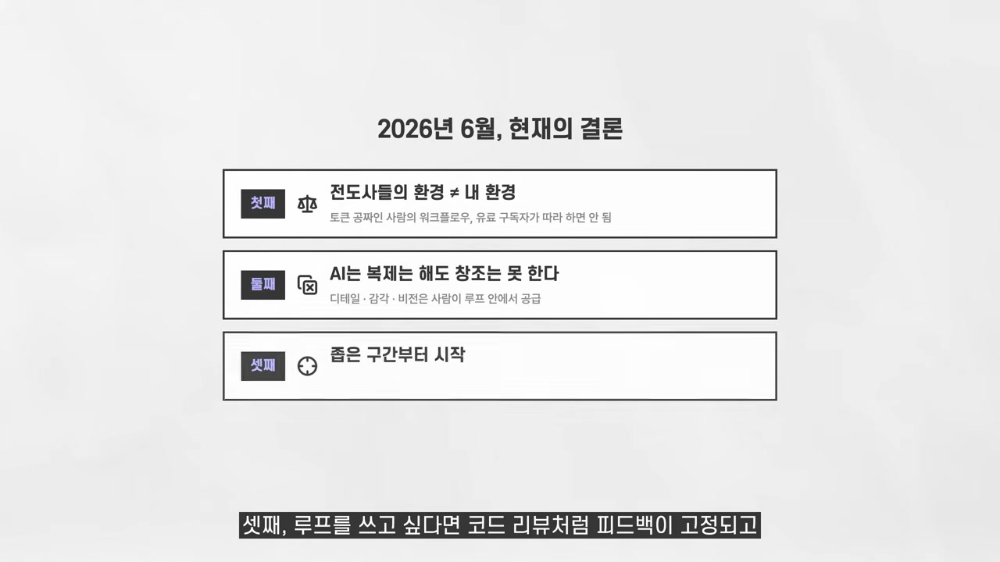

한 줄로 요약하면, 현재는 휴먼 인 더 루프가 최고의 루프다. 유행과 트렌드에 올라타기 전에, 내 토큰 잔고와 내 작업의 성격부터 확인하는 게 먼저다.

화자가 영상 끝에 덧붙이는 당부가 인상적이다. AI 코딩 신은 요즘 너무 급박하게 돌아간다. 유명 인사들의 말에 귀를 기울일 필요는 있지만, 한마디 한마디에 너무 민감하게 반응할 필요는 없다. 본인을 포함한 많은 인플루언서의 말에도 너무 휘둘리지 말라는 것이다. 한마디 말이 순식간에 스노우볼처럼 트렌드가 되는 시대일수록, 그 정보에서 옥석을 가려 내 것으로 만드는 안목이 필요하다. 아닌 건 아니니까.
