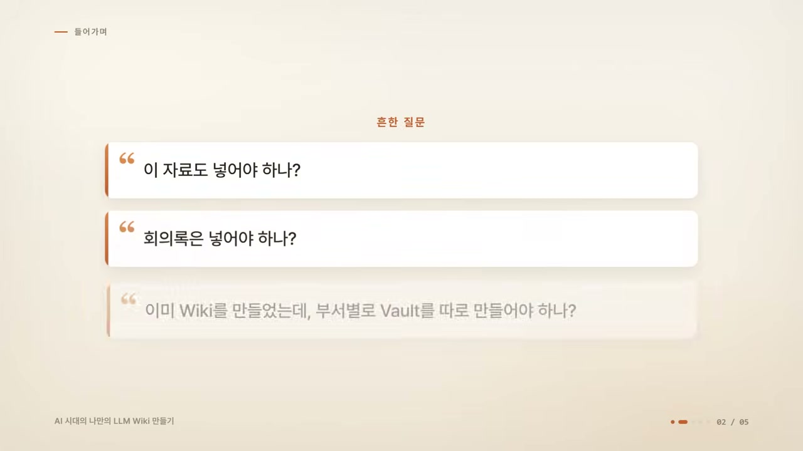
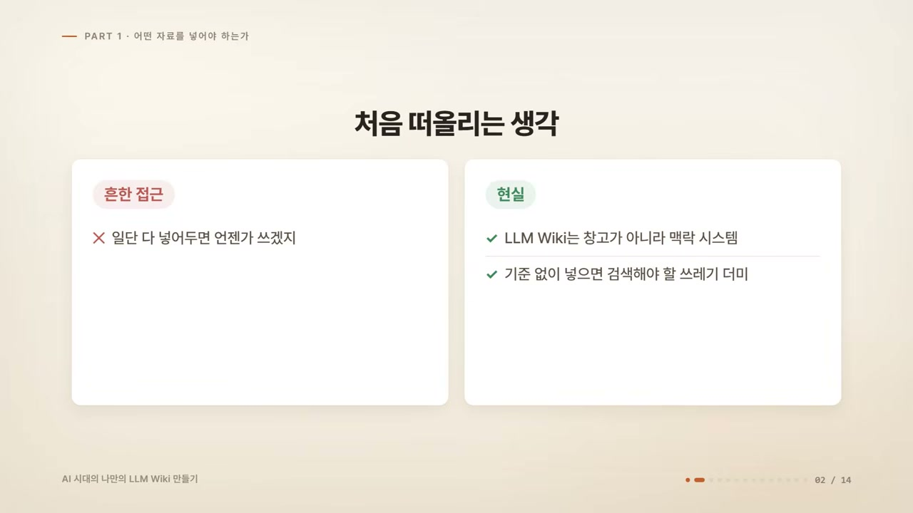
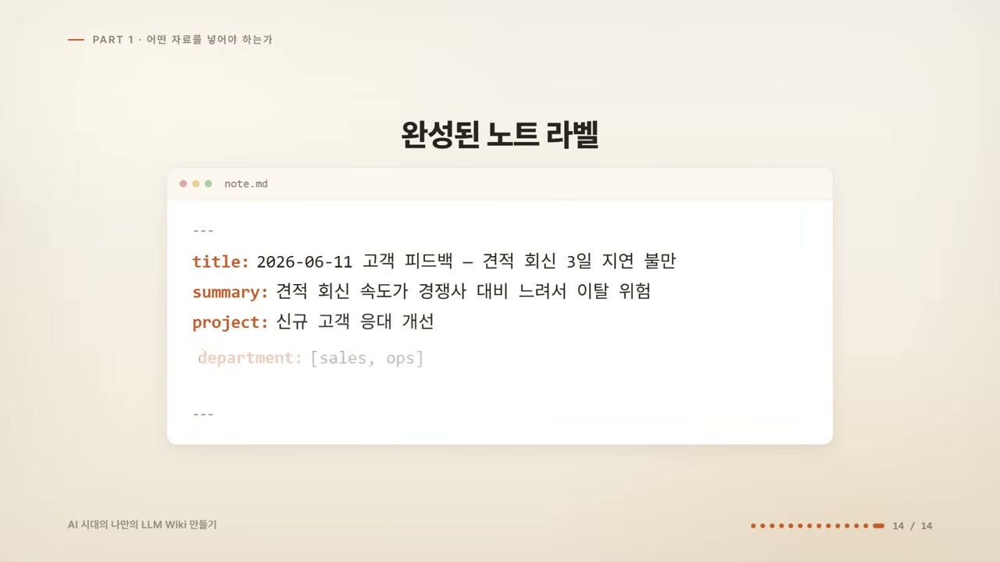
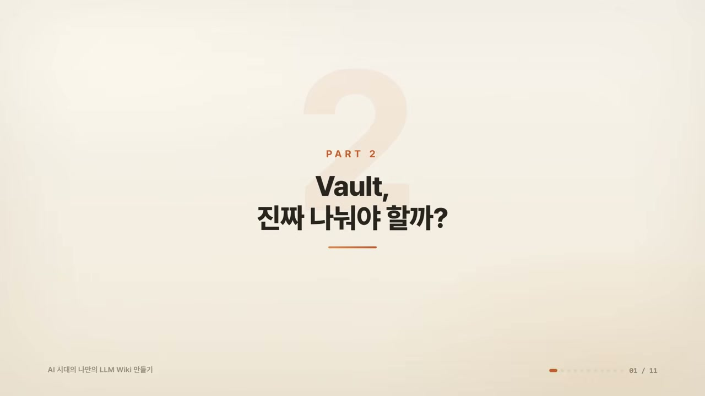
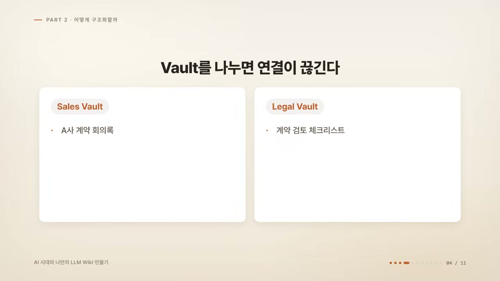
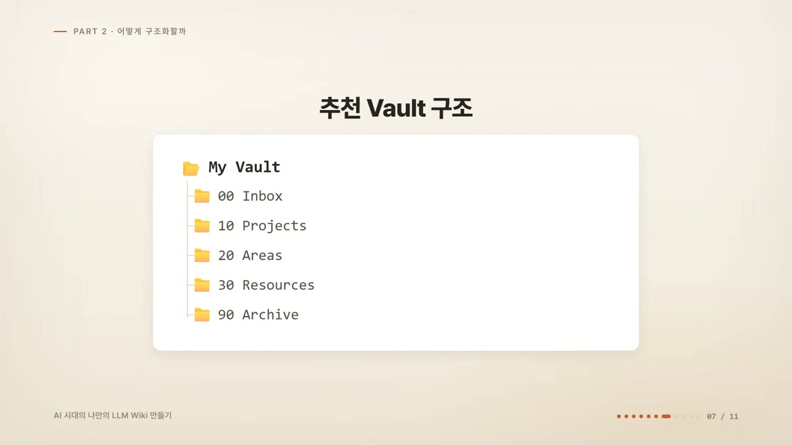
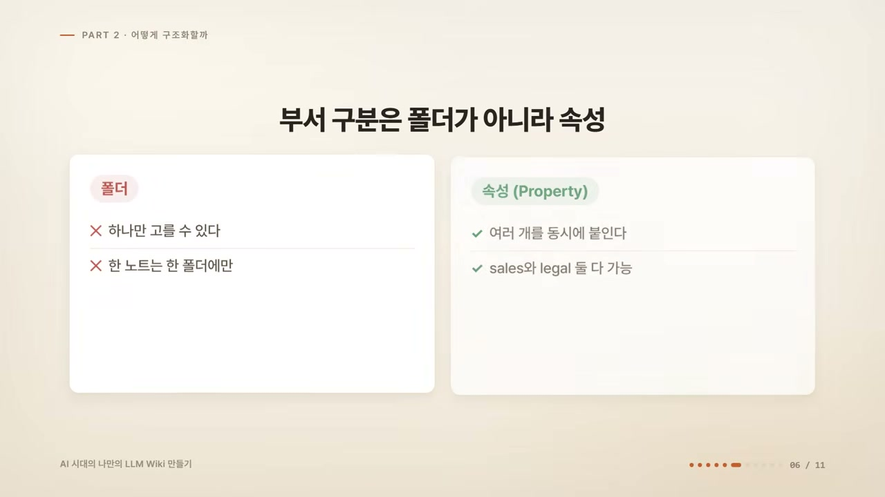
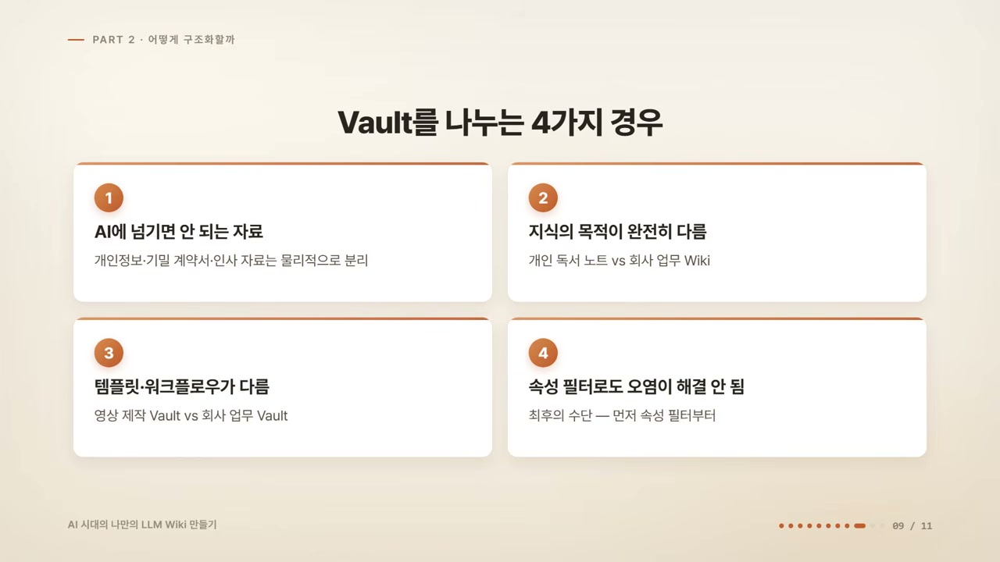
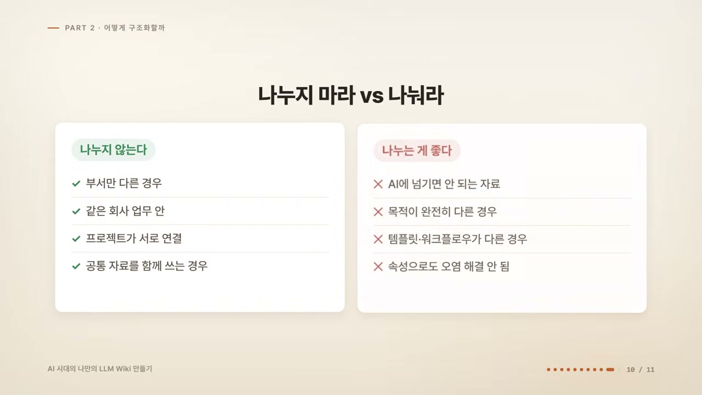
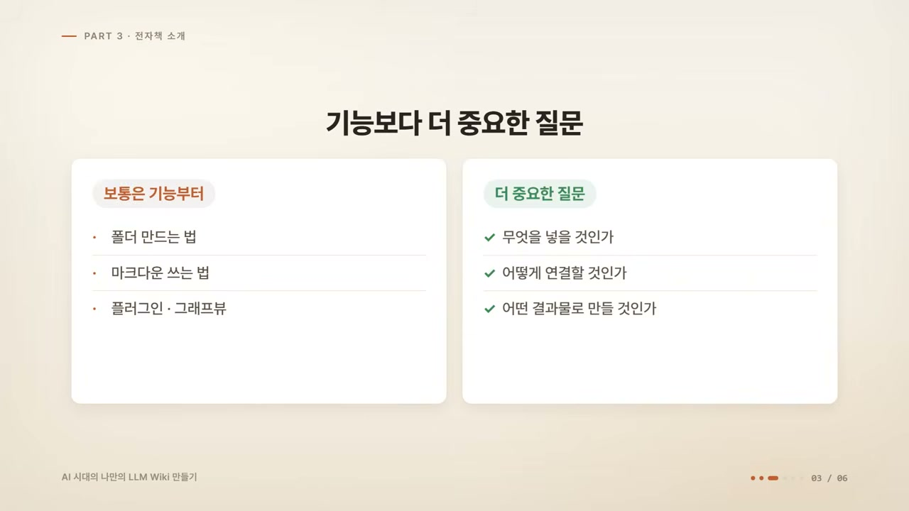

옵시디언으로 LLM 위키를 만들겠다고 마음먹은 사람이 가장 먼저 막히는 곳은 의외로 단순하다. 빈 화면을 띄워놓고 "이 자료도 넣어야 하나, 회의록은 넣어야 하나" 하고 멈춰버린다. 이미 위키를 한 번 만든 사람이라면 다음 고민이 따라온다. 부서별로 볼트(Vault)를 따로 또 만들어야 하나.

영상은 이 두 질문을 정면으로 다룬다. 둘 다 이전 영상 댓글에서 실제로 올라온 질문이라고 한다. 하나는 "어떤 자료를 추가해야 하는지 판단 기준이 궁금하다", 다른 하나는 "이미 만든 위키가 있는데 부서별로 마이 볼트를 따로 만들어야 하느냐"였다. 추상적인 정리 철학이 아니라, 막힌 사람이 던진 구체적인 질문에서 출발한다는 점이 이 영상의 결을 정한다.

상황을 깔아보자. 회사에는 영업자료, 사무자료, 법률문서, 회의록, 보고서, 고객 피드백, 업무 매뉴얼이 굴러다닌다. 이걸 전부 하나의 볼트에 쏟아부으면 나중에 검색이 지저분해질 것 같다. 그렇다고 세일즈 볼트, 어드민 볼트, 리걸 볼트로 부서마다 쪼개면 이번엔 관리가 복잡해질 것 같다. 어느 쪽도 마음이 편하지 않은 이 어정쩡한 자리가 출발점이다.

## 위키는 창고가 아니라 맥락 시스템이다

많은 사람이 처음에 택하는 전략은 하나다. "일단 다 넣어두면 언젠가는 쓰겠지." 그런데 이 방식이 생각보다 위험하다고 화자는 말한다. 이유는 LLM 위키의 정체에 있다.

LLM 위키는 자료를 쌓아두는 창고가 아니다. 나중에 AI가 읽고, 판단하고, 결과물을 만드는 데 쓰는 **맥락 시스템**이다. 자료가 그 자체로 보관되는 게 목적이 아니라, AI가 읽을 입력으로 쓰인다는 뜻이다. 그래서 기준 없이 자료를 밀어 넣으면 위키는 풍성해지는 게 아니라, 나중에 검색해야 할 쓰레기 더미가 된다.

여기서 화자는 본론으로 들어가기 전에 더 흔한 함정 하나를 먼저 짚는다. **위키를 채우려고 자료를 만들지 말라**는 것이다. 댓글 중에는 "자료를 추가하려고 보니, 추가할 자료를 새로 만들어야 하더라"는 고민이 있었다고 한다. 화자는 이걸 순서가 뒤집힌 상태로 본다.

위키는 채우는 게 목표가 아니다. 어차피 발생하는 것들을 흘려보내는 통로다. 회의를 하면 회의록이 생기고, 뭔가 결정하면 결정 이유가 생기고, AI에게 물어 좋은 답을 받으면 그 답이 기록으로 남는다. 이미 일어난 일만 넣어도 위키는 채워진다는 것이다. 반대로 위키에 넣으려고 일부러 글을 쓰기 시작하면, 그 순간부터 부담이 되고 결국 안 하게 된다.

그래서 나온 실용적인 컷오프가 "정리하는 데 5분 이상 걸리면 보류하라"다. 5분 안에 들어가는 자료만으로도 충분하다는 얘기다. 이건 단순한 시간 제한처럼 보이지만, 실은 앞의 원칙을 운영 규칙으로 바꾼 장치다. 5분을 넘긴다는 건 그 자료가 "어차피 발생한 것"이 아니라 "위키를 위해 새로 만드는 것"으로 넘어갔다는 신호이기 때문이다.

## 무엇을 넣을까: 선별 기준 세 가지

발생한 자료 중에서 무엇을 고를지, 화자는 기준을 딱 세 가지로 정리한다.

**첫 번째는 반복해서 다시 쓰는가.** 한 번 보고 끝나는 공지, 단순 알림, 오늘만 필요한 임시 자료는 넣지 않아도 된다. 반대로 회의 때 반복해서 참고하는 자료, 계속 업데이트되는 업무 기준, 자주 물어보는 고객 응대 내용, 보고서 쓸 때마다 다시 꺼내는 자료는 넣을 가치가 있다. 화자의 표현을 빌리면, 이번 주 점심 메뉴는 넣을 필요가 없지만 고객 문의 응대 기준, 계약 검토 체크리스트, 월간 보고서 작성 방식은 넣는 게 좋다.

**두 번째는 의사결정에 영향을 주는가.** LLM 위키의 목적은 단순 저장이 아니라 판단을 돕는 것이다. AI에게 물었을 때 답변의 질을 바꿔주는 자료라고 생각되면 넣을 가치가 있다. 고객 피드백, 가격 정책 변경 내역, 업무 프로세스, 의사결정의 배경 같은 것이 여기에 해당한다. 반대로 인터넷에서 복사한 일반 정보인데 내 업무 맥락과 연결되지 않는 자료라면 굳이 넣을 필요가 없다. 그건 그냥 검색하면 되고, 화자의 말로는 "AI가 더 잘합니다."

**세 번째는 내 업무나 프로젝트와 연결되는가.** 아무리 좋은 자료라도 내 업무와 연결되지 않으면 위키 안에서는 소음이 된다. AI 뉴스 기사 100개를 저장한다고 해보자. 그걸 어떤 영상 기획에, 어떤 서비스 설계에, 어떤 업무 개선에 쓸지 연결해두지 않으면 나중에 다시 찾지 못하게 된다. 그래서 자료를 넣기 전에 스스로 물어야 한다. 이 자료는 어떤 프로젝트와 연결되는가, 어떤 업무를 개선하는 데 쓰이는가, 어떤 질문에 답하기 위해 쓰일까. 답할 수 있으면 통과, 답하기 어려우면 보류다.

세 기준을 관통하는 한 가지가 보인다. 셋 다 "이 자료가 보관할 가치가 있는가"를 묻지 않는다. "이 자료가 나중에 쓰일 자리가 있는가"를 묻는다. 위키를 입력이 아니라 출력 기준으로 본다는 점에서, 앞의 맥락 시스템 정의와 정확히 맞물린다.

판정은 단순하다. 세 기준 중 **2개 이상에 해당하면 넣고, 1개 이하면 보류하거나 버린다.** 완벽한 분류표가 아니라, 망설이는 시간을 줄이려는 거친 다수결에 가깝다.

## 넣기로 했다면: 라벨을 붙여야 한다

여기서 끝이 아니다. 넣기로 정한 자료라도 그냥 넣으면 안 된다고 화자는 못 박는다. 위키에 들어가려면 라벨을 붙여야 한다. 규칙은 두 가지다.

**첫째, 출처와 맥락을 함께 남긴다.** LLM 위키에서 중요한 건 자료 자체보다 자료의 맥락이다. 회의록이라면 대화 내용을 통째로 복사하는 게 아니라, 언제 · 누가 · 무엇을 결정했는지, 왜 그렇게 결정했는지, 다음에 해야 할 일이 무엇인지가 함께 있어야 한다. 이게 없으면 나중에 AI가 읽어도 정확한 답을 하지 못한다. PDF나 기사도 마찬가지다. 출처, 작성일, 핵심 요약, 내 생각, 관련 프로젝트를 같이 남겨둔다.

**둘째, AI가 읽을 수 있는 형태로 정리한다.** 사람 눈에는 괜찮은 자료라도, AI가 읽기에 너무 길거나 구조가 없거나 맥락이 없으면 활용도가 떨어진다. 그래서 자료를 넣을 때는 최소한 한 줄 요약, 핵심 내용 3개, 관련 프로젝트, 관련 부서 정도를 정리한다. 제목에서도 의미가 드러나야 한다. `회의록.txt`가 아니라 `26년 6월 11일 영업전략회의: 신규 고객 응대 프로세스 개선`처럼.

이 두 규칙이 노린 독자는 결국 사람이 아니라 AI다. 출처와 맥락을 남기는 것도, 요약과 부서를 정리하는 것도, 나중에 그 노트를 읽을 AI가 헷갈리지 않게 하기 위한 작업이다. 위키를 "AI가 읽는 입력"으로 본다는 관점이 여기서 가장 또렷하게 드러난다.

### 3분이면 끝나는 노트 하나

말로만 들으면 막연하니 화자는 실제 상황을 가져온다. 방금 고객에게 이런 이메일이 왔다고 하자.

> 견적서 받는 데 3일 걸렸어요. 경쟁사는 당일에 줍니다.

이 메일을 선별 기준 세 가지에 대입한다. 반복해서 다시 쓰는가. 다음 분기 프로세스 개선 회의에서 또 꺼낼 거니까 통과. 의사결정에 영향을 주는가. 견적 프로세스를 바꿀지 판단하는 근거가 되니까 통과. 내 업무와 연결되는가. 진행 중인 신규 고객 응대 개선 프로젝트와 직결되니까 통과. 3개 중 3개가 통과했으니 넣는다.

이제 라벨을 붙인다. 완성된 노트는 이런 모양이 된다.

화자는 여기까지가 3분이면 된다고 말한다. 그리고 이 3분짜리 노트 하나가, 나중에 AI에게 "고객 이탈 원인 분석해줘"라고 물었을 때 답변의 질을 바꿔준다. 선별 기준과 라벨 규칙이 추상적인 권고가 아니라, 한 통의 이메일을 3분 만에 위키 자산으로 바꾸는 실제 절차라는 걸 보여주는 대목이다.

여기까지가 첫 번째 질문에 대한 답이다. 고르는 기준은 세 가지(반복 사용 · 의사결정 영향 · 업무 연결), 2개 이상이면 넣는다. 넣을 때 라벨은 두 가지, 출처와 맥락을 남기고 AI가 읽을 형태로 정리한다.

## 볼트는 어떻게 나눌까: 일단 나누지 마라

이제 두 번째 질문이다. 세일즈, 사무, 법무, 회계 자료가 있을 때 부서마다 볼트를 따로 만들어야 할까. 화자의 답은 처음부터 단호하다. **처음부터 부서별 볼트를 여러 개 만들지 않는 게 좋다.** 이유는 두 가지다.

**첫 번째는 기술적인 문제다.** 옵시디언은 볼트 단위로 작동한다. 링크, 백링크, 그래프뷰, 검색, 옵시디언의 핵심 기능 전부가 볼트 하나 안에서만 작동한다. 볼트를 나누는 순간 부서 간 연결이 끊긴다.

영업팀의 'A사 계약 회의록'과 법무팀의 '계약 검토 체크리스트'는 당연히 연결되어야 하는 자료다. 그런데 세일즈 볼트와 리걸 볼트로 나누면 이 둘은 영원히 서로를 모른다. 링크도 안 되고, 검색에도 같이 안 나오고, AI에게 물어도 한쪽만 읽고 답한다.

부서 자료는 서로 연결될 때 가치가 생기는데, 볼트를 분리하면 그 가치를 원천 차단하는 셈이다.

**두 번째는 분류 자체가 불가능하기 때문이다.** 세일즈 볼트, 어드민 볼트, 파이낸스 볼트를 따로 만들었다고 하자. 처음에는 깔끔해 보인다. 그런데 곧 이런 자료가 나타난다. 고객 피드백은 세일즈인가 프로덕트인가. 계약 관련 회의록은 어드민인가 리걸인가. 프로젝트 예산 문서는 파이낸스인가 프로젝트인가. 현실의 업무 자료는 대부분 부서 두세 개에 걸쳐 있다. 그래서 부서를 쪼개는 순간 어디에 넣을지 매번 고민하게 되고, 결국 다시 헷갈린다.

## 폴더로 부서를 나누는 것도 같은 실수다

여기서 흔히 하는 우회가 있다. 볼트 대신 폴더로 부서를 나누는 것이다. `Department` 폴더를 만들고 그 안에 세일즈, 리걸, 파이낸스를 둔다. 그런데 방금 본 문제가 그대로 반복된다. 계약 회의록은 세일즈 폴더인가 리걸 폴더인가. 볼트에서 생긴 문제가 폴더에서 똑같이 생기는 것이다. 이유는 간단하다. **한 노트는 폴더 하나에만 들어갈 수 있기 때문이다.**

그래서 화자가 세운 원칙은 이렇다. 폴더는 한 가지 축으로만 나눈다. 화자가 추천하는 축은 "무엇을 위한 자료인가", 즉 프로젝트와 영역(Area) 축이다. 그가 보여주는 추천 볼트 구조도 이 한 축을 따른다.

부서는 폴더가 아니라 **속성(property)으로 표시한다.** 노트 상단에 타입, 디파트먼트, 프로젝트, 스테이터스, 소스, 만든 날짜 같은 속성을 붙이는 것이다. 차이는 결정적이다. 폴더는 하나만 고를 수 있지만, 속성은 여러 개를 동시에 붙일 수 있다.

계약 회의록에 디파트먼트를 세일즈와 리걸 둘 다 붙이면, 아까 그 고민이 사라진다. "이건 어디에 넣지?"라는 질문 자체가 성립하지 않게 되는 것이다. 그리고 AI가 읽을 때도 훨씬 잘 이해한다. "이건 업무와 법무에 걸친 자료구나, 이건 회의록이구나, 이건 지금 진행 중인 프로젝트구나" 하고 말이다.

부서별로 모아 보고 싶으면 속성으로 검색하거나, '세일즈 인덱스' 같은 노트 하나에 영업 관련 노트들을 링크로 모으면 된다. 폴더 없이도 부서별 분류는 얼마든지 만들 수 있다. 화자의 정리가 깔끔하다. **부서 폴더를 만들고 싶은 충동이 들 때가, 바로 속성을 써야 할 때다.**

여기서 폴더와 속성의 관계가 명확해진다. 폴더는 한 노트의 단 하나뿐인 물리적 위치라서 "걸쳐 있는 것"을 담지 못한다. 속성은 여러 개를 겹칠 수 있어서 현실의 자료가 가진 다중 소속을 그대로 담는다. 부서가 폴더에 안 맞는 건 분류를 잘못해서가 아니라, 애초에 폴더라는 그릇이 한 칸짜리이기 때문이다.

## 그렇다면 볼트는 언제 나누나

볼트를 나누지 말라고 했지만, 화자는 절대 나누지 말라고 하진 않는다. 분리를 추천하는 경우를 딱 네 가지로 못 박는다.

**첫 번째는 AI에게 넘기면 안 되는 자료가 있을 때다.** 이게 LLM 위키에서 가장 중요한 분류 기준이라고 화자는 강조한다. LLM 위키에서 볼트는 단순한 폴더 묶음이 아니라, AI에게 전달하는 컨텍스트의 범위이기 때문이다. 그래서 진짜 질문은 "부서가 다른가"가 아니라 "이걸 AI에게 넘겨도 되는가"다. 고객 개인정보, 기밀 계약서, 인사 자료처럼 외부로 나가면 안 되는 자료는 업무 볼트와 물리적으로 분리해야 한다. 이건 정리의 문제가 아니라 보안의 문제라서, 속성으로는 해결되지 않는다.

이 한 가지가 앞의 모든 원칙을 뒤집는 자리라는 점이 흥미롭다. 속성으로 다 해결된다던 이야기가, 보안 앞에서는 통하지 않는다. 속성은 같은 볼트 안의 노트를 걸러줄 뿐, AI에게 전달되는 물리적 범위 자체를 끊어주진 못하기 때문이다.

**두 번째는 지식의 목적이 완전히 다를 때다.** 개인 독서 노트와 회사 업무 위키는 목적이 다르다. 하나는 자기 이해와 학습이고, 다른 하나는 업무 처리와 결과물 생성이다. 이런 경우는 나누는 게 좋다.

**세 번째는 템플릿과 워크플로우가 완전히 다를 때다.** 영상 제작 볼트는 원고, 썸네일, 촬영, 편집, 업로드 중심이고, 회사 업무 볼트는 회의록, 보고서, 고객 대응, 프로세스 중심이다. 매일 쓰는 템플릿과 흐름이 다르면 한데 두는 게 불리할 수 있다.

**네 번째는 검색 결과가 계속 오염될 때다.** 이건 화자가 "최후의 수단"이라고 부른다. AI에게 업무 질문을 했는데 자꾸 개인 독서 노트가 섞여 나오는 경우가 있을 수 있다. 이럴 때 먼저 할 일은 볼트를 가르는 게 아니라 속성으로 필터링해보는 것이다. "department가 sales인 노트만 참고해서 답해줘" 하는 식으로 범위를 좁히면 대부분 해결된다. 속성을 다 써봤는데도 오염이 계속되면, 그때 분리한다.

네 가지를 늘어놓고 보면 공통점이 드러난다. 부서가 많다는 이유는 어디에도 없다. 보안, 목적, 워크플로우, 그리고 끝내 안 되는 오염. 볼트를 나누는 진짜 이유는 "분류"가 아니라 "AI에게 넘기는 범위"를 갈라야 할 때라는 것이다. 그래서 결론은 한 줄로 압축된다. 처음에는 하나의 볼트로 시작하고, 폴더는 프로젝트 축으로만 나누고, 부서는 속성으로 표시하라. 그리고 보안 · 목적 · 워크플로우가 정말 달라질 때만 볼트를 분리하라.

## 기능이 아니라 질문이 먼저다

영상 후반부는 화자가 만들고 있는 전자책 'AI 시대의 나만의 LLM 위키 만들기' 소개로 넘어간다. 홍보지만, 그 안에 이 영상 전체를 관통하는 관점이 한 번 더 정리되어 있어 짚을 만하다.

화자의 진단은 이렇다. 옵시디언을 처음 시작하는 사람들은 폴더 만드는 법, 마크다운 쓰는 법, 플러그인 설치하는 법, 그래프뷰 보는 법 같은 **기능**부터 배운다. 물론 그것도 필요하다. 하지만 더 중요한 건 무엇을 넣고, 어떻게 연결하고, 어떤 결과물을 만들 것인가다.

핵심은 옵시디언을 단순한 메모 앱이 아니라, LLM이 읽고 활용할 수 있는 개인 지식 시스템으로 만드는 것이다. 화자가 전자책의 핵심으로 내건 이 한 문장은, 사실 영상이 처음부터 깔고 있던 전제이기도 하다.

화자가 강조하는 마지막 한 가지는 결과물이다. LLM 위키는 예쁜 노트를 만들기 위한 시스템이 아니다. 최종적으로는 보고서, 제안서, 회의 요약, 업무 체크리스트, 영상 원고, 리서치 정리 같은 결과물로 나와야 한다. 그래서 흐름은 자료 수집에서 끝나지 않는다. 자료 저장 → 요약 → 맥락 연결 → AI에게 질문 → 결과물 생성으로 이어진다.

돌아보면, 이 영상이 던진 두 질문(무엇을 넣을까, 볼트를 어떻게 나눌까)은 서로 다른 문제처럼 보였지만 답은 한 곳을 가리킨다. 중요한 건 자료를 많이 모으는 게 아니다. AI가 읽을 수 있게 정리하고, 내 업무 맥락과 연결하고, 다시 결과물로 꺼낼 수 있게 만드는 것이다. 자료를 넣는 기준도, 볼트를 나누는 기준도, 전부 이 마지막 출력에서 거꾸로 내려온 규칙들이었던 셈이다.
