자율형 에이전트라는 말이 요즘 부쩍 자주 들린다. 발표자는 그중 세 가지를 한데 묶어 이야기를 연다. 헤르메스 에이전트, 오픈클로, 제미나이 스파크. 이 셋은 "거의 동족들"이라는 게 그의 표현이다. 하는 일은 비슷한데 사는 환경이 조금씩 다른 친척 관계라는 것이다.

이 셋을 묶는 공통점부터 짚어두면 글의 나머지가 쉽게 풀린다. 발표자는 이들을 "에이전트 직원"이라 부르고, 이 직원들의 두뇌는 "다 바꿔서 낄 수가 있다"고 말한다. 두뇌를 바꿔 낀다는 건 LLM 모델을 갈아 끼운다는 뜻이다. 코덱스를 쓰든 클로드를 쓰든 제미나이를 쓰든, 원하는 모델을 API로 연동해 붙일 수 있다. 그래서 클로드가 업데이트되면 클로드가 최고다 싶다가, 지피티 5.5가 나오니 코덱스도 꽤 괜찮네 하며 갈아타는 식으로, 그때그때 더 나은 모델을 골라 끼우면 된다. 에이전트라는 몸체는 그대로 두고 머리만 교체하는 구조인 셈이다.

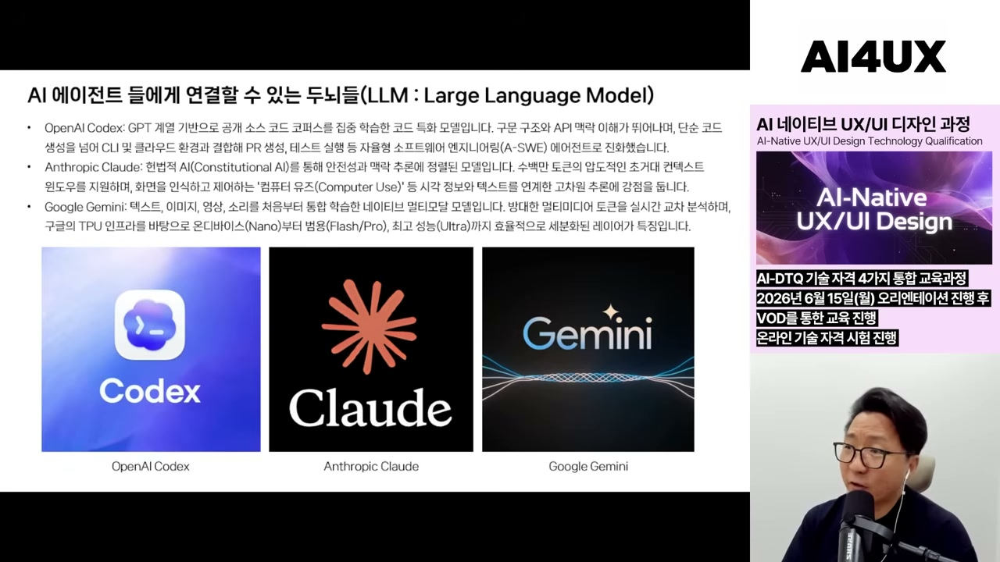

다만 한 가지 예외가 있다. 발표자는 제미나이 스파크만은 "무조건 제미나이만 쓸 수 있겠죠"라고 본다. 구글이 만든 자기 모델이니, 다른 모델을 API로 붙이게 열어줄지는 모르겠다는 단서를 단다.

## 로컬과 클라우드, 같은 종족의 두 갈래

세 동족을 가르는 결정적 차이는 어디서 도느냐다. 발표자는 이를 로컬과 클라우드의 차이라고 정리한다. 오픈클로와 헤르메스 에이전트는 내 PC, 곧 로컬에서 움직인다. 반면 제미나이 스파크는 구글이 이미 완성해둔 클라우드 플랫폼 위에서 도는 에이전트다.

오픈클로는 피터 슈타인버거가 2025년 말에 만들었다. 깃허브에서 엄청나게 핫하게 떠올랐고, 지금은 오픈AI에 스카웃됐다는 게 발표자의 설명이다. 거액이라는데 얼마인지는 공개도 안 됐고, 혼자 스타트업을 차렸으면 몇천억 원은 받았을 거다, 조 단위까진 아니어도 그런 얘기가 돈다고 그는 전한다. 오픈클로 역시 오픈AI에서 곧 정식 출시되지 않겠냐는 게 그의 짐작이다.

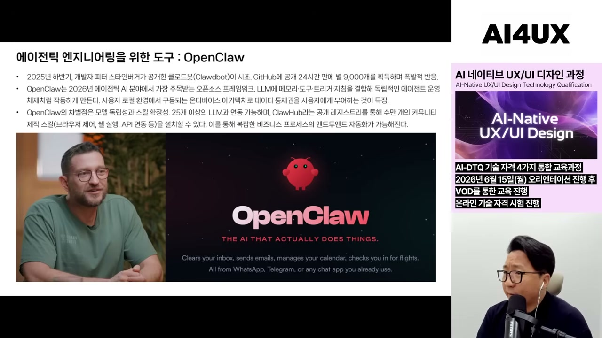

제미나이 스파크는 구글 I/O 2026에서 공개됐다. 발표자는 이것이 출시되면 "파장이 어마어마할 거다"라고 거듭 강조한다. 이유는 단순하다. 채팅창에 업무를 시키면 구글 드라이브, 구글 시트, 지메일, 구글 독스, 이미지 생성까지 구글 플랫폼 전체와 곧바로 연동되기 때문이다. 파일을 만들라고 하면 시트에 알아서 정리하고, 이메일 관리도 지메일이 붙어 있으니 통째로 맡길 수 있다. 음성으로 대화하며 일을 시킬 수도 있고, 여러 작업을 누적해 시킬 수도 있다.

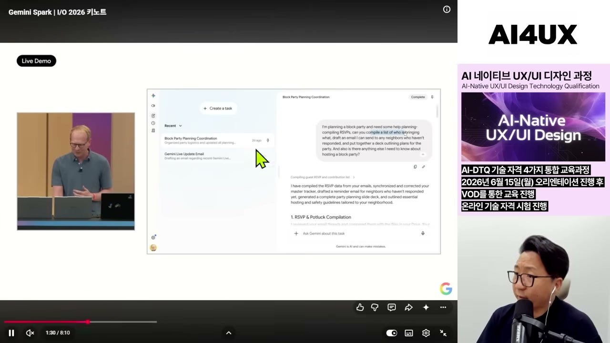

여기서 발표자가 짚는 진짜 장점은 따로 있다. 로컬 에이전트는 돌릴 PC가 따로 있어야 한다. 하지만 제미나이 스파크는 "PC를 추가로 물리적으로 구매하지 않고서도" 클라우드에서 바로 쓸 수 있다. 보안 문제는 있을 수 있지만 구글 정도의 보안을 유지한 채라면, 누구나 손쉽게 여러 에이전트를 활용할 환경이 열린다는 것이다. 다만 한국에는 아직 출시되지 않았다. 미국에서 제미나이 울트라 사용자에 한해 일부만 써볼 수 있고, 한국은 빠르면 1개월에서 3, 4개월 사이로 본다. 발표자 본인도 나오면 바로 써보려고 준비 중이라고 덧붙인다.

## 헤르메스 에이전트, 스스로 자라는 직원

아직 손에 못 쥐는 제미나이 스파크 대신, 발표자가 오늘 실제로 다루는 건 헤르메스 에이전트다. 핵심 메시지는 분명하다. 제미나이 스파크가 할 일들은 지금 당장 헤르메스 에이전트나 오픈클로로도 거의 다 해볼 수 있다는 것이다.

헤르메스 에이전트는 누스 리서치에서 2026년 2월에 출시됐다. 오픈클로가 2025년 말에 나왔고 그 뒤에 등장했는데, 깃허브에서 오픈클로보다도 더 많이 다운로드될 만큼 인기를 끌었다. 도대체 뭐가 좋길래 이렇게 많이 쓰냐는 물음에 발표자가 내놓는 답은 하나로 모인다. **자기 진화형 에이전트에 특화돼 있다는 점**이다.

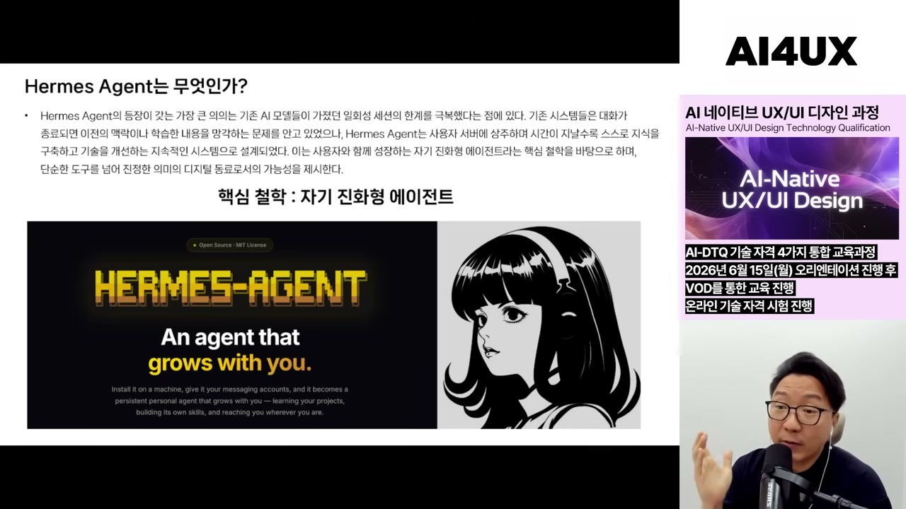

이게 왜 특별한지는 과거 방식과 견줘 보면 또렷해진다. 예전 챗봇이나 에이전트는 세션이 끝나면 결과 데이터만 남고 끝났다. 업무 과정의 히스토리가 잘 남지 않으니, 에이전트가 성장하기보다는 내가 매번 시스템을 다시 만들어가는 모양새였다. 헤르메스 에이전트는 다르다. 업무를 처리하다 중간에 실수가 나 수정 요청을 받거나 여러 작업을 거치는 동안, 스스로 메모리 마크다운에 계속 기록을 남긴다. 히스토리와 이슈들이 쌓이면서 그 축적이 곧 성장이 되는 구조다. 문제 해결도 점점 스스로 하게 되고, 기록이 쌓일수록 지속적으로 자란다. 장기적으로 갈수록 이런 자율적 성장이 빛을 발한다는 게 발표자의 진단이다.

오픈클로와의 차이는 결국 선택의 문제로 정리된다. 작동 방식 자체는 거의 비슷해서 처음 써볼 땐 차이를 크게 못 느낀다. 다만 하나의 독립적인 에이전트를 안정적으로, 장기적으로 잘 키우고 싶다면 헤르메스 에이전트, 여러 에이전트를 다수로 구축해 아주 많은 일을 처리하고 싶다면 오픈클로를 발표자는 권한다.

비용 이야기에서 헤르메스 에이전트의 또 다른 매력이 드러난다. 오픈AI 챗GPT를 구독하고 있다면, 그 코덱스 모델을 구독 모델 그대로 연동해 쓸 수 있다. 반면 오픈클로는 전부 API로 연동해야 한다. API 연동은 과금이라는 뜻이고, 직원에게 무슨 일을 시킬 때마다 돈이 나간다. 발표자는 이 지점에서 솔직하다. 자원이 무한정 있는 상태가 아니다 보니 "쓰면서 약간 스트레스 좀 받을 때 있어요"라고 털어놓는다. 얼마를 쓰는지 중간중간 확인해줘야 하는 부담이 있는 것이다. 구독 모델을 그대로 끌어다 쓸 수 있다는 건 그 스트레스를 던다는 의미다.

설치는 어렵지 않다고 발표자는 강조한다. 구글에 검색하면 사이트가 뜨고, 거기 인스톨 명령 두 개만 넣으면 다 설치된다. 터미널을 열어 명령어 하나를 넣어 쭉 설치하고, 그다음 헤르메스 셋업을 넣으면 끝이다. 셋업에서 정할 건 두 가지다. 어떤 LLM을 두뇌로 연결할지, 그리고 어떤 채널로 대화할지. 채널은 텔레그램, 슬랙, 디스코드 같은 데 연동한다. 발표자 자신은 텔레그램에 붙여뒀다.

이렇게 세팅을 마치면 "직원을 한 명 세팅해서 쓰는 구조"가 된다. 발표자는 이 비유를 글 전체의 척추로 삼는다. 과거엔 사람 직원을 채용했다면, 이제는 에이전트 직원을 채용해 PC에 세팅해둔다. UX/UI를 전문으로 하는 사람이라면 이 직원을 UX 리서처로, UX 디자이너로, UI 디자이너로, 바이브 코딩까지 쉬워졌으니 UI 개발자로까지 고용해 일을 시킬 수 있다.

## 깡통 머리에 무엇을 채울 것인가

그런데 여기서 발표자는 결정적인 한계를 던진다. 직원을 세팅해 놓아도 "어디다 써먹을 데가 없어요." 이유는 한 문장이다. "머리는 깡통이에요. 비어있기 때문에." 인수인계가 안 된 신입처럼, 머릿속이 텅 빈 직원은 일을 시킬 수가 없다.

그래서 등장하는 게 LLM 위키다. 발표자는 이 개념의 뿌리부터 짚는다. 먼저 세컨드 브레인이다. 생산성 전문가 티아고 포르테가 제시한 개념으로, 인간의 뇌가 기억하는 데 너무 많이 쓰여 정작 아이디어를 내고 생산적인 일을 할 여력이 없다는 문제의식에서 출발한다. 기억은 바깥 어딘가에 맡기고, 뇌 자체는 창의적인 일에만 쓰자는 것이다.

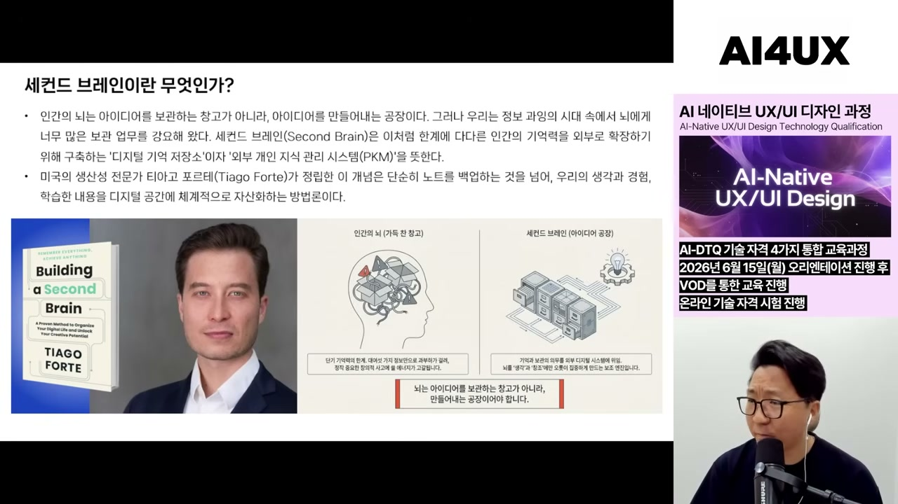

AI 시대에 이 세컨드 브레인이 더 절실해진 이유를 발표자는 이렇게 푼다. AI에게 일을 시키면 엄청난 양의 산출물이 쏟아진다. 발표자가 인용하는 수치 하나가 인상적이다. 지난 3년 사이 AI가 뽑아낸 산출물이, 그동안 인류가 축적해온 모든 데이터보다 더 많다는 것이다. 문제는 양이 아니라 질이다. AI에게 글을 쓰라고 하면 한 페이지든 백 페이지든 써주지만, 정작 괜찮은 걸 써야 한다. AI는 80점, 70점짜리 답은 그냥 계속 만들어내고, 맥락에서 벗어난 얘기도 섞는다. 여기서 발표자의 핵심 주장이 나온다. **나만의 고유한 철학과 정교한 데이터를 정확히 전달해주면, 똑같은 AI를 쓰더라도 결과의 퀄리티가 완전히 달라진다.** 남이 80점 낼 때 나는 90점, 95점, 99점까지 갈 수 있다는 것이다.

이걸 AI 시대에 맞게 체계화한 개념이 안드레이 카파시가 정의한 LLM 위키라고 발표자는 소개한다. 셋으로 나눠 보면 이렇다. 위키는 필요한 데이터를 저장해둔 곳, LLM은 거기서 일을 시키는 언어 모델, 그리고 IDE는 우리가 손으로 다루는 인터페이스다. 이 IDE 자리에 옵시디언을 쓴다. 오늘 구성에서 LLM 위키의 두뇌 역할은 헤르메스 에이전트가 맡고, 그 안에서 실제로 일하는 모델로는 코덱스가 들어간다.

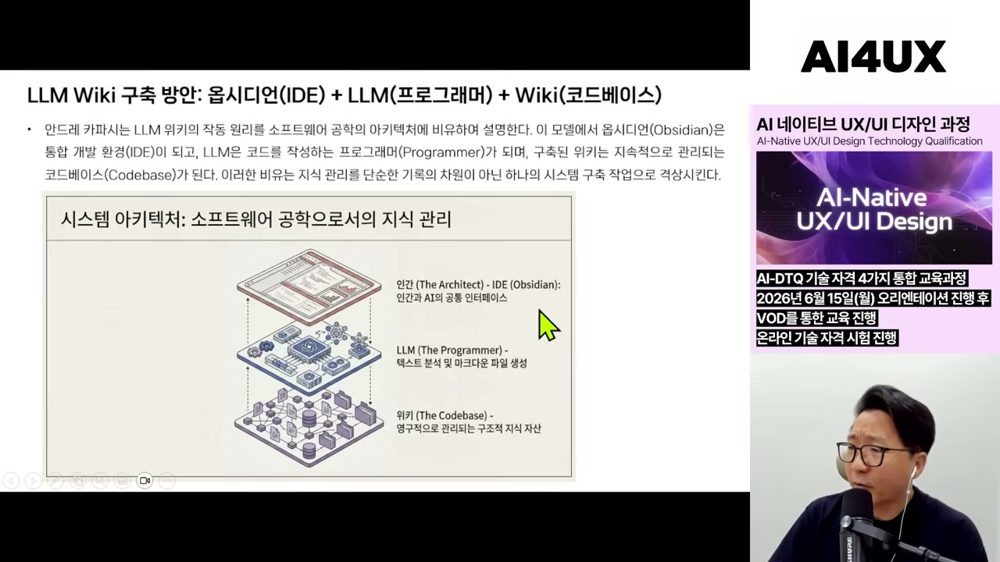

왜 하필 마크다운인가. 발표자는 자료를 찾아봤다며 토큰 효율을 든다. HTML과 비교하면 토큰 소모량이 65%에서 90%까지 줄어든다는 것이다. 마크다운은 딱 필요한 데이터만 정리돼 있어 밀도가 높은 반면, HTML은 웹 태그나 CSS 클래스가 잔뜩 붙어 무겁다. 읽고 쓸 때 모델이 힘들 수밖에 없다. 같은 직원을 쓰더라도 비용은 적게, 시간은 빠르게. 발표자는 이를 사장님의 관점이라 부른다. 두 직원에게 똑같이 시켰는데 한 명이 더 잘하면서 비용도 적고 빠르다면, 당연히 그 직원을 쓸 수밖에 없다. 그 더 나은 직원을 만드는 환경이 마크다운이고, 마크다운을 잘 만들게 돕는 도구가 옵시디언이라는 것이다.

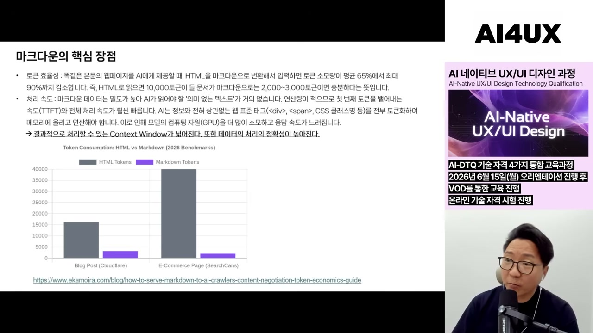

옵시디언이 단순한 메모장과 갈리는 지점은 연결 구조다. 폴더 중심이 아니라 연결 중심, 곧 노드 구조로 데이터가 엮인다. 발표자는 이 노드 연결이 왜 중요한지를 RAG의 한계와 대비해 설명한다. 기존 RAG는 데이터 양이 너무 많으면 문맥이 끊긴다. 그런데 LLM은 어텐션 모델이라 무언가에 주목해 연관성을 본다. 데이터를 미리 다 연관시켜 두면, 주제 하나가 던져졌을 때 그 주제에 연결된 노드 자료들만 골라 본다. 그러니 일하기가 빠르고 효과적이다. 발표자의 표현을 빌리면, 일하기 좋은 환경을 차려놓으면 LLM이 "슉슉슉 날아다닐 수 있다"는 것이다.

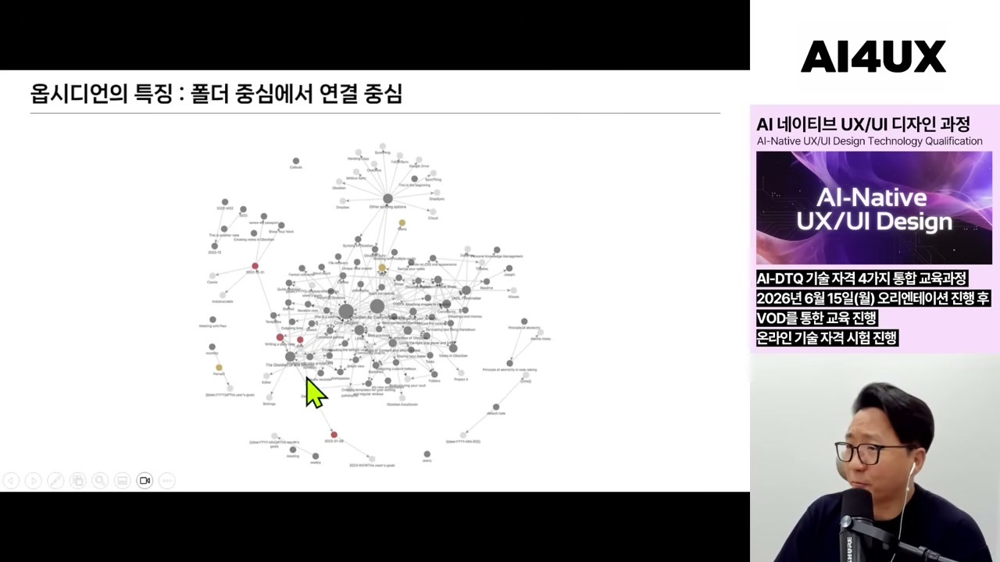

## 지식을 스킬로 굳히다

여기까지가 데이터를 쌓는 이야기라면, 다음은 일하는 방법 자체를 자산으로 만드는 단계다. 발표자는 자신이 그동안 UX/UI를 해오며 쌓은 방법들, 사용성 평가는 어떻게 하는지, 옵저베이션은, UT 계획은, 시나리오 디자인은 어떻게 하는지를 전부 문서로 만들어 에이전트가 잘 일하게 만든다고 말한다. 어피니티 맵은 어떻게 만들고, 페르소나와 인사이트 리포트는 어떻게 작업하며, 인터뷰 데이터가 있으면 분석은 어떤 식으로 하는지를 죄다 스킬로 굳히는 것이다.

흥미로운 건 UX 심리학까지 스킬로 만든다는 대목이다. 발표자는 예전엔 심리학 이론을 공부만 하고 잘 적용하지 못했는데, 스킬로 만들어두니 그 이론이 실제 UX에 잘 반영됐는지까지 에이전트를 통해 평가할 수 있더라고 털어놓는다. 이렇게 UX 지식을 스킬화해 쌓아가면, 그 스킬들이 많아질수록 에이전트가 점점 UX 전문가가 된다. 헤르메스든 오픈클로든 제미나이 스파크든, 잘 정리된 전문성을 얹는 순간 UX/UI에 특화된 에이전트가 된다는 것이다.

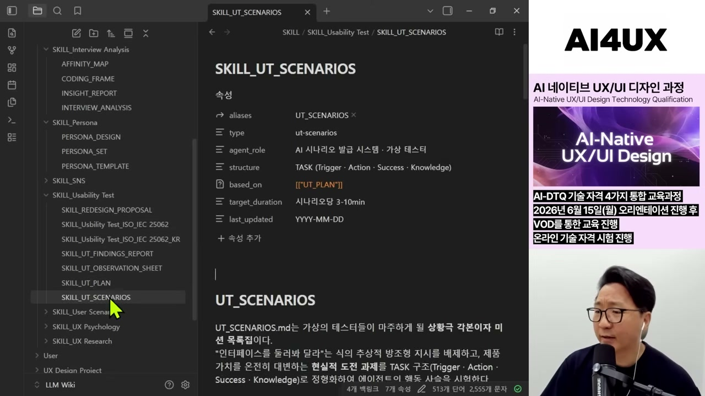

발표자가 실제로 돌리는 환경을 보여주는 장면에는 작은 사연이 끼어 있다. 헤르메스 에이전트는 원격 데스크탑으로 로컬 PC에 세팅돼 있는데, 그 PC가 아내가 쓰다 디스플레이가 깨진 맥북이다. 수리비를 알아보니 90만 원, 중고는 60만 원이라 아내에게 중고를 한 대 사주고, 집에 놔뒀던 깨진 맥북을 에이전트 전용으로 돌려 쓰고 있다는 것이다. 화면은 안 보이지만 원격으로 연결해두니 잘 돌아간다. 한 번 설치하면 사실 들여다볼 일이 거의 없다는 말도 덧붙인다. 평소 조작은 텔레그램으로 한다.

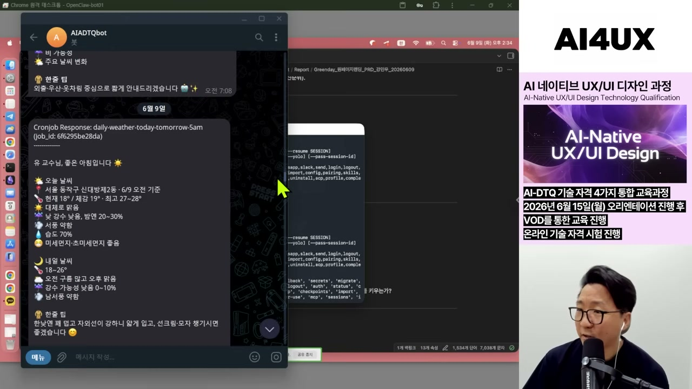

이 텔레그램 직원에게 발표자는 매일 일을 시킨다. 아침에 일어나면 그날의 중요한 날씨 정보를 보내두라 해놨고, AI와 AX 관련 뉴스, 오픈AI·피그마·구글 같은 UX/UI 관련 회사 소식을 정리시킨다. 다만 그냥 뉴스 검색하라고만 하면 디테일이 떨어져서, 관심 주제를 따로 잡아 조사를 시키고 본인이 직접 보기도 한다고 한계를 솔직히 인정한다.

## 카페 한 곳, UX 전 과정을 직원에게 맡기다

발표자는 스킬 폴더를 에이전트에 심어준 뒤 그 안을 읽어보라고 시킨다. 에이전트는 헤르메스 LLM 위키 안 스킬 폴더에 35개 파일이 있고, 리서치 파일이 13개이며, 유저빌리티·인터뷰 분석·페르소나·시나리오 같은 기술들이 있다고 스스로 파악해 보고한다. 주제별로 무엇이 인터뷰 분석인지, 페르소나 설계인지, 사용자 시나리오 설계인지를 제대로 이해하고 있다는 걸 확인할 수 있는 장면이다.

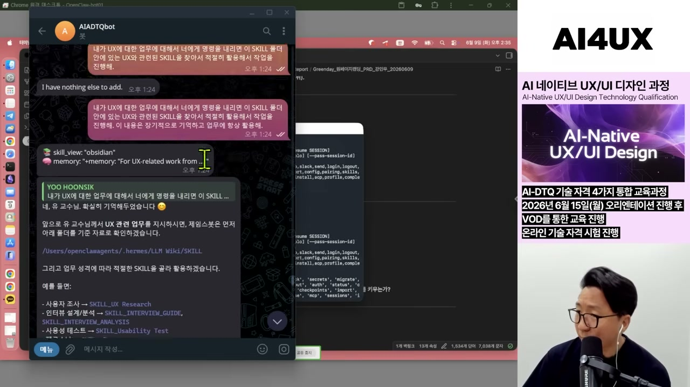

이제 가상의 프로젝트가 시작된다. 카페 웹사이트 UX/UI 디자인. 발표자는 첫 단계로 정성적 인터뷰를 잡는다. 그러면서 AI 시대에도 정성 인터뷰는 상당히 중요하다고 못 박는다. 사용자에 대한 데이터는 결국 직접 만나야 얻을 수 있고, 바로 이 지점이 AI 에이전트가 대신하기 어려운 부분이라는 것이다.

그가 채팅창에 던지는 건 딱 한 줄이다. "카페에 UX, UI 디자인 프로젝트가 들어왔는데 카페 이용자에 대한 정성적 인터뷰를 진행할 거야. 인터뷰 가이드 참고해서 인터뷰 계획을 가능한 상세히 적고 MD 파일로 저장해라." 한 줄이지만 빈약하지 않다. 이미 스킬 안의 기술들을 써서 작성하라고 세팅을 다 해뒀기 때문이다. 에이전트는 인터뷰 기획 스킬을 참고해 정성적 인터뷰 계획서를 만들어 마크다운으로 저장한다.

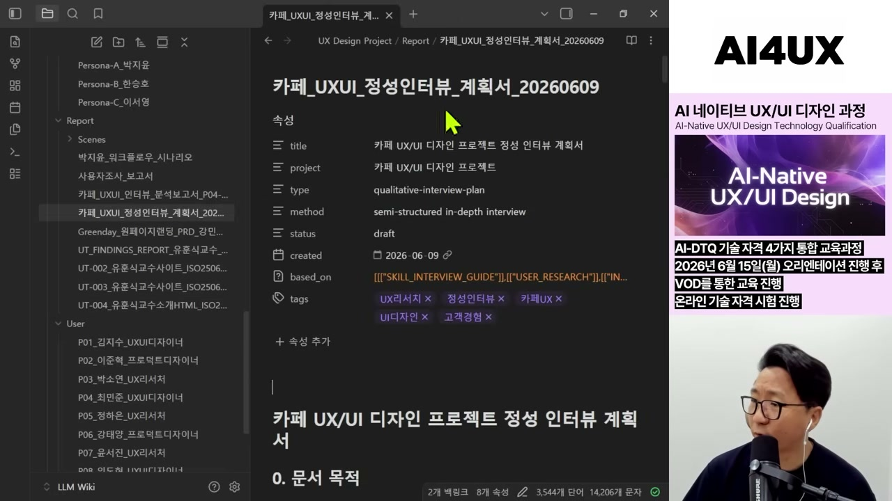

발표자는 이 결과가 챗GPT로도 비슷하게 나올 수 있다는 걸 인정한다. 다만 결정적 차이가 있다. 자기가 미리 만들어둔 스킬 덕에, 자기가 원하는 형태의 질문과 방식으로 디테일한 작업이 나온다는 점이다. 그래서 작업을 시킨 뒤에도 수정할 부분이 상당히 적다. 운영 원칙부터 만났을 때 어떤 대화를 어떤 식으로 진행할지까지 아주 상세하게 작성된다. 물론 사람이 직접 손볼 부분이 아예 없진 않다고 그는 덧붙인다.

다음은 인터뷰 데이터를 넣는 단계다. 정성 인터뷰는 직접 만나야 하니, 실제 사용자 데이터는 사람이 옵시디언에 마크다운으로 넣어준다. 카페 이용자 5명의 인터뷰가 그렇게 폴더에 들어간다. 그다음 "폴더 안 4에서 8번 데이터를 인터뷰 분석 가이드 활용해서 상세한 분석 자료를 만들어 저장해라" 한마디면, 에이전트가 분석 보고서를 작성한다.

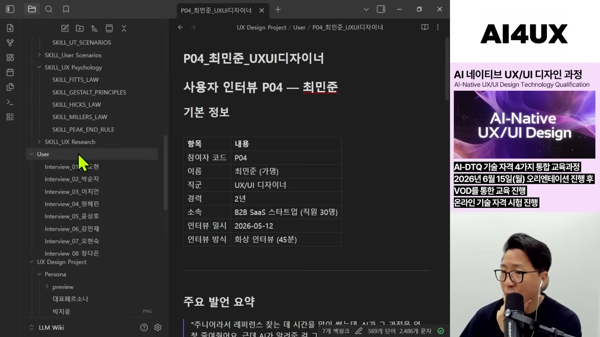

분석 보고서는 발표자가 제시한 5단계 프레임워크를 따른다. 어떤 사용자를 조사했고 연구자별로 무엇을 물었는지 정리한 뒤, 그 내용을 코드화한다. 주요 인용을 코딩화해 정량적으로도 볼 수 있게 분석하고, 이를 어피니티 맵 형태로 정리해 제시한다. 발표자는 "UX 리서치를 공부하신 분들은 아마 좀 이해를 하실 거예요"라며 굳이 길게 풀지 않는다.

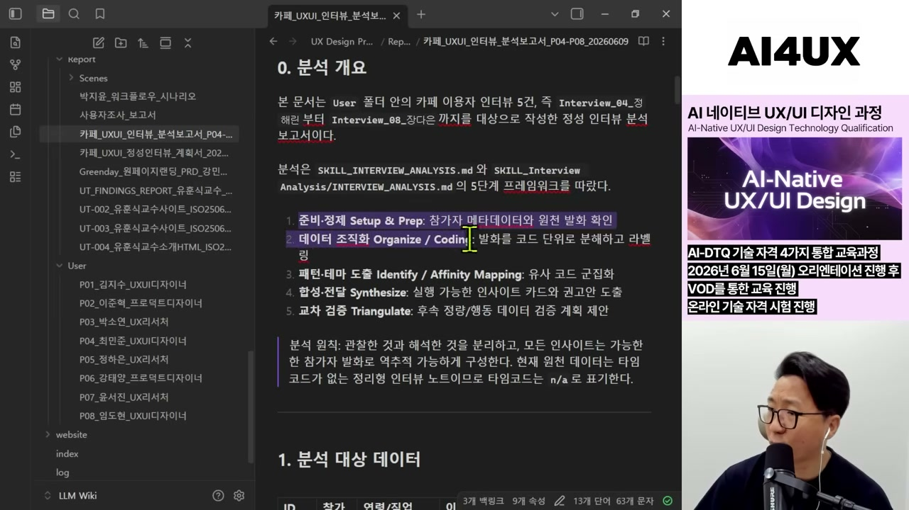

분석 데이터가 나왔으니 다음은 페르소나다. 5명의 인터뷰와 분석 데이터를 활용해 페르소나를 만들어 마크다운으로 저장하라고 또 한 번 요청한다. 사용자별 특성을 분석해, 페르소나마다 목표와 동기, 행동 패턴, 페인 포인트, 니즈를 정리하고, 그것이 UX 설계에 어떻게 반영돼야 하는지까지 묶어낸다.

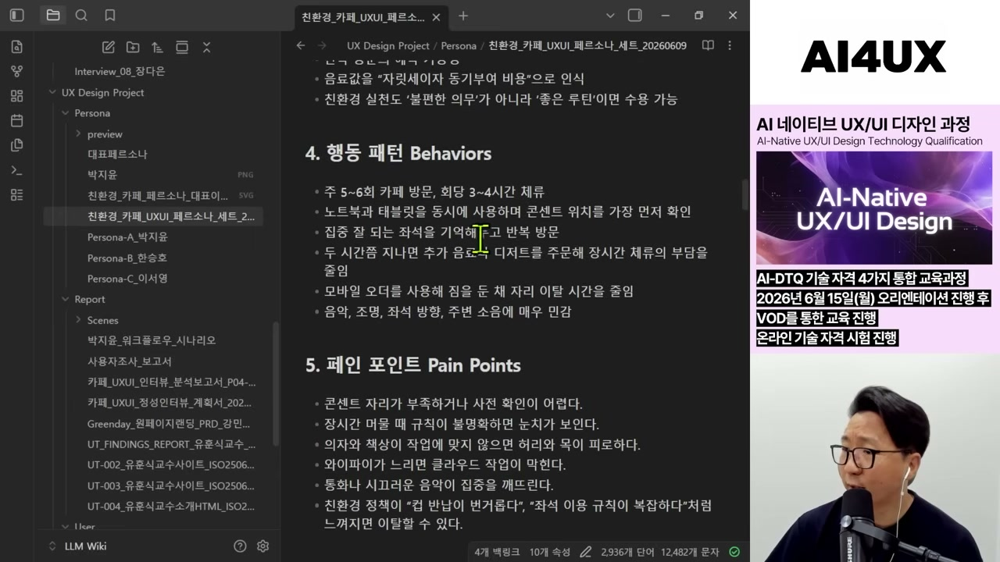

페르소나와 사용자 문서가 갖춰지면 PRD 문서로 넘어간다. "원페이지로 카페 웹사이트 디자인 할 건데 어떻게 작업해야 돼?"라고 물으면, 강민우라는 페르소나 한 명을 선택해 작업한다. PRD에는 해결할 문제, 목표, 사용자, 성공 지표, 타겟이 담기고, 페이지가 헤더부터 히어로 섹션을 거쳐 푸터까지 어떤 스크롤 순서로 구성되는지, 섹션별 상세 요구사항과 콘텐츠, 기능 요구사항, 디자인 방향까지 정리된다.

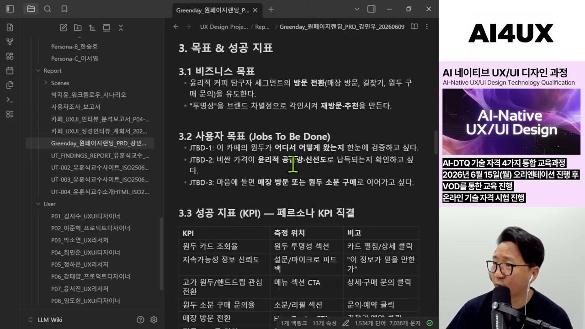

그리고 이 PRD를 근거로 웹사이트를 디자인하라고 시키면, 한 페이지짜리 HTML 웹사이트가 만들어진다. 발표자는 색상 같은 일부는 미리 정해뒀고 아직 수정 전이라는 단서를 달면서도, 사용자 조사 내용을 반영해 디자인한 결과를 바로 받을 수 있다고 말한다. 요즘 바이브 코딩으로 이 정도는 충분히들 하니 어렵지 않을 거라는 것이다.

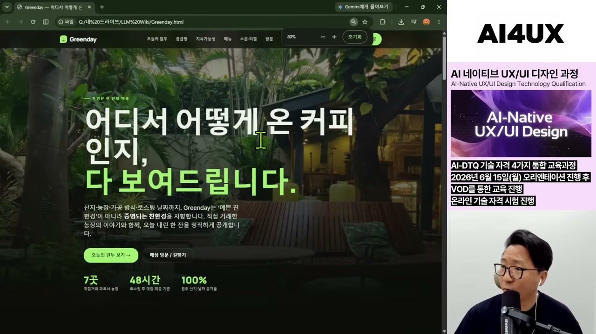

여기서 한술 더 떠, 만들어진 HTML을 평가까지 시킨다. 스킬 중 사용성 평가 부분을 작업해두면, 전문가 휴리스틱 평가는 물론 외부로 수행 가능한 사용성 평가까지 시킬 수 있다. 목표가 충분히 달성됐는지, 어느 부분을 수정해야 하는지를 도출해낸다. 발표자는 다른 자료에서는 사용성 평가까지는 못 시켰었다며, 이 부분이 이번 구성의 한 걸음 더 나아간 지점임을 짚는다.

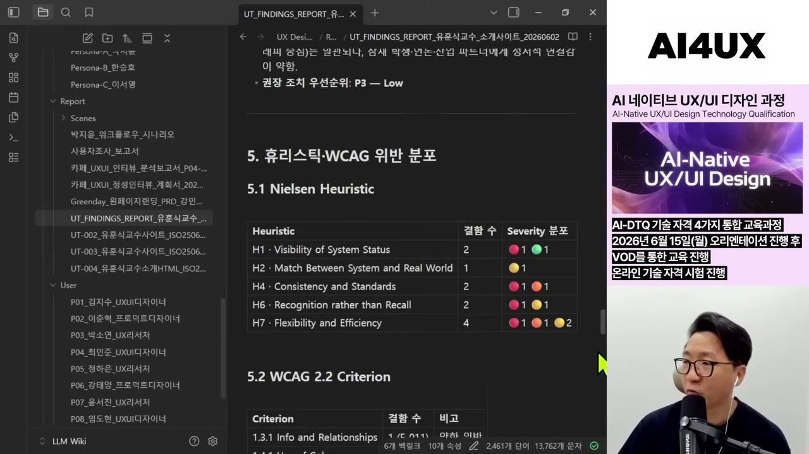

## 손을 떼는 쪽으로, 역량은 더 깊은 쪽으로

전 과정이 PC에 세팅돼 있으니, 이제는 에이전트와 둘이 대화하며 시키기만 하면 된다. 발표자가 여기서 한 단계 더 나아가는 그림이 있다. 이 과정들에서 사람이 "점점점 손을 뗄 수가 있다"는 것이다. 에이전트들은 정해진 시간에 일할 수 있으니, 첫 에이전트에게 언제 무엇을 하라 해두고 그 과정이 끝나면 다음 에이전트에게 다음 과정을 넘기도록 미리 세팅해둘 수 있다. 리서치 데이터를 분석하고 정리해 최종 결과까지 만드는 일들이 마크다운 파일로 다 저장되니, 사람이 일일이 확인하지 않아도 굴러간다.

발표자는 과장하지 않는다. 아직은 부족하다고, 결과물이 마음에 안 들고 모자란 점이 있다고 인정한다. 다만 그가 거듭 짚는 포인트는 AI 성능이 아주 빠르게 좋아진다는 사실이다. 그는 예전에 휴리스틱 평가를 굉장히 많이 했는데, 2~3년 전만 해도 AI에게 초안 정도만 도움받았다면 이제는 "저보다 더 잘할 때들도 많이 있는 것 같다"고 말한다. 속도까지 빠르니 AI 네이티브로 전환되는 흐름이 점점 가팔라진다는 것이다.

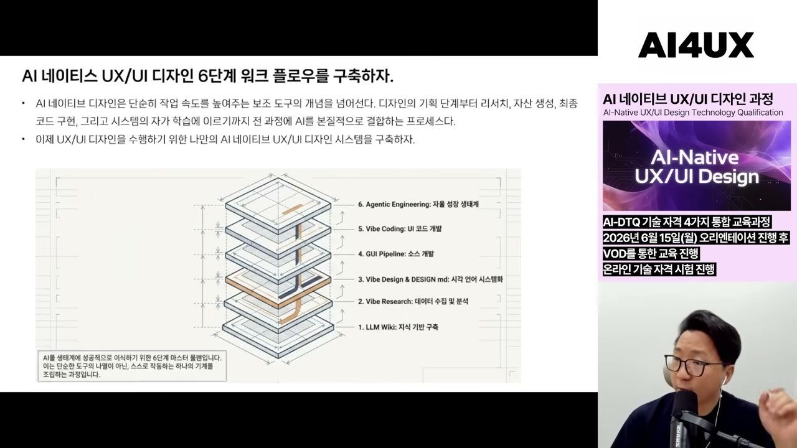

그렇다면 이 시대에 디자이너에게 남는 역량은 무엇인가. 발표자의 결론은 역설적이다. 일을 에이전트에 위임할수록, 사람에게 필요한 역량은 오히려 더 중요해진다는 것이다. 그가 꼽는 첫째는 UX 본질에 대한 역량이다. 사용성이 무엇이고 사용자 경험의 목적이 무엇인지, 인터뷰는 왜 하고 페르소나는 왜 만드는지, PRD는 어떻게 만들고 사용성 평가는 어떻게 하는지를 제대로 이해해야 한다. 디자인 결과를 보는 심미적 안목도 마찬가지다. 발표자의 표현이 거칠지만 솔직하다. AI 직원이 내가 원하는 높은 수준에 닿을 때까지 "후려치면서" 학습시키는 역량이 필요하다는 것이다. 그러려면 무엇이 좋은 결과인지 알아보는 안목이 먼저 있어야 한다.

둘째는 AX, 곧 AI 시스템을 어떻게 세팅할 것인가다. 어떤 프롬프트를 넣을지, 요즘 말하는 컨텍스트 엔지니어링을 어떻게 접목할지를 하나씩 세팅해가며 역량을 키워야 한다. 일하는 방식과 업무는 회사마다 다르니, 결국 자기 환경에 맞게 직접 빚어가는 과정이 필요하다는 것이다.

정리하면 이렇다. 자율형 에이전트라는 직원을 두뇌를 갈아 끼우며 부리되, 그 직원의 깡통 머리를 채우는 건 옵시디언 위에 마크다운으로 쌓은 나만의 LLM 위키와, 내 UX 지식을 굳혀둔 스킬이다. 카페 인터뷰 한 줄에서 분석, 페르소나, PRD, 웹사이트, 사용성 평가까지 한 흐름으로 이어지는 건 그 데이터와 스킬이 받쳐주기 때문이다. 발표자가 끝까지 놓지 않는 메시지는, AI에 더 많이 맡길수록 사람의 UX 본질에 대한 이해와 안목은 옛날보다 더 중요해진다는 역설이다.
