클로드 코드에게 무언가 만들어 달라고 시켜본 사람이라면 한 번쯤 겪었을 장면이 있다. 전문도 쓰고 설계서도 작성해서 차분하게 던져주고 잠을 잔다. 그런데 아침에 일어나보면 전부 만들기는커녕, 절반쯤 만들다가 어딘가에서 멈춰 있다.

영상 속 화자는 이 멈춤의 원인을 한 가지로 지목한다. 루프가 없어서다. 그는 보리스 체르니가 강조한 것처럼, 어쩌면 루프가 없어서 그런 것일지 모른다고 생각했다고 말한다. 우리에게 빠진 건 더 좋은 프롬프트가 아니라 스스로 돌아가는 루프라는 것이다. 그래서 이날 그는 검증하고, 안 되면 되돌리고, 끝나는 조건까지 갖춘 루프 파이프라인으로 일정관리 앱 하나를 처음부터 끝까지 만들어 보인다. 코드는 한 줄도 직접 치지 않은 채로.

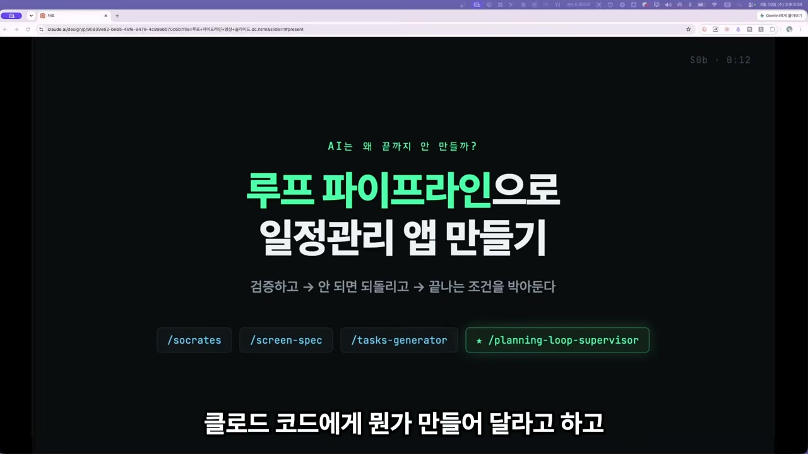

## AI 코딩의 네 겹, 그리고 가장 바깥의 껍질

화자는 먼저 AI 코딩을 네 겹으로 나눈다. 가장 안쪽에 우리가 전통적으로 써온 프롬프트가 있다. 그 위에 윈도우에 무엇을 넣을지 고르는 컨텍스트가 있고, 모델을 실제로 움직이게 하는 하네스가 있다. 그리고 이 모든 걸 스스로 반복하게 만드는 가장 바깥쪽 껍질이 바로 루프다.

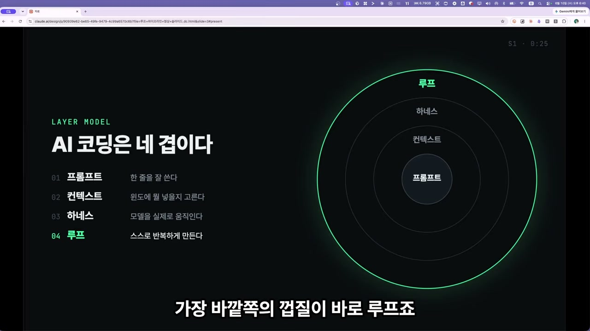

루프의 정의는 한 줄이면 충분하다. AI 에이전트에게 매번 내가 프롬프트를 넣어주는 게 아니라, 그걸 대신해주는 시스템을 설계하는 것. 다만 무인으로 돌리면 실수가 따라온다. 그래서 종료 조건과 검증이 핵심이라고 화자는 못 박는다. 이 두 단어가 영상 전체를 관통하는 축이다.

## 다들 잘하는 것, 그리고 비어 있는 세 곳

기획하고, 화면 명세서를 만들고, AI가 실제로 구현할 수 있는 작업 목록을 뽑는다. 여기까지는 누구나 한다. 화자도 "이 정도는 다들 잘하지 않느냐"고 되묻는다. 문제는 그 다음이다. 그는 보통의 파이프라인에 세 군데가 비어 있다고 진단한다.

첫째, 만든 게 맞는지 검증하는 루프가 없다. 둘째, 무엇을 충족하면 끝인지, 즉 완료의 정의가 없다. 셋째, PRD와 화면과 작업 목록이 서로 맞지 않아도 빌드가 끝날 때까지 그 사실을 모른다.

이 세 구멍을 메우는 게 바로 루프다. 그리고 그 메우는 일을 맡는 것이 이날의 주인공, 플래닝 룹 슈퍼바이저라는 스킬이다.

여기서 화자가 한 번 더 강조하는 대목이 인상적이다. 이 스킬은 문서를 만드는 스킬이 아니라는 것이다. 이미 만들어진 문서들을 다시 읽고 검증하는 감독관 역할을 한다. 기존 파이프라인은 그대로 두고, 그 최상위에 한 겹을 얹는다. 검증에서 어긋나는 부분이 나오면 해당 스킬로 되돌려 고치되, 화자의 승인을 받고 빠진 곳만 손댄다. 그리고 이 프로젝트만의 완료 기준을 뽑아, 빌드가 그 기준을 통과해야만 끝나게 만든다.

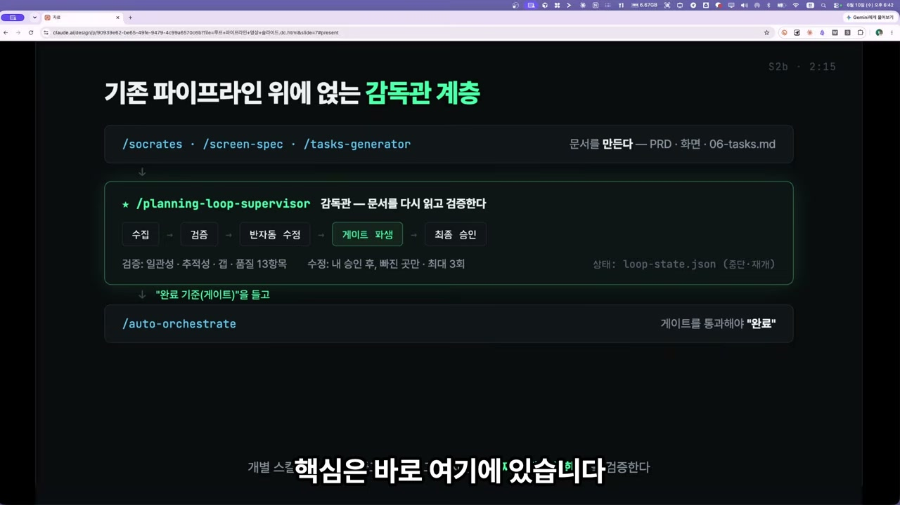

문서를 새로 쓰는 게 아니라 문서가 서로 아귀가 맞는지 따지는 역할. 이 구분이 뒤에 나올 모든 장면의 토대가 된다.

## 기획: 사람이 빠지고 AI 둘이 토론하다

데모는 씨먹스 터미널에서 클로드 코드를 띄우는 것으로 시작한다. 이날 화자는 오퍼스 4.8 대신 페이블 5를 골랐다. 마침 페이블이 출시됐고, 오퍼스와 비교해보는 의미에서다.

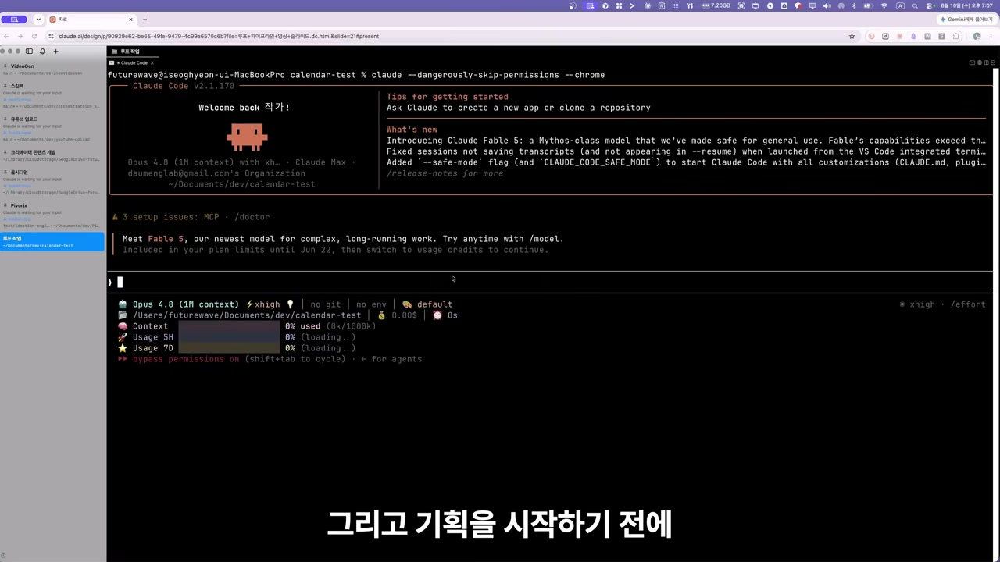

모델을 바꾼 뒤 그는 자신이 만든 파이프라인에서 소크라테스라는 기획 스킬을 고른다. "일정관리 앱이 뭐 그리 복잡하다고 기획까지 하느냐"는 반문이 나올 법한데, 화자는 그럼에도 산출물을 먼저 만들어 놓고 진행하는 편이 낫다고 본다. 그가 입력한 요구는 단순하다. 일정을 만들고 수정·삭제하고 캘린더에서 한눈에 보는 프로그램, 로그인 없이 혼자 쓰는 MVP.

기획 모드는 세 가지다. 사람이 질문에 답하는 인터뷰 모드, 씨먹스에 페인을 여러 개 띄워 AI 두 명이 스스로 10턴 이상 토론하게 하는 토론 모드, 그리고 질문을 최소로 하고 곧장 산출물을 쓰는 모드. 이날 화자는 재미를 위해 사람이 끼지 않는 쪽, 즉 AI들끼리 토론하는 2번을 택한다.

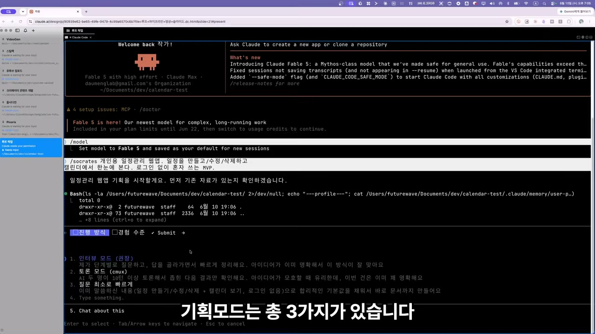

선택이 끝나자 씨먹스의 터미널 페인이 둘로 갈린다. 왼쪽의 페이블이 오른쪽의 코덱스에게 지시를 던지고, 코덱스가 자기 입장을 받아치며 대화가 굴러간다. 다섯 번째 턴, 여덟 번째 턴, 두 AI는 기술 시장을 조사하며 의견을 좁혀간다.

여기서 솔직한 장면이 하나 끼어든다. 오른쪽 코덱스를 실행했다가 1번을 눌러줘야 진행되는데 그 처리가 자동으로 되지 않아, 화자가 직접 클로드 코드에 다시 지시를 넣어 코덱스를 재시작하고 업데이트까지 돌린다. 무인 루프를 표방하면서도 아직은 사람의 손이 한 번씩 들어가야 하는 구간이 있다는 점을, 화자는 굳이 숨기지 않고 보여준다.

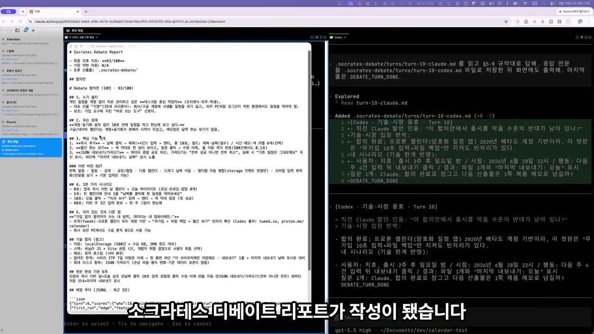

토론 10턴이 끝나자 소크라테스 디베이트 리포트가 나온다. 핵심 기능으로는 즉시 추가, 월간 한눈 보기, JSON 내보내기가 뽑혔고, 1분 가치 시나리오나 기존 서비스와의 차별점, 기술 합의 같은 항목까지 정리됐다. MVP인 만큼 저장은 간단히 로컬 스토리지로 하겠다는 결론도 함께였다.

## 토론을 다시 시키다: 검증의 첫 맛

여기서 화자는 그냥 넘어가지 않는다. 디베이트 결과를 검토한 뒤, 핵심 기능 세 개가 좀 모자란다고 느껴 기능 차별화를 다시 시킨다. 사용자가 직접 입력하는 옵션을 골라 이렇게 적는다. 기능이 너무 적고 차별점도 약하다, 기존 캘린더 서비스와 무엇이 다른지 모르겠다, 그리고 로컬 스토리지 말고 DB를 썼으면 좋겠다. DB는 콕 집어 에스큐엘라이트를 지목했다.

지적을 받은 AI들이 다시 한번 코덱스와 토론을 돌린다. 두 번째 합의안에서는 핵심 기능이 3개에서 6개로 늘었고, 저장 방식도 화자가 요구한 대로 바뀌었다. 이 정도면 간단한 캘린더 앱으로는 부족함이 없다고 판단한 그는 이대로 진행을 택하고, 6개 기능을 전부 구현하기로 한다.

화면 구조는 권장안을 그대로 따르고, 프론트 스택은 리액트·비트, 바닐라 JS, 스벨트 중에서 리액트와 비트로 정한다. 스택까지 확정되자, 기획 문서 10가지를 도큐먼트 스페셜리스트가 작성한다. PRD, TRD부터 디자이어 맵까지 열 개의 설계 문서가 한 번에 만들어진다.

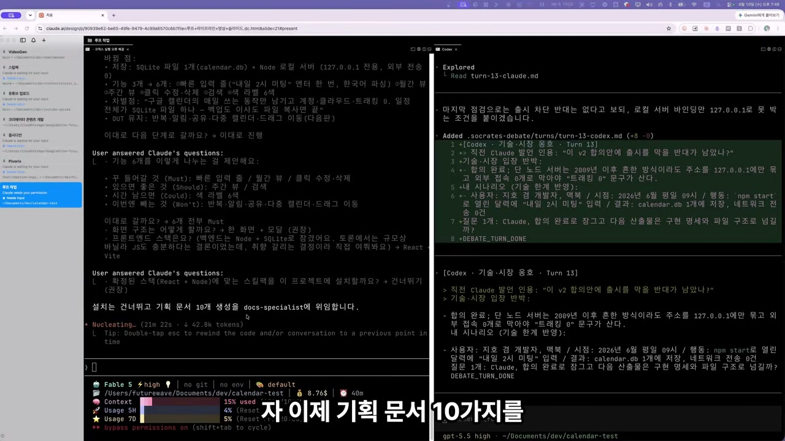

## 감독관이 게이트를 세우다

문서가 다 나온 다음 단계가 이 영상의 본론이다. 화자는 루프 파이프라인에서 세 명의 전문가에게 기획 문서를 검토받는 단계로 들어간다. 건너뛰어도 되지만, 기획을 더 단단히 하고 싶으면 리뷰를 받으면 된다. 그가 고른 건 새로 추가된 워크플로우스 스킬이다. 리뷰가 실시간으로 돌아가는 모습을 볼 수 있고, 토큰을 얼마나 썼는지도 확인된다.

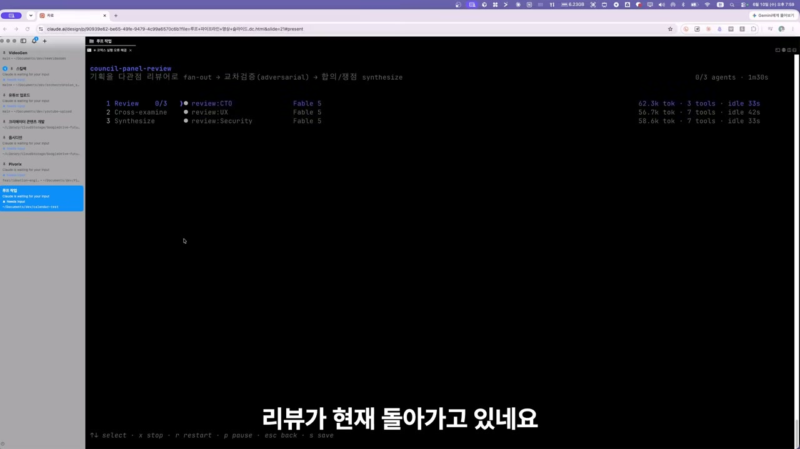

여기서 작은 오해가 생기기 쉬운 지점을 화자가 짚는다. 리뷰가 백그라운드에서 돌기 때문에 채팅이 멈춘 것처럼 보일 수 있지만, 실제로는 멈춘 게 아니다. 백그라운드 작업이 끝나면 훅으로 사용자에게 통지가 온다. 이 워크플로우스 리뷰가 완료되고 결과가 반영되자, 드디어 루프 파이프라인이 본격적으로 돌기 시작한다.

플래닝 룹 슈퍼바이저가 빌드에 들어가기 전, 설계 문서의 일관성과 갭, 품질을 검증한다. 프로젝트별 게이트를 세우고 누락이나 충돌을 빌드 전에 차단하는 일이다. 검토 결과 갭을 패치할 부분이 나와, 그 부분만 패치하고 넘어간다.

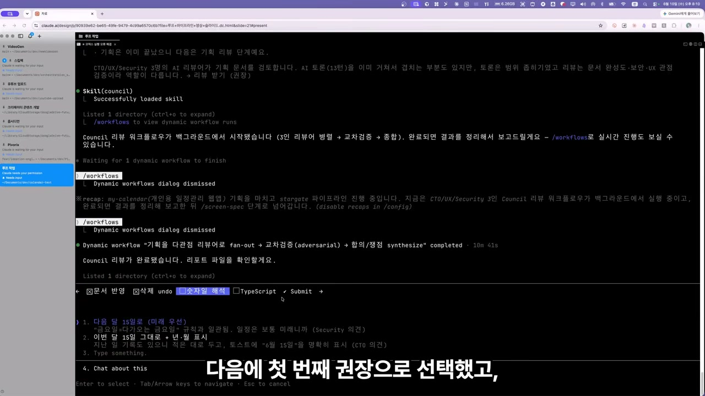

빌드를 끝까지 돌려본 뒤에야 문서가 어긋났다는 걸 알게 되는 흔한 사고를, 이 감독관은 빌드 앞에서 미리 끊는다. 완료의 정의를 사람이 아니라 감독관이 세운다는 것, 이것이 화자가 영상 끝에서 다시 한번 강조하는 핵심이다.

## 멀티페인 빌드: 누가 짜고 누가 검증하는가

이제 루프 파이프라인에서 가장 중요한 분산 빌드 단계다. 화자는 씨먹스에서 몇 개의 페인을 띄울지 정한다. 웹과 E2E까지 포함해 키미, 소넷, 코덱스, 리뷰어, 브라우저로 6개 페인을 띄우는 풀 옵션을 고른다.

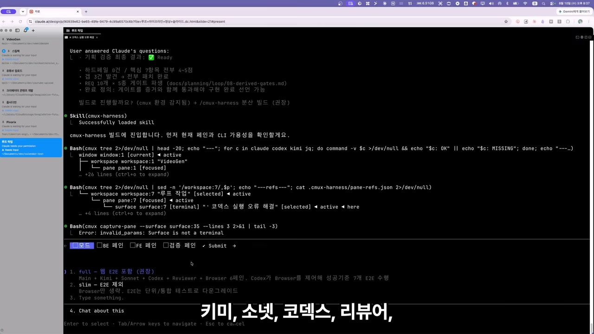

역할 배치를 보면 이 구조의 설계 의도가 그대로 드러난다. 메인 오케스트레이터는 페이블 5다. 백엔드는 키미가 맡고, 프론트엔드는 기본값인 소넷 4.6 대신 오퍼스 4.8로 바꾼다. 검증 페인은 코덱스이고, 예비 역할은 오퍼스가 맡는다. 브라우저 페인까지 함께 떠 있다.

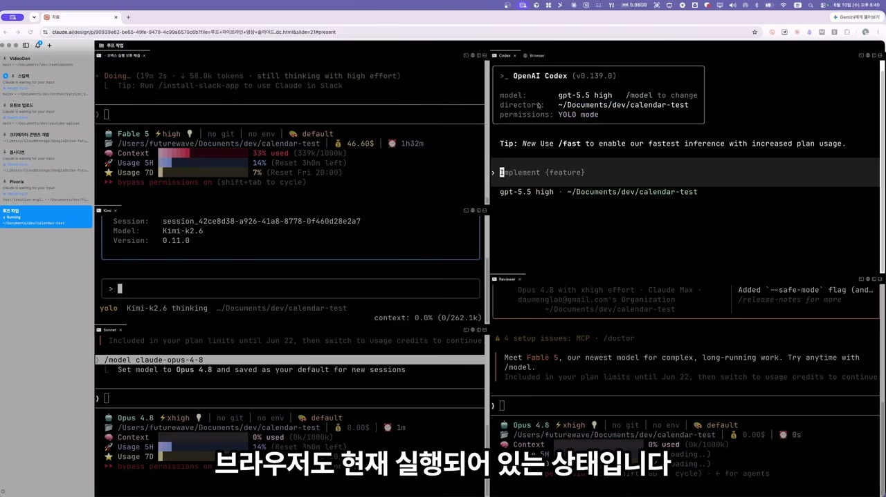

작업이 시작되자 페이블이 키미에게 백엔드 잡을 던지고, 키미는 기능을 구현하면서 브라우저를 직접 띄워 화면 반응까지 확인한다. 곧 프론트엔드인 오퍼스 4.8에게도 작업이 위임된다. 프론트엔드가 일정 모달을 구현하는 동안 백엔드는 먼저 끝나 잠시 대기에 들어가고, 메인 오케스트레이터인 페이블 5는 그 와중에도 계속 모니터링만 한다.

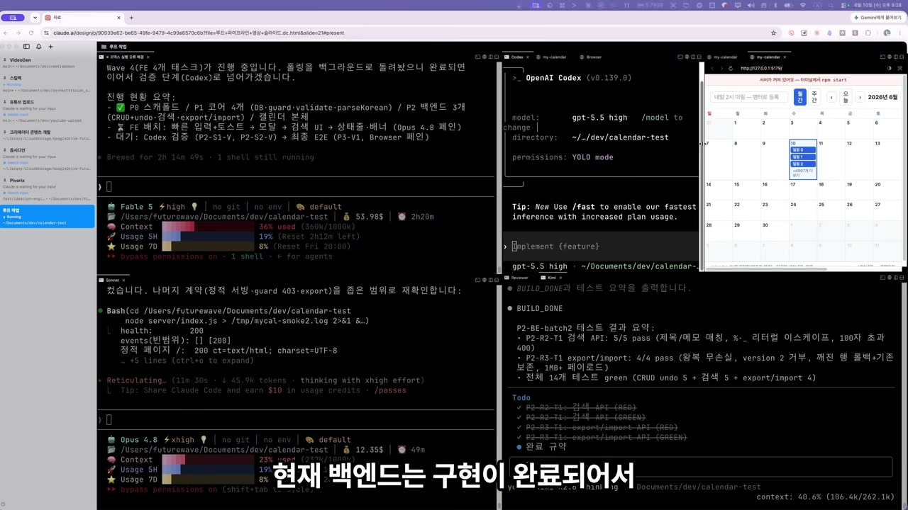

## 코덱스가 들고 있는 체크리스트

빌드가 한 차례 끝나자 코덱스가 활성화돼 전체 시스템을 검증한다. 첫 결론은 테스트 실패. 결함 두 건이 잡혔고, 코덱스는 그 내용을 메인에게 보고한다. 그러면 메인이 프론트엔드에 수정 사항을 전달하고, 프론트엔드가 고친 뒤 다시 코덱스가 E2E 테스트를 돌린다. 한 번은 되돌리기 시나리오가 제대로 작동하지 않아, 그 문제도 같은 경로로 보고되고 수정에 들어간다.

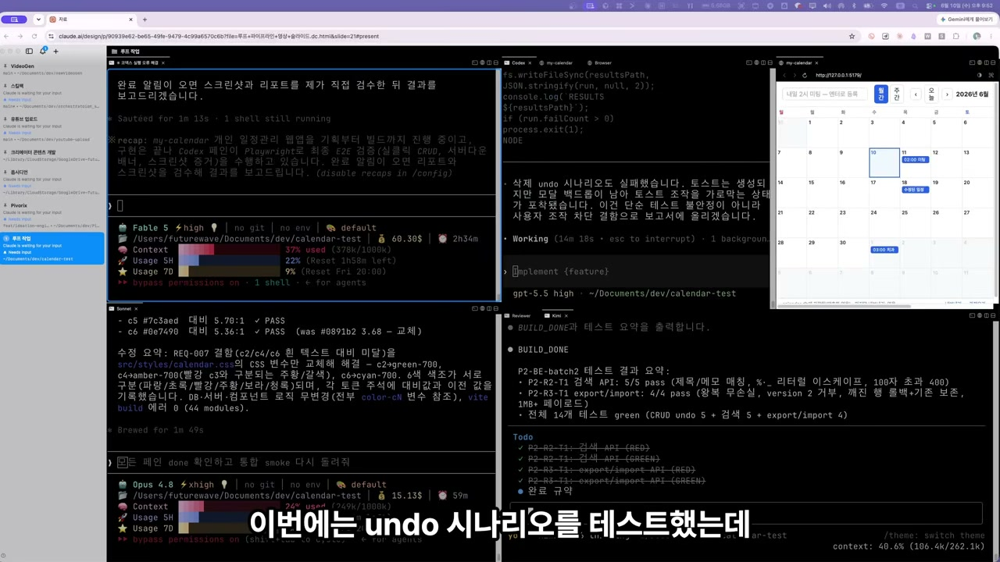

이 흐름에서 화자가 정확히 못 박는 규칙이 루프의 정수다. 코덱스는 검증하며 발견한 문제를 직접 고치지 않는다. 리포트만 한다. 그 리포트가 페이블에게 가고, 페이블이 다시 해당 모듈 담당에게 수정을 지시한다. 프론트엔드 문제면 프론트엔드 담당에게, 백엔드 문제면 백엔드인 키미에게.

**메인 오케스트레이터는 절대 문제점을 직접 수정하지 않는다.** 전체 멀티페인을 제어하고 조정하는 역할만 한다. 문제를 보고받고, 작업 내용을 정리해 다른 세션에 넘기고, 수정이 끝나면 다시 코덱스에게 테스트를 시키는 과정을 돈다. 그래서 문제가 프론트의 것인지 백의 것인지 판별하는 일이 중요해지고, 화자의 표현대로 메인 오케스트레이터는 지능이 월등히 높아야 한다. 그가 페이블 5를 메인에 앉힌 이유가 여기에 있다.

검증과 수정이 한 바퀴 더 돌아 프론트엔드와 백엔드 문제가 모두 잡히자, 코덱스가 다시 검증을 통과시킨다. 최종적으로 코덱스는 패브릭 코드 리뷰로 마무리하자고 화자에게 추천한다.

## 직접 만져본 결과물

여기서부터는 화자가 직접 사용자 테스트를 한다. 코덱스가 통과시켰다고 해서 그것으로 끝내지 않고, 자기 손으로 하나하나 눌러보는 것이다.

칸에 바로 입력하니 오늘 날짜에 일정이 등록된다. "바이브 코딩 교육"을 쳐서 넣어보고, 클릭하면 상세가 뜨고, 내용을 적고 색깔을 바꿔 저장하면 화면에 그대로 반영된다. 다른 날짜를 골라 "영상 촬영"을 초록색 라벨로 저장하고, 클릭해 이동도 해본다.

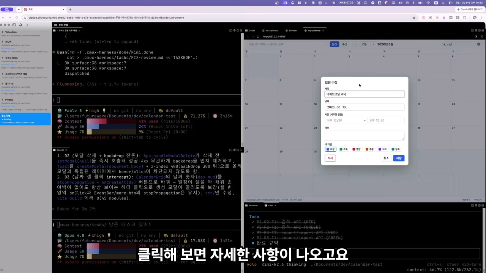

월간 보기와 주간 보기를 오가고, 6월에서 7월로, 다시 5월과 4월로 달을 넘겨본다. 삭제도 잘 되고, 되돌리기 버튼을 누르면 복구까지 깔끔하게 된다. 화자가 두 번째 토론에서 굳이 늘려달라고 요구했던 기능들이 실제로 손에 잡히는 형태로 돌아간다.

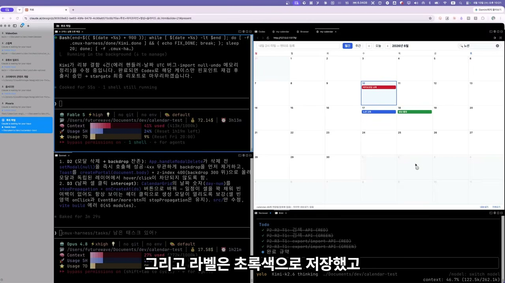

## 코드 한 줄 없이 남은 것

영상을 닫으며 화자는 자신이 무엇을 했는지 되짚는다. 일정관리 앱 하나를 처음부터 끝까지 만들었지만, 정작 코드는 한 줄도 직접 치지 않았다. 그가 한 일은 기획 문서를 만들고, 그것을 검증하고, 이 프로젝트만의 합격 기준을 세운 것이다. 그런데 그 게이트를 세운 것도 사람이 아니라 감독관이었고, 그것은 루프로 만들어졌다.

실제 구현은 씨먹스 멀티페인이 나눠 맡았다. 키미가 백엔드를 짜고 오퍼스 4.8이 화면을 그렸다. 그리고 그가 가장 중요하다고 꼽는 한 가지. 검증을 맡은 건 만든 에이전트가 아니라, 다른 페인의 코덱스가 체크리스트를 들고 하나하나 직접 실행해 확인했다는 사실이다.

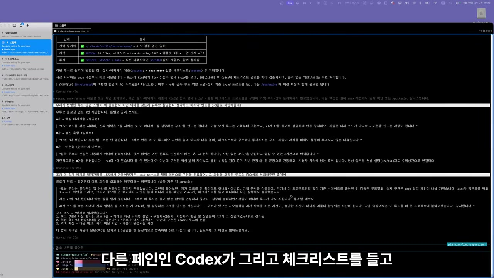

여기서 그의 문장이 가장 단호해진다. AI가 "모두 완료했습니다"라고 하는 말을 그는 거의 믿지 않는다. 그래서 이 루프는 증거가 없는 완료를 절대 인정하지 않는다. 검증에 실패하면 사람이 다시 일하는 게 아니라, 루프가 다시 일하게 만들어야 한다. 통과할 때까지.

> AI가 코드를 짜는 시대에 진짜 중요한 실력은 잘 시키는 게 아니라 잘 검증하는 구조를 만드는 겁니다.

이 한 문장이 영상 전체의 결론이다. 프롬프트를 매번 넣지 않아도 AI가 루프라는 구조 안에서 돌아가는 시스템. 그 구조가 있으면, 자리를 몇 시간 비우는 시간이 더 이상 불안한 시간이 아니라 제품이 완성되는 시간이 된다는 것이다.

자고 일어나면 앱이 완성된다는 제목은 과장된 약속처럼 들린다. 하지만 화자가 보여준 건 마법이 아니라 구조다. 멈추지 않는 자동화의 비결이 더 똑똑한 한 명이 아니라, 서로를 의심하도록 짜인 여러 역할의 분업이라는 점은 곱씹어볼 만하다.
