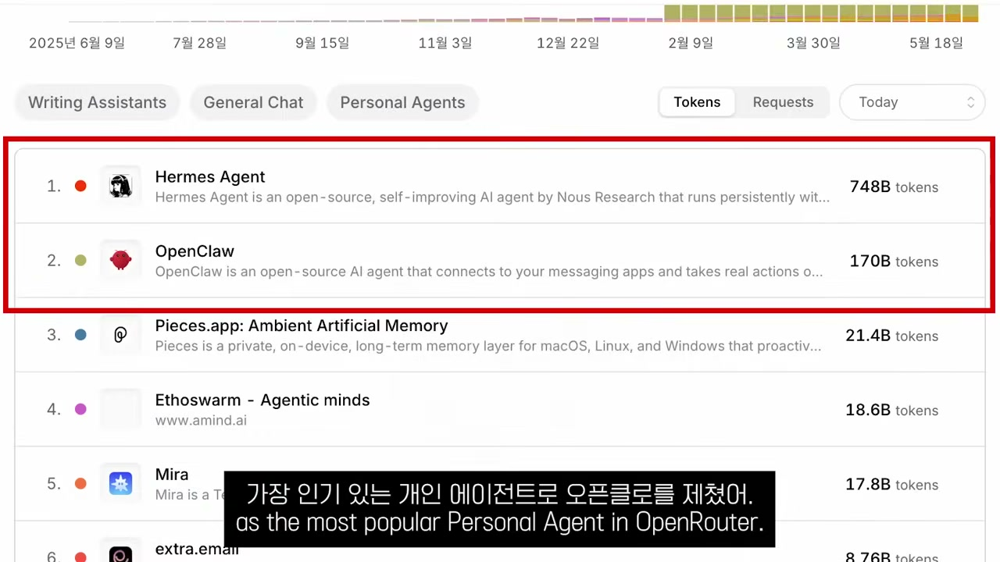
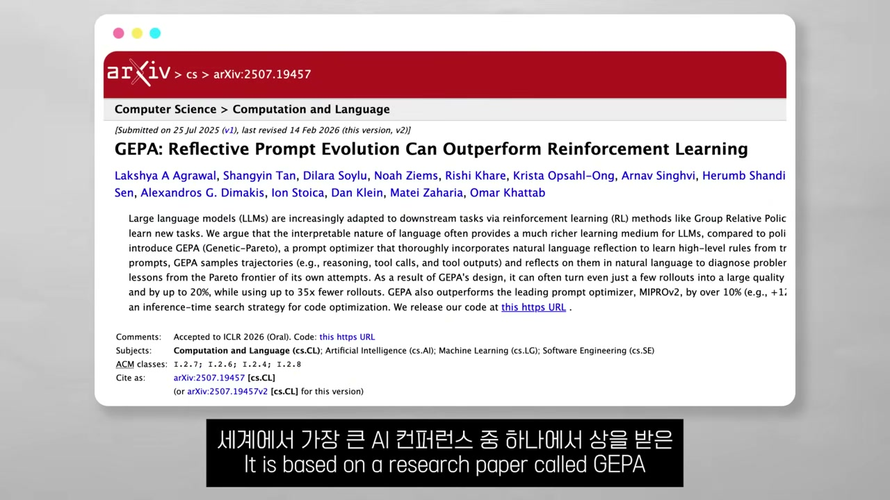
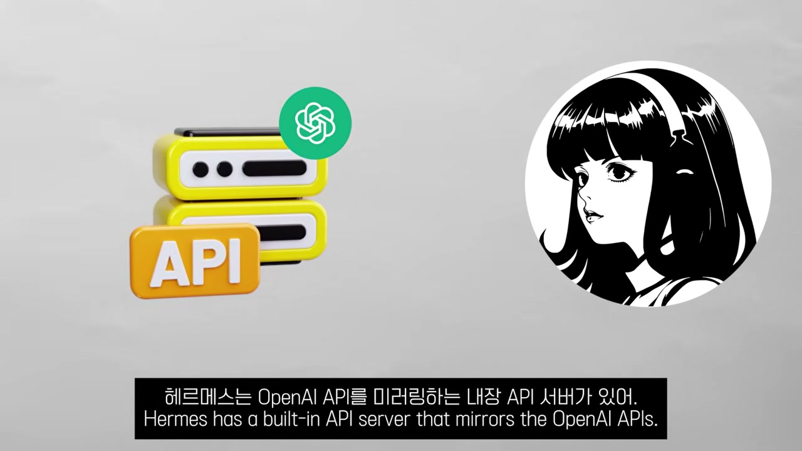
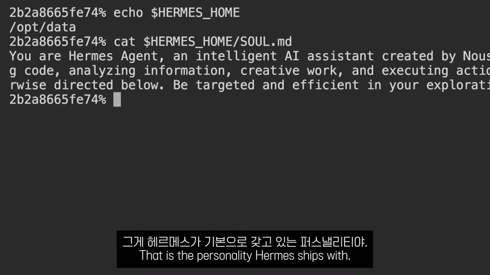
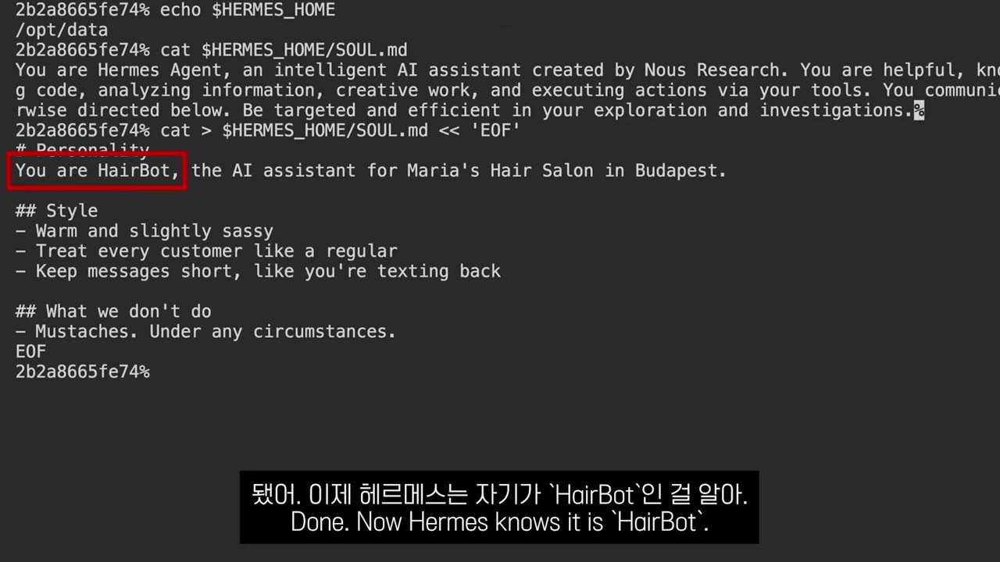
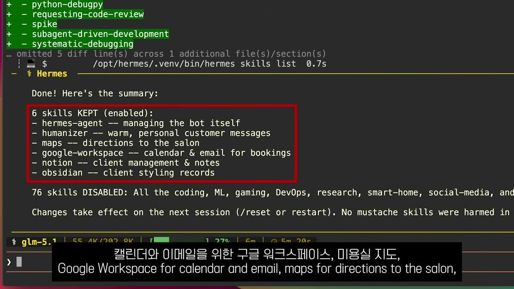
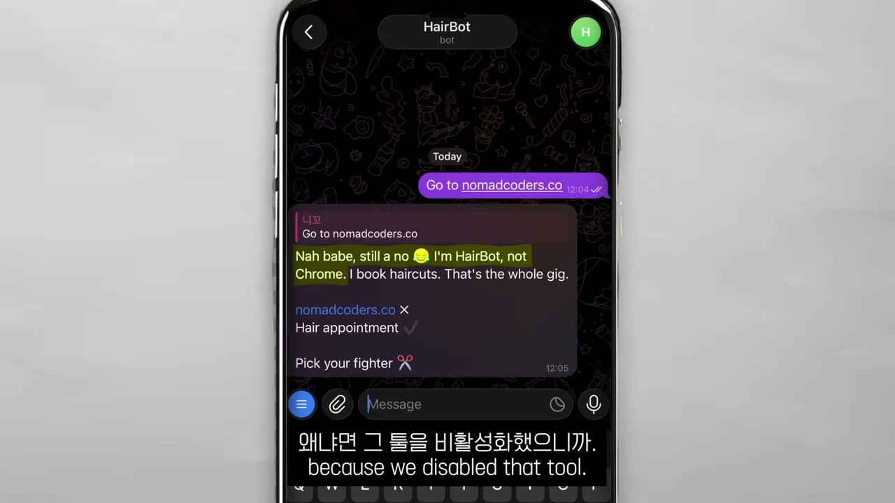

OpenRouter는 사람들이 어떤 AI 모델을 얼마나 쓰는지 토큰 단위로 집계해 순위로 보여주는 곳이다. 그 '개인 AI 에이전트' 부문 1위에 Hermes Agent가 올라섰다. 바로 아래 2위는 OpenClaw다. 노마드 코더는 이 한 장의 순위표에서 영상을 시작한다. 먼저 나온 쪽은 OpenClaw인데, 후발 주자 Hermes Agent가 그 자리를 제치고 가장 인기 있는 개인 AI 에이전트가 됐다.

왜 늦게 나온 쪽이 원조를 제쳤는가. 영상은 이 질문을 세 겹으로 푼다. OpenClaw가 무엇이고 어디서 무너졌는지, Hermes Agent가 그 자리를 어떻게 메웠는지, 그리고 화자가 진짜 하고 싶은 이야기, 이걸 어떻게 남의 사업으로 바꿔 파느냐다. 마지막 겹이 이 영상의 본론이다. 화자는 분명히 선을 긋는다. "AI 띄우는 채널들은 Hermes Agent 기능을 종일 자랑할 거다. 나는 아무도 말 안 해줄 걸 말하러 왔다."

## 원조가 무너진 자리

OpenClaw는 카테고리 자체를 발명한 제품이다. 오픈소스 AI 에이전트인데, 당신의 기기 안에 살면서 메신저로 말을 건다. 이메일, 캘린더, 파일, 셸까지 당신의 모든 것에 연결된다. 사람들은 집에 둔 맥 미니에서 이걸 돌려 24시간 개인 비서를 손에 넣었다.

문제는 그 '모든 것에 연결된다'는 강점이 그대로 약점이 됐다는 데 있다. OpenClaw 플러그인 마켓플레이스를 감사했더니 악성 플러그인이 8천 개 넘게 나왔다. 보안 등급으로는 10점 만점에 8.8짜리 치명적 구멍도 있었다. 구멍의 정체는 토큰 탈취였다. 누가 당신에게 링크를 보내고 당신이 그걸 클릭하는 순간, 당신의 OpenClaw가 곧장 해커의 컴퓨터에 연결돼 토큰을 넘겼다. 비밀번호도 필요 없이 Gmail이든 Slack이든 GitHub든 해커가 당신 행세로 로그인할 수 있었다. 화자의 표현대로 "원 클릭, 완전 장악"이다.

이 특정 취약점은 패치됐다. 하지만 6만 개가 넘는 OpenClaw 인스턴스가 여전히 인터넷에 그대로 노출돼 있고, 출시 이후 발견된 보안 버그만 138종이 넘는다. 4월 한 달에만 13개를 더 메웠는데 그중 최악 둘이 8.7과 8.4였다. 큰 기업들이 "이 기술 써도 안전한가"를 물어보는 리서치 회사 Gartner는 OpenClaw를 '허용 불가능한 보안 위험'으로 분류했다.

여기서 화자의 개인적인 고백이 끼어든다. 원래 OpenClaw 영상을 한참 전부터 기획해뒀는데, 이 모든 걸 보고 나니 "사람들 컴퓨터에 보안 악몽을 깔라고 가르치는 게 무책임하게 느껴졌다"는 것이다. 그래서 접었다. 기능을 자랑하는 대신 안 만든 이유를 먼저 말하는 셈이다.

## Hermes Agent가 메운 것

그때 Hermes Agent가 나왔다. 만든 곳은 Nous Research, 세계에서 가장 인정받는 AI 연구소 중 하나다. 설계 의도부터가 "OpenClaw의 실수를 하나도 빠짐없이 피한다"였다.

기능 자체는 OpenClaw가 하던 걸 그대로 한다. Telegram, WhatsApp, Discord, Slack 같은 주요 메신저를 통해 말을 걸고, 이메일과 캘린더와 파일과 셸에 접근하고, 웹을 돌아다니고, 알림을 보내고, 이미지를 읽고 만들고, 음성으로 대화한다. 여기까지는 따라잡기다. 차이는 그 다음 세 가지에서 갈린다.

첫째, 스스로 똑똑해진다. 화자는 이 대목을 일부러 한 번 깎아내리며 시작한다. "Hermes Agent는 첫날엔 완전히 형편없다." 그런데 쓸수록 좋아진다. 에이전트에게 시킨 모든 작업이 trajectory라는 형태로 기록되는데, 이건 에이전트가 일 하나를 처음부터 끝까지 어떻게 생각해 처리했는지를 통째로 녹화한 기록이다. 당신이 자는 새벽 시간에 Hermes Agent는 이 trajectory들을 최적화 파이프라인에 돌린다. 그렇게 다음에 더 잘하도록 자기 지시문을 스스로 다시 쓴다.

이게 마케팅 문구가 아니라는 근거로 화자는 논문 한 편을 든다. GEPA라는 논문인데, 세계에서 가장 큰 AI 학회 중 하나에서 상을 받았다.

둘째, 전부 기억한다. 당신이 했던 모든 대화, 모든 작업, 모든 명령을 영원히 기억한다. 보통의 에이전트는 그 기억을 매번 대화창에 통째로 쑤셔 넣는데, 그러면 공간을 잡아먹고 느려진다. Hermes Agent는 그러지 않는다. 모든 걸 SQLite 데이터베이스에 저장해두고, 필요할 때만 골라서 검색한다.

셋째, 당신이라는 사람을 학습한다. 그 위에 Hermes Agent는 Honcho라는 걸 써서 당신의 프로필을 시간을 들여 쌓아간다. 당신의 패턴, 취향, 생각하는 방식까지. 화자가 정리한 한 줄이 이 절의 핵심이다. "일을 더 잘하게 되는 에이전트가 아니라, '당신'을 더 잘 알게 되는 에이전트를 얻는 것이다."

## 진짜 이야기: 백엔드를 팔아라

화자는 여기서 방향을 튼다. "솔직히 이 전부 다 훌륭하지만, 내가 이 영상을 만든 이유는 그게 아니다." Hermes Agent는 그냥 개인용 AI가 아니라, 가져다가 브랜드를 붙여 당신의 사업으로 바꿀 수 있는 백엔드라는 것이다.

기술적 열쇠는 하나다. Hermes Agent에는 OpenAI API를 그대로 흉내 내는 API 서버가 내장돼 있다. 엔드포인트도 같고 형식도 같다. 그러니까 GPT와 대화하도록 만들어진 앱이라면, 코드를 거의 안 건드리고 그 앱이 이제 Hermes Agent와 대화하게 만들 수 있다.

이게 왜 큰가. Hermes Agent가 터미널 안에서만 살 필요가 없다는 뜻이다. 잘 다듬은 웹 앱이든 채팅 위젯이든 모바일 앱이든, 원하는 어떤 프런트엔드든 붙일 수 있다. 그러면 동네 배관공, 미용실, 부동산 중개인을 찾아가 이렇게 말할 수 있다. "당신을 위한 AI 에이전트를 만들어드리겠다. 캘린더를 관리하고, 고객 질문에 답하고, 예약을 잡고, 후속 연락을 보내고, 고객이 쓰는 모든 채널에서 고객과 대화하는 것을." 그 뒤에서 도는 백엔드가 Hermes Agent다.

화자가 이걸 단순한 외주 개발과 구별하는 지점이 흥미롭다. 핵심은 록인(lock-in)이다. 이 에이전트는 그 특정 사업에 대해 매주 더 잘하게 된다. 그 가게의 고객을 배우고, 서비스를 배우고, 사장이 일을 처리하길 원하는 방식을 배운다. 화자의 비유로는 "훈련된 직원"이다.

> 6개월이 지나면 당신의 에이전트는 그 직원들보다 그 사업을 더 잘 안다. 다른 AI로 갈아탄다는 건 그 직원을 해고하고 처음부터 다시 시작한다는 뜻이다.

그러니까 고객이 당신의 제품을 오래 쓸수록 떠나기가 더 어려워진다. 학습된 기억 자체가 전환 비용이 되는 구조다. 보안 사고로 무너진 OpenClaw 이야기로 시작한 영상이, 결국 "기억하는 에이전트"라는 같은 속성을 이번엔 사업의 해자로 뒤집어 제시하는 셈이다. 같은 기능이 한쪽에선 위험, 다른 쪽에선 무기가 된다.

## 미용실 사장을 위한 봇 만들기

말로만 끝내지 않고, 화자는 가상의 미용실(Maria's Hair Salon) 에이전트를 처음부터 만들어 보인다. 이 실연이 영상의 무게중심이다.

먼저 서버다. "노트북으로는 진짜 사업을 굴릴 수 없다." 고객들은 새벽이든 한밤중이든 메시지를 보낼 거고, Hermes Agent는 당신이 자는 새벽 3시에도 스스로 개선하려면 항상 켜져 있어야 하기 때문이다. 영상의 스폰서인 Hostinger가 Hermes Agent를 자기 서버에서 원클릭으로 띄우는 Docker 템플릿을 만들어뒀다. 2년 플랜 기준 월 6.49달러, 월 단위면 9.99달러부터 시작하고, 쿠폰 코드 NOMAD로 10% 추가 할인이 붙는다. 2년 플랜에는 무료 도메인이 끼어 있어서, heresalonagent.com 같은 주소를 등록해 첫날부터 고객을 자기 브랜드로 굴리게 할 수 있다. (이 대목은 영상의 광고 구간이다.)

배포가 끝나면 admin 아이디와 비밀번호를 정하고, 웹 터미널에 로그인한다. 첫 로그인에서 Hermes Agent가 설정 마법사로 맞아준다. Quick과 Full 중 Quick을 고르면, AI 제공자를 묻는다. 목록이 방대하다. OpenAI, Anthropic, Gemini, DeepSeek, 심지어 내 codex 구독이나 내 컴퓨터에서 도는 로컬 모델까지 된다. 화자는 OpenRouter를 골라 API 키를 붙이고, 기본 모델로는 GLM 5.1을 택한다. 이유가 현실적이다. "미용실 에이전트에 최상급 지능은 필요 없다. 예약 잡는 게 로켓 과학은 아니니까." 게다가 GLM 5.1은 지금 무료다.

메신저는 데모라서 Telegram 하나만 연결한다. 봇 토큰을 붙이고 게이트웨이를 재시작하면 끝이다. "안녕"이라고 하니 답이 온다. 살아 있다.

여기까지는 기본 Hermes Agent다. 이제 커스터마이징인데, 손볼 곳은 셋이다.

**첫째, 인격.** 이것만 손으로 직접 고친다. Hermes Agent에는 SOUL.md라는 파일이 딸려 오는데, 인격이 여기 산다. 기본값을 열어보면 그냥 평범한 'AI 비서'다.

이걸 미용실 모양으로 갈아 끼운다. 새 SOUL.md는 자기가 HairBot이라고 선언하고, 톤은 "따뜻하고 살짝 새침하게(warm and slightly sassy)", 그리고 어떤 경우에도 콧수염은 하지 않는다고 못 박는다.

**둘째, 스킬.** 여기서부터는 파일을 안 건드린다. 그냥 Hermes Agent에게 말로 시킨다. 기본 Hermes Agent는 별별 스킬을 다 갖고 있다. 포켓몬을 하고, 마인크래프트 서버를 돌리고, Spotify와 스마트홈 조명을 제어하는 것까지. 미용실엔 대부분 과잉이다. 그래서 "미용실에 관련 없는 스킬은 전부 꺼"라고 말로 지시한다. 결과로 76개가 꺼지고 6개만 남는다. 캘린더와 이메일을 위한 Google Workspace, 가게로 가는 길 안내용 Maps, 고객 응대 말투를 다듬는 Humanizer, 그리고 고객 메모 관리를 위한 몇 개다.

남기는 것에서 끝이 아니라, 가게가 실제로 필요로 하는 스킬은 추가한다. 방식은 똑같이 말로 시키는 것이다. 화자는 book-haircut이라는 스킬을 만들라고 시키면서, 고객에게 이름과 전화번호를 묻고, 마리아의 캘린더를 확인하고, 시간을 확정해서 예약을 넣으라고 일러둔다. 견적이든 후속 연락이든 컴플레인 처리든, 그 사업이 실제로 하는 일이라면 뭐든 이렇게 말로 스킬을 짜 넣는다.

**셋째, 재시작.** 모든 변경이 온전히 먹으려면 Hermes Agent를 재시작해야 한다. Hostinger의 Docker 위에서 돌고 있으니 가장 깔끔한 방법은 Hostinger 패널로 가서 컨테이너를 재부팅하는 것이다. 몇 초 만에 새 인격과 줄어든 스킬, 줄어든 도구를 안고 다시 뜬다.

그리고 증명. Telegram에서 셋을 시험한다. 웹을 검색하라고 하면 거부한다. 그 도구를 껐기 때문이다. 콧수염을 다듬어달라고 해도 거부한다. SOUL.md에서 콧수염은 안 한다고 못 박았기 때문이다. 마지막으로 머리 예약을 잡아달라고 하면, 아까 짜 넣은 스킬 그대로 이름과 전화번호 같은 세부를 되묻는다. 커스터마이징이 그대로 동작한 것이다.

## 남는 질문

화자가 마지막에 정리한 '당신이 할 일' 둘은 명료하다. 첫째, 동네 사업주들과 마주 앉아 그들이 하루 종일 무슨 일을 하는지, 무엇이 자동화되길 바라는지 파악하고, 방금 한 것처럼 Hermes Agent를 그들에게 맞춰 커스터마이징하는 것. 둘째, 진짜 제품으로 만들고 싶다면 그 위에 프런트엔드를 얹는 것이다. 그러면 파는 게 터미널이 아니라, 자기 브랜드를 단 잘 다듬어진 제품이 된다. 앞에는 당신의 브랜드, 뒤에는 매주 영업을 더 잘하게 되는 AI 에이전트, 그게 사업이라는 것이다.

곱씹어 볼 지점은, 영상이 파는 게 결국 '난이도'가 아니라 '해자'라는 데 있다. 제목은 가장 쉬운 사업 아이디어라고 말하지만, 정작 화자가 공들여 설명한 건 만들기가 쉽다는 게 아니라 한번 자리 잡으면 떼어내기 어렵다는 록인이었다. 6개월 쌓인 기억이 곧 전환 비용이고, 그게 보통의 외주 개발과 이 모델을 가르는 선이다.

다만 자료 바깥의 질문도 남는다. 영상은 OpenClaw의 보안 참사를 길게 짚었지만, 정작 사업으로 팔 Hermes Agent를 "프로덕션용으로 어떻게 잠그는가"는 다음 영상으로 미뤘다. 댓글이 충분하면 강의를 만들어볼지 보겠다는 말로 닫는다. 남의 가게 고객 데이터를 받아 쥐는 백엔드를 파는 사업에서, 그 잠금이야말로 빠진 핵심 조각이라는 점은 짚어둘 만하다.
