"코덱스 미쳤네요." 영상은 이 한마디로 시작한다. URL 하나를 던졌더니 도구가 이미지를 만들고, 3D를 만들고, 마우스를 따라 움직이는 모션 그래픽까지 화면에 그려낸다. 김효율(표기 미확인)은 그 장면을 보며 "그 자체가 좀 놀랍습니다"라고 말한다. 채널 '김효율의 AI 개발단'의 이 영상이 다루는 건 결국 한 가지 질문이다. 디자인을 모르는 사람이, AI에게 레퍼런스만 던져주고 똑같은 화면을 받아낼 수 있는가.

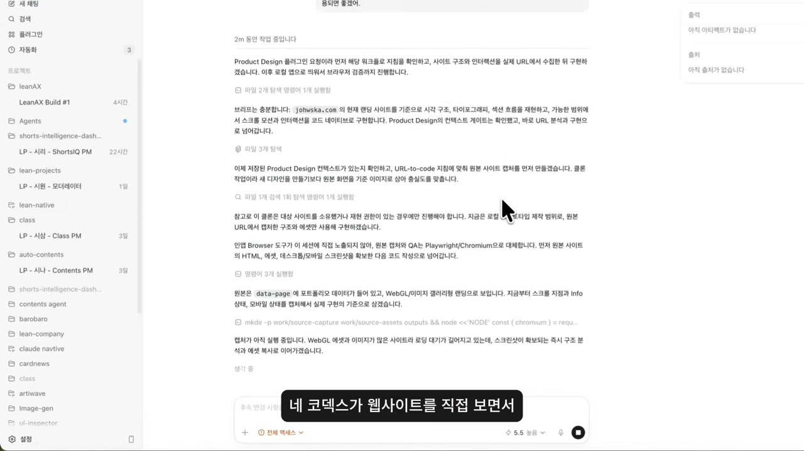

## AI가 'AI티'를 벗기 시작한 자리

화자가 먼저 깔아두는 전제가 있다. 웹사이트나 앱 UI 디자인도 이제 AI가 많은 부분을 대체하고 있고, 클로드 디자인이나 구글 스티치 같은 도구들이 크게 업데이트되면서 "AI티를 벗은 디자인 구현이 가능해졌다"는 것이다. 여기서 'AI티'라는 표현이 흥미롭다. 한동안 AI가 만든 화면에는 묘한 어색함이 있었는데, 그 어색함이 지워지기 시작했다는 게 화자의 출발점이다.

하지만 곧바로 단서를 단다. 도구가 아무리 좋아져도, 디자인 도메인 지식이 부족하거나 사용자 경험의 구조 설계가 부족하면 결국 한계에 부딪힌다는 것이다. 그래서 오늘의 주제는 좁다. **디자인 지식이 부족해도 레퍼런스만 있으면 똑같은 디자인을 만들어주는 플러그인 두 가지**. 대상도 분명히 못 박는다. 이미 디자인을 잘하는 사람은 참고만 하고, "디자인을 어디서부터 어떻게 시작해야 할지 막막한 사람"에게 초점을 맞추겠다고.

그리고 시작 전에, 화자는 강한 어조로 당부 하나를 끼워 넣는다. 오늘 소개하는 도구들은 기존 웹사이트나 레퍼런스 이미지를 그대로 구현해주는 '디자인 클로닝'에 최적화된 도구라는 것. 그러니 복제한 디자인을 그대로 쓰면 절대 안 되고, 참고용으로 틀만 잡는 개념으로 쓰되 반드시 수정해서 사용하라고 못 박는다. "만약에 그대로 사용을 하셔서 저작권에 걸리시거나 하셔도 저는 절대 책임지지 않습니다." 도구의 성능을 자랑하기 직전에 이 경고를 먼저 깔아둔다는 점이, 이 영상이 보여줄 복제력이 어느 정도인지를 역설적으로 예고한다.

## 디자인랭, 사이트를 '세 가지 언어'로 번역하는 통역기

첫 번째 도구는 디자인랭이다. 화자의 설명을 그대로 따라가면 이렇다. 웹사이트 링크를 넣으면 플레이라이트(Playwright)가 'AI의 눈'이 되어 그 사이트를 분석하고, 디자인 토큰, 피그마 변수, 테일윈드(Tailwind) 설정, DESIGN.md, 그리고 클로드 코드나 코덱스 같은 AI 코딩 에이전트가 이해할 수 있는 자료까지 뽑아주는 CLI 툴이다.

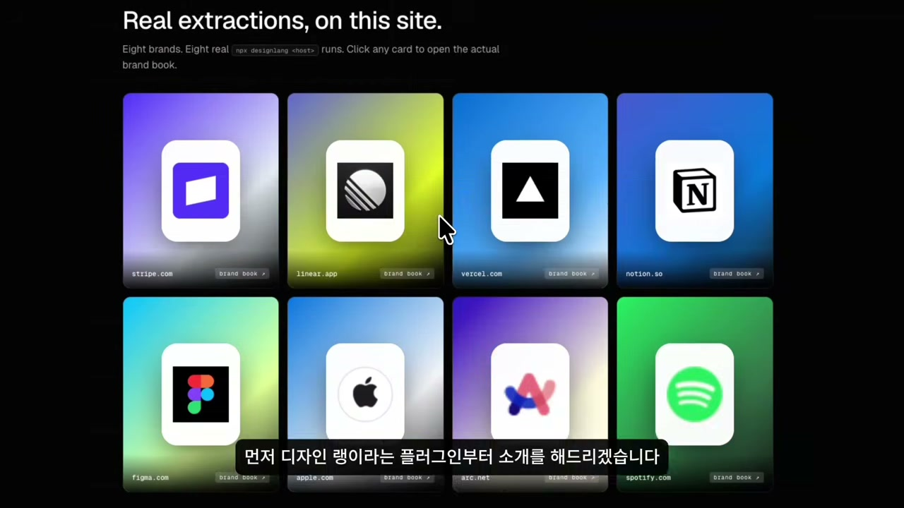

용어가 줄줄이 쏟아지지만, 화자는 곧바로 한 줄로 압축한다. 웹사이트 링크 하나를 **디자이너용 언어와 개발자용 언어, 그리고 AI용 언어로 번역해주는 자동 통역기**라고 생각하라는 것이다. 디자이너는 디자인을 만들고, 개발자는 같은 규칙으로 개발하고, AI는 그 규칙을 이해한 상태에서 코드를 생성한다. 디자인과 개발이 따로 노는 게 아니라 하나의 기준으로 묶이는 셈이다.

여기서 디자인 토큰이라는 말이 한 번 더 짚어볼 만하다. 화면에서 우리가 보는 건 완성된 색과 글꼴과 간격이지만, 그 밑에는 '메인 컬러는 이 값', '본문 글꼴은 이것', '여백 단위는 얼마'처럼 규칙으로 정리된 목록이 깔려 있다. 디자인랭이 사이트를 훑어서 뽑아내는 게 바로 그 규칙표다. 사람이 화면을 눈으로 보고 "비슷하게 만들어봐"라고 하는 것과, 색 · 글꼴 · 간격 값을 숫자로 받아 그대로 재조립하는 것은 정밀도가 다르다.

사용 전제 조건은 두 가지다. 첫째, 클로드 코드나 코덱스, 안티그래비티 같은 코딩 에이전트 도구를 쓰고 있어야 한다. 둘째, 디자인랭 CLI를 그 코딩 에이전트가 쓸 수 있게 설치해줘야 한다. 설치 자체는 간단하다고 한다. 고정 댓글의 링크를 복사해 코딩 에이전트에게 던지고 "이 리포지토리 설치해줘"라고 요청하거나, 공식 홈페이지의 설치 명령어를 터미널에 붙여 넣으면 된다. 화자는 헤르메스 에이전트에게 설치를 시켰다.

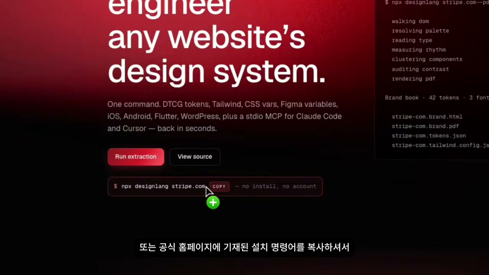

### 옵시디언을 복제하다: 거의 비슷한, 그러나 디테일은 사람 몫

설치 뒤 화자는 디자인랭이 어디까지 구현해주는지 확인 질문 몇 가지를 거치고, 레퍼런스 사이트 링크 두 개를 던졌다. 한 가지 단서를 단다. 이미지는 코드로 만들 수 없으니, 사이트에 들어가는 이미지는 GPT 이미지 젠으로 처리하라고 일러두고, 우선 히어로 섹션부터 구현하라고 시켰다.

첫 번째 대상은 옵시디언 원본 페이지다. 블랙 테마로 짜인 감각적인 디자인이다.

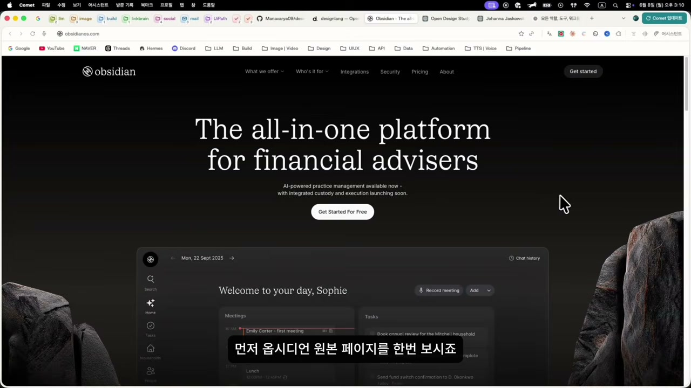

클론 결과는 어땠을까. 화자의 평은 이렇다. 폰트 스타일, 메뉴바 스타일, 백그라운드 이미지, 히어로 섹션, 스크롤 인터랙션까지 "전반적으로 거의 비슷하게 복제가 되었다." 다만 곧바로 한계도 짚는다. "디테일한 부분에 있어서는 사람의 터치가 더 들어가야 할 것 같다." 단순 복제라는 관점에서는 많이 비슷하지만, 그 마지막 한 끗은 여전히 사람의 몫이라는 것. 영상 도입부의 당부와 정확히 같은 결론이다.

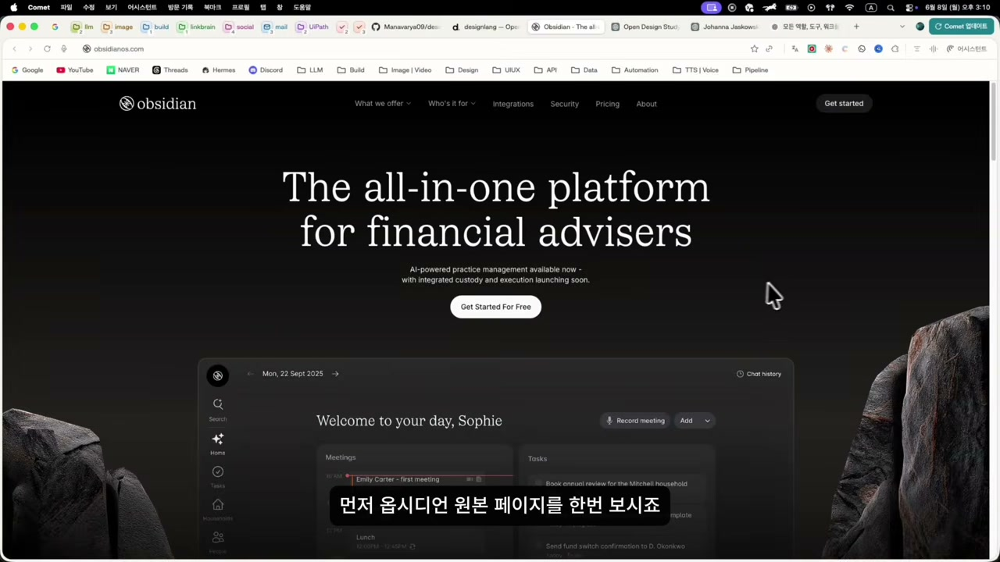

### 3D 얼굴은 어디까지, 도구의 천장을 본 장면

두 번째 사이트는 더 까다롭다. 마우스 움직임에 따라 배경의 3D 얼굴이 방향을 따라오는 모션이 적용된 사이트다. 화자는 보자마자 "엄청 감각적"이라고 감탄하면서도, 동시에 예측을 내놓는다. "제 생각에 이 사이트는 3D라서 얘가 구현을 못 해줄 거라고 생각합니다."

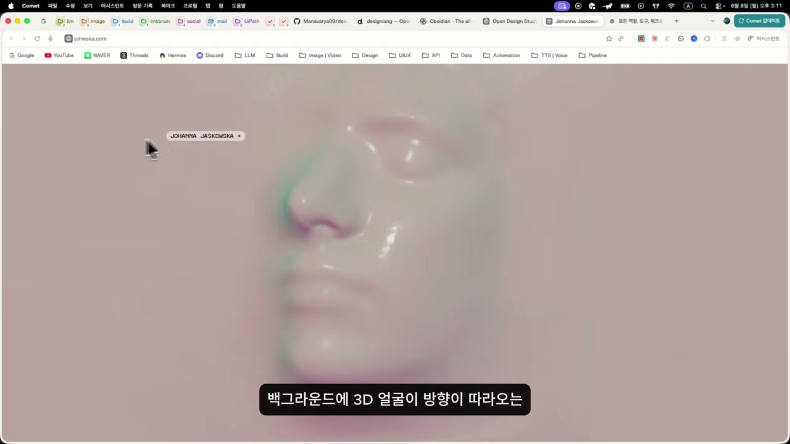

결과는 예측과 맞물린다. 배경 컬러와 마우스 커서를 따라오는 인터랙션은 비슷하게 구현됐지만, 배경의 얼굴은 3D가 아니라 이미지로만 처리됐다. 생김새도 좀 다르다. 다만 움직임에 따라 왜곡되는 효과는 살려냈다. 디자인랭의 천장이 어디인지가 이 한 장면에 드러난다. 정적인 레이아웃, 색, 폰트, 토큰처럼 '규칙으로 환원되는 것'은 강하지만, 실시간으로 렌더링되는 3D 같은 동적 구현 앞에서는 이미지로 흉내 내는 선에서 멈춘다.

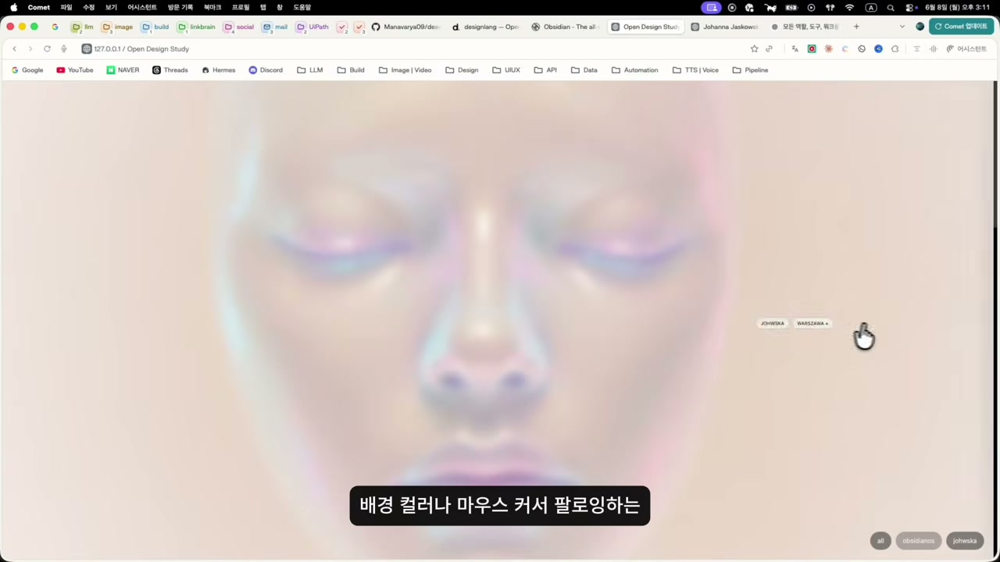

## 코덱스 프로덕트 디자인, 같은 벽 앞에서 다른 답을 낸다

바로 그 지점에서 두 번째 도구가 등장한다. 오픈AI 코덱스의 신규 기능인 프로덕트 디자인 플러그인이다. 화자는 같은 3D 얼굴 사이트를 이번엔 이 도구로 복제해보며, 디자인랭이 멈춘 자리를 코덱스가 넘는지 본다.

설치 흐름은 이렇다. 오픈AI 공식 사이트에서 코덱스 앱을 설치하고, 좌측 사이드 패널의 '플러그인'을 누르면 우측 창에 여러 플러그인이 뜬다.

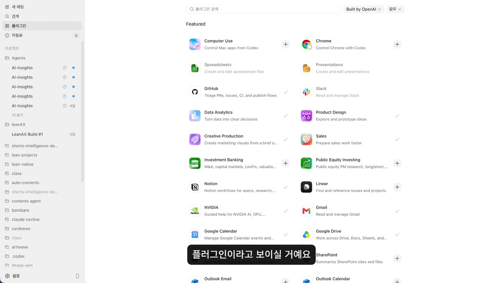

그중 오늘 쓸 것이 '프로덕트 디자인'이다. 이 플러그인은 정적인 이미지나 목업 사이트를 프로토타입으로 만들어준다. 화자의 풀어쓴 설명이 더 직관적이다. **웹사이트 사진을 넣으면 그 사진을 실제로 동작하게 만들어준다**는 말이다. 물론 실제 기능이 들어간 백엔드 구축은 별도 개발이 필요하다는 단서는 잊지 않는다.

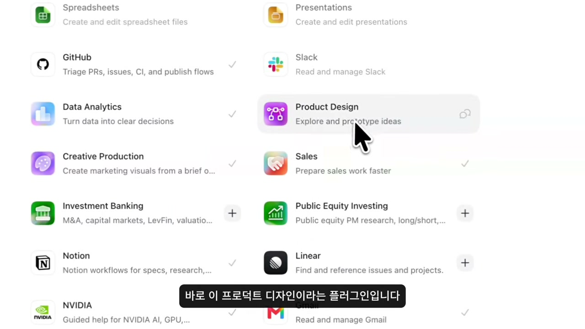

플러그인을 켜면 채팅창 상단에 'Product Design'이 분홍색으로 표시된다. 이 상태에서 레퍼런스 사이트 링크를 넣고, 화자는 일부러 단순하게 "그대로 구현해달라"고만 프롬프트를 넣는다. 테스트니까 의도적으로 짧게 던진 것이다.

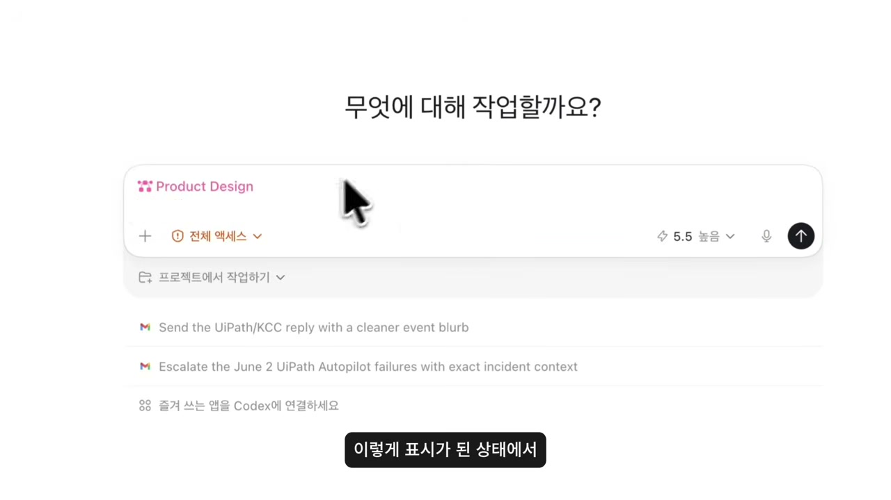

### three.js, 그리고 스스로를 검증하는 도구

여기서 디자인랭과의 결정적 차이가 갈린다. 코덱스는 three.js라는 3D 렌더링 툴을 써서 두상을 '진짜 3D'로 구현했다. 디자인랭이 이미지로 흉내 낸 바로 그 부분을, 코덱스는 실제 3D 객체로 만들어낸 것이다.

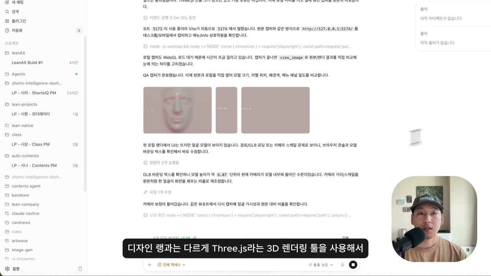

물론 한 번에 완성되진 않는다. 원본과 다른 부분이 남아 화자는 수정을 요청한다. 인터랙션은 비슷하게 됐지만 원본처럼 "수많게 쌓인 3D 느낌"이 잘 안 산다고 진단하고, 더 디테일한 디렉션을 준다. 작업 도중 상하축이 뒤바뀐 것을 발견하자, 기존 작업이 끝나면 순차적으로 처리되도록 스티어링을 걸어둔다.

이 과정에서 가장 인상적인 건 도구가 혼자 하는 일이다. 화자의 표현으로는 코덱스가 "스스로 대조를 하면서 차이점을 분석하고" 있다. 사람이 원본과 클론을 비교해 "이게 다르다"고 일러주는 게 아니라, 도구가 원본과 자기 결과물을 나란히 놓고 차이를 스스로 짚어낸다는 것이다. 단순히 코드를 뱉는 단계를 넘어, 자기 결과를 채점하고 고치는 루프가 도구 안에 들어와 있다.

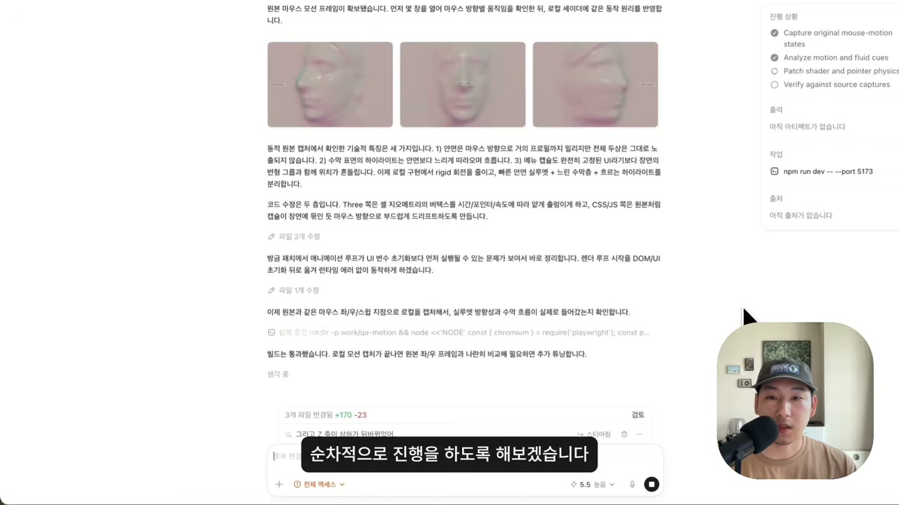

바로 이 대목에서 영상 맨 앞에 미리 들려준 그 감탄이 제자리를 찾는다. "코덱스 미쳤네요. URL 하나 줬는데 이미지를 생성하고, 3D를 생성을 해서 이렇게 모션 그래픽을 구현한다는 그 자체가 좀 놀랍습니다." 화자가 놀라는 지점은 결과의 완성도만이 아니다. 입력이 얼마나 빈약했는가에 있다. "프롬프트 한 줄 넣었잖아요. '그대로 만들어줘' 하나 넣었는데 이렇게 구현을 한다는 게 놀라운 것 같습니다."

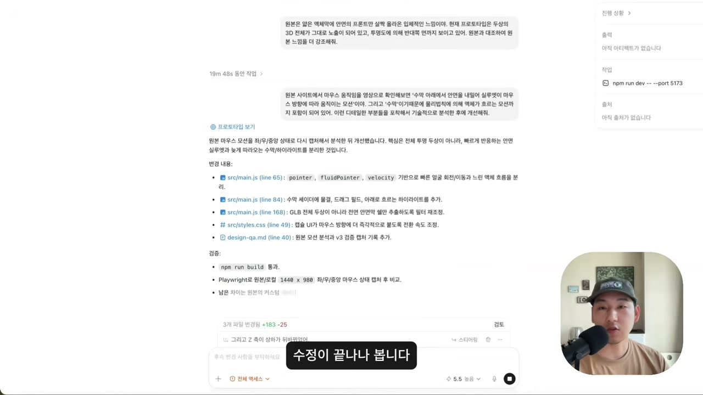

화자 스스로도 결과가 완벽한 복제는 아니라고 인정한다. 다만 그 레퍼런스 사이트 자체가 기술적으로나 미적으로 까다로운 디자인인데, 3D 생성과 모션 그래픽을 이 정도까지 끌어올린다는 게 놀랍다는 것이다. 도구의 천장이 어디인지를 보여주면서, 그 천장이 얼마 전보다 한참 높아졌음을 같이 말한다.

## 두 도구를 어떻게 나눠 쓸 것인가

영상의 진짜 결론은 마지막에 있다. 화자는 "이렇게 단순히 복제만 하면 내 디자인에 적용을 못 하잖아요"라고 되묻는다. 복제 자체가 목적이 아니라는 것이다. 이번 테스트로 확인된 건 **두 플러그인이 어디까지 구현해주는지, 그 기술적 한계의 지도**다. 그리고 그 한계에 맞춰 자기 디자인을 설계하면 된다는 게 핵심이다.

구체적인 분업안도 내놓는다. 먼저 디자인랭으로 웹사이트를 복제하면 디자인 토큰까지 복제되니, 마음에 드는 컬러를 지정하고 컬러톤을 바꾸거나 폰트 스타일을 바꾸거나 레이아웃을 조금씩 조정하는 식으로 손본다. 그리고 3D나 모션 그래픽을 넣고 싶으면 코덱스의 프로덕트 디자인 플러그인을 쓴다. 정적인 디자인 시스템의 토대는 디자인랭, 동적인 3D · 모션은 코덱스. 두 도구의 천장을 직접 확인했기에 나올 수 있는 역할 분담이다.

코덱스 프로덕트 디자인의 강점도 한 번 더 짚는다. 만든 프로토타입을 바로 피그마로 보내거나 링크가 있는 사이트로 공유할 수 있고, 주석을 써서 수정하고 싶은 요소를 하나하나 선택해 고칠 수 있다. 화자의 말처럼 "진짜 디자인 툴처럼 업데이트가 되었다."

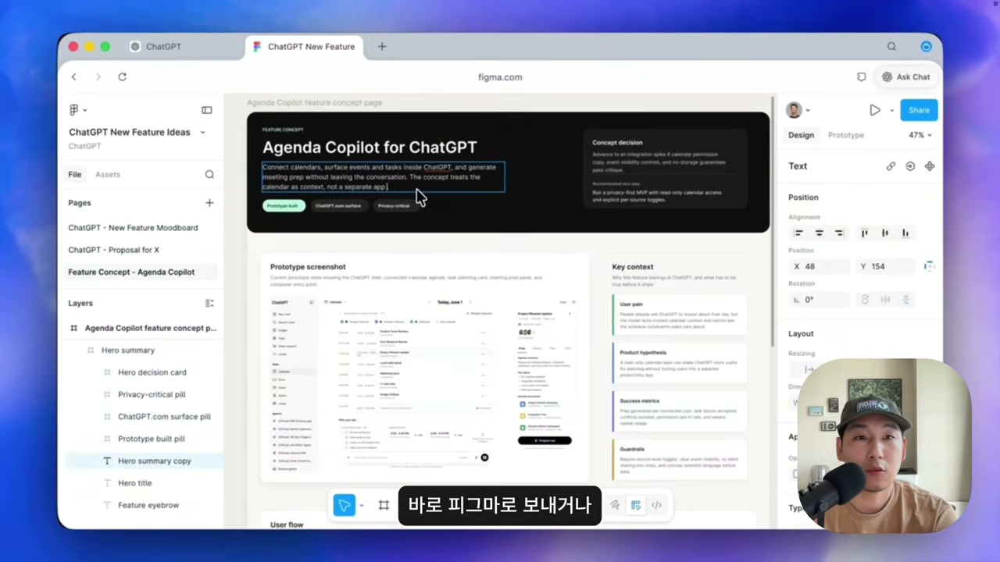

화자는 자신도 새 기능이라 아직 많은 테스트를 하지 못했다며 영상을 닫는다. 과장 없는 마무리다. 정리해보면 이 영상이 보여준 건 두 개의 복제 도구가 아니라, AI 디자인 도구가 넘은 선과 아직 못 넘은 선을 직접 손으로 그어본 기록에 가깝다. 정적인 화면은 토큰 단위로 복제되고, 3D 모션은 프롬프트 한 줄로 흉내 너머 실제 구현까지 갔다. 그리고 그 모든 시연을 감싸는 가장 단단한 문장은 여전히 도입부의 당부다. 복제는 틀일 뿐, 그대로 쓰지 말고 반드시 고쳐 쓸 것. 도구가 천장을 높일수록, 그 마지막 손질을 누가 하느냐가 오히려 또렷해진다.
