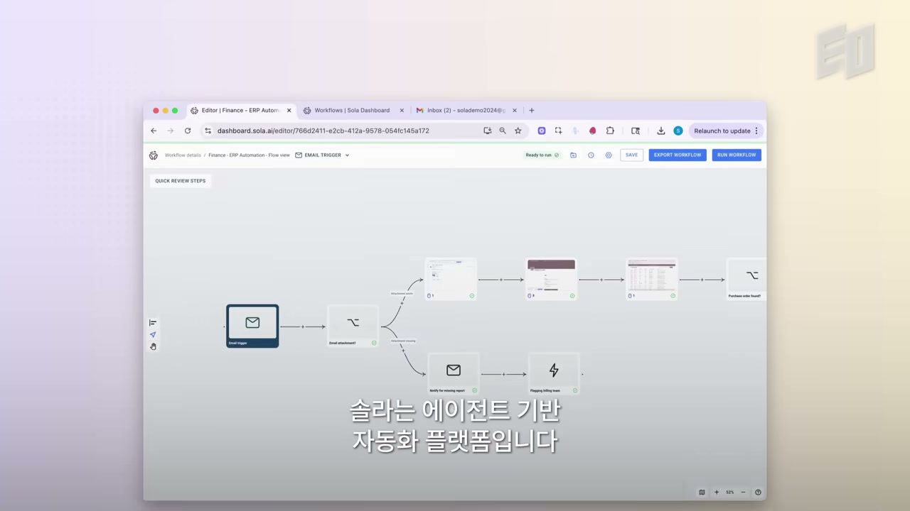
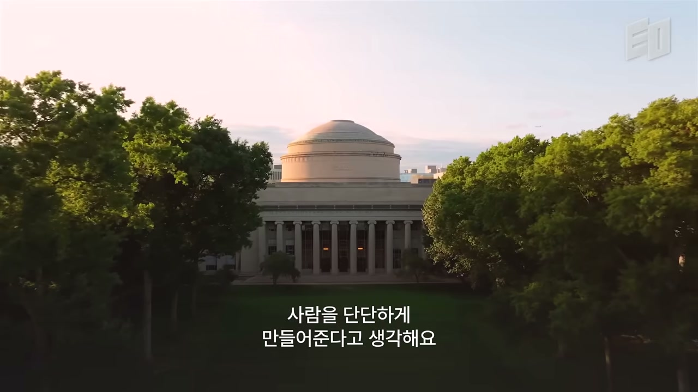
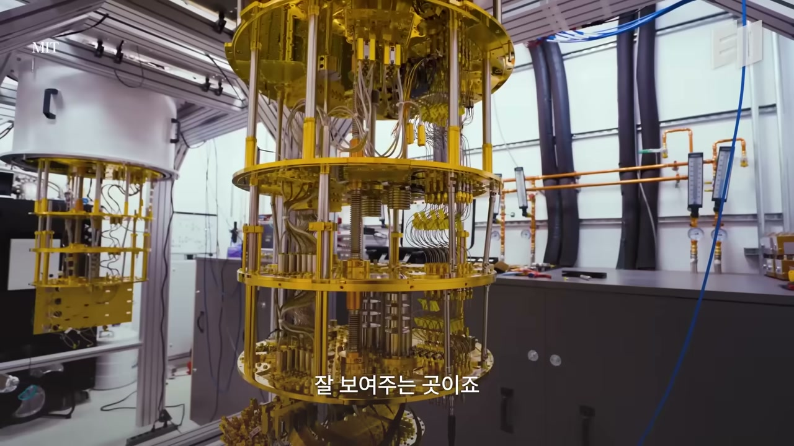
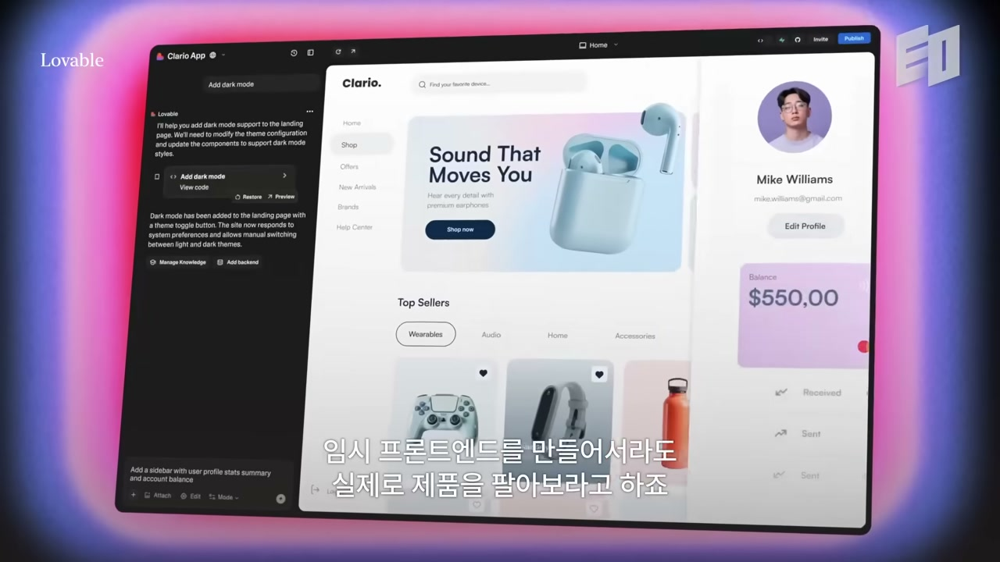
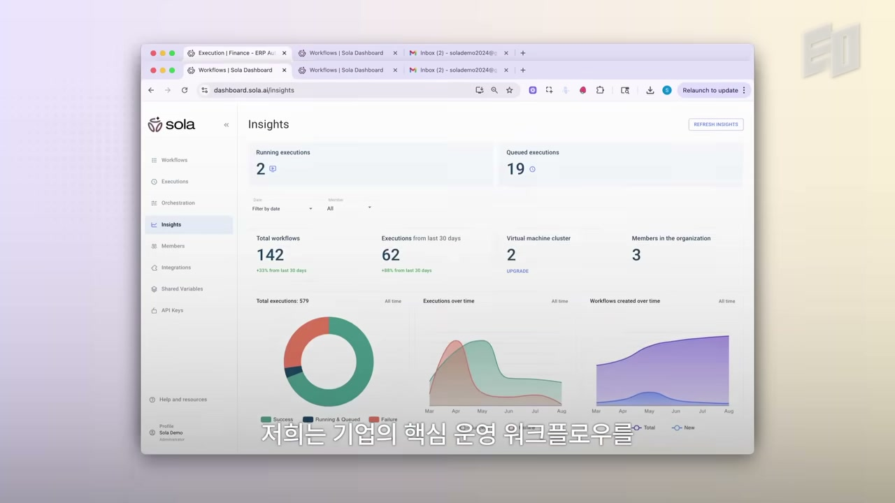

주말에 회사에 불려 나가면 솔직히 비참했다. 하루 아홉 시간, 열 시간, 주 5일. 헤지펀드의 최연소 퀀트 리서처였고, 그 전에는 기업금융에서 숫자를 다뤘다. 일 자체가 싫었던 건 아니다. 다만 "내 것이 아니라는" 느낌이 가시지 않았다.

지금 Jessica Wu는 깨어 있는 거의 모든 순간을, 주 7일을 일한다. 그런데 한 번도 이렇게 행복한 적이 없었다고 말한다. 같은 사람이 같은 노동 강도를 두고 정반대의 감정을 느낀다. 차이는 노동량이 아니라 소유감이었다. 무언가의 한 조각을 직접 소유하고 바닥에서부터 키워 올릴 때, 흥분은 저절로 따라온다는 것이다.

그가 안정된 커리어와 스타트업 사이에서 고민하는 사람에게 건네는 조언은 단순하다. "옵셔널리티(선택지)가 있다면, 무엇이 너를 행복하게 하는지, 매일 아침 출근이 설레는지, 그 일에서 충만함을 느끼는지를 따라가라." 그는 자신이 아직 젊다는 것도 옵셔널리티를 더해준다고 말한다. 선택할 여지가 있을 때, 그 여지를 무엇에 쓰느냐. 커리어 조언이 거기서 출발한다.

## 감정이 아니라 확률로 결정한다

흥미로운 건, 이렇게 "느낌"을 따르라고 말하는 사람이 동시에 가장 비감정적인 의사결정법을 설파한다는 점이다.

Jessica는 자신이 원래 매사를 수치로, 표준화된 방식으로 사고하는 사람은 아니라고 인정한다. 오히려 그 반대에 가까웠다. 그래서 한 어드바이저가 "금융권에서 몇 년 보내보라"고 권했을 때 그 조언을 받아들였다. 트레이딩이 가르치는 사고방식이 특별하다는 이유에서였다. 금융, 특히 트레이딩은 철저히 객관적이어야 하고, 모든 일에 확률을 계산하게 만든다.

몇 년간 금융권에서 일하며 그에게 남은 건 바로 그 객관성이었다. 계산하고, 따져보고, 매우 합리적인 방식으로 생각을 끝까지 밀어붙이는 습관. 그리고 이게 스타트업에서 의외로 강력한 무기가 된다.

스타트업은 감정적인 일이다. 그래서 늘 제1원리(first principles)로 돌아가 통계적으로 사고하려 애쓰는 게 의사결정에 큰 도움이 된다고 그는 말한다. 추상적으로 들리지만 그가 드는 예는 구체적이다. 거대한 배포 건을 앞에 두고 저울질해야 할 때, 혹은 어떤 기능에 자원을 쏟을지 정해야 할 때. 이런 것들은 모두 더 합리적인 방식으로 지도에 그려질 수 있다.

> "이 특정 고객이 이 특정 날짜까지 전환될 확률은 얼마인가? 내가 트레이드오프하고 있는 것은 무엇인가?"

본인도 "완벽한 수학은 아니다"라고 단서를 단다. 핵심은 정밀한 계산이 아니라 프레임이다. "이 고객이 그냥 좋으니까 같이 일하고 싶다"는 식으로 결정하지 않게 막아주는, 통계적 사고의 틀. 사람들이 흔히 포커에서 많은 걸 배울 수 있다고 말하는데, 그게 스타트업 세계에 그대로 적용된다고 그는 본다. 결국 상당 부분은 확률을 따지고, 합리적이 되고, 그렇게 최선의 방향으로 결정을 내리는 일이다.

직관이나 애착이 아니라, 트레이드오프를 확률의 언어로 펼쳐 놓고 보는 것. 제목이 약속한 "진짜 합리적인 의사결정법"은 그런 모양이다.

## Sola, 사람처럼 클릭하는 자동화

Jessica는 Sola의 공동창업자이자 CEO다. Sola는 에이전트 기반 프로세스 자동화(agentic process automation) 플랫폼으로, 기업이 가장 중요한 운영 워크플로우를 AI로 자동화하도록 돕는다. 기존 RPA보다 훨씬 쉽고 빠른 방식이라는 게 그의 설명이다.

여기서 RPA는 로봇 프로세스 자동화(robotic process automation)를 뜻한다. RPA 도구는 인간이 하는 방식 그대로 워크플로우를 복제해 수작업을 자동화한다. 마우스를 움직이고, 무언가를 타이핑하고, 클릭하고, 브라우저와 데스크톱 애플리케이션을 사람처럼 다룬다. API로 깔끔하게 연결하는 게 아니라, 화면 위에서 사람의 동작을 흉내 내는 방식이다.

Sola는 YC를 거쳐 약 2년 전 시작됐다. 이후 Conviction의 Sarah Guo가 리드한 시드 라운드를 받았고, 가장 최근에는 엄청난 기업 고객 트랙션에 힘입어 A16Z가 리드한 시리즈 A를 받았다. 2026년 들어 매출은 5배가 됐고, 플랫폼 실행량은 연초부터 매달 두 배씩 늘고 있다. 고객사에는 Fortune 100, Am Law 100, 그리고 물류와 헬스케어의 대형 비상장 기업들이 포함된다.

이 추상적인 수치를 구체로 옮기면 이렇다. 고객들은 Sola로 인보이스를 보내고 외상매입금을 처리한다. 배송을 내보내고, 환자 데이터를 입력한다. 전부 그 회사의 운영에서 빠지면 안 되는, 가장 핵심적인 작업들이다.

## MIT, 그리고 "방에서 가장 멍청한 사람"

Sola의 씨앗은 학교 밖이 아니라 학교 안과 밖의 대비에서 나왔다.

고등학생 때 Jessica는 MIT를 몇 번 방문했다. 그가 MIT에 대해 하는 말은 시설 자랑이 아니라 한 가지 경험에 관한 것이다. "당신이 그 방에서 가장 멍청한 사람"이 되는 경험. 배울 게 많은 사람들에게 둘러싸여 있을 때가 가장 재미있다는 것이다.

MIT는 영화에 묘사된 그대로가 실제로 펼쳐지는 유일한 곳이라고 그는 말한다. 앞마당에서 롤러코스터를 만드는 사람들이 있고, 기숙사 지하에서 모델을 학습시키는 사람들이 있다.

이 환경이 한 일은 분명하다. MIT가 "기술적으로 얼마나 어려운 것까지 갈 수 있는지에 천장을 올려놓는다"는 것. 2년간 회사를 운영하며 대학 졸업 후 온갖 것을 겪었지만, 정말 어려운 문제 하나를 붙들고 이렇게 많은 뇌세포를 써본 적은 없었다고 그는 말한다.

여기서 그가 후배들에게 주는 조언은 두 가지로 압축된다. 첫째, 할 수 있는 한 빨리 모든 것에 뛰어들어라. 둘째, 최전선에서 연구하는 사람들 곁에서 가능한 한 많은 시간을 보내라. 사람들이 연구하는 새로운 것들을 직접 배우고, 그 연구를 하는 사람들과 시간을 보내는 것. 프런티어에 있는 것을 최대한 흡수하는 습관을 들이면, 매주 새 모델이 나오고 모든 게 빠르게 변하는 오늘날 같은 환경에서 훨씬 잘 적응하게 된다는 논리다.

그리고 기술적 배경이 주는 가장 실질적인 자산은 따로 있다. 문제를 아주 쉽게 잘게 쪼개는 능력이다. 풀려는 문제를 단순하게 전달할 수 있으면 푸는 일 자체가 훨씬 쉬워진다. 매주 새 모델이 나오는 풍경 속에서, 늘 "우리가 고객을 위해, 사용자를 위해 진짜 풀려는 게 무엇인가"로 되돌아오는 것. 사람들이 말로 호소하는 표면의 문제가 아니라 그 아래 뿌리 문제까지 좁혀 들어가면, 그때 비로소 엄청난 가치를 전달할 수 있다고 그는 말한다.

## 두 번의 운 좋은 엿보기

Jessica는 스타트업을 하기 전까지 자신이 스타트업을 하고 싶은지조차 몰랐다. 벤처에서도 일해봤고, 헤지펀드 몇 곳을 거쳤다. 창업은 처음부터 계획된 길이 아니었다.

문제의 씨앗은 그 헤지펀드 중 한 곳에서 싹텄다. 그곳에는 아주 오래된 브로커리지 소프트웨어 위에 쌓아 올린 시스템을 다루는 수작업이 많았다. 당시 Jessica는 그 일을 자동화하려고 RPA 도구를 쓰고 있었다. RPA라는 분야가 얼마나 큰지도 잘 몰랐던 시절이다. 다만 한 가지는 알게 됐다. 큰 회사들에는 수작업이 엄청나게 많은데, 정작 쓰기 쉬운 좋은 도구는 없다는 것. 컴퓨터과학 배경이 있는 그조차 간단한 브라우저나 데스크톱 자동화 하나 만드는 게 정말 어려웠다.

공동창업자도 거의 똑같은 경험을 했다. 그는 MGH(매사추세츠 종합병원)에서 병원 시스템을 구축하고 있었는데, 거기서도 아주 낡은 도구를 써야 했고 그게 얼마나 깨지기 쉽고 구현하기 어려운지에 똑같이 놀랐다.

두 사람이 본 건 같은 것이었다. MIT 안에서는 모든 것에 API가 있어 서로 맞물리고, 자동화를 아주 쉽게 만들 수 있는 "테크 친화적" 세계에 산다. 그런데 학교 밖 대부분의 회사들은 서로 연결되지 않는 수많은 시스템을 오가며 지독히 수작업으로 일한다. 운영을 담당하는 사람들은 스프레드시트, 내부 포털, 외부 시스템, 파일, 그 사이의 거의 모든 것을 건드린다. Jessica는 이걸 "현실 세계의 일이 실제로 어떤 모습인지에 대한 두 번의 정말 운 좋은 엿보기"라고 부른다.

YC에 들어갔을 때도 그들은 뚜렷한 아이디어 없이 시작했다. 첫 한 달가량은 그저 무엇을 만들지 알아내는 데 썼다. RPA 공간이 흥미로웠던 이유는 명확하다. 그 문제가 어떻게 생겼는지, 어떻게 풀고 싶은지를 아주 잘 이해하고 있었기 때문이다. RPA는 크고, 영원하며, 분명한 문제다. 거기에 AI를 현실 세계의 엔터프라이즈에 결합하는 일, 그리고 반대편의 온갖 기술적 모델 개선들이 맞물리는 조합이 그들을 끌어당겼다.

## 한 줄도 짜기 전에, 먼저 판다

YC에서 받은 조언 하나를 Jessica는 "정말 받아들이기 어렵고, 직관에 반하는" 것이라고 부른다.

Sola의 MVP는 아주 단순했다. 오늘날과 똑같은 레코더로 워크플로우를 녹화해 업로드할 수 있었지만, 지금과 달리 그 워크플로우가 무엇을 하는지 잘 펼쳐 보여주지 못했다. 실행하면 그저 자기 컴퓨터 위에서 같은 단계를 그대로 반복할 뿐이었다. 그들이 바랐던 만큼 똑똑하지도, 쓰기 쉽지도 않았다.

YC가 가르친 건 제품을 다 만든 뒤 파는 게 아니었다. 정반대였다. YC는 무언가를 팔아보라고, 정말 강하게 밀어붙였다. 작동하는 제품이 없어도 Lovable 같은 걸로 가짜 프런트엔드를 띄워놓고 일단 팔러 나가라는 것이다.

논리는 이렇다. 무언가를 만들 때 자신이 옳은 방향으로 가고 있는지 알기 가장 어렵다. 그걸 알 수 있는 가장 분명한 신호는 사람들이 돈을 내느냐, 그리고 계속 내느냐다. 그래서 "6개월 들여 제품부터 만들지 말고, 먼저 팔아서 통하는지 보라"는 것이다. 그 과정에서 다리 몇 개쯤 태워먹을 수도 있다. 그래서 본인도 "사람마다 결과는 다를 수 있다"고 단서를 단다. 하지만 적어도 "이 사람은 이걸 위해 돈을 낼 것이다, 많은 사람이 돈을 낼 것이다, 나는 진짜 의미 있는 문제를 풀고 있다"는 아주 선명한 그림을 얻게 된다.

Sola의 첫 고객은 실제로 YC 무렵, 바로 이 "존재하지 않는 제품을 파는" 단계에서 만났다. 잘한 점은 정직했다는 것이다. 이 물건은 아직 없지만 몇 달 안에 생길 거라고 솔직히 말했고, 고객은 "좋아요, 생기면 다시 얘기합시다"라고 답했다.

> "평생 너는 무언가를 끝낸 다음에 팔거나 발표하라고 배운다. 그런데 이건 거의 정반대다. 만들 수 있는 가장 최소한의 가짜 버전을 띄워놓고, 가서 팔고, 좋으면 그때 돌아와서 만들어라."

물론 한계도 분명히 한다. 이 "가짜 첫 판매"는 회사가 조금 커지면 좋은 방식이 아니다. 가짜 기능을 팔아선 안 된다. 다만 사고방식 자체는 그 뒤에도 유효하다. 옳은 제품을 만들고 있을 때조차, 여러 방향으로 실험하고 다른 목업을 만들어보고 고객과 이야기하고 무언가를 내놓은 다음 거기서부터 다듬어가라는 것. 그리고 만약 팔아버렸다면, YC의 조언은 "지하실에서 일주일 동안 코딩해서라도 내놓으라"는 것이다. 받아들이기 쉬운 조언은 아니지만, 적어도 이걸 애초에 해야 하는 일인지에 대해 아주 선명한 예 혹은 아니오를 준다.

## 작은 팀이 거대 고객을 이기는 법

확률과 트레이드오프가 큰 결정을 가른다면, 작은 회사가 거대 고객을 붙드는 힘은 다른 데서 온다. Jessica가 가장 좋아하는 책 중 하나는 『Delivering Happiness』다. 작은 것들이 중요하고, 고객 감동(customer delight)이 일종의 북극성이 된다는 이야기다. 그런데 그 감동은 "제때 끝냈다" 같은 하나의 형태로만 오지 않는다. 그걸 쌓는 방법은 백만 가지가 있다.

수십 년, 어쩌면 수백 년 된 회사에게 자신의 가장 중요한 운영을 맡겨달라고 설득하는 일은 결코 쉽지 않다. 그런데 오늘날까지도 Sola 고객의 대부분은 입소문으로 들어온다. 기존 고객들이 경험에 너무 만족했기 때문이다.

작고 신생인 도구가 그 약점을 메우는 방법을 그는 이렇게 정리한다. 첫째, 정말 훌륭한 경험을 만들고 그들의 문제를 실제로 푼다(당연한 것). 둘째, 빠르게 출시하고 좋은 피드백을 잘 흡수한다. 이건 양방향이다. 좋은 피드백을 줄 고객을 고르는 동시에, 그들이 주는 피드백을 받아 요청한 것에 아주 빠르게 움직이는 것이다.

좋은 도구를 만드는 것 말고도, 더 전통적인 방식으로 엔터프라이즈 고객을 얻는 길이 있다고 그는 강조한다. 매우 지지적으로 굴 수 있고, 사람들의 말을 들어줄 수 있다. 고객을 위해 할 수 있는 가장 중요한 일은 듣는 것이라고 그는 말한다. 초기 디자인 파트너 일부와는 지금도 매주 통화를 한다. 주 단위로 피드백을 받아 빠른 속도로 전달한다. 바로 이런 것이, 도구가 더 낫다는 사실과는 별개로, 사람들이 낡은 레거시 강자 대신 스타트업을 고르게 만드는 요인이다.

이 헌신이 어디까지 가는지 보여주는 장면이 있다. 가장 큰 고객 중 하나가 2025년에 Sola 배포를 원했는데, 한 해 중 가장 조용한 시기에 하고 싶어 했다. 그 시기가 바로 크리스마스 당일이었다. 거래량이 적은 날이라서다.

> "팀에게 다시는 이걸 부탁하지 않기를 바란다."

그럼에도 그들은 다 같이 나와 그 주에 일했다. 그 고객은 오랫동안 Sola를 써왔고 내부에서 적극적으로 챔피언 역할을 해온 곳이었다. "배포가 크리스마스에 일어나야 한다면, 좋아, 거기서 하자." Jessica는 이런 순간들이 있었다고, 전반적으로 그들은 늘 기대 이상으로 가려 한다고 말한다.

## 다운되면 세상이 끝난다

왜 크리스마스에까지 나오는지를 이해하려면, 이 회사가 다루는 것의 무게를 알아야 한다.

사람들은 Sola를 믿고 자신의 운영을 맡긴다. 인보이스를 보내고, 외상매입금을 처리하고, 배송을 내보내고, 환자 데이터를 입력한다. 전부 치명적인 작업들이다. Sola를 만들며 그들이 깨달은 것 하나는, **자신들은 절대로 다운되어선 안 된다는 것**이었다. 그게 다운된다는 건, 수백 수천 명의 직원을 둔 진짜 회사의 그날 청구가 늦어진다는 뜻이다.

Jessica는 이 지점에서 자기 사업의 성격을 다른 AI 제품과 또렷이 구분한다. 카피를 생성하거나 영업 리드를 찾아주는 소비자용 AI 도구는, 다운되면 큰일이고 사람들의 일을 방해하지만 세상이 끝나는 건 아니다. 그러나 Sola 사업의 본질상, 다운되면 그건 일종의 세상의 끝이다. 그래서 그들은 항상 가동 상태를 유지하기 위해 정말 많은 일을 해왔다. 백만 번의 주말과 백만 번의 휴일을 사무실에서 보냈다.

그래도 그 길이 좋았다고 그는 말한다. 초기 신생 스타트업에 베팅하고 이 워크플로우들을 맡겨준 사람들에게 깊이 감사하며, 약속한 모든 것을 계속 지켜낼 수 있기를 바란다는 것이다.

## 롤러코스터를 견디는 법

마지막으로 그가 풀어놓는 건 창업이라는 경험 자체의 결이다.

스타트업을 만드는 일은 상상할 수 없을 만큼 어렵다고 그는 말한다. 롤러코스터 위에 있고, 아주 높은 고점과 아주 낮은 저점을 끊임없이 오간다. 게다가 그게 압축되어 있다. 아침이 인생 최고의 날이었다가 두 시간 뒤에는 들어본 적 없는 최악의 소식에 시달리는 일이, 거의 매일 일어난다.

그런데 창업자로서 배우게 되는 게 있다. 모든 것이 결국 평균으로 돌아온다는 것이다. 지금 괜찮게 느껴지지 않아도 결국엔 괜찮아질 거라는 머릿속의 안정감. 단, 두 가지 조건이 붙는다. 옳은 시장에서 만들고 있을 것, 그리고 곁에 옳은 사람들이 있을 것. 이 두 가지가 있으면, 큰 사고가 터지고 정말 나쁜 소식이 와도(팀원이 떠나거나, 영업하던 고객 측 챔피언이 거래 한가운데서 나가버리는 식의 일이) 결국은 견딜 수 있다.

그런 일들이 처음엔 정말 나쁘게 느껴진다. 하지만 자주 겪다 보면 익숙해지고, 한 발 물러서서 스타트업에서 벌어지는 일들을 전보다 훨씬 많이 소화해낼 수 있게 된다. 초기 팀도 그걸 함께 배우며 큰 그림을 볼 줄 알게 되고, 그게 정신적 평온에 훨씬 도움이 된다는 것이다.

이 평정심에는 이유가 있다. 하나는 시간이다. 그들이 만들려는 건 정말 큰 미션이라, 10년을 써도 문제될 게 없을 만큼 거대한 문제 공간이라고 그는 본다. 다른 하나는 믿음이다.

> "사람들이 하지 않아도 되는, 아주 수작업이고 지루한 일이 많다. 그걸 우리가 풀어줄 수 있다면 사람들은 충만하고 창의적이고 흥미로운 일을 할 수 있다."

기업들이 Sola 위에서 돌아가며, 수작업이고 반복적이고 아무도 하고 싶어 하지 않는 일들을 Sola에 맡기길 그는 바란다. 그래서 사람들이 그렇게 비워낸 시간을, 리더십과 전략과 의사결정 같은 일의 더 흥미로운 부분에 쓰게 되기를.

영상은 여기서 한 바퀴 돌아 처음으로 되돌아온다. 주말 출근이 비참했던 이유는 일이 많아서가 아니라 "내 것이 아니어서"였다. Sola가 없애고 싶어 하는 것도 정확히 그것이다. 사람을 비참하게 만드는, 자기 것이 아닌 기계적인 노동. 합리적인 의사결정이든 가짜 제품 먼저 팔기든 크리스마스 출근이든, 결국 한 곳을 향한다. 사람이 진짜 자기 것이라 느낄 만한 일에 시간을 돌려주는 것.
