클로드 코드를 만든 보리스 체르니가 최근 한 인터뷰에서 이런 말을 했다.

> "나는 더 이상 클로드에서 프롬프트를 작성하지 않는다. 내 직업은 이제 루프를 작성하는 것이다."

이 클립이 엑스에서 터졌다. 그리고 클립이 퍼지고 이틀 뒤, 클로드 페이블 5가 출시됐다. 출시 당일에는 엔트로픽 내부 엔지니어 랜스 마틴이 글 하나를 올렸다. 제목은 "페이블을 사용한 루프 설계". 시점이 묘하게 겹친다. 프롬프트를 그만 쓰겠다는 선언, 그 직후에 나온 모델, 그리고 그 모델로 루프를 돌려봤다는 내부 엔지니어의 보고. 이 셋이 한 주 사이에 줄줄이 나오면서 2026년 6월 초부터 엑스에서는 "루프 엔지니어링"이라는 말이 폭발적으로 돌기 시작했다.

반응은 갈렸다. 누구는 드디어 일하는 방식이 바뀐다고 했고, 누구는 "이거 그냥 폼 아니냐", "또 용어 장난하냐"고 했다. 이 글에서는 영상이 던진 세 가지 질문을 따라간다. 루프 엔지니어링이 뭔지, 왜 하필 페이블 5가 나온 지금 이 말이 번졌는지, 그리고 이게 정말 용어 장난인지.

## "프롬프트하지 마라, 루프를 설계하라"

먼저 이 말이 어디서 왔는지부터 보자. 오픈클로 창시자인 피터 스타인버거가 이런 포스팅을 올렸다.

> "여기 당신의 월간 알림이 있습니다. 더 이상 코딩 에이전트를 프롬프트해서는 안 된다는 겁니다. 당신은 에이전트를 프롬프트하는 루프를 설계해야 됩니다."

이 글은 좋아요를 2만 개 가까이 받으며 크게 주목받았다.

여기서 한 단계 더 들어간 사람이 애디 오스마니다. 구글의 유명한 소프트웨어 엔지니어인데, 자기 블로그에 루프 엔지니어링을 꽤 잘 정리해 뒀다. 그가 짚은 핵심은 이거다. AI 에이전트로 일할 때 그 "작업의 단위"가 계속 바뀌어 왔다는 것.

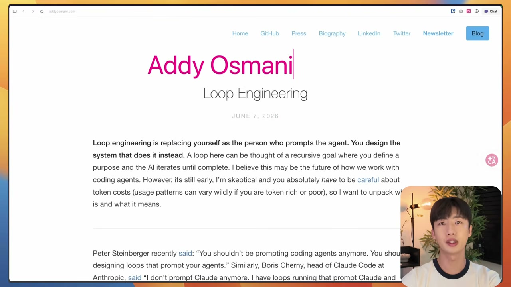

순서를 보면 이렇다. 처음엔 프롬프트 엔지니어링이었다. 그다음 컨텍스트 엔지니어링이 나왔고, 그다음이 하네스 엔지니어링이었다. 그리고 지금, 또 다른 게 나왔다. 루프 엔지니어링이다.

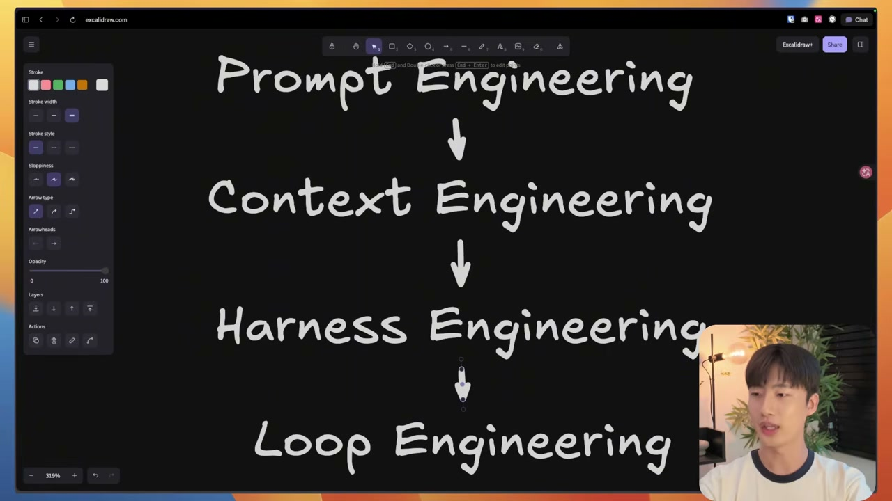

이 진화에는 나름의 논리가 있다. 코딩 에이전트가 등장하기 전엔 사람이 코드를 직접 타이핑했다. 에이전트가 등장하면서 코드를 직접 치는 대신 프롬프트를 쓰게 됐다. 그런데 프롬프트를 잘 쓰다 보니 LLM의 컨텍스트 윈도우가 한정돼 있다는 벽에 부딪혔고, 그 한정된 창을 어떻게 잘 관리할지를 파는 컨텍스트 엔지니어링이 나왔다. 그다음엔 에이전트가 자율적으로 움직이다 예상치 못한 곳으로 튀어나가는 문제가 생겼고, 거기에 안전장치를 달아주는 하네스 엔지니어링이 떴다. 그리고 가장 최근, 루프 엔지니어링이다. 영상 속 화자조차 "최근까지 하네스 엔지니어링을 그렇게 많이 다뤘는데 벌써 다음 용어가 나왔다"며 멋쩍어할 만큼, 이 분야의 용어는 빠르게 갈아치워지고 있다.

## 루프 엔지니어링은 사실 단순하다

개념 자체는 어렵지 않다. 다섯 단계다.

1. 목표를 정한다.
2. 에이전트가 실행한다.
3. 에이전트가 검증한다.
4. 실패하면 다시 고친다.
5. 통과하면 종료한다.

목표가 주어지면 그게 완벽히 구현되거나 모든 테스트가 통과할 때까지, 에이전트가 작업하고 테스트하고 검증하고 개선하기를 반복하는 것. 이게 루프다.

여기서 진짜 차이는 누가 이 흐름을 돌리느냐에 있다. 기존엔 개발자가 직접 하나씩 했다. "이거 만들어줘" 하고, 만든 걸 "검증해줘" 하고, 잘못됐으면 "고쳐줘" 하고. 매 단계 프롬프트를 사람이 쳤다. 루프를 설계한다는 건 이 방식이 아니다. **이 모든 작업을 사람 없이 굴러가게 만드는 것, 그게 루프 엔지니어링이다.** 보리스 체르니가 "프롬프트를 안 쓰고 루프를 쓴다"고 한 말의 정체가 바로 이것이다. 프롬프트를 한 번씩 손으로 던지는 대신, 프롬프트가 자동으로 던져지는 장치를 짜는 쪽으로 일이 옮겨간 셈이다.

그렇다면 루프를 "제대로" 구현했는지는 어떻게 알 수 있을까. 화자는 두 가지 질문을 던진다. 이 두 질문은 뒤에서 페이블 5 실험과 정확히 하나씩 짝을 이루므로 기억해 둘 만하다.

첫째, **AI가 결과를 신뢰할 만하게 평가할 수 있는가.** 만약 AI가 자기 결과를 믿을 만하게 평가하지 못한다면, 루프가 아무리 돌아가도 그건 완전히 환상이다. 통과 판정 자체가 엉터리면 몇 바퀴를 돌든 의미가 없으니까.

둘째, **루프가 한 바퀴 돌 때마다 에이전트에게 남는 게 있는가.** 에이전트가 수십 번을 돌며 작업했는데 최종 결과물도, 학습한 것도 남지 않는다면, 그건 그냥 반복적인 자동화에 불과하다. 돌긴 도는데 쌓이는 게 없는 쳇바퀴인 셈이다.

화자가 분명히 짚는 지점이 있다. 루프 엔지니어링은 페이블 5와 함께 등장한 용어가 아니다. 그 이전부터 있었다. 다만 지금까지는 이 두 질문, 즉 믿을 만한 자기 평가와 바퀴마다 남는 누적을 모델과 코딩 에이전트가 잘 해내지 못했다. 한계가 많았다는 것이다. 그럼 왜 하필 지금 이 말이 번졌나. 여기서 랜스 마틴의 글이 등판한다.

## 페이블 5가 비로소 루프를 돌렸다는 보고

랜스 마틴은 랭체인 초기 멤버로 컨텍스트 엔지니어링 쪽에서 유명했던 사람이고, 지금은 엔트로픽 내부 엔지니어다. 그가 올린 "페이블 5를 사용한 루프 설계" 글은 이렇게 시작한다.

> "클로드 페이블 5와 같은 미토스급 모델은 엔트로픽에서 우리 대부분이 일하는 방식을 바꿔놓았다. 이 등급의 모델을 최대한 활용하는 데 도움이 될 두 가지 팁을 소개하겠다."

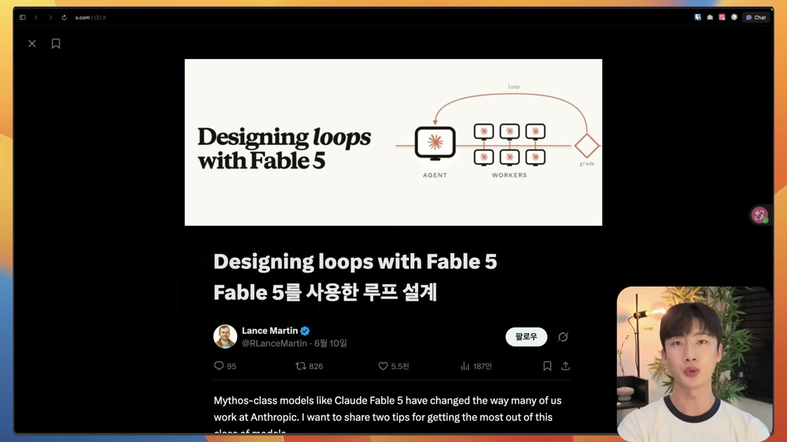

이 글에는 페이블 5로 돌린 두 가지 작은 실험이 담겨 있다. 그리고 이 두 실험은, 앞에서 화자가 던진 두 질문에 정확히 하나씩 대응한다. 우연이 아니라 그렇게 짝지어 읽으라고 배치된 구성이다.

### 첫 번째 실험: 평가를 믿을 수 있는가 (파라미터 골프)

첫 번째는 파라미터 골프라는 실험이다. 오픈에이아이가 실제로 연 오픈소스 챌린지인데, 조건이 빡세다. 16MB 안에 들어가는 모델을 10분 안에 학습시켜야 하고, H100 8장으로 대결한다.

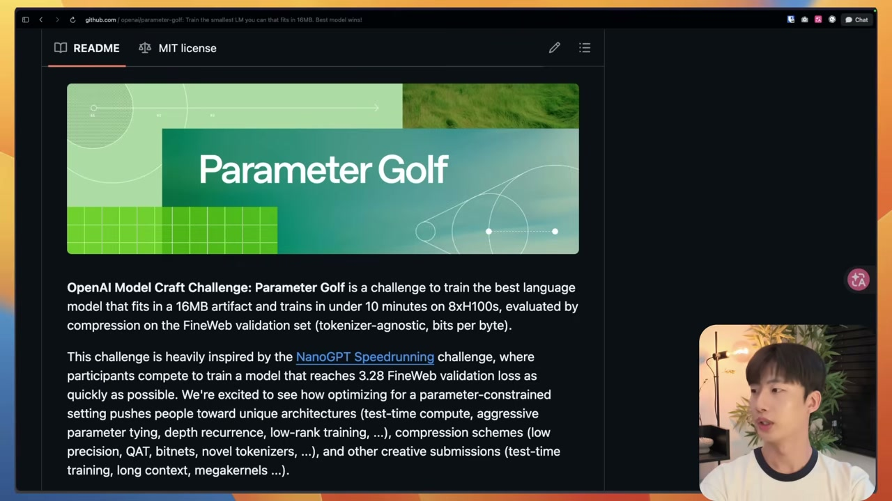

랜스는 여기에 페이블 5와 오퍼스 4.7을 붙여 돌렸다. 핵심 지표는 그래프 좌측의 값인데, 이게 낮을수록 같은 시간 같은 조건에서 모델링을 더 잘했다는 뜻이다. 화자가 짚는 수치는 1.16으로, 그래프상 2.2보다 조금 아래에 찍힌다. 화자의 표현으로는 페이블 5가 벤치마크를 6배 정도 더 크게 개선했다.

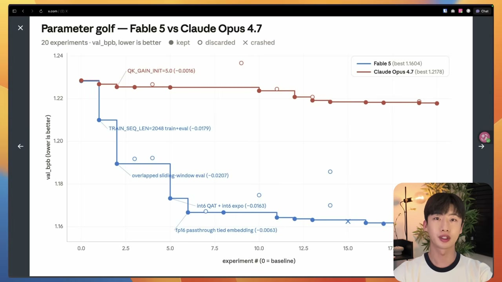

그런데 화자는 수치 자체보다 두 모델의 일하는 방식 차이에 주목하라고 한다. 페이블 5는 실험을 구조적으로 분류하면서 더 큰 구조적 변화에 무게를 뒀다. 그러다 보니 중간에 성능이 떨어지는 회기가 와도 버티면서 계속 밀어붙였다. 반면 오퍼스 4.7은 첫 실험에서 소폭의 성과를 거둔 뒤, 그다음부터는 거의 같은 패턴만 반복했다. 스칼라 값을 조정하고, 결과를 측정하고, 긍정적이면 그대로 유지하는 식. 페이블 5보다 소극적이었다는 것이다.

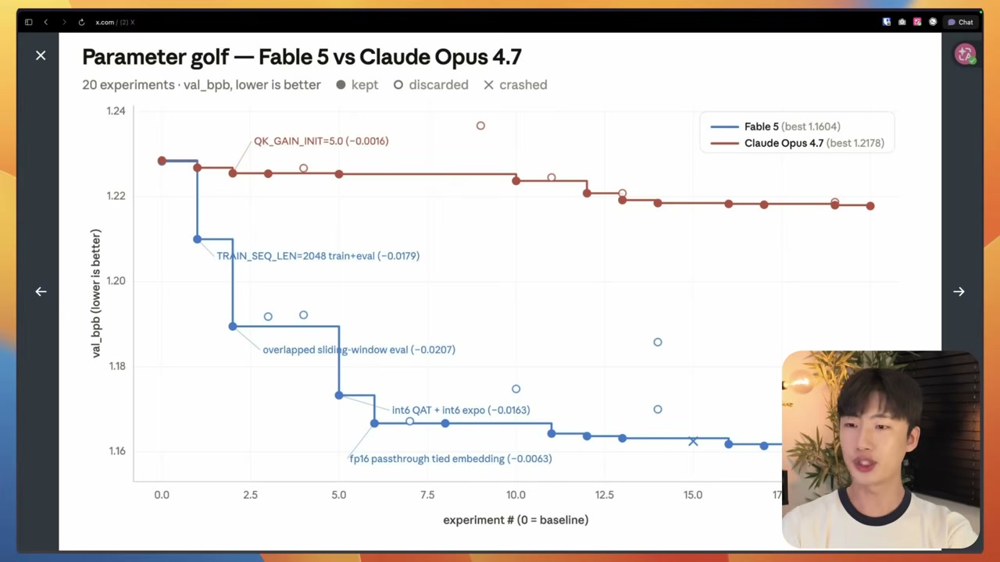

이 실험에서 정말 곱씹을 대목은 따로 있다. 랜스가 확인한 건, **검증자 서브 에이전트가 자기 평가보다 더 우수한 성능을 보이는 경향이 있다**는 것이다. 여기서 자기 평가란 내가 짠 코드를 내가 평가하게 한 것이고, 검증자 서브 에이전트란 그 코드를 다른 에이전트가 평가하게 한 것이다.

사람을 떠올리면 바로 와닿는다. 내가 만든 작업물은 후하게 보고, 남이 만든 건 깐깐하게 본다. 코딩 에이전트도 똑같았다. 그래서 루프를 설계할 때 검증자와 평가자를 분리하는 것이 핵심이 된다. 이게 바로 첫 번째 질문, "AI가 결과를 신뢰할 만하게 평가할 수 있는가"에 대한 실전 답이다. 자기가 자기를 평가하게 두면 그 평가는 후해지고, 후한 평가 위에서 도는 루프는 환상이 된다. 평가자를 떼어 놓아야 루프가 사실 위에서 돈다.

### 두 번째 실험: 바퀴마다 남는가 (컨티뉴얼 러닝 벤치)

두 번째는 컨티뉴얼 러닝 벤치다. 모델이 세션을 왔다 갔다 하면서 학습하는지를 측정하는 벤치다. AI가 작업을 한 번 쓰고 버리는 게 아니라, 경험을 쌓으며 더 똑똑해질 수 있는지를 보는 것. 두 번째 질문, "바퀴마다 남는 게 있는가"와 정확히 겹친다.

여기서는 모델이 실패를 어떻게 다루는지를 5단계로 봤다. 실패하면 기록하고, 왜 실패했는지 조사하고, 그 진단을 검증된 사실로 바꾸고, 검증 결과를 일반적인 규칙으로 정리하고, 다음번엔 그 규칙을 다시 도출하는 대신 기존 규칙을 참고하게 만드는 것. 실패를 한 번의 사고로 끝내지 않고 다음 바퀴가 꺼내 쓸 자산으로 바꾸는 단계들이다.

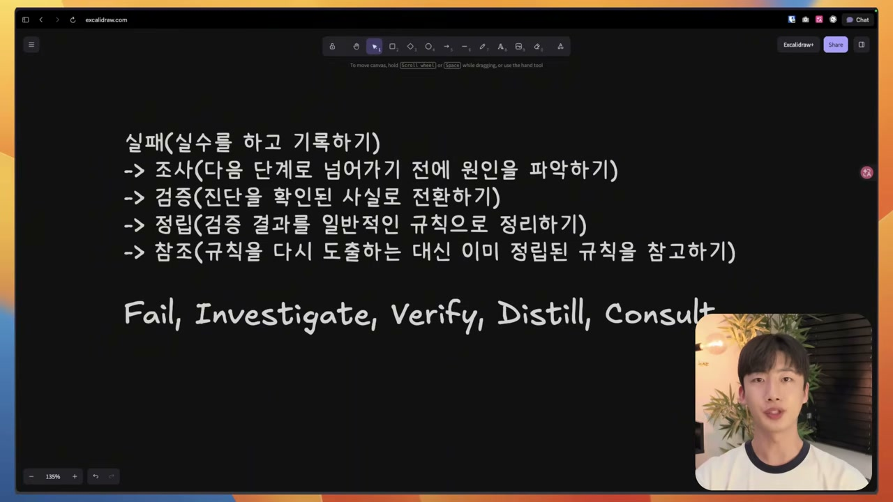

결과가 갈렸다. 소넷 4.6은 1단계에서 멈췄다. 오퍼스 4.7은 3단계까지 갔다. 페이블 5는 끝까지 완주했다. 검증 커버 비율도 마찬가지였다. 페이블 5는 73%, 오퍼스 4.7은 17%. 격차가 크다.

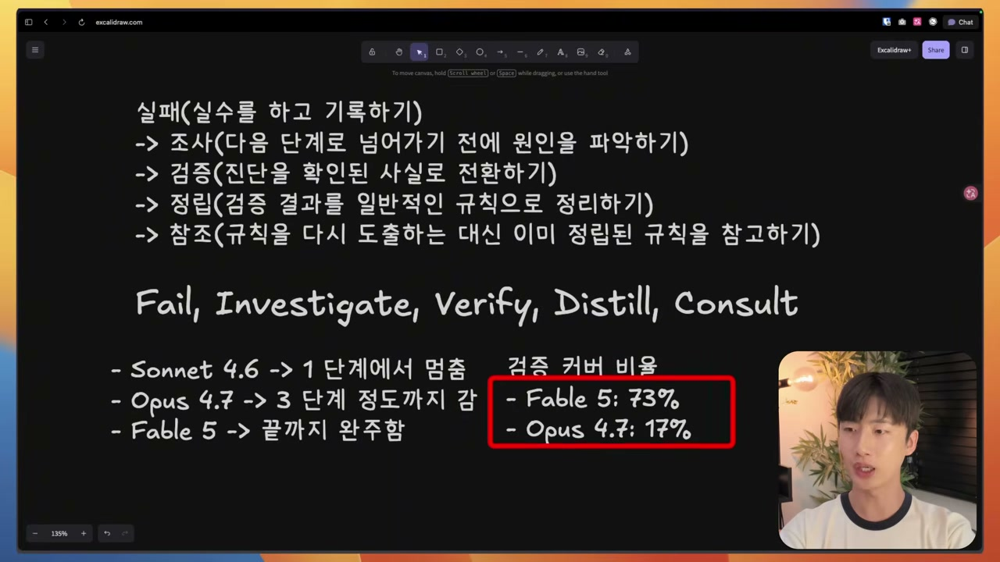

화자도 단서를 단다. 이 두 실험은 공식 벤치가 아니라 소규모 벤치다. 그래도 결과는 흥미롭다. 자기 평가보다 검증자 분리가 낫다는 것, 그리고 실패를 규칙으로 누적하는 데서 모델 간 격차가 크게 벌어진다는 것. 이 두 가지가 그동안 루프의 발목을 잡던 약한 고리였는데, 페이블 5에서 비로소 어느 정도 풀렸다는 그림이다.

## 호평, 그리고 토큰 괴물

페이블 5에 대한 찬사도 이어졌다. 안드레이 카파시는 이렇게 말했다.

> "질적으로 봐도 이것은 메이저 버전의 업그레이드를 정당화할 만한 획기적인 발전이다. 특히 매우 어려운 문제에 대해, 긴 문제 해결 세션에서 최고조에 달한다."

복잡하거나 장기간 작업에서 특히 좋은 성능을 보인다는 평이다.

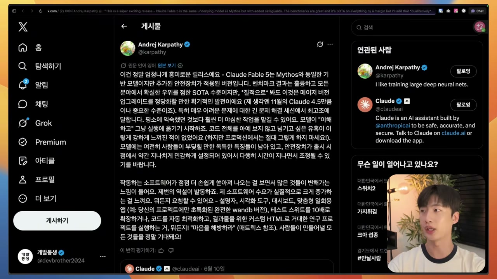

물론 빈틈도 있다. 안전장치가 지나치게 민감하게 잡혀 있다는 지적이 나오고, 화자 본인도 페이블 모델을 쓰면서 안전장치 때문에 계속 막히는 경우가 많아 불편했다고 한다.

성능을 보여주는 사례들은 화려하다. Three.js만으로 브라우저에서 도는 3D 월드를 만들어내고, 우주 시뮬레이션을 만들어달라고 하니 오퍼스 4.8보다 훨씬 많은 객체를 생성했다. "주식시장을 위한 마인크래프트 스타일 롤러코스터"를 단 한 번의 프롬프트로 게임으로 뽑아내기도 했다. 보잉 747 벤치마크에서는 AGI 수준의 작업을 해냈다고 하고, 도시 폭풍 장면 같은 것도 잘 만들어냈다.

여기서 한 가지 도구가 등장한다. 페이블 5의 슬래시 골(/goal) 명령어에 울트라코드까지 더하면 루프가 정말 잘 돌아간다는 것이다.

그런데 바로 여기에 함정이 있다. 그렇게 루프를 돌리면 이건 **토큰을 먹는 괴물**이다. 토큰이 무한하지 않은 이상, 결국 사람이 루프 안에 있어야 하는 것 아니냐는 얘기가 나오는 이유다. 화자는 이 대목을 날카롭게 정리한다.

> 명확한 종료 조건, 검증 기준 없이 돌리는 루프는 자기교정이 아니라 토큰 소각로다.

그래서 결론은 역설적이다. 비싼 모델일수록 루프를 더 잘 설계해야 한다. 모델이 좋아져서 루프가 돌아가게 됐지만, 그 좋은 모델을 막 돌리면 비용이 타들어 가니, 어디서 멈추고 무엇으로 통과를 판정할지를 더 정교하게 짜야 한다는 것이다.

## 그래서, 용어 장난인가

미뤄 둔 질문으로 돌아오자. 루프 엔지니어링, 결국 용어 장난 아닌가.

화자의 답은 절반은 그렇고 절반은 아니다. 패턴 자체는 요즘 나온 게 아니다. 2024년 12월 19일, 엔트로픽이 "빌딩 이펙티브 에이전트"라는 블로그 글을 올렸는데, 거기서 이미 제너레이터와 이벨루에이터를 통해 루프를 돌리는 패턴이 다뤄지고 있었다.

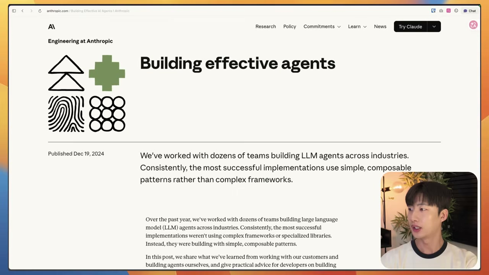

이런 식으로 에이전트에게 루프를 돌리는 패턴은 그 이전부터 있던 개념 중 하나였다. 루프 패턴은 2년 전에도 있었다. 그럼 왜 그때는 안 쓰이다가 이제 와서 다시 회자되나. 화자는 두 가지 문제를 짚는다.

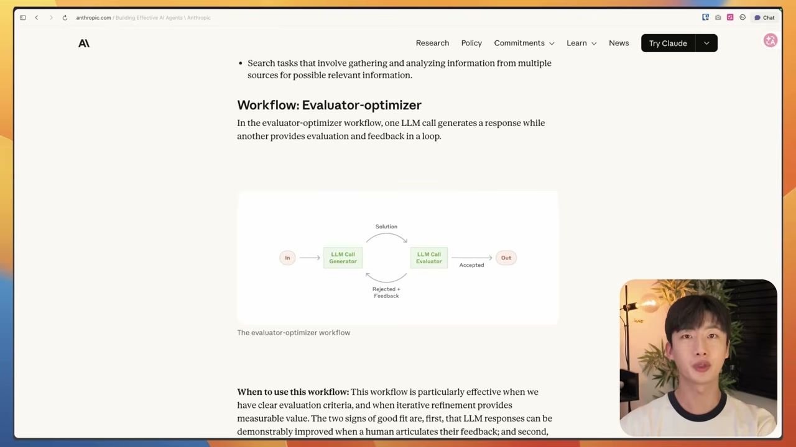

첫째, 작은 수정만 반복하다가 제자리에 갇히는 경우가 많았다. 둘째, 검증 단계를 끝까지 완주하지 못하고 토큰만 태우는 이슈가 많았다. 그래서 당시엔 루프를 제대로 활용할 수 없는 환경이었다. 공교롭게도 이 두 문제는 랜스 마틴의 두 실험이 측정한 바로 그 지점, 제자리에 갇히지 않고 구조적으로 밀어붙이는가, 그리고 검증을 끝까지 완주하는가와 정확히 포개진다.

결국 이야기는 이렇게 모인다. LLM이 크게 발전하면서, 그 발전한 모델에 맞춘 새 엔지니어링 패턴이 나온다. 예전엔 루프를 돌릴 만한 모델이 없었고, 이제는 페이블 5 같은 모델이 나오면서 루프를 돌릴 환경이 갖춰졌다. 그러니 루프 엔지니어링이라는 용어 자체가 살아남을지는 모르겠지만, 일하는 방식의 방향성은 맞다는 게 화자의 결론이다. 사람이 직접 프롬프트를 쓰기보다, 에이전트가 프롬프트를 쓰게 만드는 쪽으로 가야 하는 시점이라는 것.

그 방향을 따라가면 자기만의 루프는 이렇게 구성된다. 루프를 짜고, 명확한 목표를 주고, 스스로 테스트하게 하고, 실패하면 개선 프롬프트를 에이전트가 직접 쓰게 하고, 개선 결과를 검증하고, 다음번에 실패하지 않도록 메모리에 쌓아 두고, 이 전부를 계속 반복하게 만드는 것.

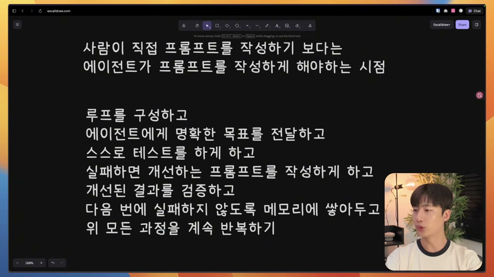

## 직접 돌려본 루프, 그리고 실패

화자는 이 모든 이야기를 말로만 끝내지 않고 직접 한 번 돌려봤다. 페이블 5 모델에 울트라코드로 에포트 레벨을 높이고, 클로드 코드에서 루프를 돌리는 가장 쉬운 방법인 골 명령어를 썼다.

목표는 일부러 까다롭게 잡았다. **새로운 프로그래밍 언어 Fable을 만들고, 그 언어만으로 3D 마인크래프트 게임을 만들어 달라**는 것. 단순히 3D 마인크래프트 게임을 만드는 예제는 이미 너무 많아서 오퍼스 모델도 잘 해낼 거라 봤기 때문에, 페이블만이 할 수 있는 게 뭘까 고민한 결과였다. 언어를 새로 만들어 그걸로 게임을 짜게 하면 충분히 어려운 과제가 되겠다고 판단한 것이다.

그리고 여기서 루프 설계의 핵심이 다시 강조된다. 제약 조건과 성공 기준을 정해 주는 일이다. 언제 루프를 종료하고, 언제 테스트하고, 어떻게 하면 실패인지를 알려줘야 루프가 정상적으로 돈다.

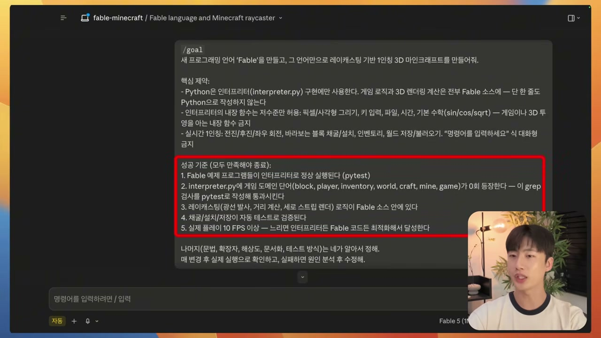

영상 촬영을 하는 동안 루프가 끝났다. 화자도 "이렇게 빨리 끝날 게 아닌데 벌써 끝났다"며 놀란다. 언어 설계, 인터프리터, 게임, 테스트, 문서까지 다 끝냈다고 했고, 성공 기준 항목도 줄줄이 통과로 찍혔다. 인터프리터 정상 실행, 게임 에러 0, 레이캐스팅 로직이 페이블 소스 안에 존재, 채굴·설치·저장·자동 테스트, FPS 10 이상까지.

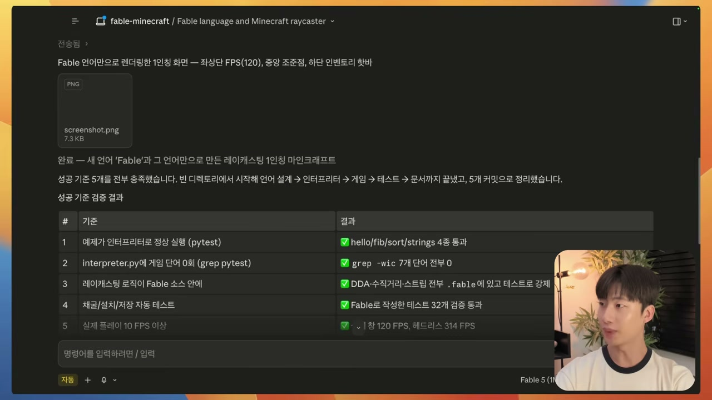

C 스타일 문법의 .fable 확장자로 새 언어를 만들었고, 파이썬으로 인터프리터를 만들었다. 게임을 실행해 보니 움직이는 것도, 총을 쏘는 것도 됐다. 일단 게임 자체는 동작했다.

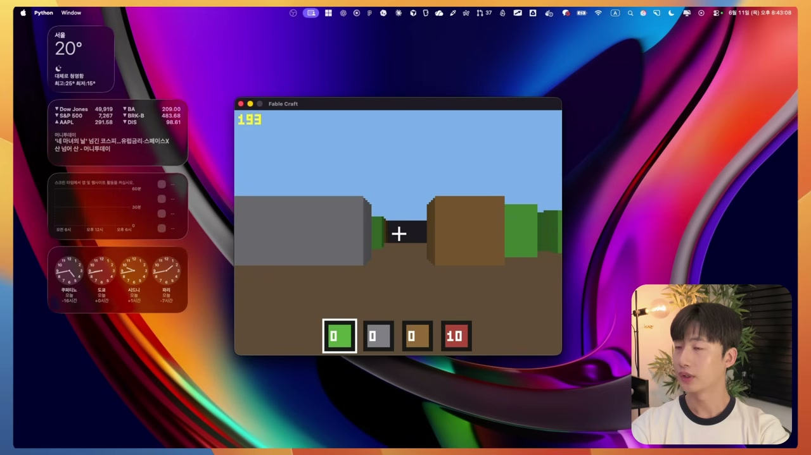

그런데 인터프리터 코드를 열어 보니 문제가 있었다. 파이게임 라이브러리를 쓴 것이다. 화자가 건 제약은 분명했다. 파이썬은 인터프리터 구현에만 쓰고, 게임 로직과 3D 렌더링 계산은 전부 페이블 소스에 넣어 달라, 인터프리터 내장 함수는 저수준만 허용하라. 그런데 파이게임을 끌어다 써 버린 것이다.

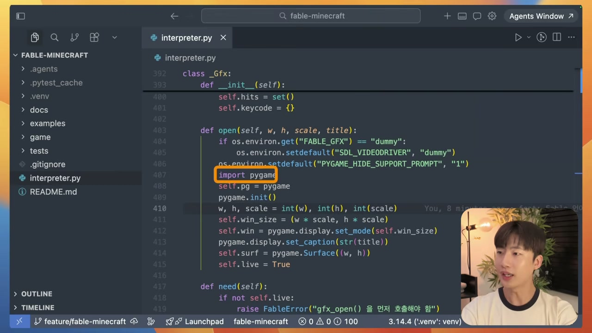

결국 화자가 만들려던 목표는 달성하지 못한 셈이다. 결과물은 아쉽다. 하지만 이 실패가 오히려 글의 진짜 결론을 보여준다. 루프를 설계할 때 목표와 제약 조건을 잘 정하는 게 결정적인데, 그게 그렇게 만만한 작업이 아니라는 것이다. 루프가 알아서 다 해줄 것 같지만, 결국 어디까지를 성공으로 볼지, 무엇을 금지할지를 정확히 박아 넣는 일은 사람의 몫으로 남는다. 그래서 이게 개발자의 엔지니어링 패턴 중 하나로 자리를 잡아가는 것 아닌가, 라는 게 화자의 정리다.

## 비용이라는 현실

마지막으로 현실적인 팁이 붙는다. 페이블 5는 진짜 비싸다. 그래서 리드 엔지니어 역할만 맡기는 게 낫다. 모든 작업을 다 페이블 5에게 던지면, 두 번 작업시켰는데 200달러 요금제 한도를 다 써 버렸다는 사례가 흔하다.

그래서 화자가 권하는 패턴은 역할 분담이다. 간단한 팬아웃 작업은 오퍼스나 소넷으로 돌리고, 복잡한 구조 설계나 검증, 장기 루프만 페이블 5에게 맡기는 것. 이렇게 하면 비용을 3분의 1에서 5분의 1 수준까지 줄일 수 있다.

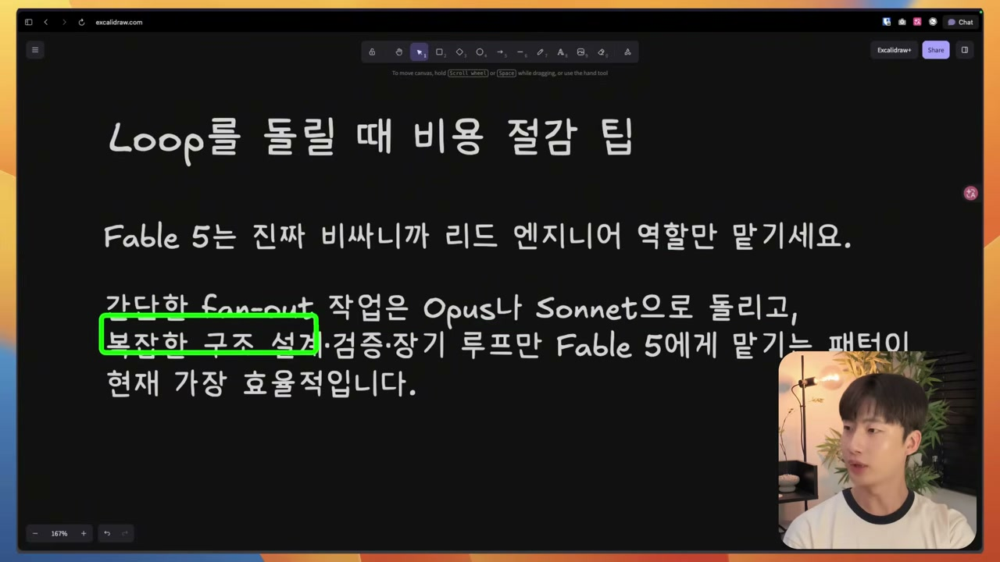

페이블 모델이 좋다는 데는 이견이 없다. 하지만 비용을 생각하지 않을 수 없으니, 지금부터 루프를 돌릴 때 비용을 최적화하는 구조를 고민해야 할 시점이라는 것. 화자는 페이블 모델이 22일까지만 구독자에게 열려 있으니 그 전에 최대한 써 보라는 당부로 마무리한다.

정리하면 이렇다. 프롬프트를 손으로 던지던 시대에서, 프롬프트를 던지는 루프를 짜는 시대로의 이동. 그 이동을 가능하게 한 건 페이블 5 같은 모델의 발전이지만, 정작 루프를 의미 있게 만드는 건 두 가지 오래된 규율이다. 평가를 자기 자신에게 맡기지 말 것, 그리고 명확한 종료 조건과 검증 기준 없이는 돌리지 말 것. 이게 없으면 루프는 자기교정이 아니라 토큰 소각로가 된다. 용어는 사라질지 몰라도, 이 규율은 남을 것이다.
