요즘 바이브 코딩 좀 친다는 사람들 사이에 이상한 기류가 흐른다. 프롬프트를 점점 쓰지 않는다는 것이다. 정확히는, 프롬프트를 고치는 일을 하지 않는다.

이상한 말이다. 우리는 지금까지 프롬프트를 잘 쓰는 게 바이브 코딩의 거의 전부라고 배웠다. 마법의 문장을 찾아 단어를 바꿔보고, "전문가처럼 행동하라" 같은 주문을 외우는 일. 그런데 정작 AI를 가장 가까이에서 직접 다루는 사람들은 그 반대편에서 다른 작업을 하고 있었다.

며칠 전, 앤트로픽의 엔지니어 랜스 마틴이 글을 하나 올렸다. 조회수가 200만을 넘겼다. 제목은 "페이블 5와 루프 설계하기". 핵심은 한 문장이다.

> 모델을 직접 조정하지 말고, 모델이 스스로 고치게 하는 루프를 설계하라.

루프가 점점 중요해지는 시대다. 그렇다면 루프란 대체 무엇인지, 왜 프롬프트보다 중요한지, 그리고 오늘 밤 당장 써먹을 수 있는 이야기는 무엇인지 하나씩 파헤쳐 보자.

## 조수석의 잔소리와 내비게이션

비유 하나로 시작한다. 운전하는 친구 옆에 앉아 끊임없이 잔소리하는 사람이 있다. "여기서 우회전, 아니 아니 다음 골목, 어 지나쳤잖아, 유턴, 유턴." 조수석의 듣기 싫은 잔소리다.

이게 지금까지 우리가 AI를 쓰던 방식이었다. 결과가 마음에 안 들면 프롬프트를 고치고, 또 고치고, 다시 시켜보고, 다시 다듬는다. 운전은 AI가 하는데 핸들은 사실 내가 잡고 있던 셈이다.

내비게이션은 다르다. 목적지 하나만 입력한다. 그러면 내비게이션이 경로를 잡고, 차가 길을 잘못 들어도 화내지 않는다. 그냥 이렇게 말한다. "경로를 재탐색합니다." 그리고 목적지에 도착하면 멈춘다. "목적지에 도착했습니다."

루프가 정확히 이런 구조다. 필요한 건 세 가지뿐이다. 첫째는 목적지. 무엇이 완료인지 명확한 기준을 제시하는 일이다. 둘째는 현재 위치. 지금 어디까지 왔는지 알려주는 피드백이다. 테스트 결과, 점수, 에러, 로그 같은 것들. 셋째는 재탐색. 길이 어긋났을 때 스스로 고치도록 하는 동작이다.

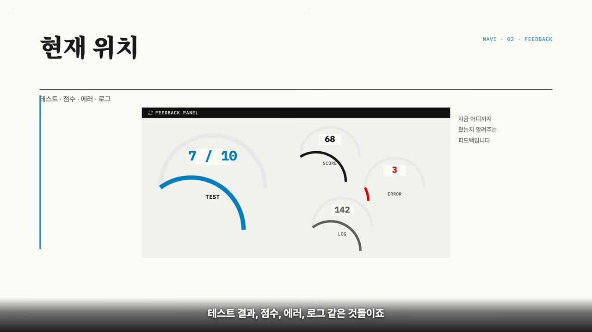

정리하면 이렇다. **프롬프트는 운전 간섭이고, 루프는 목적지 입력이다.** 잔소리를 더 잘하려고 애쓰는 대신, 도착지와 멈출 조건을 정해주고 손을 떼는 것.

## 팁 하나, 스스로 고치는 루프

랜스 마틴이 공개한 팁은 두 가지다. 자기 수정 루프와 기억하는 AI. 그 사이에 끼는 1.5번 팁까지 더하면 셋인 셈이다. 하나씩 보자.

첫 번째 팁은 자기 수정 루프다.

페이블 5 같은 최신 모델은 환경이 피드백을 주면 스스로 점수를 끌어올리는 능력, 그러니까 "언덕 오르기"를 아주 잘한다. 그래서 앤트로픽은 이 능력을 제품에 그대로 집어넣었다. 클로드 코드에는 슬래시 골(/goal)이라는 명령이 있고, 장시간 작업용 환경에는 아웃컴스라는 기능이 있다.

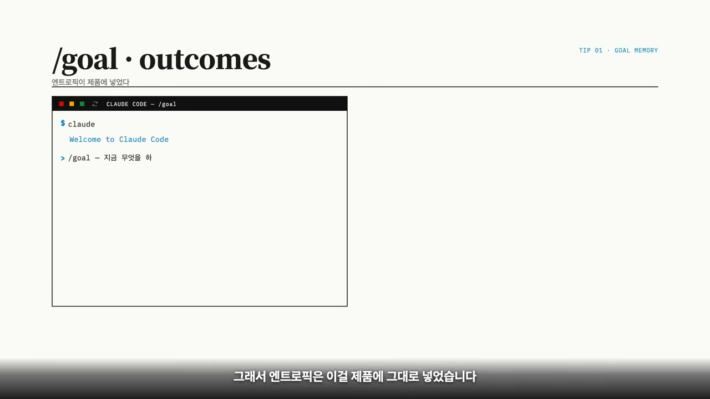

둘 다 원리는 비슷하다. 사람이 목표와 채점 기준, 즉 루브릭을 정해준다. 그러면 모델이 실행하고, 채점받고, 고치고, 다시 실행한다. 기준을 전부 통과할 때까지.

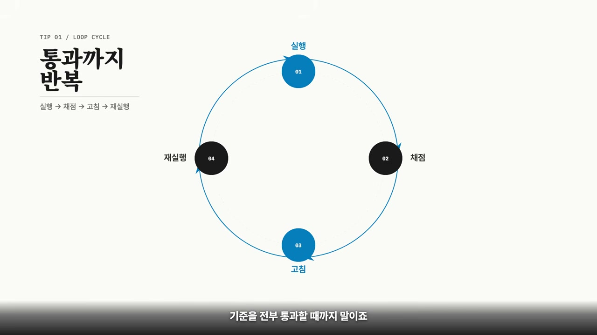

이게 실제로 얼마나 큰 차이를 만들까. 랜스 마틴은 파라미터 골프라는 실험을 했다. 16MB 안에 들어가는 AI 모델을 10분 안에 훈련시켜 최고 성능을 내는 게임이다. 골프처럼, 제한된 타수로 최고 스코어를 내는 방식이다.

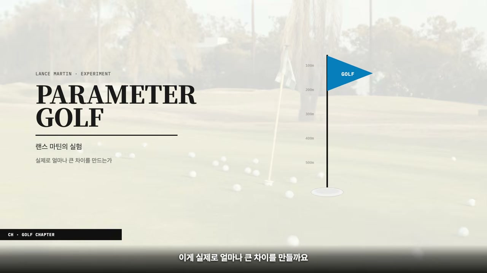

조건은 똑같이 맞췄다. 9개의 채점 기준을 주고, 최대 8시간 동안 모델 혼자 돌게 했다. 결과가 흥미롭다.

이전 세대 모델은 초반에 작은 개선 하나를 찾더니 거기에 안주했다. 학습률을 조금 올리고, 배치 크기를 조금 바꾸고, 숫자만 만지작거리다 끝났다. 베이스라인보다 아주 조금 나아진 정도였다.

페이블 5는 달랐다. 모델의 구조 자체를 바꾸는 실험을 일곱 번이나 시도했다. 중간에 양자화라는 기법을 썼다가 오히려 점수가 떨어지기도 했다. 보통은 여기서 포기한다. 그런데 이 모델은 "왜 떨어졌지"를 조사하고, 보정 방법을 찾아내, 그 실패를 가장 큰 점수 상승으로 바꿔놓았다.

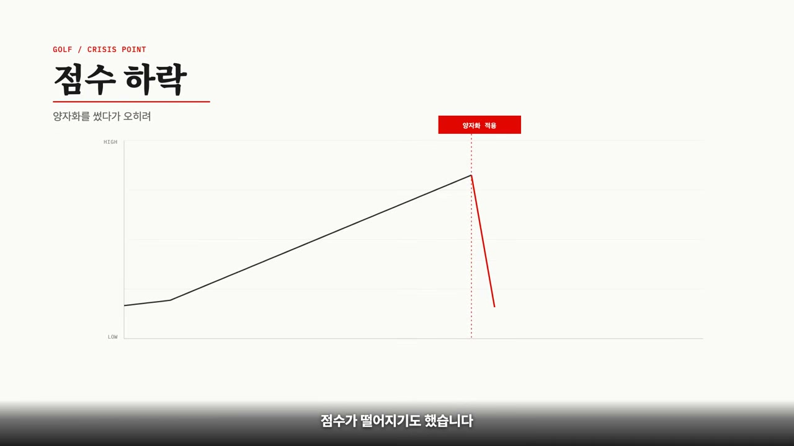

최종 결과는 약 6배 차이였다. 그런데 여기서 주목할 것은 6배라는 숫자가 아니다. **차이를 만든 게 지능이 아니라 환경이었다는 점이다.** 명확한 목표와 정직한 피드백, 그리고 멈춤 조건이 모델로 하여금 실패를 견디고 끝까지 가게 만든 것이다.

어디서 많이 듣던 이야기 아닌가. 사람도 똑같다. "열심히 해"라고만 말하는 상사 밑에서는 헤매고, "이 기준을 통과하면 끝"이라고 말해주는 상사 밑에서는 일이 잘 돌아간다.

## 팁 1.5, 자기 채점의 함정

여기서 중요한 디테일 하나를 짚어야 한다. 그럼 AI에게 "네가 한 거 검토해봐"라고 지시만 하면 모든 게 일사천리로 풀릴까. 그렇게는 안 된다. 바로 여기에 함정이 있다.

학생이 자기 답안지를 자기가 채점하면 어떻게 될까. 점수가 후해진다. 자기가 푼 논리를 그대로 다시 읽으니, 틀린 것도 맞은 것처럼 보인다. AI도 똑같다. 자기가 만든 결과물을 자기가 비판하면 자기 추론에 갇혀 빈틈을 보지 못한다.

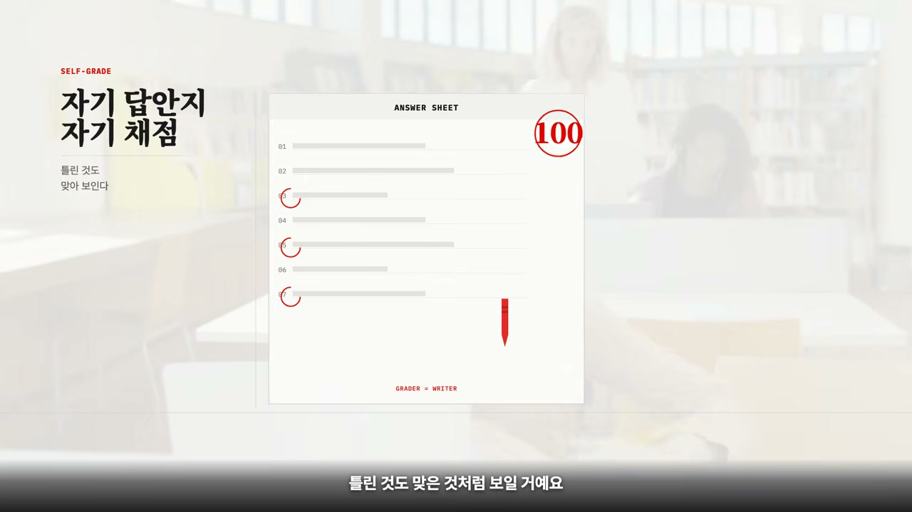

그래서 앤트로픽이 쓰는 방법은 검증자를 분리하는 것이다. 채점만 하는 별도의 에이전트를 띄운다. 이 검증자는 본 작업자가 어떤 고민을 했는지 전혀 모른다. 손에 든 건 루브릭 채점표 하나뿐이다. 그래서 아주 냉정하고 쌀쌀맞게 채점한다.

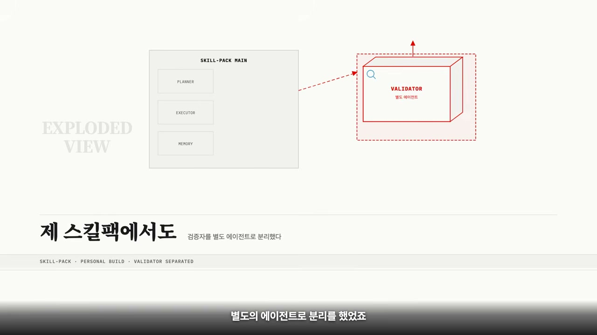

영상 속 화자는 자신이 만든 스킬팩에서도 이런 개념의 검증자를 별도 에이전트로 분리해뒀다고 말한다. 작업자와 심사위원을 분리하라. 이건 출판사 편집부에서도, 개발팀 코드 리뷰에서도 통하는 원칙이다. 작가는 글을 쓰고, 편집자는 그 글을 평가한다.

## 팁 둘, 기억하는 AI

두 번째 팁은 기억에 있다.

신입사원 두 명을 떠올려 보자. 한 명은 매번 비슷한 실수를 반복한다. 지적해주면 "아 맞네요" 하고는, 다음 주에 같은 실수를 또 한다. 다른 한 명은 업무 노트를 쓴다. 실수하면 적고, 왜 틀렸는지 이유를 분석하고, 확인되면 그걸 규칙으로 스스로 정리한다. 그리고 다음 일을 시작하기 전에 그 노트를 먼저 확인한다.

석 달 뒤 두 사람의 차이는, 어쩌면 일머리가 아니라 노트에서 나올지도 모른다.

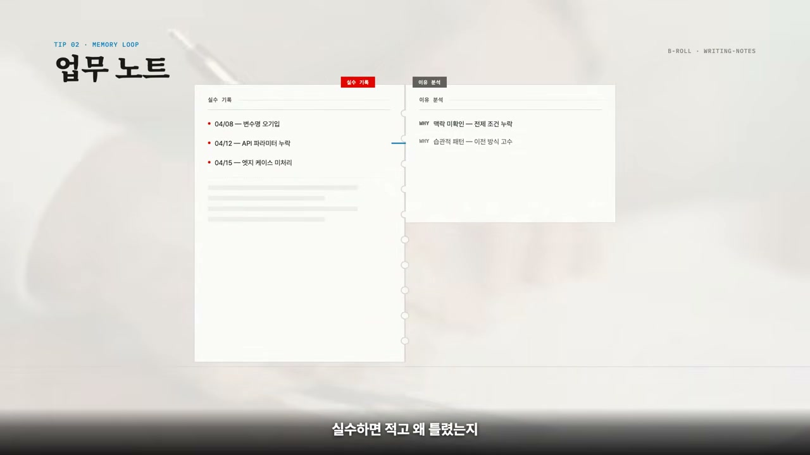

AI도 똑같다는 게 두 번째 팁의 핵심이다. 랜스 마틴은 컨티뉴얼 러닝 벤치라는 테스트를 소개한다. 30개의 데이터베이스 질문을 세션을 바꿔가며 순서대로 풀게 하는데, 세션 사이에 남는 건 메모리 파일 하나뿐이다.

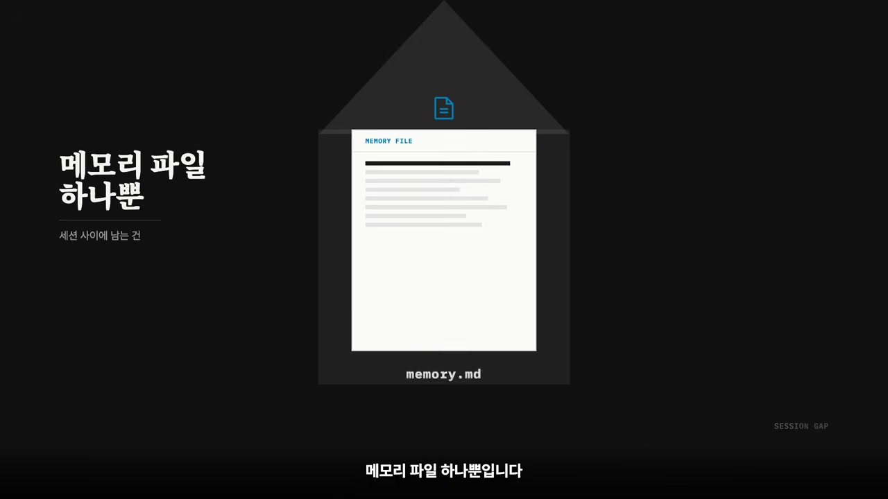

여기서 잘하는 모델의 메모는 다섯 단계를 밟는다. 이 다섯 단계가 영상에서 가장 중요한 지점이다.

1단계는 실패다. 틀렸으면 틀렸다고 솔직하게 그대로 기록한다.
2단계는 조사다. 넘어가기 전에 왜 틀렸는지 파헤친다.
3단계는 검증이다. 추측을 확인된 사실로 바꾼다.
4단계는 정제다. 그 사실을 다음에도 쓸 수 있는 일반 규칙으로 바꾼다.
5단계는 참조다. 새 일을 시작할 때 규칙을 다시 만들지 않고, 기존에 만든 것을 꺼내 쓴다.

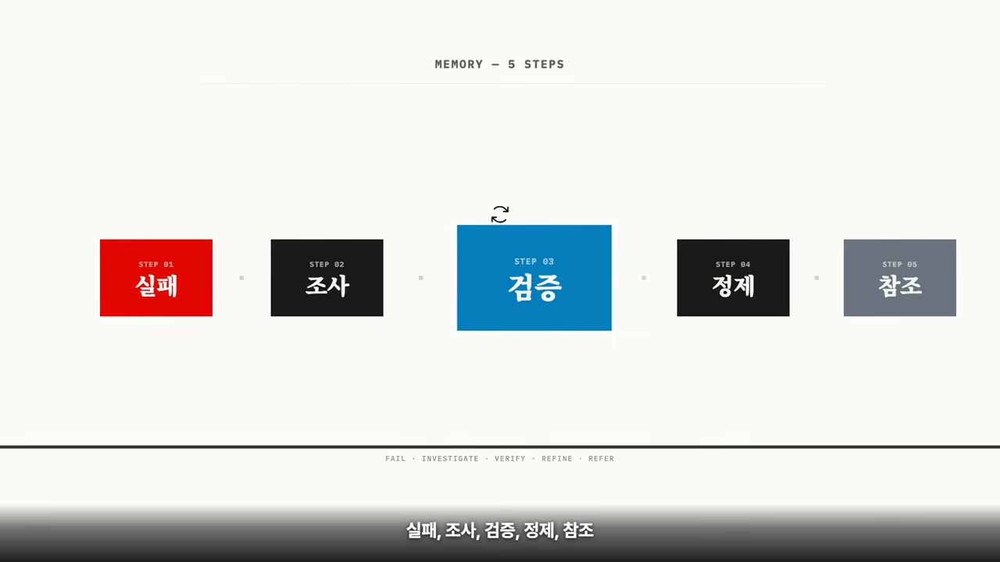

이전 모델들은 1단계나 3단계에서 멈췄다. 실패 메모만 잔뜩 쌓거나, 확인은 했지만 규칙으로 만들지는 못했다. 페이블 5는 5단계까지 갔다.

그 결과, 처음 10문제에서는 다른 모델과 비슷했지만 마지막 10문제에서는 성공률이 91%까지 올라갔다. 시간이 지날수록 좋아지는 AI. 그 비밀은 더 똑똑한 모델이 아니라, 더 좋은 방식으로 노트를 기록하는 데 있었다.

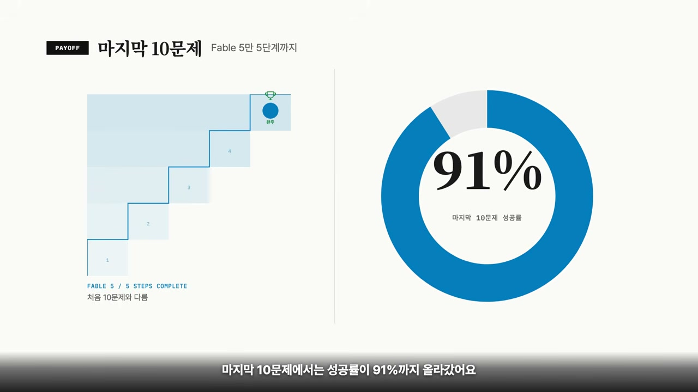

## 프롬프트는 명령, 루프는 약속

오늘 이야기를 정리하자.

프롬프트는 명령이고, 루프는 약속이다. "이렇게 해"가 아니라, "이 기준을 통과할 때까지 피드백을 보면서 스스로 고쳐라"라는 약속. 그리고 이 약속에는 세 가지가 들어간다. 명확한 목적지, 정직한 피드백, 그리고 기록에 남기는 것.

눈치챘겠지만 이건 AI 이야기만이 아니다. 우리가 일을 잘하게 되는 구조와 정확히 같다. AI가 똑똑해질수록 우리에게 필요한 건 더 화려한 프롬프트 명령어가 아니라, 더 좋은 작업 환경을 설계해주는 일이다.

더 좋은 프롬프트가 아니라, 더 좋은 루프.

코딩을 몰라도 괜찮다. 챗봇 하나만 있어도 누구든 간단한 루프를 돌릴 수 있다.
