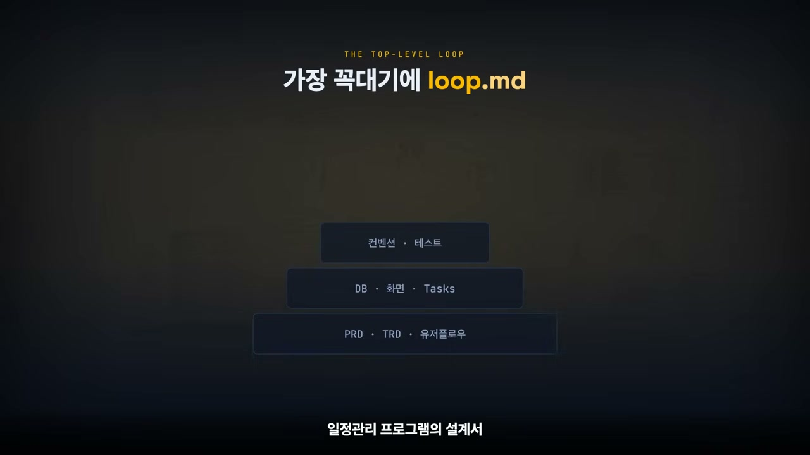
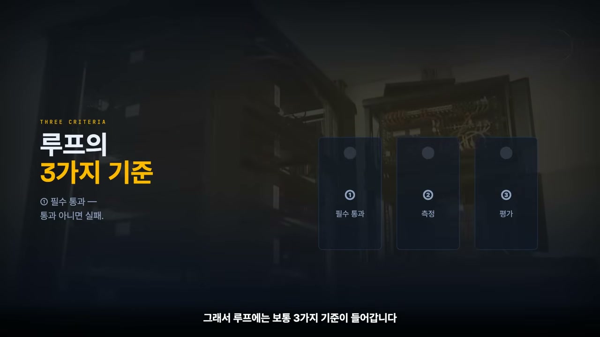
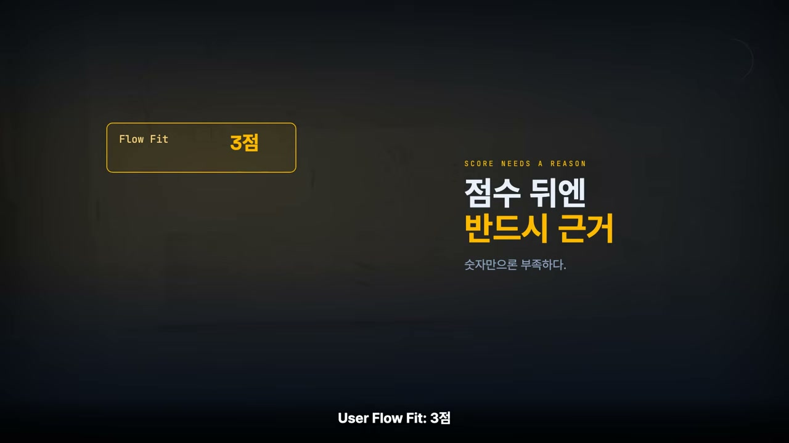
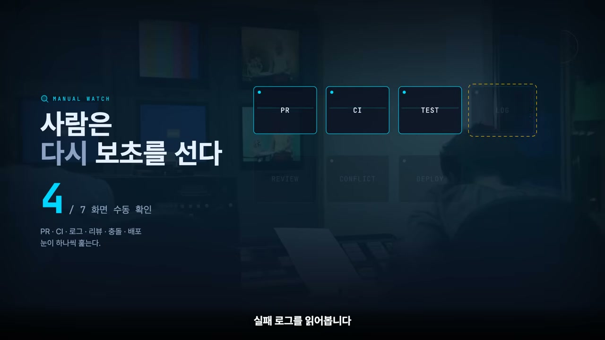
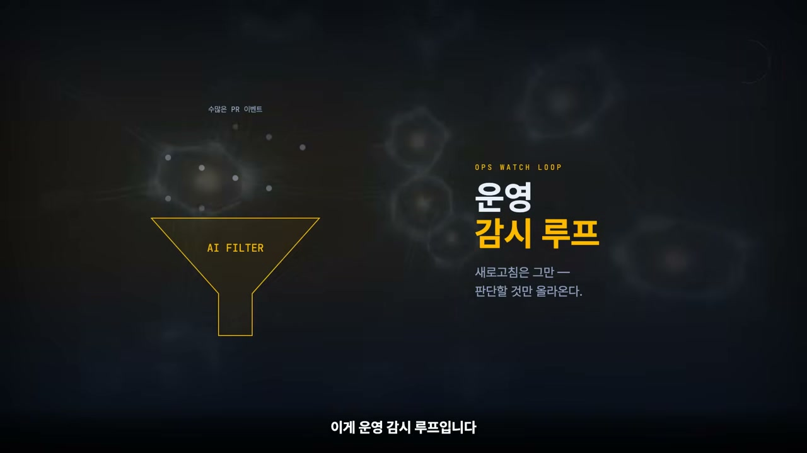
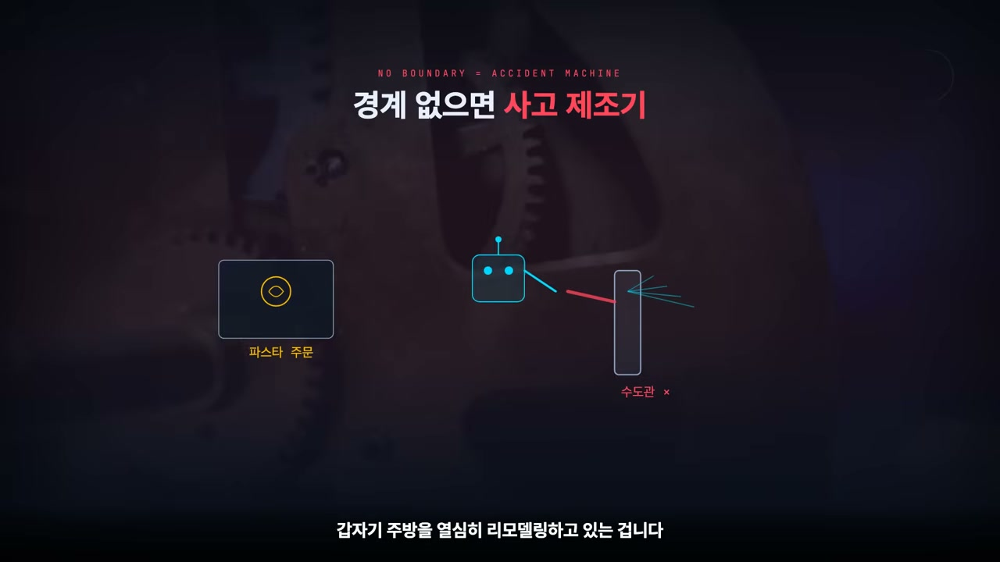
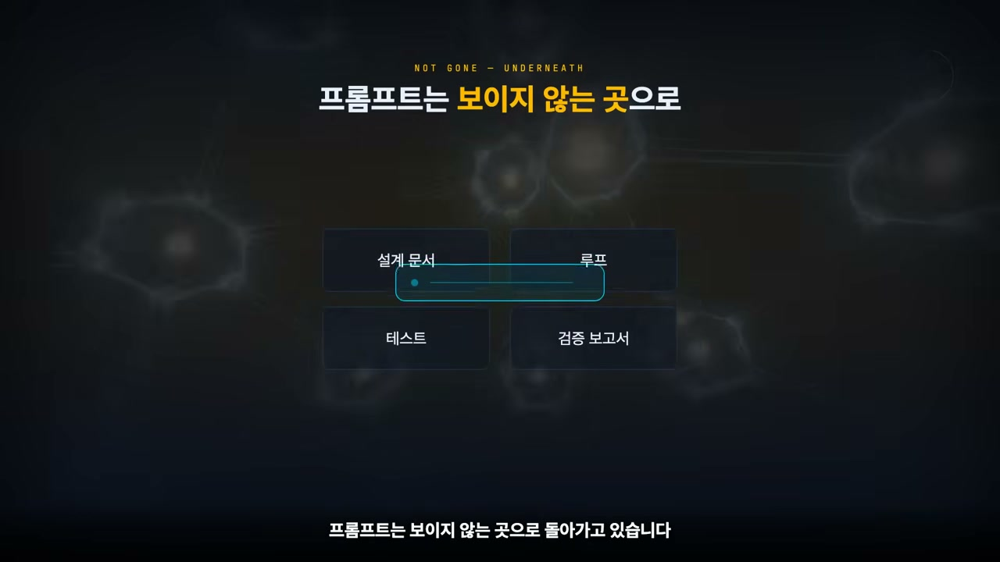

프롬프트 잘 쓰는 법은 이제 거의 모두가 안다. 좋은 프롬프트 모음, 백선, 그런 걸 부지런히 긁어모으던 시절이 있었다. 영상 속 화자도 솔직히 거기에 꽤 집착한 편이었다고 털어놓는다. 그런데 얼마 전, 그 집착에 김을 쭉 빼는 이야기를 들었다고 한다. 클로드를 만든 회사인 앤트로픽의 개발자들이 이제 프롬프트를 거의 안 쓴다는 것이다.

처음 들으면 말이 안 되는 소리다. 프롬프트를 안 쓰면 AI에게 일을 어떻게 시키나. 말을 걸지 않아도 AI가 텔레파시로 알아듣기라도 한다는 건가. 화자도 똑같이 반응했다. 그런데 이 말의 진짜 의미는 "아무 말도 안 한다"가 아니었다.

## "그냥 요리하게 놔둬라"

보리스 체르니는 이렇게 말한다. 내가 클로드 코드에게 계속 프롬프트를 던지는 게 아니라, 클로드가 스스로 프롬프트하게 내버려 둔다고. 영어로는 이런 표현도 쓴다. **Let it cook. 그냥 요리하게 놔둬라.**

처음 들으면 무책임하게 들린다. AI한테 일 맡겨놓고 자기는 딴짓하러 간다는 소리 아닌가 싶다. 그런데 실제 의미는 오히려 반대에 가깝다. 프롬프트를 덜 쓴다는 건 일을 대충 한다는 뜻이 아니라, 일하는 층위가 한 단계 올라갔다는 뜻이다.

예전 방식을 떠올려 보자. 사람이 AI 옆에 딱 붙어 앉아 있었다. 이 파일 고쳐줘. 아니 테스트 잘못됐잖아, 그건 건드리지 말고 다시 해. 이제 문서 업데이트해줘. 아 태스크에서 구현해야 할 항목이 빠졌잖아. 이런 식으로 사람이 쉴 새 없이 다음 명령을 줬다. AI가 코드를 쓰긴 하지만, 실제로는 사람이 리모컨을 들고 계속 채널을 바꾸는 구조였다.

루프 방식은 여기서 갈라진다. 사람이 매번 말로 지시하는 게 아니라, 처음에 이렇게 못을 박아 둔다.

- 이 목표를 달성할 때까지 반복해라.
- 이 기준을 통과하기 전까지는 완료라고 말하지 마라.
- 테스트가 실패하면 원인을 분석하고 다시 고쳐라.
- PRD와 태스크를 다시 대조해서 빠진 항목이 있으면 돌아가라.
- 마지막에는 네가 무엇을 했는지 증거 보고서를 제출해라.

이게 바로 루프다. 프롬프트가 사라진 게 아니다. 프롬프트가 채팅창의 한 줄 명령에서, 작업을 반복시키는 시스템 안으로 들어간 것이다. 예전의 프롬프트가 명령어였다면, 지금의 루프는 작업 감독관이다.

## 문서를 다 갖춰도 항상 뭔가 빠진다

조금 더 개발자의 언어로 들어가 보자. AI에게 일정관리 프로그램을 하나 만들게 한다고 치자. 간단해 보이지만 일정관리는 실제로 무척 복잡하다.

보통은 먼저 설계 문서부터 갖춘다. PRD에는 제품 요구사항을, TRD에는 기술 구조를 적는다. 유저플로우에는 사용자가 어떻게 움직이는지를, 데이터베이스 디자인에는 어떤 테이블과 필드가 필요한지를 적는다. 스크린에는 어떤 화면이 필요한지, 태스크에는 페이지와 작업 단위로 개발 순서를, 코딩 컨벤션에는 코드 작성 규칙을 정리한다.

여기까지 하면 그럴듯하다. 문서도 있고 작업 목록도 있으니, AI에게 프롬프트만 던지면 모든 문서를 검토해서 스스로 계획을 세우고 검증까지 해줄 것 같다.

그런데 실제로 시켜보면 항상 뭔가 빠진다. 일정 생성은 되는데 수정이 안 된다. 수정은 되는데 삭제 후 캘린더가 자동으로 갱신되지 않는다. 월간 보기는 있는데 주간 보기는 없다. 반복 일정은 PRD에 설계되어 있는데 태스크에는 누락되어 있다. 화면에는 알림 시간이 있는데 DB에는 알림 필드가 없다. 테스트는 통과했는데 사용자 흐름으로 보면 어딘가 부자연스럽다.

이때 다시 사람이 개입해야 한다. 야 이거 PRD에 있었잖아. 유저플로우엔 있는데 왜 화면엔 없어? DB 설계랑 안 맞잖아. 테스트만 통과하면 뭐 해, 실제 사용 흐름이 잘못됐는데. 화자는 이게 지금 AI 개발의 현실일지도 모른다고 말한다.

여기서 그가 짚는 진단이 날카롭다. AI가 바보라서가 아니다. **문제를 한 번에 너무 좁게 보기 때문이다.** 태스크를 주면 태스크만 본다. 코드를 주면 그 코드만 본다. 테스트를 통과하면 끝났다고 쉽게 생각한다. 하지만 제품은 그렇게 간단히 만들어지지 않는다. PRD, 기술 구조, 사용자 흐름, 데이터, 화면, 테스트, 운영 기준이 서로 맞물려야 비로소 제품이 된다.

## 가장 꼭대기에 올라가는 문서, 루프

그래서 필요한 게 상위 루프다. 일정관리 프로그램 설계에서 가장 꼭대기 층위에 문서를 하나 만들어 둔다. 이름은 루프.md. (옥상 루프탑을 만드는 건 아니지만, 개념적으로 루프탑과 비슷하다고 이해해 두면 된다.)

이 문서는 새로운 기능을 담지 않는다. 새로운 요구사항도 아니다. 그저 감독관이다. 하는 일은 단순하다. AI가 어떤 태스크를 하든, 끝났다고 말하기 전에 아래 문서들을 다시 확인하게 만든다. PRD를 확인했는가. 유저플로우와 맞는가. 스크린에 반영됐는가. DB 설계와 충돌하지 않는가. 디자인 시스템을 지켰는가. 태스크에 언급된 사항을 빠뜨리지 않았는가. 코딩 컨벤션을 따랐는가. 테스트, 타입 체크, 린트, 빌드를 통과했는가. 그리고 그 증거를 객관적으로 제출할 수 있는가.

중요한 건 루프가 기존 설계 문서를 대체하지 않는다는 점이다. PRD도, TRD도, 태스크도, TDD도, 서브 에이전트도, 워크트리도 여전히 다 필요하다. 다만 그 위에 루프가 하나 더 올라간다. PRD가 "무엇을 만들 것인가"를 말하고 태스크가 "어떤 순서로 만들 것인가"를 말한다면, 루프는 이렇게 묻는다. **무엇을 통과해야 진짜 끝났다고 볼 것인가.** 이 질문이 핵심이다.

화자는 AI 개발에서 가장 위험한 문장을 이렇게 꼽는다. "구현 완료했습니다." 완료했다는 말은 쉽다. 문제는 증거다. 무엇을 기준으로 완료했는가. 테스트를 어떻게 돌렸는가. PRD의 인수 기준을 충족했는가. 사용자 흐름을 실제로 따라가 보긴 했는가. DB 설계와 맞는가. 예외 상황은 제대로 처리했는가. 남은 리스크는 무엇인가. 루프는 AI가 스스로에게 이 질문을 계속 던지게 만드는 장치다.

## 루프에 들어가는 세 가지 기준

그래서 루프에는 보통 세 가지 기준이 들어간다.

**첫째는 필수 통과 기준이다.** 통과 아니면 실패, 둘 중 하나다. 빌드 성공, 타입 체크 성공, 린트 성공, 테스트 성공, 마이그레이션 성공, 보안키 노출 없음. 여기엔 "80점이면 통과" 같은 건 없다. 하나라도 실패하면 끝난 게 아니다.

**둘째는 측정 기준이다.** 숫자로 잴 수 있는 것들이다. 테스트 커버리지, 응답 속도, 접근성 점수, 번들 크기, 에러 로그, API 실패율. 일정관리 프로그램이라면 날짜 계산 유틸 테스트가 있는지, 반복 일정 테스트가 있는지, 생성·수정·삭제 플로우가 자동으로 검증되는지를 본다.

**셋째는 평가 기준이다.** 사람이 눈으로 보고 판단하던 영역을 AI에게 맡기는 부분이다. 아키텍처가 적절한가. 코드가 유지보수 가능한가. 사용자 흐름이 자연스러운가. 에러 메시지가 이해하기 쉬운가. 작업 범위를 넘어서지 않았는가. 이런 건 1점부터 5점까지 매기게 할 수 있다.

다만 여기서 조심할 게 있다. AI에게 그냥 "몇 점이야?"라고 물으면 대체로 후하게 답한다. 자기가 한 일에는 좋은 점수를 준다. 화자는 이걸 두고, 인간만 그럴 줄 알았는데 AI도 은근히 그렇다고 꼬집는다. 그래서 점수만 쓰게 하면 안 되고, 반드시 점수 뒤에 근거를 쓰게 해야 한다. 예를 들면 이렇게.

> 유저플로우 핏 3점. 일정 생성과 삭제 흐름은 구현됐지만, 수정 후 월간 캘린더가 즉시 갱신되는 흐름이 검증되지 않았다. 수정 액션: 일정 수정 후 캘린더 상태 갱신 테스트를 추가한다.

점수가 중요한 게 아니다. 점수 뒤에 붙은 근거와 수정 액션이 중요하다.

## 또 하나의 루프, 사람의 병목을 줄이는 루프

여기까지가 품질을 끌어올리는 루프라면, 보리스 체르니가 말하는 루프에는 결이 다른 하나가 더 있다. 사람의 병목을 줄이는 루프다.

AI가 일정관리 프로그램의 반복 일정 기능을 구현하고 깃허브에 PR을 올렸다고 해보자. 그러면 보통 사람은 다시 보초를 서야 한다. PR이 열렸는지 눈으로 확인하고, CI가 도는지 살피고, 테스트가 실패했는지 보고, 실패 로그를 읽고, 리뷰 댓글이 달렸는지 보고, 메인 브랜치와 충돌이 났는지 확인하고, 배포가 성공했는지 새로고침한다.

이런 일이 사람의 시간을 야금야금 잡아먹는다. 화자의 표현이 정확하다. 개발을 하는 건지, PR 옆에서 경비를 서는 건지 헷갈릴 때가 많다.

그런데 여기에도 루프를 걸면 일이 달라진다. 예를 들어 이렇게 정할 수 있다. 15분마다 PR 상태를 확인해라. CI가 실패하면 로그를 읽고 원인을 분류해라. 단순 린트 오류나 타입 오류면 직접 고쳐서 다시 푸시해라. 리뷰 댓글 중 단순 수정은 반영해라. 다만 DB 구조 변경, 권한 정책 변경, 제품 방향 변경이 필요한 댓글은 사람에게 질문해라. 모든 체크가 통과하면 머지 준비 보고서를 작성해라. 이게 운영 감시 루프다.

사람이 계속 깃허브를 새로고침하지 않아도 된다. AI가 PR을 지켜보다가 고칠 수 있는 건 고치고, 사람이 판단해야 할 것만 골라서 가져온다. 이 차이가 크다. 루프는 단지 코드를 더 잘 짜게 만드는 장치가 아니다. 개발자가 계속 새로고침하던 시간, PR 옆에서 보초 서던 시간, CI 로그를 들여다보던 시간, 배포 상태를 기다리던 시간을 AI에게 넘기는 방식이다.

## 경계선이 없으면 루프는 사고 제조기가 된다

물론 여기에도 경계는 필요하다. AI가 마음대로 다 고치게 두면 안 된다.

자동으로 처리해도 되는 것이 있다. 린트 오류 수정, 타입 오류 수정, 테스트 실패 로그를 보고 하는 단순 버그 수정, 누락된 테스트 추가, 문서 업데이트, 리뷰어가 지적한 단순 네이밍 수정. 이런 것들은 AI가 혼자 처리해도 괜찮다.

반대로 반드시 사람에게 물어야 하는 것도 있다. DB 스키마 변경, 데이터 손실 가능성이 있는 마이그레이션, 인증과 권한 정책 변경, 결제와 보안 관련 수정, PRD와 충돌하는 리뷰 반영, 기능 범위가 커지는 수정, 테스트는 통과하지만 설계 의도가 달라지는 변경. 이런 건 반드시 사람이 체크해야 한다.

이 경계가 없으면 루프는 루프가 아니라 사고 제조기가 될 수도 있다. 요리하게 놔뒀더니 AI가 갑자기 주방을 열심히 리모델링하고 있는 격이다. 형, 파스타 만들라니까 왜 수도관을 뜯고 있어?

그래서 좋은 루프에는 두 가지가 함께 있어야 한다. 하나는 자동 처리 기준, AI가 혼자 처리해도 되는 영역이다. 다른 하나는 인간의 호출 기준, AI가 멈추고 사람에게 질문해야 하는 바로 그 경계선이다. 이 둘이 다 들어가야 진정한 루프가 된다.

## 프롬프트는 끝난 게 아니라 보이지 않는 곳으로 돌아갔다

정리하면 이렇다. 프롬프트는 절대 끝난 게 아니다. 다만 보이지 않는 곳으로 돌아가고 있다. 채팅창의 한 줄에서 설계 문서와 루프와 테스트와 검증 보고서 안으로 들어갔고, 이제는 PR 감시, CI 수정, 리뷰 반영, 배포 확인 같은 운영 루프 안으로도 스며들고 있다.

화자가 그리는 앞으로의 개발자상은 분명하다. AI에게 명령을 잘 내리는 사람이 아니라, AI가 스스로 일하고 의심하고 고치고 증거를 제출하게 만드는 사람. 말하자면 명령자가 아니라 감독관, 조금 더 정확히는 작업 시스템을 설계하는 사람이다.

오늘의 이야기를 한 문장으로 줄이면 이렇다. 프롬프트를 잘 쓰는 시대에서, 루프를 잘 설계하는 시대로 넘어가고 있다.
