"노트북이 꺼지면 에이전트도 멈추지 않냐, 24시간 어떻게 못 돌리냐."

실밸개발자 채널에서 클로드 코드, 코덱스, 하네스 엔지니어링을 다룰 때마다 댓글로 들어오던 질문이라고 한다. 터미널 안에서 사는 코딩 에이전트는 결국 내 컴퓨터가 켜져 있어야 작동한다. 자리를 뜨면 일도 멈춘다. 이 영상은 그 질문에 대한 답으로 누스 리서치가 만든 오픈소스 자율 에이전트 **헤르메스 에이전트**를 들고 왔다. 노트북이 아니라 서버에 살고, 디스코드(또는 텔레그램·슬랙 등)로 말을 걸면 응답하며, 내가 꺼져 있어도 일하는 에이전트다.

시작하기 전에 화자가 한 번 못을 박는 대목이 있다. 누스 리서치는 헤르메스라는 LLM 모델도 만든다. 오퍼스나 GPT-5.5와 비슷한 그 모델 말이다. 하지만 오늘 다루는 건 모델이 아니라 헤르메스 에이전트라는 시스템이다. 그래서 이 에이전트는 GPT든 클로드든 로컬 모델이든 아무 모델이나 끼워서 쓸 수 있다. 이 구분이 글 전체를 관통하는 핵심이다. 헤르메스는 모델이 아니라, 모델을 부리는 오케스트레이터다.

## 챗봇과 무엇이 다른가, 닫힌 학습 루프

헤르메스 에이전트는 MIT 라이선스의 오픈소스로, 2025년 7월에 나와 아직 1년이 채 안 됐는데 깃허브 스타가 19만 개다. 그럼 일반 챗봇과 뭐가 다를까.

챗봇은 우리가 프롬프트를 넣으면 답을 주고, 또 프롬프트를 넣으면 답을 주는 식으로 왔다 갔다 해야 움직인다. 헤르메스 에이전트는 24시간 우리의 응답을 기다리는 대기 상태로 있다. 말을 걸면 바로 응답하고, 작업을 실행하고, 그 결과에서 배우고, 스스로 진화한다. 화자의 표현을 빌리면 "AI 비서보다는 AI 직원"이다.

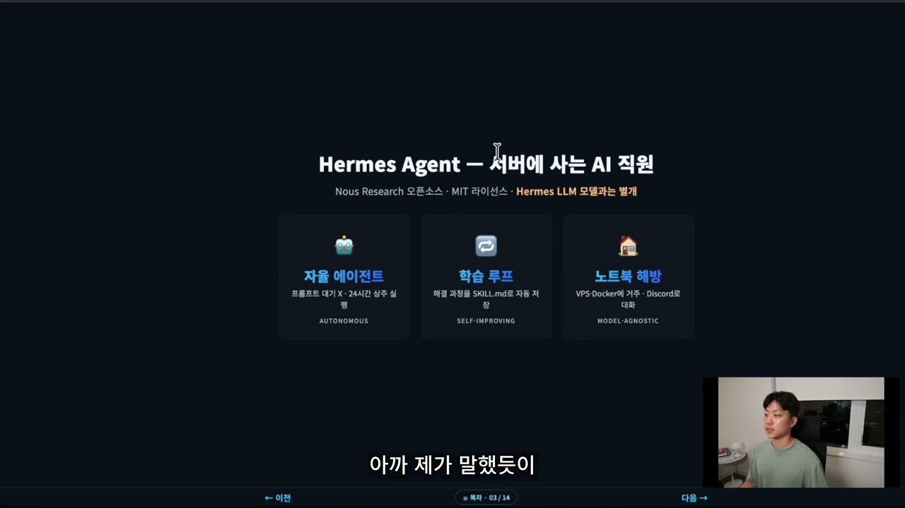

핵심은 닫힌 학습 루프, 즉 Closed Learning Loop다. 복잡한 문제를 하나 풀면, 그 해결 과정을 `skill.md`라는 재사용 가능한 문서로 자동 저장한다. 다음에 비슷한 문제를 만나면 자기가 만든 그 스킬을 스스로 꺼내 쓴다. 같은 실수를 반복하지 않고, 같은 작업은 점점 빨라지고 능숙해진다. 화자가 직원에 빗댄 이유가 여기 있다. 일을 시켰는데 "이건 자동화할 수 있겠다" 싶으면 알아서 위키 페이지를 쓰거나 툴을, 스크립트를 만들어두는 직원. 개발자라면 누구나 예뻐할 직원이다.

다만 화자는 여기서 한 번 멈춰 선다. 공식 사이트는 학습 루프가 내장된 유일한 에이전트라고 주장하지만, 사실 클로드 코드나 코덱스에도 스킬과 메모리는 있다. 그러니 "유일하다"는 건 어디까지나 공식 주장일 뿐이라고 화자는 선을 긋는다. 화자가 본 진짜 차이는 자동성이다.

> 이거 저장해, 이거 기억해 라고 하지 않아도 자동으로 스스로 한다는 게 차이점인 것 같아요.

그리고 또 하나, 노트북에 묶여 있지 않다. VPS에 올리고 그 위에서 도커 컨테이너에 넣어 격리해 돌릴 수 있고, 어디에 살든 게이트웨이라는 시스템을 통해 텔레그램이나 디스코드, 슬랙과 연결된다. 카카오톡은 아직 지원이 안 되는 걸로 알고 있다고 화자는 덧붙인다. 누군가 넣어주면 한국 사용자에게 좋을 거라면서.

## 오픈클로와의 갈림길

이미 아는 사람은 이 질문을 떠올린다. 오픈클로와 헤르메스는 뭐가 다른가. 화자는 솔직하게 인정한다. 오픈클로가 더 먼저 떴고 더 유명하다.

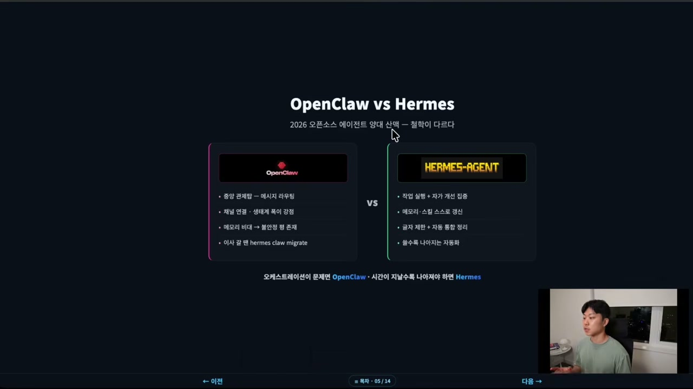

오픈클로는 메시지를 라우팅하는 중앙 관제탑에 가깝다. 채널 연결과 생태계 폭이 넓고, 멀티 에이전트 오케스트레이션과 멀티 프로필에 특화돼 있다. PM, QA 식으로 프로필을 지정해 여러 에이전트를 엮어 돌리는 데 최적화돼 있다는 뜻이다. 반면 헤르메스는 작업 실행과 자가 개선에 집중한다. 메모리와 스킬을 스스로 갱신하며 "오늘보다 내일이 더 나은" 에이전트를 지향한다.

여기서 화자는 흥미로운 시장의 평을 하나 전한다. 오픈클로를 오래 쓴 사람들 사이에서 메모리가 비대해지면서 불안정해졌다는 말이 있다는 것이다. 헤르메스는 학습 루프가 메모리 정리까지 스스로 한다고 한다. `soul.md`, `memory.md`, `user.md`, `agents.md` 같은 파일에 글자수 제한을 걸어두고, 가득 차면 알아서 통합 정리한다. 자가 개선이라는 말이 단지 능력을 늘리는 게 아니라, 자기 컨텍스트를 스스로 비워내는 일까지 포함한다는 점이 헤르메스의 설계 철학이다.

한 줄 정리는 이렇다. 오케스트레이션을 더 잘하고 싶은데 잘 안 되는 것 같으면 오픈클로, 시간이 지날수록 나아져야 하는 자동화 시스템이 필요하면 헤르메스. 다만 화자 본인은 "거의 비슷하다"고 본다. 결정적인 디테일은 헤르메스가 오픈클로에서 넘어오는 마이그레이션 스크립트를 제공한다는 점이다. 그만큼 본인 쪽으로 넘어오라고 광고하는 셈이라고 화자는 짚는다.

## 어디에 설치하느냐, 개인정보라는 무게

설치 방법은 크게 세 가지다.

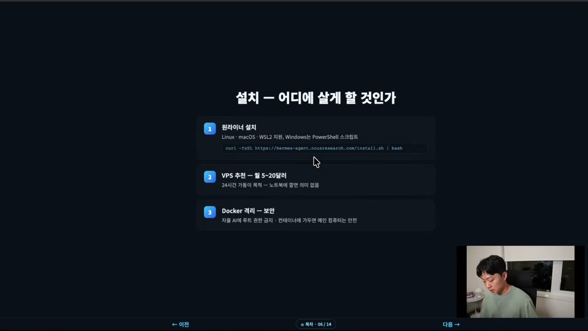

첫째는 평소 작업하는 로컬 메인 랩탑. 가장 간단하지만 화자는 권하지 않는다. 헤르메스를 깔면 에이전트가 내 로컬의 거의 모든 것에 접근권을 갖게 된다. 어느 정도 통제할 수는 있어도 위험하고, 실제로 사람들이 잘 하지 않는다. 개인정보가 다 들어 있는 메인 랩탑에 개인 에이전트를 설치하는 경향은 아직 없다는 것이다. 오픈클로도 그런 이슈가 많았다고 화자는 언급한다.

둘째는 맥미니 같은 별도 서버를 사서 거기서 돌리는 방법. 개인정보와 격리된 서버를 계속 켜둘 수 있다는 게 장점이지만, 단점은 비용이다. 100만원짜리 서버를 사기엔 부담스럽다는 사람이 많을 거라고 화자는 말한다.

그래서 화자가 추천하고 본인도 쓰는 셋째 방법은 클라우드 서비스다. 호스팅어라는 서비스로 클라우드에 서버를 빌리는 것이다. 협찬은 아니고, 유튜브에서 10% 할인코드를 받아 쓴다고 밝혀둔다. 비유하자면 누군가의 맥미니를 대여하는 셈이다. 서버를 직접 유지보수하지 않아도 되고, 그 서버는 빌리는 동안 온전히 내 것이 된다. 내 컴퓨터에서 거기 접속해 헤르메스를 깔아 쓴다.

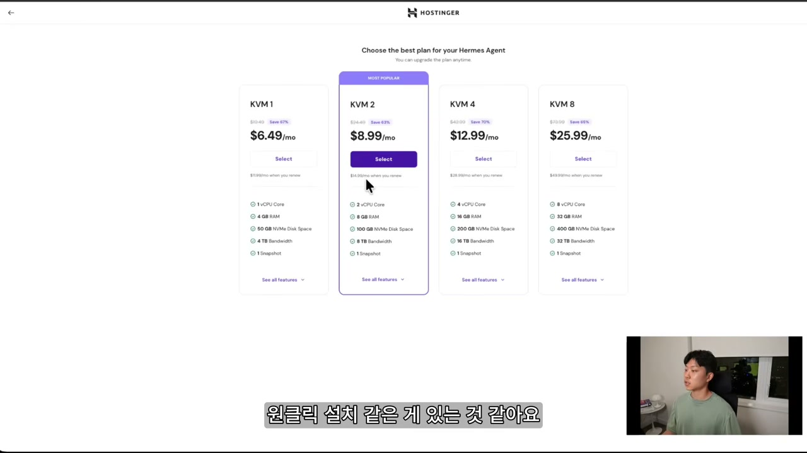

호스팅어 VPS에서 로케이션을 고르는데, 가까울수록 성능이 좋다. 한국이라면 인도네시아가 가장 가까운 데이터센터인 것 같다고 화자는 안내한다. 도커 애플리케이션 항목에서 헤르메스 에이전트를 누르면 원클릭 설치에 가까운 흐름이 나온다.

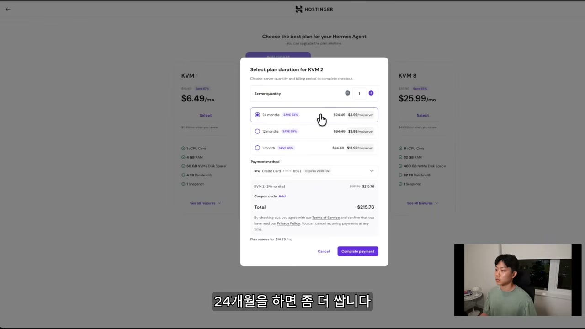

화자가 쓰는 플랜은 KVM2, Most Popular로 표시된 8.99달러 플랜이다. 한 달에 만원 조금 넘는 비용으로 서버를 빌려 헤르메스를 돌린다. 기간을 길게 잡을수록 싸진다. 24개월이면 총 215달러, 1개월만 쓰면 13.99달러다. 잘 모르겠으면 한 달만 써봐도 된다.

구매 뒤에는 호스팅어의 도커 매니저로 들어가 프로젝트의 컴포즈에서 원클릭 디플로이를 누르고, 헤르메스 에이전트를 선택해 패스워드를 지정한 뒤 배포한다. 그러면 터미널을 열어 `hermes --version`으로 잘 깔렸는지 확인하고, `hermes setup`을 친다.

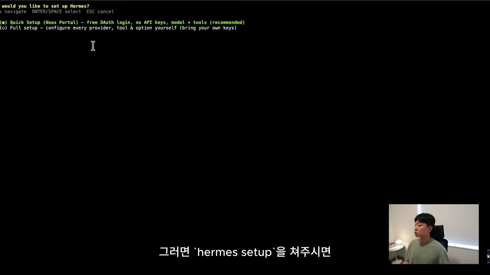

여기서 퀵 셋업과 풀 셋업이 갈리는데, 풀 셋업으로 들어간다.

## 어떤 모델을 끼울 것인가

풀 셋업의 첫 화면에서 모델을 고른다. 앞서 말한 헤르메스의 장점, 여러 모델을 섞어 쓸 수 있다는 게 여기서 실현된다. 코딩은 코덱스로, 기획은 클로드로, 트위터 검색이 필요하면 XAI 그록으로. 이렇게 여러 모델을 취사선택하면 헤르메스 에이전트가 말 그대로 오케스트레이터 역할을 한다. 일을 시키면 이 직원이 알아서 클로드 코드를 쓰고, 코덱스를 쓰고, 그록을 부린다.

다만 비용 구조에 함정이 하나 있다. 화자가 주로 쓰는 클로드 코드는 API 과금 모델을 쓸 수밖에 없다. 구독제로는 헤르메스에 붙여 쓸 수 없게 돼 있어서, API 과금을 하면 추가 비용이 따로 발생한다. 그래서 화자는 오픈AI의 구독제 모델로 코덱스를 붙여 GPT로 헤르메스를 운영하는 쪽을 택했고, 요즘 사람들도 그렇게 많이 한다고 전한다. 코덱스 모델을 붙이려면 로그인해 인증하고, 터미널에 뜬 패스코드를 챗GPT OAuth에 붙여넣는다.

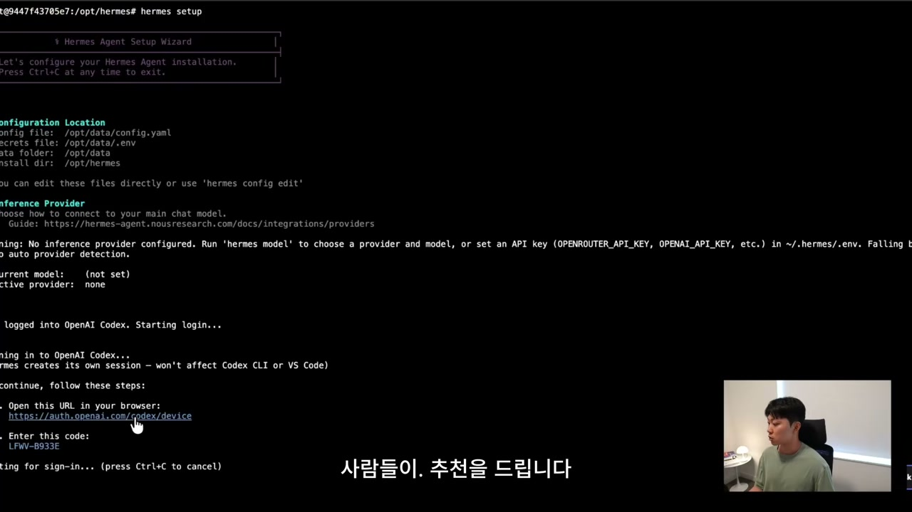

로그인이 되면 모델은 5.5로 고르고, 백엔드는 도커, 그리고 플랫폼은 화자의 경우 디스코드를 스페이스로 체크해 선택한 뒤 엔터를 누른다.

## 디스코드 연결, 봇을 내 채팅방에 들이기

여기서부터는 디스코드 봇을 만들어 헤르메스와 연결하는 과정이다. 단계가 잘게 쪼개져 있지만 논리는 단순하다. 봇을 만들고, 봇에게 메시지를 주고받을 권한을 주고, 내 서버에 초대하고, 봇의 식별자를 터미널에 등록하는 것이다.

디스코드 개발자 페이지에서 새 애플리케이션을 만들고 봇 이름을 정한다. 아이콘은 원하는 대로 둔다. 만들고 나면 봇 토큰을 리셋해 복사한 뒤, 헤르메스가 요청한 자리에 붙여넣는다. 그 다음 헤르메스는 유저 아이디를 달라고 하는데, 그 전에 권한 설정이 먼저다.

봇이 나와 메시지를 주고받으려면 Privileged Gateway Intents에서 **Message Content Intent를 토글 온**하고 저장해야 한다.

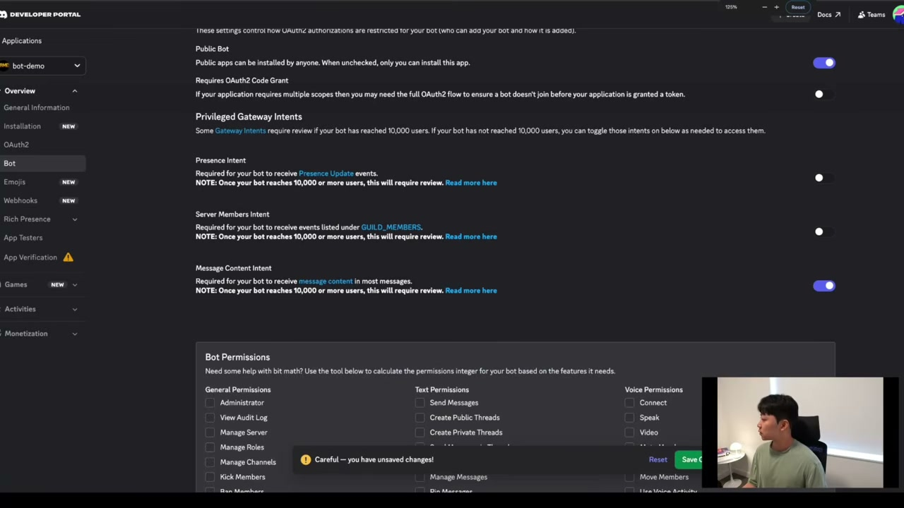

그 다음 OAuth2로 가서 봇 초대 URL을 생성한다. 이 URL을 생성하는 이유는 나와 봇이 같은 채팅방에 있어야 하기 때문이다. URL이 봇을 내 채팅방에 초대하는 역할을 한다. 초대 전에 봇 권한을 네 개 준다. 메시지를 보낼 권한(Send Messages), 메시지 히스토리를 읽을 권한(Read Message History), 채널을 볼 권한(View Channel), 그리고 파일을 첨부할 권한(Attach Files)이다.

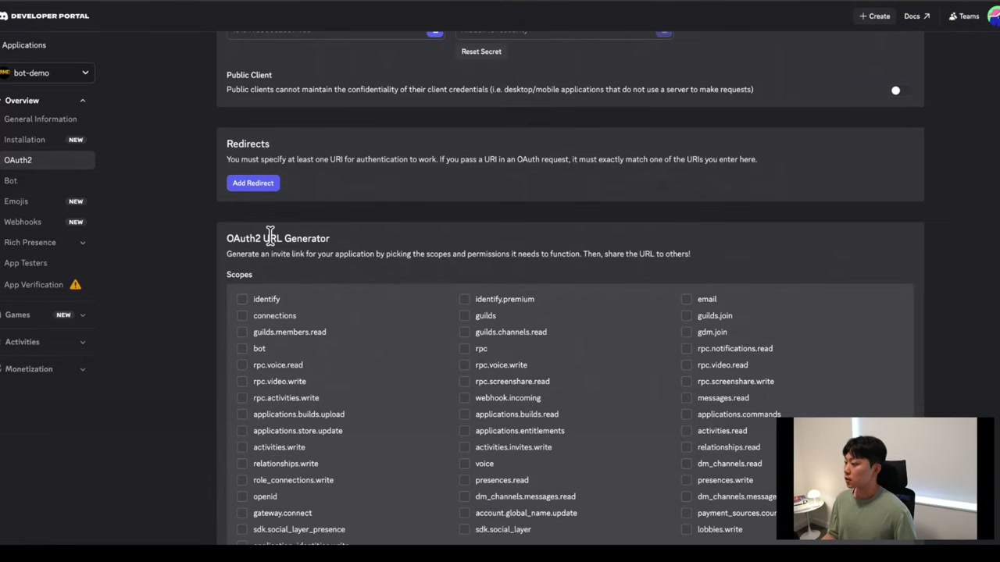

생성된 URL을 새 창에 붙여넣으면 서버를 선택하는 화면이 나온다. 그 전에 디스코드에서 새 서버를 하나 만들어둬야 한다. Add Server로 Create My Own, For Me and My Friends를 골라 헤르메스 데모 같은 이름으로 서버를 만든다. 다시 돌아와 리프레시하면 그 서버가 나오고, 권한 네 개가 체크된 걸 확인한 뒤 승인한다.

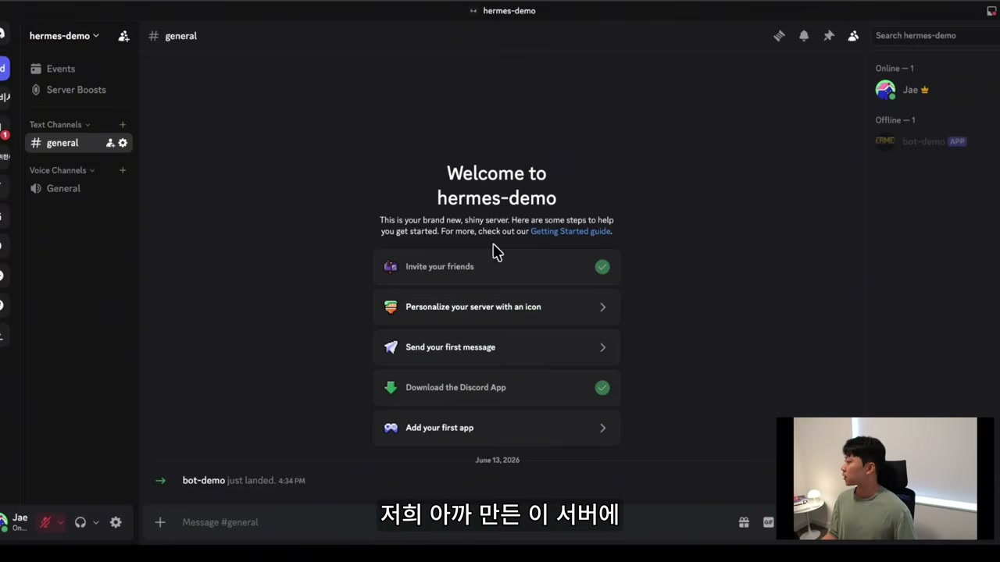

그러면 서버에 "bot demo just landed"가 뜬다. 봇이 내 서버에 들어왔다는 신호다.

이제 터미널이 요청했던 유저 아이디 차례다. 디스코드 왼쪽에서 봇의 유저 아이디를 카피하는데, 만약 그 메뉴가 안 보이면 설정의 맨 아래 Developer 모드를 켜야 한다. 카피한 아이디를 터미널에 붙여넣는다. 홈 채널 아이디는 지금 설정할 필요 없이 나중에 `/sethome` 명령으로 알아서 잡힌다. 셀렉트 옵션은 그냥 Done을 누른다.

## 켜둔 적 없는데도 응답한다, 게이트웨이의 정체

셋업이 끝나면 Ready to go가 뜬다. 먼저 `hermes doctor`로 모든 게 잘 됐는지 확인한다. 건강검진 같은 거라고 화자는 표현한다. 이슈가 있으면 알려주는데, API 키 컨픽 같은 건 따로 안 할 거라 `hermes doctor fix`를 돌린다. 웬만한 이슈와 에러는 이걸로 다 고친다.

그 다음 `hermes gateway run`으로 게이트웨이를 연다. 봇을 멘션해 "안녕"이라고 하면 thread가 만들어지고, "no home channel" 안내가 뜬다. setup home을 누르면 홈 채널이 잡히고, 봇이 자기소개로 응답한다. 디스코드를 통해 헤르메스와 대화할 수 있게 된 것이다.

그런데 여기 함정이 있다. 방금처럼 `hermes gateway run`으로 게이트웨이를 띄우면 그건 수동으로 돌리는 것이다. 내 연결이 끊기면 게이트웨이도 끊겨, 디스코드로 아무리 메시지를 보내도 헤르메스에게 닿지 않는다. 24시간 에이전트라는 약속이 여기서 깨질 뻔한다.

해결은 의외로 간단하다. 도커 컨테이너를 리스타트만 해주면 된다. 그러면 게이트웨이가 24/7로 알아서 돌아간다.

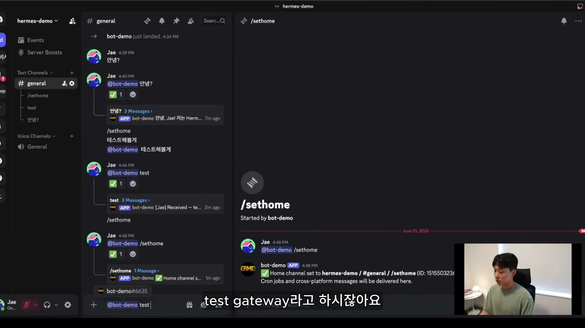

화자가 실제로 보여주는 검증이 인상적이다. 게이트웨이를 분명히 꺼둔 상태에서 디스코드로 "test gateway"를 보낸다. 분명 꺼져 있는데도 봇이 응답한다. 수동 실행이 아니라 컨테이너가 게이트웨이를 띄워주고 있다는 증거다. 이게 바로 "노트북을 꺼도 일하는 에이전트"의 실체다. 게이트웨이는 내 노트북이 아니라 빌린 서버의 도커 컨테이너 안에서 돈다.

간단한 일도 시켜본다. "디자인 아키텍처 패턴 세 개를 정리해줘." 답이 바로 온다. MVC 패턴, Layered Architecture, Clean Architecture. 챗GPT가 잘 대답하고 있다는 걸 보여주고 싶은 거라고 화자는 말한다.

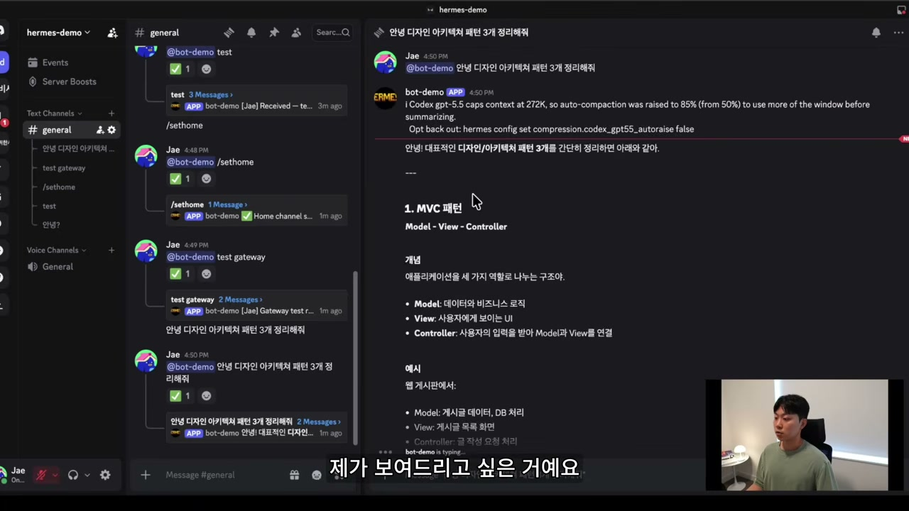

매번 봇을 멘션하는 게 귀찮으면 설정을 바꿀 수 있다. VS Code에 Remote-SSH 익스텐션을 깔고, 도커 컨테이너에 적힌 SSH 주소로 서버에 접속한다. 이때 주의할 점은 열리는 루트 폴더가 아니라, 도커 컨테이너 안에 만들어둔 프로젝트 폴더로 들어가야 한다는 것이다. `config.yaml`에서 디스코드의 `require_mention`을 찾아 true를 false로 바꾸고 컨테이너를 리스타트하면, 멘션 없이도 봇이 메시지를 받는다.

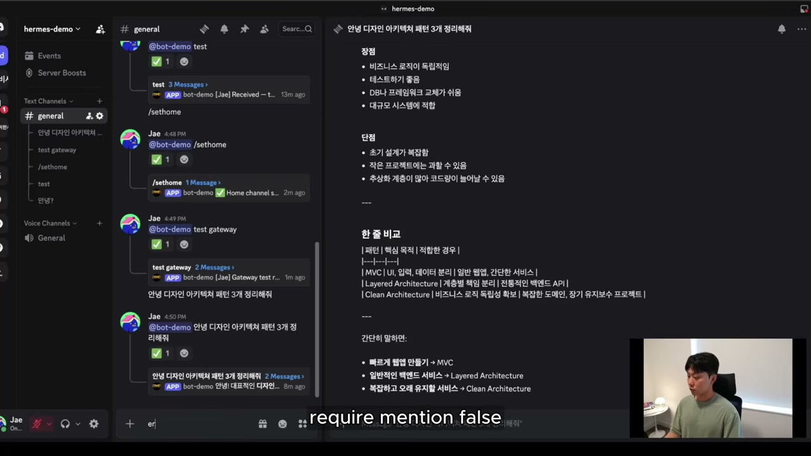

여기까지가 모델과 디스코드를 잇는 작업이다. 화자가 한 번 더 강조하는 운용 팁이 있다. 프론티어 모델은 복잡한 작업에만 쓰고, 그 외에는 싼 모델로 라우팅하는 게 효율이 좋다는 것이다. 그리고 보안과 직결된 설정 하나. `gateway.allowed_users`에 내 유저 아이디를 꼭 등록해야 한다. 이걸 넣어야 게이트웨이와 소통할 수 있는 사람이 나뿐이 된다. 안 넣으면 누구나 소통할 수 있게 열린다.

## 4계층 두뇌, 컨텍스트가 곧 성능이다

연결을 끝낸 뒤 화자는 헤르메스의 내부 아키텍처를 연다. 4계층 두뇌 구조다.

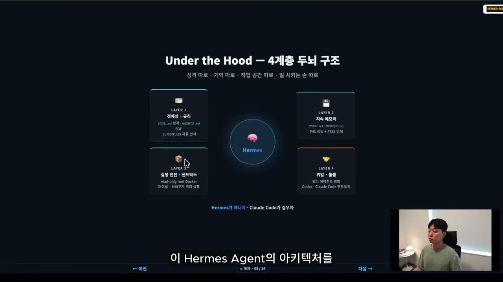

첫 레이어는 정체성과 규칙. `soul.md`는 헤르메스 에이전트의 성격이자 정체성 파일이다. 기본값은 "You are a Hermes agent, an intelligent AI assistant"로 시작하는 일반적인 문장이지만, 화자는 이대로 쓰지 않는다. 자기만의 비서로 개인화해야 하기 때문이다.

헤르메스의 핵심은 네 개의 파일이다.

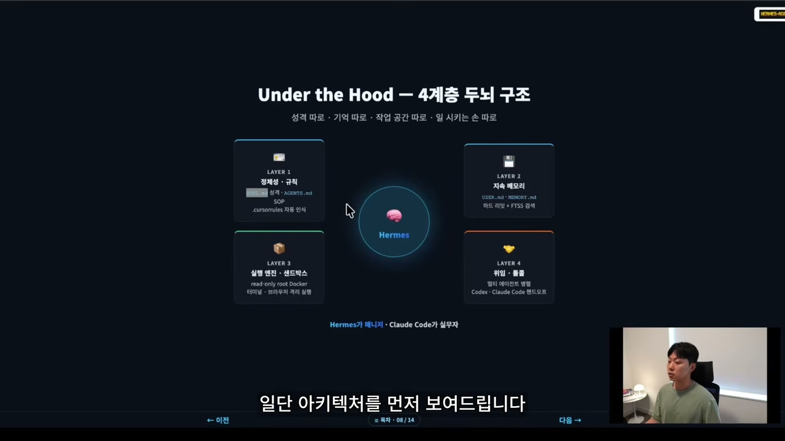

- `soul.md`: 헤르메스 에이전트 자신에 대한 내용, 즉 정체성과 성격
- `agents.md`: 작업을 실행할 때 따라야 할 규칙들. 클로드 코드의 `claude.md`나 코덱스의 `agents.md`와 같은 성격이다
- `user.md`: 나에 대한 정보. 에이전트가 나를 위해 일하려면 나에 대한 정보가 많을수록 일을 잘한다
- `memory.md`: 단기 기억. 그때그때 필요한 정보를 잠깐 저장해두는 곳이다

화자는 이 네 파일을 헤르메스의 성능을 좌지우지하는 컨텍스트 엔지니어링이라고 부른다. 실행 엔진, 샌드박스, 위임, 툴콜 같은 나머지 요소는 클로드 코드와 코덱스로 이미 다 아는 개념이다. 정말 중요한 건 이 네 파일의 컨텍스트를 어떻게 관리하느냐다.

여기서 화자의 통찰이 하나 나온다. 헤르메스가 자가 개선으로 이 파일들을 알아서 채워가긴 하지만, 거기엔 시간이 걸린다. 그러니 처음부터 네 파일을 잘 세팅해두고 시작하라는 것이다.

> 그래프를 보면 이렇게 올라가는 그래프보다는, 처음부터 팍 치고 거기서 쭉 가는 그래프가 훨씬 더 그 시간을 아껴줄 수 있다는 거죠.

<!-- IMG 🎨 자가 개선만 맡긴 경우(천천히 우상향)와 초기 세팅을 잘한 경우(초반에 급상승 후 고원) 두 성능 곡선을 겹친 그래프 -->

자가 개선은 공짜가 아니라 시간이라는 비용을 치른다는 얘기다. 그 비용을 초기 세팅으로 앞당기자는 것이다.

그래서 화자는 디스코드로 네 파일을 만들어 달라고 요청한다. 헤르메스가 딥 인터뷰를 진행한다. 어떤 사람이냐, 내 삶의 키워드는 뭐냐, 내가 너에게 원하는 존재는 무엇이냐, 도울 때 절대 하지 않았으면 하는 방식은 있느냐. 이런 질문들이 오간다.

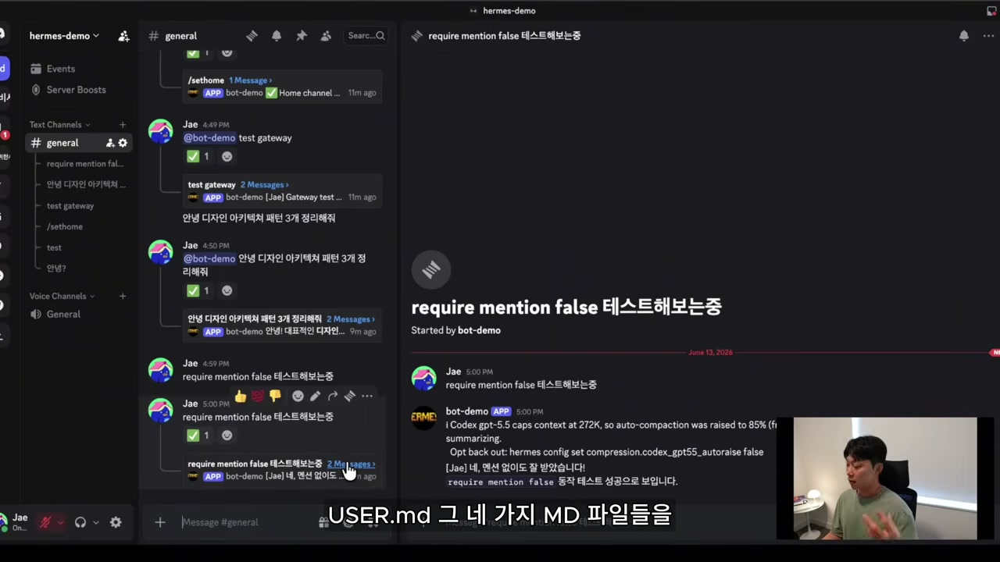

인터뷰 결과로 만들어진 `soul.md`의 Identity 섹션에는 "실밸개발자의 장기적인 사고·실행 파트너"라는 문장이 들어간다. 117줄 정도 되는 파일이다. 이렇게 컨텍스트가 채워지자, "나에 대해 아는 것 세 가지를 알려줘"라는 질문에 헤르메스가 핵심 정체성, 가장 중요한 프로젝트, 선호하는 일하는 방식을 짚어 답한다. 인터뷰 전이라면 아무것도 몰랐을 질문이다. 컨텍스트가 생겼다는 것을 화자는 이렇게 눈으로 보여준다.

## 한 명에서 팀으로, 멀티 프로필

봇 하나는 프로필 하나다. 멀티 에이전트 오케스트레이션을 하려면 프로필이 여럿 필요하다.

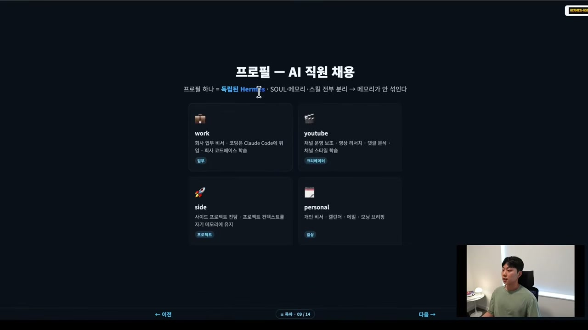

화자의 예시가 구체적이다. 자신은 유튜브도 하고, 개인적인 일도 있고, 사이드 프로젝트도 있고, 메타에서 일도 한다. 각각으로 봇을 만들면 `soul.md`가 네 개 생긴다. 그리고 그것들을 아우르는 메인 헤르메스 에이전트가 있다. 직원에게 부하 직원이 생기는 구조다. 메인 오케스트레이터에게 "유튜브 작업을 유튜브 에이전트한테 시켜라"라고 명령하면, 메인이 일을 시키고 둘이 티켓을 주고받는다. 나를 거칠 필요 없이. 그리고 메인이 나에게 보고한다. 보고 체계에 한 층이 더 생기는 셈이다.

멀티 프로필의 진가는 프로필끼리 미팅을 할 수 있다는 데 있다. PM, QA, 개발로 진짜 개발팀을 꾸렸다고 치면, 그 팀이 `/meeting` 명령으로 에이전트끼리 회의를 한다. 다만 이번 영상에서는 멀티 프로필을 직접 다루지 않고, 이런 게 있다는 것만 짚고 넘어간다.

## 카드 한 장으로 팀을 가동한다, 칸반

마지막 데모는 칸반이다. 헤르메스 에이전트 기능 중에 칸반 보드가 있다. 칸반을 모르는 사람을 위해 화자는 봇에게 직접 설명을 시킨다. 일을 카드로 만들고 상태별로 칸을 나눠 한눈에 보는 방식, 동시에 너무 많이 하지 않게 막는 "업무용 택배 추적 시스템"이라는 답이 돌아온다.

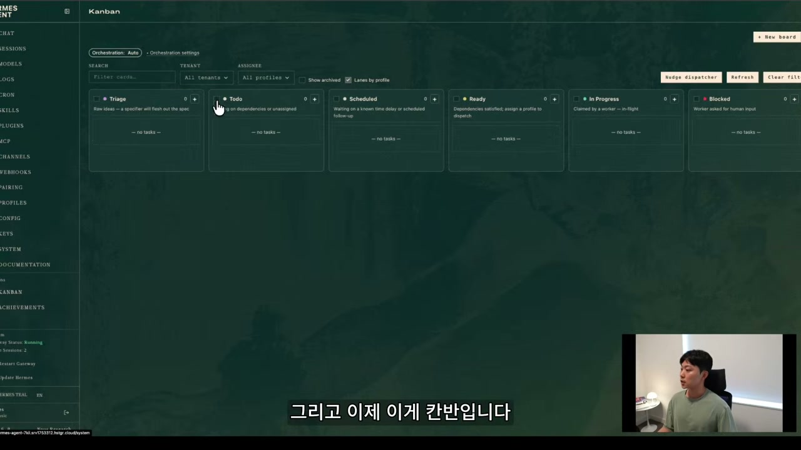

헤르메스의 칸반은 이걸 멀티 에이전트 오케스트레이션 장치로 만든 것이다. 화자가 디스코드로 실험한다. "클로드 코드 관련 랜딩 페이지 만들어줘." 태스크가 생성되면 그 다음 우리가 할 일은 없다. Dispatcher가 새 태스크가 생긴 걸 인식하고, 에이전트가 일을 잘게 쪼개기 시작한다. 화자는 이걸 스펙 드리븐 디벨로프먼트에 비유한다. 스펙을 자세히 쓸수록 결과가 좋아지는 건 하네스 프레임워크와 같다. PRD, 아키텍처, ADR을 만들면 그것을 토대로 에이전트가 일을 쪼개 할당하는 것처럼.

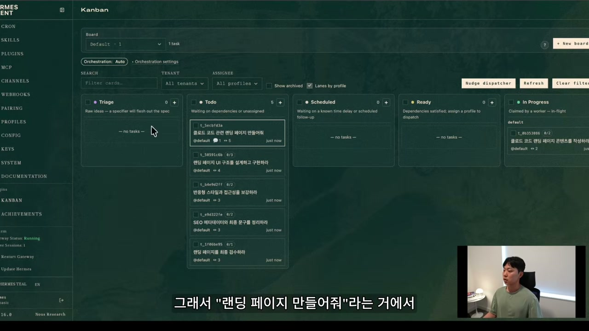

"랜딩 페이지 만들어줘"라는 한 줄이 To-Do 리스트로 넘어가더니 다섯 개의 태스크로 분해된다. 랜딩 페이지 UI 구조 설계와 구현, 반응형 스타일과 접근성 보장, SEO 메타데이터와 최종 문구 정리, 그리고 마지막 QA 검수까지. 곧바로 하나가 In Progress로 들어가 콘텐츠를 작성하기 시작한다. 작업들이 끝나 Done에 가면 랜딩 페이지가 완성된다.

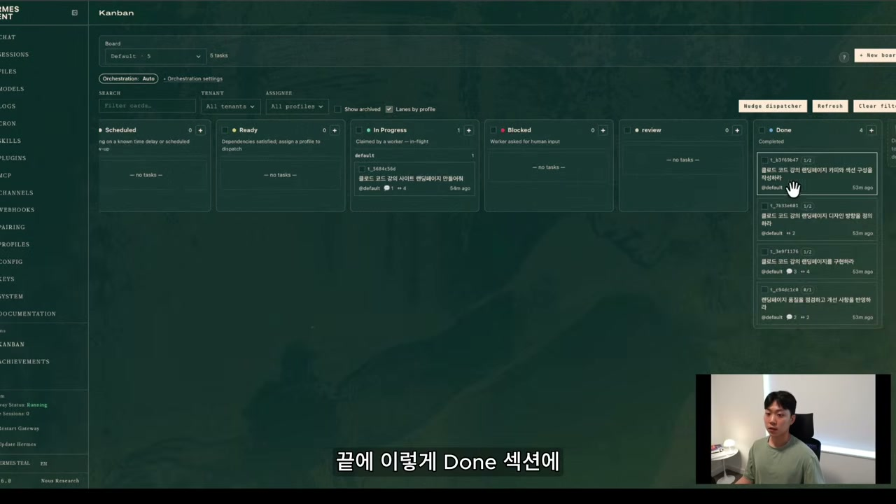

실제로 화자가 만들어진 사이트를 보여준다. "클로드 코드 실전 강의" 사이트가, 깃허브에서 쓰는 법까지 안내하는 랜딩 페이지로 나왔다. 원샷 프롬프트라고 부르기도 뭣할 만큼, 정말 "랜딩 페이지 만들어줘" 한 줄이 전부였다. 목표 하나를 던지면 헤르메스가 알아서 팀을 꾸려 작업하고 결과를 도출한다. 그게 화자가 보여주고 싶었던 그림이다.

## 인텐트만으로는 안 된다, 루프 엔지니어링과 휴먼 인 더 루프

이 대목에서 화자는 기술 시연을 넘어 한 발 물러나 큰 흐름을 읽는다. 페이블 때문에 이 주제가 더 뜨거워졌다고 한다. 페이블은 지금은 못 쓰게 됐지만, 사람들 사이에서는 "하네스 엔지니어링에서 루프 엔지니어링으로 넘어갔다"는 말이 돈다. 예전에는 모델에게 룰을 어느 정도 줘야 했고, 그래서 우리가 스펙을 자세히 짰다. 자세히 짤수록 원하는 결과가 나왔으니까. 그런데 요즘은 의도(인텐트)만 주면 AI가 나머지 갭을 알아서 채워 결과를 가져오는 수준까지 왔다는 것이다.

여기서 화자는 분명한 반론을 단다. 인텐트만으로는 안 된다.

> 인텐트만 줘도 하루 종일 일을 하지만, 결국 이 사람의 테이스트가 들어가야 되는 일들이 있어요.

AI가 모든 걸 끝내고 결과물을 가져왔는데 마음에 안 들 확률이 거의 99%라고 화자는 말한다. 그래서 스펙을 잘 작성하고, 계속 이터러티브하게 일해야 한다. 휴먼 인 더 루프가 필요하다는 것이다. UI도 처음에 프로토타입을 어느 정도 정의하고 시작해야지, 검수 한 번 없이 끝에 나온 UI를 보면 99% 마음에 안 들었다는 게 화자의 경험이다. 루프 엔지니어링이라는 말이 사람을 루프 밖으로 밀어내는 게 아니라, 오히려 사람을 루프 안에 더 자주 끼워넣는 일이라는 것이다.

그리고 헤르메스가 가장 빛나는 지점을 화자는 일상 자동화보다 개발 자동화에서 찾는다. 본인은 사이드 프로젝트와 유튜브 작업을 헤르메스로 해보고 있다. 가장 좋은 건 24/7 에이전트라는 점이다. 예전엔 컴퓨터 앞에 앉아 클로드 코드와 대화해야 했지만, 이제는 침대에서도, 카페에서도 일을 시키고 검수한다. 아이와 놀러 가서 카페에서 커피를 마시며 일을 시키고 결과를 검수하는 것도 꽤 효율적이라고 느꼈다고 한다.

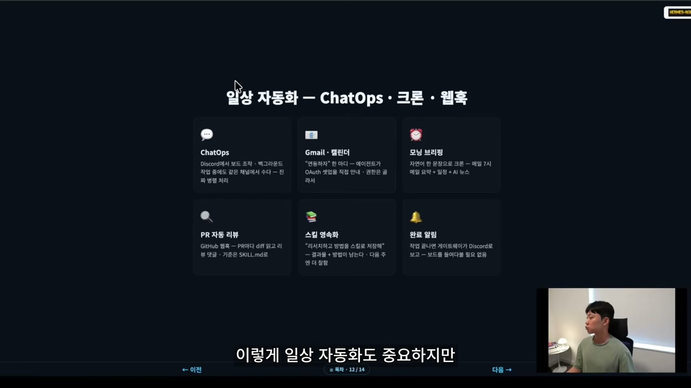

다만 화자는 이런 일상 자동화는 일부러 깊이 다루지 않겠다고 한다. 이미 하는 유튜버가 많기 때문이다. 대신 그가 진짜 강조하고 싶은 건 따로 있다. **에이전트의 프로액티브니스를 끌어올리는 것**이다. 에이전트가 일을 잘하는 건 이제 당연하다. 한 단계 더 나아가, 에이전트가 나에게 인사이트를 주고 나에게 일을 물어보게 만들어야 한다는 것이다.

방법은 자동화다. 크론잡으로 한 시간에 한 번씩 "AI 트렌드, 인사이트를 조사해서 나에게 던져줘"라고 시키면 내 시야의 범위가 넓어진다. 화자는 인사이트가 요즘의 병목이라고 본다. 아무리 영상을 보고 글을 읽어 인사이트를 만들어내려 해도 한계가 있는데, 그 인사이트마저 AI가 어느 정도 포크해줄 수 있다는 것이다. 그래서 화자의 결론은 이렇다. 헤르메스 같은 24/7 에이전트를 프로액티브하게 쓸 수 있는 사람이 살아남을 거라고. 일을 시키는 데서 그치지 말고, 나에게 일을 물어다 주고 새로운 아이디어를 던져줄 수 있는지를 실험하고 있다는 것이다.

## 현실 체크, 만능은 아니다

마무리에서 화자는 현실을 점검한다.

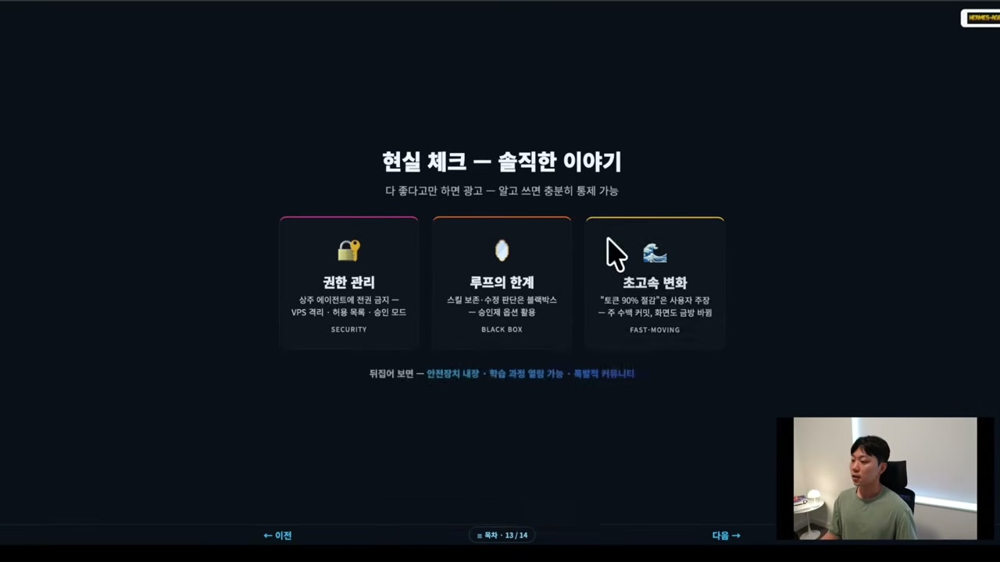

첫째, 권한 관리. 24/7 에이전트는 권한 관리가 중요한데, 헤르메스는 VPS의 도커 컨테이너 안에서 작업하기 때문에 안전하다고 화자는 말한다. 깃허브, 지메일, 구글 캘린더를 연동하고 권한을 최대한 많이 줘도 컨테이너 안이라 괜찮다는 것이다. 그가 그리는 실제 운용은 이렇다. 자기 전에 깃허브 이슈를 세 개 만들어두고 자면, 일어났을 때 버그가 고쳐져 있다. PR의 CI 시그널이 실패하면 10분마다 한 번씩 알아서 고치게 만들어둔다. 새벽에도 나를 위해 일하는 것, 그게 24/7 에이전트의 좋은 점이라고 한다.

둘째, 학습 루프는 만능이 아니다. 헤르메스의 장점은 시킨 일을 스킬로 만들어 스스로 관리한다는 것이지만, 바로 거기에 그늘이 있다. 스킬을 어떻게 바꾸는지에 대한 승인을 우리에게 따로 받지 않는다. 승인받게 할 수도 있지만, 그러면 헤르메스의 장점을 없애는 거라 화자는 권하지 않는다. 대신 스킬과 메모리가 실제로 잘 개선되고 있는지 간혹 한 번씩 체크하라고 권한다. 이 친구가 어떤 알고리즘으로 바꾸는지 우리가 모르기 때문이다. 자율성과 통제 가능성은 맞바꿀 수밖에 없는 긴장 관계이고, 헤르메스는 자율성 쪽에 추를 둔 도구라는 얘기다.

셋째, 초고속 변화. 페이블처럼 어제 쓰던 모델이 오늘 못 쓰게 되는 속도의 시대라는 점이다.

## 정리

화자가 한 줄로 요약한 헤르메스 에이전트는 "서버에 사는 자가 개선 AI 직원"이다. 호스팅어로 24/7 서버를 대여해 디스코드를 연결했고, 멀티 프로필로 팀을 꾸릴 수 있으며, 칸반 대시보드로 목표 하나를 던지면 헤르메스가 팀을 짜 결과를 도출한다.

그리고 마지막 문장이 이 도구의 본질을 가장 잘 압축한다. 데모에서는 헤르메스를 새로 구축해 보여줬지만, 화자가 실제로 쓰는 헤르메스 에이전트는 어제보다 오늘 더 일을 잘한다. 이유는 단순하다. 스킬을 본인이 만들기 때문이다. 어떤 일을 시켰을 때 "이건 스킬로 만들 가치가 있겠다" 싶으면 스스로 스킬을 만든다. 디스코드에 "스킬을 만들고 있다"고 뜬다. 노트북을 꺼도 멈추지 않는 에이전트, 그리고 시간이 갈수록 스스로 나아지는 에이전트. 이 두 가지가 헤르메스가 던지는 답이다.
