페이블 5 가격표를 봤다면, 먼저 눈에 들어오는 숫자는 이것이다. 입력 100만 토큰에 10달러, 출력은 50달러. 오퍼스 4.8에 정확히 2배다.

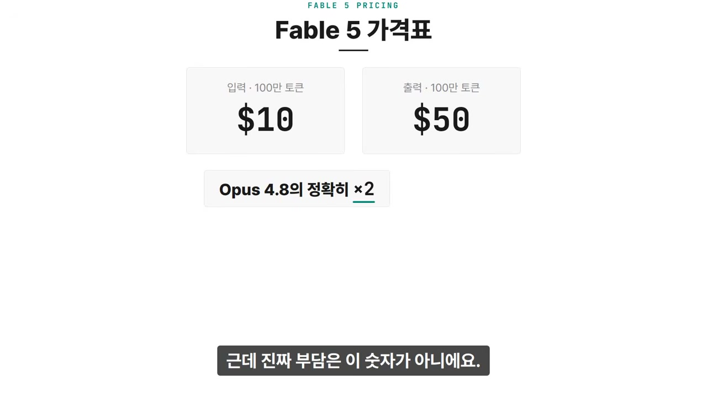

그런데 진짜 부담은 이 숫자가 아니다. 가격표에는 조건이 하나 붙어 있고, 구독하는 사람한테는 그 조건이 2배라는 숫자보다 더 아프게 작동한다.

지금은 페이블 5가 프로와 맥스 플랜에서 추가 비용 없이 풀려 있다. 그런데 6월 23일부터는 플랜 한도에서 빠진다. 그날부터 페이블 5는 정액제 바깥이라는 뜻이다. 월 구독료를 내고 있어도, 이 모델을 쓰려면 API 요금 그대로 크레딧을 따로 사야 한다. 그것도 2배 단가를 정가로.

체감이 어느 정도냐면, 월 100달러짜리 맥스 플랜에서 에이전트 작업을 한 세션 돌렸더니 100달러어치 토큰이 거의 다 소모됐다는 개발자 사례가 올라왔다. 한 달치 구독료가 한 세션에 녹는 단가다.

## 그래서, 누가 쓰라고 만든 모델인가

여기까지 들으면 자연스럽게 한 가지 생각이 든다. 이거 결국 돈 많은 기업 쓰라고 만든 거 아니냐. 실제로 그렇게 읽힐 여지가 있다.

페이블 5가 오퍼스 대비 확실히 앞서는 영역은 길고 복잡한 에이전트 작업이다. SWE-bench 프로에서 오퍼스 4.8이 69.2%, 페이블 5가 80.3%. 그런데 그런 작업을 하루 종일 돌릴 수 있는 게 누구인가. 개인이 아니라 기업이다.

개인은 한 세션에 플랜이 녹는다. 기업은 그 2배 단가를 정가로 내고도 인건비보다 싸니까 쓴다. 같은 가격표가 두 사람에게 정반대로 작동하는 셈이다.

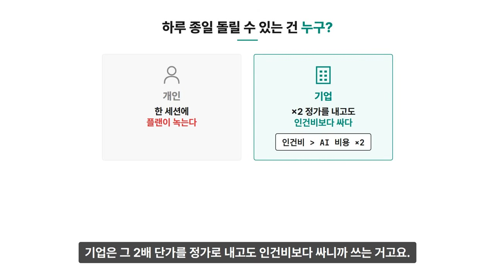

이 방향의 끝은 뻔하다. AI가 비싸질수록 AI로 사람을 대체할 수 있는 쪽과 없는 쪽의 격차는 벌어진다. 그리고 그 격차의 끝에 무엇이 있는지, 엔트로픽 본인들이 적어놓은 문서가 있다.

## 14페이지짜리 정책 제안서

문서 이름은 엔트로픽의 경제정책 프레임워크. 2026년 6월에 나왔고, 14페이지에 각주가 30개 달려 있다. 보도자료가 아니라 정책 제안서 포맷이다.

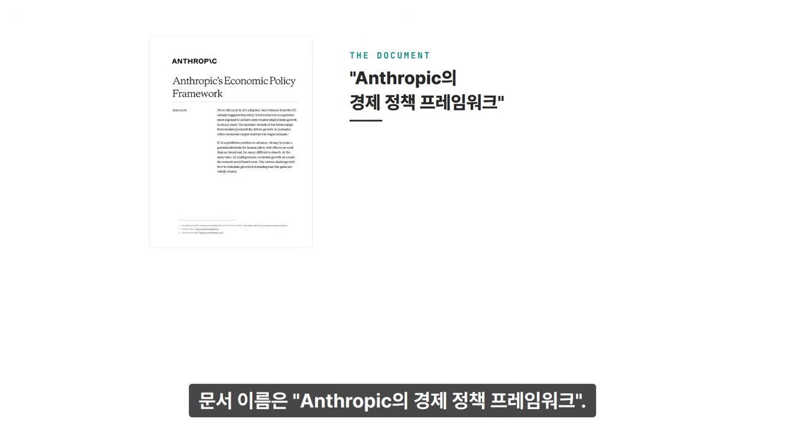

첫 페이지부터 수치가 나온다. 미국에서 AI에 많이 노출된 직군, 그러니까 갓 입사한 신입이 맡는 엔트리 레벨 일자리의 채용 성장세가 최근 몇 년간 약해졌다는 연구를 인용한다. 그리고 경제학자들의 미래 모델을 소개하는데, 한쪽 끝이 완만한 생산성 성장이고 다른 쪽 끝이 이것이다. 경제 생산량은 2배가 되는데 임금은 붕괴하는 시나리오.

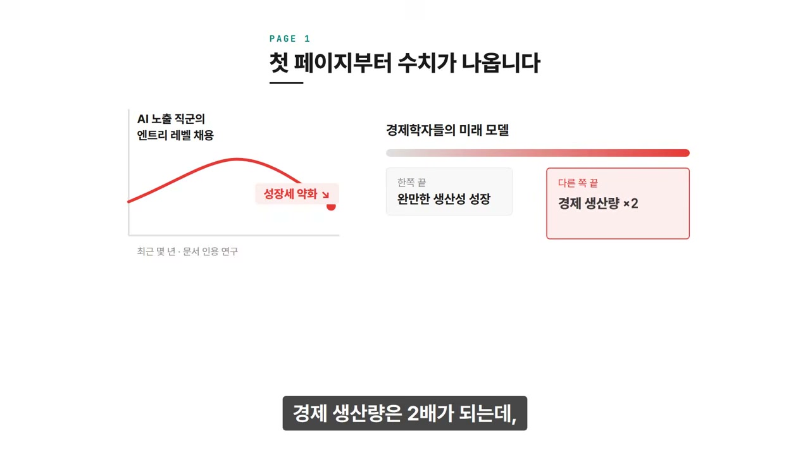

그래서 이 문서의 출발점은 이렇게 정리된다. AI가 사람의 일을 폭넓게 대체할 수 있다. 동시에 경제는 현대 세계가 본 적 없는 규모로 성장할 수 있다. 파이 자체는 커진다는 것이다. 문제는 그 커진 파이가 일하는 사람이 아니라 AI를 가진 자본으로 쏠린다는 데 있다.

그래서 문서가 정의하는 진짜 숙제는 한 문장이다.

> 문제는 성장을 만드는 게 아니다. 그 이익이 널리 공유되게 만드는 것이다.

성장이 아니라 분배가 숙제라는 말이다.

같이 실린 선언 페이지는 이렇게 적는다. 우리는 일자리 대체를 추구하지 않는다. 다만 어느 정도의 대체는 이 기술의 본질적인 결과일 수 있고, 우리의 책임은 그걸 준비하고 대응하는 것이다. 마지막 문단은 이 문장으로 시작한다. 무슨 일이 일어나든 우리는 사람들 편이다.

선언은 선언이다. 이 문서의 본체는 그다음에 있다.

## 실업률 숫자로 끊은 3단계

문서는 정부 대응을 실업률 숫자를 기준으로 3단계로 나눠놨다. 약 5%, 약 10%, 그리고 역사상 최고치를 넘는 수준. 단계가 올라갈수록 더 센 정책 카드를 꺼내는 구조다. 핵심 메시지는 하나다. 충격이 온 다음에 만들기 시작하면 늦으니까 지금 미리 설계해두자.

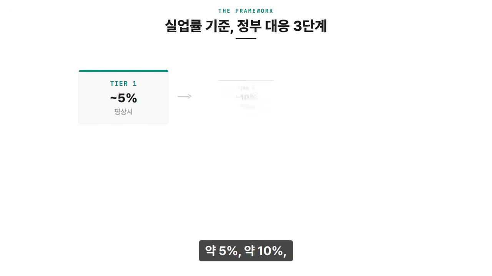

3단계로 들어가기 전에 문서가 먼저 깔아두는 기반이 하나 있다. 측정이다. 지금 정부 통계는 너무 느려서 AI가 일자리를 어떻게 바꾸고 있는지 실시간으로 보지 못한다는 게 문서의 진단이다. 그래서 통계 시스템을 현대화하고, AI 기업의 배포 현황과 고용 영향 데이터 공개를 의무화하자고 한다. 여기에 엔트로픽 자신도 포함된다고 적어놨다. 더해서 정부 안에 AI 전담 분석팀을 만들고, 실업급여 전산 인프라부터 정비하자고 한다.

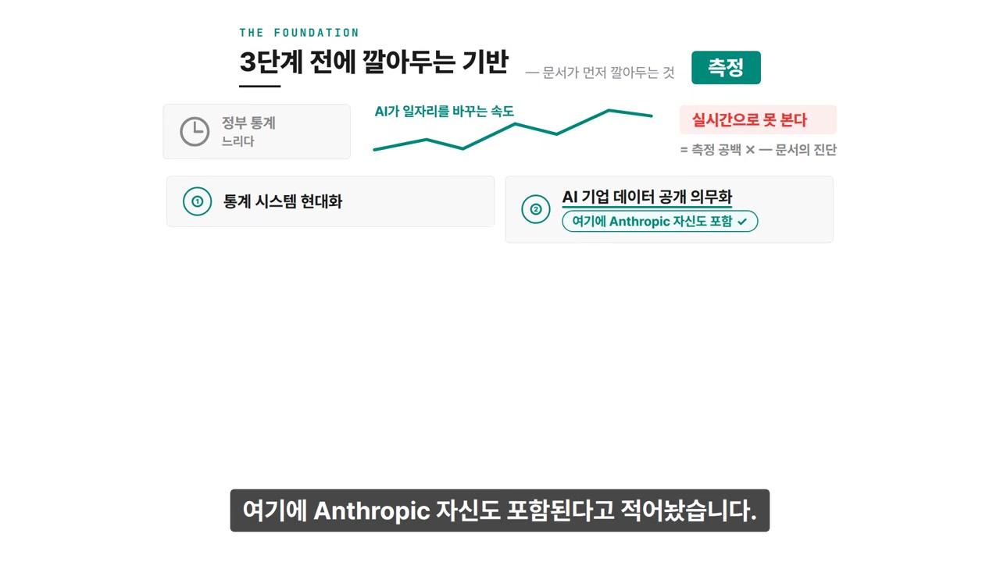

### 1단계: 약 5%, 지금의 평상시

1단계는 지금의 평상시 경제다. 이 단계의 핵심 제안이 사전 분배 자본 계좌다. 쉽게 말하면 전 국민 AI 지분 통장이다. 모든 미국인에게 태어날 때부터 자산 계좌를 깔아주고, 그 계좌에 넣을 수 있는 자금원 중 하나로 AI 기업의 지분을 명시해놨다. AI가 돈을 벌면 국민도 주주로서 같이 버는 구조다.

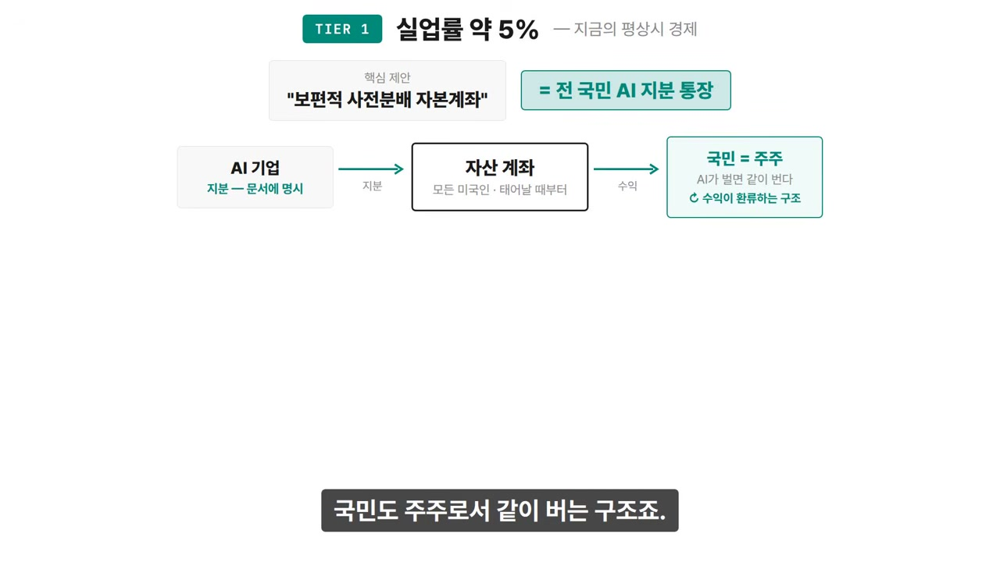

문서가 여기서 강조하는 건 타이밍이다. 계좌는 복리로 불어나니까, 충격이 눈에 보이기 전에 시작해야 의미가 있다는 것이다.

### 2단계: 약 10%, 불안기

2단계의 중심은 실업급여 확대다. 지금 미국은 실업급여를 연장하려면 의회가 매번 법을 새로 만들어야 했다. 거기에 더해 전환 지원과 기본 생계비 지원도 같이 나온다.

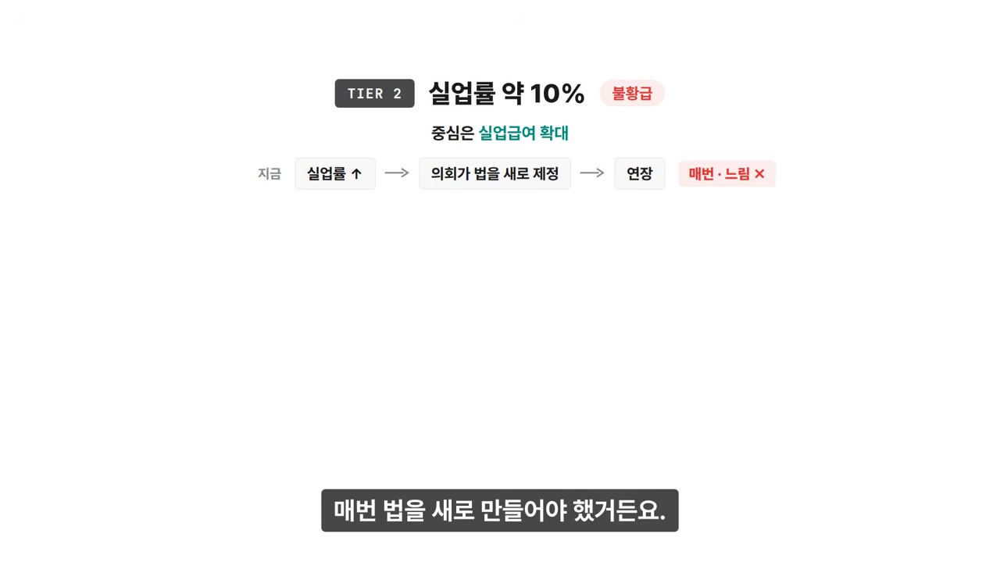

그리고 하나 눈에 띄는 게 있다. 이 단계 수준의 충격이 오면, 기업 단위로 AI 도입 속도를 조절하는 정부 규제를 지지한다고 적혀 있다. 이유도 적혀 있다. 한 회사만 속도를 늦추면 그 회사는 시장을 뺏기니까, 규제는 모든 기업에 동일하게 적용돼야 한다는 것이다.

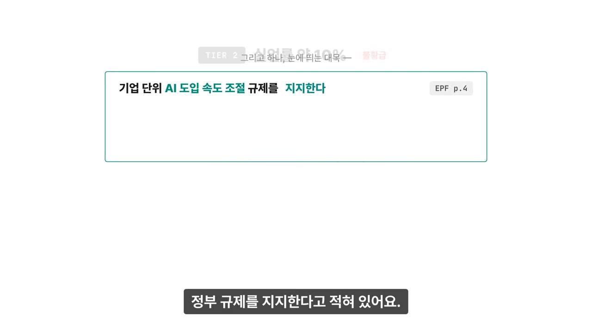

### 3단계: 역사상 최고치를 넘는 수준

3단계는 실업률이 역사상 최고치를 넘는 시나리오다. 문서 표현을 옮기면, 정책 입안자들이 지금까지 쓰던 지도의 바깥으로 나가는 상황이다. 일자리를 구하는 기간이 1년을 넘고 2년을 넘고, 어떤 사람들은 결국 구직 자체를 멈추게 되는 상황.

여기서 정책의 목표가 바뀐다. 일자리로 되돌려 보내는 게 아니라, 소득 자체를 지속적으로 대체하는 것으로. 방식도 적혀 있다. 처음엔 급여를 옛 월급에 비례해서 주다가, 실직이 길어지면 누구에게나 똑같은 기본 금액으로 수렴시키자는 것이다. 문서는 이걸 그다음 메커니즘으로 가는 진입로라고 부르는데, 그 다음 메커니즘이 기본소득, AI 국부펀드, 노동자 지분 공유다.

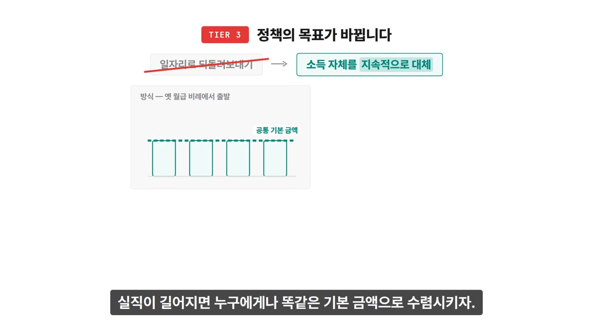

## 세금, 그리고 자기 매출원

3단계에서 제일 흥미로운 건 따로 있다. 새로운 세금 이야기다.

문서의 진단은 이렇다. 지금 세금 구조는 월급에 무겁고 자본에 가볍다. 그런데 AI 시대에 돈이 노동에서 자본 쪽으로 옮겨가면, 경제는 커지는데 세수는 마른다. 3단계처럼 일과 소득의 연결까지 끊어지면 기존 세금 체계로는 못 버틴다는 것이다.

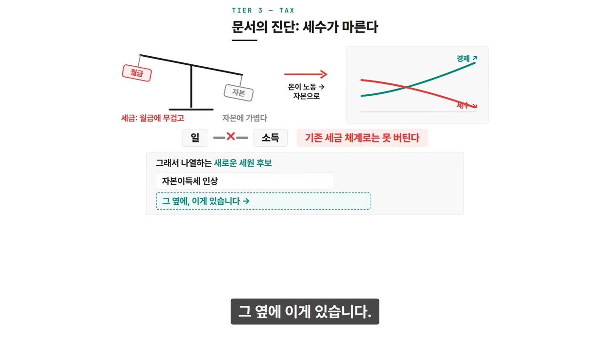

그래서 새로운 세원 후보를 나열하는데, 자본 이득세 인상이 있고, 그 옆에 이것이 있다. AI 사용량에 매기는 세금. 측정 단위까지 적혀 있다. 토큰, 컴퓨트, 또는 매출.

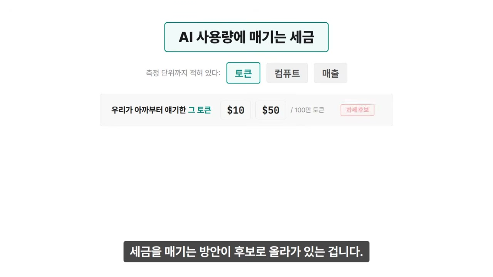

우리가 맨 처음부터 얘기한 그 토큰이다. 100만 개에 10달러, 50달러 하던 그 단위에 세금을 매기는 방안이 후보로 올라가 있다. **그리고 이 문서를 쓴 회사가 바로 그 토큰을 파는 회사다.**

이 대목은 문서에서 유일하게 문단 전체가 굵은 글씨로 강조되어 있다. 한국어로 옮기면 이렇다.

> 세금을 어디에 매기든 어떤 방식으로 분배하든, 우리는 공정한 몫을 낼 준비가 되어 있다. AI 기업이 변혁적인 수익을 낸다면, 그 수익이 널리 공유되도록 할 의무가 있다.

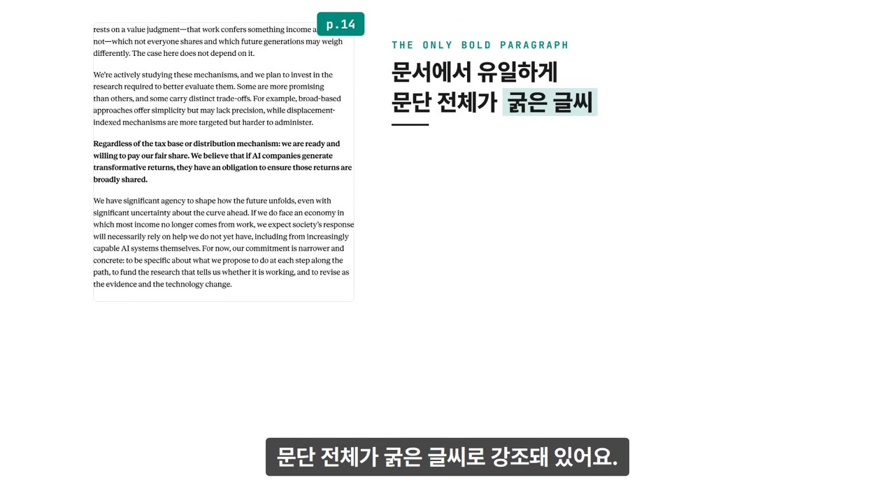

## 두 개를 같이 놓고 보면

정리하면 이렇게 된다. 자사 역대 가장 비싼 모델을 내놓은 회사가, 같은 달에 자기 매출원에 세금을 매기는 방안과 실업률 10% 대비책을 문서로 공개했다.

여기까지가 사실 관계다. 이 문서가 왜 지금 나왔는지는 적혀 있지 않다. 그래서 그것까지는 알 수 없다. 해석은 여러 가지가 가능하다. 규제가 오기 전에 먼저 테이블에 앉으려는 포석일 수도 있고, 진심으로 준비하자는 제안일 수도 있고, 둘 다일 수도 있다. 그건 각자 판단할 몫이다.

다만 문서에 적혀 있는 사실 하나는 짚을 만하다. 이 프레임워크가 기준으로 삼는 건 지금 존재하거나 약 1년 안에 나올 AI 역량이다. 10년 뒤 가상 시나리오가 아니다. 그러니까 이 문서를 쓴 사람들은 적어도 이 대비가 필요해지는 시점을 꽤 가깝게 잡고 있다는 뜻이다.

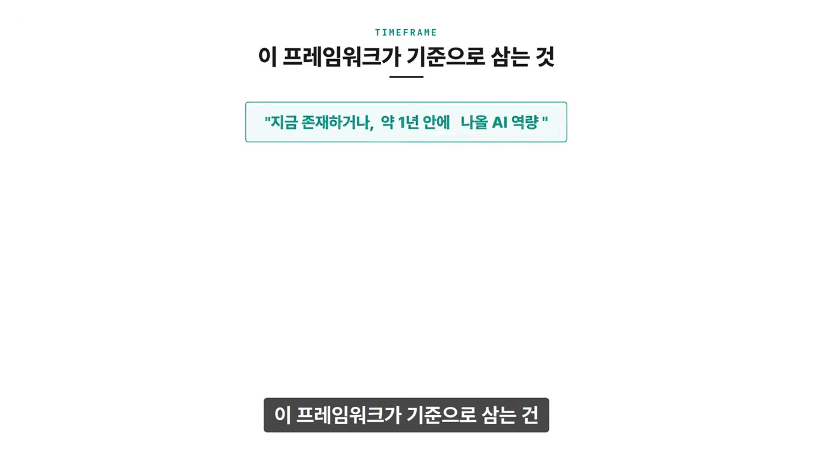

두 줄로 줄이면 이렇다. 페이블 5는 토큰당 2배 비싸졌고, 구독 플랜 한도에서도 빠졌으며, 가장 득을 보는 사용처는 기업형 장시간 에이전트 작업이다. 그리고 그 회사는 같은 달에 실업률 10% 시나리오와 토큰 과세 방안이 담긴 14페이지 정책 문서를 공개했다.

가격이 오르는 것과, 그 가격의 끝에 올 수 있는 상황을 당사자가 문서로 적어둔 것. 이 두 개를 같이 놓고 보는 것까지가 전부다. 연결할지 말지는 읽는 사람 몫이다.

---

원문을 직접 읽고 싶다면 여기로 가면 된다. [Anthropic's Economic Policy Framework](https://www.anthropic.com/policy-on-the-ai-exponential/epf) (이 페이지에서 14페이지 PDF 전문도 받을 수 있다.)
