광화문 교보문고 한복판, 카이스트 뇌과학자 김대식 교수가 진행자 김재원 아나운서(=인터뷰어)와 함께 책장 사이를 걷는다. 오늘의 과제는 "여러 번 읽은 책", 그것도 너덜너덜해질 때까지 읽은 책을 골라달라는 것이다. 김대식 교수가 꺼낸 책은 넷이다. 더글러스 애덤스의 『은하수를 여행하는 히치하이커를 위한 안내서』, 제임스 조이스의 『율리시스』, 오르한 파묵의 『내 이름은 빨강』, 프란츠 카프카의 『변신』. SF 코미디부터 20세기 최고의 난해소설, 노벨문학상 작가의 역사 미스터리, 그리고 벌레로 변한 청년의 우화까지. 장르가 제각각인 이 네 권을 김대식 교수가 같은 책장에 올려두는 이유는 하나다. 읽을 때마다 답이 달라지기 때문이다.

## 왜 같은 책을 또 읽는가

먼저 짚어야 할 질문이 있다. 어떤 책을 여러 번 읽는가. 김대식 교수는 두 종류를 구분한다.

첫 번째는 **읽을 때마다 느낌이 달라지는 책**이다. 그가 인생 책을 읽는 주기는 평균 10년에 한 번. 10대에 읽고, 20대에 읽고, 30대, 40대에 또 읽는다. 매번 다른 책처럼 읽힌다. 반대로 한 번 읽으면 다 알아버려서 두 번 읽을 수 없는 책도 분명히 있다. 그런 책은 인생 책이 못 된다.

두 번째가 흥미롭다. **이해가 안 가서 다시 읽는 책**이다. 처음 읽고 중간에 멈춘 책, 도무지 좋은 줄 모르겠는 책. 보통은 거기서 덮는다. 그런데 김대식 교수는 한 가지 계산을 한다. 내가 믿는 작가들, 평론가들, 100명의 전문가가 좋다고 하는데 나만 안 좋다면, 그들이 틀릴 확률보다 내가 틀릴 확률이 높다. 그러면 최소 몇 번은 더 시도한다. 이 끈기가 두 번째 책 『율리시스』의 출발점이다.

## 『은하수를 여행하는 히치하이커를 위한 안내서』: 삶의 답은 42, 그런데 질문이 뭐였더라

고등학생 때 독일에서 처음 읽은 책. 원래는 라디오 쇼였고, 인기를 끌어 책으로 묶였다. 김대식 교수의 표현으로는 "기크들의 바이블"이다.

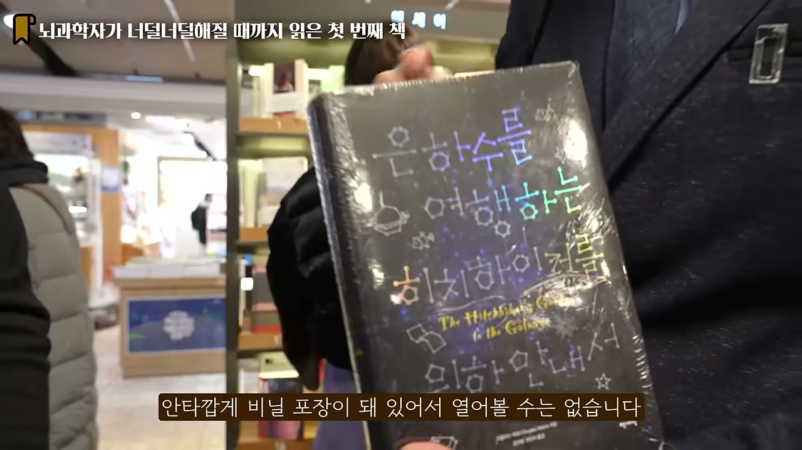

이야기는 지구 멸망으로 시작한다. 그런데 멸망 방식이 황당하다. 외계인들이 우주선을 타고 와서 방송을 한다. 여기 우주 고속도로를 닦아야 하니 지구를 부수겠다, 20년 전부터 예고했는데 너희는 왜 아직 이사를 안 갔냐는 것이다. 지구인들이 그런 얘기 들은 적 없다고 하자, 외계인들은 일광년 옆 별에 다 공고를 붙여놨다고 답한다. 지구인은 일광년을 못 간다. 외계인은 "그런 행성이 다 있어" 하고 지구를 부숴버린다. 친구가 외계인이었던 지구인 한 명만 히치하이킹으로 살아남아, 우주를 떠도는 여행자가 된다.

여기까지는 블랙 코미디다. 진짜 이야기는 이 살아남은 여행자가 던지는 질문에서 시작한다. 우주와 생명을 만든 어마어마한 존재들이 있었다. 옛날 옛적 고도로 발전한 문명, 모든 기술적 문제를 다 풀어버린 문명. 그런데도 그들은 왜 살아야 하는지, 삶의 의미가 뭔지, 왜 태어났는지를 끝내 알지 못했다. 고민 끝에 그들은 우주에서 가장 큰 인공지능 컴퓨터를 만든다. 이름은 Deep Thought, 깊은 생각. (훗날 IBM이 만든 체스 AI Deep Blue가 바로 이 이름에서 이어져 나왔다.)

컴퓨터에게 우주와 삶의 모든 비밀을 답해줄 수 있냐 물으니, 할 수 있다고 한다. 난리가 났다. 그런데 계산에 시간이 좀 걸린단다. 얼마나? 몇백만 년. 후손의 후손의 후손들이 드디어 컴퓨터를 찾아가 인생의 의미를 묻는다. 답이 나온다.

**42.**

숫자 42. 사람들이 어이없어하자 컴퓨터가 말한다. 답은 분명히 42인데, 질문이 정확하지 않았다는 것이다. 이제 질문을 찾아야 한다. 너무 어려운 일이라, 컴퓨터는 자기보다 훨씬 큰 컴퓨터를 디자인해주겠다고 한다. 그 새 컴퓨터의 이름이 바로 지구다.

여기서 소설의 진짜 설정이 드러난다. 지구라는 행성 자체가, 42라는 답에 맞는 질문을 찾기 위해 돌아가는 거대한 컴퓨터다. 우리 사람 하나하나, 생명체 하나하나는 반도체 위를 움직이는 전자 같은 존재다. 우리가 일상을 살고, 사랑하고, 증오하고, 커리어를 쌓고, 은퇴하는 그 하나하나가 전부 계산 단계인 셈이다. 인류가 수억 년을 살아온 건 그 질문을 찾기 위해서였다. 그리고 결국 질문을 찾기 1초 전에, 지구는 우주 고속도로를 만든다는 이유로 파괴된다.

김재원 아나운서가 책 제목의 네 단어, 은하수 · 여행 · 히치하이커 · 안내서 중 어디에 방점을 찍겠냐고 묻자, 김대식 교수는 망설임 없이 **안내서**를 고른다. 이유가 이 책의 핵심을 찌른다. 우리는 인생에 대한 안내서 없이 인생을 시작한다. 저녁 한 끼 먹으러 갈 때도 리뷰를 다 읽고, 처음 가는 유럽이나 남미 여행이라면 몇 주를 공부한다. 그런데 인생은 그 무엇보다 새롭고 처음 겪는 일인데도, 태어날 때 아무도 이게 어떤 세상인지 설명해주지 않는다. "안내서 없이 시작하는 여행이 인생"이라는 것. 그래서 이 책은 우주여행의 기쁨과 블랙 코미디의 진수에 더해, 삶의 깊이를 헤아리는 철학 안내서가 될 수 있다.

## 『율리시스』: 한 사람의 하루치 잡생각, 그리고 언어의 해상도

20세기 최고의 작품이라 불리지만 끝까지 읽은 사람은 드문 책. 김재원 아나운서도, 솔직히 말해 김대식 교수 본인도 책만으로는 끝까지 이해하지 못했다고 고백한다.

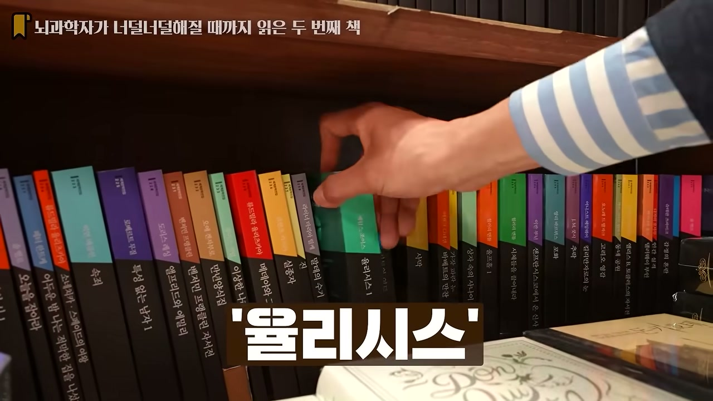

앞서 말한 "이해가 안 가서 다시 읽는 책"의 정점이 바로 이 책이다. 고등학생 때 독일어로 읽었는데 도무지 이해가 안 됐다. 번역 탓인가 싶어 영어판을 사서 읽었는데 그것도 마찬가지. 모든 문학 교과서가 최고작이라 하는데 자기는 모르겠다는 오기가 생겨, 거의 10년을 너덜너덜해질 때까지 읽었다. 결국 책으로는 이해를 못했고, 영화를 보고 나서야 비로소 풀렸다.

제목 율리시스는 오디세우스의 라틴어식 이름이다. 오디세우스가 20년의 여정을 그린 책이라면, 율리시스는 더블린에 사는 평범한 유대인 남성 레오폴드 블룸의 단 하루를 그린다. 새벽 4시 몇 분에 일어나 도시를 하루 종일 돌아다니는 여정이, 천 쪽짜리 책으로 펼쳐진다. "문학 역사상 가장 긴 하루"다.

그런데 정작 하는 일은 아무것도 없다. 천 쪽 동안 무엇을 채웠는가. 김대식 교수의 설명이 이 책의 핵심을 연다. **문학사에서 처음으로 인간의 생각 자체를 표현한 책**이라는 것이다.

그가 든 예가 구체적이다. 지금 이 장면, 김재원 아나운서와 김대식 교수가 서점에서 책 이야기를 한다. 눈에 보이는 사실은 문장 하나둘이면 끝난다. 그런데 그 두 문장 사이, 두 사람의 머릿속에는 어마어마한 잡생각이 동시에 돌아간다. 다음 책은 뭘 얘기하지 같은 건설적인 생각도 있지만, 동시에 점심을 못 먹어서 배가 고프다, 이 목도리에 또 어떤 댓글이 달릴까, 어디가 가렵다, 머리가 아프다 같은 잡생각이 끊임없이 끼어든다.

보통 우리는 말을 할 때 이 잡생각들을 억제한다. 김대식 교수는 스피치 코칭에서 말을 더듬는 이유를 이렇게 설명한다고 한다. 말하려는 순간 다른 생각이 끼어들기 때문이라고. 말을 잘한다는 건 입을 향한 고속도로를 계속 닦아서, 튀어나가려는 생각들을 한 방향으로 억제하는 일이다. 그런데 『율리시스』는 정반대다. 그 어느 생각도 억제하지 말고 "그래 다 나와봐" 하고 풀어놓는다.

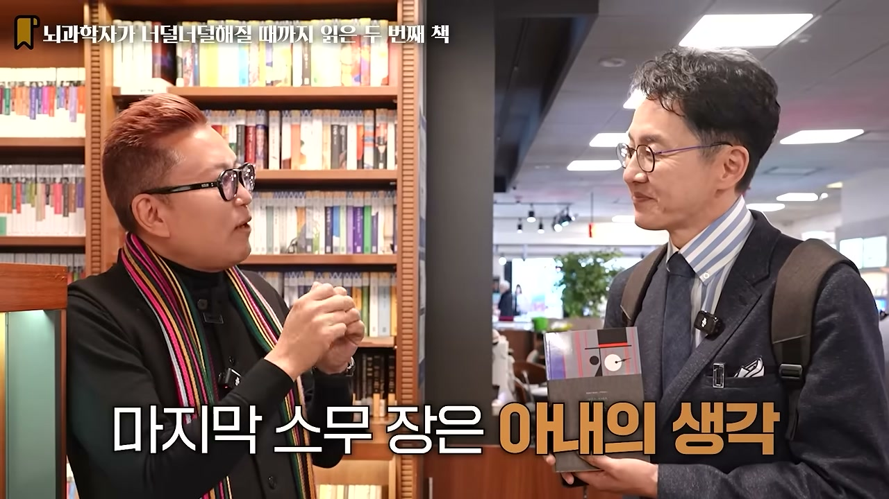

그래서 책 속 눈에 보이는 행동은 단순하다. "레오폴드 블룸이 문을 열었다." 그런데 그게 몇십 장이다. 문 여는 동안 떠오른 별의별 생각이 다 들어간다. 생각은 동시에 100가지, 1000가지가 벌어지는데, 글은 그걸 순서대로 한 줄씩 늘어놓아야 하니 첫 문장과 다음 문장이 연결되지 않는다. 다른 생각이 끼어들었기 때문이다. 이해하기 어려운 게 당연하다.

압권은 마지막 스무 장이다. 블룸이 하루를 마치고 침대에 누워 잠든 뒤, 책은 바로 옆에 누운 아내 몰리의 생각으로 넘어간다. 그리고 몰리의 생각에는 마침표도 쉼표도 없다. 더 극단적으로 표현한 것이다. 남편의 생각은 그래도 문법적이지만, 곰곰이 생각해보면 우리는 생각을 문법적으로 하지 않는다. 주술 관계도 안 맞고 앞뒤도 없다. 이 마지막 스무 장이 문학사에서 인간의 생각을 글로 표현한 가장 훌륭한 챕터로 꼽힌다. 책 전체가 어렵다면 마지막 스무 장만 읽어도 좋다는 게 그의 권유다.

이 책은 문학을 넘어 아일랜드의 국민 책이기도 하다. 더블린에는 블룸스데이가 있다. 소설 속 주인공이 더블린을 돌아다닌 그날, 사람들이 책을 들고 블룸이 걸었던 경로를 그대로 따라 걷는다. 서울로 치면 광화문을 갔다 마포를 갔다 도시를 한 바퀴 도는 식이다. 김대식 교수의 버킷리스트 중 하나가 이 블룸스데이에 직접 가보는 것이다.

### 언어의 해상도는 생각의 해상도보다 낮다

여기서 대화는 뇌과학으로 넘어간다. 5만 가지 생각이라는 관용구는 하루치인가 한 시간치인가. 김대식 교수의 답은 뇌의 구조에서 시작한다.

인간 뇌에는 약 100조 개의 신경세포 연결고리가 있다. 그리고 신경세포는 어렸을 때 타고난 개수로 평생을 살아야 한다. 결정적 시기가 끝나면 새로 생기지 않는다는 게 교과서적 설명이다. (가장 최근 논문에선 조금씩 생긴다는 얘기도 있다고 그는 조심스럽게 덧붙인다.) 그래서 치매처럼 세포가 망가지면 대체가 안 돼 문제가 커지고, 술을 마시면 신경세포가 많이 망가진다. 김대식 교수가 지인들에게 늘 하는 말이 있다. 술 마시기 전에 한 번 계산하라는 것. "지금 저 사람과 마시는 술이 신경세포 50만 개의 가치가 있을까?" 가치가 있으면 마시고, 없으면 마시지 말라는 농담 섞인 기준이다.

이 100조 개로 연결된 뇌는 세상에 대한 거대 언어모델 같은 모델을 품고 있다. AI에서 GPU가 필요한 이유가 병렬 처리이듯, 뇌에서도 동시에 수많은 일이 벌어진다. 그래서 최근 뇌과학은 "나"라는 자아가 하나가 아니라고 본다.

나는 하나가 아니라 "나들"이다. 배경자아, 경험자아 같은 말이 있듯, 그런 자아가 수백만 개 있을 것이라는 게 그의 생각이다. 그중 기억하고 표현하는 맨 위의 도미넌트한 녀석이 살아남아 "나"가 되고, 나머지 수백만 개의 자아는 밑에서 억압당하고 있다. 다만 종종 튀어나온다. 김대식 교수는 이 알록달록한 목도리를 하고 싶은 자아도 자기 안에 있는데, 직업적으로 그걸 억누르는 범생이 자아가 도미넌트가 됐다고 농담한다.

그리고 이 모든 이야기가 향하는 통찰이 **언어의 해상도**다. 우리는 머릿속에 어마어마한 양의 생각을 가지고 있는데, 그걸 표현할 단어의 개수는 턱없이 부족하다. 김대식 교수의 느낌으로는 생각이 언어로 표현되는 비율이 1만 분의 1, 10만 분의 1 정도다.

빨간 사과를 예로 든다. 사과를 들고 "이 사과 빨갛지요?" 하면 빨갛다고 답할 것이다. 그런데 실제 눈에 보이는 색은 완벽한 빨강이 아니다. 푸릇푸릇함도 있고 점도 있다. 그걸 표현할 단어는 없다. 결국 **"빨간 사과"라는 문장은 인식된 정보를 표현하는 단어가 아니라 제목이다.** 나도 빨간 사과를 봤고 상대도 봤으니, "빨간 사과"라는 제목을 던져 상대의 머릿속 기억을 끄집어내도록 유도하는 것이다.

그러니 내가 생각하는 빨간 사과와 상대가 생각하는 빨간 사과는 다르다. 그런데 같은 단어를 쓰기 때문에 우리는 서로를 이해한다는 착각을 가진다. 사회에 그토록 많은 오해가 있는 이유가 여기 있다. 민주주의, 자유, 사랑. 다 같은 단어를 쓰지만 각자 다른 걸 생각한다. 사랑이라는 단어 하나에도 80만 개의 정의가 있는 셈이다. "우리 자유로운 세상 만들자"고 합의할 때, 사실 서로 다른 생각을 하고 있는 것이다.

배신이라는 감정도 여기서 나온다. "너 그때는 그렇게 말하더니 왜 지금은 다르게 행동해?" 그 사람은 자기 머릿속 해석대로 행동한 것뿐이다. 내가 기대한 사랑과 상대가 보여주는 사랑이 안 맞으면 배신당했다고 느끼지만, 배신이 아니다. 처음부터 서로 다른 얘기를 하고 있었던 것이다. 그래서 율리시스는 결국 타인의 생각을 이해하는 일이 얼마나 어려운지를 보여주는 책이 된다.

## 『내 이름은 빨강』: 세상이 추한데, 그림을 그려도 되는가

노벨문학상을 받은 터키 작가 오르한 파묵의 책. 파묵에게는 더 유명한 책도 많지만, 김대식 교수가 이 책을 고른 이유는 분명하다. 그가 가장 좋아하는 분야가 문학과 예술인데, 예술의 중요성과 역할을 가장 잘 표현한 책이라는 것이다.

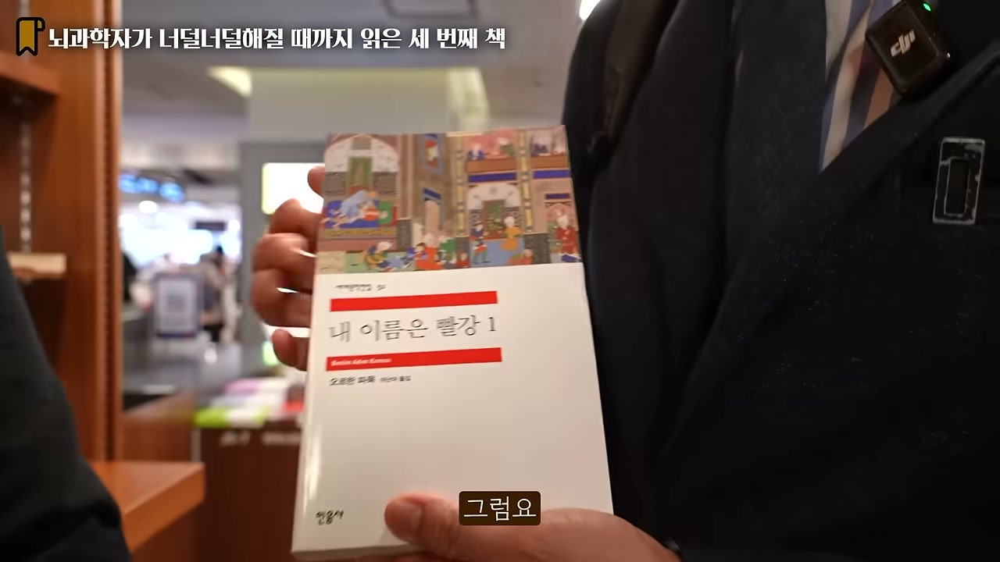

이 책이 던지는 질문은 이렇다. **인간이 그림을 그려야 할까?** 세상이 아름답지 않은데, 아니 세상이 추한데, 그걸 아름다운 그림으로 표현하는 건 적절한가, 비도덕적이지 않은가.

이 질문의 무게를 느끼게 하는 옛날이야기가 책 속에 있다. 김대식 교수가 먼저 배경을 깐다. 기원후 10세기, 11세기 무렵에는 기독교 유럽보다 이슬람 중동이 훨씬 발달했다. 지금 이슬람 하면 테러를 떠올리지만, 그 당시 이슬람은 가장 계몽주의적이고 포용적인 종교였다. 아라비안 나이트 같은 이야기가 다 그때 만들어졌다. 바그다드에는 엄청난 도서관이 있어 다양한 종교의 학자들이 모여 토론했고, 책이 수십만 권 있었다.

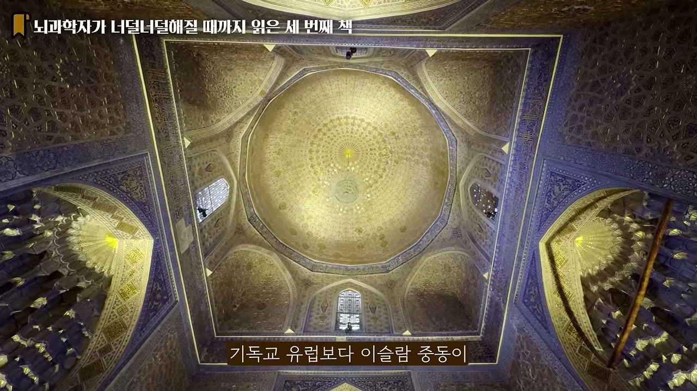

그런데 13세기, 14세기에 몽골 군대가 쳐들어온다. 몽골군은 잔인하기로 유명했다. 성 밖에서 항복하면 봐주지만 버티면 대학살이었다. 바그다드의 아바스 왕족은 당시 가장 막강했기에 항복할 이유가 없었다. 전쟁을 했고, 결국 졌다. 바그다드 함락은 인류 역사상 가장 잔인한 함락으로 불린다. 들어와서 몇십만 명을 다 죽였다.

이야기는 그 함락 속 한 화가에서 시작한다. 바그다드에서 평범하게 살던 화가가 도시에 난리가 나자 탑 위로 도망쳐 살아남는다. 그런데 그 탑 위에서 모든 게 다 보인다. 옆집 친구가 죽고, 가족이 죽고, 어머니가 죽는다. 소리까지 다 들린다. 자기가 내려가면 죽으니 아무것도 할 수 없고, 그저 그 잔인한 장면을 며칠이고 봐야 한다.

처음엔 신에게 기도한다. 몽골군이 사라지게 해달라. 안 된다. 그럼 적어도 가족과 친구들이 빨리 죽게 해달라. 그것도 안 된다. 정말 잔인하게 다 죽어간다. 안 보려고 구석에서 눈을 가리지만, 자기 아이들이 거기 있는데 안 볼 수가 없다. 엉엉 울면서 기어가 또 본다. 바그다드를 가르는 티그리스 강물이 새빨개졌다가 시커매졌다고 한다. 잉크 때문이다. 책을 다 강에 던졌으니까.

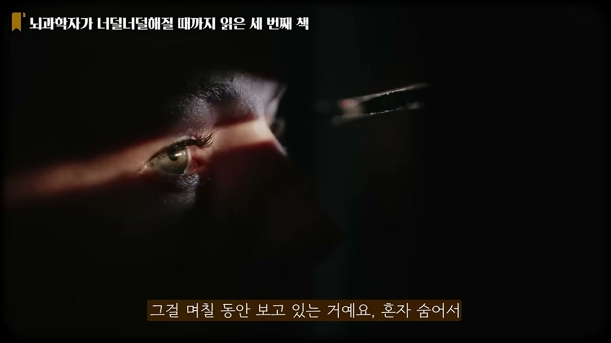

결국 화가는 자기에게 눈이 있어서 이 잔인한 현실을 볼 수밖에 없다는 자괴감에 빠져, 바늘을 꺼내 자기 눈을 찌른다. 안 보려고. 그리고 그때부터 결심한다. 화가들을 다 죽이겠다고.

이렇게 잔인한 세상인데 너희는 무슨 아름다운 그림을 그리고 있냐. 사랑하는 연인이 손잡고 다니는 모습을 그리는 것 자체가, 죽은 사람들에 대한 오만이고 모욕이라는 것이다. 그래서 화가는 살인자가 되어 화가들을 암살하기 시작하고, 그 미스터리를 푸는 것이 이 책의 줄거리다.

김대식 교수는 이 책의 가치를 다른 각도에서도 짚는다. 우리는 한국, 중국을 잘 알고 미디어를 통해 미국도 알고 유럽도 여행으로 익숙하다. 그런데 한국과 유럽 사이에는 인도와 중동이라는 두 거대 문명이 더 있는데, 우리는 거의 모른다. 학교에서 가르쳐주지도 않는다. 그래서 그는 일부러 유럽보다 중동과 인도 여행을 많이 다닌다고 한다. 갈 때마다 "이 스토리를 내가 평생 모르고 살았다고?" 하는 놀라움을 만난다. 오랫동안 입던 옷 주머니에서 몇십만 원을 발견하는 기쁨에 비유한다. 중동 역사가 곧 『내 이름은 빨강』의 입문서라는 것이다.

제목의 은유, 즉 "빨강이 누구인가"는 스포일러라며 끝내 답하지 않는다. 그 질문을 품고 책을 시작하라는 것이 그의 권유다.

### 곁가지로 흘러나온 책들: 『킬리만자로의 눈』과 『깊이에의 강요』

대화는 자연스럽게 "읽을 때마다 답이 달라지는 책"이라는 주제로 흘러, 추천 목록에 없던 책들이 따라 나온다.

헤밍웨이의 단편 『킬리만자로의 눈』. 아프리카에서 가장 높고, 더운 대륙에서 유일하게 늘 눈으로 덮인 신비한 산이다. 등산을 너무 싫어한다는 김대식 교수가 그 정상의 한 장면을 전한다. 힘들게 올라가 보니 정상에 레오파드 한 마리가 얼어 죽어 있다. 책의 질문은 이것이다. 이 레오파드는 왜 여기까지 올라왔을까, 왜 여기서 얼어 죽었을까. 위에는 먹이도 없고 아무것도 없는데, 굳이 고생해서 올라와 결국 얼어 죽었다.

이 책을 그는 고등학생 때 숙제로 처음 읽었다. 학교에서 읽은 책이라 기억이 안 좋고, 그때는 "제정신이 아니었다" 같은 답을 써내고 구석에 뒀다. 그런데 10년 뒤 20대에 다시 읽으니 레오파드가 뭘 찾으러 갔는지 알겠더란다. 30대에 읽으니 답이 또 달라졌다. 아무것도 없는 곳을 기꺼이 올라가는 그 이유, 결국 거기서 죽을 걸 알면서도. 이게 인생의 비유다. 10대, 20대, 30대, 40대, 50대마다 읽을 때 레오파드는 다른 존재가 된다. 그는 그게 뭔지 발견했다고 말한다.

여기에 김재원 아나운서도 자기 책을 보탠다. 파트리크 쥐스킨트의 『깊이에의 강요』. 한 평론가가 "이 화가의 작품에는 깊이가 없다"고 한 말에 매몰돼, 작품 활동을 제대로 못하게 된 화가의 이야기다. 진행이라는 영역에서 어떻게 깊이를 추구할까 고민될 때쯤이면 그가 꺼내 드는 책이다. 결론은 늘 같다. 타인의 평가보다 내 마음의 깊이가 훨씬 중요하다는 것. 그런데 자기가 처한 상황에 따라 받는 느낌이 매번 다르다.

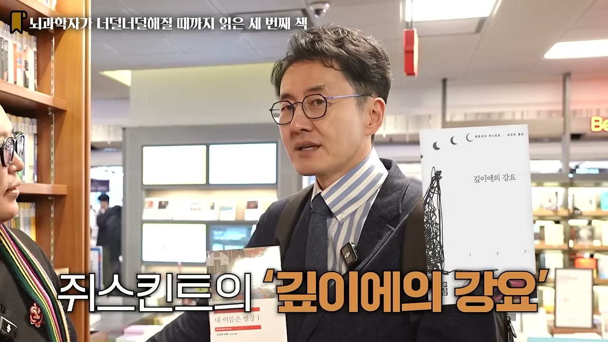

이 대목에서 두 사람은 왜 클래식이 클래식인지로 빠진다. 김대식 교수는 요즘 자꾸 클래식 위주로 읽게 된다고 한다. 지금 나오는 책들은 클래식이 될 수도 있지만, 몇 년 기다리면 어차피 걸러진다. 반면 수백 년 전 책이 여전히 살아 있다는 건 뭔가 있어서 살아남았다는 뜻이다. 특히 인쇄술 이전, 누군가 죽을 고생을 하며 손으로 베껴 써서 남긴 책이라면 그만한 가치가 있는 것이다. 클래식은 "안전빵"이라는 표현이 나온다.

### 죽을 때까지 읽을 수 있는 책은 몇 권인가

김대식 교수가 얼마 전 실제로 해봤다는 계산이 인상적이다. 죽을 때까지 책을 몇 번이나 읽을 수 있을까. 책 읽는 속도는 뻔하고, 여유 시간도 뻔하다. 주말 정도에 읽는다고 계산해봤더니, 그 숫자가 생각보다 작았다. 몇천 권이 아니라, 아무리 긍정적으로 봐도 몇백 권이 안 됐다.

이 계산이 그에게 "허걱" 하는 충격을 줬다. 이렇게 책이 많은데 내가 읽을 수 있는 건 몇백 권뿐이라니. 그래서 책 고르기가 까다로워졌다. 사놓고 앞부분을 읽어 느낌이 없으면 안 읽는다. 그 기회비용이 너무 아깝기 때문이다.

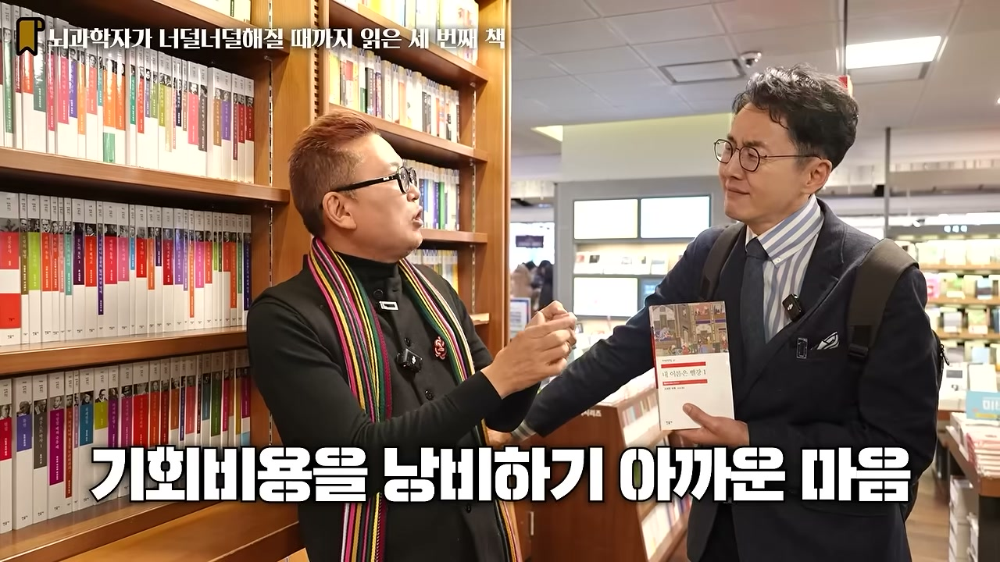

그런데 최근에는 이 기준이 책을 넘어 모든 곳으로 번지기 시작했다고 한다. 욕먹을 행동이라며 스스로 인정하면서도, 누군가와 보내는 시간조차 아깝게 느껴진다는 것이다. 1년에 누군가와 진지하게 밥 먹는 날이 100일도 안 될 수 있다. 남은 인생에서 진지하게 밥 먹을 사람이 천 명이라 치면, 모든 사람을 행복하게 할 수는 없으니 기회비용을 잘 계산해야 한다는 논리다. 김재원 아나운서는 "사람은 알아서 하시고, 책만큼은 신중하게 선택하셨으면 좋겠다"며 가볍게 받는다.

## 『변신』: 내가 누구인지보다, 남이 나를 어떻게 보는지

마지막 책. 카프카의 『변신』은 길지 않으면서도 마음에 무언가를 남기는 책이다. 김대식 교수에게는 먼저 안 좋은 기억이 떠오른다. 독일 학교에서 독일어 시간에 맨날 읽혀서다. 학교에서 읽는 책은 그냥 반감이 생긴다. 나중에 보면 훌륭한 책인데, 그때는 그저 학교가 싫었던 것 같다고 한다.

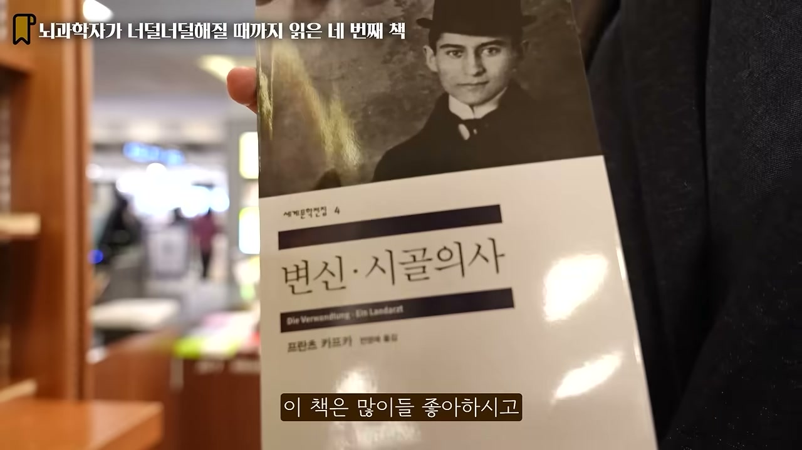

줄거리는 다들 안다. 그레고르 잠자라는 평범한 청년은 가족을 위해 헌신한다. 결혼도 안 하고 부모를 먹여 살리며, 특히 사랑하는 여동생에게는 돈이 없어도 하고 싶은 걸 다 해준다. 자기는 하루 종일 일만 한다. 그런 그레고르가 어느 날 아침 눈을 뜬다. 본인에게는 변한 게 아무것도 없다. 그런데 부모가 문을 열고 들어왔다가 비명을 지르며 도망간다. 외모가 사람만 한, 정확히 무슨 벌레인지도 모를 징그러운 벌레로 바뀐 것이다.

그레고르는 말을 한다. "나 그레고른데." 확인해보니 아들이 맞다. 다만 외모가 완전히 벌레다. 가족은 그를 방에 숨기고, 그는 감옥처럼 갇혀 부모가 던져주는 빵조각을 먹으며 산다. 그래도 오케이한다. 문제는 여동생이 약혼자를 집에 데려오겠다고 하면서 터진다. 저 방에 벌레가 사는 걸 약혼자가 알면 안 된다. 그리고 책의 마지막, 평생 헌신의 대상이었던 그 여동생이 말한다. "저거 갖다 버려."

여기서 김대식 교수가 이 책을 미래를 예언한 작품으로 읽는 대목이 강렬하다. 카프카는 유대인이었고, 병으로 일찍 죽었다. 김대식 교수는 아마 1920년대 말쯤이었을 거라고 어림한다. 그리고 10년 후 세상이 바뀐다. 독일에서 히틀러가 정권을 잡고, 얼마 전까지 옆집에 살던 유대인들을 수용소에 가둔다. 그들을 무엇으로 죽였는가. 바퀴벌레 살충제로 죽였다.

그래서 『변신』은 20세기를 거의 암시하듯 보여준다. **인간을 인간 이하로, 벌레로 취급하기 시작하면 무엇이든 할 수 있다.** 그레고르는 여전히 내면이 인간인데, 외모를 근거로 인간이 아니라고 판단하는 순간 바퀴벌레처럼 갖다 버려도 되는 존재가 된다. 김대식 교수는 카프카가 이걸 생각으로 예측한 게 아니라 그냥 느꼈을 거라고 본다. 세상이 미쳐가고 있는데 아직 표면에 안 드러난 그 기운을, 예민한 사람이라 먼저 느끼고 이야기로 적었으리라는 것이다. 차라리 카프카가 일찍 죽은 게, 그 자신이 수용소에서 학살당하는 꼴을 안 본 점에서는 다행이라는 말까지 덧붙인다.

이 책이 보여주는 더 근본적인 통찰은 자아에 관한 것이다. 우리는 늘 "자기가 누군지를 알아야 한다"고 말한다. 『변신』은 그게 필요조건이지만 충분조건은 아니라고 말한다. 내가 누구냐도 중요하지만, **세상 사람들이 나를 어떻게 보는지도 내 자아의 한 부분일 수밖에 없다.** 내가 아무리 사람이라 해도, 나를 바퀴벌레라 부르는 사람들의 숫자가 더 많으면 나는 벌레가 되는 것이다.

남의 얘기 같지만 그렇지 않다. 우리는 누구나 노인이 된다. 노인을 바라보는 가족의 관점, 젊은 세대의 관점이 바로 여동생이 오빠를 바라보는 관점이다. 김재원 아나운서도 젊었을 때 상상한 지금 자기 나이는 "한참 할아버지"였는데, 지금 느끼는 실체와 그 이미지 사이의 간극이 어마어마하다고 한다. 나라는 존재는 죽을 때까지 안 변하는데, 껍데기가 계속 변해간다. 나이를 먹는다는 건 사회가 정한 기준으로는 조금씩 덜 아름다워지는 것이다. 피부가 안 좋아지고, 머리가 빠지고, 배가 나온다.

그래서 『변신』은 그레고르 잠자만의 이야기가 아니다. 이 세상에 태어나지 않은 사람은 있어도 늙지 않은 사람은 없다. 껍질이 계속 변하는 건 인생의 필연적 운명이기에, 이건 우리 모두의 이야기다. 진정한 자아는 바뀌지 않는 내면일까, 아니면 어쩔 수 없이 계속 바뀌는 이 껍데기일까. 카프카가 남긴 질문이다.

## 책장 너머의 사람들: 여섯 독자가 말하는 책

여기서 카메라는 김대식 교수를 떠나, 같은 서점을 거니는 보통 독자들에게로 향한다. 진행자가 "사람은 책을 만들고 책은 사람을 만든다"는 말을 입구의 조형물 앞에서 던지며 코너가 바뀐다.

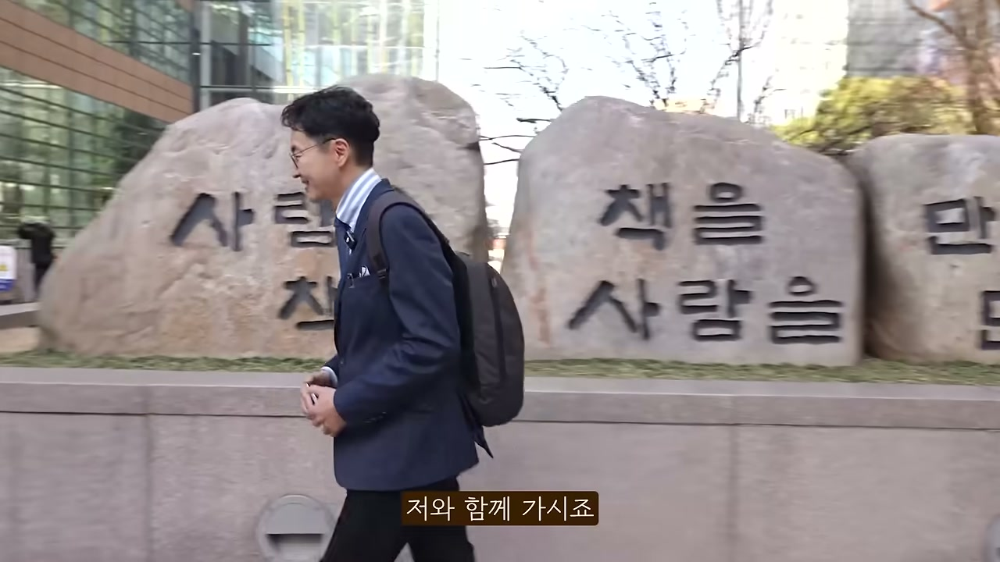

흥미로운 건, 이름도 직업도 다른 이 독자들의 입에서 김대식 교수와 똑같은 통찰이 다른 언어로 흘러나온다는 점이다.

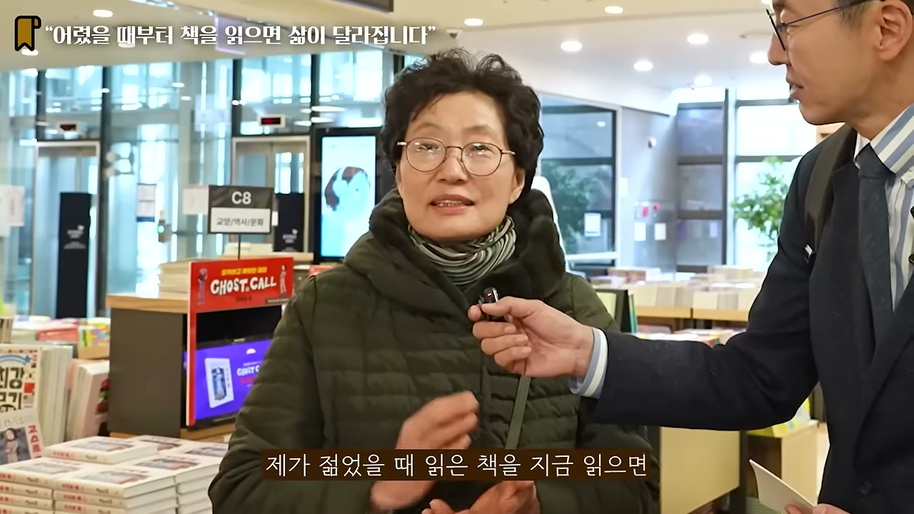

손주에게 줄 그림책을 고르던 전직 교사. 책을 읽으면 이해력이 빨라지고 다른 사람의 삶을 경험할 수 있다고 말한다. 드라마나 영화는 많이 잊어버리는데 책으로 읽은 건 기억에 남는다는 것이다. 특히 중고등학교 때 읽은 책은 지금도 생생하다고. 그리고 김대식 교수와 똑같은 이야기를 한다. 젊었을 때 읽은 책을 지금 다시 읽으면 감정이 아주 다르다고. 10대, 30대, 50대, 70대에 읽으면 매번 다르다. 입장이 바뀌니 그때 감명 깊었던 주인공보다 주변 인물에 더 관심이 가게 된다. 그가 소중히 읽었던 책은 A. J. 크로닌의 『성채』와 『천국의 열쇠』다.

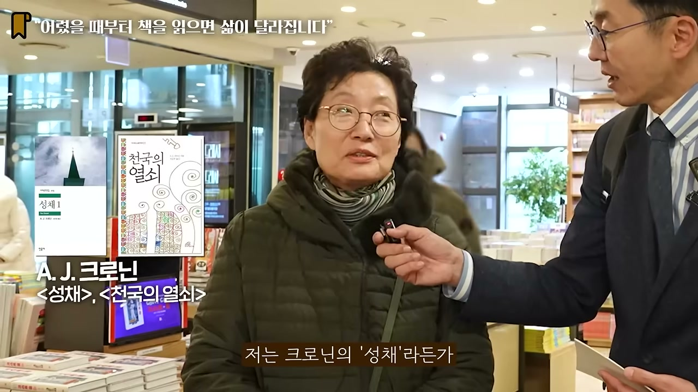

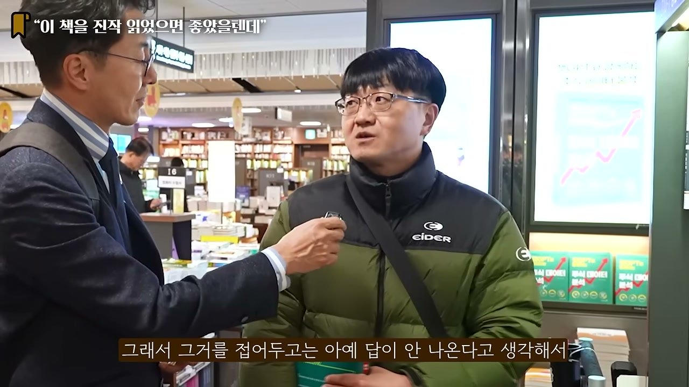

물리치료사로 13년 일하다 제2의 직업을 찾는 독자. 그가 진즉 읽었어야 했다고 꼽는 책은 아리스토텔레스의 『수사학』과 『시학』이다. 스무 살 넘어 처음 읽었는데, 중고등학교 때 읽었으면 세상을 더 넓게 봤을 거라고 아쉬워한다. 그의 말에서 김대식 교수가 던진 "클래식은 안전빵"이라는 논리가 메아리친다. 명작과 고전을 아직도 계속 찾는 건, 시대가 달라도 인간 사회가 크게 다르지 않기 때문이라는 것이다. 먼저 시대를 살아온 사람의 생각이 보편화되어 베스트셀러가 됐고, 그래서 인간에 대한 이해를 포기하고는 아무것도 안 된다고 그는 단언한다. AI가 인간의 직업을 박살낸다지만, 그 AI조차 사람들이 인문학을 읽고 대화하며 쌓은 기반 위에 만들어졌다는 것이다.

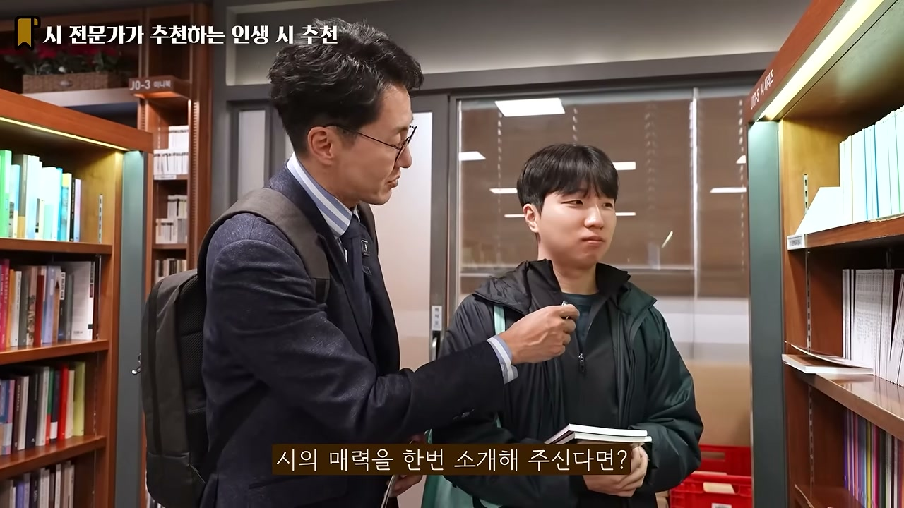

책 소개 인스타그램 채널을 운영하는, 시를 좋아하는 독자. 천양희의 시집 『새벽에 생각하다』를 제목에 끌려 처음 집어 들었다. 그가 인생 책으로 꼽는 건 진은영 시인의 『우리는 매일매일』이다. 읽어본 시집 중 가장 세련됐고, 시를 좋아하는 여러 이유가 다 담겨 있다고 한다.

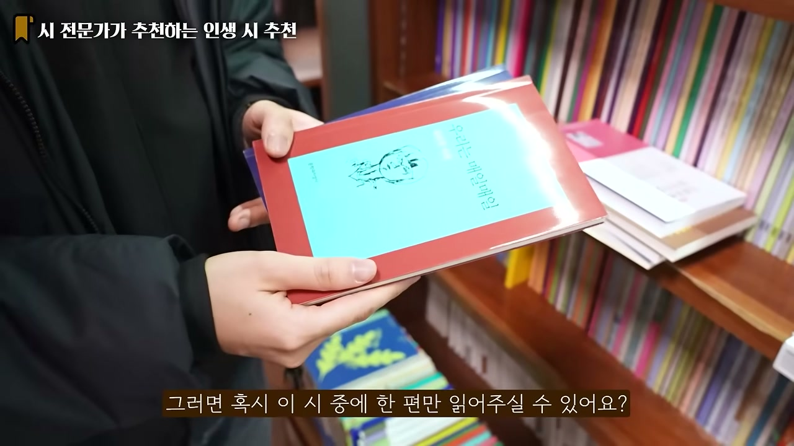

그가 직접 낭독한 시 「점」의 한 구절은 이렇다. "데카르트의 점. 폐곡선 안의 점. (...) 박하잎 가득 담은 양가죽 주머니를 쥐고 하얀 하늘로 달아난 흰 올빼미의 발톱 같은 점." 그는 흰 올빼미가 박하잎 주머니를 쥐고 하늘로 날아갈 때 보이는 까만 발톱을 점이라 표현한 게 천재적이라고 감탄한다. 시의 매력을 묻자, 앞서 모두가 했던 말을 다시 한번 들려준다. 지금 읽고 1년 뒤에 읽어도 다르고, 2년 뒤에 읽어도 다르다고. 한 권으로 다양한 감상을 느낄 수 있다는 것이다.

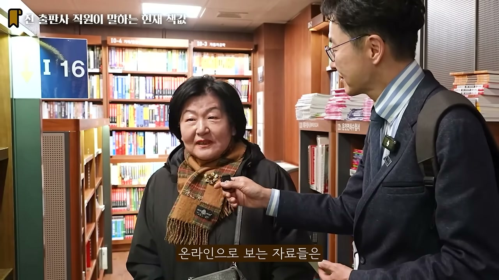

출판사에서 일하다 퇴직하고 화훼장식기능사에 도전하는 독자. 최근 『화폐전쟁』과 김난도의 『K뷰티 트렌드』를 읽었다. 여전히 종이책이 좋다는 이유가 명확하다. 입력 단계에서는 종이책이 확실히 효과적이고, 온라인으로 보는 자료는 휘발성이 강하다는 것이다. 출판업계에 있었던 입장에서 책값이 오르는 건 당연하다고, 구독자 수가 적은데 인건비와 재료비가 다 올랐으니 당연한 걸 받아들여주면 감사하겠다고 말한다.

그 외에도 책이 항상 자기 최고의 친구라는 캐나다 출신 영어 강사, 관계가 제일 중요해서 대화법 책을 찾는 사회복지사가 등장한다. 사회복지사는 완벽주의에 관한 책을 인상 깊게 읽었다고 한다. 완벽주의는 자기 희망이 아니라 주변에 의해 완벽을 요구당하는 상황에서 만들어진다는 내용이었다.

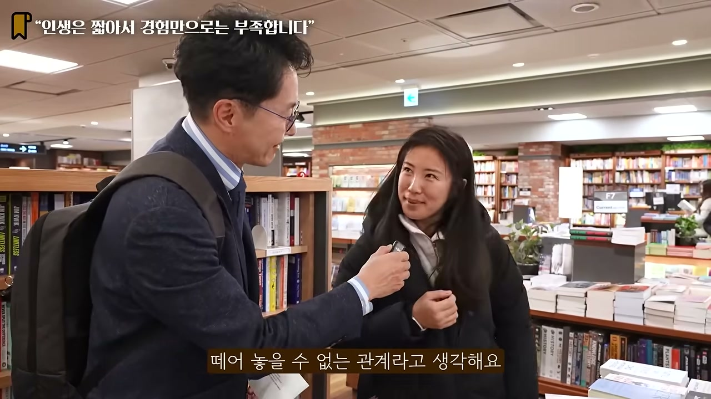

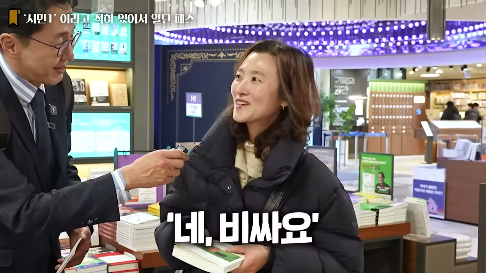

책값이 적정하냐는 질문에 독자들의 답은 비슷하게 모인다. 비싸다고 느끼는 사람도 많지만, 책이 주는 가치에 비하면 적당하다는 것이다. 특히 시집은 한번 사두면 평생 읽고 또 읽어도 새롭다. 한 독자의 말처럼, 책은 보려고만 사는 게 아니다. 책꽂이에 꽂아두고 심심할 때 빼서 다섯 장 읽다 졸리면 다시 꽂아두고, 한 달 뒤든 1년 뒤든 다시 꺼낼 수 있다는 것 하나만으로 소유의 가치가 있다.

## 네 권이 가리키는 한 방향

장르가 제각각인 네 권은 결국 한 자리에서 만난다. 『히치하이커』는 안내서 없이 시작하는 인생이라는 여행을, 『율리시스』는 한 사람의 머릿속 잡생각과 언어로는 결코 다 전할 수 없는 생각의 해상도를, 『내 이름은 빨강』은 추한 세상 앞에서 예술이 무엇을 할 수 있는가를, 『변신』은 남의 시선이 내 자아의 일부가 되는 순간을 이야기한다.

그리고 이 네 권을 관통하는 건, 영상 전체를 떠받치는 한 문장이다. 좋은 책은 읽을 때마다 달라진다. 김대식 교수가 10년에 한 번씩 인생 책을 다시 읽는 이유도, 전직 교사가 70대에 다시 같은 책을 펴는 이유도, 시를 좋아하는 독자가 같은 시집을 해마다 다시 읽는 이유도 같다. 책이 바뀌는 게 아니라 읽는 내가 바뀌기 때문이다. 마지막에 진행자가 남긴 말이 이 모든 걸 한 줄로 묶는다. 한 명의 시인이 쓴 한 편의 시도 수만 명의 독자가 읽으면 수만 개의 해석이 나온다. 책을 사랑하는 당신의 해석이, 바로 그 작품의 완성이다.
