
<iframe src="https://www.youtube.com/embed/GlR5I1wFWpM" title="YouTube video player" frameborder="0" allow="accelerometer; autoplay; clipboard-write; encrypted-media; gyroscope; picture-in-picture; web-share" referrerpolicy="strict-origin-when-cross-origin" allowfullscreen></iframe>

영상은 작은 자랑으로 시작한다. 내가 만든 AI 스킬이 내가 자는 동안 혼자 더 똑똑해진다고. 마법처럼 들리지만 마법이 아니라고 그는 곧바로 못을 박는다. 비밀은 딱 하나, 루프다. AI가 스스로 도는 순환 하나만 제대로 설계해 두면 그 다음부터는 알아서 좋아진다는 것이다. 그는 이걸 "루프 엔지니어링"이라고 부른다.

이름은 거창하지만 출발점은 우리가 매일 겪는 짜증이다. 거기서부터 따라가 보자.

## 우리가 AI를 쓰는 방식은 어딘가 이상하다

요즘 다들 AI한테 일을 시킨다. 그런데 그 방식이 묘하게 비효율적이다. 매번 처음부터 다시 설명한다. "이렇게 해줘", "아니 그거 말고 다시", "톤이 이상해 다시." 그러면 AI는 한 번은 고쳐준다. 문제는 다음번이다. 똑같은 실수를 또 하고, 어제 알려준 걸 오늘 또 까먹는다.

영상 속 그가 이걸 설명하는 비유가 정확하다. AI는 기억력이 30분짜리 신입 직원이라는 것이다. 일은 잘하는데 퇴근하면 오늘 배운 걸 다 잊어버리는 직원. 그래서 우리는 매일 아침 똑같은 교육을 반복한다. 어제 했던 얘기를 오늘 또 하고, 그는 그게 지친다고 솔직하게 말한다.

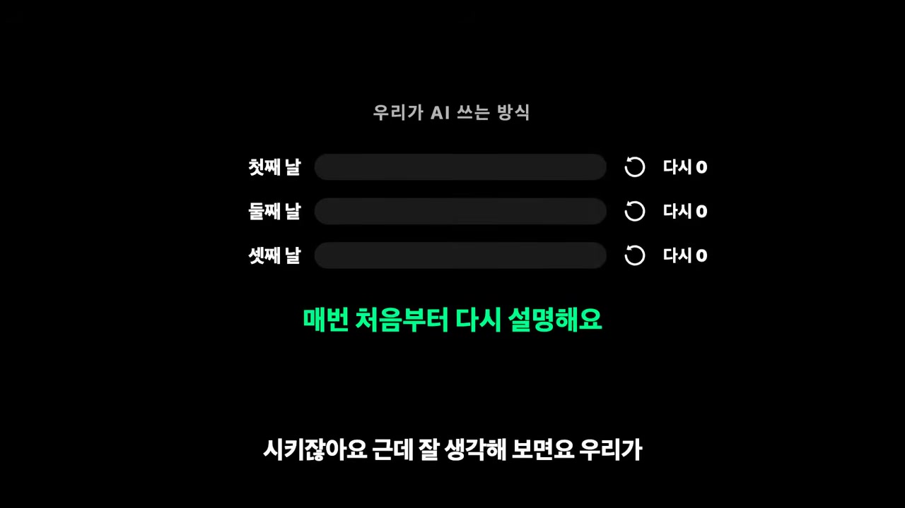

그런데 그는 여기서 멈추지 않고 더 큰 문제를 짚는다. 내가 AI를 가르쳤다고 치자. 그래서 진짜 더 나아졌나? 이걸 아무도 확인하지 않는다는 것이다. 프롬프트를 고치면서 "오 이게 더 좋겠지" 하고 그냥 쓴다. 정말 좋아진 게 맞는지, 아니면 한 군데는 좋아지고 세 군데는 나빠진 건 아닌지 모른다. 재보지 않았으니까.

그가 드는 비유는 체중계 없이 하는 다이어트다. "오늘 운동했으니 빠졌겠지", "이 음식이 더 건강했지" 하고 넘어가다가 한 달 뒤에 보면 오히려 늘어 있다. 왜? 한 번도 안 재봤으니까. AI를 개선한다면서 개선됐는지 안 재보는 것, 이게 지금 거의 모든 사람이 저지르는 실수라고 그는 말한다.

여기서 영상 전체를 관통하는 한 문장이 나온다.

**측정 없는 진화는 금지다.**

그는 이 문장을 "오늘 영상의 심장"이라고 부른다. 뒤에 나오는 모든 규칙과 장치는 결국 이 한 줄을 지키기 위한 장비라고 봐도 좋다.

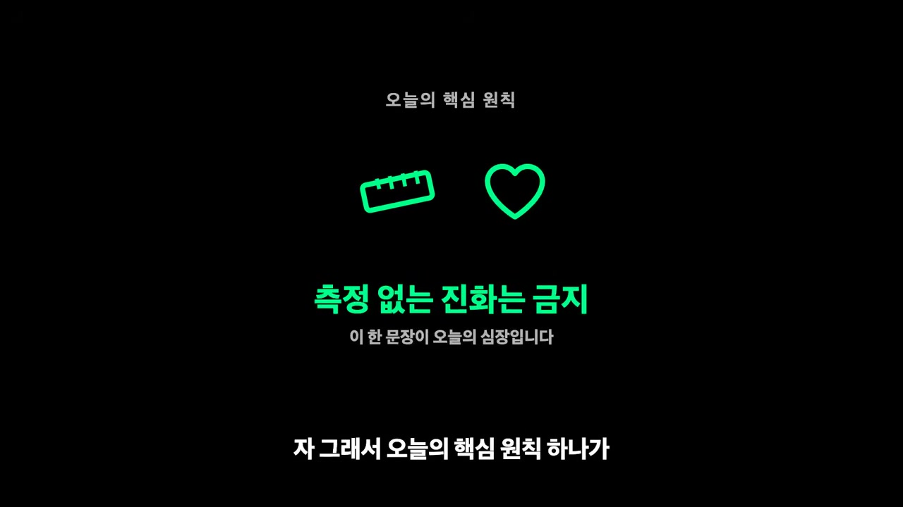

## 루프란 무엇인가, 그리고 그냥 도는 것과 잘 도는 것의 차이

루프 엔지니어링은 직역하면 루프를 설계하는 기술이다. 여기서 루프란, AI한테 일을 한 번 시키고 끝내는 게 아니라 점점 더 잘하게 만드는 순환 과정을 가리킨다.

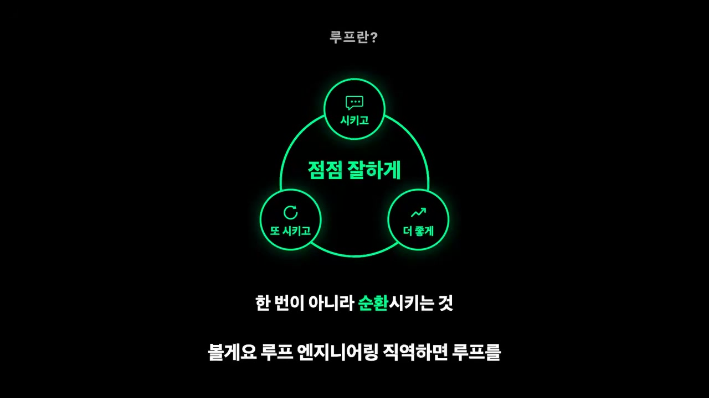

비유는 헬스 트레이너다. 좋은 트레이너는 운동만 시키지 않는다. 측정하고, 한 가지 고치고, 다시 측정하고, 또 한 가지 고친다. 이 "측정 → 한 가지 변경 → 다시 측정"이 바로 루프이고, 한 바퀴 돌 때마다 회원은 조금씩 좋아진다. 루프 엔지니어링은 AI한테 이 트레이너 역할을 맡기는 일이다.

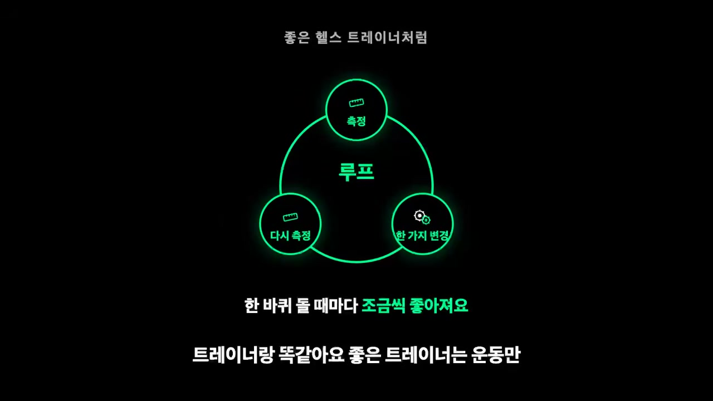

여기서 그는 중요한 단서를 단다. 그냥 막 돌리면 안 된다는 것이다. 루프를 잘못 설계하면 AI가 같은 자리에서 뱅뱅 돌기만 한다. 실제로 해외 엔지니어들 사이에 "loop until you solve it", 풀릴 때까지 돌려라 하는 식의 접근이 있는데, 이렇게 무작정 돌리면 AI가 길을 잃고 똑같은 실수를 무한 반복하며 갇혀버린다고 한다.

그래서 핵심은 "도느냐"가 아니라 "잘 도느냐"다. 그냥 도는 루프와 잘 도는 루프의 차이, 그 차이를 만드는 게 설계라는 이야기다.

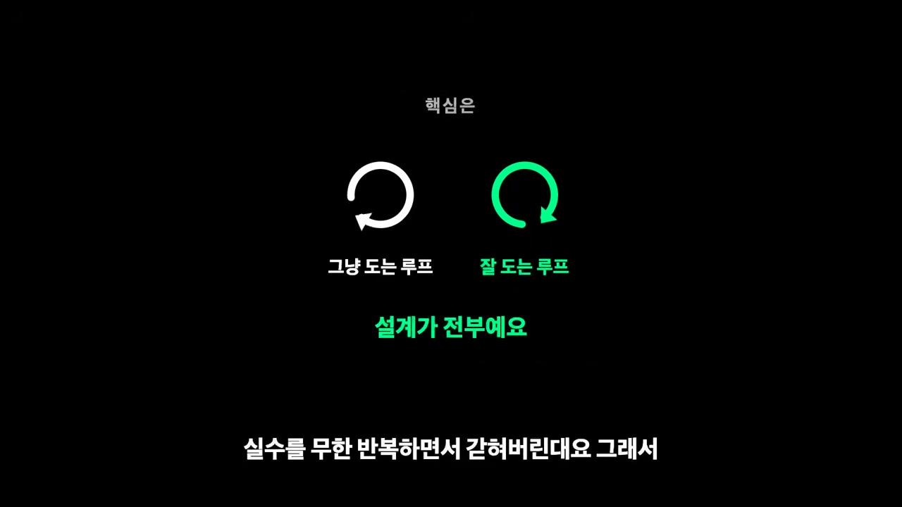

## 루프 엔지니어링은 어디서 온 흐름인가

그는 잠깐 큰 그림을 펼친다. 우리가 AI를 다루는 기술이 계속 진화해 왔다는 것이다.

처음은 프롬프트 엔지니어링이었다. 말을 잘 거는 기술, "이렇게 써주세요" 하고 한 문장을 잘 쓰는 일이다. 그 다음은 컨텍스트 엔지니어링이다. AI한테 줄 자료와 도구와 배경을 통째로 잘 챙겨주는 것, 좋은 재료를 손에 쥐어주는 단계다.

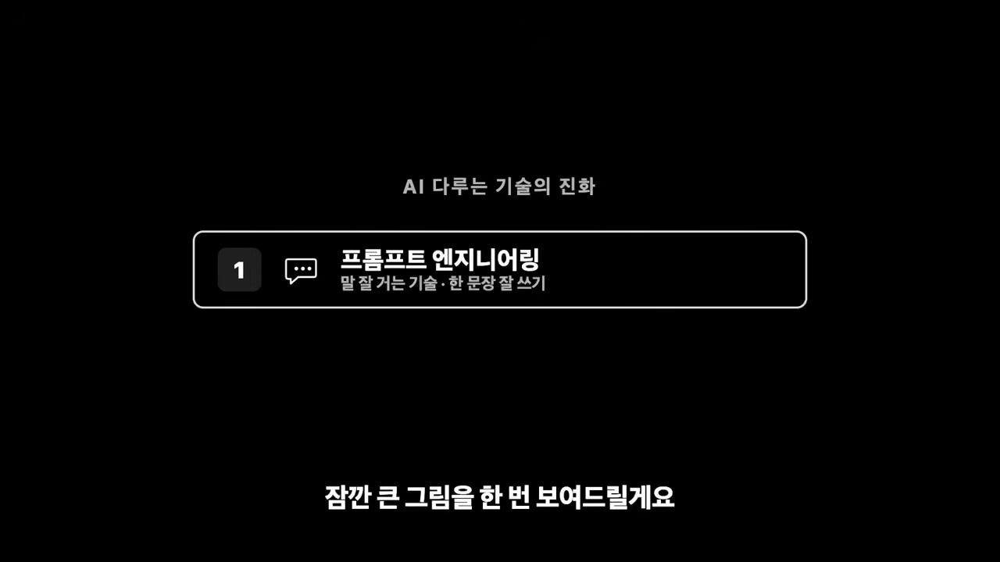

그 다음이 하네스 엔지니어링이다. 그는 하네스를 말의 안장 같은 거라고 비유한다. AI 주변에 검사기, 테스트, 규칙 같은 장치를 둘러서 알아서 잘 굴러가게 만드는 것이다. 여기서 그는 해외에서 유명해진 한 문장을 인용한다. "에이전트는 모델 더하기 하네스다." AI 그 자체가 아니라 그 주변 장치가 진짜 실력을 만든다는 뜻이다.

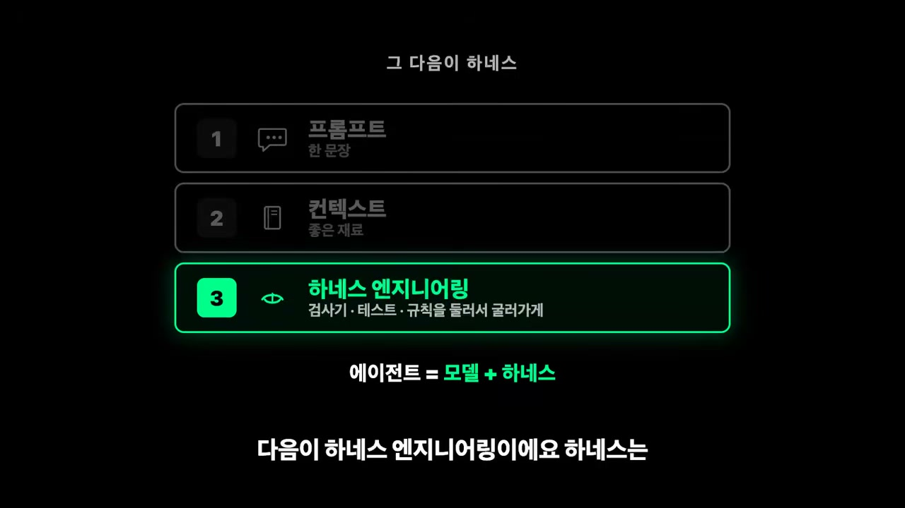

그렇다면 그 다음은 무엇인가. 그는 그게 루프 엔지니어링이라고 본다. 프롬프트, 컨텍스트, 하네스 같은 장치들을 시간 위에서 돌리는 것이다. 한 번 잘 만드는 게 아니라 돌 때마다 좋아지게 만드는 단계. 그가 정리하는 층위가 깔끔하다. 프롬프트가 한 문장이면 컨텍스트는 한 페이지고, 하네스는 한 작업장이고, 루프는 그 작업장이 매일 스스로 개선되는 공장이다.

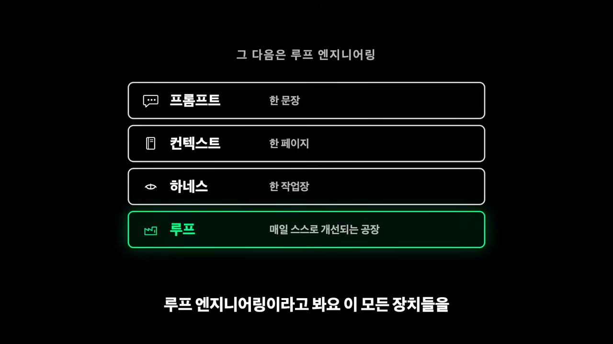

메타가 빠르다는 느낌이 들 수도 있다. 그도 그 점을 인정한다. 다만 여기서 들고 갈 건 두 줄이면 충분하다. 루프 엔지니어링은 AI가 스스로 좋아지는 루프를 설계하는 일이고, 그 루프의 심장은 측정이다.

## 루프는 정확히 어떻게 돌아야 하는가

이제 추상에서 구체로 내려온다. 그가 실제로 만든 스킬은 한 바퀴를 이 순서로 돈다.

첫째, 평가한다. 지금 실력이 몇 점인지 먼저 잰다. 둘째, 제안한다. 이 부분을 이렇게 바꾸면 어떨까, 딱 하나를 제안한다. 셋째, 검증한다. 바꾸기 전과 바꾼 후를 똑같은 시험으로 점수를 다시 잰다. 넷째, 합친다. 점수가 올라갔을 때만 그 변경을 살린다. 평가, 제안, 검증, 합치기. 이게 한 바퀴다.

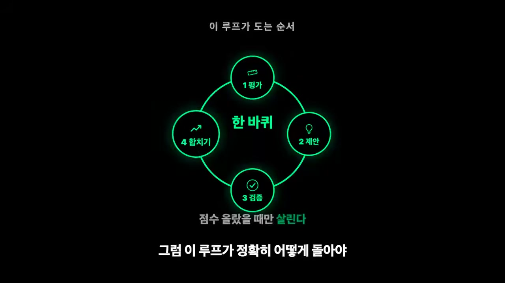

비유는 요리사가 레시피를 고치는 과정이다. 소금을 아주 조금만 더 넣어보고, 다시 맛을 보고, 더 맛있어졌으면 레시피에 적고, 별로면 안 적고 버린다. 핵심은 맛보기 전엔 절대 레시피를 안 고친다는 것이다. AI 루프도 똑같다. 재보기 전엔 절대 안 바꾼다.

그리고 여기에 또 하나의 규칙이 붙는다. 이걸 놓치면 다 무너진다고 그가 강조하는 규칙, **한 번에 딱 하나만 바꾼다**는 것이다.

왜 하나만 바꿔야 하는지는 다시 요리로 돌아가면 분명해진다. 소금도 넣고 설탕도 넣고 불도 세게 하고, 다섯 가지를 한 번에 바꿨다고 하자. 맛이 좋아졌어도 뭐 때문인지 모르고, 나빠졌어도 뭐 때문인지 모른다. 다섯 개를 한꺼번에 바꾸면 원인을 영영 못 찾는다. 그래서 소금만 살짝 넣어 재보고, 좋으면 살리고 아니면 버리고, 그 다음에 설탕으로 넘어간다.

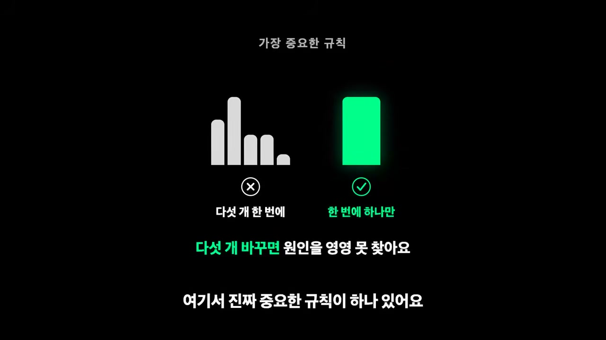

느려 보이지만 그는 이게 제일 빠른 길이라고 말한다. 한 바퀴마다 확실한 한 걸음이 쌓이기 때문이다. 헛걸음이 없는 전진이 결국 가장 빠르다는 논리다.

여기까지 규칙이 두 개 모였다. 하나, 재보기 전엔 안 바뀐다. 둘, 한 번에 하나만 바꾼다. 그는 이 두 개가 사실 모든 좋은 성장의 비밀이라고 덧붙인다. 운동도, 공부도, 사업도 마찬가지다. 한 번에 하나, 그리고 측정. AI만의 이야기가 아니라는 것이다.

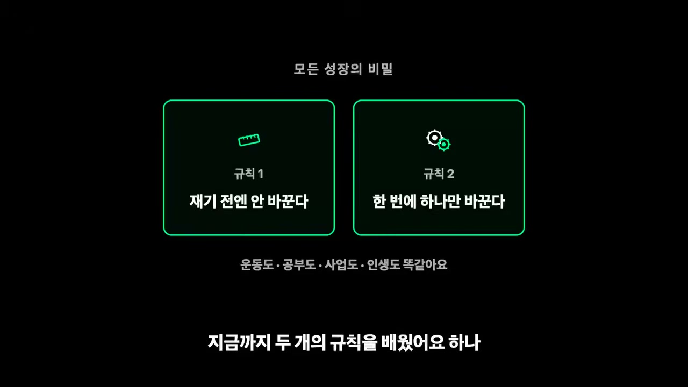

## 시험지를 얼리고, 채점은 다른 AI에게 맡긴다

사람의 역할로 넘어가기 전에 그가 하나를 먼저 깐다. 골든셋이다. 골든셋은 AI를 채점할 고정된 시험지를 말한다. 모의고사 문제집 한 권을 딱 정해놓고 절대 바꾸지 않는 것이다.

왜 고정해야 하는가. 어제는 쉬운 시험을 보고 90점, 오늘은 어려운 시험을 보고 80점이 나왔다고 하자. 실력이 는 건지 준 건지 알 수가 없다. 시험이 달랐기 때문이다. 시험지가 매번 바뀌면 점수 비교 자체가 무의미해진다. 그래서 시험지를 얼려버린다. 똑같은 문제로 어제도 재고 오늘도 재야 "아, 진짜 2점 올랐네"를 알 수 있다. 그의 스킬에는 이 고정 시험지가 12문제 들어 있다고 한다.

여기에 또 하나의 규칙이 붙는다. 문제 내는 AI와 채점하는 AI는 달라야 한다는 것이다. 자기 시험을 자기가 채점하면 후하게 주기 마련이다. "이 정도면 맞은 걸로 치자" 하면서. 그가 든 비유가 단순하고 정확하다. 선수가 심판을 보면 안 된다.

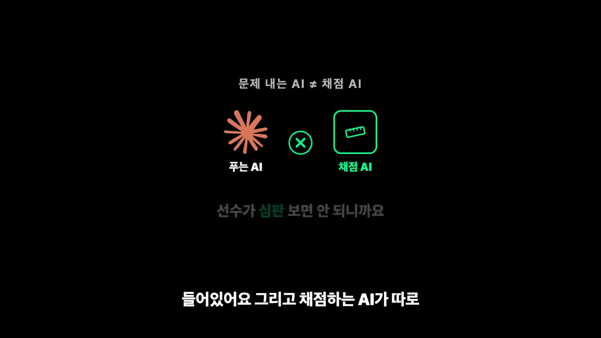

## 사람의 자리는 루프 안이 아니라 루프 위다

많은 사람이 여기서 오해한다. AI가 다 알아서 한다면 사람은 필요 없는 게 아니냐고. 그는 정반대라고 못 박는다. 사람의 자리는 루프 안이 아니라 루프 위라는 것이다.

해외에서 쓰는 표현으로 옮기면, 휴먼 인 더 루프(human in the loop)가 아니라 휴먼 온 더 루프(human on the loop)다. 루프 안에 들어가 매번 일일이 검사하는 게 아니라, 루프 위에서 그 루프 자체를 관리한다. 사람은 선수가 아니라 코치다.

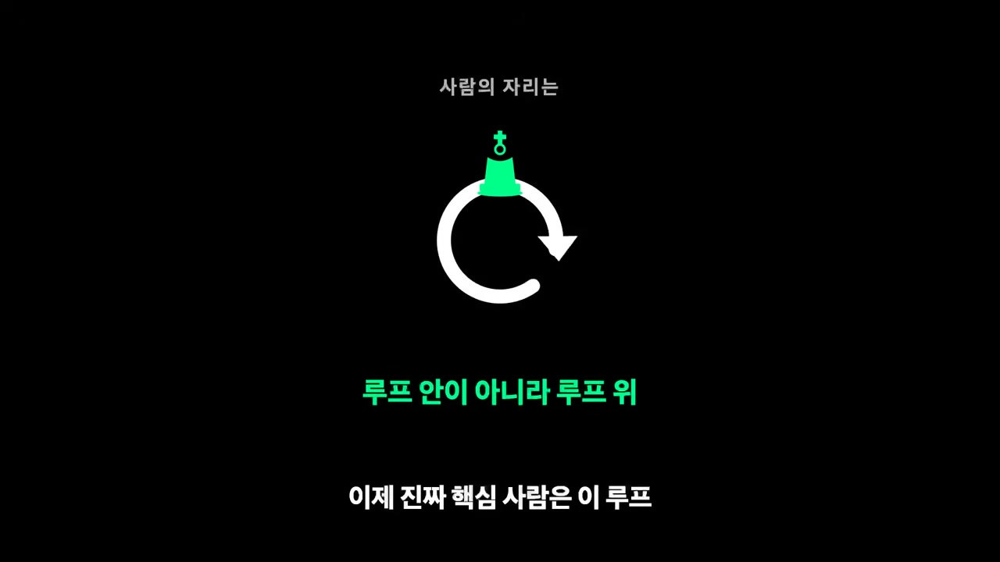

코치는 직접 공을 치지 않는다. 대신 세 가지를 한다.

첫째, **시험지를 만든다.** 뭐가 잘하는 거냐를 사람이 정의한다. 이건 AI한테 안 맡긴다. 기준까지 AI한테 맡기면 AI가 자기한테 유리하게 슬쩍 기준을 흐려놓기 때문이다. "좋다"는 게 무엇인지, 이 정의는 사람이 소유한다.

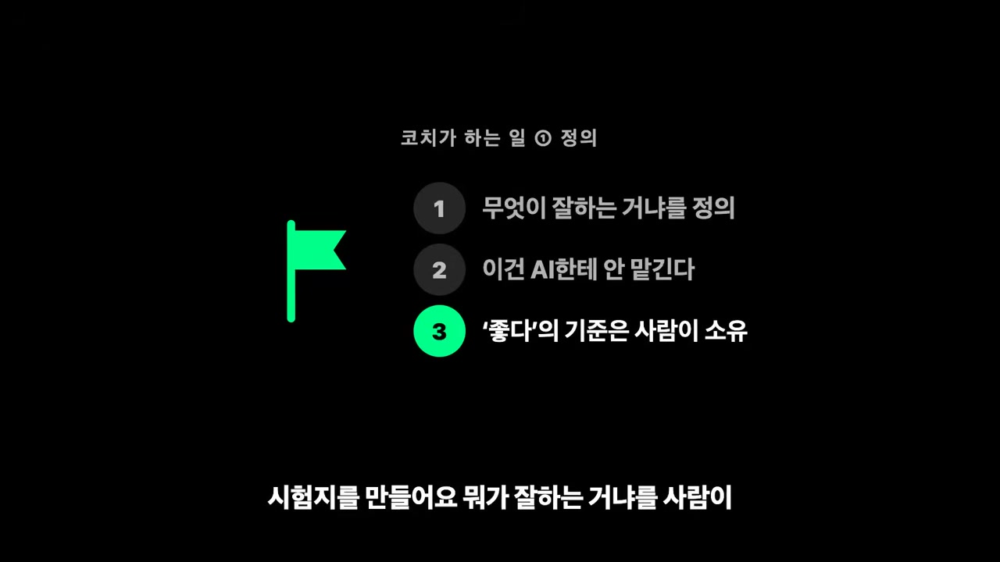

둘째, **승인한다.** AI가 "이거 바꿀게요" 하고 제안하면, 사람이 보고 "그래 해봐" 해야만 바뀐다. 사람 허락 없이는 아무것도 안 바뀐다. 셋째, AI는 **초안만 쓴다.** AI가 새 규칙을 막 만들게 두면 안 된다. AI는 "이런 거 어때요" 하고 초안만 던지고, 진짜 결정은 사람이 한다.

그가 정리하는 한 줄이 좋다. AI는 부지런한 인턴이고, 사람은 그 인턴의 사수다. 인턴이 일은 다 한다. 하지만 그걸 회사 규칙으로 박을지 말지는 사수가 정한다.

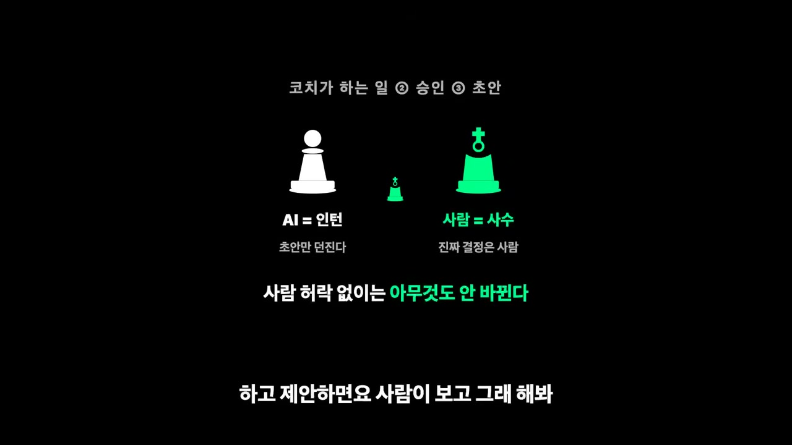

## 같은 곳을 파고 있는 사람들

그는 이 루프가 자기 혼자만의 발상이 아니라는 걸 보여주려고 해외 자료를 뒤졌다고 한다. 지금 전 세계가 같은 얘기로 들끓고 있다는 것이다.

먼저 안드레이 카파시다. OpenAI 공동 창업자이고 AI 쪽에서는 거의 신적인 인물로 통한다. 이 사람이 한 말이 그의 얘기와 똑같다. "평가가 없으면 너의 AI가 좋아졌는지 나빠졌는지 알 수가 없다." 앞에서 나온 "측정 없는 진화는 금지다"와 정확히 같은 말이다.

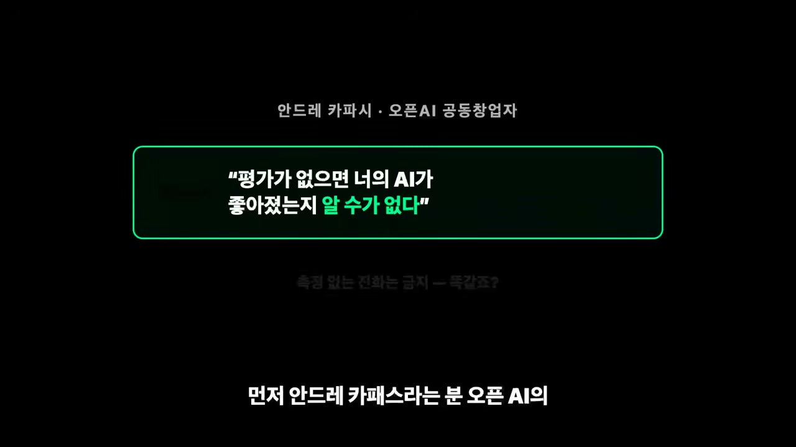

오토 리서치 패턴이라는 것도 있다. AI가 자기 결과물을 자기가 정한 기준으로 시험해보고, 틀린 걸 분석하고, 개선안을 내고, 다시 시험하는 흐름이다. 이름만 다를 뿐 똑같은 루프다.

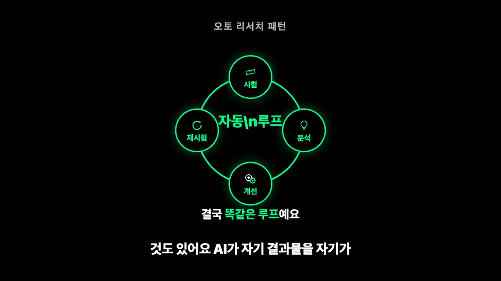

더 흥미로운 사례도 있다. 사카나 AI라는 회사와 대학 연구팀이 다윈-괴델 머신이라는 걸 만들었다. 이름은 어렵지만 쉽게 말하면 진화론을 적용한 AI다. AI 여러 마리를 만들어 자기 코드를 자기가 고치게 하고, 그중 제일 잘하는 놈만 살아남게 한다. 다윈의 자연 선택과 똑같은 원리다.

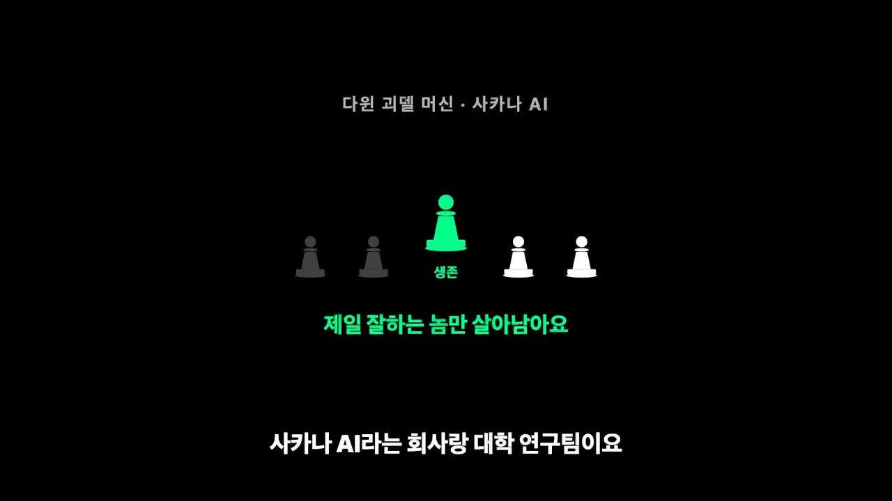

요즘 뜨는 하네스 엔지니어링도 결이 같다. 이쪽 사람들이 그리는 루프는 이렇다. 먼저 가이드를 줘서 방향을 잡고, AI가 일을 하고, 센서로 결과를 보고, 사람이 그 가이드와 센서를 다듬는다. 그가 말한 루프와 완전히 같은 구조다.

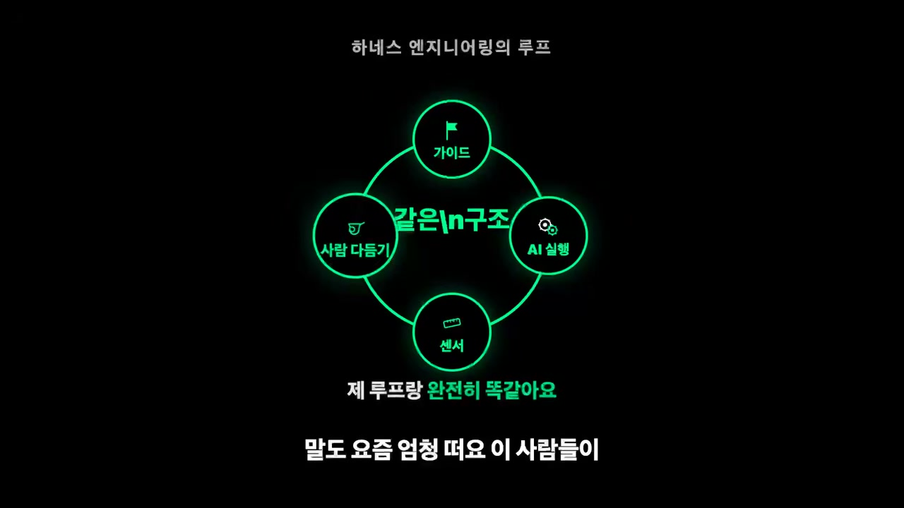

그래서 그가 오늘 루프 엔지니어링이라고 이름 붙인 이것은 혼자만의 생각이 아니다. 지금 전 세계 최고 엔지니어들이 동시에 같은 곳을 파고 있다는 게 그의 결론이다.

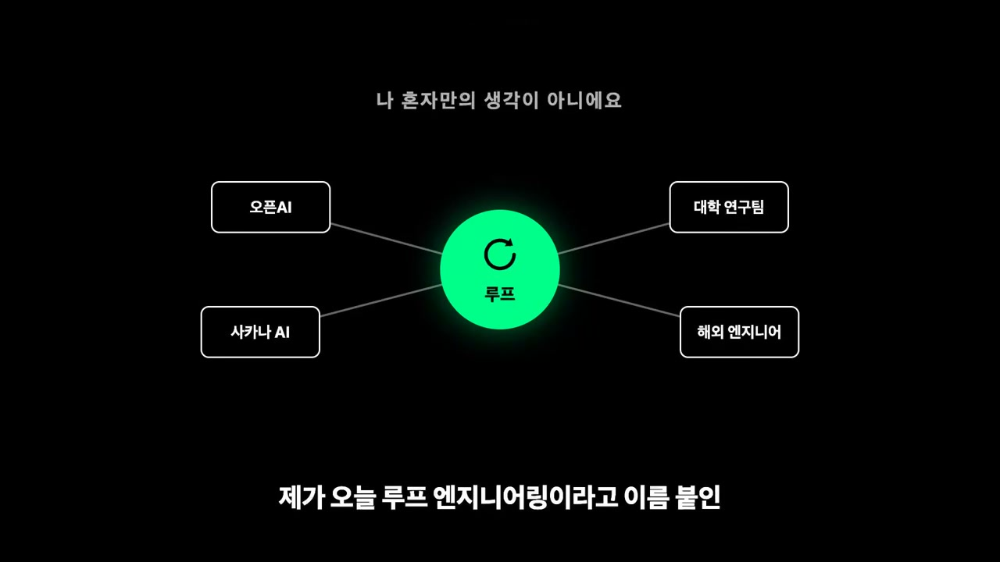

## 실패 노트, 그리고 빼기의 기술

여기서 그는 아는 사람이 별로 없다는 고급 팁 두 개를 던진다. 둘 다 루프를 오래 굴렸을 때 비로소 보이는 종류의 통찰이다.

첫째, 좋은 루프에는 실패 노트가 있어야 한다. AI가 "이거 바꿔볼게요" 했는데 점수가 안 올랐다고 하자. 보통은 그냥 버린다. 하지만 버리기만 하면 안 되고, "이거 해봤는데 안 됐음"이라고 한 줄을 적어둬야 한다. 안 적어두면 한 달 뒤에 AI가 똑같은 걸 또 시도한다. "이거 좋겠는데" 하면서. 이미 한 달 전에 실패한 걸 모르고 같은 헛수고를 무한 반복하는 것이다. 오답 노트와 똑같다. "이 길은 막다른 길이다"라고 적어두면 다음번엔 그 길로 안 간다.

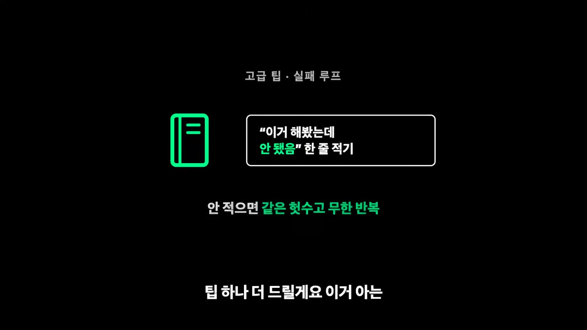

둘째, 가끔은 빼기도 필요하다. 사람들은 자꾸 규칙을 더하기만 한다. 하지만 오래된 규칙, 이제 안 맞는 규칙은 빼줘야 한다. 그의 스킬은 3바퀴마다 한 번씩은 더하는 대신 "뭘 지울까"를 고민한다. 지웠는데 점수가 안 떨어지면 그건 좋은 신호다. 공짜로 군살을 뺀 셈이기 때문이다. 시스템이 커질수록 더하기보다 빼기가 어렵다는 걸 아는 사람의 조언이다.

## 아직 사람의 자리로 남은 한 칸

그는 솔직하게 한 가지를 인정한다. 이 루프가 완벽하냐고 물으면 아니라는 것이다. 아직 마지막 퍼즐 한 조각이 안 맞춰졌는데, 그게 QA, 그러니까 마지막 점검이다.

특히 E2E 테스트라는 게 있다. 진짜 사람이 쓰는 것처럼 처음부터 끝까지 다 돌려보는 검사다. 새 집을 다 짓고 이사 들어가기 전에 수도꼭지를 다 틀어보고, 변기 물을 다 내려보고, 스위치를 다 눌러보는 것과 같다. 도면 검사나 자재 검사 같은 건 기계가 잘한다. 그런데 이렇게 실제로 다 써보는 마지막 점검은 아직 AI가 잘 못한다.

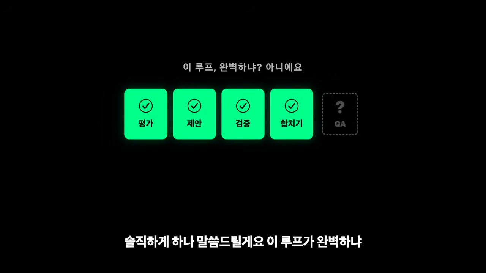

그래서 그의 루프도 맨 마지막은 사람이다. 다른 단계는 AI가 알아서 잘 돌지만, 이 마지막 QA만큼은 사람이 직접 들어가서 봐줘야 한다. 여기서는 휴먼 온 더 루프가 아니라 휴먼 인 더 루프, 코치가 직접 경기장에 들어가는 셈이다.

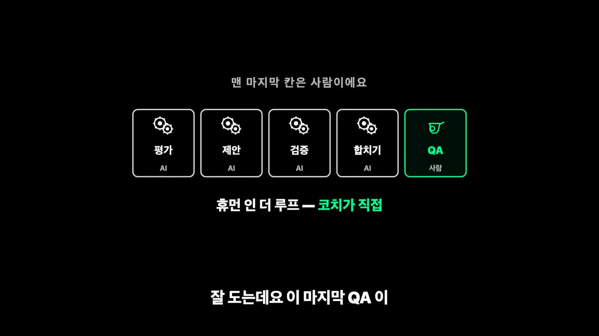

그는 이 한 조각이 빨리 풀렸으면 좋겠다고 말한다. 이것만 AI가 해주면 루프가 진짜 완성되기 때문이다. 지스택의 브라우즈 같은 도구로 어느 정도는 커버되지만 100%는 아니라는 점도 함께 일러둔다. 흥미로운 건 그가 이 빈칸을 감추지 않고 그대로 보여준다는 점이다. 자동화를 파는 사람치고는 드물게, 아직 안 되는 지점을 정확히 표시해 둔다. 그는 시청자에게 묻는다. 이 마지막 QA를 AI한테 맡길 수 있을까, 아니면 끝까지 사람이 봐야 할까.

## 오늘 당장 해볼 수 있는 4단계

이론만 들으면 남는 게 없다. 그래서 그는 마지막에 따라 하기 쉽게 4단계로 쪼갠다.

1단계, 시험지부터 만든다. AI를 고치기 전에 채점표부터 만드는 것이다. 자기가 AI한테 시키는 일 중 제일 자주 하는 걸 하나 고르고, 그 결과물을 보고 "이게 잘 된 거다" 하는 기준을 다섯에서 일곱 개만 적는다. 단 무조건 예 아니오로 답할 수 있어야 한다. "어느 정도 좋다" 같은 건 안 된다.

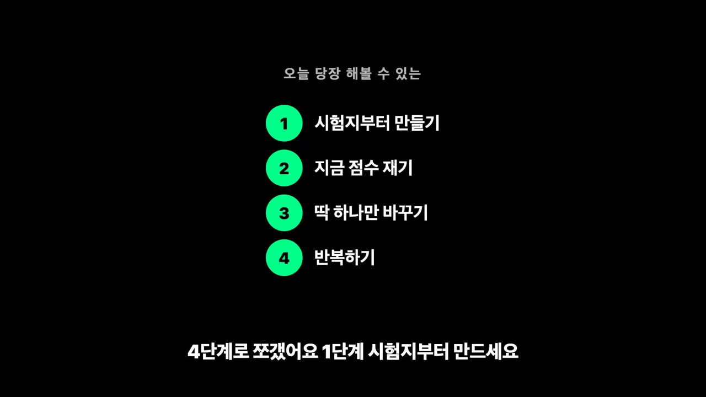

2단계, 지금 점수를 잰다. 고치기 전에 현재 실력부터 재는 것이다. 같은 일을 시켜보고 아까 만든 채점표로 점수를 매긴다.

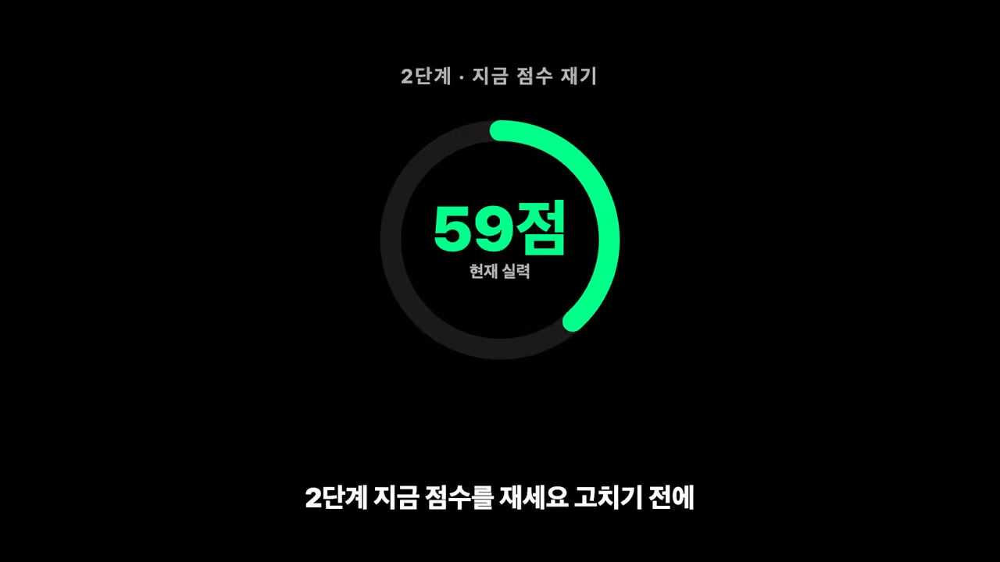

3단계, 딱 하나만 바꾼다. 프롬프트 한 문장이든 규칙 하나든 딱 하나만 손대고, 같은 일을 다시 시키고, 같은 채점표로 다시 점수를 매긴다. 올랐으면 그 변경을 살리고, 안 올랐으면 미련 없이 버린다.

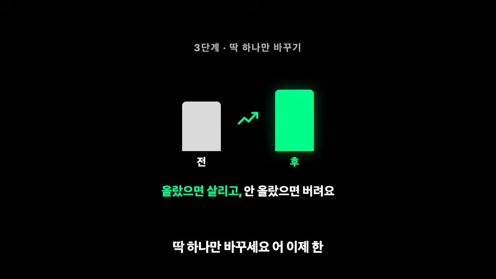

4단계, 이걸 반복한다. 이게 한 바퀴이고, 한 바퀴에 한 걸음이다. 그리고 그 한 걸음에는 헛걸음이 없다.

## 차이를 만드는 건 프롬프트 실력이 아니다

그는 마지막으로 하나만 들고 가라고 부탁한다. AI를 잘 쓰는 사람과 진짜 잘 쓰는 사람의 차이는 프롬프트 실력이 아니라는 것이다. 차이는 루프를 설계할 줄 아느냐에 있다. 한 번 잘 시키는 건 누구나 한다. 하지만 매일 스스로 좋아지는 시스템을 만드는 건 루프를 이해한 사람만 할 수 있다.

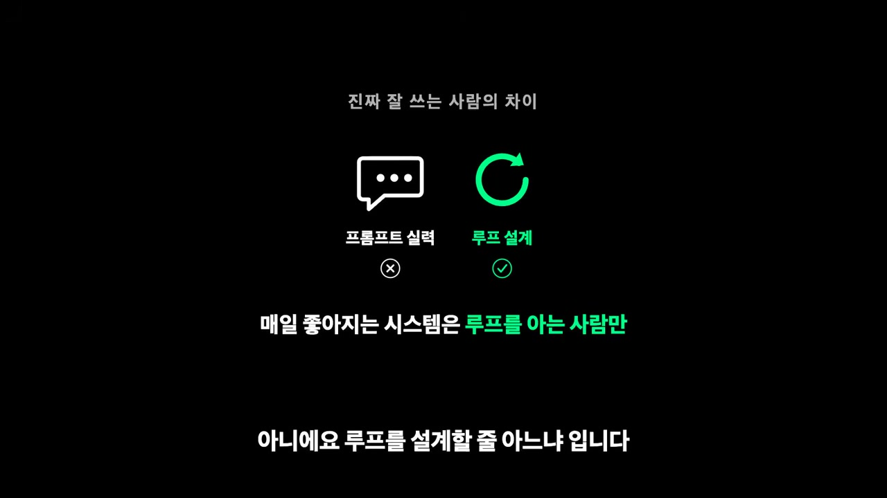

돌이켜 보면 이 영상이 처음부터 끝까지 변주한 건 단 한 문장이다. 측정 없는 진화는 금지다. 시험지를 얼리는 것도, 한 번에 하나만 바꾸는 것도, 채점 AI를 분리하는 것도, 실패 노트를 적는 것도, 결국 "정말 좋아졌는가"를 정직하게 재기 위한 장치들이다. 프롬프트 한 문장을 더 잘 쓰는 기술이 아니라, 좋아짐을 측정 가능하게 만드는 구조를 짜는 일. 그가 루프 엔지니어링이라고 이름 붙인 것의 정체는 거기에 있다.
