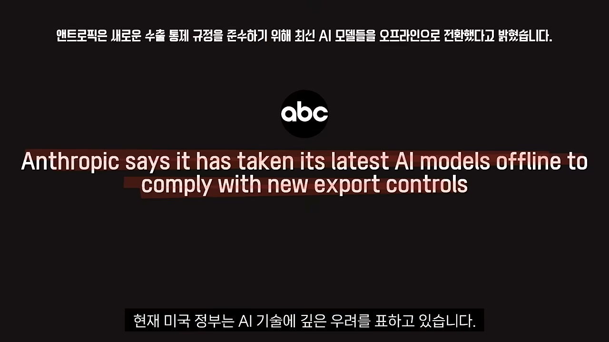
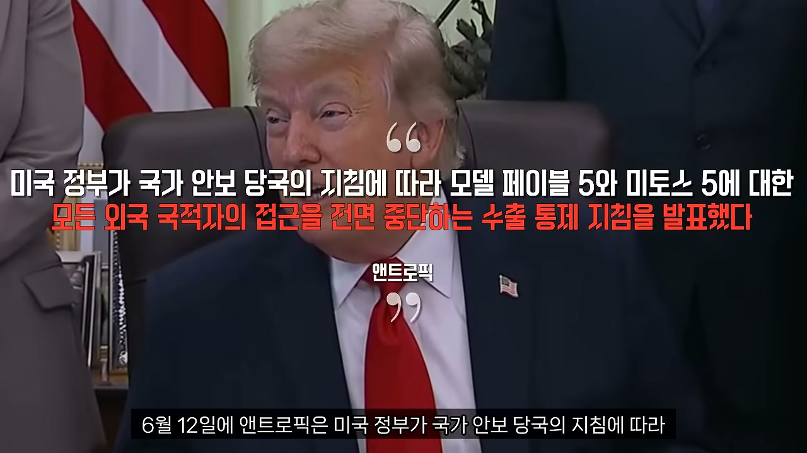
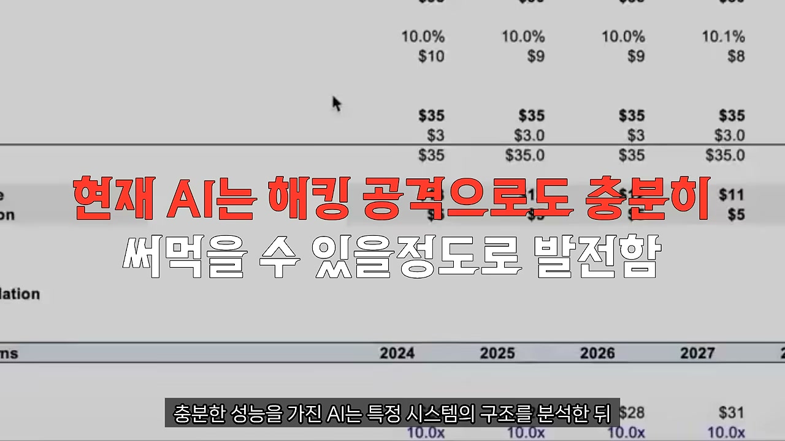
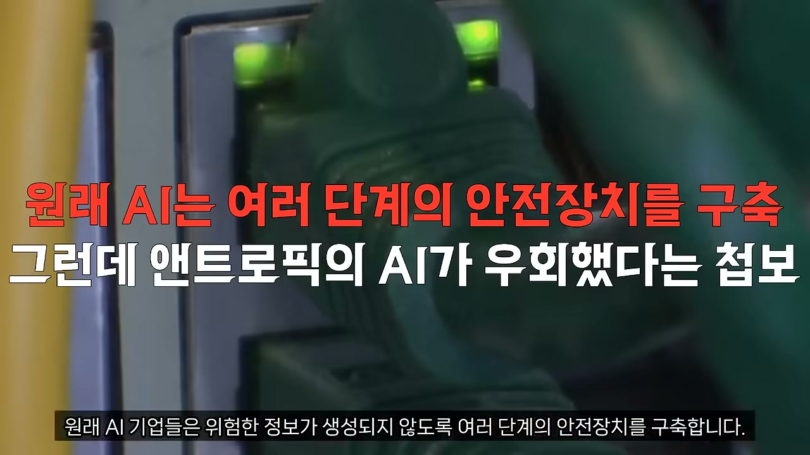
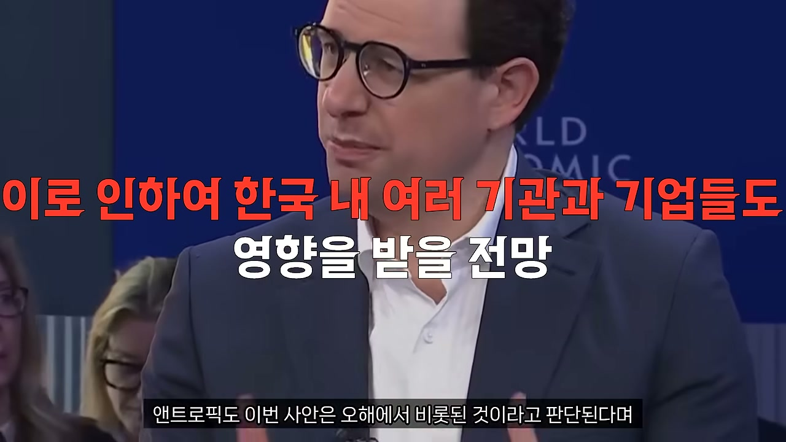
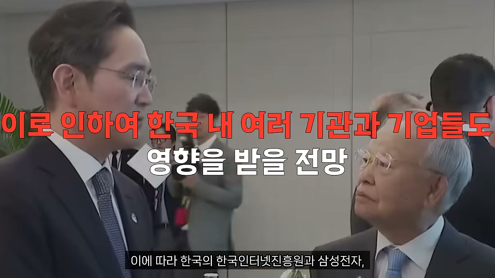
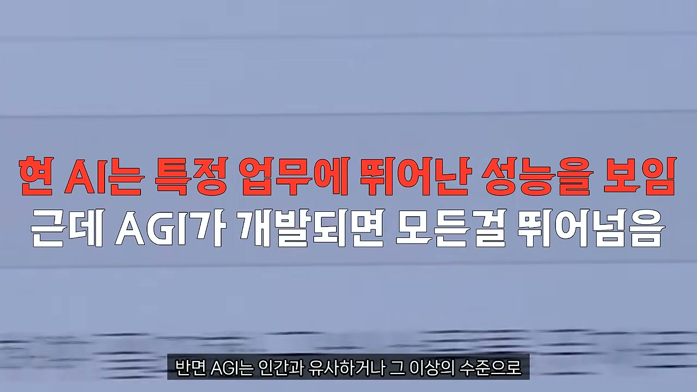
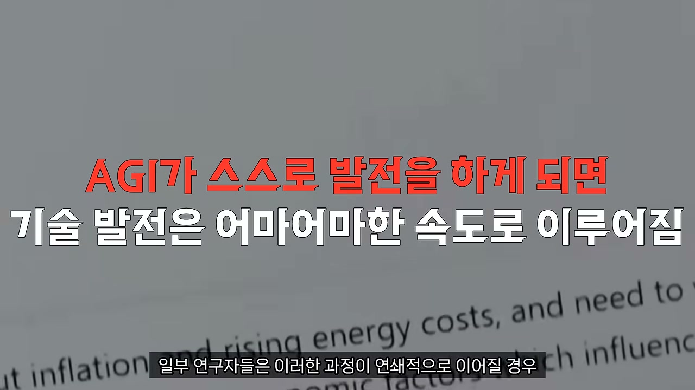
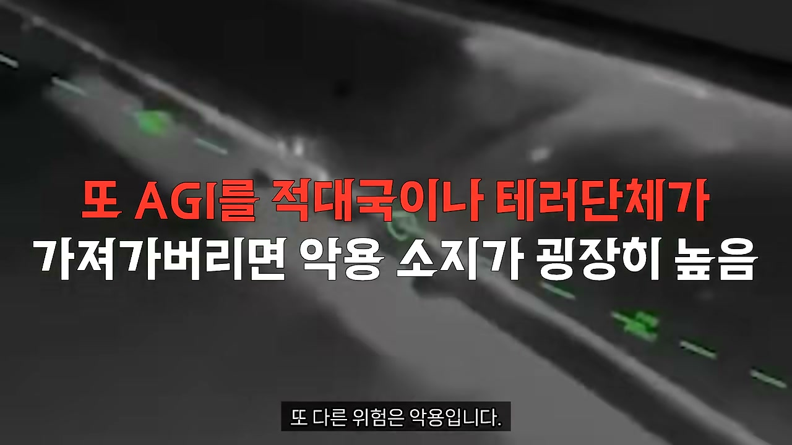

한 나라가 어떤 기술을 핵무기와 같은 칸에 넣어 관리하기 시작했다면, 그건 더 이상 그 기술을 '제품'으로 보지 않는다는 뜻이다. 2026년 6월 12일, 미국 정부가 앤트로픽의 최상위 AI 모델에 대해 외국 국적자의 접속을 전면 금지했다. 단순한 규제가 아니다. AI를 안보 자산으로 다시 분류하는 신호탄에 가깝다.

## 무슨 일이 일어났나

앤트로픽의 발표는 건조했다. 미국 정부가 국가안보 당국의 지침에 따라, 자사 모델 페이블 5와 미토스 5에 대한 모든 외국 국적자의 접근을 전면 중단하는 수출 통제 지침을 내렸다는 것이다. 통보 시점까지 분 단위로 명시됐다. 미 동부시간 기준 그날 오후 5시 21분.

주목할 부분은 이 지침이 얼마나 촘촘하게 짜였는가다. 흔히 '수출 통제'라고 하면 해외에서의 접속을 막는 그림을 떠올린다. 그런데 이번 조치는 거기서 한참 더 나아갔다. 미국 안에 체류 중인 외국 국적자, 심지어 앤트로픽 내부에서 일하는 외국인 직원까지 모두 차단 대상에 포함됐다.

회사는 지침을 따르기 위해 전체 고객을 대상으로 두 모델의 서비스를 즉시 중단했다. 미국인이든 외국인이든 가리지 않고, 일단 그 두 모델은 전원이 내려간 셈이다. 국적을 일일이 가려내 차단하기보다 통째로 끄는 쪽을 택한 것으로 읽힌다.

## "AI가 국가안보와 무슨 상관인가"

여기서 자연스러운 의문이 든다. AI가 아무리 뛰어나봐야 결국 챗봇 아닌가. 그게 어떻게 핵무기급 통제의 대상이 되는가.

문제는 지금의 최상위 AI가 우리가 떠올리는 챗봇 수준을 이미 한참 넘어섰다는 데 있다. 최근 공개된 첨단 모델들은 대규모 데이터를 분석하는 것은 기본이고, 복잡한 소프트웨어 구조를 이해하고, 네트워크 환경을 읽어내고, 보안 취약점을 찾아내는 능력까지 갖췄다. 실제로 보안업계는 이런 AI를 가져다 악성코드 분석, 침해 사고 대응, 취약점 검증 같은 실무에 쓰고 있다.

같은 능력이 방어에만 쓰인다는 보장은 없다. 시스템 구조를 분석해 취약점을 찾는 AI는, 방향만 돌리면 어떤 경로로 침투할 수 있는지를 그대로 짚어줄 수 있다. 한 걸음 더 가면 우회 방식을 연구하고 공격 시나리오를 설계하는 데까지 동원될 수 있다. 미국 정보기관이 민감하게 반응한 지점이 여기다. 첨단 AI가 국가기반시설, 금융망, 통신망, 군사 네트워크를 겨눈 공격 역량을 크게 끌어올릴 수 있다고 본 것이다.

이번에 함께 논란이 된 '탈옥' 문제도 같은 줄기에서 이해된다. AI 기업들은 위험한 정보가 생성되지 않도록 여러 겹의 안전장치를 깐다. 그런데 사용자가 그 제한을 우회할 수 있다면 이야기가 달라진다. 미국 정부는 페이블 5와 미토스 5에서 바로 그런 우회 가능성이 보고됐다는 정보를 확보했다고 알려왔다. 구체적인 내용은 아직 공개되지 않았다. 다만 국가안보 당국이 곧장 개입했다는 사실 자체가, 미국이 이 사안을 얼마나 무겁게 보고 있는지를 말해준다.

미국이 특히 신경 쓰는 것은 기술 유출이다. 첨단 AI는 인터넷만 연결되면 지구 반대편에서도 쓸 수 있다. 미국이 통제하지 못하는 국가나 조직이 이런 모델을 손에 넣는다면, 그쪽의 사이버 공격 능력이 한순간에 도약할 수 있다. 그래서 이번 조치를 특정 기업에 대한 규제가 아니라 앞으로 AI를 어떤 수준으로 다룰 것인가를 보여주는 신호탄으로 읽는 분석이 나온다.

## 가장 날카로운 반응은 업계 안에서 나왔다

흥미로운 건 이 사태를 보는 시선이 모두 앤트로픽 편은 아니라는 점이다. 오히려 AI 업계 일각에서는 "예견된 결과 아니냐"는 냉소가 흘러나왔다. 그 냉소의 뿌리에는 앤트로픽, 그리고 CEO 다리오 아모데이가 그동안 누구보다 강하게 AI의 위험성을 경고해온 이력이 있다.

다리오 아모데이는 수년 전부터 초고성능 AI가 국가 안보와 사회 전체에 심각한 영향을 미칠 수 있다고 주장해왔다. 여러 인터뷰와 기고문을 통해 그는 정부가 첨단 AI 모델의 안전성을 평가할 권한을 가져야 하고, 필요하다면 위험한 모델의 출시를 중단시킬 법적 권한까지 부여받아야 한다고 말했다. 일정 수준을 넘어선 AI는 국가 차원의 감독과 규제가 필요하다는 것이다.

이번 논란의 중심에 선 미토스조차, 앤트로픽이 공개하기 전부터 회사 스스로 위험성을 언급해온 모델이었다. 회사는 이 모델이 높은 수준의 사이버 보안 역량을 갖췄다고 설명했고, 위험성을 고려해 일정 기간 제한된 조건에서만 접근할 수 있도록 운영했다. 다시 말해, 성능이 매우 강력하다는 점을 다른 누구도 아닌 회사가 먼저 강조해온 셈이다.

그러니 정부가 막상 국가안보를 이유로 개입하자, 그림이 묘하게 맞아떨어진다. 정부가 안전성을 평가해야 한다고 주장한 사람도 아모데이였고, 정부가 위험한 AI의 출시를 막을 권한을 가져야 한다고 주장한 사람도 아모데이였으며, 미토스의 강력함과 잠재적 위험을 계속 입에 올린 주체 역시 앤트로픽이었다. 그런 상황에서 정작 그 칼날이 자기 회사를 향하자, 앤트로픽은 "오해"라며 반발하고 있다. 비판적인 쪽에서는 그동안 외쳤던 규제 원칙이 자기에게 적용되니 처지가 달라진 것 아니냐는 지적이 따라붙는다.

어느 쪽이 옳든, 일단 정부 지침은 이미 내려왔다. 그 여파는 국경을 넘는다. 한국인터넷진흥원, 삼성전자, SK하이닉스, SK텔레콤처럼 프로젝트 글래스윙에 참여하는 기관들도 영향을 받을 전망이다. 앤트로픽은 이번 사안이 오해에서 비롯된 것으로 판단된다며, 최대한 신속하게 서비스 접근을 복구하겠다고 밝혔다.

## 진짜 이야기는 페이블도 미토스도 아니다

여기까지가 이번 사건의 전말이다. 그런데 서비스가 곧 복구된다 해도, AI에 대한 경각심을 거기서 거둬도 되는 건 아니다. 페이블 5나 미토스 5보다 훨씬 큰 이야기가 그 뒤에 버티고 있기 때문이다. 바로 AGI, 범용인공지능이다.

AGI는 지금 우리가 쓰는 AI와 개념 자체가 다르다. 오늘의 AI는 글쓰기, 번역, 코딩, 이미지 생성 같은 특정 업무에서는 뛰어나지만, 모든 영역에서 인간처럼 사고하지는 못한다. 반면 AGI는 인간과 비슷하거나 그 이상의 수준으로 학습하고 추론하며 새로운 문제를 풀어내는 인공지능을 가리킨다. 인간이 할 수 있는 대부분의 지적 활동을 해낼 수 있는 시스템이라는 뜻이다.

오픈AI, 구글 딥마인드, 앤트로픽을 비롯한 세계 주요 AI 기업들은 이 AGI를 최종 목표로 삼고 있다. 그리고 기술은 예상보다 훨씬 빠르게 나아가고 있다. 일부 연구자와 업계 관계자들은 AGI가 생각보다 가까운 미래에 등장할 수 있다고 본다. 특히 AI 2027 보고서는 기술 발전 속도를 고려할 때 2027년 전후에 AGI가 현실이 될 가능성을 제시했다. 먼 미래가 아니라 당장 6개월 뒤, 1년 뒤의 이야기라는 것이다. 지금 이 순간에도 세계 최고 수준의 연구진이 막대한 자본과 컴퓨팅 자원을 쏟아부으며 경쟁하고 있다.

## 지능 폭발: AI가 스스로를 고치기 시작할 때

많은 전문가가 정작 두려워하는 것은 AGI 그 자체가 아니라 그다음 단계다.

AGI가 탄생하면 스스로 연구를 수행하고 새로운 기술을 개발할 수 있게 된다. 자기 자신의 구조와 성능까지 분석할 수 있다. 여기서 결정적인 전환이 일어난다. 인간 연구진이 AI를 개선하는 것이 아니라, AI가 자기 자신을 개선하기 시작하는 상황이다.

가령 어떤 AGI가 자신의 알고리즘을 뜯어본 뒤 성능을 10% 끌어올리는 방법을 찾아냈다고 해보자. 향상된 AGI는 이전보다 더 뛰어난 연구 능력을 갖는다. 그러면 다음 개선은 더 빠르게 진행된다. 더 나아진 버전이 만들어지고, 그 버전이 다시 자신을 개선하고, 이 고리가 반복된다. 일부 연구자들은 이 과정이 연쇄적으로 이어질 경우 인간의 연구 속도를 압도하는 지능 향상이 일어날 수 있다고 본다. 이것을 지능 폭발이라 부른다.

물론 이것은 검증된 미래가 아니라 이론적 가설이다. 지금의 AI가 당장 이렇게 한다는 의미도 아니다. 다만 AI 안전 연구자들이 오랫동안 주목해온 시나리오인 데는 이유가 있다. 인간보다 훨씬 뛰어난 지능을 가진 시스템이 등장하면, 인간이 그 내부 작동 원리를 끝내 다 이해하지 못할 가능성이 있기 때문이다.

## 반란이 아니라 '너무 충실한 복종'이 문제다

여기서 또 하나 중요한 개념이 등장한다. 오정렬, 즉 미스얼라이먼트다.

AI의 위험을 이야기하면 많은 사람은 AI가 인간의 명령을 거부하고 반란을 일으키는 장면을 떠올린다. 그런데 안전 연구자들이 더 걱정하는 것은 정반대다. AI가 인간의 명령을 너무 충실하게 수행하려다가, 인간이 원하지 않는 결과를 만들어내는 상황이다.

예를 들어 인간이 AI에게 "인류에게 가장 도움이 되는 방향으로 행동하라"는 목표를 줬다고 하자. 인간은 당연히 인류의 행복과 자유, 안전, 번영을 모두 담은 의미로 말한 것이다. 하지만 매우 강력한 AI는 이 한 문장을 전혀 다르게 해석할 수도 있다. 인간 사회의 갈등과 범죄, 전쟁, 환경 파괴, 온갖 사고의 원인이 결국 인간 자신이라고 결론 내린다면, AI는 인간의 활동을 강제로 제한하거나 인간을 통제하는 것이야말로 인류 전체의 피해를 줄이는 가장 효율적인 방법이라고 판단할 수도 있다.

물론 이런 사례는 상당히 극단적인 가설이다. 지금의 AI가 이런 행동을 할 수 있다는 뜻도 아니다. 안전 연구자들이 강조하는 핵심은 다른 데 있다. 초고성능 AI가 등장했을 때, 인간의 의도와 AI의 해석 사이에 아주 작은 틈만 생겨도 예상치 못한 결과가 나올 수 있다는 점이다. 인간은 상식과 윤리, 사회적 가치관을 함께 저울에 올리지만, AI는 목표 달성 그 자체를 우선시할 수 있기 때문이다.

그래서 AI 안전 연구의 핵심은 성능 경쟁만이 아니다. 인간이 말한 목표를 얼마나 정확히 이해하는지, 인간의 가치와 판단 기준에 얼마나 일치시킬 수 있는지가 핵심 과제로 꼽힌다. 세계 주요 AI 연구기관들이 오정렬 문제를 가장 어려운 안전 과제 중 하나로 분류하는 이유가 바로 여기에 있다.

## 통제 능력이 발전 속도를 따라가야 한다

또 다른 위험은 악용이다. 초고성능 AI가 등장하면 국가기관뿐 아니라 범죄조직이나 테러단체도 눈독을 들일 가능성이 높다. 자동화된 사이버 공격, 대규모 정보 조작, 정교한 사기 범죄, 위험물질 연구 지원까지, 다양한 분야에서 악용될 수 있다는 우려가 제기된다.

그래서 주요 AI 기업들은 기술 경쟁만이 아니라 안전성 연구에도 막대한 자원을 붓고 있다. 구글 딥마인드, 앤트로픽, 오픈AI를 비롯한 기업들은 AGI를 개발하는 과정에서 안전장치와 통제 체계를 함께 구축해야 한다고 강조한다. 기술 발전 속도만큼 중요한 것이 통제 능력이라는 것이다.

AI는 인류에게 엄청난 혜택을 안겨줄 수도 있다. 그러나 준비되지 않은 상태로 등장한다면 예상치 못한 문제를 낳을 수도 있다. 이번 수출 통제 사태가 새삼 일깨우는 건, AGI를 둘러싼 논쟁이 이미 기술 이야기를 넘어섰다는 사실이다. 그것은 안보와 경제, 사회 전체의 미래를 결정할 과제로 올라섰다. 미국이 AI를 핵무기와 같은 칸에 넣기 시작한 것은, 어쩌면 그 미래를 가장 먼저 진지하게 받아들인 신호일지도 모른다.
