새벽 4시에 모델이 나왔다. 편집자P는 자다가 아이가 깨서 스레드를 보다가 그 소식을 알았다고 했다. 앤트로픽이 페이블(Fable)을 출시했고, 스레드 사용자들이 벌써 글을 올리고 있었다. 그래서 목 상태가 좋지 않은데도 영상을 찍기 시작했다. "지금 안 찍으면 어차피 의미가 없기 때문에"라는 게 이유였다.

이 영상의 구조는 단순하다. 첫째, 앤트로픽이 페이블에 대해 무엇을 주장하는지 읽는다. 둘째, 직접 써보면서 이 모델이 토큰을 얼마나 빨리 태우는지 측정한다. 리뷰라기보다 측정에 가깝다. 편집자P 본인도 "써본 다음에 여러분들한테 말씀을 드리는 게 아니라 오늘 같이 써보면서" 알아보겠다고 못박았다. 그러니 이 글은 결론이 깔끔하게 떨어지는 평가가 아니라, 한 사람이 새 모델을 처음 만지면서 무엇을 보고 무엇을 의심하는지 따라가는 기록이다.

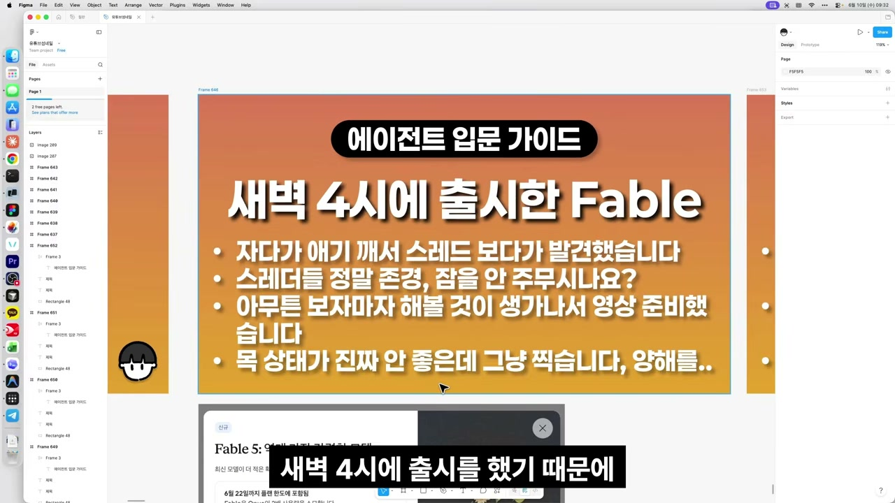

## 페이블은 미토스에서 팔다리를 묶은 모델이다

먼저 페이블이라는 이름의 정체부터 짚어야 한다. 원래 나온다고 예고됐던 건 미토스(Mythos)였다. 그런데 미토스는 "출시를 너무 위험해서 못한다"는 뉴스만 돌았고, 편집자P도 실제 출시는 안 할 줄 알았다고 한다. 그러다 페이블이라는 이름으로 낮춰서 나온 것이다.

그가 정리한 둘의 관계는 이렇다. 미토스가 할 수 있는 작업 중에서 앤트로픽이 "이건 이 모델로 하면 너무 위험하다, 다 털어먹을 수 있다"고 규정한 것을 못하게 막은 게 페이블이다. 그의 표현을 빌리면 "팔다리를 묶어놓은" 버전이다.

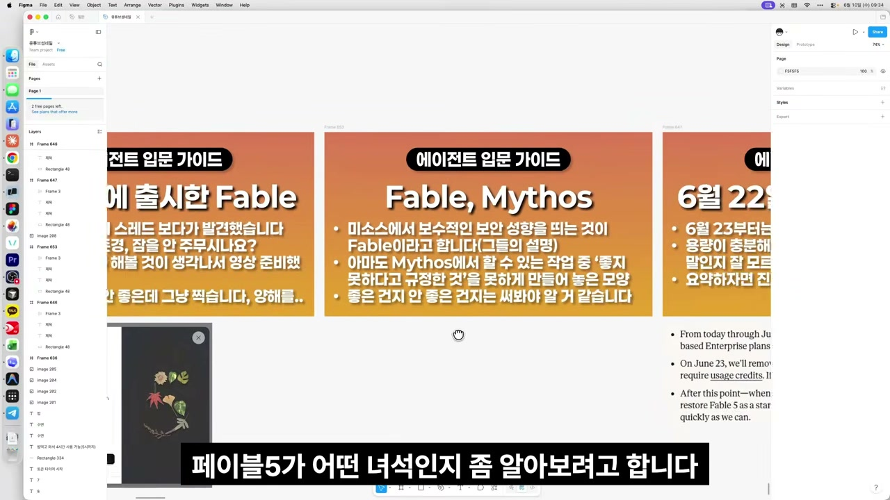

여기서 그가 놓치지 않은 지점이 있다. 팔다리를 묶었다는 게 성능을 깎았다는 뜻이 아니라는 것이다. 앤트로픽 주장으로는 페이블 5의 성능은 미토스 5와 동일하다. 다만 어떤 요청은 거부한다. 그러니까 "성능은 동일한데 거부를 한다"가 핵심이고, 벤치마크에서 페이블이 팔을 묶었다고 표시되는 것은 "나 이거 안 할래"로 받아들여야 한다는 것이다.

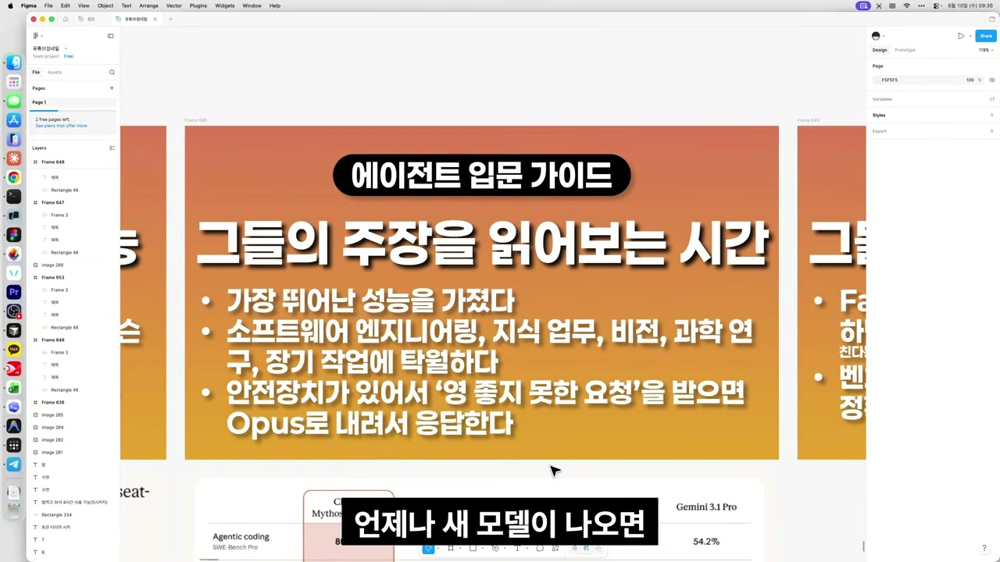

이 안전장치의 작동 방식이 흥미롭다. 사용자가 영 좋지 못한 요청을 하면, 페이블은 그 요청을 오퍼스(Opus)로 내려서 처리한다. 편집자P는 이걸 두 가지로 해석한다. 앤트로픽이 든 예시는 이렇다. 해당 모델을 역추적해서 역공학으로 어떻게 만들어졌는지 알아내거나 설계도를 캐묻는 요청. 페이블 5는 그걸 할 수 있다. 그런데 오퍼스로 내려서 응답하겠다는 것은, 곧 오퍼스는 그걸 못한다는 뜻이다.

여기서 그의 추론이 한 발 더 나간다. 앤트로픽 모델은 예전에 유출돼서 역공학을 당한 적이 있다. 그러니 이번엔 두 모델 다 내부에서 테스트해봤을 것이고, 위험한 요청에 대해 오퍼스로 내린다는 것은 "오퍼스는 못하고 페이블은 할 수 있다"는 걸 이미 검증했다는 얘기라는 것이다. 그는 이 설계가 상당히 보수적이라고 봤다. 그냥 요청을 거부하면 될 텐데 굳이 오퍼스로 내린다는 건, 극단적 요청 외에도 일반 요청 중 일부를 과하게 거르는 특성이 있는 것 같다는 해석이다.

> 참고로 페이블이 위험 요청에서 폴백하는 대상은 오퍼스이고, 페이블은 오퍼스의 약 2배 토큰을 쓴다. 폴백 구간의 요금은 페이블로 답한 부분까지는 페이블로, 오퍼스로 전환한 시점부터는 오퍼스 단가로 계산한다는 게 앤트로픽 설명이다.

## 장기 작업 홍보는 우리 같은 양민을 위한 게 아니다

앤트로픽의 주장 자체는 새 모델이 나올 때마다 반복되는 패턴이다. 가장 뛰어난 성능, 프로그래밍뿐 아니라 지식 업무와 연구에도 강함, 그리고 특이하게 장기 작업에 탁월함. 편집자P는 마지막 항목에서 멈춘다.

장기 작업을 강조한 이유를 잘 모르겠다는 것이다. 그의 논리는 이렇다. 일반 유저, 그가 "양민"이라 부르는 100달러나 200달러 구독자들은 이걸로 장기 작업을 할 수 있을 리가 없다. 토큰이 그만큼 안 받쳐주기 때문이다. 그래서 그는 이 문장이 구독제 사용자가 아니라 종량제로 쓸 기업을 타깃으로 한 것이라고 읽는다. "비싸도 엄청 좋으니까 한번 써보십시오"라는 메시지. "저는 의도가 보입니다"라고 그는 덧붙인다.

이 의도 읽기는 페이블의 출시 방식과도 맞물린다. 페이블은 6월 22일까지만 구독자 안에서 쓸 수 있고, 그 이후엔 종량제(사용량 크레딧)로 전환된다. 화면에는 "after that will require usage credit"라고 적혀 있다.

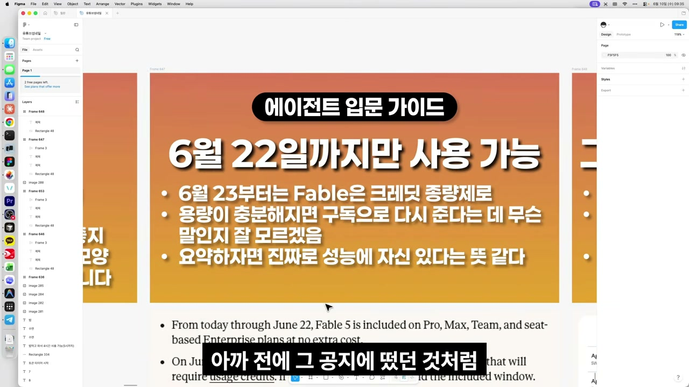

앤트로픽 블로그는 용량이 충분해지면 구독으로 다시 전환하겠다고 했지만, 편집자P는 "솔직히 무슨 말인지 잘 모르겠다"고 한다. 그의 추측은 더 냉정하다. 2주 정도 테스트하면서 사람들이 이걸 얼마나 쓰는지, 인기가 얼마나 많은지 보고 전략적으로 결정할 텐데, 만약 너무 좋아서 사람들이 사랑하게 되면 오히려 구독에 포함하지 않을 가능성이 크다는 것이다. 종량제로 전환하겠다는 건 그 비용을 감수하고서라도 쓸 유저가 있는지를 보려는 것이고, 그 자체가 앤트로픽이 자신 있다는 신호라는 해석이다.

벤치마크에 대한 그의 태도는 일관되게 회의적이다. 앤트로픽은 90%를 넘긴 최초 사례라고 강조하지만, 그는 "정확한 벤치마크가 이 세상에 있나요? 그냥 다 마케팅용으로 쓰는 것 같다"며 무시하겠다고 선언한다. 그가 믿는 건 직접 태워보는 숫자다.

## 측정 세팅: 구독제와 종량제를 동시에 돌린다

그래서 그는 두 가지 환경을 동시에 깔았다. 하나는 클로드 코드(구독제, 100달러 플랜), 다른 하나는 커서(Cursor, 종량제)다.

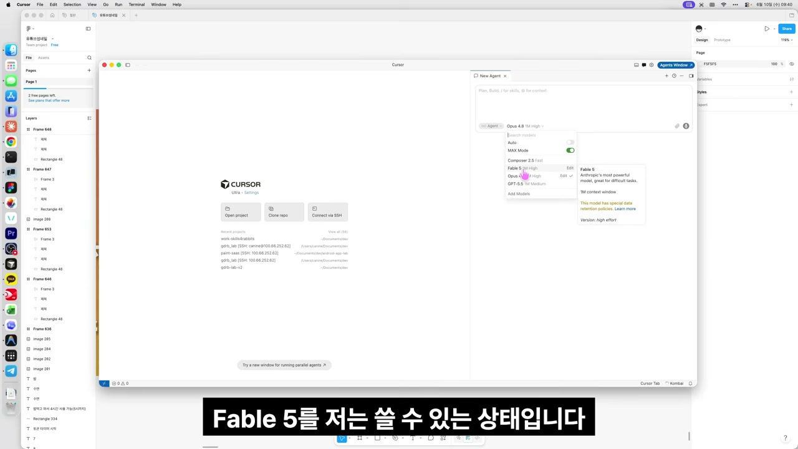

커서 쪽은 사정이 복잡하다. 기본 사용량은 이미 다 썼고 온디맨드 유시지로 넘어간 상태였다. API 크레딧도 다 썼는데, 그 이유가 그동안 오퍼스 4.8을 주로 즐겨 썼기 때문이라고 한다. 컴포저 2.5(Composer 2.5)를 안 쓴 게 아니라, 울트라 플랜에서 컴포저를 많이 줘서 그쪽을 충분히 썼다는 것이다. 화면으로 보니 본인도 "되게 극단적이긴 하네요"라고 인정할 만큼 한쪽으로 쏠린 사용 그래프였다.

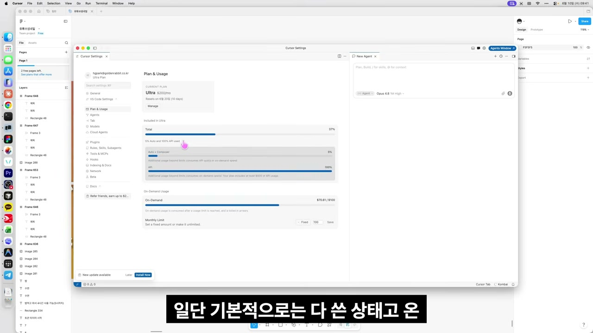

측정을 제대로 하기 위해 그는 온디맨드 한도를 500달러로 올린다. 이번 달 100달러 중 30달러쯤 남은 상태에서, 종량제 테스트용으로 430달러 정도의 여유를 확보한 것이다.

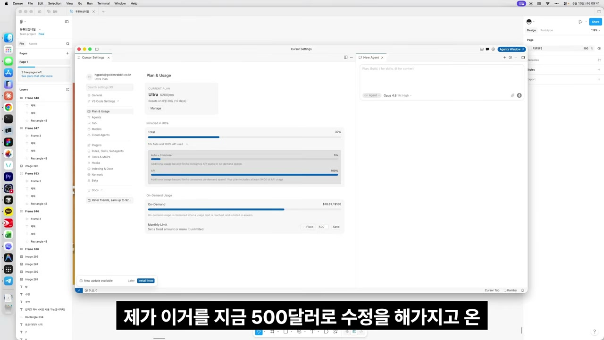

테스트 대상 사이트도 정해져 있다. 그가 운영하는 유튜브 강의 로드맵 사이트다. 영상이 200개가 넘게 올라가 있어서 사람들이 뭐부터 봐야 할지 모른다는 피드백이 많았고, 그래서 영상을 로드맵으로 정리해 제공하는 사이트를 만들었다. 흥미로운 사실 하나. 이 사이트는 순수 안티그래비티(Antigravity)로만 만들었는데, 작업하다 화딱지가 나서 구독을 취소해둔 상태라고 한다. 오늘은 그 사이트를 페이블로 수정시켜볼 참이다.

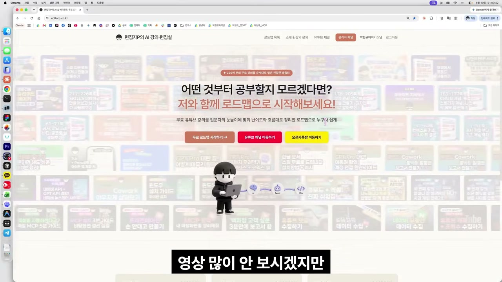

## 아무것도 안 했는데 4%: 첫 번째 충격

클로드 코드를 업데이트하니 "Fable 5 is now available"이 뜬다. 모델을 페이블로 바꾼다. 추론 수준은 High와 Medium 중 고를 수 있는데, 그는 "일단 High로 하겠습니다, 안 하겠습니다" 하며 잠깐 망설이다 그대로 작업으로 넘어간다.

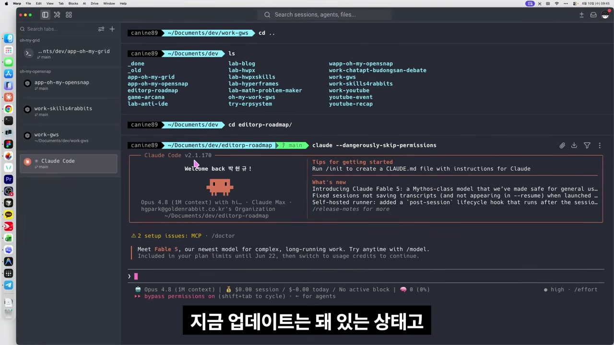

그가 처음 한 일은 사이트 대대적 개편을 위한 브랜치 하나를 만드는 것이었다. 정말로 브랜치 하나 만들고, 사용량 화면을 확인한다. 그리고 여기서 영상 전체에서 가장 인상적인 장면이 나온다.

"아무것도 안 했거든요. 벌써 4% 썼습니다. 무섭지 않나요?"

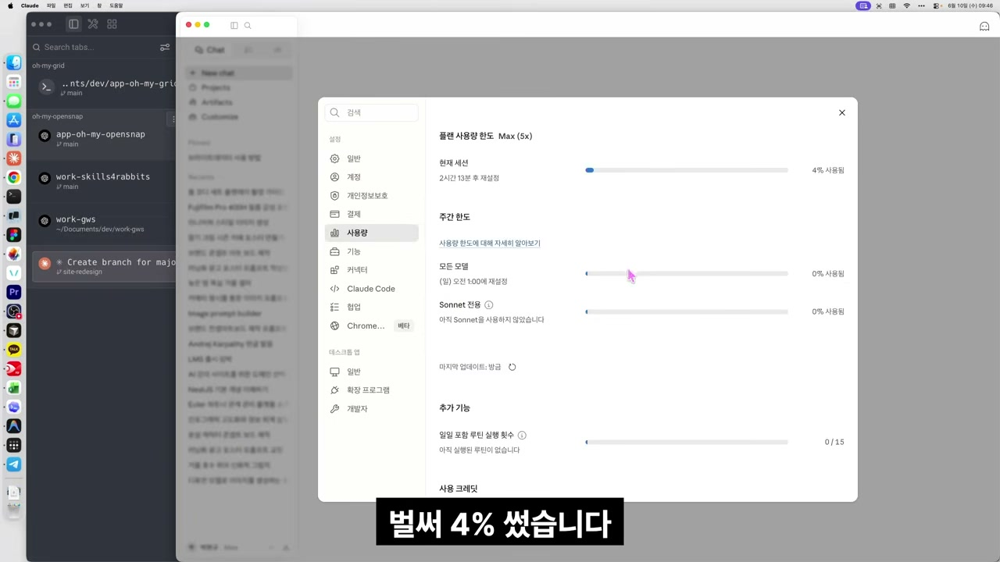

브랜치 하나 만드는 데 100달러 플랜의 4%가 날아갔다는 것이다. 이 숫자가 영상의 정서를 결정한다. 이후로 그는 작업을 시킬 때마다 사용량 화면을 들여다본다. 그가 쓰는 "토큰 쇼"라는 표현이 여기서 나온다.

## UX 진단은 기대 이상이었다

브랜치를 만든 뒤 그는 어려운 주문을 던진다. 사이트 UI와 UX를 살펴보고 사용자가 불편하다고 생각할 만한 게 있는지 점검부터 하라는 것이다. 그의 경험상 예전 모델로 이런 걸 시키면 제대로 된 결과가 안 나왔다.

그런데 이번엔 달랐다. 페이블은 플레이라이트(Playwright)를 켜고 로컬 서버를 띄워서 직접 데스크톱과 모바일을 확인했다. 코드 전체를 읽고, 떠 있는 서버에서 화면을 테스트하고, 문제를 심각도 수준으로 분류해 보고했다.

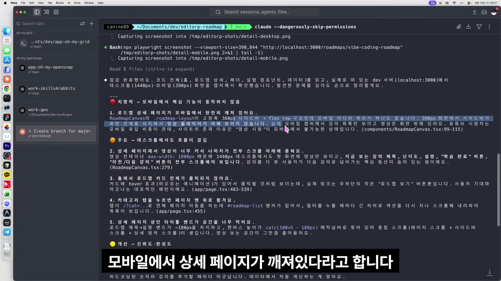

진단 목록은 구체적이었다. 모바일에서 상세 페이지가 깨진다(모바일 미디어 쿼리 없음), 데스크톱에서도 흐름이 끊긴다, 상세 페이지 영상이 너무 크다, 스크롤해야 보인다. 편집자P는 "저는 영상이 너무 크다고 생각을 안 했는데"라며 자기 판단과 다른 지적도 받아들인다.

특히 그를 납득시킨 건 카드 클릭 영역 문제였다. 홈에서 로드맵 카드 전체가 클릭이 안 되는데, 카드가 떠오르는 애니메이션이 있어서 사용자는 카드를 누를 수 있다고 생각하지만 실제로는 특정 버튼을 눌러야 한다는 지적이다. "테스트를 생각보다 잘 해주는데요"라고 그는 반응한다.

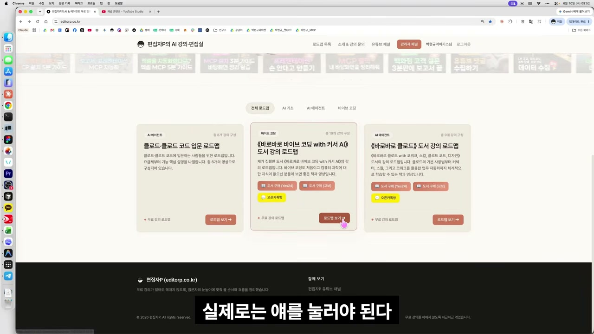

카테고리 탭을 누르면 페이지 맨 위로 튕긴다는 지적도 정확했다. 그가 직접 눌러보니 정말 위로 튕긴다. "저 이것도 고치려고 했는데, 오 이거 다 해주네요." 상세 페이지 상단 타이틀 밴드가 공간을 너무 먹는다는 지적은 그가 일부러 그렇게 한 부분이었지만, 본인도 불편하다고 느꼈던 지점이라 수긍한다.

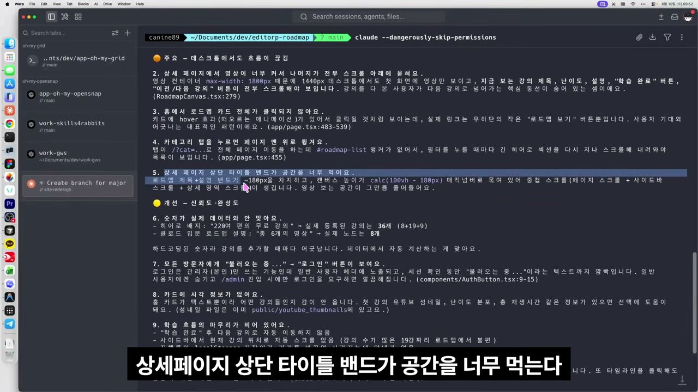

로그인 버튼 지적도 정곡을 찔렀다. 그의 사이트는 가입 없이 그냥 보는 사이트인데, 로그인을 해야만 볼 수 있는 것처럼 유도하는 버튼이 노출돼 있었다. 언젠가 정리하려 했지만 귀찮아서, 그리고 안티그래비티가 못 해서 미뤄둔 일이었다.

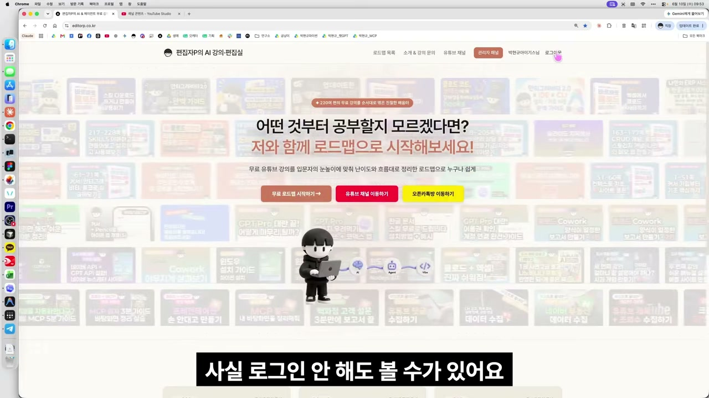

그리고 카드에 시각 정보가 없어 어떤 강의인지 감이 안 온다는 지적까지. 편집자P는 점검 결과가 전부 자기에게 필요한 수정이었다는 걸 확인하고, "그냥 다 해볼래? 하자"며 전부 맡긴다.

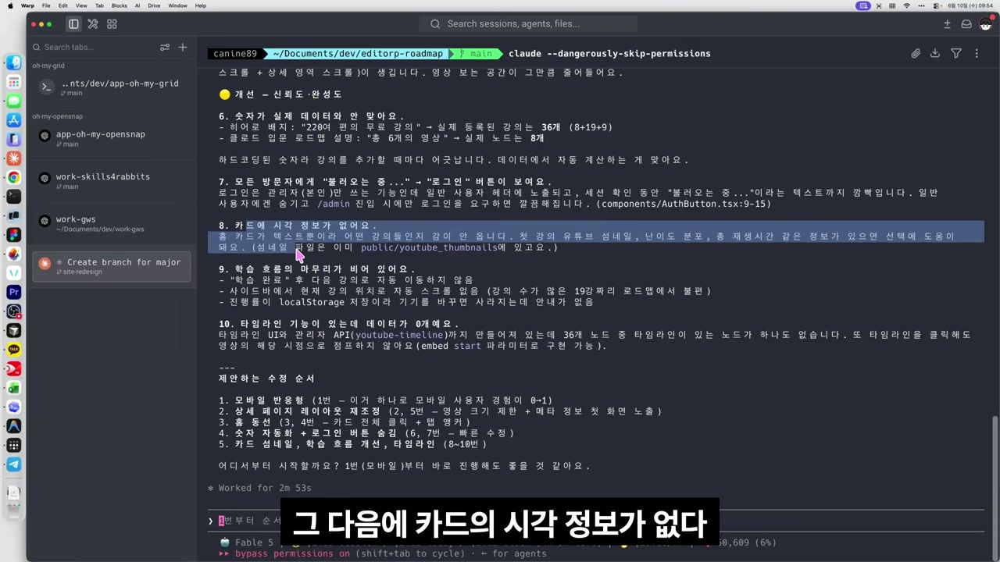

## 결과: UX는 잘했고 디자인은 미지근했다

수정이 끝나고 좌우 비교를 해본다. 왼쪽이 페이블 수정본, 오른쪽이 그가 일주일 동안 직접 만든 최종 상태다.

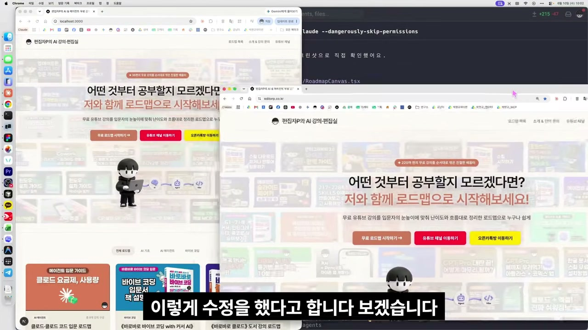

좋았던 점은 분명하다. 썸네일이 안 보여 불편했던 걸 썸네일을 넣어 해결했고, 탭을 누르면 위로 튕기던 문제를 매끄럽게 고쳤다. 진행률은 로그인 없이 쓰는 사이트라는 점을 고려해 계정이 아니라 웹브라우저 로컬 스토리지에 저장하도록 처리했다. 강의를 완료하면 다음 강의로 자연스럽게 이동하게 만든 것도 그가 만족한 부분이다.

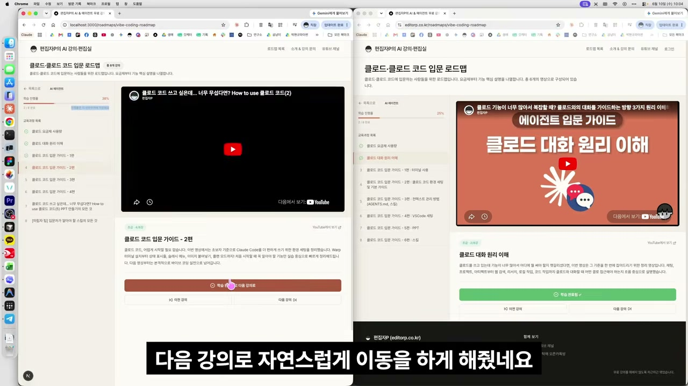

다만 그의 평가에는 일관된 아쉬움이 깔려 있다. "디자인도 해결을 해주길 바랬는데 디자인보다는 UX 해결을 좀 많이 한 것 같다." 그는 이 모델이 UX라는 말은 잘 알아듣는다고 본다. "UX 작업을 잘해주는 것 같아요. UX라는 말을 알아듣는 것 같습니다." 반면 디자인 자체를 끌어올리는 일에는 덜 적극적이었다.

소진 속도는 계속 그의 시야에 걸려 있다. "원래는 이런 거 한참 시켜도 거의 10%에서 12% 내지 해서 보통 작업이 끝났"는데, 페이블은 확실히 더 빨리 닳는다. 동시에 만족도는 인정한다. "이전에는 이런 수준으로 얘가 자세히 보진 못했던 것 같"은데 지금은 굉장히 잘해준다는 것이다. 빨라진 소진과 높아진 품질, 이 둘이 같이 온다.

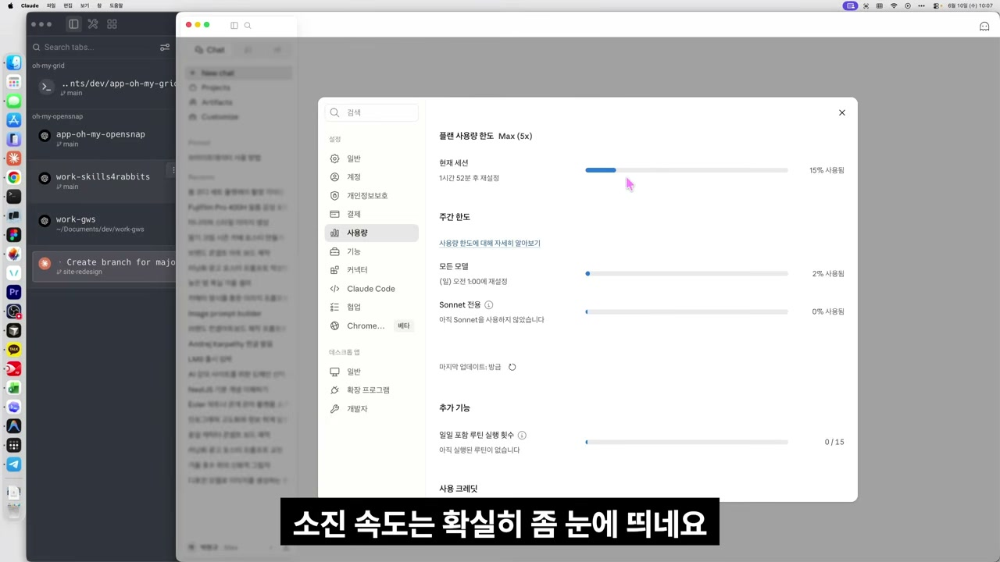

## 종량제에서는 돈이 실시간으로 녹는다

진짜 비용 감각은 커서 쪽 종량제 테스트에서 드러난다. 그는 여기서 예전에 시켜봤던 케이스들(본인도 GPT-5 때였는지 GPT-5.5 때였는지 컴포저 2.5 때였는지 정확히 기억하지 못한다)을 페이블로 다시 돌려보며 작업당 비용을 잰다.

첫 번째는 아르테미스(Artemis) 미션 컨트롤이라는 우주 시뮬레이션이다. 지구에서 뭔가를 쏴서 달에 우주선을 안착시키는 시뮬레이션을 만들어보라는 주문. GPT-5.5가 먼저 했던 결과 화면까지 참고로 같이 넘긴다. 이게 영상 내내 가장 오래 걸리는 작업이 된다.

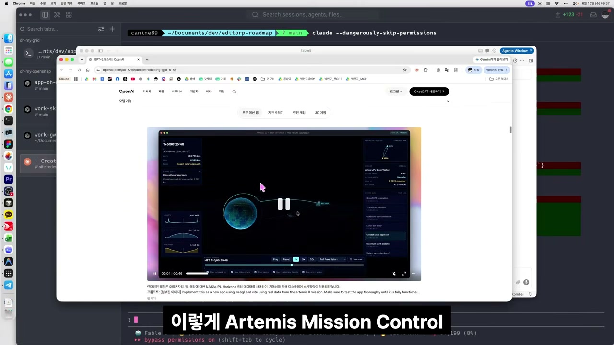

작업 도중 그는 동시에 여러 개를 던지기 시작한다. 탱크 게임, 채용 사이트, 커뮤니티 사이트까지. 페이블이 admin 페이지를 수정하는 코드 작업이 한쪽에서 돌아가는 동안 다른 작업이 또 돌아간다.

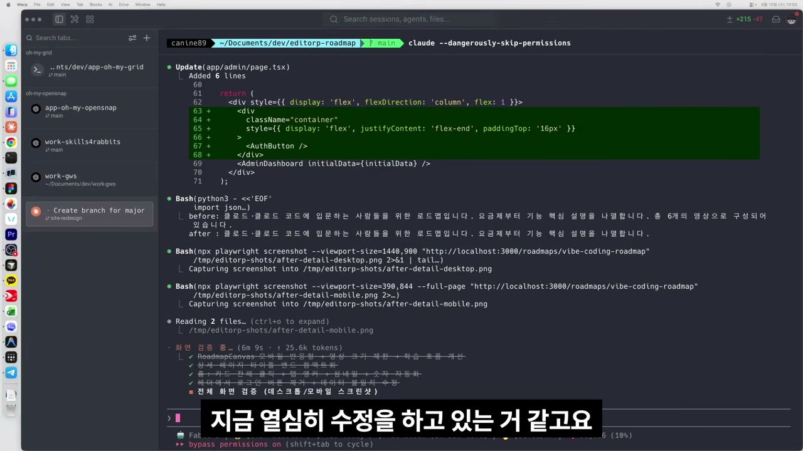

탱크 게임 주문은 구체적이다. WASD로 탱크를 이동하고 마우스로 크로스헤어를 조작해 UFO를 맞추는 게임, 3번 피격당하면 종료, 총알은 무제한. 참고 이미지까지 던져준다.

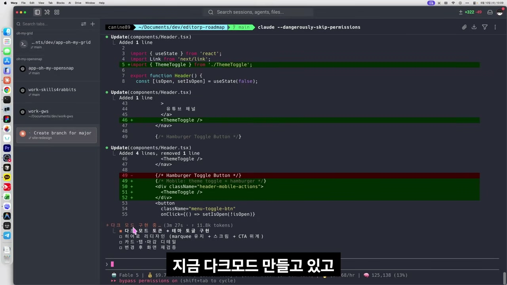

이 무렵 그는 비용 화면을 다시 본다. "이미 벌써 6달러가 넘어갔습니다." 아르테미스가 아직 완료도 안 됐는데 6달러를 썼다. 그래서 그는 작업을 더 던진다. 채용 사이트(가공의 골든 레비 출판사 디자이너·유튜브 PD 채용)와 오마이 스레드라는 커뮤니티 사이트까지.

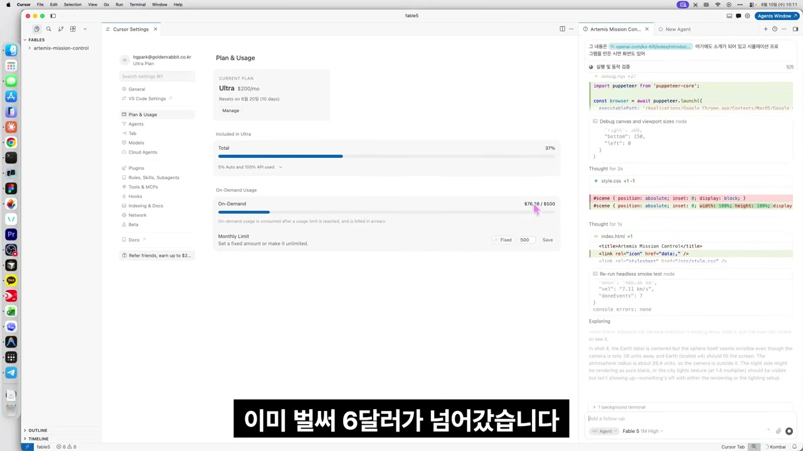

결국 동시에 4개의 작업이 돌아간다. 그러는 사이 한도는 20% 정도까지 차오른다.

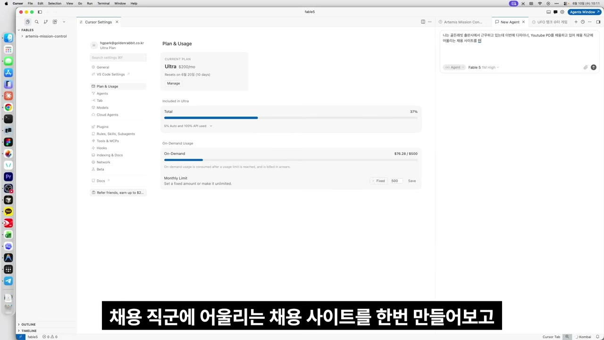

## 결과물의 등급은 작업마다 달랐다

만들어진 것들의 품질은 균일하지 않았다.

탱크 게임은 빨리 나왔지만 처음엔 조작이 엉망이었다. 크로스헤어를 올렸을 때 하늘이 안 보여 UFO를 맞출 수 없었다. "이래서는 조작이 완전 엉망이죠." 커서로 옮겨 수정시키니 하늘이 보이게 됐지만, 이번엔 맞은 UFO가 돌에 끼고 플레이어가 돌에 부딪히면 괴롭히는 식이었다. "게임 잘 만들어주네요. 뭐 이게 뭐 할만한 게임인지 모르겠습니다. 그냥 플래시 게임 수준이네요."

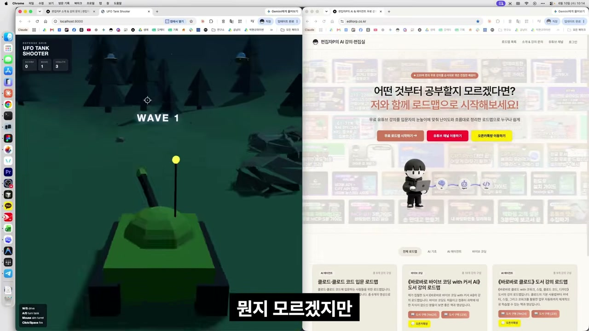

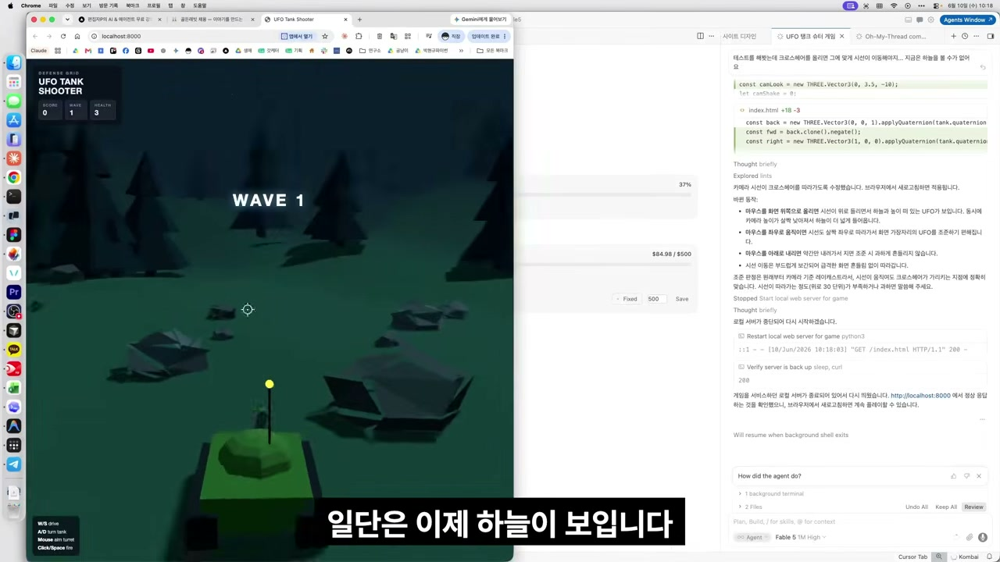

채용 사이트에 대한 그의 평가는 솔직하다 못해 냉정하다. 페이블이 만든 에셋을 넣었는데 좋은지 모르겠다고 한다. 그가 GPT로 몇 번 깎아 만든 채용 사이트와 나란히 비교하니, GPT 쪽은 3D 캐릭터 같은 에셋발이 있어 좋아 보일 뿐 본질적 차이는 없다고 본다. "별 차이는 전 없다는 생각이 들고, 이건 페이블이 할 작업은 아니었던 것 같다." 페이블 5가 채용 사이트나 만들라고 나온 모델이 아니라는 게 그의 단서다.

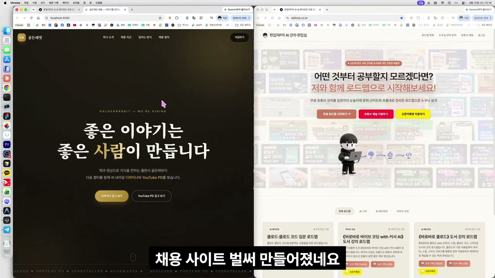

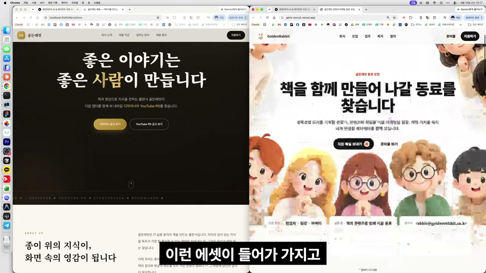

오마이 스레드 커뮤니티는 일단 만들어지긴 했다. localhost:3100에서 환영 화면이 떴다. 하지만 디자인이 좋지 않았다. 그 원인을 그는 디자인 MD(디자인 가이드 문서)가 없어서라고 본다. 그래서 디자인 참고 자료를 던져 개선을 다시 시킨다. 나중에 그는 이 사이트를 두고 "못 써먹을 것 같다"고 평가하는데, 처음 프롬프트에 플래닝을 안 걸어서 그런 것 같다고 자기 책임으로 돌린다.

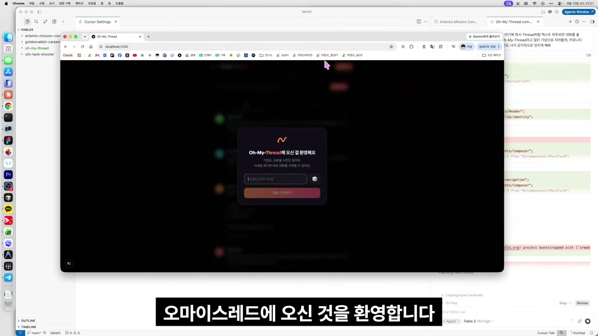

반면 가장 오래 걸린 아르테미스 미션 컨트롤은 가장 잘 나왔다. 결국 완성됐고, 달에 갔다가 지구로 돌아오는 궤도를 보여준다. 우주공학을 잘한다고 자평하는 편집자P가 "굉장히 잘 만들어졌네요"라고 인정할 정도였다.

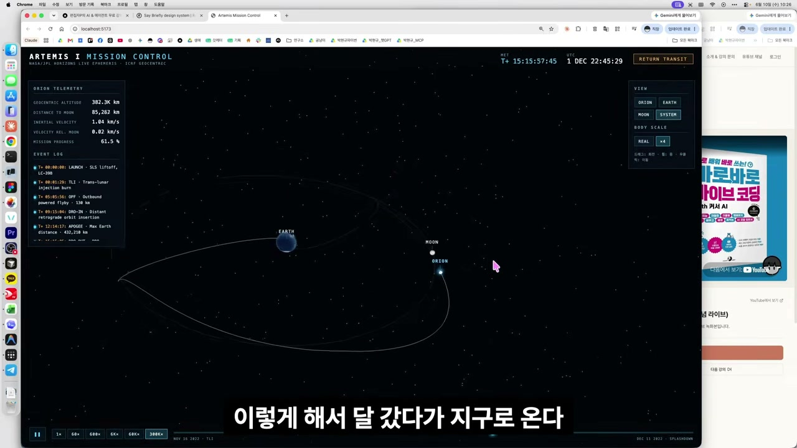

그가 여기서 던지는 가설이 흥미롭다. 앤트로픽이 페이블의 연구 능력이 강하다고 했는데, 그래서 그런가 싶다는 것이다. 내부적으로 시뮬레이션을 위한 속도와 계측값들이 굉장히 디테일하게 들어가서 잘 만들어진 것 같다는 관찰이다. 가장 측정값이 많고 검증이 까다로운 작업에서 가장 좋은 결과가 나왔다는 점은, 단순한 우연으로 넘기기 어렵다.

## 숫자로 본 결론: 시간당 40달러, 5시간이면 200달러

그가 영상 말미에 정리한 수치는 이렇다.

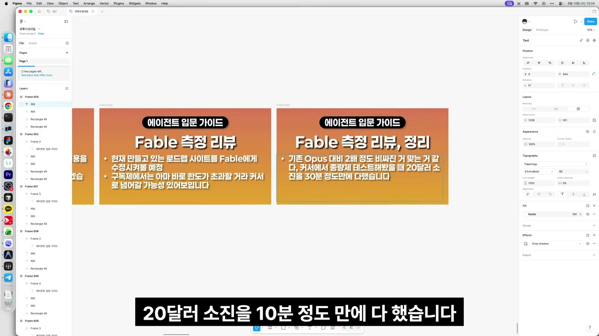

종량제 테스트에서 20달러를 약 10분 만에 소진했다. 4개를 동시에 돌리긴 했지만, 30분 정도 간단한 작업류를 진행해 20달러를 썼다는 계산이다. 여기서 그는 시간당 40달러를 예상한다. 그러면 5시간에 200달러다.

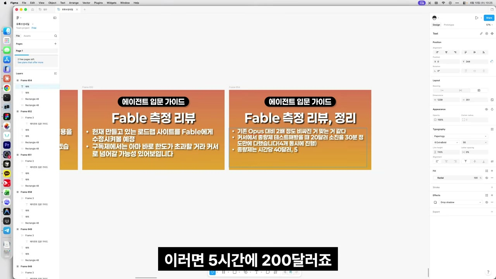

그런데 그는 이 숫자도 보수적이라고 본다. "지금 말하는 사이에 1분도 안 됐는데 3달러를 더 썼"기 때문에 실제로는 이보다 더 비쌀 것 같다는 것이다. 최종적으로 그는 종량제 기준 시간당 50~60달러, 즉 1시간에 약 10만 원짜리 요금제라고 정리한다. "60달러면 상당히 비싸거든요."

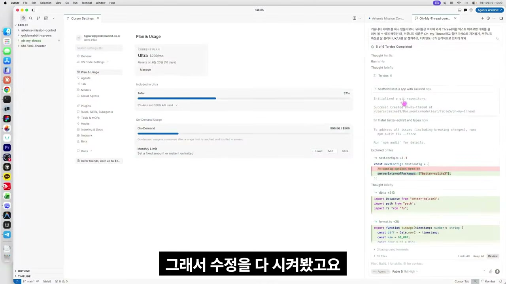

구독제 쪽은 셈이 다르다. 클로드 코드에서 40분 작업에 26%를 썼다. 좋게 쳐서 25%로 잡으면 100달러 플랜으로 약 160분, 3시간 정도 작업할 수 있다는 계산이다. 그는 자기처럼 코드베이스가 크지 않은 간단한 사이트류 수정을 하는 사람에게는 "그렇게 비싼가"라는 생각이 든다고 한다. 못 쓸 수준은 아니라는 것이다.

핵심 분기는 여기다. 구독제 안에서는 상대적으로 싸게 느껴지고, 종량제로 나가면 많이 비싸다고 느낄 것 같다는 것. 그리고 코드베이스가 두터운 작업을 하는 하드한 유저일수록 소진이 빠르다고 느낄 것이다. 기존 오퍼스 대비 가격이 2배 정도 비싸졌다는 앤트로픽의 주장은, 그가 직접 태워본 결과로도 대체로 맞았다.

## 정리되지 않은 채로 남는 것

이 리뷰의 솔직함은 결론을 강요하지 않는다는 데 있다. 편집자P는 스레드 사이트는 실망스럽고, 탱크 게임은 잘 만들었고, 채용 사이트는 일반적이고, 아르테미스는 굉장히 잘 만들어졌다고 작업별로 갈라서 평가한다. 작업 하나로 모델 전체를 단정하지 않는다.

그가 끝까지 유보를 다는 지점도 정직하다. 자기 코드베이스는 크지 않으니 이 비용을 감안해서 봐야 한다는 것, 회사에서 쓰는 코드베이스가 두터운 사내 시스템은 공개할 수 없어 보여주지 못한다는 것, 그리고 좀 더 하드한 워킹은 다음에 다시 리뷰하겠다는 것. 이번 측정은 그의 표현대로 "미리 좀 맛보는 수준"이다.

그래서 이 글이 남기는 건 깔끔한 별점이 아니라 한 가지 감각이다. 페이블 5는 UX를 잘 읽고, 연구성 작업을 잘 만들며, 그만큼 토큰을 빠르게 태운다. 구독제 안에 머물면 견딜 만하고, 종량제로 나가는 순간 시간당 10만 원의 무게가 실시간으로 느껴진다. 새벽 4시에 나온 모델을 목이 쉰 채로 처음 만진 사람이 반나절 만에 도달한 결론치고는, 꽤 단단하다.
