스레드 하나에 리서치도 시키고, 기획도 시키고, 검토까지 몰아넣어 본 적 있다면 그 답답함을 안다. 일이 줄줄이 직렬로 늘어서면서 시간이 한없이 늘어진다. 그래서 병렬로 여러 스레드에 나눠 던지면? 이번엔 스레드가 사방에 흩어져서, 어느 방에서 뭐가 끝났는지 챙기는 것 자체가 또 하나의 일이 된다.

영상 속 화자(시민개발자 구씨)가 짚는 출발점이 정확히 여기다. 빠르려고 나눴더니 관리가 어려워지는, 그 흔한 딜레마. 그리고 그는 코덱스의 최신 업데이트가 이 지점을 건드린다고 말한다. 핵심은 한 문장이다. **이제 코덱스 스레드 안에서, 프롬프트로 다른 스레드를 만들고 지시할 수 있다.**

별것 아닌 것처럼 들리지만, 이 한 줄이 작업하는 방식 자체를 바꾼다.

## 코덱스를 코딩 도구가 아니라 '조직'으로 본다

이 영상의 진짜 발상은 기능 소개가 아니라 관점의 전환이다. 코덱스를 단순한 바이브 코딩 도구가 아니라 **하나의 AI 조직**으로 보자는 것.

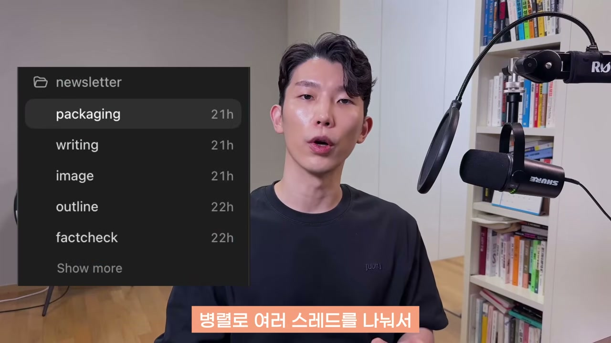

조직이라면 부서가 있어야 한다. 화자가 그리는 구조는 이렇다. 맨 위에 **팀장 방**을 하나 둔다. 단, 이 방은 일을 직접 하지 않는다. 어떤 방에 무슨 일을 시킬지 정하고, 지시하고, 보고를 받아 취합하고, 다음 단계로 넘어갈지를 결정한다. 딱 그 역할만 한다.

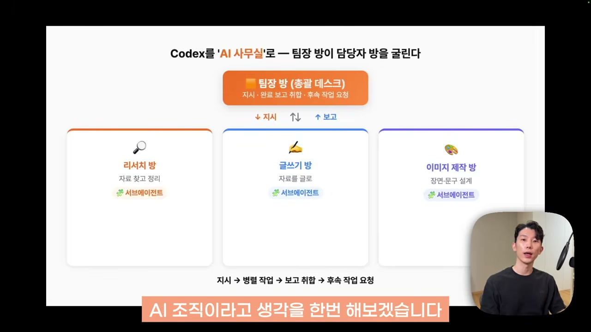

그 아래에는 실제로 손을 움직이는 **담당자 방**들이 늘어선다. 리서치 방은 자료를 찾고 정리하고, 글쓰기 방은 그 자료로 글을 쓰고, 이미지 방은 이미지를 만든다. 회사로 치면 각각이 하나의 팀이다. 필요하면 이 방 안에서 다시 서브 에이전트를 불러 일을 더 잘게 쪼개고 결과를 종합할 수도 있다. 방으로 나누든 그 안에서 서브 에이전트로 쪼개든, 손이 모자라면 더 잘게 나눌 수단이 있다는 얘기다.

흐름은 회사의 그것과 똑같다. 각 방이 일을 끝내면 팀장 방에 보고하고, 팀장은 그걸 모아 사용자에게 최종 컨펌을 받는다. 사용자가 피드백을 주면 팀장이 다시 각 방에 필요한 지시를 내려보낸다. 사람은 팀장 한 명하고만 대화하면 되는 구조다.

## 그런데, 왜 굳이 이렇게 복잡하게?

여기서 화자가 스스로 반론을 던진다. 솔직히, 짧고 단순한 일은 방 하나에서 그냥 하는 게 제일 빠르고 단순하다고. 분업은 공짜가 아니다.

그래서 그는 "이 일을 나눌 가치가 있는가"를 **세 가지 질문**으로 판단하자고 제안한다.

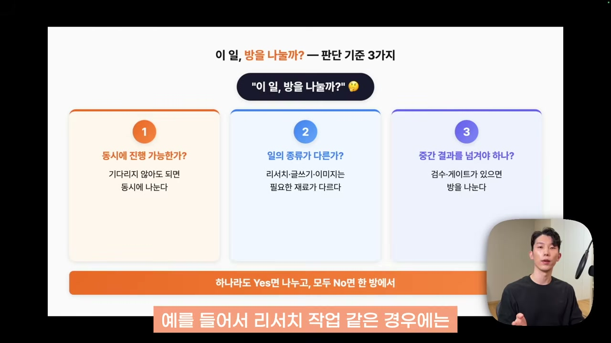

첫째, **동시에 진행할 수 있는 일인가.** 예컨대 리서치는 여러 방면을 한꺼번에 돌려도 서로 방해되지 않는 경우가 많다. 병렬이 가능하면 나누는 만큼 결과를 빨리 받는다.

둘째, **일의 종류가 다른가.** 리서치, 글쓰기, 대시보드 제작은 성격이 제각각이다. 회사로 치면 서로 다른 팀이 할 일이다. 다른 팀이 할 법한 일이면 스레드를 나누는 게 낫다.

셋째, **중간 결과를 넘겨야 하는가.** 글쓰기는 보통 리서치 결과를 받아서 시작한다. 이렇게 단계가 이어지는 일은 스레드로 분리해 두면 단계별 관리가 깔끔해진다.

세 개 중 하나라도 해당되면 나눌 만하다. 셋 다 아니면, 그냥 한 방에서 하는 게 정답이다. 분업은 도구가 아니라 선택이라는 얘기다.

## 실제로 돌려보기 — 비개발자용 AI 뉴스레터 만들기

개념을 깔았으니 화자는 곧장 실전으로 들어간다. 시나리오는 '비개발자를 위한 AI 트렌드 뉴스레터' 제작. 이 예시를 고른 이유가 의미심장하다. 뉴스레터야말로 자료조사 → 팩트체크 → 목차 → 글쓰기 → 이미지 → 최종 HTML까지, 단계와 특성이 또렷이 갈리는 일이기 때문이다. 위의 세 질문에 모두 해당하는, 분업의 교과서 같은 사례다.

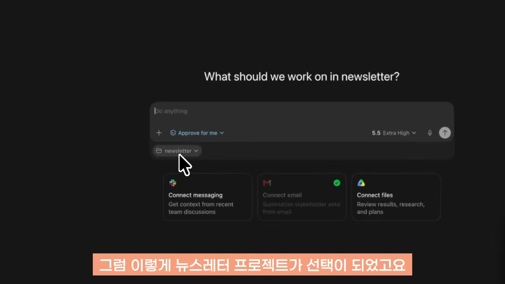

코덱스 앱에서 로컬 프로젝트를 하나 만들고 'newsletter'로 이름 붙인다. 그리고 새 채팅에 첫 지시를 넣는다. 이 첫 스레드가 곧 팀장 방이 된다.

### 팀장 방을 세팅한다는 것

프롬프트의 내용을 뜯어보면, 사실상 한 조직의 운영 규칙을 통째로 적어 넣는 일이다.

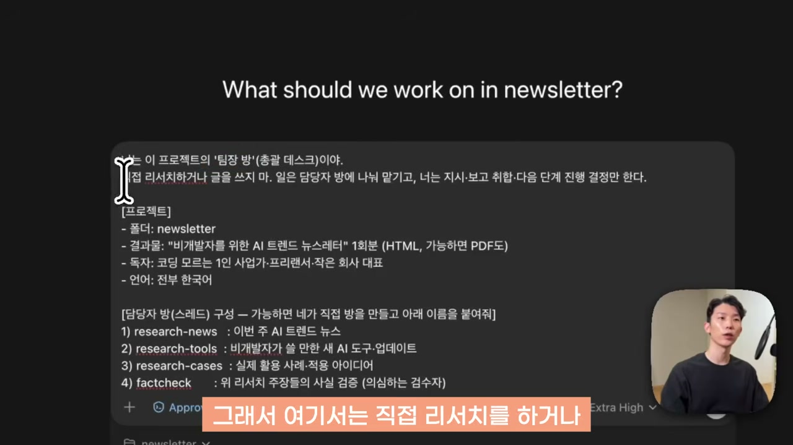

화자가 적은 지시는 대략 이렇다. "여기는 이 프로젝트의 팀장 방이다. 직접 리서치하거나 글 쓰지 말고, 일은 담당자 방에 나눠 맡겨라. 너는 지시·보고·취합·다음 단계 결정만 한다." 그리고 프로젝트의 목표(비개발자용 AI 트렌드 뉴스레터 제작), 담당자 방 구성, 스레드를 어떻게 나눌지를 전부 명시한다.

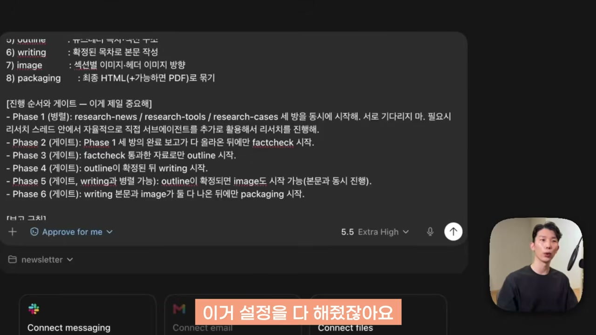

여기에 두 가지가 더 들어간다. 하나는 **게이트(gate)**다. 리서치를 병렬로 먼저 하고, 확인한 뒤 팩트체크, 그다음 아웃라인, 그다음 라이팅 — 단계마다 언제 멈추고 사용자에게 체크받을지를 정해 둔다. 다른 하나는 **보고 규칙**이다. 각 방은 결론을 먼저, 근거는 나중에 보고하라고 순서를 못 박는다.

마지막 한 수가 깔끔하다. "다른 스레드 작업이 끝났는지 **폴링(polling)**해서 확인하고, 완료되면 알아서 보고하라." 팀장이 부하 직원 자리를 주기적으로 들여다보는 행동을, 프롬프트 한 줄로 위임한 셈이다.

### 스레드가 스레드를 만든다

진행을 누르자, 원래 하나뿐이던 프로젝트 안에 리서치 스레드 3개가 동시에 생성된다. 화자는 식별하기 좋게 각각을 자기가 정한 명칭(cases·tools·news)으로 이름까지 바꿔 둔다.

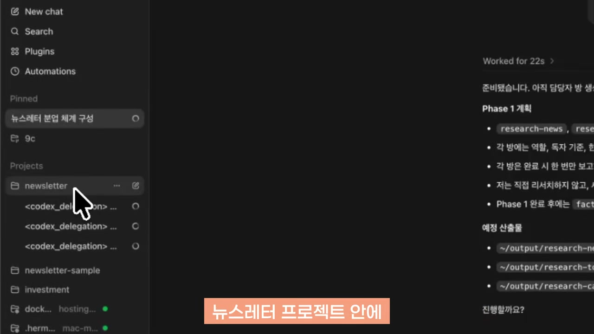

이 대목이 이번 업데이트의 핵심을 눈으로 보여준다. 코덱스가 한 스레드에서 다른 스레드로 요청을 보내면 **"Sent by Codex from another thread"**라는 표시가 붙는다. 사람이 일일이 새 창을 열어 프롬프트를 복붙하던 일을, 팀장 스레드가 알아서 대신 하고 있는 것이다.

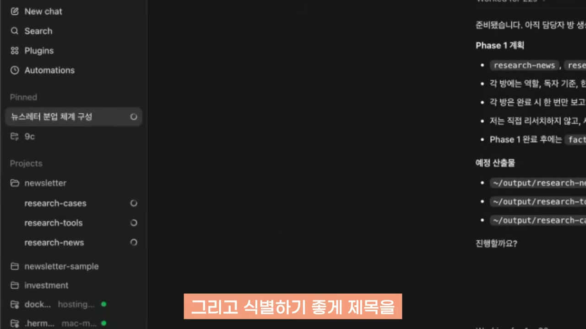

화자는 여기서 과거와의 차이를 짚는다. 예전엔 이런 병렬 리서치를 보통 서브 에이전트로 처리했다. 그것도 유용하지만, 작업이 한 세션 안에 묻혀 버려 **나중에 이력을 확인하기 어렵다.** 반면 세션을 스레드로 쪼개 두면 뉴스는 news 탭에, 도구 정보는 tools 탭에, 유즈케이스는 cases 탭에 영구히 남는다. 속도뿐 아니라 '기록의 분리'가 분업의 또 다른 이득이라는 통찰이다.

### 폴링이라는 양날의 검

팀장 방은 30초 단위로 하위 스레드를 폴링한다. 화자는 곧바로 단서를 단다. 작업 유형에 따라 주기를 더 길게 잡으라고. 너무 자주 들여다보면 — 나중에 한계 항목에서 다시 나오지만 — 그만큼 토큰이 샌다.

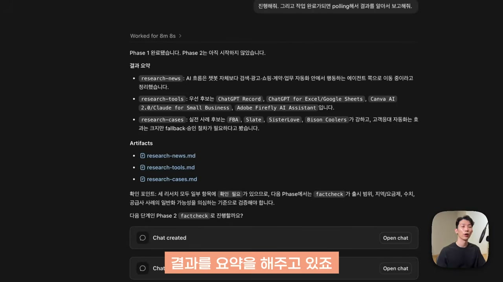

세 리서치가 끝나자 메인 스레드가 결과를 요약해 올린다. 요지는 이렇다. AI의 흐름이 챗봇 그 자체보다 **검색·광고·쇼핑·계약·업무·자동화 안에서 행동하는 에이전트** 쪽으로 옮겨가고 있다는 것. 도구 쪽으로는 챗GPT, 엑셀, 구글 시트, 캔바, 클로드 for 스몰 비즈니스, 어도비 파이어플라이 등을 조사했고, 실전 사례 후보도 몇 개 추렸다.

### 피드백은 정확히 그 방에만

여기서 화자가 추가 지시를 던진다. "tools 쪽에 클로드 코드, 코덱스 같은 AI 에이전트를 더 리서치해 달라." 그러자 메인 방은 그 메시지를 **딱 tools 스레드 하나에만** 보낸다.

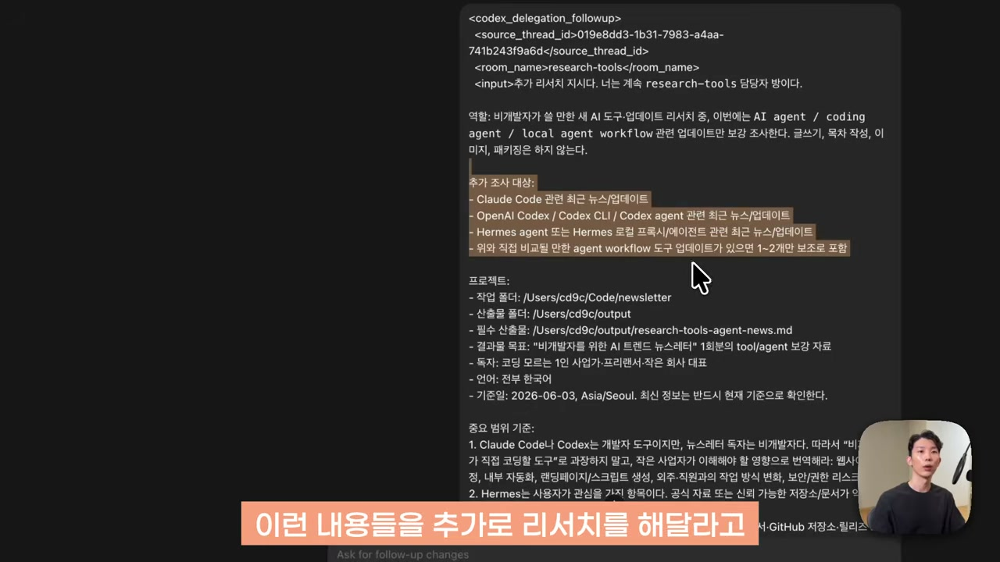

동시에 그는 폴링 규칙도 손본다. "중간 진행 상황은 출력하지 말고, 최종 완료됐을 때 보고 내용만 보여 달라." 그러자 팀장 방은 조용히 대기하며 체크만 한다. 사람이 관리자에게 "다 되면 말해 줘"라고 하는 것과 똑같다.

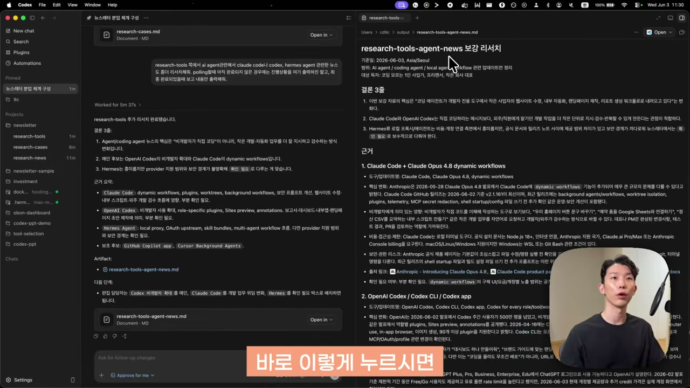

추가 리서치가 끝나면 메인 방이 다시 보고를 올리고, 항목을 누르면 우측 패널에 리포트 전문(제목·결론·근거)이 펼쳐진다. 결과의 깊이까지 그 자리에서 확인 가능하다.

### 게이트를 하나씩 통과하다

마음에 들면 다음 단계로. "다음은 뭐냐"고 물으면 팀장은 팩트체크 차례라고 답한다.

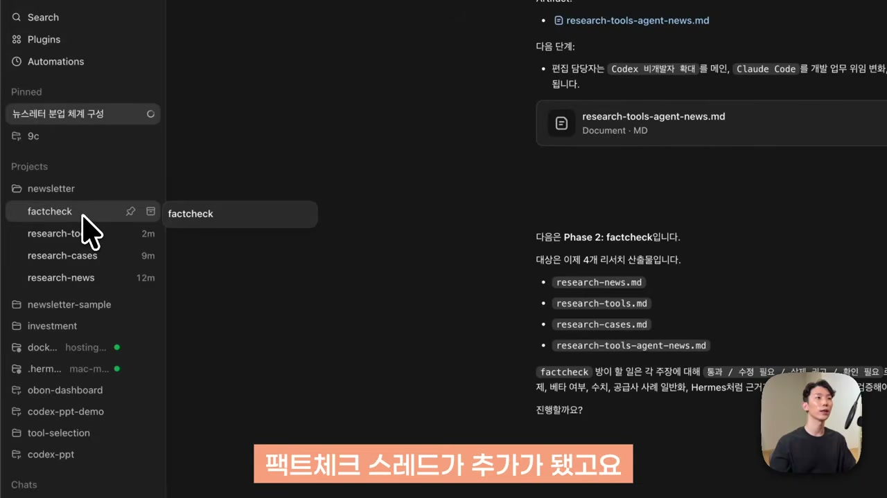

"팩트체크 진행해 줘" 한마디에 새 스레드가 생기고, 검증 대상 파일이 첨부되고, 검증 원칙에 따라 내용을 확인하고 문서까지 만들라는 위임이 깔끔하게 떨어진다. 사용자는 "팩트체크 해 줘"만 했는데 세부 프롬프트는 코덱스가 알아서 채운다. 이 '알아서'의 비중이 생각보다 크다 — 나중에 따로 다룬다.

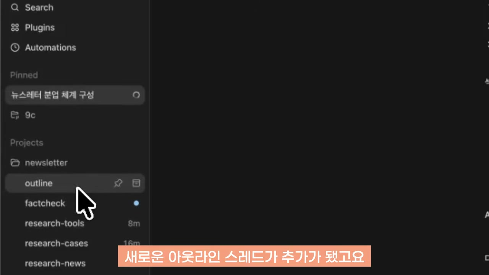

같은 방식으로 아웃라인 단계가 이어진다. 메인 방은 보고를 받아 사용자에게 전달하고, 사용자가 피드백을 주면 다시 하위 방으로 내려보낸다. 마치 팀장에게 보고받고 지시하듯 커뮤니케이션하며 일이 굴러간다.

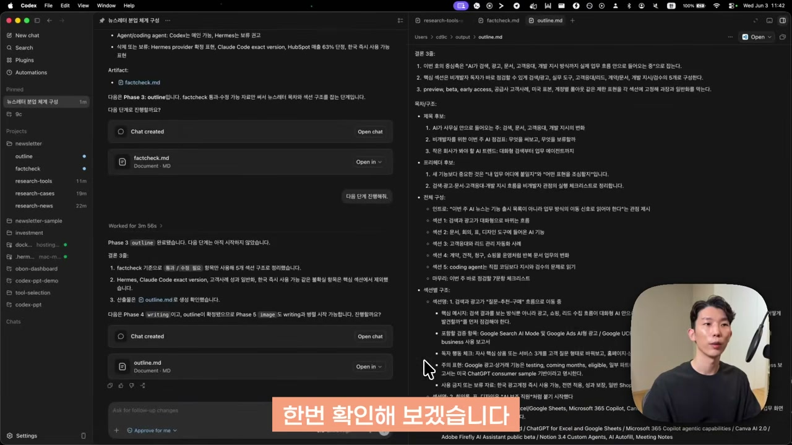

아웃라인 방이 결론과 목차 구조를 내놓는다. 화자는 후보 중 "작은 회사가 봐야 할 AI 트렌드: 대화형 검색부터 업무 에이전트까지"라는 제목을 골라, 이 제목 기준으로 다음 단계를 진행시킨다.

### 라이팅과 이미지를 동시에

제목이 정해지자 라이팅과 이미지 스레드가 **병렬로** 뜬다. 둘은 서로 의존하지 않으니 동시에 돌려도 되는, 첫 번째 질문(동시 진행 가능?)에 딱 맞는 경우다.

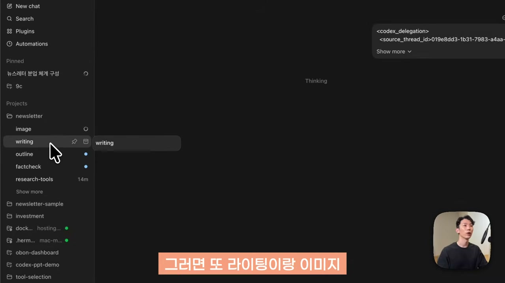

라이팅 방엔 본문 작성을, 이미지 방엔 — 흥미롭게도 이미지 '생성'이 아니라 — 어떤 이미지를 넣을지 그 **구조와 프롬프트를 짜는** 작업을 시킨다.

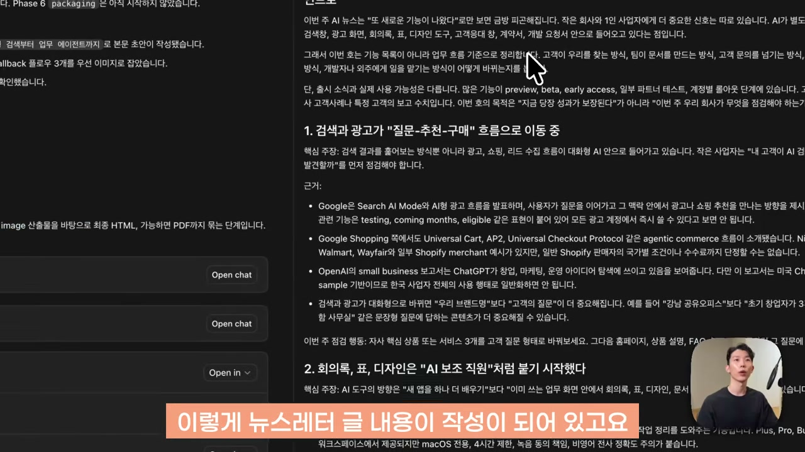

라이팅 방에는 뉴스레터 본문과 함께 검증 출처 URL들이 나열된다. 팩트체크를 거친 자료만 쓰도록 한 게이트 설계가 여기서 결실을 맺는다.

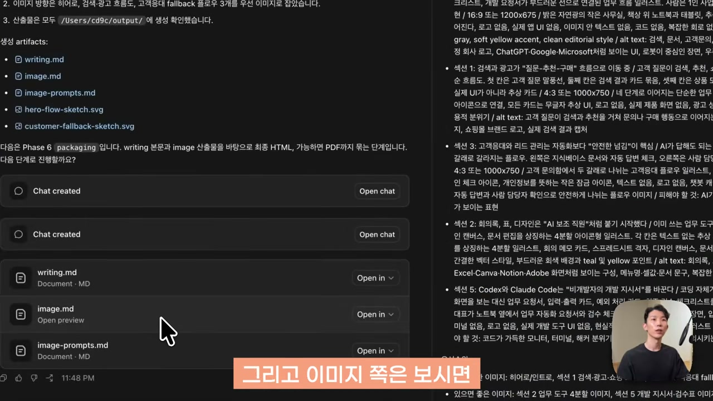

이미지 방은 히어로 이미지와 섹션별 이미지 프롬프트를 미리 만들어 둔다. 이걸로 실제 이미지를 뽑아 넣기만 하면 된다.

## 팀장이 진짜 팀장처럼 굴 때

최종 HTML/PDF 제작을 요청하는 대목에서, 이 구조의 진가가 드러나는 장면이 나온다.

화자는 "디자인.md 문서를 참고해 적용해 달라"는 추가 지시를 던졌다. 그런데 패키징 작업이 끝나고 보니, 하위 스레드가 그 디자인.md를 반영하지 못한 상태였다. 여기서 팀장 방이 스스로 점검에 나선다. 루트 폴더엔 없지만 디자인.md가 다른 위치에 존재한다는 걸 직접 확인하고, 하위 스레드에 "재적용하라"고 다시 요청을 내려보낸 것이다.

화자의 표현 그대로, **정말 팀장의 역할을 하고 있는 것**이다. 사람이 지시한 사항을 중간에서 체크하고, 하위에서 누락된 걸 잡아 재작업을 시킨다. 단순한 메시지 중계기가 아니라, 지시의 이행 여부를 감독하는 층이 하나 생겼다는 뜻이다.

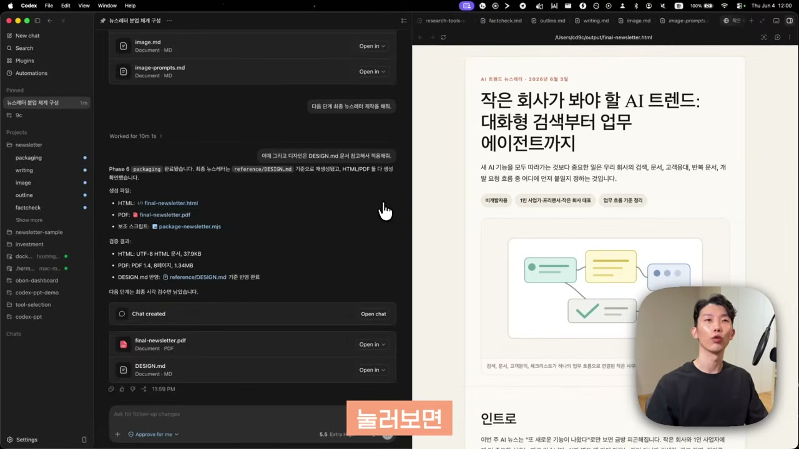

그렇게 완성된 HTML 뉴스레터가 펼쳐진다. 1번 섹션은 '검색·광고가 질문→추천→구매 흐름으로 이동 중', 그리고 기존 애플리케이션(회의록, 표 디자인 등)에 AI 에이전트가 보조 직원처럼 붙기 시작했다는 내용이 담겼다.

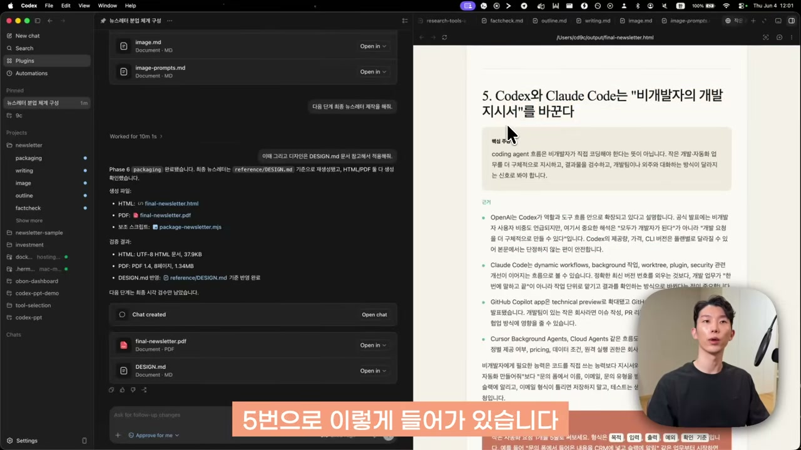

앞서 추가로 요청했던 코덱스·클로드 코드 리서치는 5번 섹션으로 들어가 있다. 화자가 클로드 느낌으로 만들어 둔 디자인.md가 반영돼, 색감까지 그 분위기를 낸다. PDF 버전도 함께 생성된다.

## 분업이 남긴 것 — 메인 방의 깔끔함

작업이 끝난 뒤 메인 방을 보면, 왜 이 고생을 했는지가 한눈에 들어온다. 처음 요청부터 단계별 보고까지, 사용자가 받은 건 **짧은 보고와 단계별 결과물뿐**이다. 실무자가 한 자잘한 작업들 — 세 갈래 리서치, 팩트체크, 아웃라인, 라이팅, 이미지 — 은 전부 각자의 스레드로 빠져 있다.

그래서 메인 스레드에서는 결과물 위주로 확인하고 피드백만 주면 되고, 세부 작업은 각 방에서 따로 굴러간다. 컨텍스트가 뒤엉키지 않는다. 이게 분업의 진짜 보상이다 — 빠른 속도보다도, **관리 가능한 깔끔함.**

## 한 번 더 나아가기: AGENTS.md와 스킬

여기까지도 좋지만, 화자는 한 단계 더 민다. 이 뉴스레터를 매주 만든다면, 매번 이 복잡한 프롬프트를 손으로 다시 적는 건 누락도 생기고 관리도 어렵다.

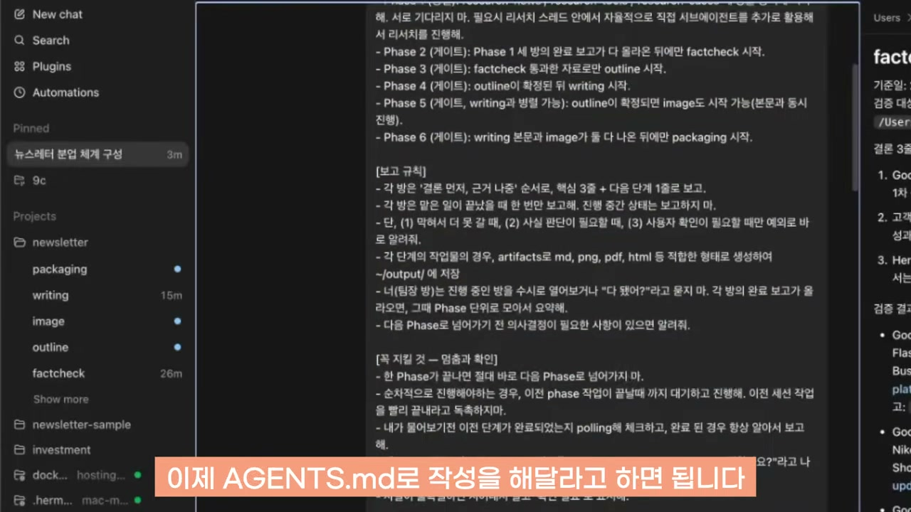

해법은 이 프로세스 전체를 **AGENTS.md** 파일로 박아 두는 것이다. 뉴스레터 폴더에 agents.md를 만들고 프로세스를 넣어 두면, 다음부터는 "이번 주 뉴스레터 생성해 보자" 한 줄이면 된다. 메인 방이 알아서 단계별로 진행한다. 운영 규칙을 매번 말로 푸는 대신, 코드처럼 저장해 재사용하는 것이다.

품질을 더 조이고 싶다면 한 겹 더 있다. 앞서 "세부 프롬프트는 코덱스가 알아서 생성해 준다"고 했던 그 지점 — 편리하지만, 뒤집으면 세부 통제권을 코덱스에 넘긴다는 뜻이기도 하다. 이미지 원칙 같은 세부를 일관되게 가져가고 싶다면, 각 작업을 **스킬(skill)**로 만들어 해당 스레드 방과 매칭하면 된다. 이미지 방은 이미지 스킬로, 라이팅 방은 라이팅 스킬로. 그러면 담당자들이 더 일관된 결과물을 낸다. 편의(코덱스가 알아서)와 통제(내가 스킬로 못 박기) 사이에서, 필요한 만큼만 통제를 되찾는 설계다.

## 그래서, 공짜는 아니다 — 한계 두 가지

화자는 마지막에 한계를 솔직히 늘어놓는다. 유용하다는 말로 끝내지 않는다.

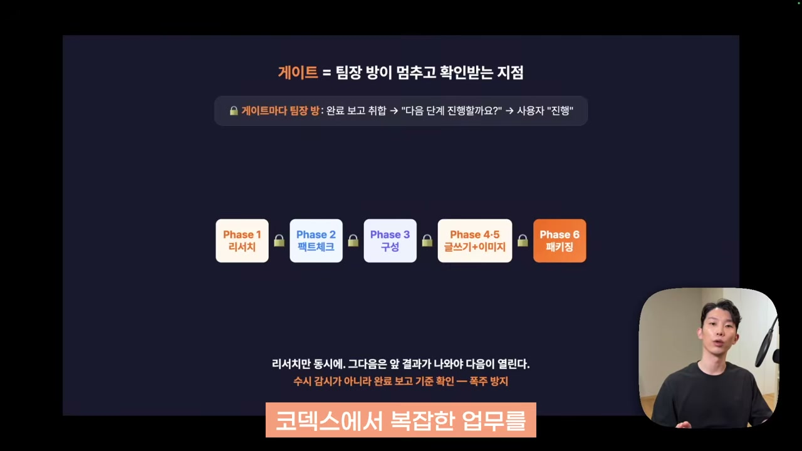

**첫째, 아직 모든 환경에서 안정적이지 않다.** 화자가 직접 겪은 일이다. 원하지 않았는데 작업이 백그라운드 세션으로 돌아가 버리기도 했고, 모바일에서 스레드 생성을 요청했더니 제대로 안 되고 에러가 났다. 출시된 지 얼마 안 된 기능이라, 예상 못 한 방식으로 스레드가 관리될 수 있다. 버그는 나중에 고쳐지겠지만, 지금은 감안하고 써야 한다는 정직한 경고다.

**둘째, 불필요한 토큰이 샌다.** 폴링이 바로 그 원인이다. 팀장 방이 하위 스레드를 계속 들여다보는 동안 토큰이 꾸준히 발생한다. 진행 상황을 출력하지 말라고 줄일 수는 있지만, 폴링 자체의 비용은 남는다. 그래서 최소한의 토큰으로 보고하도록 설정을 고민하는 게 중요하다.

이 두 번째 한계를 화자는 멋진 비유로 닫는다. 이건 **조직에서 관리자를 한 명 채용하는 것과 비슷한 비용**이라고. 관리자가 있으면 한 명하고만 소통하면 되니 커뮤니케이션 비용은 줄지만, 관리자 그 자체가 새로운 위계와 비용을 만든다. 그러니 모든 일을 이 구조로 짜는 건 비효율이다.

결론은 처음의 세 질문으로 되돌아온다. 업무 특성이 갈려 있고, 여러 단계를 함께 매니지해야 하는 상황 — 그 장점이 추가 토큰 비용보다 분명히 클 때만 쓰라는 것.

## 한 줄로 남는 것

복잡한 업무를 스레드로 쪼개 병렬로 돌리고, 메인 스레드 하나에서 전체 프로세스를 관리한다. 이게 이번 코덱스 업데이트가 열어 준 새 작업 방식이다.

기술적으로 보면 '스레드 안에서 스레드를 만들고 지시하는 기능' 하나가 추가됐을 뿐이다. 하지만 그 한 기능이 코덱스를 도구에서 조직으로 바꾼다. 사람은 팀장 하나만 상대하고, 실무는 분리된 방에서 굴러가며, 기록은 방마다 남고, 프로세스는 파일로 재사용된다.

다만 조직에는 관리 비용이 따른다. 빠르려고 무작정 나누면 토큰과 불안정성이라는 대가가 돌아온다. 그래서 이 영상이 끝까지 붙잡는 메시지는 도구 자랑이 아니라 판단이다 — **나눌 가치가 있을 때만 나눠라.**
