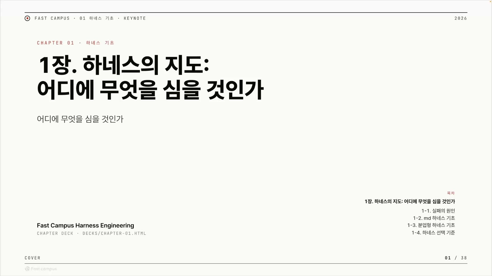
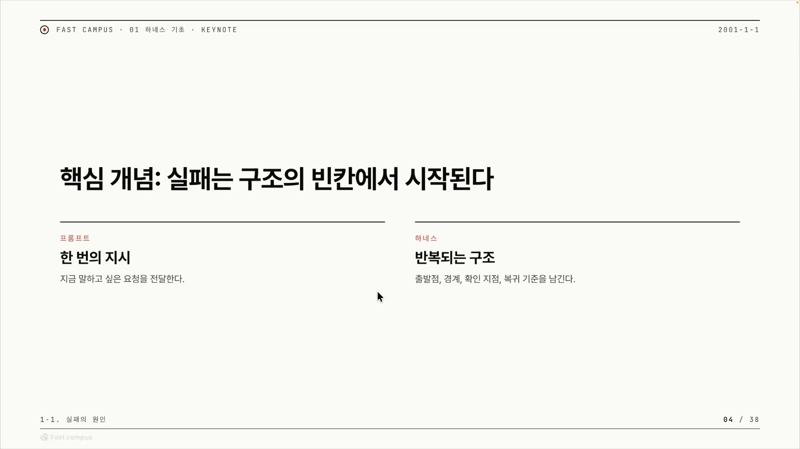

AI에게 일을 시켜본 사람이라면 한 번쯤 겪는 장면이 있다. 처음엔 신기하다. 짧은 작업은 척척 해낸다. 그런데 조금 큰 일을 맡기면, 한참 돌아간 결과물을 받아 들고 한숨을 쉰다. "어? 이게 아닌데." 고쳐달라고 다시 채팅을 친다. 또 아쉽다. 다시 친다. 그러다 결국 이런 말이 나온다. "차라리 내가 하는 게 빠르겠다."

이 글은 그 장면을 모델 탓이 아니라 구조 탓으로 다시 보는 눈을 만드는 데서 출발한다. 패스트캠퍼스 "하네스 엔지니어링" 강의의 1장 1강을 정리한 것으로, 강사는 Jeb(젭)이라는 회사의 테크리드이자 Ouroboros(우로보로스)라는 하네스를 만든 오픈소스 메인테이너 이재규다. 그가 자기를 한 문장으로 소개하는 방식이 이 강의 전체의 관점을 그대로 보여준다. "비결정적(non-deterministic)인 것을 결정적(deterministic)으로 바꾸는 걸 좋아하는 사람." 이 한 줄이 곧 하네스 엔지니어링의 정의이기도 하다.

1장의 제목은 "하네스의 지도: 어디에 무엇을 심을 것인가"다. 하네스를 곧장 만들기 전에, 그것을 어떻게 도입해서 어떤 결과물을 받을 것인지부터 전체 그림을 먼저 그려보자는 뜻이다. 그 지도의 첫 칸이 바로 이 질문이다. 우리는 여태까지 왜 AI를 쓰면서 실패했는가?

## 먼저, 용어 몇 개

본론으로 들어가기 전에 이 글 내내 쓰일 말부터 맞춰둔다.

- **비결정적(non-deterministic)**: 같은 걸 시켜도 결과가 매번 달라지는 성질. LLM의 기본 성격이다.
- **결정적(deterministic)**: 같은 입력이면 같은 결과가 나오는 것. 예측하고 신뢰할 수 있다.
- **하네스(harness)**: 원래는 말에 씌우는 마구, 즉 통제 장치를 뜻한다. 여기서는 AI 에이전트를 감싸서 통제하는 구조나 장치를 가리킨다. 클로드 코드나 코덱스 같은 도구가 하네스의 한 형태다.
- **암묵지**: 말로 또렷이 옮기지는 못하지만 머릿속에는 분명히 있는 판단. "이거 괜찮은 것 같은데?" 하고 느낄 때 그 감각.

하네스 엔지니어링을 한 줄로 줄이면, 매번 다른 AI의 결과를 예측 가능하게 길들이는 구조를 짜는 일이다. 비결정적인 것을 결정적으로 바꾼다는 그 한 문장이 여기서 다시 등장한다.

## 실패는 모델 탓이 아니다

AI 작업이 어긋날 때 가장 흔히 나오는 진단은 이렇다. "프론티어 모델을 썼으면 됐을 텐데." 프론티어 모델이란 그 시점에서 가장 성능 좋은 최신 모델을 말한다. 더 많은 파라미터로 더 좋은 데이터를 학습했으니 더 좋은 답을 낸다는 것, 그 자체는 맞는 말이다.

다만 강사는 시야를 모델 문제에서 구조 문제로 돌리자고 한다. 진짜 던져야 할 질문은 "프론티어 모델이 아니더라도 잘 되게 하려면 어떤 구조가 필요한가"다. 모델을 더 키우는 게 아니라 구조를 짜는 쪽으로 문제를 옮기는 것, 이게 이 강의가 처음부터 끝까지 붙들고 가는 방향이다.

그렇다면 실패의 뿌리는 어디에 있나. 강사의 답은 인간의 암묵지를 제대로 꺼내지 못한 데 있다.

내가 디자인 시안을 두 개 놓고 볼 때 "1번이 더 낫다"는 건 즉시 안다. 그런데 왜 나은지를 글로 다 적으라면 막힌다. 그 막히는 지점이 암묵지다. AI는 내 머릿속을 들여다볼 수 없으니, 내가 적지 않은 판단 기준은 그냥 알아서 추측한다. 추측이 빗나가면 결과가 망가지고, 나는 다시 고쳐달라 하고, 그걸 지켜보는 데 비용이 든다. 강사는 이걸 감시 비용이라 부른다. AI로 생산성이 확 오를 줄 알았는데 오히려 결과를 검수하고 다시 시키는 비용이 쌓여서, "내가 하는 게 빠르다"는 말이 나오는 것이다.

그러니 핵심 과제는 분명하다. 머릿속에서 느끼는 것과, 그걸 타이핑해서 AI에게 건네는 것 사이의 간극을 어떻게 메우느냐. 해법은 모델을 더 좋은 걸로 바꾸는 게 아니라, 내 암묵지를 미리 구조로 박아두는 것이다.

## 수치로 못 재는 일일수록 하네스가 필요하다

이 관점을 더 밀고 가면 일의 종류를 둘로 나눌 수 있다. 강사는 4월 25일 오모콘(AMO Conf)에서 Ouroboros 메인테이너 나정환이 한 발표를 인용한다. "non-verifiable(검증 불가능)한 것은 AI가 해결하고, 그걸 AI에게 위임하려면 하네스가 꼭 필요하다." 강사는 이 말에 큰 울림을 받았다고 한다.

검증 가능한 일과 검증 불가능한 일은 AI에게 난이도가 전혀 다르다.

| 구분 | 뜻 | AI에게는 |
|---|---|---|
| **verifiable** | 검증 가능하고 이미 수치화됨. 성공 기준과 조건이 명확 | 쉽다. 성공 조건을 알기에 클로드 코드, 코덱스로도 잘 된다 |
| **non-verifiable** | 정성적이고 수치화되지 않음. "이게 맞나"를 숫자로 못 잰다 | 어렵다. 사람조차 느낌으로는 알지만 타이핑이 안 된다 |

검증 가능하고 이미 숫자로 떨어지는 일은 AI가 성공 기준을 확실히 알기 때문에 비교적 쉽게 해낸다. 반대로 정성적이고 수치화되지 않은 일은 AI가 가장 약한 영역이다. 내 머릿속에선 뭐가 맞고 틀린지 느껴지지만, 그걸 어떻게 옮겨 적느냐가 또 문제이기 때문이다.

흥미로운 건 강사가 든 예시가 바로 이 강의의 발표 자료 자체라는 점이다. "좋은 발표 자료"는 성공을 수치로 낼 수 없는 일, 즉 non-verifiable한 일이다. 그래서 강사는 이 자료를 손으로 한 장 한 장 만들지 않고 Ouroboros로 만들었다고 한다. 방식은 이렇다.

1. 원하는 커리큘럼, 키워드, 내용, 실습이 각 챕터와 소분류에 무엇이 들어가야 하는지를 먼저 인터뷰 형태로 잘 정의한다.
2. 그 커리큘럼을 기준 삼아 검증하는 에이전트들을 둔다. 흐름이 안 깨졌는지, 키워드가 잘 들어갔는지, 실습이 잘 녹아 있는지를 본다.
3. 흐름이 깨지지 않을 때까지 다시 만들라는 계약 조건을 건다.

"좋은 발표 자료 만들어줘"는 점수가 안 나오는 일이라, 그냥 시키면 AI가 제멋대로 만든다. 강사가 한 일은 합격 기준을 사람이 미리 박은 것이다. 커리큘럼이라는 기준표를 만들고, 흐름과 키워드를 체크하는 검사원을 붙이고, 통과할 때까지 다시라는 규칙을 걸었다. 수치가 없던 일에 사람이 만든 합격선이 생긴 셈이다. 정리하면 하네스는 검증할 기준, 검증할 에이전트, 그리고 통과할 때까지라는 계약, 이 세 가지로 이뤄진다.

## 10분은 되는데 1시간은 망하는 이유

클로드 코드, 코덱스, 오픈코드 같은 하네스들은 10분쯤 걸리는 작업은 아주 잘 해준다. 문제는 1시간 이상 돌렸을 때다. 결과물이 잔뜩 쌓인 뒤 검수해 보면 마음에 안 드는 경우가 생긴다.

그럼 1시간 넘는 작업은 왜 무너질까. 강사는 이게 프롬프트 문제가 아니라고 못 박는다. 1시간치, 10시간치 분량의 지시를 한 번에 다 적어주면, 그 컨텍스트가 너무 길어지면서 AI는 어차피 앞의 지시사항을 까먹을 수밖에 없다. 여기서 컨텍스트란 AI가 한 번에 들고 있는 대화와 지시의 총량이다. 한계가 있고, 길어질수록 앞쪽 지시의 영향력이 흐려진다.

AI에게 "이거 하고, 저거 하고, 그다음 이렇게…"를 1시간치로 한 번에 다 적어주면, 작업이 진행될수록 대화가 길어지고, 맨 앞에 적어둔 규칙은 뒤로 갈수록 묻혀서 AI가 사실상 잊어버린다. 그래서 끝에 가면 처음 시킨 것과 어긋난 결과가 나온다. 같은 도구라도 컨텍스트가 짧은 10분 작업은 통과하고, 컨텍스트가 길어진 1시간 작업은 그 길이 때문에 붕괴하는 것이다.

해법은 다시 한번 모델이 아니다. 작업을 잘게 끊고 규칙을 매번 다시 세워주는 구조다. 프롬프트를 그렇게 길게 주지 않으려면 구조가 필요한데, 그 구조가 없으니까 긴 작업을 제대로 못 하는 것이다.

## 긴 작업이 남겨야 하는 네 가지

작업이 길고 커지면 사람이 매번 옆에서 챙겨줄 수 없는 것들이 생긴다. 그래서 하네스가 사람 대신 네 가지를 고정해 둔다. 출발점, 경계, 확인 지점, 복귀 기준이다.

| 요소 | 무엇인가 | 안 해주면 |
|---|---|---|
| **출발점** | 매번 똑같이 시작하는 지점을 고정. 예: "당신은 시니어 개발자입니다" 같은 시작 프롬프트 | 그 문장을 매번 직접 쳐야 한다 |
| **경계** | 하지 말아야 할 것, 주의할 것, 책임이 넘어가는 선을 정함 | AI가 선을 넘는 행동을 반복한다 |
| **확인 지점** | "무엇을 봐야 잘 됐다고 할 수 있나"의 기준 | 잘 됐는지 판단할 수 없다 |
| **복귀 기준** | 실패하면 처음이 아니라 실패 직전 단계로 돌아가 거기서 다시 시작 | 매번 처음부터 다시 해서 토큰과 시간을 낭비한다 |

하나씩 풀어 보면 이렇다. "당신은 시니어 개발자입니다" 같은 출발 프롬프트는, 하네스가 없으면 작업을 시작할 때마다 직접 쳐야 한다. 출발점을 고정한다는 건 이 시작점을 한 번 박아두고 매번 안 치게 하는 것이다. AI가 하지 말아야 할 것과 주의할 것, 책임이 넘어가는 지점도 잡아줘야 하는데, 이걸 매번 프롬프트로 칠 수는 없다. 그래서 경계가 필요하다. "이게 잘 됐다"를 어떤 걸 봐야 알 수 있는지, 그 기준이 확인 지점이다. 그리고 어디선가 실패했을 때, 처음부터가 아니라 실패하기 전 단계까지만 돌아가 거기서 다시 돌린다. 이게 복귀다. 이렇게 하면 처음부터 다시 만드는 것보다 토큰과 시간, 그리고 감시 비용까지 아낄 수 있다.

게임의 세이브 포인트를 떠올리면 네 가지가 한꺼번에 잡힌다. 시작 위치를 정해두고(출발점), 못 가는 구역을 막아두고(경계), 통과 조건을 정해두고(확인 지점), 죽으면 마지막 세이브에서 부활한다(복귀). AI 작업도 이 네 개를 박아두면, 1시간짜리 작업이 중간에 어긋나도 처음으로 돌아가지 않고 망가진 지점만 복구한다.

## 프롬프트 vs 하네스, 한 번의 지시와 반복되는 구조

방금 본 네 가지를 "남기느냐 마느냐"가 곧 프롬프트와 하네스를 가르는 선이다. 둘의 가장 큰 차이는 한 번의 지시냐, 반복되는 구조냐에 있다.

| | 프롬프트 | 하네스 |
|---|---|---|
| 본질 | 한 번의 지시 (원샷) | 반복되는 구조 |
| 방식 | 지금 하고 싶은 요청을 딱 전달 | 작업을 잘게 쪼개고 여러 세션을 반복 |
| 남기는 것 | 없음, 그때뿐 | 출발점, 경계, 확인 지점, 복귀 기준 |
| 시작 | 출발 프롬프트를 매번 침 | 출발점을 고정 |
| 실패 시 | 처음부터 다시 | 실패 직전 단계로 복귀 |

프롬프트는 한 번의 지시, 곧 원샷이다. 요청을 전달하면, 그게 PRD(제품 요구사항 문서) 같은 것일 수도 있는데, AI가 그걸 받아 스스로 계획을 짜고 작업한다. 하네스는 이걸 잘게 쪼개고, 반복되는 구조로 처음 원했던 목표를 이루기 위해 여러 세션을 돌린다. 여기서 세션이란 AI와의 한 번의 작업 단위, 대화 흐름 하나를 말한다. 하네스는 그 세션을 여러 번 반복한다.

택배와 내비게이션의 차이로 보면 감이 온다. 프롬프트는 택배 기사에게 주소를 한 번 불러주고 끝이다. 잘 가면 다행이고, 못 찾으면 그걸로 끝이다. 하네스는 내비게이션이다. 출발지를 저장하고, 진입 금지 구역을 알고, 경유지마다 여기 맞나 확인하고, 길을 잘못 들면 마지막 갈림길로 되돌린다. 같은 목적지라도 반복되는 구조가 있으면 1시간짜리 길도 끝까지 도착한다. 그래서 하네스가 아끼는 비용이 세 가지로 정리된다. 토큰, 시간, 그리고 감시 비용이다.

## 실패는 구조의 빈칸에서 시작된다

실패는 구조의 빈칸에서 시작된다. 강의의 핵심 슬라이드가 내건 명제이자, 1장 전체를 관통하는 한 줄이다.

말로 꺼내지 않은 판단인 암묵지가 요구사항에 빈칸을 남기고, 그 빈칸을 LLM이 추측으로 채우다가 추측이 어긋나면서 결과물이 망가진다. 아래 흐름도가 그 네 단계다.

<!-- IMG 🎨 암묵지 → 요구사항의 빈칸 → LLM이 추측으로 채움 → 추측 어긋남 → 결과물 붕괴, 네 단계로 내려가는 인과 흐름도 -->

요리 레시피에 "소금 적당히"라고만 적으면, 만드는 사람마다 짠맛이 다 달라진다. '적당히'가 빈칸이고, 받는 사람이 알아서 추측한다. AI도 똑같다. 내가 "보고서 잘 써줘"라고 하면 '잘'이라는 빈칸을 AI가 자기 멋대로 추측해 채운다. 실패는 AI의 능력 문제가 아니라 내가 빈칸을 남긴 것이 원인이다. 빈칸을 만든 건 AI가 아니라 나이고, AI는 그 빈칸을 추측했을 뿐이다.

그러니 강사가 1장의 결론으로 내놓는 문장은 이렇게 읽힌다. 지금까지 AI에게 작업을 시키며 실패한 이유는 우리가 구조의 빈칸을 만들어놨다는 것. 그리고 그 빈칸을 앞으로 채워나가겠다는 것.

앞서 본 출발점, 경계, 확인 지점, 복귀 기준은 결국 이 빈칸을 미리 메우는 도구다. 왜 실패하는가의 답이 "빈칸"이고, 무엇으로 메우는가의 답이 그 네 가지이며, 프롬프트와 무엇이 다른가의 답이 "반복되는 구조"였다. 세 갈래가 한 자리에서 만난다. 하네스의 지도는 바로 이 빈칸들을 어디에 무엇으로 채워 넣을지 그리는 일이다.
