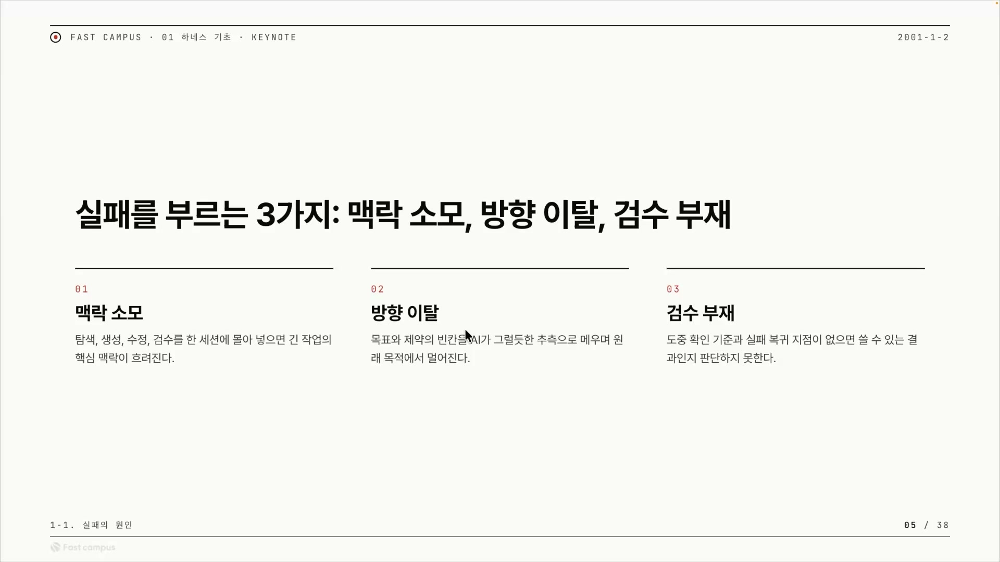
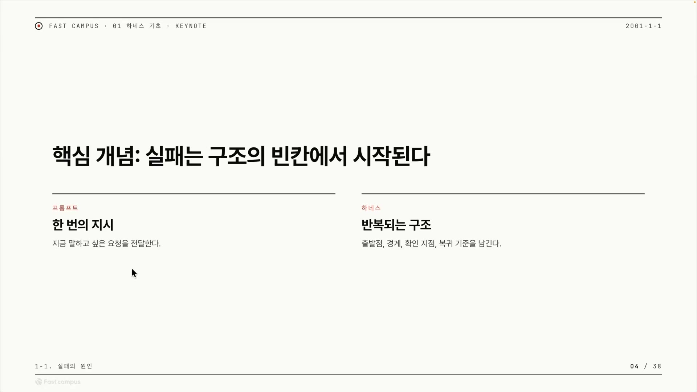
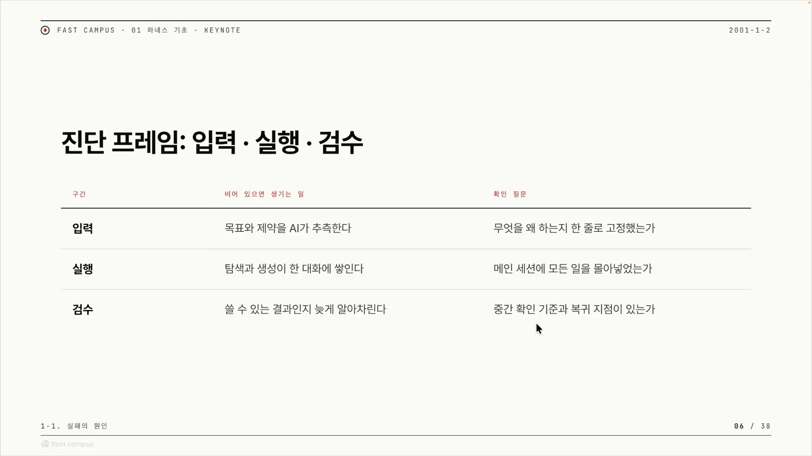
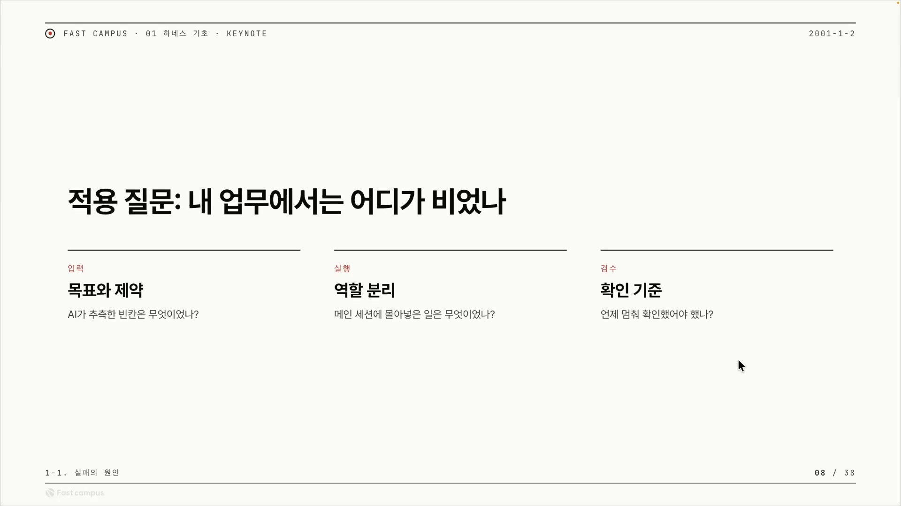
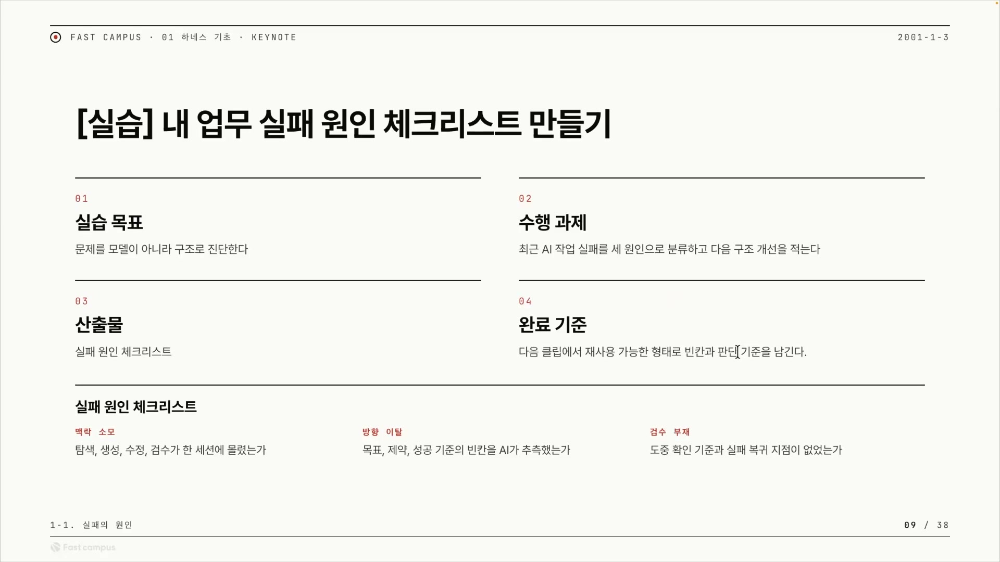

AI에게 한 시간짜리 큰 작업을 맡겼다가 결과물을 보고 한숨을 쉰 적이 있다면, 그 실패는 보통 "모델이 멍청해서"로 정리된다. 강사는 그 진단을 거부한다. 큰 작업이 무너지는 원인은 딱 세 가지뿐이고, 셋 다 모델의 머리가 아니라 일을 시키는 구조의 빈칸에서 나온다는 것이다.

세 가지는 맥락 소모, 방향 이탈, 검수 부재다.

이 셋을 기억해 두면 나머지는 전부 따라온다. 실패가 셋으로 갈린다는 말은, 그 셋을 거꾸로 메우는 장치만 만들면 큰 작업도 무너지지 않는다는 뜻이기도 하다. 강사는 그 장치를 하네스(harness)라고 부른다. AI에게 일을 시킬 때 지시, 역할 분리, 검수 절차를 미리 정해 감싸두는 작업 틀이다. 그래서 이 글의 질문은 하나로 좁혀진다. 빈칸을 어떻게 채울 것인가.

## 첫 번째 빈칸 — 맥락 소모

맥락 소모는 한 대화창(세션)에 너무 많은 일을 쌓았을 때 일어난다. 강사가 든 시나리오를 그대로 따라가 보자. 이미 어떤 웹사이트(프로젝트)가 하나 있는 상황이다. 거기에 회원가입 기능을 붙이려고, 먼저 AI에게 관련 파일들을 찾으라고 시킨다. AI가 프로젝트를 탐색해서 파일을 찾아온다. 그 파일을 기반으로 회원가입 기능을 만들라고 한다. 만들고 보니 문제가 있어서 수정을 시킨다. 검수까지 같은 창에서 한다.

문제는 이 지점부터다. 대화가 길어지면서 AI는 자기가 원래 회원가입을 하라던 거였는지, 다른 작업이었는지를 까먹기 시작한다. 그러다 회원가입을 만들던 중에 슬그머니 어드민 기능으로 빠지고, 더 가면 시키지도 않은 게시판 글쓰기 기능까지 혼자 만들어버린다.

왜 이렇게 되는가. LLM은 메인 세션에 쌓인 컨텍스트 전체를 보고 다음 토큰을 추론한다. 그런데 한 창에 탐색, 생성, 수정, 검수가 다 들어차면 무엇을 해야 하는지가 흐려진다. 강사는 이 상태를 오염(contamination)됐다고 부른다. 지금 이 LLM이 여태까지 무엇을 했는지 정확히 알 수 없는 상태다.

오염의 진짜 무서운 점은 그다음이다. 한 번 더러워진 창은 다른 걸 새로 시켜도 그 찌꺼기가 계속 따라붙는다. 강사의 표현으로는 이렇다.

> LLM 특성상 모든 컨텍스트에 가중치를 두고 다음 토큰을 수놓을 수밖에 없는 상황이 생겨요.

도움이 안 되는 맥락까지 LLM은 어쩔 수 없이 끌고 가는 셈이다. 그래서 강사는 한 메인 세션의 컨텍스트를 끝까지 다 쓰는 이 맥락 소모야말로, 세 원인 중에서 가장 크고 위험한 것이라고 본다.

해법은 거꾸로다. 한 창을 끝까지 쓰지 않는다. 강사가 자기 작업에서 실제로 지키는 기준이 인상적이다. 요즘 컨텍스트 창에 100만 토큰(원 밀리언)이 들어오는데, 자신은 그중 20% 이상을 쓰지 않는다는 것이다. 대신 작업을 쪼개 다른 세션에서 진행하고, 여러 세션을 병렬로 켜서 동시에 돌린다. 큰 창 하나에 모든 일을 모아두지 않는 것, 그게 첫 번째 빈칸을 메우는 방식이다.

## 두 번째 빈칸 — 방향 이탈

두 번째 원인은 내 머릿속에는 있는데 AI에게는 없는 정보에서 시작된다. 강사는 이걸 인간의 암묵지라고 부른다. 말로 꺼내지 않았을 뿐 내 안에는 분명히 있는 기준, 취향, 맥락이다. 요구사항 문서(PRD)를 제대로 만들어주지 않으면 그 암묵지는 AI에게 전달되지 않고, 거기서 갭(빈칸)이 생긴다.

여기서 LLM의 행동이 문제를 키운다. 갭을 만났을 때 LLM은 멈추지 않는다. 모르겠으니 물어봐 주면 좋겠지만, 그러지 않고 그 빈칸을 평균적이고 그럴듯한 추측으로 채우기 시작한다. "정해지지 않았으니까 이런 식으로 구현해야겠다"라며 세상에서 제일 무난한 답으로 메운다. 내가 원하던 건 분명 내 머릿속에 있었는데, 나온 결과물은 그것과 전혀 다른 모양이 된다.

그래서 필요한 건 암묵지를 모호함이 사라질 때까지 꺼내주는 구조다. 그런 구조가 없으면 LLM은 추측할 수밖에 없다. 이 대목에서 강사는 한 가지 흔한 믿음을 정면으로 부순다. 프롬프트 한 방이면 되지 않느냐는 기대다.

프롬프트 원샷이 완벽할까. 강사의 답은 단호하다. 절대 아니다. 한 번의 지시로는 우리가 원하는 것을 만들어내기 어렵다. 잘 쓴 프롬프트 한 줄은 지금 말하고 싶은 요청을 전달할 뿐이고, 그 한 줄로는 출발점과 경계와 확인 지점과 복귀 기준 같은 빈칸이 메워지지 않는다. 그래서 한 방 프롬프트가 아니라, AI가 추측할 수 없게 만드는 구조를 잘 짜야 한다는 결론으로 이어진다.

## 세 번째 빈칸 — 검수 부재

세 번째는 중간에 잘하고 있는지를 보여주는 기준이 없을 때 생긴다. 도중 확인 기준이 없으면 어떻게 되는가. 다 만들어질 때까지 가만히 기다리고 있다가, 결과물을 보고 나서야 "어, 잘못했었네" 하게 된다. 이걸 보통 슬로우 피드백 루프라고 한다. 잘못을 가장 늦게, 끝나고서야 발견하는 구조다.

늦게 발견하는 것만 문제가 아니다. 의도에서 벗어난 결과물(발산)이 너무 많아지면, 어디서부터 어디를 고쳐야 할지 자체를 당황하게 된다. 그래서 실패 복귀 지점이 필요하다. 어디서부터 드리프트됐고 어디서부터 잘못됐는지를 알아야, 그 전 단계로 돌아가 다시 만들 수 있다. 복귀 지점이 없으면 "잘못했어, 고쳐봐"라고 해도 이미 파일이 너무 많아져서 AI가 디버깅하는 데만 시간이 오래 걸리고 토큰도 크게 소모된다. 그렇다고 다 지우고 처음부터 다시 만들라고 하면 또 엄청난 토큰이 들어간다.

여기에 강사가 던지는 핵심 통찰이 하나 더 붙는다. AI는 자기가 만든 결과물을 과신한다는 것이다.

> 우리도 자기가 쓴 글 보면 좀 잘 쓴 것 같고, 내가 그린 그림 보면 좀 잘 그린 것 같잖아요. 근데 이것들을 LLM에도 똑같이 적용해 볼 수 있어요.

LLM도 자기가 쓴(write) 코드라 그 맥락이 남아 있으니, 스스로 자신감(confidence)이 있다고 여긴다. 그런데 집요하게 캐물으면 태도가 바뀐다. "너 진짜 자신 있어?", "이 구조가 정말 우아해?"라고 물으면, 사실은 자신 없다고 실토한다. 만든 당사자에게 평가를 맡기면 후한 점수가 나오는 게 당연하다는 얘기다.

그래서 검수는 만든 놈이 아니라 따로 둔 검수자가 해야 한다. 강사는 자신의 우로보로스(Ouroboros)에서 코드나 결과물을 생성한 뒤 검수자를 따로 뒀던 사례를 든다. 이 검수자가 제대로 완수했는지를 판정해서, 미흡하면 다시 시키거나, 페일(fail) 처리해서 아예 다른 세션이 그 일을 대신 받아 처리하게 했다. 가장 객관적인 방법은 결과물을 컨텍스트로 넘기고, 그 결과물만 가지고 아무런 사전 맥락 없이 평가하게 하는 것이다. 만든 사정을 전혀 모르는 제3자 세션에게 결과물만 던져 채점시키면, 자기가 쓴 글을 자기가 칭찬하는 함정에서 벗어난 평가를 얻는다.

## 셋을 뒤집으면 하네스가 된다

여기까지가 진단이다. 강사의 영리한 점은 이 세 가지 병이 그대로 처방이 된다는 데 있다. 실패 원인 셋을 거꾸로 뒤집으면 하네스를 어떻게 만들어야 하는지가 나온다. 하네스는 입력, 실행, 검수 세 칸으로 짠다.

표의 세 행이 그대로 처방이다.

| 구간 | 비어 있으면 생기는 일 | 메우는 방법 | 막는 실패 |
|---|---|---|---|
| 입력 | 목표와 제약을 AI가 추측한다 | 목표·기준을 빈칸 없이 넣어 추측을 차단 | 방향 이탈 |
| 실행 | 탐색·생성이 한 대화에 쌓인다 | 메인 세션에 모든 일을 모으지 않고 분리·병렬 | 맥락 소모 |
| 검수 | 쓸 수 있는 결과인지 늦게 알아차린다 | 중간 확인 기준과 복귀 지점을 둔다 | 검수 부재 |

입력은 AI가 추측하지 못하게 만드는 칸이다. 실행은 여러 작업이 한 세션에 쌓이는 것을 피하는 칸이다. 검수는 결과를 검증 가능하게(verifiable) 만들어, 잘하고 있는지 체크하고 어디서부터 드리프트돼 돌아갈 수 있는지를 보는 칸이다. 실패 셋과 해결 셋이 정확히 1:1로 맞물린다. 강사의 마무리도 여기에 있다. 결국 하네스 엔지니어링은 이 세 가지를 잘 잡는 것이 핵심이다.

## "게시판 만들어줘"가 무너지는 흐름

세 원인이 따로 노는 게 아니라 한 작업에서 동시에 터진다는 걸, 강사는 한 줄짜리 요청 하나로 보여준다. "게시판 만들어줘."

엄청 간단한 요청이지만 목표와 완료 기준이 애매하다. 빈칸이 만들어진 것이다. AI는 무슨 게시판을 만들지 추측하다가 일단 평범한 게시판 하나를 만든다. 강사의 속내는 따로 있었다. 사실은 야구 게시판을 원했다. 그런데 야구를 말하지 않았다. 내 머릿속에만 있는 걸 AI가 알 도리가 없다. 시작부터 방향 이탈이 깔린 것이다.

중간에서는 자료 탐색, 초안, 수정 요구가 한 메인 세션에 다 들어가는 순간부터 컨텍스트가 오염되고, AI는 자기가 지금 뭘 하는지 판단할 수 없는 상태가 된다. 맥락 소모다. 그리고 끝에서는 당연히 내가 원했던 것과 다른 결과가 나온다. "다시 만들어줘"부터 시작인데, 어디로 돌아가야 하는지 자체가 없다. 검수 부재다.

그렇게 한 줄 요청에 실패 세 종류가 동시에 들어 있다가, 끝에 가서 "AI 영 별로다"라는 말로 정리된다. 강사가 짚는 진짜 정체는 다르다. 모델이 별로였던 게 아니라, 목표를 안 줬고, 한 창에 다 쌓았고, 복귀 지점이 없었던 것이다.

## 그래서 내 업무에서는 어디가 비었나

이 세 가지는 남의 이야기로 끝나면 의미가 없다. 강사는 같은 잣대를 자기 점검용 질문 셋으로 바꿔 던진다.

- 목표와 제약을 잘 줬는가 — AI가 추측한 빈칸은 무엇이었나 (방향 이탈)
- 많은 일을 한 세션에 다 몰아넣으려 했는가 — 메인 세션에 몰아넣은 일은 무엇이었나 (맥락 소모)
- 언제 멈춰 확인했어야 했나 — 중간 과정이 잘 가는지 볼 수 있었나 (검수 부재)

자동화를 시도해 본 적이 있든 이제 해보려 하든, 지금 하는 업무에서 어떻게 자동화할지를 이 세 질문으로 따져보라는 것이다. 실패했던 사람은 모델 탓을 하기 전에 이 셋 중 어디가 비었는지부터 보면 된다.

그리고 이 점검은 다음 강의 실습으로 이어진다. 강사가 강조하는 실습의 목표가 중요하다. "모델이 좋지 않아서 실패했다"가 아니라, 우리가 그 규칙을 한번 문서화해보는 것이다.

할 일은 단순하다. 최근의 AI 작업 실패를 세 원인으로 분류하고, 다음엔 어떻게 할지를 적는다. 그러면 손에 남는 것이 실패 원인 체크리스트다.

- 맥락 소모 — 탐색·생성·수정·검수가 한 세션에 몰렸는가
- 방향 이탈 — 목표·제약·성공 기준의 빈칸을 AI가 추측했는가
- 검수 부재 — 도중 확인 기준과 실패 복귀 지점이 없었는가

이 체크리스트는 다음에 배울 마크다운 하네스의 기초 실습에서 재료로 쓰인다. 결국 이 강의가 남기는 한 줄은 이것이다. AI가 큰 작업에서 실패하는 건 모델이 멍청해서가 아니라, 입력·실행·검수 세 칸 중 어딘가가 비어 있어서다. 빈칸을 셋으로 좁혀 보는 순간, "AI 영 별로다"라는 막연한 한숨은 "여기를 안 채웠구나"라는 구체적인 진단으로 바뀐다.
