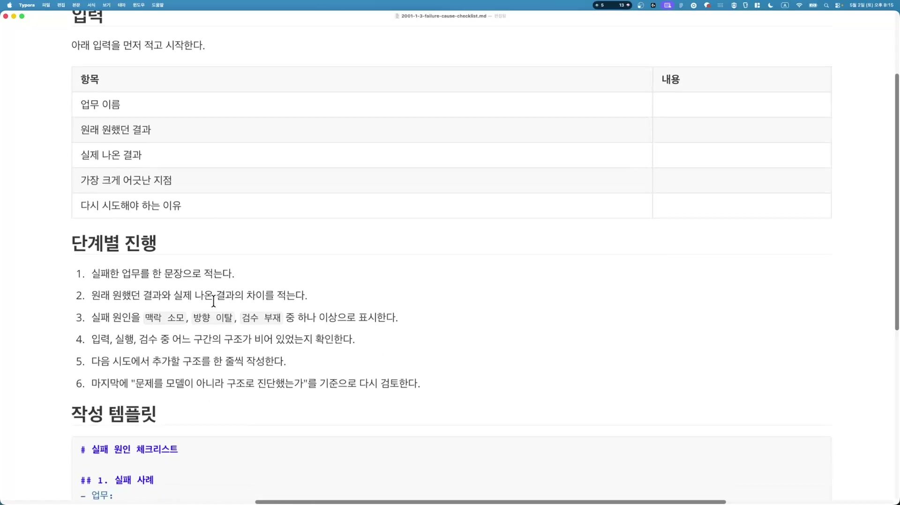
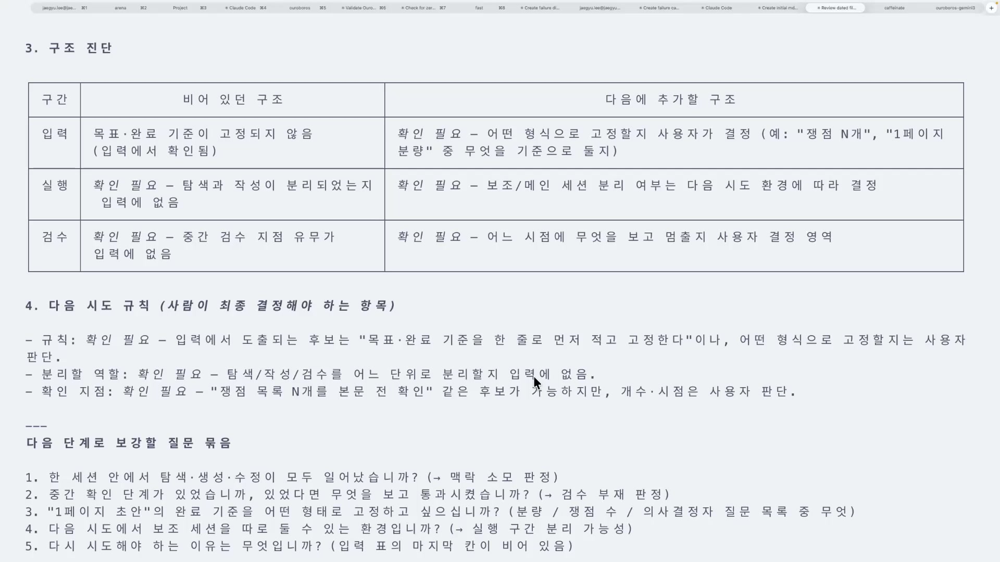
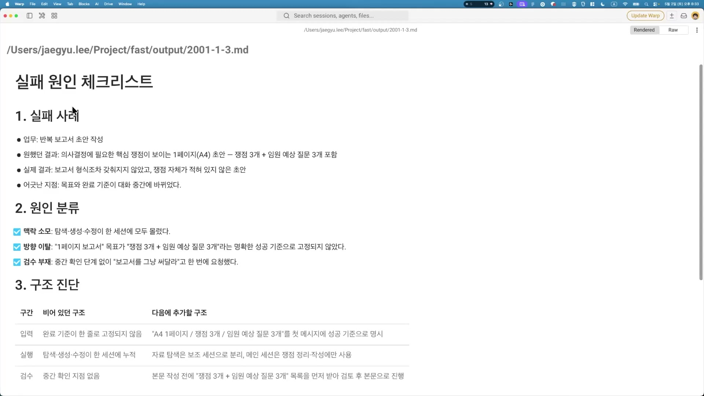

AI에게 일을 시켰는데 결과가 엉망으로 나왔을 때, 우리 머릿속에 가장 먼저 떠오르는 문장은 보통 이렇다. "이 모델 멍청하네." 그 다음 손가락은 자동으로 움직인다. "아니, 그거 말고." 한국 사람들이 클로드한테 유난히 많이 한다는 그 말, "아니 그거 아니야."

이 글은 그 반사신경을 의심하는 데서 시작한다. 강사가 클립 내내 붙들고 가는 생각은 하나다. 모델이 잘못된 게 아니라, 내가 빠뜨린 구조의 빈칸이 문제다. 이건 위로하려는 말이 아니다. 책임을 모델에서 나에게로 옮기면, 비로소 고칠 수 있는 게 손에 잡힌다는 뜻이다. 모델은 내가 못 고친다. 하지만 내가 안 적어준 칸은 내가 채울 수 있다. 그래서 이 실습의 목표는 단순하다. 내 업무가 AI에게서 왜 망했는지를, 모델 탓이 아니라 "구조의 어느 칸이 비어 있었는가"의 언어로 다시 적어보는 것. 그렇게 적어낸 결과물이 바로 **실패 원인 체크리스트**다.

## "아니야"라고 치는 순간이 곧 어긋난 순간이다

먼저 이 실습이 무엇을 하는지 짚자. AI 작업이 망하는 원인은 크게 셋으로 나뉜다. 맥락 소모, 방향 이탈, 검수 부재. 이번 클립은 이 세 원인을 추상적인 개념으로 두지 않고 내 실제 업무 하나에 손으로 대입해, 종이 위에서 진단표를 만드는 실습이다.

강사가 "구조의 빈칸"이라는 말을 어떻게 체감했는지부터 들어보면 출발점이 분명해진다.

> 이 하네스 없이 어떤 코드 작업을 진행했을 때, "아니라고" 프롬프트를 치기 시작하는 순간부터 느끼기 시작했던 것 같아요. (...) 저는 요즘은 하네스를 쓰면서 "아니라"는 말을 안 쓰기 시작했습니다.

"아니야"는 단순한 짜증이 아니다. 그건 신호다. 내가 처음에 원하는 걸 충분히 적어주지 않았다는 신호. AI가 추측으로 메운 자리가 내 기대와 어긋났다는 신호. 그래서 "아니, 그거 말고"를 치는 횟수는 곧 내 지시에 빈칸이 몇 개였는지의 카운터다. 하네스를 제대로 짜면 그 말을 할 일이 줄어든다. 추측할 빈칸을 미리 다 메워뒀기 때문이다.

그리고 강사는 한 가지를 권한다. 이 글을 읽고 끄덕이기만 하지 말고, 자기 업무 하나를 골라 진짜로 한 번 망해보라는 것.

> 한번 진짜 이거를 겪어 봐야지만 더 크게 와닿을 거라고 생각을 하거든요. 가장 크게 어긋난 지점들이 생겨야지만 우리가 하네스를 만들 필요를 느끼게 됩니다.

크게 어긋나봐야 틀의 필요가 절실해진다. 그러니 이 글의 사례를 따라오면서, 머릿속으로 자기 업무 하나를 같이 올려두면 좋다.

## 강사가 고른 실패 업무: 반복 보고서 초안 작성

실습은 강의 자료와 함께 프롬프트 하나를 클로드 코드에 붙여넣는 데서 시작한다. 프롬프트의 골자는 이렇다. 어떤 커리큘럼의 어떤 클립에서 어떤 아웃풋을 원하는지 적고, AI가 **인터뷰 방식으로** 모호한 구조나 빠뜨린 것들을 되짚어 달라고 요청한다. 핵심은 강사 본인의 말에 다 들어 있다.

> 모델이 잘못된 게 아니라 우리가 어떻게 하면 이것들을 해결할 수 있을지 구조를 만들어보자, 라는 느낌으로 실패 원인 체크리스트를 잡아보려고 프롬프트를 넣었고요.

강사가 자기 실패 업무로 고른 건 **반복 보고서 초안 작성**이다. 매번 돌아오는 보고 업무라 자동화하고 싶었던 일. 이 한 사례를 클립 끝까지 끌고 간다.

진단은 표 한 장에서 출발한다. 강사가 미리 만들어 온 빈 템플릿인데, 다섯 개의 칸으로 되어 있다.

| 칸 | 묻는 것 | 이 사례의 값 |
|---|---|---|
| 업무 | 자동화하려던 일이 무엇이었나 | 반복 보고서 초안 작성 |
| 원했던 결과 | 내가 기대한 산출물 | 의사결정에 필요한 핵심 쟁점이 보이는 1페이지 초안 |
| 실제 결과 | AI가 실제로 내놓은 것 | 문장은 길지만 결정할 포인트가 없는 글. 보고서 형식조차 안 갖췄고 쟁점이 안 적힘 |
| 어긋난 지점 | 둘 사이 어디가 틀어졌나 | 목표 · 완료 기준이 대화 중간에 바뀜 |
| 다시 시도 이유 | 왜 다시 시켜야 했나 | 쟁점이 안 적힌 보고서가 나와서 |

채우는 칸 자체는 평범해 보인다. 그런데 이 다섯 칸을 적어 넘기느냐 아니냐가 성공과 실패를 가른다는 게 이 실습의 첫 교훈이다. 강사는 실패 원인을 모르겠으면 그 칸은 비워서 넘겨도 된다고 말한다. "AI 스스로 템플릿을 보면서 같이 찾아준다." 즉 이 표는 내가 다 채워야 하는 시험지가 아니라, AI와 함께 빈칸을 더듬어 가는 작업대다.

## 왜 "1페이지 초안"은 실패할 수밖에 없었나

"원했던 결과"와 "실제 결과" 사이의 간극을 보자. 강사가 원한 건 "의사결정에 필요한 핵심 쟁점이 보이는 1페이지 초안"이었다. 그런데 나온 건 "문장은 엄청 길게 나왔지만 사실상 어떠한 결정할 수 있는 포인트들이 없었다"는 글이었다. 분량은 채웠는데 알맹이가 없다.

강사는 이 실패를 "쉽게 일어날 수밖에 없는 실패"로 본다.

> 사실 이것도 어찌 보면 정성적인 작업일 수 있어요. 그렇다 보니까 실패하기 굉장히 쉽죠.

여기서 두 용어를 짚고 가야 한다. 이 시리즈가 계속 쓰는 핵심 구분이다.

- **정성적(qualitative) 작업**: "좋게 써줘"처럼 완성의 기준이 주관적인 일. 무엇이 "완성"인지를 사람마다 다르게 판단한다.
- **베리파이어블(verifiable)**: 개수나 분량처럼 완성 여부를 객관적으로 확인할 수 있는 형태. "쟁점 3개" 같은 건 셌을 때 3개인지 아닌지가 명확하다.
- **논 베리파이어블(non-verifiable)**: 그 반대. "1페이지 초안 좋게 써줘"는 완성됐는지 누가 봐도 판정할 수 없는 모호한 주문이다.

"1페이지 초안"이라는 주문이 바로 논 베리파이어블이다. 완성을 측정할 자가 없으니 AI는 "길게 잘 쓰면 되겠지"로 추측한다. 그 추측이 분량은 채우고 쟁점은 비운 결과물을 만든 것이다. AI가 게을러서가 아니라, 내가 측정 가능한 목표를 안 줘서 추측할 수밖에 없었던 거다.

## 한 사례에 세 원인이 모두 해당한다

이제 이 사례를 세 가지 실패 원인에 대입한다. 강사의 결론부터 말하면, 이 사례는 셋 중 하나가 아니라 **셋이 다 터진** 케이스다. 나중에 완성된 체크리스트를 보며 강사는 "원인 분류 세 가지가 다 실패했다고 나오네요"라고 말한다.

**① 맥락 소모.** 한 대화 세션에 너무 많은 종류의 일을 욱여넣어 컨텍스트가 더럽혀지는 것이다. 이 사례에서는 자료 탐색부터 보고서 생성, 수정, 검수까지를 한 세션에 다 시켰다.

> 가령 제가 여러 가지 보고서가 있는 폴더에서 탐색을 시키고, 그 다음 보고서 생성을 시키고, 그 보고서를 수정시키고 검수시켰다면, 당연히 컨텍스트가 오염되면서 원하는 보고서가 안 나왔을 수도 있겠죠.

대화가 길어질수록 AI가 앞 지시를 잊거나 엉뚱한 자료를 끌어오는 게 이 원인의 신호다.

**② 방향 이탈.** 성공 기준이 고정되지 않아 AI가 제멋대로 발산하는 것이다. 이 사례의 "1페이지 초안"이라는 목표가 대화 도중에 흔들렸다.

> 1페이지 보고서 목표가 이런 명확한 성공 기준으로 고정되지 않았기 때문에 AI 입장에서 발산을 해버린 거죠.

결과물이 "틀리진 않았는데 내가 원한 게 아닌" 모양으로 나오면 이 원인을 의심해야 한다.

**③ 검수 부재.** 결과가 다 나오기 전에 사람이 끼어들어 확인하는 관문이 없는 것이다. 쟁점이 몇 개나 어떻게 나올지도 모르는 채로, 중간 확인 없이 한 번에 보고서를 써달라고 했다.

> 중간 확인 단계 없이 보고서를 그냥 써달라고 한 번에 요청했기 때문에 실패했다고 볼 수 있습니다.

강사는 왜 우리가 자꾸 이렇게 하는지도 솔직하게 짚는다.

> 사실 이게 우리 머릿속에 있는 거를 타이핑하는 게 굉장히 귀찮긴 해요. 그래서 그냥 써줘, 딸깍으로 다 해결하려고 하는 그런 욕구가 있는데요. 결국에는 AI를 잘 쓰기 위해서는 이러한 식으로 모험 없이 일을 시키고 위임하는 것이 중요합니다.

"딸깍" 한 방으로 끝내려는 욕구가 검수 부재의 진짜 원인이다. 머릿속 걸 적어 넘기는 귀찮음을 견디는 대신, 그 귀찮음을 AI의 추측에 떠넘긴 대가가 실패다.

세 원인이 한 사례에 다 들어 있다는 건, 진단이 어느 한 칸만 메워서 끝날 일이 아니라는 뜻이다.

## 빈칸을 찾는 3개의 자리: 입력 / 실행 / 검수

세 원인을 진단하는 틀이 입력 · 실행 · 검수라는 세 구간이다. 모든 점검을 이 세 칸으로 나눈다. 클립 전체가 이 세 구간을 왕복한다.

| 구간 | 무엇을 점검하나 | 이 사례의 빈칸 |
|---|---|---|
| 입력(Input) | 목표 · 성공 기준을 명확히 줬나 | "1페이지 초안"이 모호. 성공 기준이 비어 있었음 |
| 실행(Execution) | 탐색 · 생성 · 수정이 뒤섞이지 않았나 | 셋이 한 세션에 다 몰려 맥락 오염 |
| 검수(Verification) | 중간에 사람이 끼어 확인했나 | 다 만든 뒤에야 봄. 중간 확인이 없었음 |

이 구간 나누기가 강사가 "구조의 빈칸"이라고 부르는 것의 실체다. 빈칸은 막연한 "뭔가 부족했음"이 아니라, 세 구간 중 어느 칸에 무엇이 안 적혀 있었는지로 콕 집을 수 있는 자리다.

흥미로운 건 진단 과정에서 AI가 직접 빈칸을 되묻는다는 점이다. 강사가 프롬프트에서 "지문(인터뷰 질문)"을 만들라고 시켜뒀기 때문이다. AI는 입력 표를 보다가 안 적힌 칸을 발견하면 사용자에게 질문을 던진다.

> AI 입장에서 "어? 이거 말이 없었네?"라고 찾은 겁니다. 이런 빈칸들이 생긴 거죠.

이 되묻기를 강사는 팔로업 질문이라 부른다. AI가 "당신이 안 적은 게 여기 있다"고 손가락으로 짚어주는 것. 강사는 일단 이 질문들에 답해 빈칸을 메운다. 수정이 한 세션 안에서 다 일어났다고 답하고, 중간 확인 단계가 없었다고 답한다. 그렇게 빈칸이 채워지면 완성된 체크리스트로 넘어간다.

## 처방: 빈칸을 다음번엔 이렇게 메운다

진단으로 끝나면 반쪽이다. 핵심은 "그래서 다음엔 어떻게 적을 것인가"다. 빈칸마다 다음번에 채울 구조를 짝지으면 대조표가 된다.

| 구간 | 비어 있던 구조 (이번 실패) | 다음에 추가할 구조 (처방) |
|---|---|---|
| 입력 | 목표 · 완료 기준이 고정 안 됨 (1페이지가 모호) | 목표 · 제약 · 완료 기준을 첫 메시지에 한 줄씩 고정 |
| 실행 | 탐색 · 생성 · 수정이 한 세션에 누적 | 자료 탐색은 보조 세션으로 분리, 메인 세션은 쟁점 정리 · 작성만 |
| 검수 | 다 만든 뒤에야 확인 | 본문 작성 전에 쟁점 3개 · 예상 질문 3개 목록을 먼저 검토 · 통과 |

### 입력: 모호한 "골(goal)"을 세 갈래로 쪼갠다

모호했던 인간의 "골(goal)"을 세 개로 쪼개 첫 메시지에 박는다.

| 요소 | 영어 | 이 사례의 값 |
|---|---|---|
| 목표 | Goal | 의사결정용 A4 한 페이지 |
| 제약 | Constraint | 쟁점 3개, 예상 질문 3개 |
| 완료 조건 | Exit Condition / Acceptance Criteria | 형식 · 쟁점 · 질문 모두 충족해야 완료 |

처음의 "그냥 반복 보고 초안 작성해줘"와 비교하면 차이가 분명하다. 강사의 표현 그대로다.

> 인간의 골을 목표 · 제약 · 완료 조건으로 쪼개 AI가 빈칸을 추측할 수 없는 구조를 만들어 준 겁니다.

이게 바로 논 베리파이어블을 베리파이어블로 바꾸는 작업이다. "보고서 1페이지 잘 써줘"는 완성을 판정할 수 없지만, "A4 한 페이지 분량 / 쟁점 3개 / 예상 질문 3개 리스트업"은 개수와 분량으로 셀 수 있다. 측정 가능한 형태로 쪼개고 변환한 것이다.

### 실행: 한 세션에 일을 쌓지 않는다

세션을 둘로 나눈다.

- **보조 세션**: 자료 탐색 · 조사 보고서 생성 전담. 터미널을 하나 더 띄워서 거기에 "자료 달라"고 시킨다.
- **메인 세션**: 보조 세션이 내놓은 결과만 받아 쟁점 정리와 본문 작성에만 쓴다.

이렇게 나누면 메인 세션의 컨텍스트가 탐색 과정의 잡다한 정보로 더럽혀지지 않는다. 실행 구간의 빈칸(맥락 누적)이 채워지는 것이다.

### 검수: 본문을 쓰기 전에 목록부터 통과시킨다

다 쓴 다음 보지 말고, 쓰기 전에 사람이 한 번 끼어든다. 본문 작성에 들어가기 전에 쟁점 3개와 예상 질문 3개의 목록을 먼저 받아, 그 목록을 검토하고 통과시킨 뒤에야 본문 작성으로 넘어가게 한다. 효과는 둘이다.

1. 잘못된 보고서를 길게 쓰기 전에 방향을 앞단에서 잡는다.
2. **토큰을 아낀다.** 틀린 본문을 길게 다 쓴 뒤 버리는 낭비가 사라지기 때문이다.

세 처방을 입력 표의 마지막 칸에 "다음 시도 규칙"으로 적으면, 진단이 비로소 다음 행동을 바꾸는 도구가 된다.

## 소크라테스라면 똑같이 물었을 것이다

이 실습을 강사는 더 큰 개념과 잇는다. 목표 · 제약 · 완료 조건으로 다시 진술하는 것을 강사는 Restate라 부른다. 같은 목표를 구조의 언어로 다시 말하는 것이다. 그리고 이 다시 묻기의 원형을 소크라테스에서 찾는다.

> 제가 "반복 보고서 작성해줘, 초안 작성해줘"라고 했을 때, 소크라테스는 그러한 말을 들으면 바로 그 본질에 대해서 물어보려고 했을 겁니다. "지금 당신 머릿속에 보고서란 어떠한 형식이었을까요?" "어떻게 하면 그 보고서가 완성되었다고 볼 수 있을까요?"

모호한 주문을 받았을 때 "그래서 당신이 말하는 보고서란 정확히 무엇이고, 무엇이 충족되면 완성인가"를 되묻는 것. 강사는 이걸 소크라틱 리즈닝이라 부른다. 그리고 앞에서 AI가 던졌던 팔로업 질문이 바로 이 소크라테스의 역할을 대신한 것이다. AI가 내 모호한 "골(goal)"을 질문으로 깎아내며 세밀하게 만들어준 셈이다.

이 구조는 강사가 만든 하네스 도구인 우로보로스(Ouroboros)에도 들어 있다.

> 제가 우로보로스에서도 그러한 모호한 인간의 골들을, 목표 · 제약 · 완료 조건을 이용해서 조금 더 AI가 추측할 수 없게끔 만드는 구조가 존재합니다.

즉 이번에 손으로 만든 체크리스트는 단발성 분석이 아니다. 강사는 마지막에 의사결정자를 누구로 둘지 묻는 질문에 "임원"이라고 답을 채우며 문서를 완성하고, 그것을 파일로 저장한다. 이 파일은 다음 클립에서 "마크다운 하네스"를 만드는 재료로 쓰인다. 재사용 가능한 틀을 짓는 첫 벽돌인 것이다.

## 체크리스트가 결국 담는 세 가지

강사는 완성된 문서를 보며 마지막으로 추상화한다. 어떤 업무를 진단하든, 잘 만든 실패 체크리스트에는 세 가지가 반드시 들어 있다는 것이다.

> 이런 체크리스트들을 우리가 이제 보면, 구조의 빈칸, 그리고 기준 문장, 그리고 실패를 막기 위한 조치, 이런 것들이 존재해야 된다는 거죠.

- **구조의 빈칸** = 진단표의 "비어 있던 구조" 칸. 어느 구간에 무엇이 안 적혔는가.
- **기준 문장** = "A4 1페이지 / 쟁점 3개 / 예상 질문 3개" 같은 측정 가능한 한 줄. 베리파이어블한 성공 기준.
- **실패를 막기 위한 조치** = 진단표의 "다음에 추가할 구조" 칸. 보조 세션 분리, 사전 목록 검토 같은 처방.

이 세 가지가 다 들어가야 체크리스트가 다음번 행동을 실제로 바꾼다. 빈칸만 찾고 끝나면 진단서일 뿐이고, 기준 문장과 조치까지 적어야 처방전이 된다.

## 한 문장으로 남는 것

이 클립이 한 일은, 강사 본인의 표현으로 "제 머릿속에만 있던 것들을 꺼내 보면서" 암묵지를 들여다보는 작업이었다. 머릿속 암묵지를 꺼내 종이에 적어보니, AI가 못해서 실패한 게 아니라 내가 안 적어줘서 생긴 구조의 갭이 보였다는 것.

그래서 다음에 AI 작업이 망하면, 손가락이 "아니, 그거 말고"로 가기 전에 한 번 멈춰서 물어볼 일이다. 입력 구간이 비었나, 실행 구간이 비었나, 검수 구간이 비었나. 모델을 탓하는 대신 내가 안 적은 칸을 찾는 것. 그게 이 체크리스트가 가르치는 한 줄짜리 사고법이다.

AI를 고치려 들지 말고, AI에게 넘기는 구조를 고친다.
