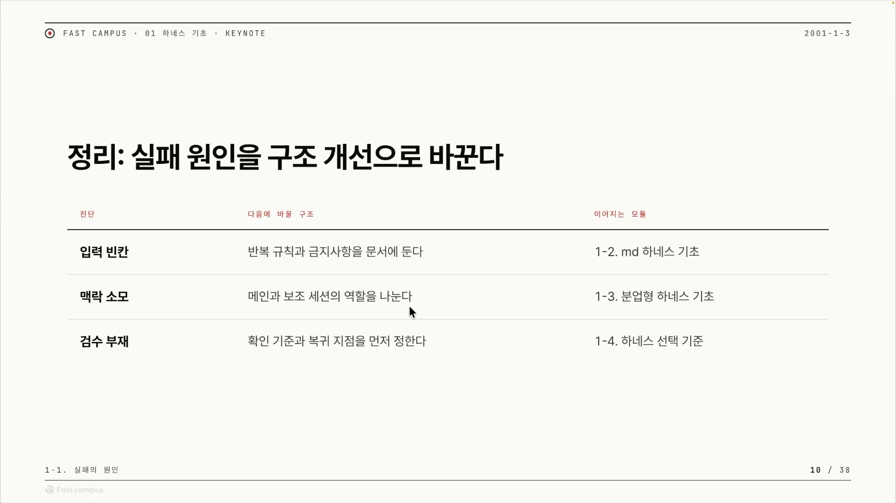
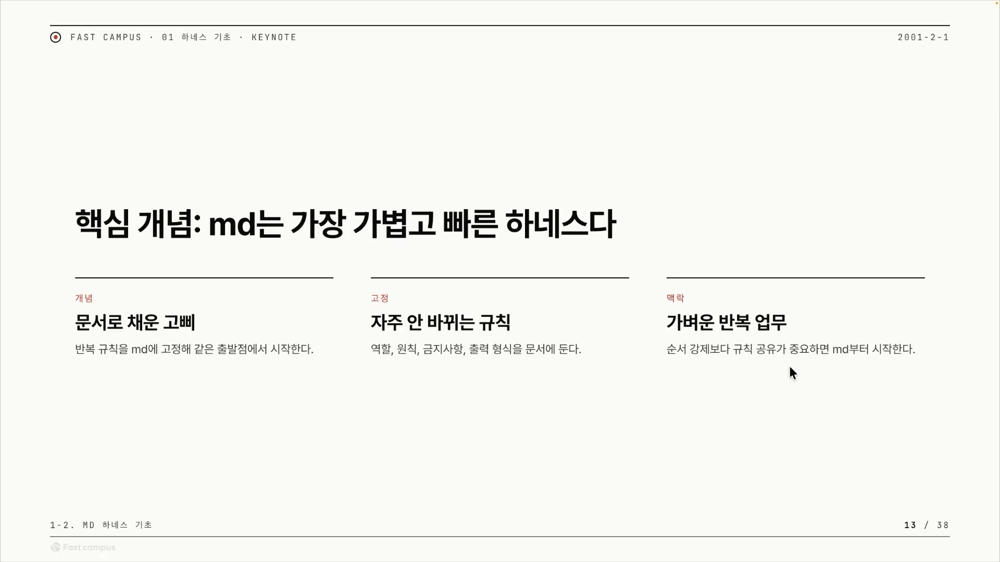
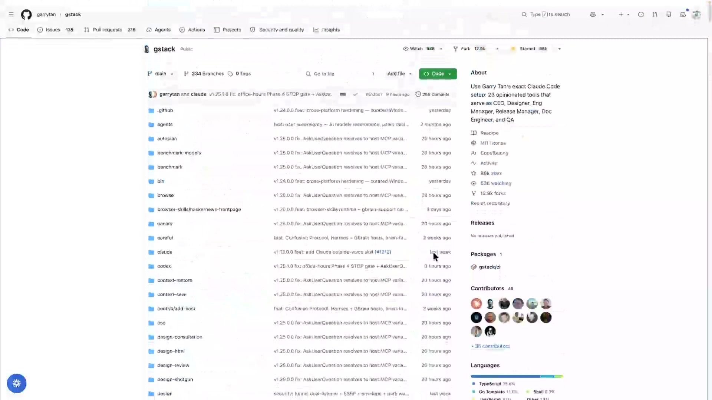
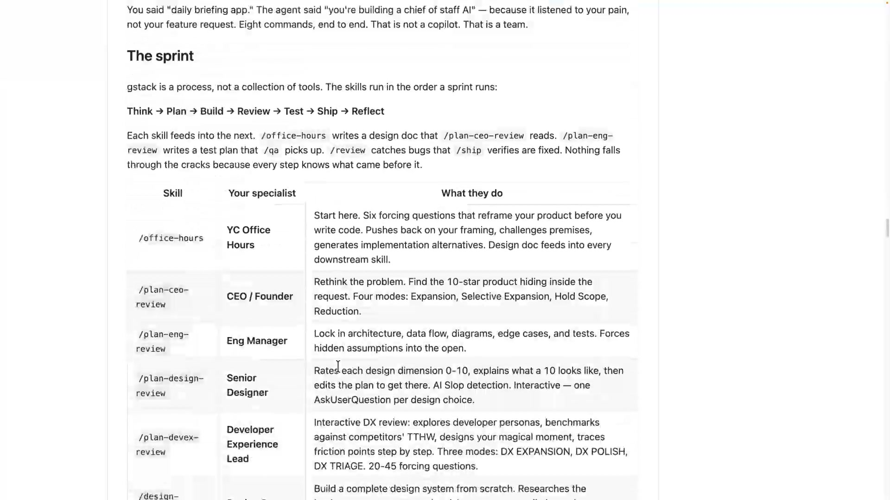
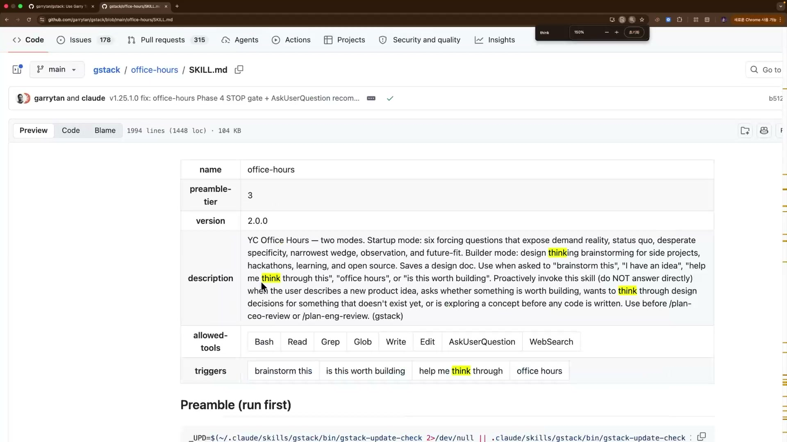
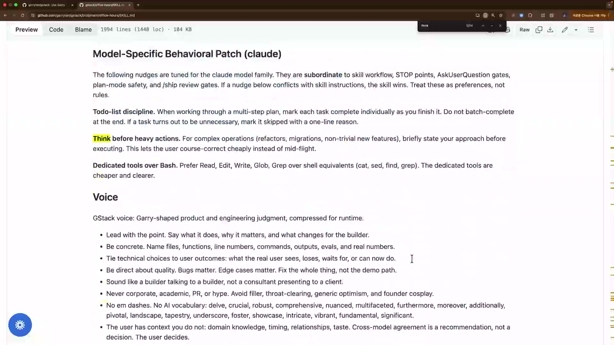
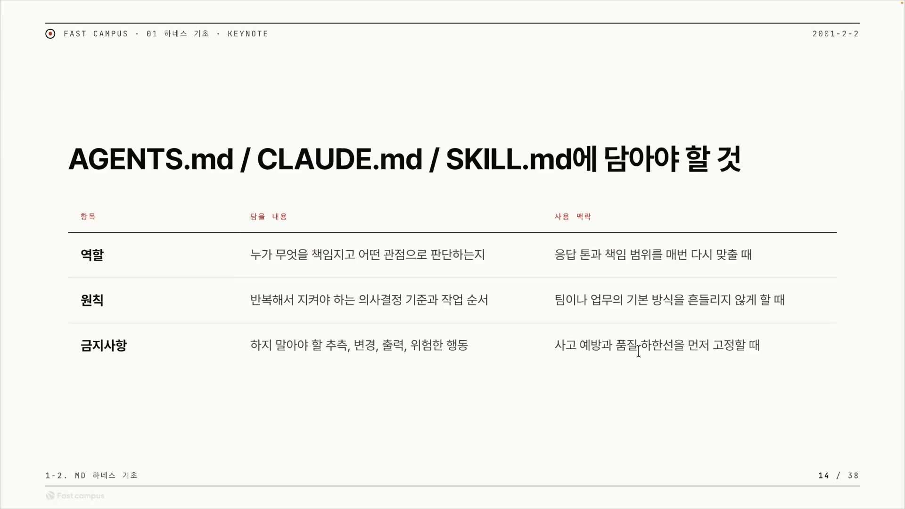

하네스를 한 줄로 말하면, LLM을 내가 원하는 방향으로 끌고 가도록 감싸는 장치다. 강력하지만 제멋대로 갈 수 있는 엔진에 고삐를 채우는 일에 가깝다. 그 고삐를 어떤 재료로 만드느냐에 따라 하네스의 종류가 갈리는데, 그중 가장 가볍고 만들기 쉬운 것이 마크다운으로 만든 고삐, 마크다운 하네스다.

이 글은 그 마크다운 하네스가 무엇이고, 왜 필요하며, 실제로는 어떻게 생겼는지를 정리한다.

## 먼저, 우리는 어디서 실패하는가

마크다운 하네스로 들어가기 전에 짚어둘 것이 하나 있다. LLM에게 일을 시킬 때 실패가 어디서 일어나는지다. 작업의 흐름을 입력, 실행, 검수 세 구간으로 나눠 보면, 문제는 늘 이 셋 중 어딘가에서 터진다.

- **입력 구간**: "이거 해줘"라고만 던지면, 무엇을 어디까지 해야 성공인지가 흐릿하다. 성공 조건이 뭉뚱그려져 있고 제약 조건이 없다. 해법은 성공 조건을 잘게 쪼개고 제약을 거는 것이다.
- **실행 구간(맥락 소모)**: 대화가 길어질수록 LLM이 들고 있는 맥락이 비대해지고 흐려진다. 해법은 세션을 메인과 보조로 나눠 맥락을 분산하는 것이다.
- **검수 구간**: 결과가 맞는지 보려면 판정할 기준과, 틀렸을 때 되돌아갈 지점이 있어야 한다. 그게 없으면 잘됐는지조차 알 수 없다.

이 글이 다루는 마크다운 하네스는 이 중에서도 입력 구간의 해법이다. 자주 안 바뀌는 규칙을 문서에 박아두는 일이 곧 "입력을 고정"하는 일이기 때문이다. 표의 맨 오른쪽 칸처럼, 입력의 빈칸 문제는 "반복 규칙과 금지사항을 문서에 둔다"로 이어진다.

## 마크다운 하네스란 무엇인가

마크다운 하네스는 한마디로 **문서형 하네스**다. 마크다운으로 쓴 문서 한 장을 LLM에게 주고, LLM이 그 문서를 직접 읽어 스스로 해석하고 그대로 행동하게 만드는 방식이다.

여기서 LLM은 인터프리터(해석기)가 된다. 보통 프로그램은 사람이 코드를 짜고 컴퓨터가 그 코드를 실행한다. 마크다운 하네스에서는 **마크다운 문서가 곧 "코드"이고, 그 코드를 읽어 실행에 옮기는 주체가 LLM 자신**이다. 일어나는 일을 순서대로 풀면 이렇다.

1. 사람이 규칙, 역할, 금지사항, 출력 형식을 마크다운 문서 한 장에 적어둔다.
2. 세션을 시작할 때, 혹은 슬래시 명령으로 LLM에게 그 문서를 읽힌다.
3. LLM이 문서를 번역(이게 무슨 뜻인지)하고, 이해(무엇을 해야 하는지)하고, 행동(실제 작업)으로 옮긴다.

별도의 코드를 짜서 LLM을 제어하는 게 아니라 자연어 문서가 곧 제어 장치가 된다. 그래서 가장 가볍다. 통제 수단에 거의 코드가 없다.

그렇다면 그 문서에 무엇을 적는가. 강의자가 "제일 강조하고 싶다"고 한 한 가지는 **자주 안 바뀌는 것들을 문서에 고정하라**는 것이다. 자주 안 바뀌는 것의 대표가 이런 것들이다.

- 페르소나(역할): "당신은 시니어 개발자입니다" 같은 정체성 지정
- 행동 방식: 어떻게 행동해야 하는지
- 책임 기준의 분리: 어디까지가 LLM의 책임 범위인지

왜 이런 것들이 "자주 안 바뀌는" 후보일까. "당신은 시니어 개발자입니다"처럼 역할을 주면 모델은 그 역할에 맞는 어휘와 판단 기준, 꼼꼼함을 끌어다 쓴다. 이런 역할과 원칙은 오늘 A 코드를 짜든 내일 B 코드를 짜든 그대로 유지된다. 작업이 바뀌어도 변하지 않으니 매번 새로 쓸 게 아니라 한 번 문서에 박아두기 좋다. 반대로 "이번에 고칠 파일이 무엇인지"는 매번 바뀌므로 문서가 아니라 그때그때 프롬프트로 준다.

규칙을 문서에 박는 행위는 동시에 두 가지 일을 한다. 하나는 AI의 출발점을 고정하는 것이다. 처음 시작할 때 넣어야 했던 프롬프트들을 문서에 고정해, 매번 같은 지점에서 출발하게 만든다. 다른 하나는 LLM이 움직일 수 있는 경계를 분리하는 것이다. 어디까지 해도 되고 어디부터는 안 되는지의 울타리를 문서가 정한다.

## 왜 굳이 문서에 고정해야 하는가

여기서 자연스러운 의문이 든다. 매번 다시 설명하면 안 되나. 규칙을 문서에 고정하지 않고 매번 손으로 다시 넣으면, 거기서 네 갈래의 문제가 파생된다.

뿌리는 하나다. 같은 규칙(역할, 원칙, 금지사항)을 작업할 때마다 똑같이 다시 넣어야 하는 상황이다. 클로드 코드를 켜고, 프롬프트 저장해 둔 곳에 가서, 그걸 찾아 복사해 붙여 넣고 진행한다. 이 "매번 복붙, 재설명"이 모든 문제의 출발점이다.

첫째, 까먹고 빠뜨린다. 매번 손으로 넣다 보면 무엇을 넣어야 했는지 까먹는다. 귀찮으니 빠뜨린다. 특히 "LLM이 어디까지 작업해도 되고 어디를 만지면 안 되는지"의 경계 규칙을 빠뜨리면 치명적이다.

둘째, 출력 형식이 제멋대로가 되어 검수가 불가능해진다. 원하는 출력 형식을 고정해 두지 않으면 어쩔 땐 파워포인트, 어쩔 땐 엑셀, 어쩔 땐 마크다운이 나온다. 형식이 매번 달라지면 결과가 맞는지 검수할 수가 없다. 앞서 본 검수 구간의 문제가 정확히 이 지점에서 터진다. 그래서 출력 형식까지 문서에 고정해야 한다.

셋째, 드리프트가 일어난다. 규칙을 하나하나 따로 넣다 보면, LLM이 주어지지 않은 빈칸을 스스로 추측해 메워버린다. 이렇게 의도와 어긋나 흘러가는 것을 드리프트(drift)라 부른다.

넷째, 멱등성이 더 떨어진다. LLM은 본래 같은 입력에도 똑같은 답을 보장하지 않는다. 모델이 논디터미니스틱(non-deterministic)하기 때문이다. 답변을 만들 때 추론 과정에서 다음 토큰을 확률적으로 뽑으니, 같은 질문에도 출력이 그때그때 흔들린다. 완전한 멱등성, 곧 같은 입력이면 같은 결과는 애초에 없다는 뜻이다. 그래서 마크다운 하네스가 노리는 것은 멱등성을 만들어내는 게 아니라, 이미 흔들리는 결과를 최대한 덜 흔들리게 만드는 것이다. 같은 규칙이라도 한 문서로 통째로 주느냐 각각 따로 주느냐에 따라 그 흔들림의 폭이 달라진다.

여기서 우리가 통제할 수 있는 건 하나뿐이다. **입력을 최대한 일정하게 만드는 것.** 같은 규칙을 매번 손으로 쪼개 넣으면 입력이 미묘하게 달라져 출력이 더 흔들린다. 한 문서로 한 번에, 같은 형태로 주면 입력이 고정돼 흔들림이 줄어든다. 그래서 규칙을 흩뿌리지 말고 한 장의 문서에 모아 고정하라는 것이고, 이것이 마크다운 하네스가 존재하는 이유다.

네 갈래를 한 표로 모으면 이렇게 된다.

| 매번 다시 설명하면        | 결과                          | 마크다운 하네스가 막는 법      |
| ------------------------- | ----------------------------- | ------------------------------ |
| 손으로 복붙               | 까먹고 빠뜨림                 | 문서에 박아두면 빠질 일이 없음 |
| 형식 미지정               | PPT·엑셀·md 제각각, 검수 불가 | 출력 형식을 문서에 고정        |
| 규칙을 쪼개 줌            | 빈칸 추측 = 드리프트          | 통째로 읽혀 추측 여지 제거     |
| 입력이 매번 미세하게 다름 | 멱등성 상실, 결과 들쭉날쭉    | 같은 문서 = 같은 출발점        |

## 문서로 채운 고삐

이제 정의를 종합할 수 있다. 마크다운 하네스는 반복 규칙, 퀄리티 기준, 제약 조건을 마크다운 문서에 고정해, LLM이 항상 같은 출발점에서 시작하게 만든 장치다. 강의는 이를 한마디로 "문서로 채운 고삐"라 부른다.

고삐 비유를 구체적으로 풀면 이렇다. 고삐는 말을 원하는 방향으로 끄는 줄이다. 여기서 말은 제멋대로 갈 수 있는 강력한 엔진인 LLM이고, 고삐는 방향을 잡아주는 하네스다. "문서로 채운 고삐"란 그 방향 잡기를 복잡한 코드가 아니라 마크다운 문서로 한다는 뜻이다. LLM을 통제하는 수단이 프로그램이 아니라 사람이 읽고 쓸 수 있는 자연어 문서 한 장이라는 점, 그게 마크다운 하네스의 정체성이다.

"가장 가볍고 빠르다"는 말에는 두 가지 의미가 겹쳐 있다. 하나는 **만들기에 빠르다**는 것이다. 코드를 짤 필요 없이 마크다운만 쓰면 되니 누구나 즉시 만든다. 다른 하나는 **돌리기에 가볍다**는 것이다. 무거운 코드 구조 없이 문서를 읽히는 것만으로 동작한다. 그래서 여러 하네스 방식 중 진입장벽이 가장 낮은 출발점이 마크다운 하네스다.

결국 핵심 가치는 하나로 모인다. **같은 출발점.** 앞에서 본 까먹음, 드리프트, 멱등성 상실은 전부 출발점이 매번 달라서 생기는 문제다. 규칙을 흩뿌려 매번 다르게 주면 출발점이 매번 다르고 결과가 흔들린다. 규칙을 한 문서에 모아 항상 같이 주면 출발점이 고정되고 결과가 안정된다. 마크다운 하네스는 "출발점 고정 장치"라고 이해하면 가장 정확하다.

문서에 담는 것을 모으면 역할(페르소나), 원칙(어떻게 행동할지), 금지사항(어디를 만지면 안 되는지), 출력 형식(검수를 위해 필수), 그리고 퀄리티와 제약 조건이다. 이 목록이 실제로 어떻게 생겼는지는 사례에서 확인할 수 있다.

## 사례 하나: 개리 탄의 gstack

요즘 유명한 마크다운 하네스의 대표 사례가 gstack이다. YC(Y Combinator) 대표 개리 탄이 만든 마크다운 하네스다. 레포 정식 이름은 소문자 `gstack`이며, 강의 시점에 GitHub 스타가 88K를 넘었다.

개리 탄이 X에서 자주 말하는 개념이 **팻 스킬, 씬 하네스**(fat skill, thin harness)다. 논리는 이렇게 흐른다. 모델의 IQ(성능)는 계속 좋아지는데 우리의 생산성은 그만큼 오르지 않는다. 그렇다면 병목은 모델이 아니라 모델에게 주는 문서(스킬)다. 그러니 스킬 문서를 더 두껍게(fat) 잘 써야 하고, 모델을 돌리는 코드(harness)는 얇아도(thin) 된다. 노력을 코드 짜기가 아니라 문서 잘 쓰기에 쏟으라는 것, 이게 마크다운 하네스 철학의 핵심 근거다.

그렇다면 "팻 스킬"은 얼마나 두꺼운가. 강의자에 따르면 보통 2,000줄에서 3,000줄을 말한다. 우리가 흔히 떠올리는 "프롬프트 몇 줄"과는 차원이 다르다.

gstack을 만든 배경에는 안드레이 카파시의 영향이 있다. 카파시가 2025년 12월부터는 코드를 치지 않고도 많은 일을 할 수 있었다고 말한 것이 개리 탄에게 좋은 영감이 되었고, 거기서 "혼자서 어떻게 팀 단위의 영향력과 생산성을 낼 수 있을까"를 고민했다고 한다. 그래서 gstack에는 단순한 코딩 규칙이 아니라 회사 운영 철학이 많이 담겨 있다.

gstack은 단발 명령이 아니라 일련의 단계를 루프로 돌면서 스킬을 쓰라고 안내한다. 그 루프가 **Think → Plan → Build → Review → Test → Ship → Reflect**, 그리고 다시 처음으로 돌아간다. 한 번에 완성하는 게 아니라 생각, 계획, 제작, 검토, 테스트, 출시, 회고를 반복(이터레이션)하며 점점 좋게 만드는 구조다. 요즘 많은 하네스가 비슷한 영역을 그리는 것도 이 반복 순환을 통해 결과물을 점점 낫게 다듬을 수 있어서다.

## 사례 둘: 1994줄짜리 office-hours

gstack 안에서 제일 유명한 스킬이 `office-hours`다. 이 스킬을 열어 보면 "두꺼운 스킬"이 실제로 어떻게 생겼는지가 눈으로 들어온다.

스킬 **하나가 약 1,994줄**이다. 앞에서 말한 "팻 스킬은 2~3천 줄"이 빈말이 아니라는 실증이다. 이 한 장의 문서 안에는 역할, 원칙, 금지사항과 함께 출력 형식을 지정하는 규칙도 들어 있다. 그중 하나가 AskUserQuestion Format이다. "질문을 사용자에게 이런 형식으로 던져라"처럼 출력의 모양을 규정하는 항목으로, 앞에서 "출력 형식을 고정해야 검수가 된다"고 했던 그 출력 형식 고정의 실제 항목이 바로 이것이다.

이 1,994줄을 사람이 손으로 다 쳤을까. 아니다. 방향과 판단은 사람이 말로 하되, 실제 줄을 채우는 타이핑은 LLM이 한다. 두꺼운 스킬 문서를 만드는 일조차 LLM으로 자동화된다는 뜻이다.

문서 안을 더 들어가 보면 굉장히 많은 규칙과 제약 조건, 그리고 유저가 이 스킬을 어떻게 쓰게 할지까지 아주 자세히 적혀 있다. 역할과 원칙, 금지사항, 출력 형식 같은 행동 규칙이 문장 단위로 박혀 있고, 이 모든 게 마크다운 문서 한 장에 들어 있다. 이게 바로 마크다운 하네스다.

이 스킬이 막아주는 건 정확히 앞에서 본 "매번 복붙" 문제다. 1,994줄을 문서화해 두지 않으면, office-hours 같은 행동을 시키려고 매번 그 내용을 복사해 붙여 넣어야 한다. 대신 반복 규칙을 마크다운으로 문서화해 두고, 슬래시 `/office-hours` 한 줄로 호출한다. 매번 복붙하던 일이 명령 한 줄로 줄어든다.

이런 스킬에 담기는 것을 정리하면 네 가지로 모인다.

| 구성요소  | 뜻                           |
| --------- | ---------------------------- |
| 역할      | 누구로서 행동할지 (페르소나) |
| 원칙      | 어떻게 행동할지              |
| 금지사항  | 무엇을 하면 안 되는지        |
| 출력 형식 | 결과를 어떤 모양으로 낼지    |

한 가지 짚어둘 원리가 있다. 마크다운 하네스는 단계의 순서를 빡빡하게 강제하는 도구라기보다, **"지켜야 할 규칙 묶음"을 한 번에 제공**하는 데 강하다. 순서가 중요한 게 아니라, 규칙을 제공하고 LLM이 그 규칙을 따라야 하는 상황에 잘 어울린다. 그래서 자주 안 바뀌는 규칙을 적어두고 귀찮음을 없애는 용도에 잘 맞는다.

## 그래서 언제 쓰는가

마크다운 하네스가 잘 맞는 자리는 셋이다. 자주 안 바뀌는 규칙을 매번 다시 설명하기 귀찮을 때, 같은 종류의 작업을 반복적으로 시키는 가벼운 반복 업무, 그리고 단계 순서를 빡빡하게 강제하기보다 규칙 묶음만 제공하면 되는 일이다.

반대로 복잡한 분기나 세션 분업, 무거운 검수 루프가 필요한 일이라면 다른 종류의 하네스(앞에서 언급한 분업형 같은)가 더 맞는다. 마크다운 하네스는 만능 해법이 아니라 "가장 가벼운 출발점"이라는 위치다.

gstack에는 office-hours 말고도 많은 스킬이 있다. 그 목록을 둘러보다 보면 "이런 업무까지 문서 한 장으로 자동화되는구나" 하는 감각이 생긴다. 문서를 쓰는 일조차 LLM이 한다는 점과 이어지는 대목이다.

여기까지가 "마크다운 하네스가 무엇이고 왜 필요한가"라는 개념과 사례였다. 다음 단계는 이걸 내 프로젝트에 실제로 어떻게 파일로 담는가다. 위 표가 가리키는 세 문서, 곧 AGENTS.md, CLAUDE.md, SKILL.md에 역할과 원칙과 금지사항을 각각 어떻게 나눠 담을지가 그 실전의 내용이다.

한 줄로 정리하면 이렇다. 자주 안 바뀌는 규칙(역할, 원칙, 금지사항, 출력 형식)을 마크다운 한 장에 고정해, LLM이 항상 같은 출발점에서 출발하게 하라. 만들기 쉽고 가벼워, 가장 빠르게 시작할 수 있는 하네스다.
