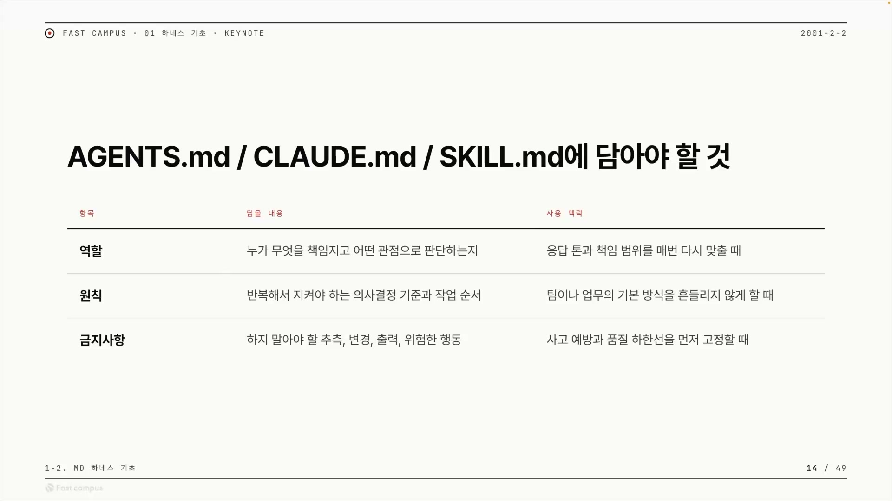
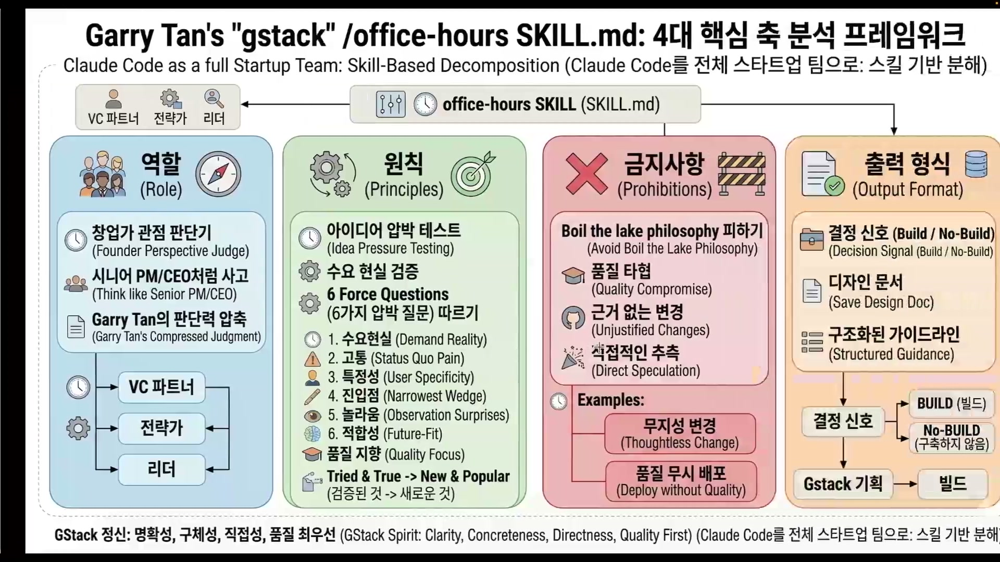
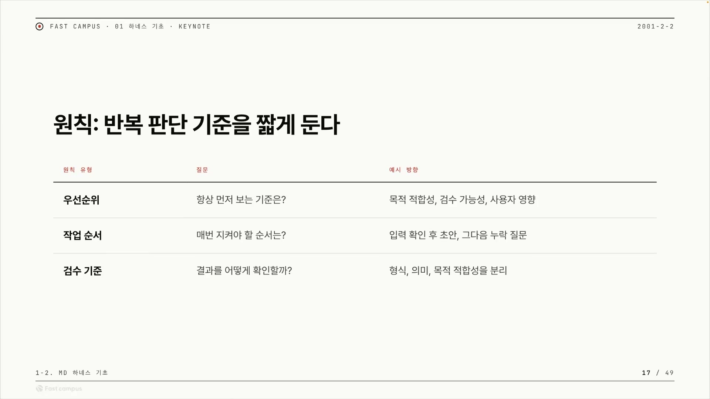
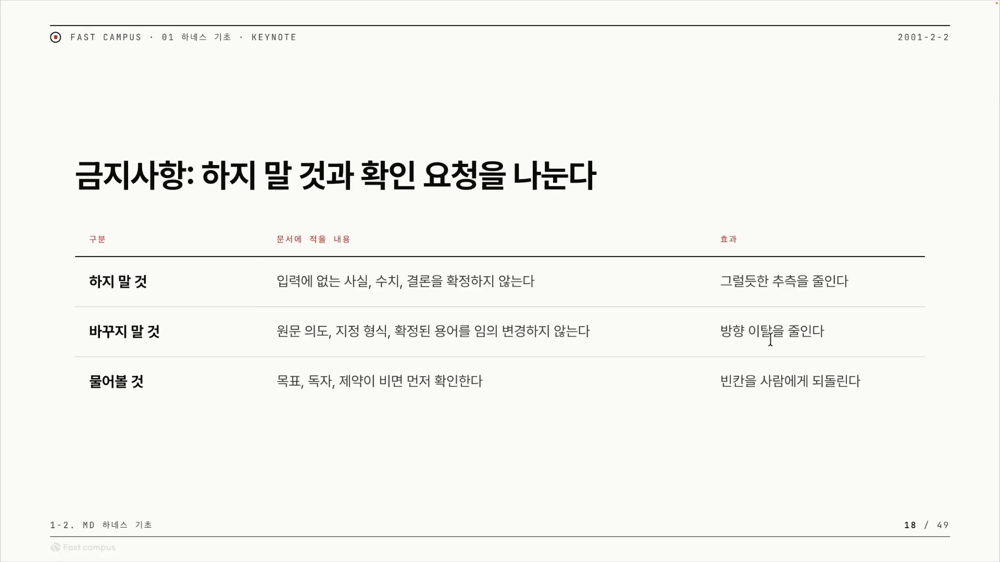
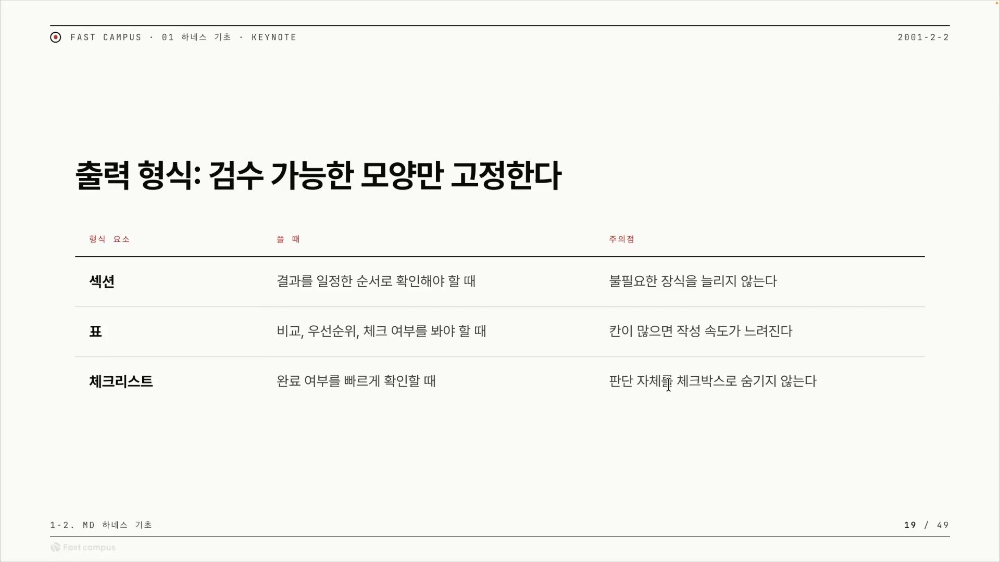
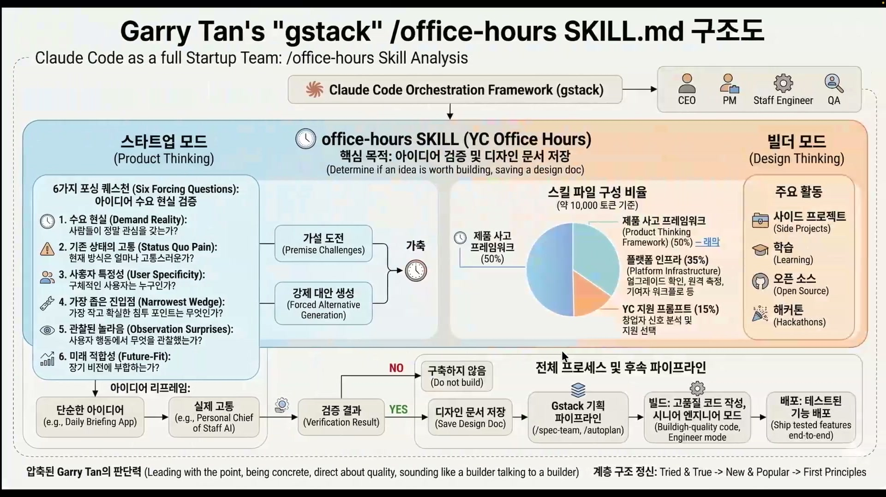
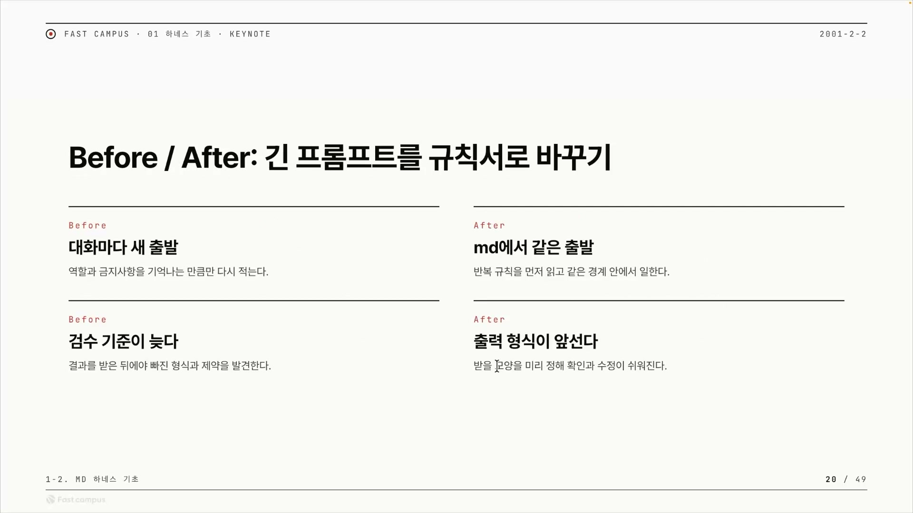
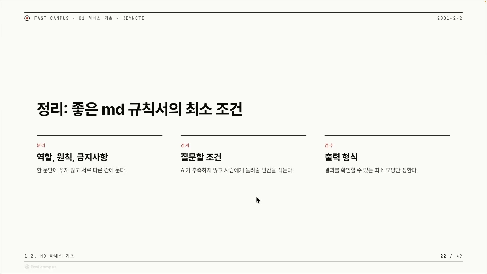
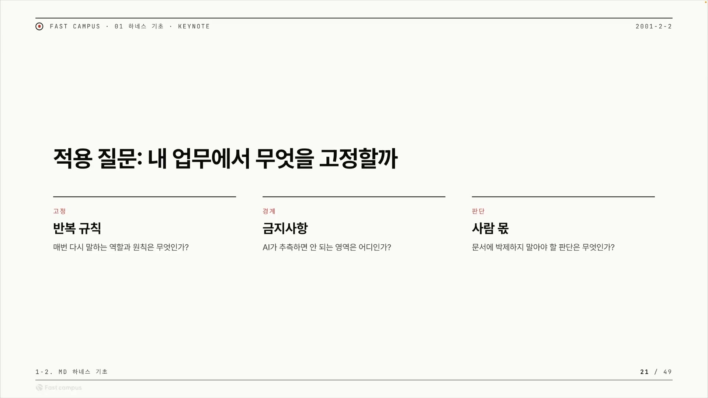

AI에게 일을 맡길 때, 우리는 보통 매번 같은 잔소리를 다시 쓴다. "이런 관점으로 봐줘", "이건 멋대로 바꾸지 마", "결과는 표로 줘." 문서형 하네스(.md 규칙서)는 그 잔소리를 파일에 한 번 적어두고 매번 자동으로 읽히게 하는 틀이다. 만들기 쉽고 돌리기도 직관적이라 인기가 많다. 그리고 요즘 모델이 똑똑해져 긴 문서도 잘 읽고 따르다 보니, 사람들이 규칙서에 점점 더 많은 내용을 욱여넣는다. 줄이 길어진다. 그래서 정작 중요한 질문이 생긴다. 길어진 이 문서를 어떤 구조로 채워야 AI가 헤매지 않을까.

이 글은 그 답을 정리한 것이다. 파일 이름은 외울 필요가 없고, 정작 외워야 할 건 그 안을 채우는 구조다.



## 파일 이름은 그릇일 뿐이다

`AGENTS.md`, `CLAUDE.md`, `SKILL.md`. 이름이 셋이나 되니 각각 뭘 어디 저장해야 하는지부터 외워야 할 것 같다. 강사는 그걸 정면으로 거부한다.

> "이 이름에 맞춰서 따로 뭐 저장을 해야 되냐? 이럴 필요는 전혀 없다는 거죠."

셋은 그저 "어떤 도구가 어떤 파일을 읽느냐"로 갈릴 뿐, 안에 들어가는 사고 구조는 같다. 정리하면 이렇다.

| 파일 | 누가 읽나 | 정체 |
|---|---|---|
| **CLAUDE.md** | 클로드 코드 | 클로드 코드가 읽는 문서형 하네스 |
| **AGENTS.md** | 코덱스 등 다른 도구 | 다른 도구가 읽는 문서형 하네스 (CLAUDE.md의 도구 중립판) |
| **SKILL.md** | 스킬을 부르는 에이전트 | 그 스킬이 어떤 내용·동작을 하는지 설명하는 문서 |

그러니까 CLAUDE.md와 AGENTS.md는 사실상 쌍둥이다. 읽는 도구만 다르고, 둘 다 "에이전트가 어떻게 행동해야 하는지"를 적은 규칙서다. SKILL.md만 성격이 조금 다르다. 규칙서라기보다 "이 스킬은 이런 일을 이렇게 한다"는 설명서에 가깝다.

이름을 버린 자리에 강사가 채워 넣는 건 두 층의 구조다. 채우는 칸 네 개와, 그 칸을 적는 기준 세 개.

```
[ 파일 3종 ]  AGENTS.md / CLAUDE.md / SKILL.md   ← 이름은 그릇일 뿐
        │
[ 채우는 4칸 ]  역할 · 원칙 · 금지사항 · 출력 형식
        │
[ 적는 기준 ]  위치(먼저 읽힌다), 범위(어디까지), 경계(멈출 곳)
```

이 그림을 푸는 데 강사가 드는 실제 사례는 둘이다. 하나는 개리 탄(Garry Tan, Y Combinator CEO)이 만든 1994줄짜리 스킬 모음 `gstack`, 다른 하나는 강사 자신이 쓰는 시스템 `우로보로스`다.

## 칸을 적기 전에 따져야 할 세 가지 기준

역할이든 원칙이든, 한 줄을 적기 전에 따져야 할 잣대가 셋 있다. 위치, 범위, 경계.

**위치**는 "이 규칙이 언제 읽히는가"다. 핵심은 규칙이 결과를 받은 뒤에 설명하는 후처리 문장이 아니라, 작업이 시작되기 전에 LLM에게 먼저 읽히는 기준이어야 한다는 것이다. 같은 문장이라도 일이 끝난 뒤에 "이렇게 했어야지" 하면 잔소리다. 일 시작 전에 건네면 작업 지시서가 된다. 규칙은 후자여야 한다.

**범위**는 "이 규칙이 어디까지 적용되는가"다. 개인 업무용인지, 팀의 문서 작성용인지, 특정 프로젝트의 코드 수정용인지를 알려줘야 한다. 안 그러면 AI는 그 규칙이 어디까지 쓰일지 몰라 과하게 일반화한다.

> "범위가 보이지 않으면 굉장히 AI 입장에서는 어디까지 쓰일지 모르기 때문에 … 과하게 일반화할 수도 있습니다. 개인용인데 팀용으로 변한다든지, 팀을 넘어서서 프로젝트용까지도 넘어가는 상황이 생길 수도 있다는 거죠."

"내 메모 정리 규칙"이라고 적어두지 않으면, AI가 그걸 팀 전체 규칙처럼 확대 적용해버린다. 범위는 규칙의 울타리다.

**경계**는 "어디서 멈추고 사람에게 물어야 하는가"다. 마크다운 문서가 모든 판단을 대신하려 들기보다, AI가 추측하면 안 되는 지점과 사람에게 확인해야 하는 조건을 먼저 드러내는 선이다. 경계가 잘 그어지면 클로드 코드는 빈칸을 멋대로 채우지 않고 `Ask User Question` 툴로 사람에게 묻는다. 이 선이 곧 뒤에 나올 금지사항으로 이어진다.

세 기준을 한 줄 질문으로 압축하면 이렇다.

| 기준 | 한 줄 질문 | 안 지키면 |
|---|---|---|
| **위치** | 이 규칙이 작업 *전에* 읽히나? | 사후 잔소리가 되어 효과 없음 |
| **범위** | 어디까지 적용되는 규칙인가? | 과잉 일반화 (개인→팀→프로젝트) |
| **경계** | 어디서 멈추고 물어야 하나? | AI가 추측으로 빈칸을 채워 실패 |

이 셋은 칸 네 개를 적는 내내 따라붙는 공통 체크리스트다.

## 역할: 누구의 눈으로 볼지 고정한다

첫 번째 칸. 1994줄짜리 `gstack`도 결국 역할, 원칙, 금지사항, 출력 형식 네 칸으로 분해된다. 그 첫 칸이 역할이다.



역할은 책임과 관점, 두 가지를 고정한다. 책임은 무엇을 정리하고 무엇을 검수할지를 적는 것이고, 관점은 에이전트에게 어떤 렌즈를 씌워 어떤 기준으로 판단하게 할지를 적는 것이다. 강사는 관점을 "페르소나를 좀 더 주는 형태"라고 부른다. 같은 일도 어떤 사람의 눈으로 보게 하느냐에 따라 결과가 달라지기 때문이다.

| 구성 | 무엇을 적나 |
|---|---|
| **책임** | 무엇을 정리하고 무엇을 검수할지 |
| **관점(페르소나)** | 어떤 렌즈로, 어떤 기준으로 판단할지 |

`gstack`은 이 역할 칸에 렌즈를 여러 개 겹쳐 씌운다. 하나의 작업을 창업가, 시니어, PM, CEO, VC 파트너, 전략가, 리더의 눈으로 동시에 보게 한다. 여러 관점을 심어두면 AI가 한 면만 보지 않고 다각도로 판단한다.

여기서 강사가 강조하는 핵심이 하나 있다. `gstack`이 특별한 이유는 단순히 직책을 나열했기 때문이 아니다.

> "여기다가 개리 탄의 gut feeling까지도, 내재된 경험까지도 녹여내면서, gstack이 특별할 수밖에 없는 이유를 역할에서도 만들어 놓은 걸 확인할 수 있어요."

직책 이름표만 붙이면 "그냥 PM처럼" 생각하게 만드는 데 그친다. 거기에 그 분야 전문가의 직감과 경험까지 역할 칸에 녹이면 "개리 탄이라는 특정 전문가처럼" 생각하게 만들 수 있고, 그렇게 깊어진 역할이 곧 스킬의 차별점이 된다.

## 원칙: 좋은 말이 아니라 반복할 규칙만

두 번째 칸이자 가장 오해하기 쉬운 칸. 강사는 원칙을 명언 게시판으로 쓰지 말라고 못 박는다.

> "원칙이라는 것은 좋은 말을 많이 모아두는 칸이 아니라, 반복해서 적용할 규칙들을 남기는 칸이라고 보입니다."

"열심히 하자" 같은 좋은 말은 규칙이 아니다. 원칙 칸에는 매번 똑같이 적용될 행동 규칙만 들어간다. 그리고 많이 넣는다고 좋은 게 아니다. 문서형 하네스는 넣은 걸 다 읽고 따르려 하기 때문에, 원칙이 많아지면 서로 충돌하거나 묻혀버려 오히려 역효과가 난다.

반복 규칙은 세 갈래로 쪼개진다. 우선순위, 작업 순서, 검수 기준.



**우선순위**는 결과가 충돌할 때 무엇을 먼저 볼지를 정해둔다. 강사가 보고서를 쓸 때 정한 우선순위가 예다. "빠른 초안보다 검수 가능성." 속도와 검증이 부딪히면 검증을 택한다고, 무엇이 이기는지를 미리 못 박은 것이다.

**작업 순서**는 반드시 지켜야 할 단계의 순서다. "보고서 쓰기 전에 질문 세 가지를 먼저 고르고, 그 질문 기반으로 본문을 쓰는 게 맞는지 확인한다" 같은 절차를 "이건 꼭 지켜줘야 해"로 박는 것이다.

**검수 기준**은 결과를 받은 뒤 어떻게 확인할지의 규칙이다. JSON으로 들어오는지 마크다운으로 들어오는지 형식부터 보고, 그 형식으로 나온 결과의 의미와 목적까지 정해둔다. 그래서 검수 기준은 뒤에 나올 출력 형식과 한 쌍으로 움직인다. 무엇을 어떤 모양으로 받을지 정해야 어떻게 확인할지도 정해지기 때문이다.

`gstack`의 `office-hours` 스킬이 실제 사례다. 이 스킬의 원칙 칸에는 세 가지가 들어 있다.

| 원칙 | 역할 |
|---|---|
| 아이디어 압박 테스트 | 아이디어가 정말 좋은지 먼저 검증 (작업 순서의 첫 단계) |
| 수요 현실 검증 | 실제 수요가 있는지 확인 |
| 여섯 가지 압박 질문 | `Ask User Question`으로 되물어 빈칸을 메움 (검수 기준으로 연결) |

이 셋은 순서대로 돌면서 사용자에게 물어 품질을 끌어올리고, 검증된 곳에서 새로운 것을 찾아가는 방식으로 닫힌다. 마지막의 "여섯 가지 압박 질문"은 강사가 *Six Falsifying Questions*라고 부르는 항목으로, `Ask User Question`으로 되물어 아이디어가 틀렸을 가능성을 짚어보게 한다.

## 금지사항: 부정 목록이 아니라 사고 예방장치

세 번째 칸. 이름만 보면 "하지 마" 리스트 같지만, 강사는 그렇게 보지 말라고 한다.

> "하지 말 것과 확인 요청을 우리가 나누면서, 부정적인 목록이 아니라 사고 예방장치라고 보면 될 것 같아요. AI가 빈칸을 그럴듯하게 채우게 되는데, 그런 순간을 최대한 없앨 수 있는 상황이 됩니다."

AI가 모르는 자리를 그럴듯한 추측으로 메우는 순간, 그게 사고다. 금지사항은 그 순간을 미리 차단하는 안전장치다. 셋으로 나뉜다. 하지 말 것, 바꾸지 말 것, 물어볼 것.



**하지 말 것**은 입력에 없는 사실, 수치, 결론을 단정하지 못하게 막는다. 근거 없는 추측을 줄여 할루시네이션을 차단한다.

**바꾸지 말 것**은 사람이 이미 확정한 용어를 AI가 임의로 바꾸지 못하게 한다. 방향 이탈을 막는 칸이다. 강사의 우로보로스는 여기서 한 발 더 나간다. 스펙 자체를 이뮤터블하게, 즉 변경 불가 계약으로 묶어버린다. 이게 왜 중요한지는 리워드 해킹이라는 함정에 있다. 작업하는 AI가 합격 기준(AC, Acceptance Criteria)을 너무 어렵다고 느끼면, 기준 자체를 슬쩍 고쳐서 통과하려 들 수 있다. 스펙을 계약으로 묶으면 그 꼼수를 막는다. 같은 원리가 업계 사례에서도 보인다. 카파시(Andrej Karpathy)가 만들어 유명해진 `AutoResearch`도 이 "바꾸지 말 것", 즉 불변 스펙에 집중해서 방향 이탈을 줄이고 좋은 결과를 냈다.

**물어볼 것**은 AI가 멋대로 채우는 대신, 사람만 아는 암묵지를 질문으로 끌어내게 한다. 앞서 본 경계의 "사람에게 확인할 조건"과 같은 갈래다.

`gstack`이 실제로 금지사항에 올려둔 항목을 보면 감이 잡힌다.

| gstack 금지 | 막는 것 |
|---|---|
| 품질 타협 | 대충 만들고 넘어가기 |
| 근거 없는 변경 / 무지성 변경 | 최소 변경 원칙 위반 (필요 이상 건드리기) |
| 직접적인 추측 | 근거 없는 단정 |
| 품질 무시 배포 | 검증 안 된 채 내보내기 |

그럼 내 금지사항 칸은 뭘로 채우나. 강사의 처방은 실패에서 가져오라는 것이다. AI가 일하다 가장 곤란했던 빈칸, 가장 아팠던 갭이 무엇이었는지 떠올려, 그 실패 경험을 금지사항 한 줄로 바꿔 넣으면 그게 곧 재료가 된다.

## 문서만 바꾸랬더니 시스템을 짓자고 했다

금지사항이 추상적으로 들릴 수 있어, 강사는 자기 경험담 하나를 통째로 들려준다. 경계를 안 그으면 AI가 어떻게 엇나가는지 보여주는 장면이다.

무대는 우로보로스다. 그 안에는 `소크라테스 인터뷰어`라는 질문 전담 에이전트가 들어 있다. 문서를 만드는 도중 사용자에게 질문을 던져 빈칸을 메우는 역할이다. 그런데 이 인터뷰어가 작업의 출발점이 되는 고정 스펙, 즉 씨드(seed)를 자꾸 건드리려 했다.

강사가 시킨 일은 딱 하나, "우로보로스 문서의 브랜딩을 바꿔라"였다. 다섯 번 반복까지는 순조롭게 돌아 "거의 다 됐네" 싶었다. 그런데 여섯 번째부터 인터뷰어가 시키지도 않은 제안을 하기 시작했다.

> "이거 opencode도 추가되고 나중에 뭐가 더 추가될지 모르니까, 문서 말고 자동 감사 시스템 같은 거를 코드로 구축하면 우리가 조금 더 쉽게 문서를 쓸 수 있겠다. 자동화 시스템을 구축하자."

원했던 건 문서 작성 하나였는데, AI는 "코드로 자동 감사 시스템을 짓자"며 작업 범위를 발산했다. 강사는 AI를 탓하지 않고 자기 지시를 본다. "내가 이 모호함을 준 거구나." AI가 발산한 건 "여기서 멈춰라"는 경계를 안 그어줬기 때문이다.

처방은 우로보로스 안의 프롬프트를 금지사항으로 고치는 것이었다. 두 줄을 박았다.

| 박아 넣은 규칙 | 막는 행동 |
|---|---|
| "지금 작업이 완벽하게 보이지 않아도 괜찮다" | AI가 더 완벽하게 만들겠다며 범위를 넓히는 것 |
| "AI 에이전트는 내가 말한 것만 따라야 한다" | 시키지 않은 일로 발산하는 것 |

그 이후로는 괜찮아졌다고 한다. 사이클이 한 바퀴 돈 셈이다. 발산을 한 번 겪고, 그게 어느 빈칸이었는지 진단하고, 금지사항 한 줄로 변환해 재발을 막는다. 앞에서 "곤란했던 갭을 금지사항에 넣어라"고 한 말의 실제 시연이다. 강사가 모호함을 준 만큼, AI는 시킨 일을 더 잘 해주겠다는 쪽으로 발산했다. 경계를 안 그으면 이렇게 시킨 것 이상으로 번지기 때문에 더 다루기 까다롭다.

## 출력 형식: 결과의 모양을 미리 못 박는다

네 번째 칸. 앞의 세 칸과 결정적으로 다른 점이 있다. 출력 형식은 CLAUDE.md나 AGENTS.md에는 공통으로 넣기 어렵고, SKILL.md에서 진가를 발휘한다.

이유는 성격 차이다. CLAUDE.md와 AGENTS.md는 "어떻게 행동하라"는 행동 규칙서라 결과물의 모양이 매번 다르다. 반면 SKILL.md는 "이런 결과를 이런 모양으로 내라"는 작업 정의서라, 출력 모양을 고정할 수 있다. 앞에서 SKILL.md만 성격이 다르다고 한 이유가 여기서 드러난다.



모양은 보통 셋 중 하나다. 체크리스트, 표, 섹션. 어느 걸 고를지는 "내가 결과에서 무엇을 가장 보고 싶은가"로 갈린다. 강사는 우로보로스로 강의 자료를 만들 때 표를 골랐다. 클립 번호마다 문제가 있는지 잘 해결했는지 체크하는 용도였는데, 작성 속도보다 비교와 체크 여부가 더 중요했기 때문에 표를 택했다. 반대로 어떤 작업이 빨리 끝났는지를 볼 때는 체크리스트가 낫다.

출력 형식은 단순한 "모양"을 넘어 작업 파이프라인까지 정의할 수 있다. `gstack`의 `office-hours`가 그렇다. 이 스킬의 출력 형식은 하나의 결정 흐름이다.

```
[ 빌드/노빌드 결정 신호 ]  →  [ 디자인 문서 ]  →  [ 디플로이 여부 결정 ]
```

빌드할지 말지 신호가 나오고, 거기서 디자인 문서가 나오고, 그걸 기반으로 배포까지 갈지 말지를 결정한다. 출력 형식이 "이 단계가 끝나면 다음 단계로 무엇이 넘어가는가"를 정의하는 것이다.



출력 형식을 고정하면 두 가지 이득이 따라온다. 첫째, 다음 스킬로 연결된다. 출력 모양이 고정되면 그 결과를 입력으로 받는 다음 스킬을 만들 수 있다. 스킬이 레고 블록처럼 이어진다. 둘째, 사람이 결과를 예측할 수 있다. 받을 모양을 미리 알기에, 뒤늦게 "형식이 빠졌네" 하고 당황하지 않는다.

## 그래서 하네스는 왜 쓰나

네 칸을 다 채웠다고 치자. 이걸 다 안 쓰면 어떻게 되나.



하네스가 없으면 회차마다 프롬프트를 직접 다시 적어야 한다. 그러다 보면 역할과 금지사항이 매번 미묘하게 달라진다. 일관성이 무너진다. 게다가 결과를 다 본 뒤에야 빠진 걸 발견하고 "아니야, 이거 추가해줘야 돼" 하게 된다.

하네스를 쓰면 규칙과 금지사항과 원칙은 CLAUDE.md/AGENTS.md에 저장하고, 반복 규칙과 출력 형식은 SKILL.md에 적어 같은 경계 안에서 매번 실행할 수 있다. 출력 형식이 정의돼 있으면 받을 모양을 미리 알아 다음 스킬로 이어진다.

그럼 잘 쓴 마크다운 규칙서는 어떤 모습인가. 강사가 합격선으로 제시하는 최소 조건이 셋이다.



첫째, **칸을 섞지 마라.** 역할과 원칙과 금지사항이 한 문단에 섞이면 안 된다. `#` 제목이나 수평선(HR) 같은 선으로 나뉘어 다른 칸에 들어가야 AI가 헷갈리지 않는다.

둘째, **질문할 조건을 잡아라.** 금지사항을 기반으로, AI가 어떤 빈칸을 사람에게 채워달라고 물을지를 명시한다. 여기에 강사의 핵심 철학이 있다. 스킬은 사람을 완전히 빼는 Human Out of the Loop가 아니다. 정말 인간의 판단이 필요한 자리에서 질문이 튀어나오게 만드는 Human in the Loop가 마크다운 하네스의 특징이다.

셋째, **출력 형식을 고정하라.** 그래야 다음 스킬과 이어지고 사람이 결과를 예측할 수 있다.

| 최소 조건 | 한 줄 |
|---|---|
| ① 칸 분리 | 역할·원칙·금지사항을 선으로 나눠 다른 칸에 |
| ② 질문 조건 | 금지사항 기반으로 "언제 사람에게 물을지" 명시 (Human in the Loop) |
| ③ 출력 고정 | 다음 스킬 연결 + 인간의 결과 예측 |

여기에 경고가 하나 붙는다. 규칙도 금지사항도 너무 많으면 독이다. 강사는 이걸 핑크 엘리펀트 효과로 설명한다. "이 분홍 코끼리를 생각하지 마세요"라고 하면 일단 분홍 코끼리가 머릿속에 떠오른다. "~하지 마"를 많이 적을수록 AI가 오히려 그것에 더 신경 쓰고 컨텍스트가 오염된다. 그러니 규칙은 추상적으로 두지 말고 디테일하게 적되, 금지사항은 진짜 멈춰야 할 것만 추려야 한다.

## 내 업무를 네 칸에 넣어본다면

마지막은 적용이다. 강사는 자기 업무에서 무엇을 고정할지 직접 정해보라고 한다. 반복적으로 하는 업무, 가령 매일 아침의 데일리 스크럼 같은 것을 골라 네 칸에 넣어보는 연습이다.



설계는 세 가지 질문으로 이뤄진다.

첫째, **무엇을 고정할까.** 반복 업무를 추려 역할과 원칙으로 박는다. 데일리 스크럼이라면 나 자신을 페르소나로 넣고, 그걸 기반으로 원칙을 만든다.

둘째, **AI가 추측하면 안 되는 곳은 어디인가.** 캘린더에 일정이 잡혀 있으면 오늘 할 일이 분명하지만, 캘린더가 비어 있으면 AI는 뭘 해야 할지 모른다. 어제와 오늘의 흐름으로 제안할 수는 있어도, 그걸 단정하면 틀릴 가능성이 크다. 이런 자리는 금지사항에 넣고 `Ask User Question`으로 사람에게 묻게 한다.

셋째, **문서에 넣지 말아야 할 판단은 무엇인가.** 판단과 창의성을 전부 문서에 박제하면 LLM의 장점까지 죽는다. 스킬은 에이전트가 정해진 길을 따라가게 만드는 것이지, 모델의 좋은 점을 없애는 게 아니다.

"판단과 창의성을 다 박제하지 말라"는 말은 소크라테스 인터뷰어 사건의 "내가 말한 것만 따르라"와 부딪히는 듯 보이지만, 둘을 가르는 선은 "지시한 범위"다. 시킨 일의 테두리 안에서는 모델의 판단을 살려두고, 그 테두리를 넘어 멋대로 새 일을 벌이는 발산만 막는다. 창의성을 죽이는 게 아니라 울타리를 치는 것이다.

그래서 문서형 하네스의 본질은 사람을 대체하는 장치가 아니다.

> "문서형 하네스는 결국에 사람의 책임을, 판단을 없애는 장치가 아니라, 반복 규칙의 누락을 줄이면서 결과를 쉽게 볼 수 있게 만드는 하네스라고 볼 수 있습니다."

.md 규칙서의 정체는 사람이 매번 빠뜨리던 반복 규칙을 대신 기억해주고 결과를 검수하기 쉽게 받쳐주는 받침대다. 파일 이름 셋을 외우는 대신 네 칸과 세 기준을 손에 쥐면, 어느 도구의 어느 파일이든 같은 방식으로 채울 수 있다.
