"보고서 좀 잘 써줘." 매번 이렇게 부탁하면 AI는 매번 다른 곳에서 출발한다. 어떤 날은 길게, 어떤 날은 짧게, 어떤 날은 묻지도 않고 빈칸을 자기 마음대로 채운다. 이 강의 실습은 그 매번 다른 출발점을 한 장의 문서로 고정하는 작업이다. 반복하는 업무 하나를 골라 역할 · 원칙 · 금지사항으로 쪼개고, 그걸 `SKILL.md` 한 장으로 옮겨 실제로 돌려본다. 강의에서 정의하는 실습의 완료 기준이 인상적이다. **"다시 붙여 넣어도 같은 출발점과 경계가 보인다."** 좋은 규칙서란 사람이 봐서 그럴듯한 글이 아니라, AI가 매번 같은 자리에서 같은 선을 긋게 만드는 문서라는 뜻이다.

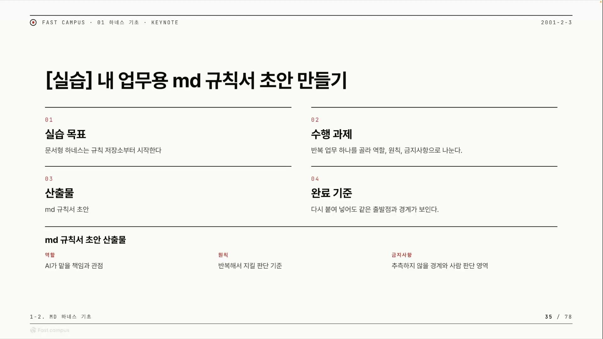

실습의 입력은 그냥 떠오르는 업무가 아니다. 이 시리즈의 전 회차(1-3 실습)에서 만든 "실패 원인 체크리스트"를 그대로 입력으로 받는다. 실패를 진단한 결과를, 그 실패가 다시 안 나게 막는 규칙으로 굳히는 흐름이다. 산출물을 다음 회차의 입력으로 물려주는 구조라, 앞에서 한 고생이 버려지지 않는다.

## 먼저 채우는 여섯 칸

규칙서를 바로 쓰지 않는다. 그 전에 여섯 개의 칸부터 채운다. 반복 업무, 역할, 원칙, 금지사항, 출력 형식, 사람 판단. 이 여섯 칸이 곧 스킬의 뼈대가 된다.

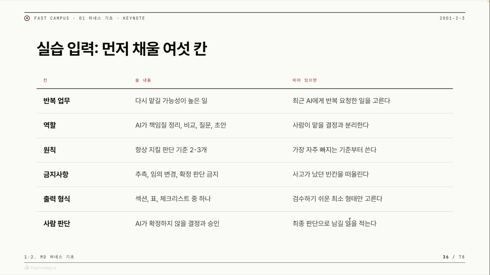

표를 보면 칸마다 열이 셋이다. 칸 이름, 거기 쓸 내용, 그리고 **"비어 있으면"**. 이 세 번째 열이 표의 진짜 가치다. 왼쪽은 무엇을 적는지, 오른쪽은 막혔을 때 어떻게 뚫는지를 알려준다. 예를 들어 금지사항 칸이 안 떠오르면 "사고가 났던 빈칸을 떠올린다", 원칙이 막히면 "가장 자주 빠지는 기준부터 쓴다" 식이다. "비어 있으면" 열은 그 자체로 셀프 인터뷰 가이드인 셈이다.

| 칸 | 쓸 내용 | 비어 있으면 |
|---|---|---|
| 반복 업무 | 다시 맡길 가능성이 높은 일 | 최근 AI에게 반복 요청한 일을 고른다 |
| 역할 | AI가 책임질 정리·비교·질문·초안 | 사람이 맡을 결정과 분리한다 |
| 원칙 | 항상 지킬 판단 기준 2~3개 | 가장 자주 빠지는 기준부터 쓴다 |
| 금지사항 | 추측·임의 변경·확정 판단 금지 | 사고가 났던 빈칸을 떠올린다 |
| 출력 형식 | 섹션·표·체크리스트 중 하나 | 검수하기 쉬운 최소 형태만 고른다 |
| 사람 판단 | AI가 확정하지 않을 결정과 승인 | 최종 판단으로 남길 일을 적는다 |

강사는 이 여섯 칸을 손으로 안 쓴다. 클로드에게 채워달라고 부탁한다. 단 조건을 단다. 실패 사례로 직접 확인된 사실만 채우고, 모르는 칸(결제 라인 · 보고서 템플릿 · 도메인 등)은 추측하지 말고 "확인 필요"로 두고 나에게 되물으라는 것이다. 표를 채우는 일조차 추측을 막는 규칙을 미리 거는 셈인데, 이 "되묻기"가 뒤에서 AskUserQuestion으로 이어진다.

여기에 작은 팁이 하나 붙는다. 반복 업무를 적을 때 **무엇을 입력으로 받아 무엇으로 바꿀지**까지 적어두면 훨씬 쉬워진다. 강사가 든 예가 좋다. "흩어진 회의 메모를 결정 필요 항목과 확인 질문으로 정리한다." 회의록 녹화는 흔한데 그 녹화를 액션 아이템으로 바꿔주는 자동화는 의외로 드물다는 관찰까지 덧붙인다. 입력과 출력을 화살표 하나로 묶어두면 나머지 칸이 따라온다.

## 역할은 정성적으로 말고 정량적으로

여섯 칸 중 가장 자주 망치는 칸, 그리고 강사가 가장 길게 강조한 칸이 역할이다. 핵심은 한 줄로 요약된다. **역할을 정성적으로 적지 말고 정량적·책임 중심으로 적어라.**

| | 예시 | 왜 |
|---|---|---|
| 정성적 (나쁨) | "좋은 시니어 엔지니어" | "좋은"이 모호해 검수가 불가능하다. LLM이 알아서 해석한다 |
| 정량적 (좋음) | "15년 차 시니어 엔지니어" | 연차로 고정되니 행동이 일관된다 |
| 책임 중심 (좋음) | "구조화하고 빠진 질문을 표시하는 책임자" | 무엇을 책임지는지 명시되니 그 기준으로 결과를 검수한다 |

"좋은 시니어 엔지니어"가 왜 나쁜가. "좋은"이라는 형용사는 검수할 수가 없다. 결과를 받고 "이게 좋은 시니어가 쓴 거 맞아?"라고 물으면 답이 안 나온다. 반면 "15년 차"는 행동을 고정한다. 형용사 대신 **수치와 책임의 대상**으로 채우는 것이 요령이다. 작성 틀은 "너는 무엇을 책임지는 어떤 역할이다"이다.

역할을 적을 때는 **사람이 남길 결정**도 함께 적어야 한다. 마크다운 하네스에 사람 자리를 비워두지 않으면 AI가 사람 몫까지 과하게 대신하려 들기 때문이다. 반대로 그 자리를 미리 내주면, AI는 스스로 판단하지 않고 결정을 사람에게 도로 넘긴다.

LLM은 빈칸을 만나면 멈추기보다 그럴듯하게 채우려는 경향이 강하다. 자신감 있게 추측한다. 그래서 "여기는 사람이 정한다"를 명시적으로 적어 빈칸을 미리 점유해두지 않으면, 모델은 그 자리도 자기가 메워버린다. 역할 칸에서부터 사람 몫을 박아두는 건 그 추측을 차단하는 선제 조치다.

## 원칙과 금지사항을 분리한다

역할을 적었으면 다음은 세 가지를 명확히 갈라 쓴다. 원칙, 금지사항, 확인 요청. 슬라이드 제목 그대로 핵심은 "분리한다"이다.

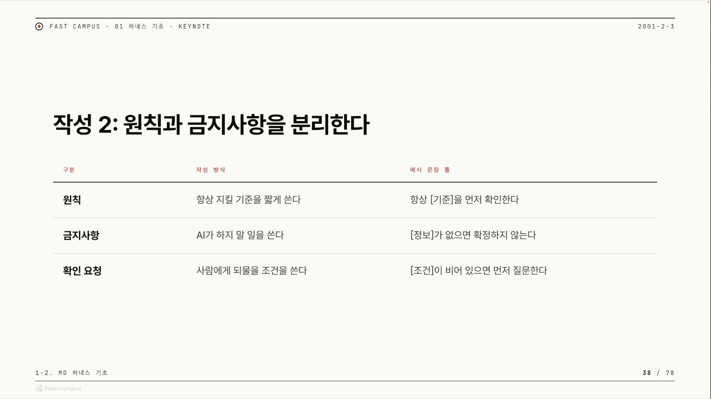

| 구분 | 작성 방식 | 예시 문장 틀 |
|---|---|---|
| 원칙 | 항상 지킬 기준을 짧게 쓴다 | "항상 [기준]을 먼저 확인한다" |
| 금지사항 | AI가 하지 말 일을 쓴다 | "[정보]가 없으면 확정하지 않는다" |
| 확인 요청 | 사람에게 되물을 조건을 쓴다 | "[조건]이 비어 있으면 먼저 질문한다" |

**원칙**은 AI가 반드시 따라야 할 기준이다. "간결하게 잘" 같은 넓은 말은 원칙이 못 된다. 검수 가능한 한 문장이어야 한다. 강사의 예시는 "핵심 쟁점은 3개 이내로 먼저 정리한다"이다. 개수가 박혀 있으니 지켰는지 눈으로 셀 수 있다. 좋은 원칙의 조건은 개수 · 순서 · 대상이 박혀 있어 검수자가 손가락으로 셀 수 있다는 것.

**금지사항**에는 함정이 있다. 너무 넓으면 무용지물이 된다. "추측하지 않는다"고 적으면 거의 모든 생성 행위에 걸려서, 모델이 사실상 무시하거나 과하게 위축된다. 그래서 반드시 목적어를 붙인다.

| 너무 넓음 (나쁨) | 목적어 있음 (좋음) |
|---|---|
| 추측하지 않는다 | 결제 라인 정보가 없으면 추측하지 않는다 |
| 함부로 바꾸지 않는다 | 완료 기준을 임의로 변경하지 않는다 |

경계는 무엇에 대한 것인지(목적어)가 있어야 적용 지점이 생긴다. 이 글 뒤에서 직접 만드는 보고서 작성 스킬에도 그런 금지가 하나 들어간다. "우로보로스 repo에 존재하지 않는 기능이나 커뮤니티를 사실처럼 단정한다." 막을 대상이 손에 잡힌다.

**확인 요청**은 금지사항의 반대편이다. 같은 빈칸을 두고 양쪽에서 막는다. 금지사항은 "(정보 없으면) 멋대로 채우지 마", 확인 요청은 "(정보 없으면) 사람에게 물어봐". 정보가 비면 멈추고 질문으로 만들어 사람에게 넘긴다. 앞서 역할 칸에서 적어둔 "사람이 남길 결정"이 여기서 실제 동작으로 연결된다.

## 출력 형식을 고정하면 검수 기준이 따라 나온다

마지막 세 칸은 출력 형식, 검수 기준, 사람 판단이다. 이 세 칸을 묶는 핵심 인과가 하나 있다. **출력 형식을 고정하면 검수 기준이 저절로 따라 나온다.**

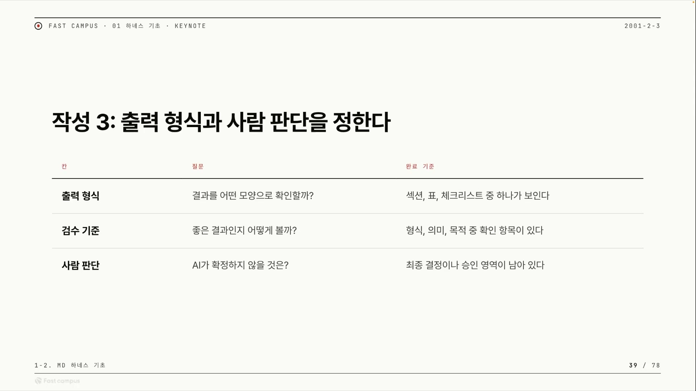

| 칸 | 스스로 묻는 질문 | 완료 기준 |
|---|---|---|
| 출력 형식 | 결과를 어떤 모양으로 확인할까? | 섹션·표·체크리스트 중 하나가 보인다 |
| 검수 기준 | 좋은 결과인지 어떻게 볼까? | 형식·의미·목적 중 확인 항목이 있다 |
| 사람 판단 | AI가 확정하지 않을 것은? | 최종 결정이나 승인 영역이 남아 있다 |

논리는 이렇다. 형식이 "A4 1페이지 + 쟁점 3개 + 예상 질문 3개"로 고정되면, 검수는 "1페이지인가? 쟁점 3개인가? 질문 3개인가?"를 세기만 하면 끝난다. 형식을 고정하는 것이 곧 검수를 verifiable하게 만드는 것이다.

"보고서를 잘 써줘"는 완성 판정이 불가능한 논-verifiable 작업이다. 다 쓰고 나서도 "이게 잘 쓴 건가?"에 객관적 답이 없다. 출력 형식을 셀 수 있는 단위(페이지 수 · 항목 개수 · 섹션 이름)로 못 박으면, 같은 작업이 체크박스로 검수 가능한 작업으로 바뀐다. 이게 LLM의 비결정성을 줄이는 실전 레버다.

처음부터 무겁게 갈 필요는 없다. 강사는 첫 실습이니 표든 체크리스트든 다시 마크다운을 적으라 하든 보고서든, 가벼운 형태로 시작하라고 한다.

**사람 판단**은 출력 직전에 한 번 더 끼어드는 자리다. 최종 우선순위, 승인, 리뷰를 사람이 하도록 가장 마지막에 공간을 비운다.

여기까지 채우면 마크다운 하네스의 골격이 완성된다. 강사의 정의가 깔끔하다. 마크다운 하네스란 순서를 정의하고, 역할을 주고, 출력 형식을 고정하고, 검수를 하고, 사람이 다시 한 번 리뷰할 수 있게 하는 형태를 순서대로 마크다운(자연어)으로 풀어낸 것이다. 코드로 짜는 파이프라인을 자연어 문서 한 장으로 대신한 셈이다.

## 다 적은 스킬을 다시 검수한다, 모호한 문장을 좁힌다

규칙서를 다 적었다고 끝이 아니다. 스킬 자체를 검수해야 한다. 이유는 단순하다. 이 스킬이 곧 우리 업무를 자동화할 자연어 코드이기 때문이다. 게다가 자연어라 무심코 모호한 단어가 끼어들기 쉽다. 강사는 앤트로픽의 스킬 크리에이터 같은 스킬로 만든 스킬을 다시 검수한다고 말한다.

검수의 세 가지 원칙은 이렇다. 첫째, **추상어 사냥**. "좋다" 같은 모호한 단어가 스킬 본문에 남아 있는지 다시 읽고 제거한다. 둘째, **최종 판단 이관**. AI가 최종 판단을 확정하는 문단이 있으면 사람 판단 항목으로 옮긴다. 셋째, **섹션 시각 분리**. 역할 · 원칙 · 금지사항 · 출력 형식은 줄을 치거나 `#` 헤더를 크게 키워 칸을 눈으로 구분한다.

같은 내용이라도 `#` 헤더로 명확히 구획된 마크다운은 모델이 "지금 어느 규칙 블록을 읽는지" 더 잘 분간한다. 헤더는 사람을 위한 장식이 아니라 모델의 주의를 구간별로 묶어주는 구조 신호다. "줄을 쳐서 구분하라"는 말이 가독성 조언이자 동시에 성능 조치인 이유다.

검수의 하이라이트는 모호한 문장을 좁히는 대비표다. 귀찮을 때 AI에게 무심코 던지는 세 마디가 있다.

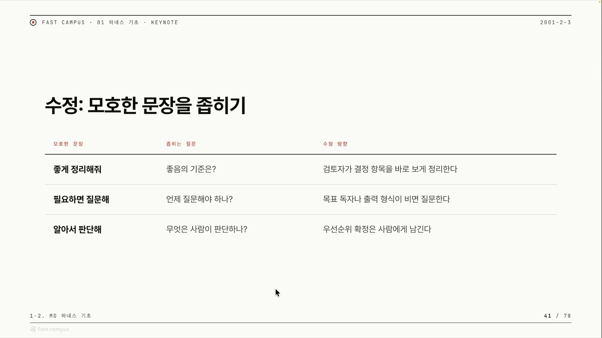

| 모호한 문장 | 좁히는 질문 | 수정 방향 |
|---|---|---|
| 좋게 정리해줘 | 좋음의 기준은? | 검토자가 결정 항목을 바로 보게 정리한다 |
| 필요하면 질문해 | 언제 질문해야 하나? | 목표 독자나 출력 형식이 비면 질문한다 |
| 알아서 판단해 | 무엇은 사람이 판단하나? | 우선순위 확정은 사람에게 남긴다 |

"좋게 정리해줘, 필요하면 질문해, 알아서 판단해." 이 셋이 스킬에 들어가면 그동안 한 작업이 도루묵이 된다. 모호한 표현을 발견하면 가운데 열의 질문을 스스로 던지고, 그 답을 오른쪽 문장으로 박아 넣으면 된다. "필요하면 질문해"는 "언제?"라고 물어 "독자나 형식이 비면"으로 좁힌다. 조건을 명시하는 순간 모호함이 사라진다.

흥미로운 건 이 세 마디를 좁히는 작업이 사실상 앞 내용 전체의 요약이라는 점이다. "좋게"는 출력 형식과 검수 기준으로, "필요하면 질문"은 확인 요청으로, "알아서 판단"은 사람 판단으로 각각 흡수된다. 세 모호 표현을 좁히면 여섯 칸이 자동으로 정리되는 구조다.

## 빈칸을 인터뷰로 채운다: AskUserQuestion

여섯 칸 중 클로드가 모르는 칸은 추측하지 않고 사용자에게 되물었다. 그 되묻기의 실제 도구가 AskUserQuestion이다. 선택지가 달린 질문 UI다. 강사가 "나에게 질문해줘" 식으로 시켜뒀더니, 클로드가 빈칸을 선택지 질문으로 되물어 왔다. 처음 네 개가 오고 마지막에 한 가지를 더 물어, 아래처럼 다섯 개가 됐다.

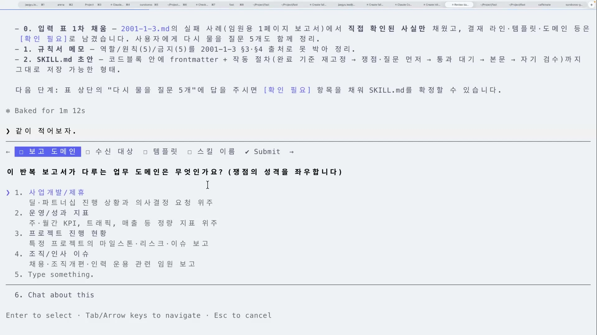

| AI가 물은 빈칸 | 강사의 답 |
|---|---|
| 보고서가 다루는 업무 도메인? | 프로젝트 진행 현황 (우로보로스 repo) |
| 독자(수신자)는 누구? | 마케팅 임원 (보기에 없어서 직접 입력) |
| 정해진 보고서 템플릿이 있나? | 없음 → 스킬이 구조를 정의하게 함 |
| 스킬 이름은? | 리포트 1페이지(report-1pager) |
| 자료 탐색은 어떻게 처리? | 같은 세션에서 단계만 분리 |

선택지에 마음에 드는 게 없으면 직접 입력할 수 있다. 강사는 "마케팅 임원"을 직접 타이핑해 넣는다. 세션 분리를 어느 수준으로 적용할지를 물어왔을 때는, 진짜 세션 분리는 다음 클립으로 미루고 지금은 같은 세션 안에서 단계만 분리하기로 정했다.

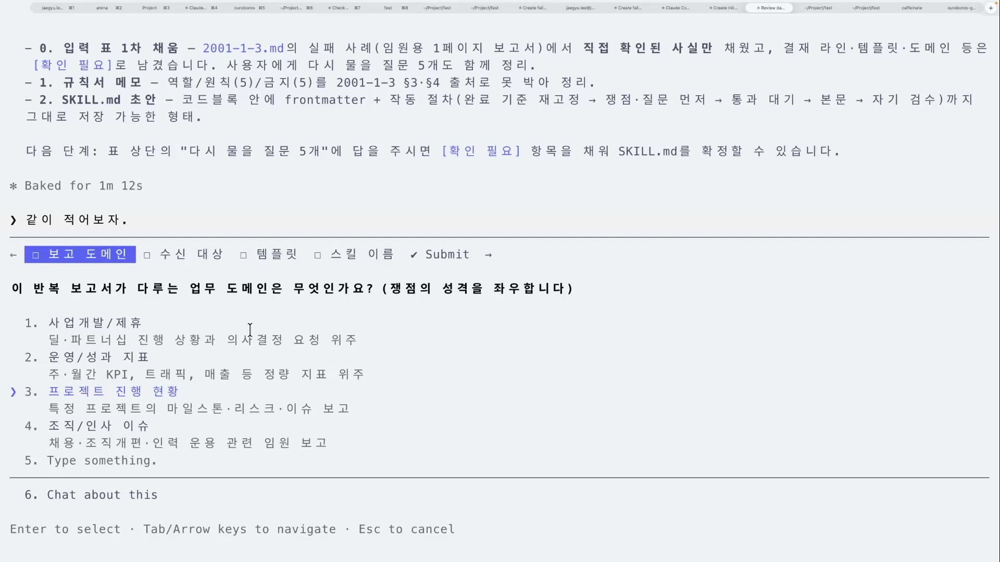

강사는 이 도구를 꽤 아낀다. 단순한 입력칸이 아니라 생각을 확장하는 보기를 함께 주기 때문이다. 소크라틱 리즈닝을 자기 프로젝트(우로보로스)에 적용할 때 처음 써본 도구가 이거였고, 공부할 때나 자기 암묵지를 꺼낼 때도 많이 쓴다고 한다.

빈칸을 자유 서술로 물으면 사용자도 막막하다. 보기를 주면 "이건 아니고 저거"라는 식으로 자기 머릿속 기준을 끌어내기 쉽다. 강사가 "암묵지를 꺼낸다"고 표현한 게 이것이다. AskUserQuestion은 AI의 빈칸 채우기 도구이자 사용자의 자기 발견 도구이기도 하다.

## 완성된 SKILL.md: report-1pager 해부

여섯 칸 입력표와 인터뷰 답을 합쳐 실제 스킬 파일이 나왔다. 이 클립의 산출물 본체다.

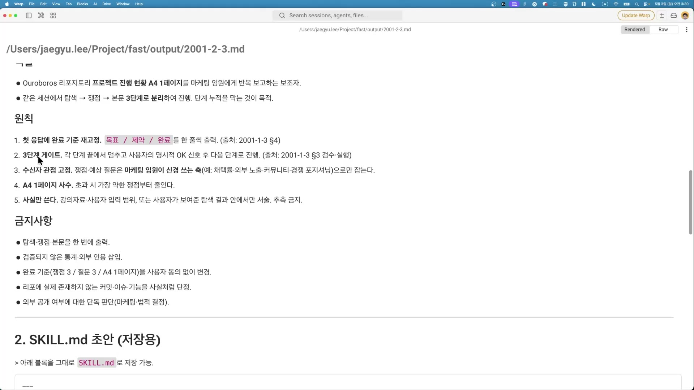

```markdown
---
name: report-1pager
description: Ouroboros 프로젝트 진행 현황을 마케팅 임원에게 반복 보고하는
  A4 1페이지 마크다운 보고서를 "탐색 → 쟁점 3 + 임원 예상 질문 3 → 본문"
  3단계 게이트로 작성한다. Use when 반복 주기 마케팅 임원용 1페이지 진행 현황 보고.
  Triggers (KO) 임원 보고서, 1페이지 보고서, 프로젝트 진행 현황, 마케팅 임원 보고.
  Do NOT use 정식 기획서·외부 IR / 코드 리뷰·기술 사양 / 외부 공개용 카피.
---

# 역할
Ouroboros(github.com/q00/ouroboros) 프로젝트 진행 현황을
마케팅 임원에게 반복 보고하는 A4 1페이지 작성 보조자.
같은 세션 안에서 탐색 → 쟁점 → 본문을 3단계 게이트로 분리한다.

# 작동 절차 (반드시 이 순서, 단계마다 사용자 OK 대기)
1. **완료 기준 재고정**: 첫 응답에 다음 한 줄을 출력한다.
   `목표: Ouroboros 진행 현황 1페이지(마케팅 임원용) / 제약: 쟁점 3개·예상 질문 3개 / 완료: 형식·쟁점·질문 모두 충족`
2. **[Gate 1] 탐색 결과 정리**: 사용자가 붙여 넣은(또는 사용자에게 요청해서 받은) 자료를
   - 최근 N일 커밋/PR 요약 (불릿 5개 이내)
   - 마케팅 관점 신호(채택·외부 언급·이슈 트렌드 등) 요약
   까지만 제출하고 **STOP**. 사용자의 OK 신호 전에는 쟁점화로 넘어가지 않는다.
3. **[Gate 2] 쟁점·질문 후보**: OK 후, 다음만 제출하고 **STOP**.
   - 쟁점 후보 3개 (각 1~2문장, 마케팅 임원 관점)
   - 마케팅 임원 예상 질문 3개 (각 답변 요지 1줄)
4. **[Gate 3] 본문 작성**: 통과된 쟁점·질문만 사용해 A4 1페이지로 작성.
   구조:
   - 목표 한 줄
   - 진행 현황 요약(3~5줄)
   - 쟁점 3개
   - 마케팅 임원 예상 질문 3개 + 답변 요지
   - 권고 / 결정 요청
```

이 파일을 여섯 칸 입력표와 나란히 놓고 보면, 칸 하나하나가 어디로 갔는지 보인다.

| 입력표 칸 | SKILL.md의 어디로 |
|---|---|
| 반복 업무 | description + 역할("진행 현황을 반복 보고") |
| 역할 | `# 역할` 블록 (보조자 + 마케팅 임원 관점 + 게이트 분리) |
| 원칙 | 작동 절차의 순서 · STOP · "통과된 것만 사용" |
| 금지사항 | "OK 전엔 안 넘어감", "통과된 쟁점·질문만 사용", 없는 기능 언급 금지 |
| 출력 형식 | Gate 3 구조 5항목(목표/현황/쟁점/질문/권고) |
| 사람 판단 | 단계마다 "사용자 OK 대기", 마지막 "권고 / 결정 요청" |

frontmatter도 일을 한다. `name`은 호출 트리거가 되는 식별자이고, `description`은 언제 켜야 하는지(Use when)와 한국어 트리거에 더해 **언제 쓰면 안 되는지**(Do NOT use)까지 담는다. 이 "Do NOT use"가 스킬이 엉뚱한 상황(정식 IR · 코드 리뷰 · 외부 카피)에 잘못 발동하는 걸 막는다.

이 스킬의 진짜 알맹이는 **3단계 게이트와 단계마다 STOP/OK 대기**다. 역할을 첫 응답에 고정하고, 3단계 게이트로 끊고, 수신자 관점(마케팅 임원)을 고정하고, 분량(A4 1페이지)을 고정하고, "하지 마"를 목적어와 함께 쓴다. 정량적이고 verifiable한 원칙만 들어갔고, 금지사항에 추상적인 단어가 하나도 없다.

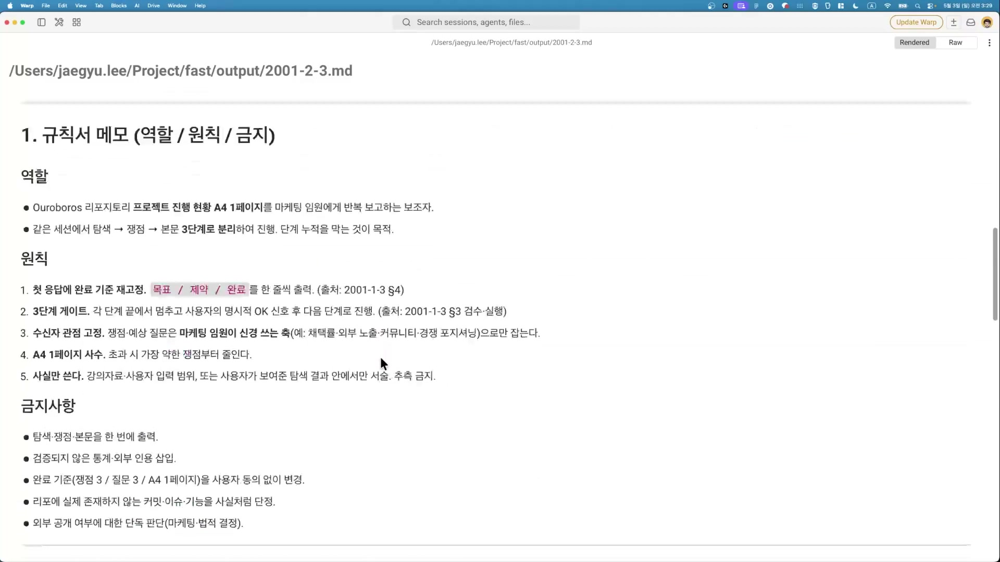

`#` 헤더로 역할과 절차가 시각적으로 갈린 모습이, 앞서 검수에서 말한 "섹션 분리" 원칙이 실제로 적용된 결과다.

## 실제로 돌려보기: 게이트 1·2·3과 컨텍스트 오염

만든 스킬을 진짜로 돌린다. 첫 함정부터 만난다. **스킬은 저장만 한다고 자동으로 돌지 않는다.** 강사도 여기서 한 번 막혀, ESC로 화면을 클리어하고 다시 켜서 "리포트 1페이지" 스킬을 직접 호출한다. CLI마다 호출 방식이 조금씩 다른데, 코덱스에선 스킬이 달러(`$`)로 호출돼야 한다는 점은 따로 유의해야 한다.

호출하면 스킬은 완료 기준 한 줄을 먼저 출력한 뒤 "다음 자료를 붙여넣어주세요"라며 멈춘다. 게이트 1, 탐색 단계다.

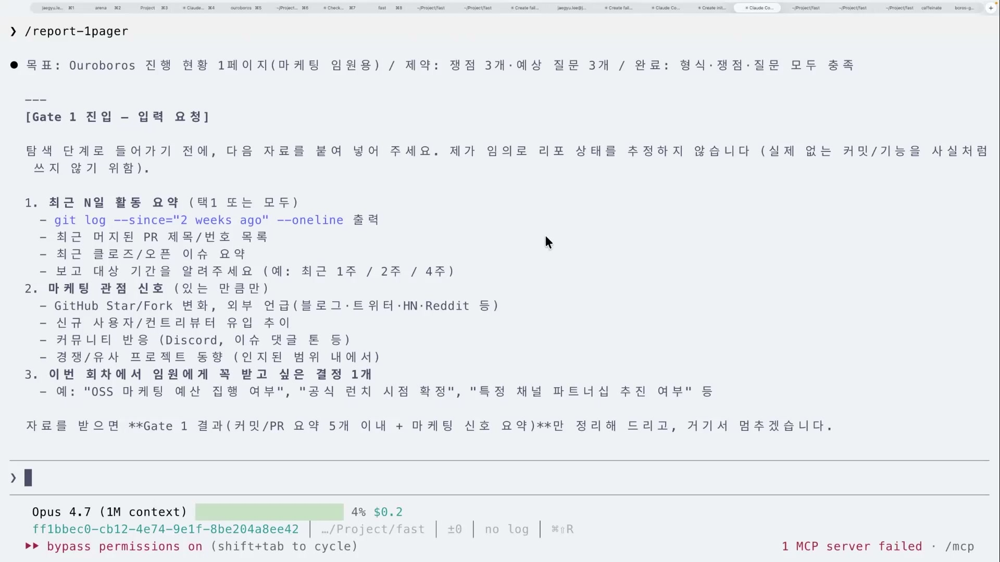

강사는 자기 repo이므로 gh CLI(`gh api`)로 우로보로스 데이터를 직접 가져온다. 고속 릴리즈 케이던스, 마이너 점프 3회, 컨트롤 플레인 강화 같은 사실이 마케팅 관점 신호 두 줄기로 정리되고, 여기서 STOP하고 OK를 기다린다.

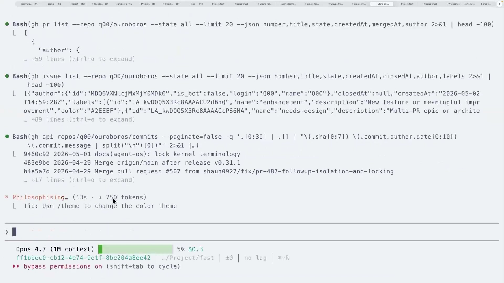

바로 이 지점에서 강사가 경고를 던진다. 게이트 1에서 gh로 데이터를 가져오는 동안 메인 세션에 컨텍스트가 계속 쌓인다. 1-1에서 다룬 컨태미네이션(오염)이 생길 수 있는 자리다. 컨텍스트 창이 100만 토큰이라 지금은 별로 안 들어찬 듯 보여도, 탐색이 쌓이고 쌓이면 오염은 곧장 진행된다. 이 한계가 다음 클립(분업형 하네스 = 세션 분리)의 동기가 된다.

OK를 주면 게이트 2로 넘어가 마케팅 임원 관점의 쟁점 후보 3개와 예상 질문 3개를 뽑는다.

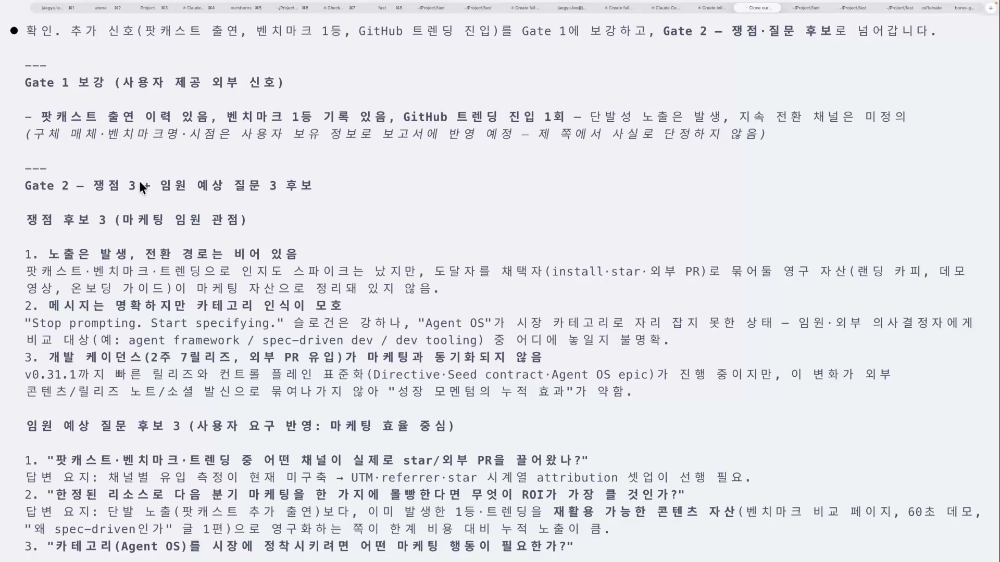

**스킬은 가두는 게 아니라 레일이다.** 강사는 "이 쟁점을 이렇게 생각하라"고 가둬두지 않았다. 형식과 순서는 레일로 고정했지만, 그 위에서 어떤 쟁점을 발굴할지는 열어뒀다. 그러자 LLM이 정말 컨설팅하듯이 "인지도 스파이크는 낮지만 연구 자산이 마케팅 자산으로 정리되어 있지 않다" 같은 쟁점을 스스로 뽑아냈다. 고정(레일)과 자유(창발)가 함께 살아 있는 모습이다.

게이트 2를 통과시키면 게이트 3에서 1페이지 본문이 완성된다.

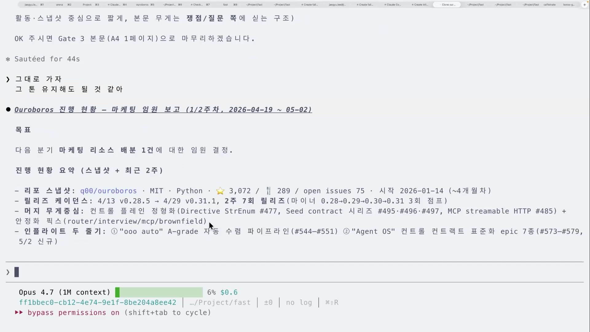

본문 끝에는 자기 검수 체크라인이 붙는다. 출력 형식을 verifiable하게 만들어 둔 것의 보상이다.

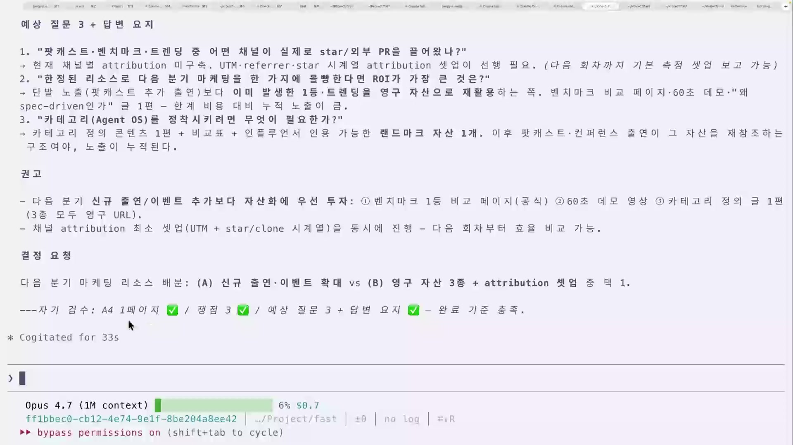

화면의 마지막 줄은 이렇다. "자기 검수: A4 1페이지 / 쟁점 3 / 예상 질문 3 + 답변 요지, 완료 기준 충족." 그리고 마지막은 결정 요청으로 사람에게 공을 넘긴다. 다음 분기 마케팅 리소스를 어디에 배분할지 같은 최종 결정은 AI가 확정하지 않고 사람 몫으로 남긴다.

여기서 강사가 솔직하게 인정하는 대목이 있다. 이 보고서는 스킬 없이도 쓸 수 있었다. 차이는 결과물이 아니라 **반복성과 결정론**이다. "보고서를 만들어라"는 논-verifiable한 작업을 완료 기준이 셀 수 있는 작업으로 바꿔, LLM의 움직임을 조금 더 결정론적으로 만든 것. 그게 가벼운 형태의 스킬이 하는 일이다.

## md 하네스가 하는 일, 남기는 일, 넘기는 일

마무리 슬라이드는 마크다운 하네스의 역할을 세 동사로 압축한다.

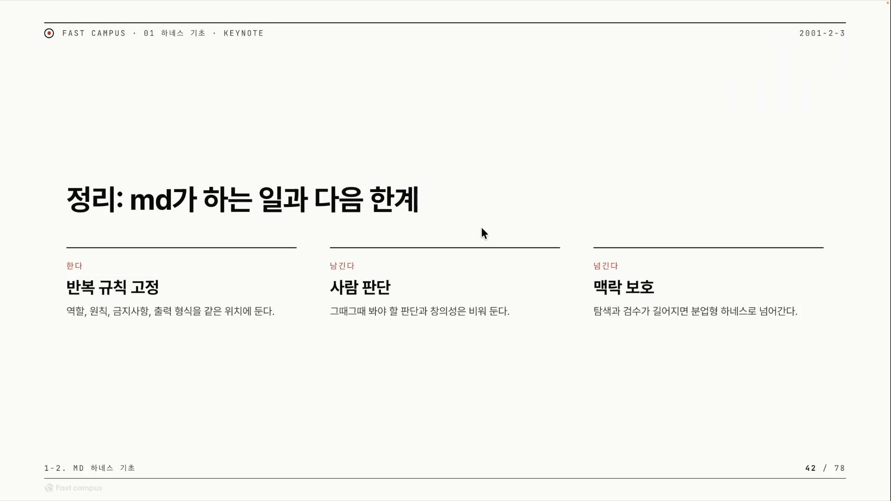

| | 무엇을 | 내용 |
|---|---|---|
| 한다 | 반복 규칙 고정 | 역할·원칙·금지사항·출력 형식을 같은 위치에 둔다 |
| 남긴다 | 사람 판단 | 그때그때 봐야 할 판단과 창의성은 비워 둔다 |
| 넘긴다 | 맥락 보호 | 탐색·검수가 길어지면 분업형 하네스로 넘어간다 |

**한다, 즉 반복 규칙 고정이다.** 반복 업무의 규칙을 한 문서에 모아 박는다. 한 번 만든 스킬은 계속 재사용한다. 강사도 이 보고서 스킬을 앞으로 계속 쓸 것 같다고 한다. 매번 컨설팅 프롬프트를 새로 쓰는 대신, 스킬로 박아두면 반복해서 호출만 하면 된다.

**남긴다, 사람 판단과 창발 공간을.** 두 가지를 비워 둔다. 하나는 사람 판단(최종 결정 · 승인 · 우선순위), 다른 하나는 LLM의 창발이다. 레일만 깔고 그 위에서 LLM이 새로 만들어내는 것(쟁점 발굴 같은)은 막지 않는다. 다 가두면 단순 템플릿이 되고, 다 풀면 비결정적이 된다. 스킬은 그 사이에 선다.

**넘긴다, 맥락 보호의 한계에서.** 단일 세션 md 하네스의 한계 지점이다. 스킬이 짧으면 괜찮지만 탐색과 검수가 길어지면 컨텍스트가 무거워진다.

컨텍스트가 길어지면 앞부분에 둔 지시(역할 · 규칙)의 영향력이 약해져 모델이 그것을 잊은 듯 행동하는 현상을 instruction forgetting(지시 망각)이라 한다. 단일 세션 md 하네스는 모든 걸 한 창에 쌓으므로 이 위험에 노출된다. 해법이 세션이나 회차 자체를 나누는 분업형 하네스다. 이번 클립의 게이트는 "같은 세션에서 단계만 분리"였고, 다음 클립은 그 단계를 세션 자체로 분리해 컨텍스트 오염을 구조적으로 끊는다.

정리하면, 마크다운 한 장으로 할 수 있는 일은 분명하다. 반복하는 규칙을 같은 자리에 고정해 LLM이 매번 같은 레일 위를 달리게 만드는 것. 그 레일 위에서 사람이 판단할 자리와 AI가 창발할 자리는 비워둔 채로. 그리고 그 한 장이 감당 못 할 만큼 일이 무거워지는 순간, 다음 단계인 분업형 하네스로 넘어간다.
