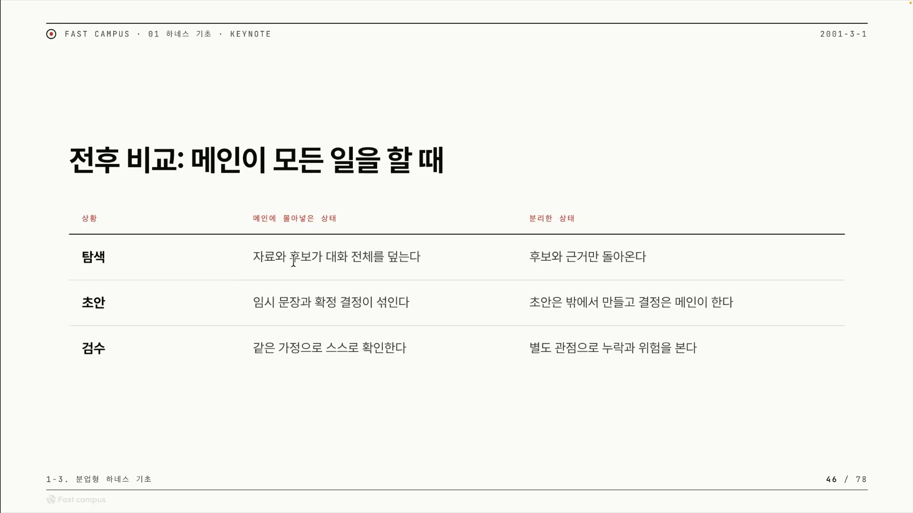
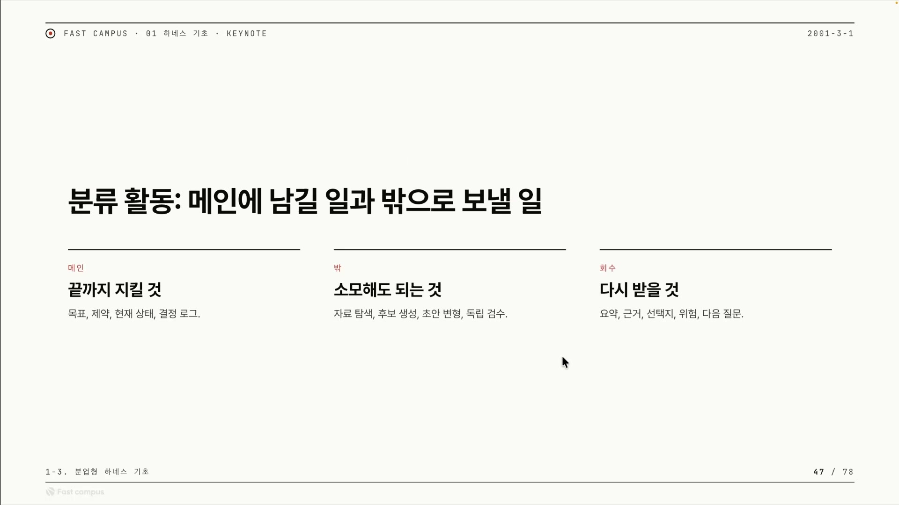
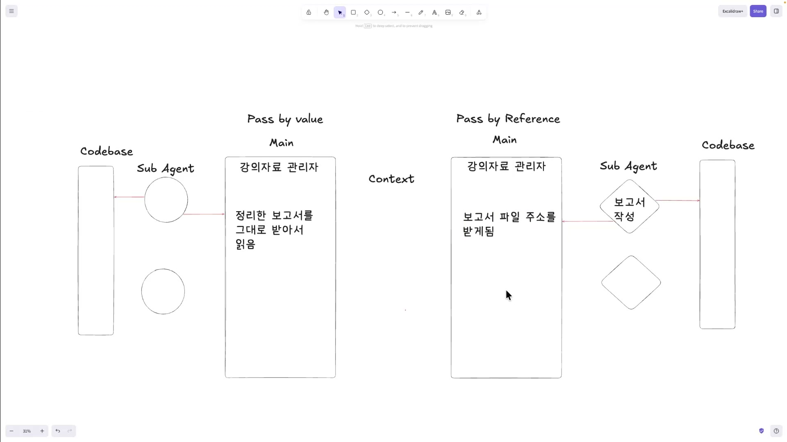
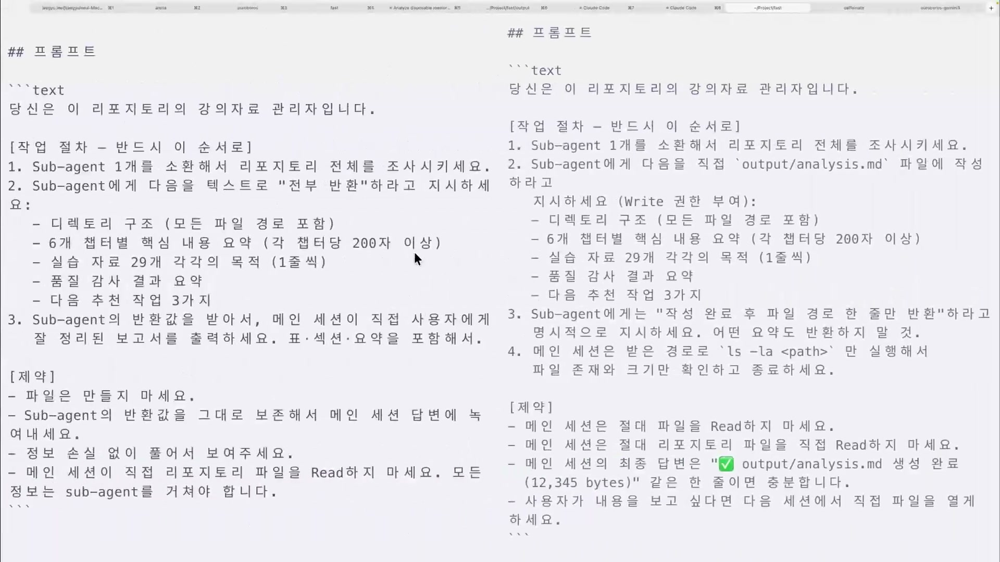
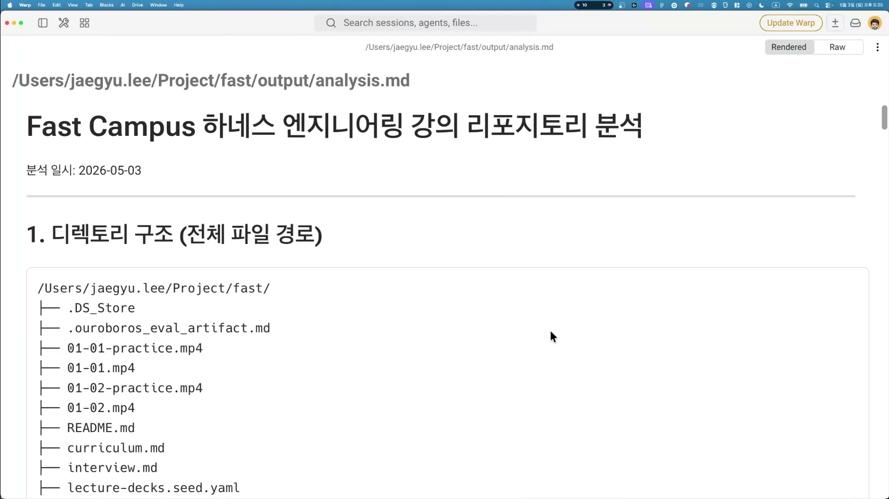
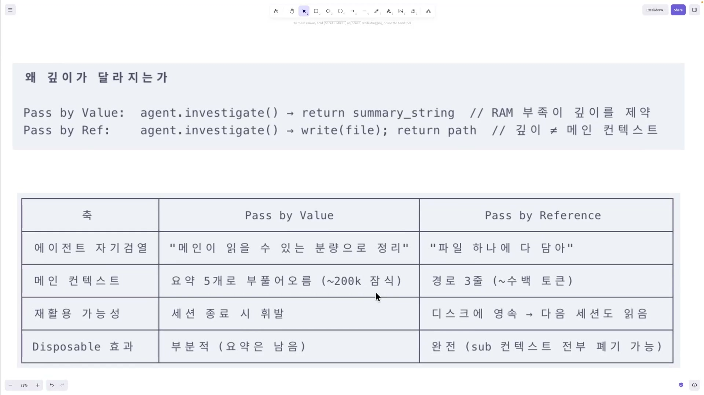
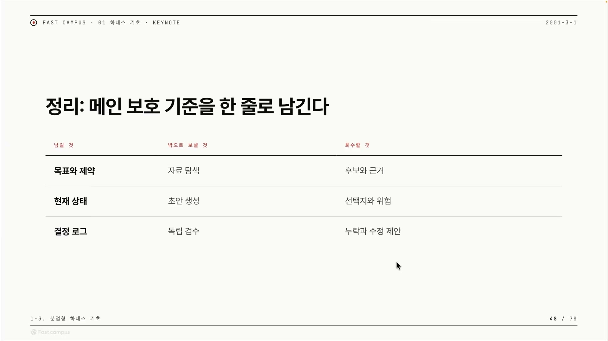

AI와 일을 시키다 보면 이상한 순간이 온다. 대화 초반엔 내가 시킨 걸 정확히 기억하던 모델이, 한참 자료를 뒤지고 후보를 비교하고 초안을 몇 번 고친 뒤로는 처음 정한 목표를 슬슬 놓치기 시작한다. 분명 같은 대화창인데, 뒤로 갈수록 판단이 무뎌진다. 이걸 두고 "메인 세션이 지친다"고 부른다.

지친다는 말은 비유처럼 들리지만, 실제로 일어나는 일은 아주 구체적이다. AI는 대화창 하나에 오간 모든 글자(내 지시, AI 답변, 붙여넣은 자료)를 한꺼번에 보면서 답한다. 이 "한 번에 보는 분량"을 컨텍스트(context)라고 하는데, 크기에 한계가 있다. 자료를 잔뜩 붙이고 시행착오를 거듭하면 그 한계를 향해 빠르게 차오르고, 정작 중요한 목표 · 제약이 잡다한 중간 과정에 묻힌다. 채워진 게 많을수록 중요한 게 흐려지는 것이다.

이 글은 그 문제를 어떻게 풀 것인가에 대한 정리다. 핵심은 두 가지다. 하나는 소모적인 일을 메인 바깥의 '일회성 메모리'로 내보내는 것, 다른 하나는 그렇게 내보낸 일의 결과를 메인이 어떤 형태로 돌려받느냐다.

## 메인 세션이 지치는 세 가지 이유

자료를 찾고(탐색), 여러 안을 뽑고(후보), 초안을 쓰고(생성), 다른 시각으로 검사하는(독립검수) 일은 공통점이 있다. 모두 중간 과정에서 글자를 잔뜩 만들어낸다는 점이다. 이런 일을 메인 대화창 안에서 직접 하면 부산물이 컨텍스트를 채워 결정을 밀어낸다. 구체적으로 세 갈래로 갈린다.

**첫째, 탐색이 누적된다.** 어떤 결정을 내리려면 보통 자료를 여러 개 찾아보고, 후보 A · B · C를 비교하고, 몇 번 고친다. 이 모든 중간 산물이 같은 대화창에 글자로 남는다. 자료 10개를 붙여넣으면 그 10개 본문이 통째로 컨텍스트에 들어가고, 비교한 대화도, 1차 · 2차 수정 이력도 다 남는다. 정작 필요한 건 "그래서 무엇으로 정했는가" 한 줄인데, 그 한 줄을 둘러싼 수십 배 분량의 탐색 찌꺼기가 컨텍스트를 채운다. 신호가 잡음에 파묻힌다.

**둘째, 결정이 묻힌다.** 목표와 제약은 보통 맨 처음에 들어간다. "X를 만들어라 / Y는 하지 마라" 같은 짧고 중요한 지시, 분량으로 치면 몇 줄이다. 그 뒤로 대화가 길어지면서 후속 대화, 안 되는 부분을 고치는 디버깅 기록, "이건 어때?" 하고 던졌다 버린 임시 아이디어가 계속 쌓인다. 처음의 목표 몇 줄은 그대로지만 뒤에 붙은 잡다한 내용의 총량이 훨씬 커진다. AI 입장에서는 방금 길게 나눈 디버깅 이야기가 처음 한 줄짜리 목표보다 더 도드라져 보여, 원래 목표를 덜 챙긴다.

여기엔 잘 알려진 현상이 하나 겹친다. Lost in the Middle이라 부르는 것으로, 긴 입력을 줄 때 모델이 맨 앞과 맨 뒤는 비교적 잘 활용하지만 가운데에 놓인 정보는 상대적으로 잘 놓치는 경향이다. 처음에 넣은 목표 · 제약이 대화가 길어지면서 입력의 '가운데'로 밀려나면, 바로 그 위치 때문에 더 쉽게 흐려진다. 강의가 "Lost in the Middle부터 시작해서 지시사항을 까먹는 현상을 막는다"고 한 게 이 의미다.

**셋째, 검수가 섞인다.** 결과물은 어떤 가정(assumption)을 깔고 만들어진다. 예를 들어 "사용자는 항상 로그인한 상태다"라고 전제하고 무언가를 만들었다고 하자. 같은 대화창에서 "이거 검토해줘"라고 하면, AI는 그 가정이 이미 머릿속에 들어 있는 상태로 검토한다. 가정 자체가 틀렸을 가능성은 검토 대상에서 빠진다. 만든 사람과 검수하는 사람이 같은 전제를 공유하기 때문이다. 자기가 쓴 글을 자기가 교정 볼 때 같은 오타를 계속 못 보고 넘기는 것과 똑같다. 전제를 공유하지 않는 제3의 시각이 있어야 빠진 부분이 보인다.

이 셋은 "메인이 모든 일을 떠안았을 때"와 "분리한 상태"를 나란히 놓으면 더 선명해진다.



| 상황 | 메인에 몰아넣은 상태 | 분리한 상태 |
| --- | --- | --- |
| 탐색 | 자료와 후보가 대화 전체를 덮는다 | 후보와 근거만 돌아온다 |
| 초안 | 임시 문장과 확정 결정이 섞인다 | 초안은 밖에서 만들고 결정은 메인이 한다 |
| 검수 | 같은 가정으로 스스로 확인한다 | 별도 관점으로 누락과 위험을 본다 |

왼쪽 열이 방금 본 세 문제고, 오른쪽 열은 자료 · 후보 찾기, 초안 쓰기, 검수를 바깥에 맡기고 메인은 근거와 최종본만 받아 결정만 하는 상태다. 그 '바깥'을 무엇으로 보느냐가 다음 개념이다.

## 일회성 메모리: 메인은 결정하고, 보조는 소모한다

강의가 꼽은 이 클립의 핵심 개념은 한 문장이다. **메인은 결정하고, 보조 세션(서브 에이전트)으로 일회성 메모리(disposable memory)를 쓴다.**

등장인물은 둘이다. 메인 세션은 내가 직접 대화하는 본 채팅, 목표 · 제약을 끝까지 기억해야 하는 판단의 자리다. 보조 세션(서브 에이전트)은 메인이 따로 불러내는 별도의 AI 일꾼, 자료를 뒤지고 시행착오를 겪는 소모의 자리다. 핵심은 역할을 갈라놓는 것이다. 결정은 메인이, 소모는 보조가 맡는다.

왜 '일회성', 버려도 되는 메모리라고 부르는가. 메인이 보조에게 "이 코드베이스를 분석해줘" 같은 일을 시키면, 보조는 자기만의 별도 컨텍스트에서 자료를 뒤지고 후보를 비교하고 막다른 길에 들어갔다 되돌아오는 온갖 탐색을 한다. 일이 끝나면 보조는 정리된 결론만 메인에 건넨다. 그 과정에서 쌓인 잡다한 기억, 어떤 파일을 몇 번 잘못 열어봤는지, 어떤 가설을 세웠다 버렸는지는 보조 세션과 함께 그냥 버려진다. 한 번 쓰고 버리는 종이컵 같은 것이라 일회성(disposable) 메모리다. 덕분에 메인의 깨끗한 칸에는 탐색의 찌꺼기가 묻지 않고 결론만 들어온다.

이 구도가 앞의 세 문제와 일대일로 맞아떨어진다. 탐색이 누적되는 문제는 탐색을 메인 밖으로 내보내 푼다. 결정이 묻히는 문제는 메인에 결정만 둬서 푼다. 검수가 섞이는 문제는 과정을 모르는 별도 세션이 검수하게 해서 푼다. 세 문제 모두 "소모적인 일을 메인 밖 일회성 메모리로 내보낸다"는 한 가지 동작으로 해소된다.

## 무엇을 남기고 무엇을 위임하는가

그렇다면 무엇을 메인에 두고 무엇을 보조에 넘기는가. 강의는 이걸 세 칸으로 나눈다.



| 구분 | 무엇을 | 구체적으로 |
| --- | --- | --- |
| 메인에 남길 것 | 작업이 끝날 때까지 놓치면 안 되는 것 | 목표, 제약, 현재 상태, 결정 로그 |
| 밖(서브)으로 보낼 것 | 맥락을 많이 쓰니 내보내 소모시킬 것 | 자료 탐색, 후보 생성, 초안 변형, 독립 검수 |
| 회수할 것 | 서브가 끝낸 뒤 돌려받을 것 | 요약, 근거, 선택지, 위험, 다음 질문 |

강의는 "요즘 원밀리언 컨텍스트"라고 표현한다. 약 100만 토큰까지 기억할 수 있는 큰 맥락 창이다. 그런데 그 정도로 큰 컨텍스트조차도 잡다한 게 쌓이면 정작 중요한 목표를 놓친다. 칸이 커진다고 문제가 사라지지 않는다. 그래서 놓치면 안 되는 핵심만 메인에 상주시키고, 소모해도 되는 것은 서브에 넘긴 뒤 마지막 결과만 받아온다. 메인은 직접 일하는 사람이 아니라 서브들을 부리고(orchestration) 받아온 값을 정리하는 사람에 가까워진다.

그런데 표의 세 번째 칸, '회수'에서 새 고민이 생긴다. 서브가 일을 다 했다고 치자. 같은 결과라도 건네는 방식에 따라 메인 컨텍스트를 아끼는 정도가 달라진다. 강의는 "우로보로스는 MCP를 기반으로 다음 질문을 받아오기도 한다"는 말을 스치듯 던지는데, 회수 방식이 한 가지가 아니라는 맥락의 예시로 보면 된다. 결과를 어떤 형태로 받을 것이냐, 여기서부터가 갈린다.

## 두 가지 회수 방식: 값으로 받느냐, 주소로 받느냐

강의는 메인 세션에 '강의 자료 관리자'라는 역할을 주고, 실제 코드 분석은 서브 에이전트에게 시키는 실험을 짠다. 서브가 코드베이스를 분석해 결과를 메인에 보낸다. 여기까지는 두 방식이 똑같다. 갈리는 건 "그 결과물을 메인이 어떤 형태로 받느냐"다. 강의는 화이트보드에 왼쪽=Pass by Value, 오른쪽=Pass by Reference 두 그림을 나란히 그린다.

**Pass by Value의 value는 "내용 그 자체"를 뜻한다.** 서브가 코드베이스를 분석해 정리한 보고서를, 그 글자 전체를 그대로 메인에게 돌려준다. 메인 컨텍스트에 보고서 본문 전체가 글자 그대로 쌓이는 구조다. "## 디렉토리 구조 ... ## 챕터별 요약 ... ## 품질 검사 결과 ..." 수천에서 수만 자에 이르는 보고서 전문이 통째로 들어온다. 메인은 이 긴 텍스트를 처음부터 끝까지 읽으며 작업한다. 강의도 실행 중에 "메인이 텍스트를 읽으면서 진행하다 보니 시간이 좀 더 걸린다"고 관찰한다.

**Pass by Reference의 reference는 "내용 대신, 그 내용이 있는 위치를 가리키는 것"을 뜻한다.** 서브가 보고서를 파일로 디스크에 저장한 뒤, 그 파일의 주소(경로)만 메인에게 돌려준다. 메인 컨텍스트에 실제로 들어가는 건 `reports/codebase-analysis.md` 같은 짧은 경로 한 줄이다. 보고서 본문 수만 자가 아니라 주소 한 줄 수십 자만 들어간다. 이것이 두 방식의 가장 눈에 띄는 구조적 차이다.



이름 자체는 프로그래밍에서 빌려온 정식 용어다. 함수에 값을 넘길 때 값 자체를 복사해 넘기느냐(value), 값이 저장된 메모리 주소를 넘기느냐(reference)를 가리킨다. 강의는 이걸 '결과를 텍스트로 통째로 주느냐, 파일 주소로 주느냐'에 빗대 쓴다. 정확히는 메모리 주소가 아니라 디스크 파일 경로지만, "내용 vs 위치"라는 구도는 똑같다.

## 트레이드오프: 깎임과 읽기 비용

두 방식의 첫 갈림길은 메모리 프레셔(memory pressure), 메모리 압박이다. 메인도 서브도 컨텍스트에 한계가 있다. Value 방식에서 서브는 이런 압박을 느낀다. "내가 모든 자료를 다 줄 수는 없겠다." 조사한 내용을 전부 텍스트로 메인에 넘기면 메인 컨텍스트가 확 차버리기 때문이다. 그래서 서브는 자세히 쓰고 싶어도 메인 자리를 생각해 스스로 분량을 줄이고, 보고서가 트림(trim), 즉 깎여서 들어온다.

반대로 Reference는 메인에 주소 한 줄만 넣으므로 아무리 보고서가 길어도 메인 압박이 없다. 서브는 분량 걱정 없이 마음껏 자세히 쓴다. 강의의 정리로는 "Value는 메인이 읽을 수 있는 분량으로 서브가 자기 검열을 한다, Reference는 파일 하나에 다 담아버리니 깊이 제한이 없다."

여기서 자연스러운 반론이 나온다. Reference가 다 좋기만 한가. 강의는 한 가지 비용을 솔직히 인정한다. Value는 보고서가 이미 메인 안에 텍스트로 들어와 있어서 따로 읽어올 게 없다. 하지만 Reference는 메인이 받은 게 주소뿐이라, 내용이 필요한 순간 그 파일을 직접 read(디스크 읽기)해야 한다. 디스크를 읽어오는 작업이라 그 순간엔 토큰을 더 쓸 수도 있다. "메인에 미리 안 채우는" 대신 "필요할 때 읽는" 비용으로 미뤄둔 셈이다.

그런데도 강의는 장기적으로 Reference가 유리하다고 본다. 이유는 영속성이다. 보고서가 디스크 파일로 남으니 메인 세션이 죽어도 파일은 그대로다. 반복 작업이나 다음 세션에서 다시 읽어 재활용할 수 있다. 반면 Value는 보고서가 메인 대화 안에만 있어서 메인 세션이 죽으면 휘발된다. 같은 결과가 또 필요하면 서브를 다시 소환해 처음부터 시켜야 한다.

## 실제로 두 방식을 나란히 돌려보면

개념만으로는 체감이 안 되니, 강의는 같은 일을 두 방식으로 나란히 돌린다. 양쪽에 줄 프롬프트는 같은 뼈대를 갖는다. 역할(이 리포지토리의 강의 자료 관리자), 작업 절차, 제약(금지사항), 출력 형식. 마크다운 하네스에서 배운 "규칙을 미리 못 박아두기"를 그대로 적용했다.



두 프롬프트의 결정적 차이는 "결과를 어떻게 내놓을지" 한 군데다. 왼쪽(Value)은 서브에게 리포지토리 전체를 조사시킨 뒤 디렉토리 구조, 챕터별 요약, 실습 자료별 목적, 품질 감사 결과, 다음 추천 작업 3가지를 모두 텍스트로 전부 반환하라고 한다. 메인은 그 반환값으로 직접 보고서를 출력한다. 제약은 "파일을 만들지 말 것, 메인은 리포지토리 파일을 직접 Read하지 말 것." 오른쪽(Reference)은 같은 항목들을 서브가 직접 `output/analysis.md` 파일에 작성하게 하고, 서브에게는 "작성 완료 후 파일 경로 한 줄만 반환"하라고 명시한다. 메인은 그 경로로 파일 존재와 크기만 확인하고, 최종 답변은 "생성 완료 (12,345 bytes)" 같은 한 줄이면 충분하다. 왼쪽은 메인이 내용을 통째로 떠안고, 오른쪽은 영수증만 받는 구조다.

여기서 강의는 의도적으로 원밀리언이 아니라 컨텍스트 창이 더 작은 Sonnet을 골랐다. 창이 작아야 "어느 방식이 컨텍스트를 얼마나 먹는지"가 눈에 띄게 드러나기 때문이다. 양쪽을 동시에 띄우고 기다린 끝에, 둘 다 "Fast Campus 하네스 엔지니어링 강의 리포지토리 분석"이라는 꽤 자세한 보고서를 만들어냈다.



보고서는 디렉토리 구조(전체 파일 경로 트리), 모듈별 강의 밀도 · 타이밍 검증, 클립별 흐름 감사 결과, 다음 추천 작업 3가지까지 담았다. 두 방식 모두 비슷한 수준의 보고서를 냈다. 핵심은 그걸 만드는 데 메인 컨텍스트를 얼마나 썼느냐다.

| 항목 | Pass by Value | Pass by Reference |
| --- | --- | --- |
| 메인 컨텍스트 사용량 | 16% | 12% |
| 토큰 사용량 | 183K | 100K |
| 메인이 받는 것 | 조사 내용 텍스트 전부 | 파일 주소 한 줄 |
| 보고서 품질(이번 실험) | 비슷함 | 비슷함 |

참조 쪽이 8만 조각 이상 덜 쓰고도 같은 일을 해냈다. 텍스트 본문을 메인이 떠안지 않았기 때문이다. 다만 강의는 단서를 분명히 단다. "이번엔 위임한 작업이 그렇게 복잡하지 않아서 결과가 비슷하게 나왔다." 차이가 16% 대 12%로 작아 보이는 건 두 방식이 본질적으로 비슷해서가 아니라 이번 과제가 가벼웠기 때문이다. 무겁고 자세한 보고서가 필요할수록 격차는 벌어진다. Value는 메인 컨텍스트 한계 때문에 보고서를 더 깊게 쓰는 데 제약이 걸리지만, Reference는 서브가 파일에 마음껏 길게 써도 메인 컨텍스트엔 영향이 없기 때문이다.

## 왜 '깊이'가 갈리는가

차이의 뿌리는 컨텍스트의 '위치'에 있다. 강의는 두 방식을 거의 코드 한 줄로 압축한다.

```
Value:     agent.investigate() → return summary_string       // RAM(메인 컨텍스트) 부족이 깊이를 제약
Reference: agent.investigate() → write(file); return path    // 깊이 ≠ 메인 컨텍스트
```

앞은 조사한 결과를 요약 문자열로 만들어 메인에 그대로 돌려주고, 뒤는 서브가 파일에 직접 쓴 다음 메인엔 그 경로만 돌려준다.

이 한 줄 차이가 깊이를 결정한다. Value는 결과를 통째로 메인 대화창에 집어넣어야 하는데, 메인 창은 이미 목표와 제약, 앞선 대화로 차 있다. 그래서 "모든 자료를 줄 수 없겠다"는 압박이 서브에게 생기고, 보고서가 깎여 들어온다. 깊이가 메인 창 크기에 발목 잡히는 것이다. Reference는 서브가 보고서를 파일에 쓰고 메인엔 경로만 넘긴다. **서브가 파일에 10페이지를 쓰든 50페이지를 쓰든, 메인 대화창에 들어가는 건 `output/analysis.md` 같은 짧은 경로 한 줄뿐이다.** "더 자세히 써라"가 메인에 전혀 부담을 주지 않는다. 깊이와 메인 부담이 분리된 것, 이게 두 방식의 깊이가 갈리는 근본 이유다.



| 축 | Pass by Value | Pass by Reference |
| --- | --- | --- |
| 에이전트 자기검열 | "메인이 읽을 수 있는 분량으로 정리" | "파일 하나에 다 담아" |
| 메인 컨텍스트 | 요약 5개로 부풀어오름 (~200k 잠식) | 경로 3줄 (~수백 토큰) |
| 재활용 가능성 | 세션 종료 시 휘발 | 디스크에 영속 → 다음 세션도 읽음 |
| Disposable 효과 | 부분적 (요약은 남음) | 완전 (서브 컨텍스트 전부 폐기 가능) |

표의 마지막 줄이 미묘하다. 둘 다 일회성 메모리 효과는 있지만 정도가 다르다. Reference는 결과를 파일에 박아두니 서브의 작업 기억을 통째로 버려도 된다(완전한 디스포저블). Value는 요약이 메인에 남는다(부분적). 그런데 이 '요약이 남는다'가 마냥 좋은 건 아니다.

여기서 흔히 나오는 반문 하나. "Reference도 결국 파일을 읽어 다 불러오면 Value랑 똑같은 거 아니냐?" 답은 "앞으로 어떤 작업이 필요할지 모른다"는 데 있다. Value는 조사한 걸 전부 메인에 출력해버려서, 그 안엔 내가 원하는 것도 있고 원하지 않는 것도 섞여 있다. 세 가지만 필요한데 나머지까지 다 메인 토큰을 잡아먹은 셈이다. Reference라면 파일이 디스크에 있으니, 익스플로어(explore) 에이전트에게 "이 파일에서 다음 추천 작업 3가지만 가져와" 하고 읽는 일조차 위임할 수 있다. 그러면 필요한 3개만 메인으로 돌아오고 나머지는 메인 토큰을 안 쓴다. 강의가 말한 "프루걸하게(frugal, 아껴 쓰듯) 읽는 작업조차 서브에게 시킨다"가 이 의미다.

그렇다고 강의가 Reference를 일방적으로 띄우진 않는다. 균형을 잡는 한마디가 있다. 둘 다 디스포저블 효과는 있지만, 요약이 남았을 때 "정말 찾은 걸 다 가져왔나"는 의심이 남는다. 요약은 본질적으로 정보를 버리는 행위라서, 서브가 찾은 것 중 무엇을 빠뜨렸는지 메인은 알 수 없다. 이게 요약의 정보 손실이다. 그래서 일회성 메모리를 쓸 때는 서브가 일을 제대로 했는지 체크하는 것, 그리고 결과를 어떤 형태로 넘길지 정하는 것이 함께 중요하다.

## 결론: ROI를 가르는 건 '결과를 어디에 두느냐'

강의 마무리에서 강사가 못 박는 결론은 이렇다. **서브 에이전트의 ROI는 결과를 어떻게(어디에) 주느냐로 결정된다.** ROI는 투자 대비 효과인데, 여기서는 "서브에게 일을 시킨 만큼 메인이 얼마나 깔끔하고 효율적으로 남느냐"로 읽으면 된다. 같은 일을 시켜도 결과를 메인 창에 쏟느냐 파일에 두고 경로만 주느냐에 따라 메인의 부담과 재활용성이 완전히 달라진다.

이 차이가 두 패턴으로 정리된다.

밸류 패턴은 서브 에이전트를 검색 함수처럼 쓴다. "검색해줘" 하고 부르면 "여기 결과 다 있어" 하고 답을 통째로 돌려주는 모양이 함수 호출과 반환값을 닮았다. 메인이 받은 텍스트 덩어리를 직접 읽고 종합하고 판단하는 주체로 남는다. 단점은 그 텍스트가 전부 메인 컨텍스트에 쌓이고, 서브가 자기 검열로 깊이를 깎고, 세션을 끄면 휘발된다는 것이다.

레퍼런스 패턴은 서브 에이전트를 파일의 저자로 쓴다. 서브가 조사 결과를 직접 파일에 써서 저장하고 메인엔 주소 한 줄만 준다. 여기서 메인의 역할이 바뀐다. 내용을 직접 다 읽고 종합하는 게 아니라, "어떤 파일을 만들어라 → 그중 추천 작업 3개만 다시 읽어와라" 식으로 일을 지시하고 흐름을 지휘하는 오케스트레이터가 된다. 필요한 부분만 골라 읽는 것조차 또 다른 서브에게 시켜, 메인은 토큰을 거의 쓰지 않고 진행한다. 장점은 메인 컨텍스트 절약, 깊은 보고서, 디스크 영속에 따른 재활용이다. 강사도 "보통 이런 형태를 많이 좋아한다"고 했다.

마지막으로 강의는 분업의 실천 기준을 한 표로 남긴다.



| 남길 것 (메인에 끝까지 보존) | 밖으로 보낼 것 (서브에 위임, 소모해도 됨) | 회수할 것 (서브에게서 받아올 것) |
| --- | --- | --- |
| 목표와 제약 | 자료 탐색 | 후보와 근거 |
| 현재 상태 | 초안 생성 | 선택지와 위험 |
| 결정 로그 | 독립 검수 | 누락과 수정 제안 |

남길 것은 원밀리언 컨텍스트라도 끝까지 놓치면 안 되는 것, 목표 · 제약과 지금 어디까지 왔는지, 무엇을 왜 결정했는지다. 이걸 메인이 직접 쥐고 있어야 Lost in the Middle을 막는다. 밖으로 보낼 것은 컨텍스트를 많이 잡아먹고 버려도 되는 일, 자료 탐색과 초안 생성, 독립 검수다. 회수할 것은 서브에게서 받아와야 하는 알맹이, 후보와 근거, 선택지와 위험, 누락과 수정 제안이다. 그리고 이 알맹이를 텍스트로 받느냐 파일 주소로 받느냐가 바로 두 패턴이다.

실무에서 어느 쪽을 고를지는 단순하다. 한 번 묻고 답 받으면 끝나는 가벼운 조회, 다시 안 쓸 일회성이면 밸류 패턴이 낫다. 파일을 만들고 다시 읽는 수고가 오히려 낭비다(강사가 실험한 작업도 그래서 두 방식 결과가 비슷했다). 반대로 깊은 보고서가 필요하거나, 결과를 다음 세션에서도 또 써야 하거나, 같은 자료로 작업이 계속 이어질 일이면 레퍼런스 패턴이다.

정리하면, 일을 넘기는 순간 끝이 아니다. 분업의 진짜 기초는 '누구한테 시키냐'가 아니라 '결과를 어디에 두고 어떻게 회수할지'를 먼저 설계하는 데 있다. 그게 메인 세션을 지치지 않게 지키는 방법이다.
